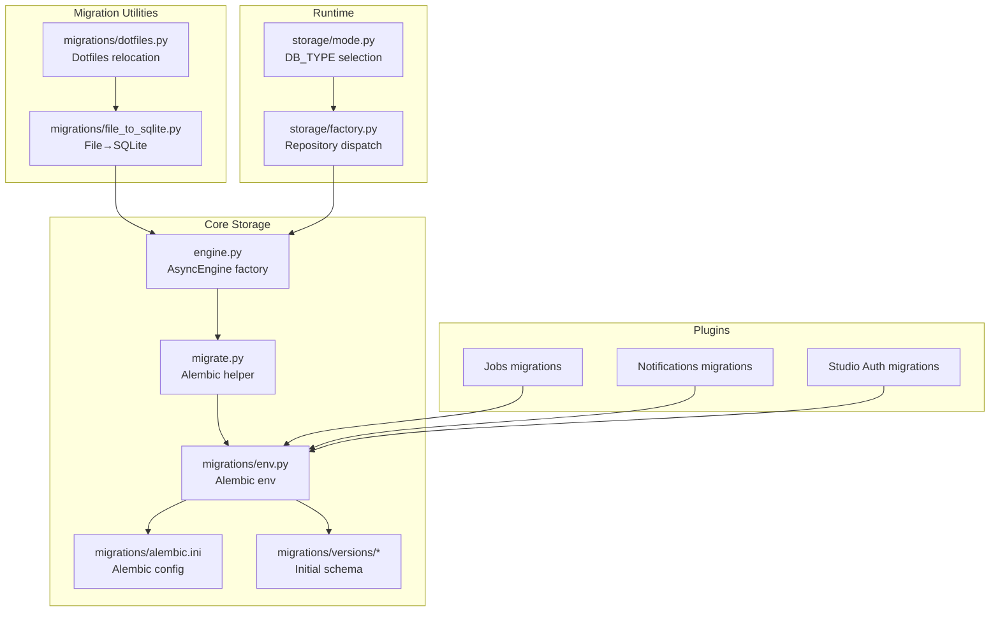
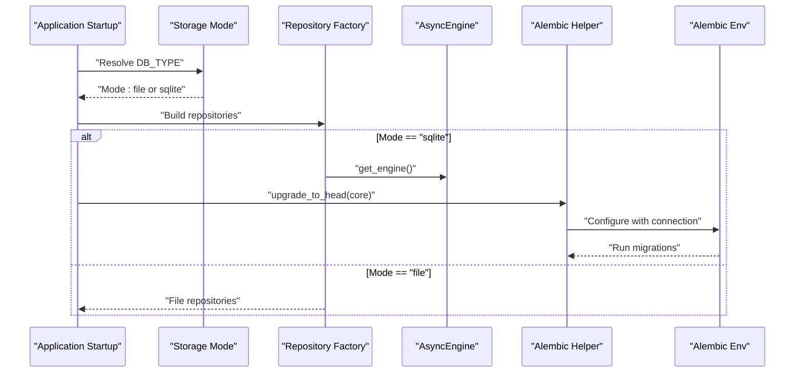
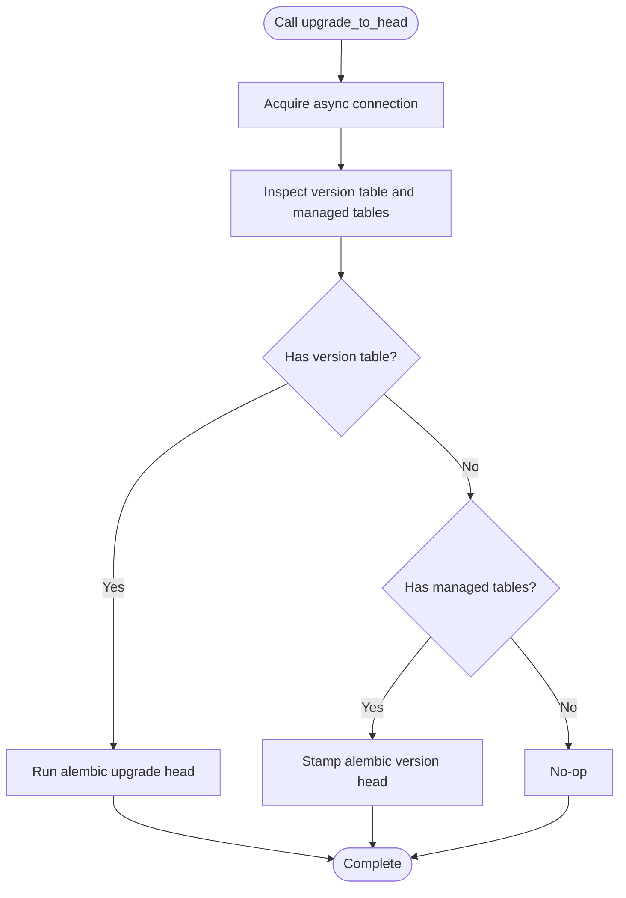
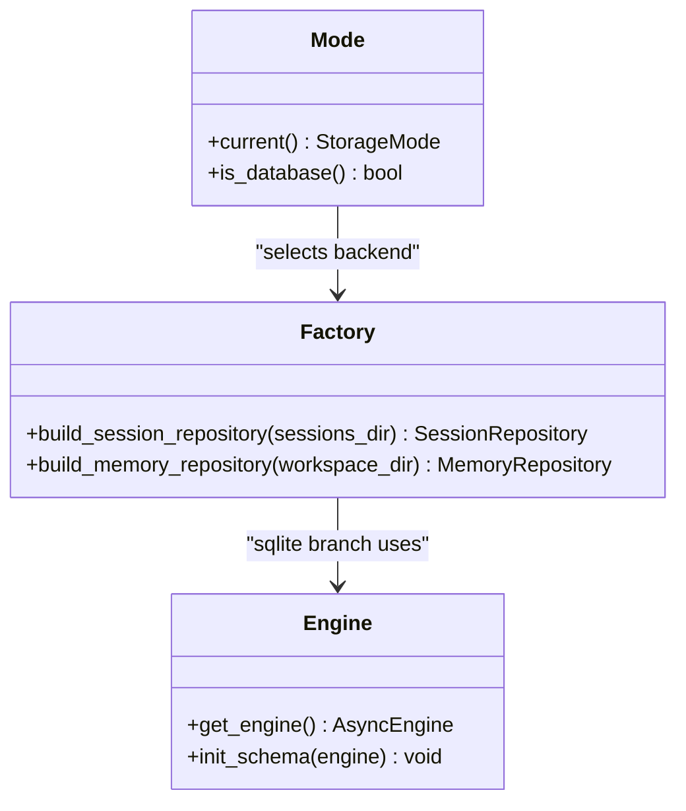
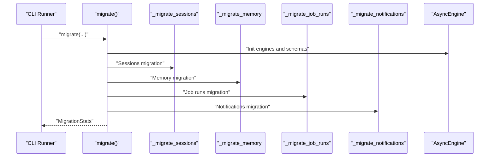
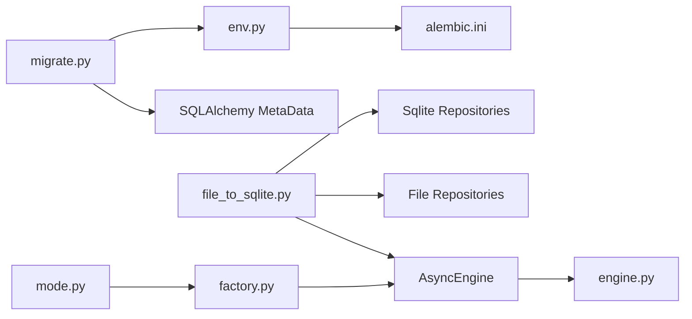

# Migration System

<cite>
**Referenced Files in This Document**
- [migrate.py](file://src/ark_agentic/core/storage/database/migrate.py)
- [env.py](file://src/ark_agentic/core/storage/database/migrations/env.py)
- [alembic.ini](file://src/ark_agentic/core/storage/database/migrations/alembic.ini)
- [engine.py](file://src/ark_agentic/core/storage/database/engine.py)
- [mode.py](file://src/ark_agentic/core/storage/mode.py)
- [factory.py](file://src/ark_agentic/core/storage/factory.py)
- [file_to_sqlite.py](file://src/ark_agentic/migrations/file_to_sqlite.py)
- [dotfiles.py](file://src/ark_agentic/migrations/dotfiles.py)
- [20260505_0001_initial_core_schema.py](file://src/ark_agentic/core/storage/database/migrations/versions/20260505_0001_initial_core_schema.py)
- [20260505_0001_initial_jobs_schema.py](file://src/ark_agentic/plugins/jobs/storage/migrations/versions/20260505_0001_initial_jobs_schema.py)
- [20260505_0001_initial_notifications_schema.py](file://src/ark_agentic/plugins/notifications/storage/migrations/versions/20260505_0001_initial_notifications_schema.py)
- [20260505_0001_initial_studio_auth_schema.py](file://src/ark_agentic/plugins/studio/services/auth/storage/migrations/versions/20260505_0001_initial_studio_auth_schema.py)
- [test_migrate.py](file://tests/unit/core/storage/database/test_migrate.py)
- [test_migrations_core.py](file://tests/unit/core/storage/database/test_migrations_core.py)
- [test_migrations_lint.py](file://tests/unit/core/storage/database/test_migrations_lint.py)
- [test_migrate_file_to_sqlite.py](file://tests/integration/test_migrate_file_to_sqlite.py)
</cite>

## Table of Contents
1. [Introduction](#introduction)
2. [Project Structure](#project-structure)
3. [Core Components](#core-components)
4. [Architecture Overview](#architecture-overview)
5. [Detailed Component Analysis](#detailed-component-analysis)
6. [Dependency Analysis](#dependency-analysis)
7. [Performance Considerations](#performance-considerations)
8. [Troubleshooting Guide](#troubleshooting-guide)
9. [Conclusion](#conclusion)
10. [Appendices](#appendices)

## Introduction
This document describes the migration system in the Ark Agentic storage layer. It covers the Alembic-based schema migration framework, migration script generation, and database schema evolution. It also documents the migration workflow for upgrading storage schemas, data transformation procedures, and rollback strategies. Special emphasis is placed on utilities that convert file-based data to SQLite format and manage dotfiles migration. Practical examples illustrate creating new migrations, applying schema changes, and handling migration failures. Migration testing strategies, production deployment procedures, and backward compatibility considerations are addressed, including how storage modes influence migration requirements and how data is preserved during backend switching.

## Project Structure
The migration system spans several areas:
- Alembic configurations and environments for core and plugin domains
- Programmatic Alembic helpers for idempotent upgrades
- One-shot migration utilities for moving from file backend to SQLite and relocating dotfiles
- Storage mode selection and repository factory that determines backend behavior

**Diagram sources**
- [engine.py:1-164](file://src/ark_agentic/core/storage/database/engine.py#L1-L164)
- [migrate.py:1-94](file://src/ark_agentic/core/storage/database/migrate.py#L1-L94)
- [env.py:1-61](file://src/ark_agentic/core/storage/database/migrations/env.py#L1-L61)
- [alembic.ini:1-46](file://src/ark_agentic/core/storage/database/migrations/alembic.ini#L1-L46)
- [20260505_0001_initial_core_schema.py](file://src/ark_agentic/core/storage/database/migrations/versions/20260505_0001_initial_core_schema.py)
- [20260505_0001_initial_jobs_schema.py](file://src/ark_agentic/plugins/jobs/storage/migrations/versions/20260505_0001_initial_jobs_schema.py)
- [20260505_0001_initial_notifications_schema.py](file://src/ark_agentic/plugins/notifications/storage/migrations/versions/20260505_0001_initial_notifications_schema.py)
- [20260505_0001_initial_studio_auth_schema.py](file://src/ark_agentic/plugins/studio/services/auth/storage/migrations/versions/20260505_0001_initial_studio_auth_schema.py)
- [file_to_sqlite.py:1-398](file://src/ark_agentic/migrations/file_to_sqlite.py#L1-L398)
- [dotfiles.py:1-119](file://src/ark_agentic/migrations/dotfiles.py#L1-L119)
- [mode.py:1-32](file://src/ark_agentic/core/storage/mode.py#L1-L32)
- [factory.py:1-68](file://src/ark_agentic/core/storage/factory.py#L1-L68)

**Section sources**
- [engine.py:1-164](file://src/ark_agentic/core/storage/database/engine.py#L1-L164)
- [migrate.py:1-94](file://src/ark_agentic/core/storage/database/migrate.py#L1-L94)
- [env.py:1-61](file://src/ark_agentic/core/storage/database/migrations/env.py#L1-L61)
- [alembic.ini:1-46](file://src/ark_agentic/core/storage/database/migrations/alembic.ini#L1-L46)
- [mode.py:1-32](file://src/ark_agentic/core/storage/mode.py#L1-L32)
- [factory.py:1-68](file://src/ark_agentic/core/storage/factory.py#L1-L68)

## Core Components
- Alembic helper for idempotent upgrades and stamping
  - Provides programmatic control over Alembic via a shared AsyncEngine connection
  - Supports stamp-or-upgrade semantics to handle legacy deployments
- Alembic environment and configuration
  - Core env integrates with programmatic connections and CLI autogenerate
  - Alembic ini defines script location, file naming, and logging
- Storage mode and repository factory
  - Selects backend based on DB_TYPE
  - Dispatches repositories accordingly (file vs SQLite)
- Migration utilities
  - File-to-SQLite conversion utility for sessions, memory, job runs, and notifications
  - Dotfiles relocation utility for agent state markers

**Section sources**
- [migrate.py:1-94](file://src/ark_agentic/core/storage/database/migrate.py#L1-L94)
- [env.py:1-61](file://src/ark_agentic/core/storage/database/migrations/env.py#L1-L61)
- [alembic.ini:1-46](file://src/ark_agentic/core/storage/database/migrations/alembic.ini#L1-L46)
- [mode.py:1-32](file://src/ark_agentic/core/storage/mode.py#L1-L32)
- [factory.py:1-68](file://src/ark_agentic/core/storage/factory.py#L1-L68)
- [file_to_sqlite.py:1-398](file://src/ark_agentic/migrations/file_to_sqlite.py#L1-L398)
- [dotfiles.py:1-119](file://src/ark_agentic/migrations/dotfiles.py#L1-L119)

## Architecture Overview
The migration architecture separates concerns across three layers:
- Schema evolution layer: Alembic manages database schema changes per domain
- Runtime layer: Storage mode and repository factory choose backend at runtime
- Data migration layer: One-shot utilities transform persisted data from file to SQLite

**Diagram sources**
- [mode.py:19-32](file://src/ark_agentic/core/storage/mode.py#L19-L32)
- [factory.py:30-68](file://src/ark_agentic/core/storage/factory.py#L30-L68)
- [engine.py:108-150](file://src/ark_agentic/core/storage/database/engine.py#L108-L150)
- [migrate.py:28-80](file://src/ark_agentic/core/storage/database/migrate.py#L28-L80)
- [env.py:36-61](file://src/ark_agentic/core/storage/database/migrations/env.py#L36-L61)

## Detailed Component Analysis

### Alembic Helper: Idempotent Upgrade and Stamp
The helper centralizes Alembic invocation with idempotent behavior:
- Determines whether to upgrade or stamp head based on presence of version tables and managed tables
- Accepts a shared AsyncEngine connection and writes migrations to domain-specific version tables
- Provides a fast-path for testing via create_all

**Diagram sources**
- [migrate.py:28-80](file://src/ark_agentic/core/storage/database/migrate.py#L28-L80)

**Section sources**
- [migrate.py:1-94](file://src/ark_agentic/core/storage/database/migrate.py#L1-L94)

### Alembic Environment and Configuration
The environment supports two modes:
- Programmatic mode: Receives a pre-opened connection and target metadata attributes
- CLI mode: Loads metadata from imports for autogenerate diffs against a default SQLite URL

Key behaviors:
- Uses batch-alter-table rendering for SQLite to handle ALTER limitations
- Supports domain-specific version tables

**Section sources**
- [env.py:1-61](file://src/ark_agentic/core/storage/database/migrations/env.py#L1-L61)
- [alembic.ini:1-46](file://src/ark_agentic/core/storage/database/migrations/alembic.ini#L1-L46)

### Storage Modes and Backend Switching
Storage mode selection influences migration requirements:
- file mode: No SQL engine; repositories operate on filesystem paths
- sqlite mode: SQL engine is required; Alembic upgrades are executed

The factory enforces mode-dependent behavior and validates required paths for file mode.

**Diagram sources**
- [mode.py:19-32](file://src/ark_agentic/core/storage/mode.py#L19-L32)
- [factory.py:30-68](file://src/ark_agentic/core/storage/factory.py#L30-L68)
- [engine.py:108-150](file://src/ark_agentic/core/storage/database/engine.py#L108-L150)

**Section sources**
- [mode.py:1-32](file://src/ark_agentic/core/storage/mode.py#L1-L32)
- [factory.py:1-68](file://src/ark_agentic/core/storage/factory.py#L1-L68)
- [engine.py:1-164](file://src/ark_agentic/core/storage/database/engine.py#L1-L164)

### File-to-SQLite Migration Utility
This utility performs a one-shot, idempotent migration from file backend to SQLite across multiple domains:
- Sessions: Migrates session metadata and messages
- Memory: Migrates MEMORY.md content and last dream markers
- Job runs: Migrates per-user, per-job dotfiles into the jobs table
- Notifications: Supports both per-agent and flat layouts

Idempotency:
- Skips rows whose primary keys already exist in the target tables
- Dry-run mode reports counts without writing

**Diagram sources**
- [file_to_sqlite.py:315-351](file://src/ark_agentic/migrations/file_to_sqlite.py#L315-L351)
- [file_to_sqlite.py:77-122](file://src/ark_agentic/migrations/file_to_sqlite.py#L77-L122)
- [file_to_sqlite.py:127-171](file://src/ark_agentic/migrations/file_to_sqlite.py#L127-L171)
- [file_to_sqlite.py:176-229](file://src/ark_agentic/migrations/file_to_sqlite.py#L176-L229)
- [file_to_sqlite.py:234-310](file://src/ark_agentic/migrations/file_to_sqlite.py#L234-L310)

**Section sources**
- [file_to_sqlite.py:1-398](file://src/ark_agentic/migrations/file_to_sqlite.py#L1-L398)

### Dotfiles Migration Utility
This utility relocates per-(user, job) dotfiles from the legacy memory workspace to the new job runs directory:
- Walks agent workspaces and moves .last_job_<job_id> files
- Idempotent: silently skips missing sources or existing targets
- Dry-run mode logs intended moves

**Section sources**
- [dotfiles.py:1-119](file://src/ark_agentic/migrations/dotfiles.py#L1-L119)

### Initial Schema Migrations
Each domain ships with an initial schema migration:
- Core: sessions and user memory
- Jobs: job runs
- Notifications: notification records
- Studio Auth: authentication-related tables

These migrations establish baseline schemas and are applied via Alembic.

**Section sources**
- [20260505_0001_initial_core_schema.py](file://src/ark_agentic/core/storage/database/migrations/versions/20260505_0001_initial_core_schema.py)
- [20260505_0001_initial_jobs_schema.py](file://src/ark_agentic/plugins/jobs/storage/migrations/versions/20260505_0001_initial_jobs_schema.py)
- [20260505_0001_initial_notifications_schema.py](file://src/ark_agentic/plugins/notifications/storage/migrations/versions/20260505_0001_initial_notifications_schema.py)
- [20260505_0001_initial_studio_auth_schema.py](file://src/ark_agentic/plugins/studio/services/auth/storage/migrations/versions/20260505_0001_initial_studio_auth_schema.py)

## Dependency Analysis
The migration system exhibits clear separation of concerns:
- Alembic helper depends on SQLAlchemy inspection and Alembic Config
- Alembic env depends on target metadata and version table names
- Engine module provides a shared AsyncEngine and schema initialization
- Migration utilities depend on both file repositories and SQLite repositories
- Storage mode and factory mediate runtime backend selection

**Diagram sources**
- [migrate.py:28-80](file://src/ark_agentic/core/storage/database/migrate.py#L28-L80)
- [env.py:22-33](file://src/ark_agentic/core/storage/database/migrations/env.py#L22-L33)
- [alembic.ini:1-46](file://src/ark_agentic/core/storage/database/migrations/alembic.ini#L1-L46)
- [file_to_sqlite.py:315-351](file://src/ark_agentic/migrations/file_to_sqlite.py#L315-L351)
- [engine.py:108-150](file://src/ark_agentic/core/storage/database/engine.py#L108-L150)
- [mode.py:19-32](file://src/ark_agentic/core/storage/mode.py#L19-L32)
- [factory.py:30-68](file://src/ark_agentic/core/storage/factory.py#L30-L68)

**Section sources**
- [migrate.py:1-94](file://src/ark_agentic/core/storage/database/migrate.py#L1-L94)
- [env.py:1-61](file://src/ark_agentic/core/storage/database/migrations/env.py#L1-L61)
- [alembic.ini:1-46](file://src/ark_agentic/core/storage/database/migrations/alembic.ini#L1-L46)
- [file_to_sqlite.py:1-398](file://src/ark_agentic/migrations/file_to_sqlite.py#L1-L398)
- [engine.py:1-164](file://src/ark_agentic/core/storage/database/engine.py#L1-L164)
- [mode.py:1-32](file://src/ark_agentic/core/storage/mode.py#L1-L32)
- [factory.py:1-68](file://src/ark_agentic/core/storage/factory.py#L1-L68)

## Performance Considerations
- Asynchronous I/O: The engine and migration utilities use async I/O to minimize blocking during IO-bound operations.
- SQLite pragmas: WAL mode and foreign-key enforcement improve durability and constraint checking for file-backed databases.
- Idempotency: Migration utilities avoid redundant writes by checking existence before inserting, reducing transaction overhead.
- Batch-alter-table rendering: Alembic env configures batch-alter-table for SQLite to reduce ALTER limitations and improve reliability.

[No sources needed since this section provides general guidance]

## Troubleshooting Guide
Common issues and resolutions:
- Legacy deployments without version tables
  - The helper stamps head on first run to avoid recreating managed tables
- CLI autogenerate failures
  - Ensure target metadata is loaded in env.py for CLI mode
- Dry-run verification
  - Use dry-run flags in both migration utilities to preview changes
- Storage mode mismatch
  - Verify DB_TYPE resolves to supported values; file mode requires appropriate paths

Testing references:
- Unit tests for Alembic helper and migrations
- Integration tests for file-to-SQLite migration

**Section sources**
- [migrate.py:62-80](file://src/ark_agentic/core/storage/database/migrate.py#L62-L80)
- [env.py:28-33](file://src/ark_agentic/core/storage/database/migrations/env.py#L28-L33)
- [test_migrate.py](file://tests/unit/core/storage/database/test_migrate.py)
- [test_migrations_core.py](file://tests/unit/core/storage/database/test_migrations_core.py)
- [test_migrations_lint.py](file://tests/unit/core/storage/database/test_migrations_lint.py)
- [test_migrate_file_to_sqlite.py](file://tests/integration/test_migrate_file_to_sqlite.py)

## Conclusion
The Ark Agentic migration system combines Alembic-managed schema evolution with targeted data migration utilities. The Alembic helper ensures idempotent upgrades per domain, while the file-to-SQLite utility provides a robust, idempotent pathway for converting persisted data. Storage mode selection governs backend behavior and influences migration requirements. Together, these components support safe, repeatable upgrades and data preservation during backend switching.

[No sources needed since this section summarizes without analyzing specific files]

## Appendices

### Practical Examples

- Creating a new Alembic revision
  - Run the Alembic CLI in the core migrations directory to generate a revision with autogenerate
  - Ensure the env.py loads target metadata for CLI mode

- Applying schema changes
  - For production, call the Alembic helper with the shared AsyncEngine to upgrade to head
  - For tests, use the fast-path create_all via the helper

- Running file-to-SQLite migration
  - Invoke the CLI runner with source directories and target DB URL
  - Use dry-run to preview counts and skipped items

- Handling migration failures
  - Review logs from the migration utilities
  - Re-run with verbose logging and dry-run to isolate issues
  - Confirm storage mode alignment and required paths

**Section sources**
- [env.py:28-33](file://src/ark_agentic/core/storage/database/migrations/env.py#L28-L33)
- [migrate.py:28-80](file://src/ark_agentic/core/storage/database/migrate.py#L28-L80)
- [file_to_sqlite.py:371-393](file://src/ark_agentic/migrations/file_to_sqlite.py#L371-L393)

### Backward Compatibility and Production Deployment
- Storage mode compatibility
  - file mode remains functional without SQL engine
  - sqlite mode requires Alembic upgrades and a configured AsyncEngine
- Data preservation during backend switching
  - Use the file-to-SQLite utility to migrate persisted data before switching modes
  - Dotfiles relocation utility ensures continuity of job run markers

**Section sources**
- [mode.py:19-32](file://src/ark_agentic/core/storage/mode.py#L19-L32)
- [factory.py:30-68](file://src/ark_agentic/core/storage/factory.py#L30-L68)
- [file_to_sqlite.py:315-351](file://src/ark_agentic/migrations/file_to_sqlite.py#L315-L351)
- [dotfiles.py:34-89](file://src/ark_agentic/migrations/dotfiles.py#L34-L89)