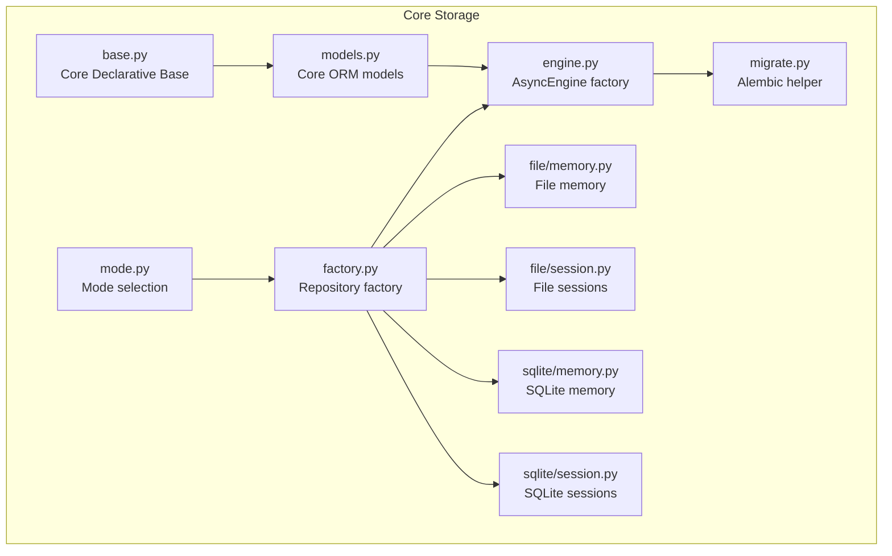
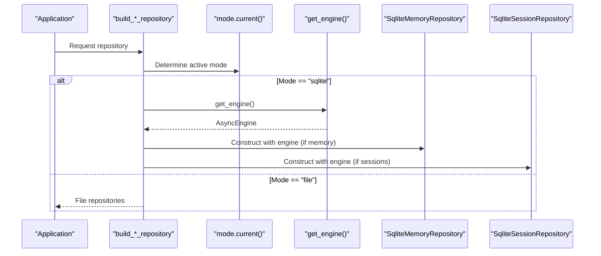
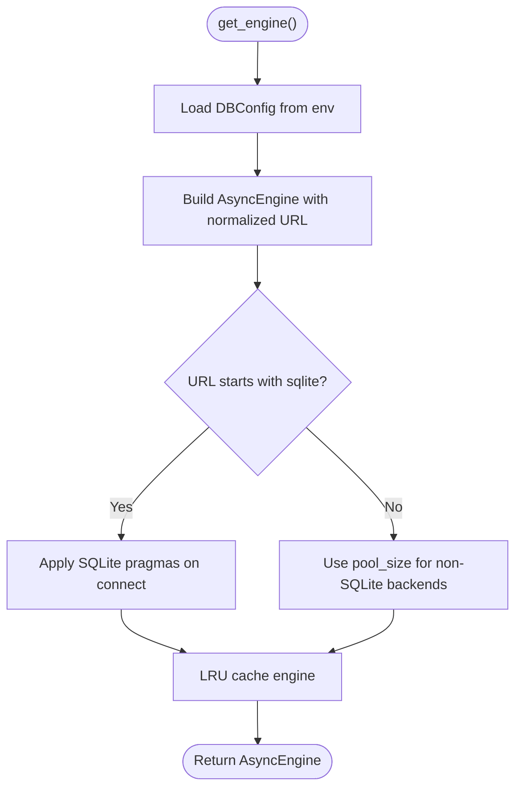
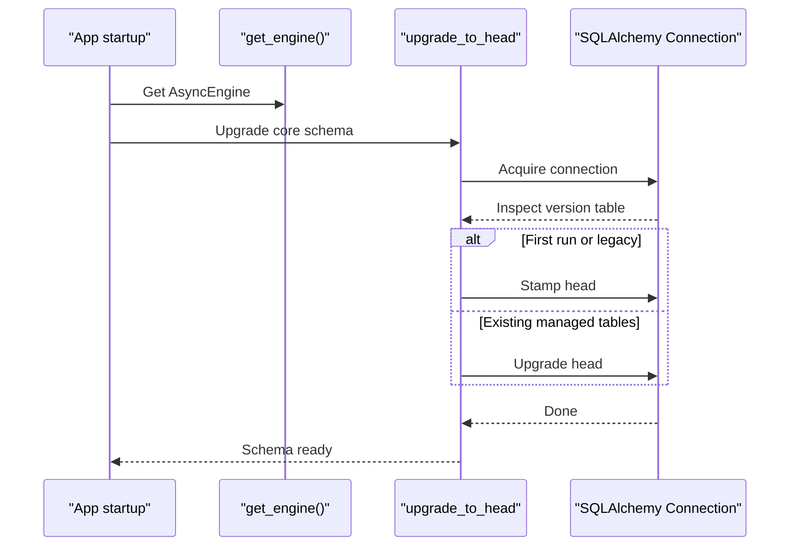
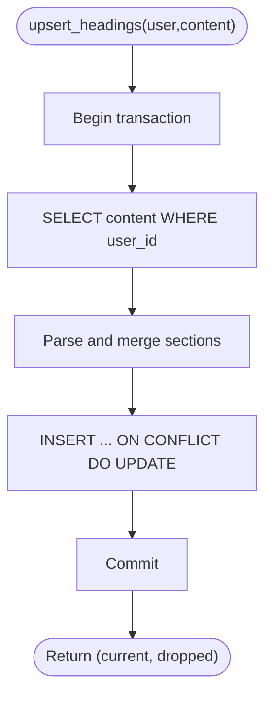
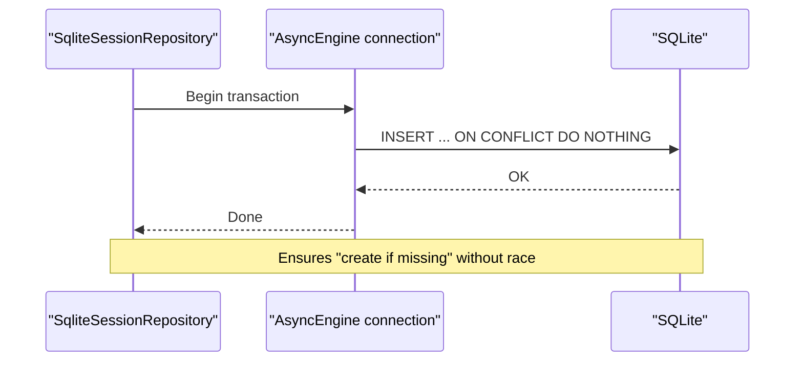
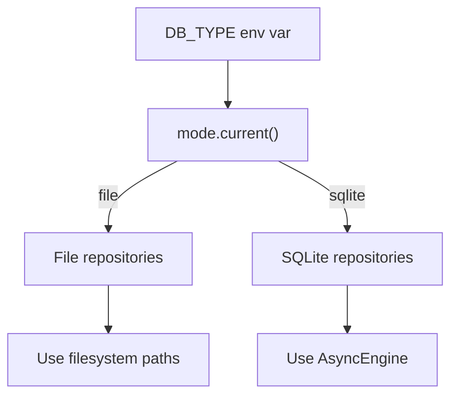
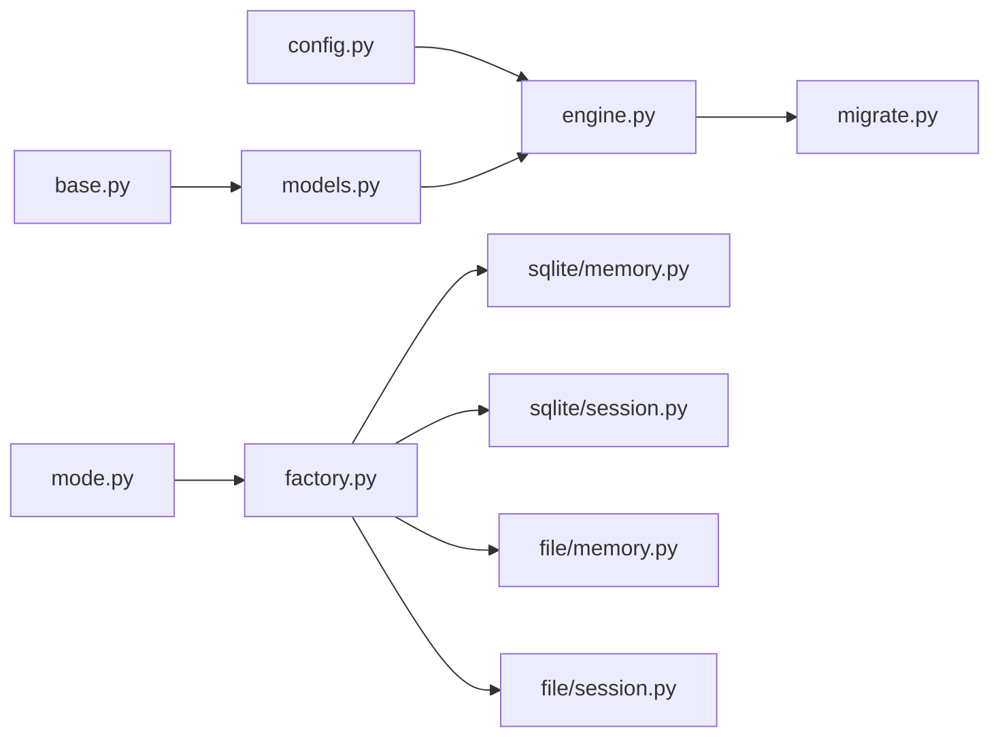

# SQLite Database Support

<cite>
**Referenced Files in This Document**
- [engine.py](file://src/ark_agentic/core/storage/database/engine.py)
- [config.py](file://src/ark_agentic/core/storage/database/config.py)
- [models.py](file://src/ark_agentic/core/storage/database/models.py)
- [base.py](file://src/ark_agentic/core/storage/database/base.py)
- [migrate.py](file://src/ark_agentic/core/storage/database/migrate.py)
- [factory.py](file://src/ark_agentic/core/storage/factory.py)
- [mode.py](file://src/ark_agentic/core/storage/mode.py)
- [sqlite/memory.py](file://src/ark_agentic/core/storage/database/sqlite/memory.py)
- [sqlite/session.py](file://src/ark_agentic/core/storage/database/sqlite/session.py)
- [file/memory.py](file://src/ark_agentic/core/storage/file/memory.py)
- [file/session.py](file://src/ark_agentic/core/storage/file/session.py)
- [entries.py](file://src/ark_agentic/core/storage/entries.py)
- [20260505_0001_initial_core_schema.py](file://src/ark_agentic/core/storage/database/migrations/versions/20260505_0001_initial_core_schema.py)
- [test_sqlite_memory.py](file://tests/unit/core/storage/test_sqlite_memory.py)
- [test_sqlite_session.py](file://tests/unit/core/storage/test_sqlite_session.py)
</cite>

## Table of Contents
1. [Introduction](#introduction)
2. [Project Structure](#project-structure)
3. [Core Components](#core-components)
4. [Architecture Overview](#architecture-overview)
5. [Detailed Component Analysis](#detailed-component-analysis)
6. [Dependency Analysis](#dependency-analysis)
7. [Performance Considerations](#performance-considerations)
8. [Troubleshooting Guide](#troubleshooting-guide)
9. [Conclusion](#conclusion)
10. [Appendices](#appendices)

## Introduction
This document explains the SQLite database support in Ark Agentic, focusing on the SQLAlchemy integration, engine configuration, connection management, and the SQLite-specific implementations for memory and session storage. It covers table schemas, query patterns, configuration options, connection pooling, performance tuning, practical operations, transactions, error recovery, limitations, optimization strategies, migration procedures, and the relationship between file-based and database modes, including data portability and backend switching considerations.

## Project Structure
The SQLite support is implemented under the core storage subsystem with a clear separation between the core domain models and feature-specific models. The database layer builds an asynchronous SQLAlchemy engine, initializes schema via Alembic, and exposes repositories for memory and sessions backed by SQLite.



**Diagram sources**
- [mode.py:1-32](file://src/ark_agentic/core/storage/mode.py#L1-L32)
- [factory.py:1-68](file://src/ark_agentic/core/storage/factory.py#L1-L68)
- [base.py:1-21](file://src/ark_agentic/core/storage/database/base.py#L1-L21)
- [models.py:1-70](file://src/ark_agentic/core/storage/database/models.py#L1-L70)
- [engine.py:1-164](file://src/ark_agentic/core/storage/database/engine.py#L1-L164)
- [migrate.py:1-94](file://src/ark_agentic/core/storage/database/migrate.py#L1-L94)
- [file/memory.py:1-171](file://src/ark_agentic/core/storage/file/memory.py#L1-L171)
- [file/session.py:1-371](file://src/ark_agentic/core/storage/file/session.py#L1-L371)
- [sqlite/memory.py:1-141](file://src/ark_agentic/core/storage/database/sqlite/memory.py#L1-L141)
- [sqlite/session.py:1-364](file://src/ark_agentic/core/storage/database/sqlite/session.py#L1-L364)

**Section sources**
- [mode.py:1-32](file://src/ark_agentic/core/storage/mode.py#L1-L32)
- [factory.py:1-68](file://src/ark_agentic/core/storage/factory.py#L1-L68)
- [engine.py:1-164](file://src/ark_agentic/core/storage/database/engine.py#L1-L164)

## Core Components
- Mode selection: Determines whether to use file-based or SQLite storage via an environment variable.
- Engine factory: Builds and caches an asynchronous SQLAlchemy engine, applies SQLite pragmas, and supports test overrides.
- Schema initialization: Uses Alembic to upgrade to the latest schema for core tables.
- Repositories: SQLite-backed implementations for memory and sessions, with ownership scoping and concurrency-safe upserts.
- Core models: Define the session metadata, session messages, and user memory tables.

Key responsibilities:
- Engine normalization and pragmas for SQLite (WAL, foreign keys, synchronous).
- One-transaction ownership checks and atomic replacements for transcripts.
- Upserts using SQLite ON CONFLICT DO UPDATE to avoid races.
- Indexes and foreign keys to maintain referential integrity and performance.

**Section sources**
- [mode.py:1-32](file://src/ark_agentic/core/storage/mode.py#L1-L32)
- [engine.py:1-164](file://src/ark_agentic/core/storage/database/engine.py#L1-L164)
- [migrate.py:1-94](file://src/ark_agentic/core/storage/database/migrate.py#L1-L94)
- [models.py:1-70](file://src/ark_agentic/core/storage/database/models.py#L1-L70)
- [sqlite/memory.py:1-141](file://src/ark_agentic/core/storage/database/sqlite/memory.py#L1-L141)
- [sqlite/session.py:1-364](file://src/ark_agentic/core/storage/database/sqlite/session.py#L1-L364)

## Architecture Overview
The system dynamically selects the storage backend at runtime. When the mode is SQLite, the factory obtains a shared AsyncEngine and constructs SQLite repositories. The engine is configured with SQLite-specific pragmas and supports both file-backed and in-memory databases.



**Diagram sources**
- [factory.py:1-68](file://src/ark_agentic/core/storage/factory.py#L1-L68)
- [mode.py:1-32](file://src/ark_agentic/core/storage/mode.py#L1-L32)
- [engine.py:108-127](file://src/ark_agentic/core/storage/database/engine.py#L108-L127)

## Detailed Component Analysis

### Database Engine Configuration and Connection Management
- URL normalization: Automatically converts sync SQLite URLs to aiosqlite when needed.
- SQLite path extraction: Supports both file-backed and in-memory databases.
- Pragmas:
  - WAL journaling for file-backed databases.
  - Foreign key enforcement enabled.
  - Normal synchronous mode for improved throughput.
- Caching: LRU cache for engines keyed by connection string and pool size.
- Test overrides: Allows injecting a test engine and clearing caches.



**Diagram sources**
- [engine.py:71-101](file://src/ark_agentic/core/storage/database/engine.py#L71-L101)
- [config.py:24-40](file://src/ark_agentic/core/storage/database/config.py#L24-L40)

**Section sources**
- [engine.py:30-101](file://src/ark_agentic/core/storage/database/engine.py#L30-L101)
- [config.py:17-40](file://src/ark_agentic/core/storage/database/config.py#L17-L40)

### Schema Initialization and Migration
- Alembic helper upgrades schema idempotently and stamps heads for legacy deployments.
- Core schema includes session metadata, session messages, and user memory tables.
- Version table isolation per feature to prevent orphaned tables.



**Diagram sources**
- [migrate.py:28-79](file://src/ark_agentic/core/storage/database/migrate.py#L28-L79)
- [engine.py:129-150](file://src/ark_agentic/core/storage/database/engine.py#L129-L150)
- [20260505_0001_initial_core_schema.py:17-83](file://src/ark_agentic/core/storage/database/migrations/versions/20260505_0001_initial_core_schema.py#L17-L83)

**Section sources**
- [migrate.py:1-94](file://src/ark_agentic/core/storage/database/migrate.py#L1-L94)
- [20260505_0001_initial_core_schema.py:1-84](file://src/ark_agentic/core/storage/database/migrations/versions/20260505_0001_initial_core_schema.py#L1-L84)

### Core Data Models and Table Schemas
Core ORM models define three tables:
- SessionMeta: per-session metadata with indexing on user_id.
- SessionMessage: append-only JSONL payloads with a unique composite index on (session_id, seq) and a foreign key with cascade delete.
- UserMemory: per-user memory blob with timestamps.

```mermaid
erDiagram
SESSION_META {
string session_id PK
string user_id IDX
int updated_at
string model
string provider
text state_json
int prompt_tokens
int completion_tokens
int total_tokens
int compaction_count
text active_skill_ids_json
}
SESSION_MESSAGES {
int id PK AI
string session_id FK
string user_id IDX
int seq
text payload_json
int timestamp
}
USER_MEMORY {
string user_id PK
text content
float last_dream_at
int updated_at
}
SESSION_META ||--o{ SESSION_MESSAGES : "has"
```

**Diagram sources**
- [models.py:16-68](file://src/ark_agentic/core/storage/database/models.py#L16-L68)

**Section sources**
- [models.py:1-70](file://src/ark_agentic/core/storage/database/models.py#L1-L70)

### SQLite Memory Repository
Implements a blob strategy storing a single markdown-like content per user. Provides:
- Read content by user_id.
- Heading-level upsert merging existing and incoming sections.
- Overwrite entire content atomically.
- Track last dream timestamp with upsert semantics.
- List users ordered by last update.

Concurrency and safety:
- Uses a single transaction for read-modify-write of headings.
- Upserts leverage SQLite ON CONFLICT DO UPDATE to avoid races.



**Diagram sources**
- [sqlite/memory.py:40-82](file://src/ark_agentic/core/storage/database/sqlite/memory.py#L40-L82)

**Section sources**
- [sqlite/memory.py:1-141](file://src/ark_agentic/core/storage/database/sqlite/memory.py#L1-L141)

### SQLite Session Repository
Implements session lifecycle and message persistence:
- Create session metadata with ON CONFLICT DO NOTHING.
- Append messages with next sequence number; handles concurrent appends safely via unique index.
- Load messages with optional pagination.
- Update and load session metadata with atomic upserts.
- List session IDs and metas scoped by user_id.
- Delete session by user_id with cascading deletes.
- Raw transcript get/put with validation and atomic replacement.
- Ownership checks enforced via WHERE clauses.



**Diagram sources**
- [sqlite/session.py:50-74](file://src/ark_agentic/core/storage/database/sqlite/session.py#L50-L74)

**Section sources**
- [sqlite/session.py:1-364](file://src/ark_agentic/core/storage/database/sqlite/session.py#L1-L364)

### Backend Switching: File vs Database Modes
- Mode selection: Controlled by an environment variable with two supported values.
- Factory dispatch: Returns file repositories when mode is file; returns SQLite repositories when mode is sqlite.
- Ownership semantics: SQLite backend enforces user_id scoping in queries to match file backend semantics.



**Diagram sources**
- [mode.py:19-31](file://src/ark_agentic/core/storage/mode.py#L19-L31)
- [factory.py:30-47](file://src/ark_agentic/core/storage/factory.py#L30-L47)

**Section sources**
- [mode.py:1-32](file://src/ark_agentic/core/storage/mode.py#L1-L32)
- [factory.py:1-68](file://src/ark_agentic/core/storage/factory.py#L1-L68)

## Dependency Analysis
- The factory depends on mode and engine to construct repositories.
- Repositories depend on the AsyncEngine and core models.
- Engine depends on configuration and applies SQLite pragmas.
- Migration helper depends on Alembic and the AsyncEngine to upgrade schemas.



**Diagram sources**
- [factory.py:1-68](file://src/ark_agentic/core/storage/factory.py#L1-L68)
- [engine.py:1-164](file://src/ark_agentic/core/storage/database/engine.py#L1-L164)
- [config.py:1-41](file://src/ark_agentic/core/storage/database/config.py#L1-L41)
- [base.py:1-21](file://src/ark_agentic/core/storage/database/base.py#L1-L21)
- [models.py:1-70](file://src/ark_agentic/core/storage/database/models.py#L1-L70)
- [migrate.py:1-94](file://src/ark_agentic/core/storage/database/migrate.py#L1-L94)
- [sqlite/memory.py:1-141](file://src/ark_agentic/core/storage/database/sqlite/memory.py#L1-L141)
- [sqlite/session.py:1-364](file://src/ark_agentic/core/storage/database/sqlite/session.py#L1-L364)
- [file/memory.py:1-171](file://src/ark_agentic/core/storage/file/memory.py#L1-L171)
- [file/session.py:1-371](file://src/ark_agentic/core/storage/file/session.py#L1-L371)

**Section sources**
- [factory.py:1-68](file://src/ark_agentic/core/storage/factory.py#L1-L68)
- [engine.py:1-164](file://src/ark_agentic/core/storage/database/engine.py#L1-L164)
- [migrate.py:1-94](file://src/ark_agentic/core/storage/database/migrate.py#L1-L94)

## Performance Considerations
- SQLite pragmas:
  - WAL journaling improves concurrency for file-backed databases.
  - Foreign keys enabled for integrity.
  - Normal synchronous mode balances durability and performance.
- Indexes:
  - Composite unique index on (session_id, seq) ensures monotonic sequence and fast lookups.
  - user_id indexes on session_meta and session_messages scope queries efficiently.
- Concurrency:
  - Upserts use ON CONFLICT DO UPDATE to avoid race conditions.
  - Unique index on (session_id, seq) prevents concurrent append conflicts.
- Pagination:
  - SQLite allows full-session reads without pagination; PostgreSQL path requires pagination for hot paths.
- Connection pooling:
  - Pool size applies to non-SQLite backends; SQLite uses aiosqlite with a single connection model by default.

[No sources needed since this section provides general guidance]

## Troubleshooting Guide
Common issues and recovery strategies:
- Ownership violations:
  - Queries enforce user_id scoping; attempts to access another user’s data return no results or raise validation errors during transcript replacement.
- Integrity errors:
  - Unique index on (session_id, seq) can cause IntegrityError on concurrent appends; ensure serialized per-session appends or handle retries.
  - Upserts use ON CONFLICT DO UPDATE to avoid insert races.
- Schema initialization:
  - Use the Alembic helper to upgrade or stamp heads for legacy deployments.
- Engine caching:
  - Use test overrides and cache reset helpers to isolate tests.

**Section sources**
- [sqlite/session.py:76-110](file://src/ark_agentic/core/storage/database/sqlite/session.py#L76-L110)
- [sqlite/session.py:315-356](file://src/ark_agentic/core/storage/database/sqlite/session.py#L315-L356)
- [migrate.py:28-79](file://src/ark_agentic/core/storage/database/migrate.py#L28-L79)
- [engine.py:153-163](file://src/ark_agentic/core/storage/database/engine.py#L153-L163)

## Conclusion
Ark Agentic provides a robust, mode-switchable storage layer with SQLite as the database backend. The design leverages SQLAlchemy with async connections, Alembic migrations, and SQLite-specific pragmas to achieve reliability and performance. Repositories implement ownership scoping and concurrency-safe upserts, while the factory pattern cleanly separates file and database backends. The system supports straightforward migration procedures and offers practical guidance for operational tasks such as schema upgrades, testing, and troubleshooting.

[No sources needed since this section summarizes without analyzing specific files]

## Appendices

### Practical Examples and Patterns
- Database operations:
  - Memory upsert: Merge user memory by headings within a single transaction.
  - Session creation: Insert metadata with conflict resolution.
  - Message append: Compute next sequence and insert atomically.
  - Transcript replacement: Validate JSONL, confirm ownership, and replace messages in a single transaction.
- Transactions:
  - Begin/commit blocks wrap read-modify-write and multi-row operations.
- Error recovery:
  - Ownership validation raises explicit errors for misrouted operations.
  - Upserts avoid race conditions using ON CONFLICT DO UPDATE.

**Section sources**
- [sqlite/memory.py:40-122](file://src/ark_agentic/core/storage/database/sqlite/memory.py#L40-L122)
- [sqlite/session.py:50-110](file://src/ark_agentic/core/storage/database/sqlite/session.py#L50-L110)
- [sqlite/session.py:315-356](file://src/ark_agentic/core/storage/database/sqlite/session.py#L315-L356)

### SQLite Limitations and Optimization Strategies
- Embedded database characteristics:
  - Single-writer bottleneck; WAL helps but does not eliminate serialization needs.
  - Limited concurrent readers/writers compared to server databases.
- Optimizations:
  - Use appropriate indexes and unique constraints to minimize scans.
  - Prefer batch operations (executemany) where applicable.
  - Keep message payloads compact and avoid unnecessary updates.
- Scaling:
  - Consider migrating to a server database for high-concurrency workloads.
  - Use pagination for large reads in environments that require it.

[No sources needed since this section provides general guidance]

### Migration Procedures
- Initialize schema:
  - Run the Alembic upgrade helper against the shared AsyncEngine.
  - Legacy deployments without version tables are stamped automatically.
- Version control:
  - Feature-specific migrations live in separate directories with isolated version tables.

**Section sources**
- [migrate.py:28-79](file://src/ark_agentic/core/storage/database/migrate.py#L28-L79)
- [engine.py:129-150](file://src/ark_agentic/core/storage/database/engine.py#L129-L150)

### Data Portability and Backend Switching
- File mode:
  - Stores data as files under user-scoped directories; easy to inspect and back up.
- Database mode:
  - Stores structured data in SQLite; portable across platforms supporting aiosqlite.
- Switching:
  - Change the mode environment variable; repositories dispatch accordingly.
  - Use migration tools to move between file and database formats when needed.

**Section sources**
- [mode.py:1-32](file://src/ark_agentic/core/storage/mode.py#L1-L32)
- [factory.py:1-68](file://src/ark_agentic/core/storage/factory.py#L1-L68)
- [file/memory.py:1-171](file://src/ark_agentic/core/storage/file/memory.py#L1-L171)
- [file/session.py:1-371](file://src/ark_agentic/core/storage/file/session.py#L1-L371)