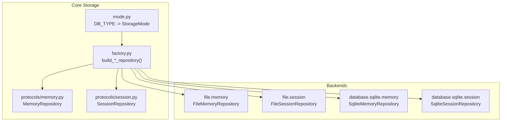
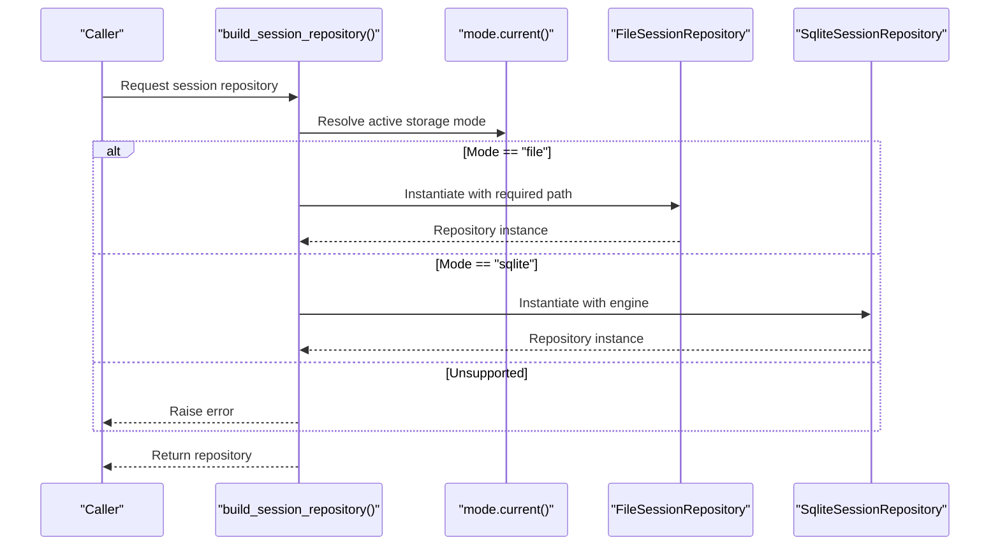
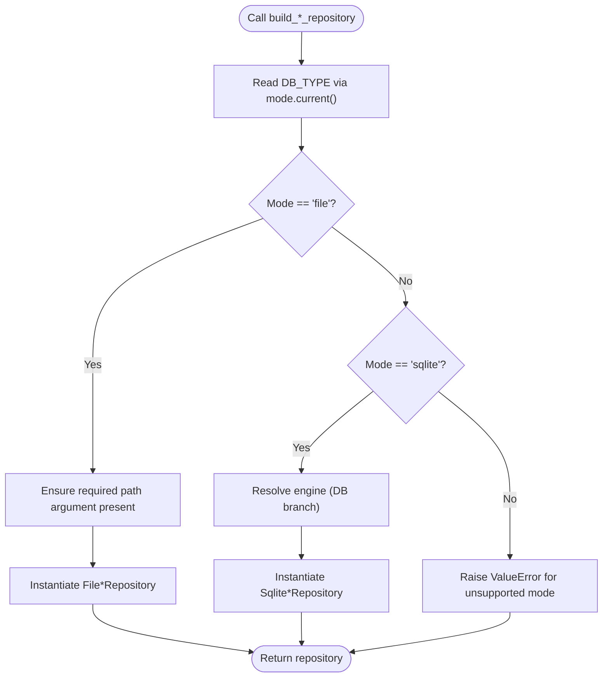
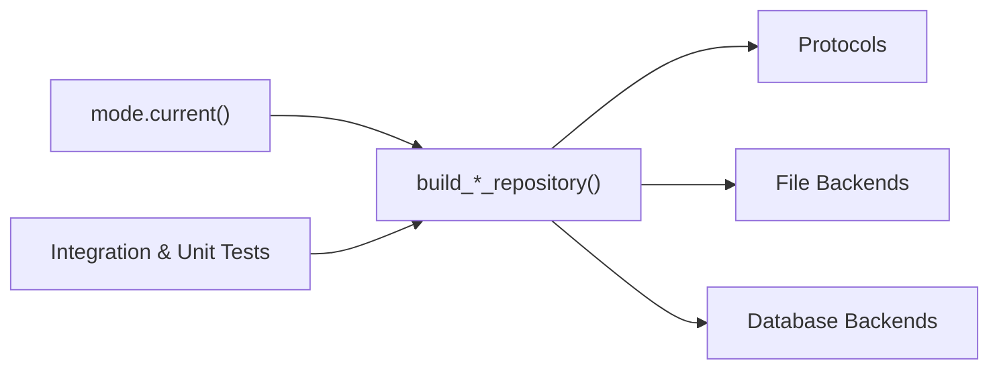

# Storage Factory Pattern

<cite>
**Referenced Files in This Document**
- [factory.py](file://src/ark_agentic/core/storage/factory.py)
- [mode.py](file://src/ark_agentic/core/storage/mode.py)
- [__init__.py](file://src/ark_agentic/core/storage/__init__.py)
- [memory.py](file://src/ark_agentic/core/storage/protocols/memory.py)
- [session.py](file://src/ark_agentic/core/storage/protocols/session.py)
- [database-and-storage-abstraction.md](file://docs/database-and-storage-abstraction.md)
- [architecture-c4.md](file://docs/architecture-c4.md)
- [test_factory_backend_switching.py](file://tests/integration/test_factory_backend_switching.py)
- [test_storage_factory.py](file://tests/unit/core/storage/test_storage_factory.py)
</cite>

## Table of Contents
1. [Introduction](#introduction)
2. [Project Structure](#project-structure)
3. [Core Components](#core-components)
4. [Architecture Overview](#architecture-overview)
5. [Detailed Component Analysis](#detailed-component-analysis)
6. [Dependency Analysis](#dependency-analysis)
7. [Performance Considerations](#performance-considerations)
8. [Troubleshooting Guide](#troubleshooting-guide)
9. [Conclusion](#conclusion)
10. [Appendices](#appendices)

## Introduction
This document explains the storage factory pattern used in Ark Agentic to create storage repositories based on the selected persistence mode. It covers how the factory resolves the active mode from environment configuration, constructs appropriate backend implementations, and enforces protocol-based contracts to ensure consistent behavior across file and database backends. It also documents usage patterns, dependency injection scenarios, and guidelines for extending the factory with new backends while maintaining protocol compliance.

## Project Structure
The storage abstraction is organized around a hexagonal architecture:
- Mode selection is centralized in a dedicated module that reads an environment variable to decide the active storage mode.
- The factory module builds repositories for memory and session storage based on the resolved mode.
- Protocol contracts define the interface that all backends must satisfy.
- Backends are organized under file and database namespaces, with the factory importing concrete implementations.

**Diagram sources**
- [factory.py:1-68](file://src/ark_agentic/core/storage/factory.py#L1-L68)
- [mode.py:1-32](file://src/ark_agentic/core/storage/mode.py#L1-L32)
- [memory.py:1-56](file://src/ark_agentic/core/storage/protocols/memory.py#L1-L56)
- [session.py:1-194](file://src/ark_agentic/core/storage/protocols/session.py#L1-L194)

**Section sources**
- [__init__.py:1-10](file://src/ark_agentic/core/storage/__init__.py#L1-L10)
- [mode.py:1-32](file://src/ark_agentic/core/storage/mode.py#L1-L32)
- [factory.py:1-68](file://src/ark_agentic/core/storage/factory.py#L1-L68)

## Core Components
- Storage mode resolver: Reads the DB_TYPE environment variable and validates it against supported modes.
- Factory functions:
  - build_session_repository: Creates a session repository based on the active mode.
  - build_memory_repository: Creates a memory repository based on the active mode.
- Protocol contracts:
  - MemoryRepository: Defines operations for reading/upserting/overwriting user memory and listing users.
  - SessionRepository: Aggregates message, metadata, transcript, and admin stores with consistent pagination semantics.

These components ensure that business logic depends only on protocols, while the factory injects the correct backend implementation at runtime.

**Section sources**
- [mode.py:19-32](file://src/ark_agentic/core/storage/mode.py#L19-L32)
- [factory.py:30-68](file://src/ark_agentic/core/storage/factory.py#L30-L68)
- [memory.py:8-56](file://src/ark_agentic/core/storage/protocols/memory.py#L8-L56)
- [session.py:17-194](file://src/ark_agentic/core/storage/protocols/session.py#L17-L194)

## Architecture Overview
The factory pattern decouples business code from storage backends by selecting implementations at runtime based on the active mode. The mode is determined by an environment variable, enabling seamless backend switching without changing application code.

**Diagram sources**
- [factory.py:30-47](file://src/ark_agentic/core/storage/factory.py#L30-L47)
- [mode.py:19-26](file://src/ark_agentic/core/storage/mode.py#L19-L26)

## Detailed Component Analysis

### Mode Resolution and Backend Switching
- The mode module parses DB_TYPE and returns a validated literal type indicating the active storage mode.
- The factory reads the active mode and conditionally instantiates either file or database implementations.
- The factory raises an error for unsupported modes, preventing silent misconfiguration.

**Diagram sources**
- [mode.py:19-26](file://src/ark_agentic/core/storage/mode.py#L19-L26)
- [factory.py:30-68](file://src/ark_agentic/core/storage/factory.py#L30-L68)

**Section sources**
- [mode.py:19-32](file://src/ark_agentic/core/storage/mode.py#L19-L32)
- [factory.py:21-27](file://src/ark_agentic/core/storage/factory.py#L21-L27)
- [factory.py:30-68](file://src/ark_agentic/core/storage/factory.py#L30-L68)

### Factory Functions: Memory and Session Repositories
- build_session_repository:
  - Accepts a sessions directory path for file mode.
  - For sqlite mode, obtains an engine and passes it to the database repository.
  - Enforces that required paths are present for file mode.
- build_memory_repository:
  - Accepts a workspace directory path for file mode.
  - For sqlite mode, obtains an engine and passes it to the database repository.
  - Enforces that required paths are present for file mode.

Both functions return protocol-typed objects, ensuring consumers depend on abstractions rather than concrete implementations.

**Section sources**
- [factory.py:30-47](file://src/ark_agentic/core/storage/factory.py#L30-L47)
- [factory.py:50-68](file://src/ark_agentic/core/storage/factory.py#L50-L68)

### Protocol Contracts for Consistent Behavior
- MemoryRepository:
  - Defines read, upsert_headings, overwrite, list_users, and last dream tracking operations.
  - Requires consistent pagination semantics across backends.
- SessionRepository:
  - Aggregates four specialized stores: message, metadata, transcript, and admin.
  - Enforces consistent ordering and pagination semantics for listing operations.
  - Documents atomicity expectations for message append and transcript replace operations.

These contracts guarantee that swapping backends does not change the observable behavior of business logic.

**Section sources**
- [memory.py:8-56](file://src/ark_agentic/core/storage/protocols/memory.py#L8-L56)
- [session.py:17-194](file://src/ark_agentic/core/storage/protocols/session.py#L17-L194)

### Class Relationships and Dependencies

```mermaid
classDiagram
class MemoryRepository {
+read(user_id) str
+upsert_headings(user_id, content) tuple
+overwrite(user_id, content) None
+list_users(limit, offset, order_by_updated_desc) list
+get_last_dream_at(user_id) float|None
+set_last_dream_at(user_id, timestamp) None
}
class SessionMessageStore {
+create(session_id, user_id, model, provider, state) None
+append_message(session_id, user_id, message) None
+load_messages(session_id, user_id, limit, offset) list
+finalize(session_id, user_id) None
}
class SessionMetaStore {
+update_meta(session_id, user_id, entry) None
+load_meta(session_id, user_id) SessionStoreEntry|None
+list_session_ids(user_id, limit, offset) list
+list_session_metas(user_id, limit, offset) list
+delete(session_id, user_id) bool
}
class SessionTranscriptStore {
+get_raw_transcript(session_id, user_id) str|None
+put_raw_transcript(session_id, user_id, jsonl_content) None
}
class SessionAdminStore {
+list_all_sessions(limit, offset) list
}
class SessionRepository {
<<aggregate>>
}
MemoryRepository <|.. FileMemoryRepository : "implements"
MemoryRepository <|.. SqliteMemoryRepository : "implements"
SessionMessageStore <|.. FileSessionRepository : "implements"
SessionMetaStore <|.. FileSessionRepository : "implements"
SessionTranscriptStore <|.. FileSessionRepository : "implements"
SessionAdminStore <|.. FileSessionRepository : "implements"
SessionRepository <|.. FileSessionRepository : "implements"
SessionMessageStore <|.. SqliteSessionRepository : "implements"
SessionMetaStore <|.. SqliteSessionRepository : "implements"
SessionTranscriptStore <|.. SqliteSessionRepository : "implements"
SessionAdminStore <|.. SqliteSessionRepository : "implements"
SessionRepository <|.. SqliteSessionRepository : "implements"
```

**Diagram sources**
- [memory.py:8-56](file://src/ark_agentic/core/storage/protocols/memory.py#L8-L56)
- [session.py:17-194](file://src/ark_agentic/core/storage/protocols/session.py#L17-L194)
- [factory.py:14-17](file://src/ark_agentic/core/storage/factory.py#L14-L17)

## Dependency Analysis
- The factory depends on:
  - mode.current() to resolve the active storage mode.
  - Concrete repository implementations for file and database backends.
  - Protocol types to return typed abstractions.
- Backends depend on:
  - File backends requiring explicit path arguments.
  - Database backends requiring an engine instance.
- Tests validate backend switching and factory behavior across modes.

**Diagram sources**
- [factory.py:13-18](file://src/ark_agentic/core/storage/factory.py#L13-L18)
- [mode.py:19-26](file://src/ark_agentic/core/storage/mode.py#L19-L26)
- [test_factory_backend_switching.py](file://tests/integration/test_factory_backend_switching.py)
- [test_storage_factory.py](file://tests/unit/core/storage/test_storage_factory.py)

**Section sources**
- [factory.py:13-18](file://src/ark_agentic/core/storage/factory.py#L13-L18)
- [mode.py:19-26](file://src/ark_agentic/core/storage/mode.py#L19-L26)
- [test_factory_backend_switching.py](file://tests/integration/test_factory_backend_switching.py)
- [test_storage_factory.py](file://tests/unit/core/storage/test_storage_factory.py)

## Performance Considerations
- The factory avoids redundant caching layers for session and memory repositories in single-worker deployments, as managers maintain in-memory mirrors.
- Pagination semantics are standardized across backends to prevent unbounded scans and to enable future enforcement of explicit limits on hot paths.
- Atomicity guarantees for message append and transcript replace operations reduce the risk of partial writes and improve reliability.

[No sources needed since this section provides general guidance]

## Troubleshooting Guide
Common issues and resolutions:
- Unsupported DB_TYPE value:
  - Symptom: ValueError indicating an unsupported mode.
  - Resolution: Set DB_TYPE to "file" or "sqlite".
- Missing path arguments for file mode:
  - Symptom: ValueError indicating a missing required path argument.
  - Resolution: Provide the required directory path when building repositories in file mode.
- Backend switching verification:
  - Use integration tests to confirm that repositories are constructed according to the active mode.

**Section sources**
- [mode.py:21-26](file://src/ark_agentic/core/storage/mode.py#L21-L26)
- [factory.py:21-27](file://src/ark_agentic/core/storage/factory.py#L21-L27)
- [test_factory_backend_switching.py](file://tests/integration/test_factory_backend_switching.py)

## Conclusion
The storage factory pattern in Ark Agentic cleanly separates concerns by resolving the active storage mode from environment configuration and constructing backend-specific repositories while preserving protocol-based contracts. This design enables seamless backend switching, predictable behavior across implementations, and straightforward extension for additional backends.

[No sources needed since this section summarizes without analyzing specific files]

## Appendices

### Usage Patterns and Dependency Injection Scenarios
- Environment-driven selection:
  - Configure DB_TYPE to choose between file and sqlite backends.
- Passing engines:
  - For sqlite mode, pass an engine instance to the factory when constructing repositories.
- Testing backend switching:
  - Integration tests demonstrate that repositories are built according to the active mode.

**Section sources**
- [database-and-storage-abstraction.md](file://docs/database-and-storage-abstraction.md)
- [architecture-c4.md](file://docs/architecture-c4.md)
- [test_factory_backend_switching.py](file://tests/integration/test_factory_backend_switching.py)

### Extending the Factory for Custom Backends
Guidelines for adding a new backend while maintaining protocol compliance:
- Implement the required protocol(s):
  - MemoryRepository for user memory operations.
  - SessionRepository for session operations.
- Respect pagination semantics:
  - Honor limit and offset parameters consistently across all listing operations.
- Ensure atomicity:
  - Follow documented atomicity guarantees for message append and transcript replace operations.
- Integrate with the factory:
  - Add a new import for the concrete repository implementation.
  - Extend the factory’s mode branches to instantiate the new backend when the corresponding mode is active.
- Validate with tests:
  - Add unit and integration tests to verify behavior and backend switching.

**Section sources**
- [memory.py:8-56](file://src/ark_agentic/core/storage/protocols/memory.py#L8-L56)
- [session.py:17-194](file://src/ark_agentic/core/storage/protocols/session.py#L17-L194)
- [factory.py:30-68](file://src/ark_agentic/core/storage/factory.py#L30-L68)