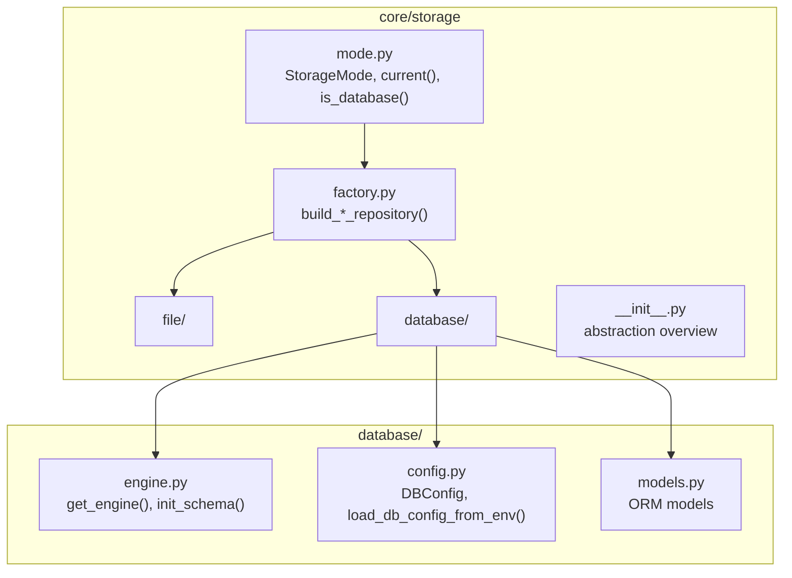
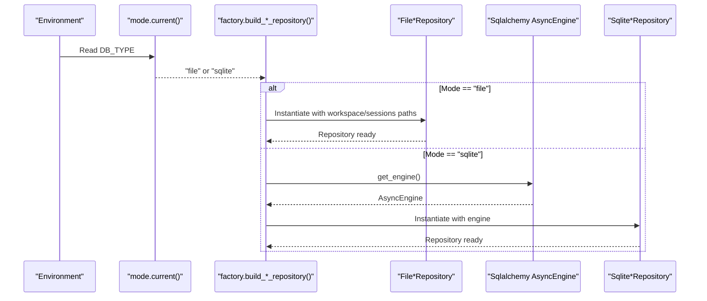
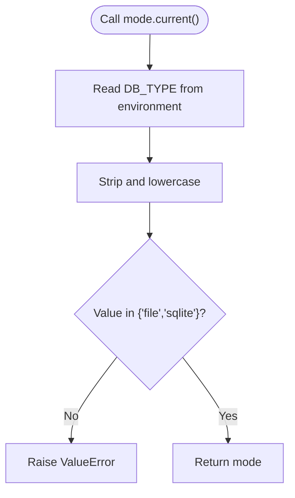
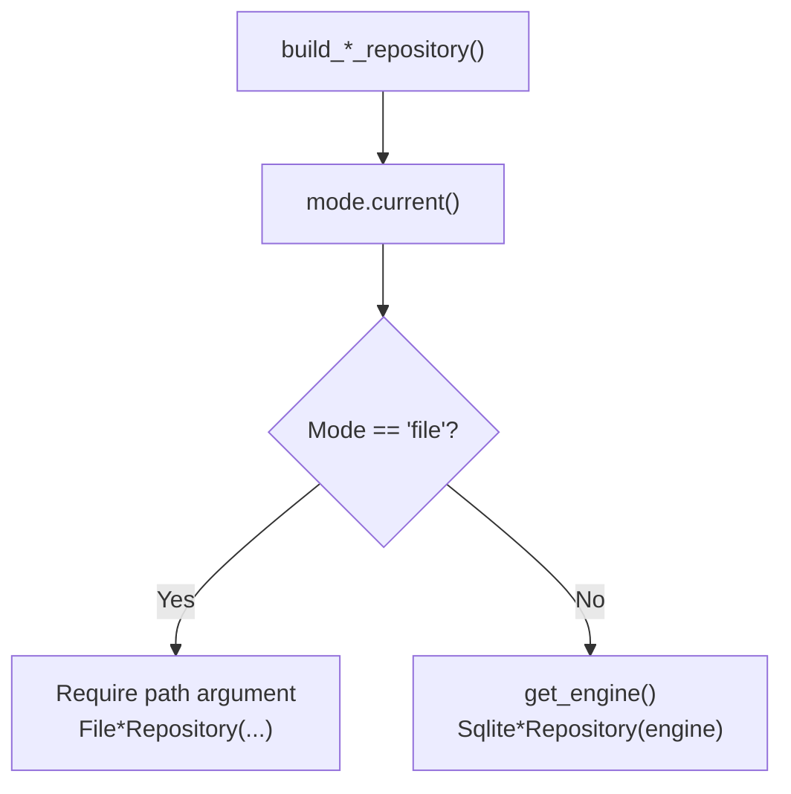
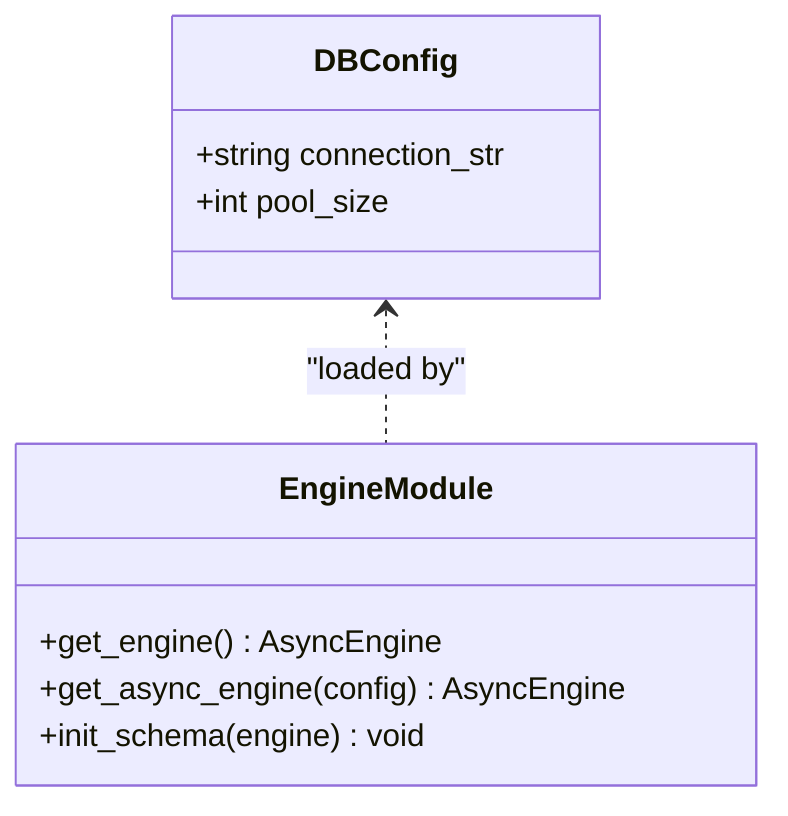
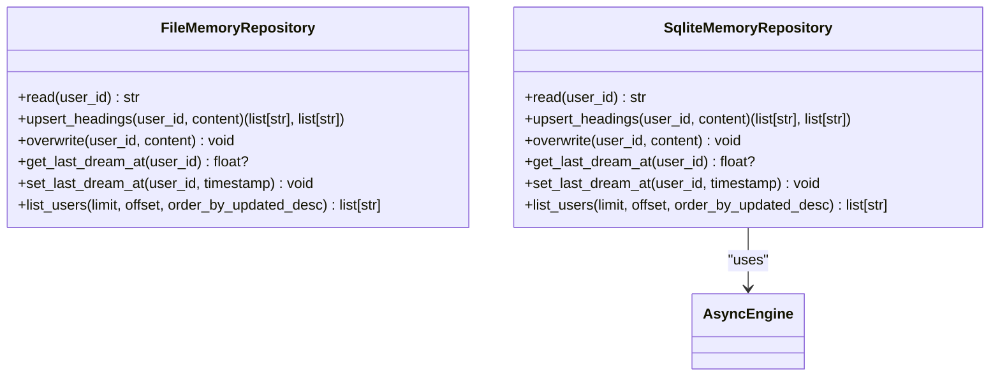
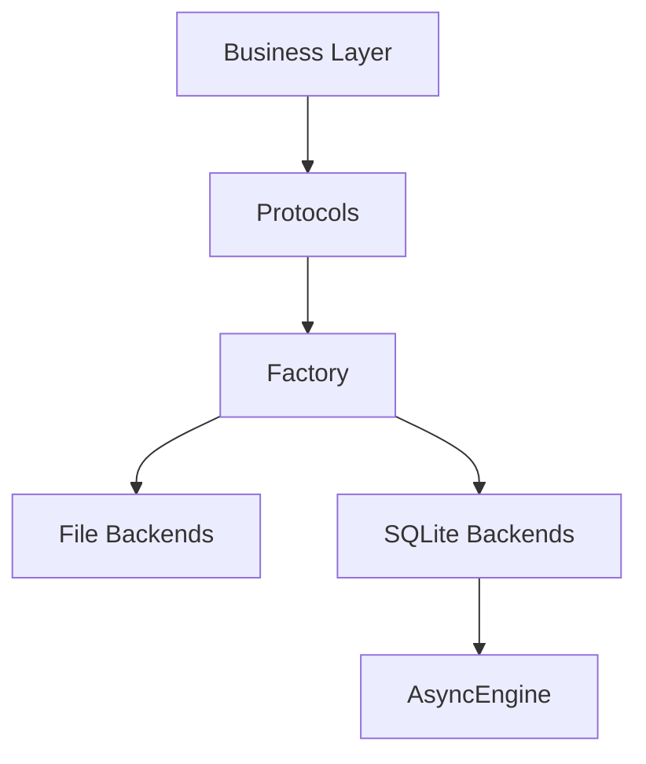
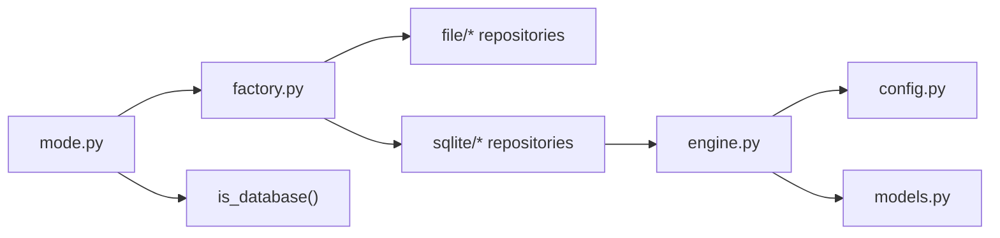

# Storage Mode Selection

<cite>
**Referenced Files in This Document**
- [mode.py](file://src/ark_agentic/core/storage/mode.py)
- [factory.py](file://src/ark_agentic/core/storage/factory.py)
- [engine.py](file://src/ark_agentic/core/storage/database/engine.py)
- [config.py](file://src/ark_agentic/core/storage/database/config.py)
- [models.py](file://src/ark_agentic/core/storage/database/models.py)
- [memory.py (file)](file://src/ark_agentic/core/storage/file/memory.py)
- [memory.py (sqlite)](file://src/ark_agentic/core/storage/database/sqlite/memory.py)
- [__init__.py (storage)](file://src/ark_agentic/core/storage/__init__.py)
- [database-and-storage-abstraction.md](file://docs/database-and-storage-abstraction.md)
- [.env-sample](file://.env-sample)
- [test_mode.py](file://tests/unit/core/storage/test_mode.py)
</cite>

## Table of Contents
1. [Introduction](#introduction)
2. [Project Structure](#project-structure)
3. [Core Components](#core-components)
4. [Architecture Overview](#architecture-overview)
5. [Detailed Component Analysis](#detailed-component-analysis)
6. [Dependency Analysis](#dependency-analysis)
7. [Performance Considerations](#performance-considerations)
8. [Troubleshooting Guide](#troubleshooting-guide)
9. [Conclusion](#conclusion)
10. [Appendices](#appendices)

## Introduction
This document explains the storage mode selection system in Ark Agentic. It focuses on how the DB_TYPE environment variable determines the active storage backend (file or sqlite), the default fallback behavior, validation logic, and the utility that checks SQL engine availability. It also documents the StorageMode type, the current() resolver, and the is_database() helper. Practical environment configuration examples are provided for common deployment scenarios, along with troubleshooting guidance for unsupported storage modes and typical configuration issues. Historical context is included to explain the naming and semantic evolution from a database selection variable to a storage mode selector.

## Project Structure
The storage subsystem is organized under core/storage with a hexagonal architecture:
- mode.py: Defines the StorageMode type and resolves the active mode from DB_TYPE.
- factory.py: Dispatches repository creation based on the active mode.
- database/: SQLAlchemy-based backend (SQLite) with engine, config, models, and repositories.
- file/: File-based backend with repositories.
- __init__.py: Package-level documentation and abstraction overview.

**Diagram sources**
- [mode.py:1-32](file://src/ark_agentic/core/storage/mode.py#L1-L32)
- [factory.py:1-68](file://src/ark_agentic/core/storage/factory.py#L1-L68)
- [engine.py:1-164](file://src/ark_agentic/core/storage/database/engine.py#L1-L164)
- [config.py:1-41](file://src/ark_agentic/core/storage/database/config.py#L1-L41)
- [models.py:1-70](file://src/ark_agentic/core/storage/database/models.py#L1-L70)
- [__init__.py:1-10](file://src/ark_agentic/core/storage/__init__.py#L1-L10)

**Section sources**
- [__init__.py:1-10](file://src/ark_agentic/core/storage/__init__.py#L1-L10)
- [database-and-storage-abstraction.md:1-227](file://docs/database-and-storage-abstraction.md#L1-L227)

## Core Components
- StorageMode type: A literal type representing the two supported modes: file and sqlite.
- current(): Reads DB_TYPE from the environment, normalizes it, validates it, and returns the active mode. Defaults to file when DB_TYPE is unset.
- is_database(): Returns True when the active mode requires a SQL engine (i.e., when mode != "file").

These components form the foundation for backend switching across repositories and engines.

**Section sources**
- [mode.py:16-31](file://src/ark_agentic/core/storage/mode.py#L16-L31)
- [test_mode.py:10-38](file://tests/unit/core/storage/test_mode.py#L10-L38)

## Architecture Overview
The storage mode selection drives a factory that instantiates either file or SQLite repositories. When DB_TYPE=sqlite, the database engine is created and initialized, and repositories receive the AsyncEngine. When DB_TYPE=file, repositories operate against local filesystem paths without requiring an engine.

**Diagram sources**
- [mode.py:19-26](file://src/ark_agentic/core/storage/mode.py#L19-L26)
- [factory.py:30-67](file://src/ark_agentic/core/storage/factory.py#L30-L67)
- [engine.py:108-117](file://src/ark_agentic/core/storage/database/engine.py#L108-L117)

## Detailed Component Analysis

### StorageMode Type and Resolution
- StorageMode is a typed literal union of "file" and "sqlite".
- current() enforces:
  - Default fallback to "file" when DB_TYPE is unset.
  - Case-insensitive normalization and stripping.
  - Strict validation rejecting unknown values.
- is_database() provides a concise predicate to decide SQL engine needs.

**Diagram sources**
- [mode.py:19-26](file://src/ark_agentic/core/storage/mode.py#L19-L26)

**Section sources**
- [mode.py:16-31](file://src/ark_agentic/core/storage/mode.py#L16-L31)
- [test_mode.py:10-26](file://tests/unit/core/storage/test_mode.py#L10-L26)

### Factory Dispatch and Backend Switching
- The factory reads the active mode and constructs the appropriate repository:
  - For "file": Requires path parameters (e.g., workspace_dir, sessions_dir). Validation ensures paths are present; otherwise, a descriptive error instructs switching to sqlite or providing the path.
  - For "sqlite": Requests a shared AsyncEngine from the engine module and passes it to the SQLite repository constructors.
- This pattern isolates business code from backend specifics and centralizes mode-dependent wiring.

**Diagram sources**
- [factory.py:30-67](file://src/ark_agentic/core/storage/factory.py#L30-L67)

**Section sources**
- [factory.py:21-27](file://src/ark_agentic/core/storage/factory.py#L21-L27)
- [factory.py:30-67](file://src/ark_agentic/core/storage/factory.py#L30-L67)

### Database Engine and Configuration
- DBConfig encapsulates DB_CONNECTION_STR and DB_POOL_SIZE, loaded from the environment with sensible defaults.
- get_engine() builds or retrieves a cached AsyncEngine, enabling SQLite-specific pragmas and ensuring thread-safe usage.
- init_schema() applies core migrations for session and memory tables.

**Diagram sources**
- [config.py:17-41](file://src/ark_agentic/core/storage/database/config.py#L17-L41)
- [engine.py:108-151](file://src/ark_agentic/core/storage/database/engine.py#L108-L151)

**Section sources**
- [config.py:24-41](file://src/ark_agentic/core/storage/database/config.py#L24-L41)
- [engine.py:71-101](file://src/ark_agentic/core/storage/database/engine.py#L71-L101)
- [engine.py:129-150](file://src/ark_agentic/core/storage/database/engine.py#L129-L150)

### Repositories: File vs SQLite
- File repositories operate synchronously on disk under designated directories (e.g., MEMORY.md per user).
- SQLite repositories persist user memory as a single blob per user with heading-level upsert semantics aligned to file behavior, using SQLite INSERT ... ON CONFLICT DO UPDATE for concurrency safety.

**Diagram sources**
- [memory.py (file):27-171](file://src/ark_agentic/core/storage/file/memory.py#L27-L171)
- [memory.py (sqlite):25-141](file://src/ark_agentic/core/storage/database/sqlite/memory.py#L25-L141)

**Section sources**
- [memory.py (file):27-171](file://src/ark_agentic/core/storage/file/memory.py#L27-L171)
- [memory.py (sqlite):25-141](file://src/ark_agentic/core/storage/database/sqlite/memory.py#L25-L141)

### Conceptual Overview
The storage abstraction separates business logic from persistence details. The mode module centralizes environment-driven decisions, while the factory mediates between mode and repositories. The database layer encapsulates engine creation and schema initialization.

[No sources needed since this diagram shows conceptual workflow, not actual code structure]

## Dependency Analysis
- mode.current() is the single source of truth for the active storage mode.
- factory.py depends on mode.current() and conditionally imports backend implementations.
- SQLite repositories depend on AsyncEngine from engine.py.
- DBConfig and engine.py are only meaningful when is_database() is true.

**Diagram sources**
- [mode.py:19-31](file://src/ark_agentic/core/storage/mode.py#L19-L31)
- [factory.py:30-67](file://src/ark_agentic/core/storage/factory.py#L30-L67)
- [engine.py:108-117](file://src/ark_agentic/core/storage/database/engine.py#L108-L117)
- [config.py:24-41](file://src/ark_agentic/core/storage/database/config.py#L24-L41)
- [models.py:59-68](file://src/ark_agentic/core/storage/database/models.py#L59-L68)

**Section sources**
- [factory.py:13-18](file://src/ark_agentic/core/storage/factory.py#L13-L18)
- [engine.py:23-27](file://src/ark_agentic/core/storage/database/engine.py#L23-L27)

## Performance Considerations
- SQLite engine caching: The engine is cached per (URL, pool_size) to avoid repeated setup overhead.
- SQLite pragmas: WAL journaling and foreign keys are enabled for durability and referential integrity on file-backed databases; memory databases enforce foreign keys for test reliability.
- Concurrency: SQLite upsert uses INSERT ... ON CONFLICT DO UPDATE to prevent races during heading-level updates.

[No sources needed since this section provides general guidance]

## Troubleshooting Guide
Common issues and resolutions:
- Unsupported DB_TYPE value
  - Symptom: ValueError indicating an unsupported mode.
  - Resolution: Set DB_TYPE to "file" or "sqlite".
  - Reference: [mode.py:22-25](file://src/ark_agentic/core/storage/mode.py#L22-L25)
- Missing path arguments for file mode
  - Symptom: ValueError instructing to provide the required path or switch to sqlite.
  - Resolution: Supply workspace_dir or sessions_dir when DB_TYPE=file, or set DB_TYPE=sqlite.
  - Reference: [factory.py:21-27](file://src/ark_agentic/core/storage/factory.py#L21-L27)
- DB_POOL_SIZE invalid
  - Symptom: ValueError stating DB_POOL_SIZE must be an integer.
  - Resolution: Provide a valid integer for DB_POOL_SIZE.
  - Reference: [config.py:33-38](file://src/ark_agentic/core/storage/database/config.py#L33-L38)
- Misinterpreting DB_TYPE semantics
  - Clarification: DB_TYPE historically existed for database compatibility but semantically selects the storage mode. Use "file" for filesystem-only deployments and "sqlite" for SQL-backed deployments.
  - Reference: [mode.py:7-8](file://src/ark_agentic/core/storage/mode.py#L7-L8)

**Section sources**
- [mode.py:22-25](file://src/ark_agentic/core/storage/mode.py#L22-L25)
- [factory.py:21-27](file://src/ark_agentic/core/storage/factory.py#L21-L27)
- [config.py:33-38](file://src/ark_agentic/core/storage/database/config.py#L33-L38)

## Conclusion
The storage mode selection system cleanly separates concerns by deriving the active backend from DB_TYPE, validating inputs, and delegating repository instantiation to a factory. The is_database() helper succinctly captures when a SQL engine is required. This design supports straightforward deployment scenarios and paves the way for future database backends while maintaining a consistent repository interface.

## Appendices

### Environment Configuration Examples
- Minimal SQLite deployment:
  - DB_TYPE=sqlite
  - DB_CONNECTION_STR=sqlite+aiosqlite:///data/ark.db
- File-only deployment:
  - DB_TYPE=file
  - SESSIONS_DIR=data/ark_sessions
  - MEMORY_DIR=data/ark_memory
- Windows PowerShell example:
  - $env:DB_TYPE = "sqlite"
  - $env:DB_CONNECTION_STR = "sqlite+aiosqlite:///data/ark.db"

References:
- [database-and-storage-abstraction.md:155-179](file://docs/database-and-storage-abstraction.md#L155-L179)
- [.env-sample:21-24](file://.env-sample#L21-L24)

**Section sources**
- [database-and-storage-abstraction.md:155-179](file://docs/database-and-storage-abstraction.md#L155-L179)
- [.env-sample:21-24](file://.env-sample#L21-L24)

### Historical Context and Semantic Evolution
- The environment variable DB_TYPE preserves historical compatibility with prior deployments that treated it as a database selector.
- Semantically, it now selects the storage mode: file (filesystem) or sqlite (SQL).
- This evolution allows the system to remain backward compatible while broadening the scope to include non-SQL storage modes in the future.

**Section sources**
- [mode.py:7-8](file://src/ark_agentic/core/storage/mode.py#L7-L8)
- [__init__.py:8](file://src/ark_agentic/core/storage/__init__.py#L8)