# Storage and Persistence

<cite>
**Referenced Files in This Document**
- [__init__.py](file://src/ark_agentic/core/storage/__init__.py)
- [mode.py](file://src/ark_agentic/core/storage/mode.py)
- [factory.py](file://src/ark_agentic/core/storage/factory.py)
- [entries.py](file://src/ark_agentic/core/storage/entries.py)
- [protocols/session.py](file://src/ark_agentic/core/storage/protocols/session.py)
- [protocols/memory.py](file://src/ark_agentic/core/storage/protocols/memory.py)
- [database/base.py](file://src/ark_agentic/core/storage/database/base.py)
- [database/models.py](file://src/ark_agentic/core/storage/database/models.py)
- [database/config.py](file://src/ark_agentic/core/storage/database/config.py)
- [database/engine.py](file://src/ark_agentic/core/storage/database/engine.py)
- [database/migrate.py](file://src/ark_agentic/core/storage/database/migrate.py)
- [database/migrations/versions/20260505_0001_initial_core_schema.py](file://src/ark_agentic/core/storage/database/migrations/versions/20260505_0001_initial_core_schema.py)
- [file/session.py](file://src/ark_agentic/core/storage/file/session.py)
- [file/memory.py](file://src/ark_agentic/core/storage/file/memory.py)
- [file/_lock.py](file://src/ark_agentic/core/storage/file/_lock.py)
- [file/_paginate.py](file://src/ark_agentic/core/storage/file/_paginate.py)
- [database/sqlite/session.py](file://src/ark_agentic/core/storage/database/sqlite/session.py)
- [database/sqlite/memory.py](file://src/ark_agentic/core/storage/database/sqlite/memory.py)
</cite>

## Table of Contents
1. [Introduction](#introduction)
2. [Project Structure](#project-structure)
3. [Core Components](#core-components)
4. [Architecture Overview](#architecture-overview)
5. [Detailed Component Analysis](#detailed-component-analysis)
6. [Dependency Analysis](#dependency-analysis)
7. [Performance Considerations](#performance-considerations)
8. [Troubleshooting Guide](#troubleshooting-guide)
9. [Conclusion](#conclusion)
10. [Appendices](#appendices)

## Introduction
This document describes the Ark Agentic storage and persistence system with a protocol-based abstraction layer supporting multiple backends. It explains how storage mode is selected at runtime, how file-based and SQLite backends implement session and memory repositories, and how the database layer integrates with Alembic for schema migrations. It also documents the repository factory pattern enabling backend switching, data access patterns, caching strategies, performance characteristics, data lifecycle and retention, security and backup considerations, and production scaling guidance.

## Project Structure
The storage subsystem is organized around a hexagonal architecture:
- A protocol layer defines the interfaces for session and memory repositories.
- A factory module selects the active backend based on environment configuration.
- Two backend implementations provide concrete storage:
  - File-based storage for sessions and memory.
  - SQLite-backed storage via SQLAlchemy for sessions and memory.
- Database engine and migration utilities coordinate schema initialization and upgrades.

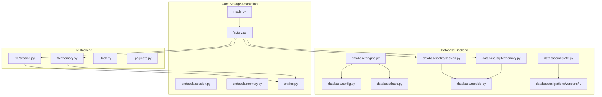

**Diagram sources**
- [factory.py:1-68](file://src/ark_agentic/core/storage/factory.py#L1-L68)
- [mode.py:1-32](file://src/ark_agentic/core/storage/mode.py#L1-L32)
- [entries.py:1-62](file://src/ark_agentic/core/storage/entries.py#L1-L62)
- [protocols/session.py:1-194](file://src/ark_agentic/core/storage/protocols/session.py#L1-L194)
- [protocols/memory.py:1-56](file://src/ark_agentic/core/storage/protocols/memory.py#L1-L56)
- [file/session.py:1-371](file://src/ark_agentic/core/storage/file/session.py#L1-L371)
- [file/memory.py:1-171](file://src/ark_agentic/core/storage/file/memory.py#L1-L171)
- [file/_lock.py](file://src/ark_agentic/core/storage/file/_lock.py)
- [file/_paginate.py](file://src/ark_agentic/core/storage/file/_paginate.py)
- [database/engine.py:1-164](file://src/ark_agentic/core/storage/database/engine.py#L1-L164)
- [database/config.py:1-41](file://src/ark_agentic/core/storage/database/config.py#L1-L41)
- [database/base.py:1-21](file://src/ark_agentic/core/storage/database/base.py#L1-L21)
- [database/models.py:1-70](file://src/ark_agentic/core/storage/database/models.py#L1-L70)
- [database/sqlite/session.py:1-364](file://src/ark_agentic/core/storage/database/sqlite/session.py#L1-L364)
- [database/sqlite/memory.py:1-141](file://src/ark_agentic/core/storage/database/sqlite/memory.py#L1-L141)
- [database/migrate.py:1-94](file://src/ark_agentic/core/storage/database/migrate.py#L1-L94)
- [database/migrations/versions/20260505_0001_initial_core_schema.py:1-84](file://src/ark_agentic/core/storage/database/migrations/versions/20260505_0001_initial_core_schema.py#L1-L84)

**Section sources**
- [__init__.py:1-10](file://src/ark_agentic/core/storage/__init__.py#L1-L10)
- [mode.py:1-32](file://src/ark_agentic/core/storage/mode.py#L1-L32)
- [factory.py:1-68](file://src/ark_agentic/core/storage/factory.py#L1-L68)

## Core Components
- Storage mode selection: Controlled by an environment variable that determines whether the file or SQLite backend is active.
- Protocol layer: Defines narrow protocols for session message/meta/transcript/admin operations and a unified session repository interface. Memory repository protocol defines heading-structured user memory operations.
- Factory: Dispatches to the appropriate backend implementation based on the active mode.
- DTOs: Backend-neutral data transfer objects for session metadata.
- Database layer: Shared declarative base, models, engine configuration, and migration utilities.

Key responsibilities:
- Mode selection and backend dispatch
- Session and memory persistence abstractions
- File and SQLite implementations
- Schema bootstrap and migrations

**Section sources**
- [mode.py:19-32](file://src/ark_agentic/core/storage/mode.py#L19-L32)
- [factory.py:30-68](file://src/ark_agentic/core/storage/factory.py#L30-L68)
- [entries.py:15-62](file://src/ark_agentic/core/storage/entries.py#L15-L62)
- [protocols/session.py:17-194](file://src/ark_agentic/core/storage/protocols/session.py#L17-L194)
- [protocols/memory.py:8-56](file://src/ark_agentic/core/storage/protocols/memory.py#L8-L56)
- [database/base.py:19-21](file://src/ark_agentic/core/storage/database/base.py#L19-L21)
- [database/models.py:16-70](file://src/ark_agentic/core/storage/database/models.py#L16-L70)

## Architecture Overview
The system uses a factory pattern to select the active storage backend at runtime. The protocol layer decouples business logic from storage implementation. The file backend persists sessions as JSONL transcripts and metadata per user, while the SQLite backend persists sessions and memory in relational tables with indexes and foreign keys.

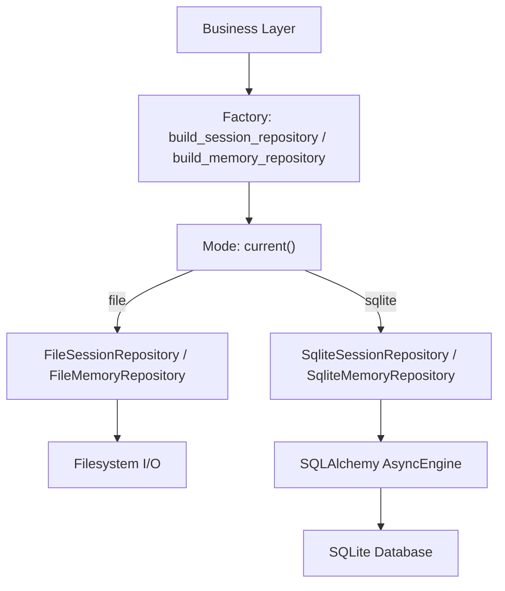

**Diagram sources**
- [factory.py:30-68](file://src/ark_agentic/core/storage/factory.py#L30-L68)
- [mode.py:19-32](file://src/ark_agentic/core/storage/mode.py#L19-L32)
- [file/session.py:44-371](file://src/ark_agentic/core/storage/file/session.py#L44-L371)
- [file/memory.py:27-171](file://src/ark_agentic/core/storage/file/memory.py#L27-L171)
- [database/sqlite/session.py:42-364](file://src/ark_agentic/core/storage/database/sqlite/session.py#L42-L364)
- [database/sqlite/memory.py:25-141](file://src/ark_agentic/core/storage/database/sqlite/memory.py#L25-L141)
- [database/engine.py:108-118](file://src/ark_agentic/core/storage/database/engine.py#L108-L118)

## Detailed Component Analysis

### Storage Mode Selection
- The mode module reads an environment variable to decide between file and sqlite backends.
- It validates the value and exposes a predicate to check if a database backend is active.

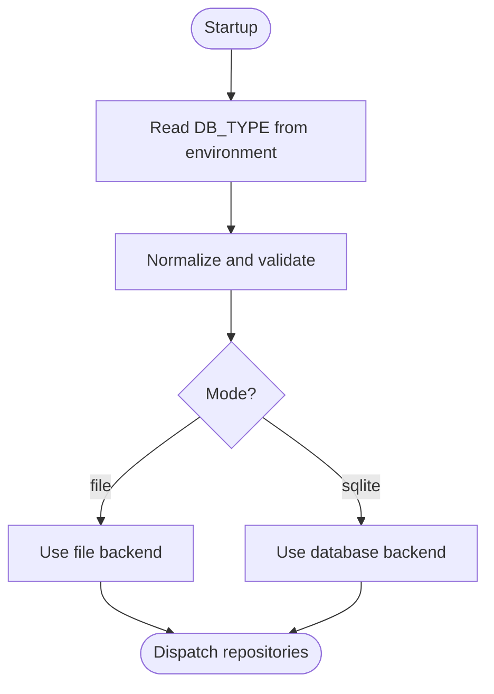

**Diagram sources**
- [mode.py:19-32](file://src/ark_agentic/core/storage/mode.py#L19-L32)

**Section sources**
- [mode.py:19-32](file://src/ark_agentic/core/storage/mode.py#L19-L32)

### Repository Factory Pattern
- The factory builds session and memory repositories depending on the active mode.
- For file mode, it requires directory paths; for sqlite mode, it obtains an AsyncEngine from the database layer.

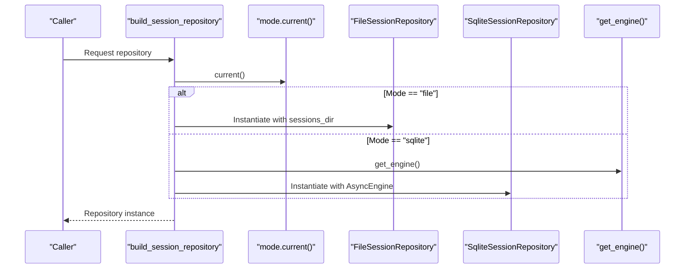

**Diagram sources**
- [factory.py:30-68](file://src/ark_agentic/core/storage/factory.py#L30-L68)
- [database/engine.py:108-118](file://src/ark_agentic/core/storage/database/engine.py#L108-L118)

**Section sources**
- [factory.py:30-68](file://src/ark_agentic/core/storage/factory.py#L30-L68)

### Session Repository Protocols
- Narrow protocols define message append/load, metadata updates/load/list, raw transcript get/put, and admin listing.
- The unified SessionRepository aggregates these responsibilities for backend implementations.

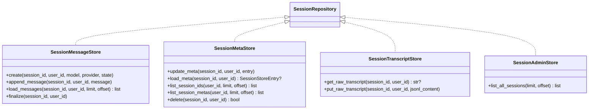

**Diagram sources**
- [protocols/session.py:17-194](file://src/ark_agentic/core/storage/protocols/session.py#L17-L194)

**Section sources**
- [protocols/session.py:17-194](file://src/ark_agentic/core/storage/protocols/session.py#L17-L194)

### Memory Repository Protocol
- Defines read, heading-level upsert/overwrite, listing users, and last dream timestamps for memory consolidation.

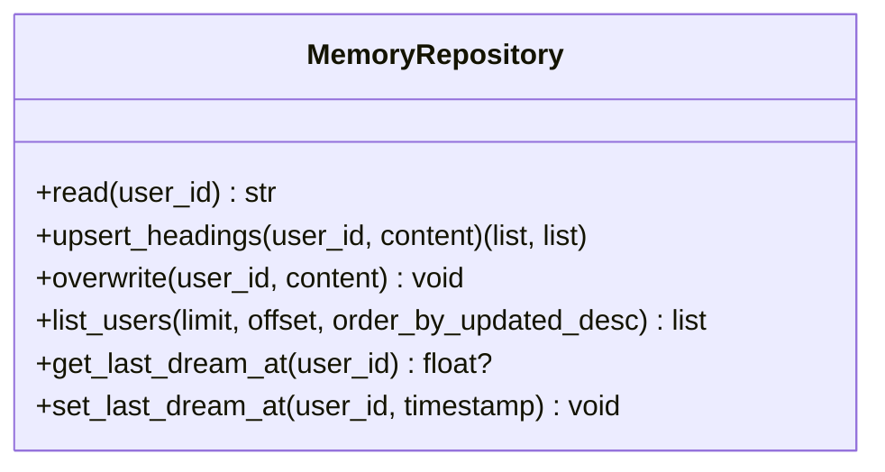

**Diagram sources**
- [protocols/memory.py:8-56](file://src/ark_agentic/core/storage/protocols/memory.py#L8-L56)

**Section sources**
- [protocols/memory.py:8-56](file://src/ark_agentic/core/storage/protocols/memory.py#L8-L56)

### File-Based Session Implementation
- Stores transcripts as JSONL per session and per-user metadata in a JSON map with TTL cache.
- Uses file locks to ensure atomic append and metadata updates.
- Provides pagination helpers and ownership checks via user-scoped paths.

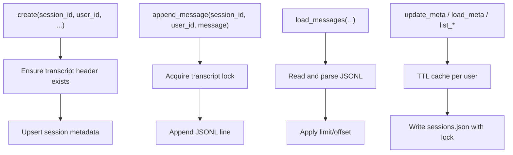

**Diagram sources**
- [file/session.py:74-121](file://src/ark_agentic/core/storage/file/session.py#L74-L121)
- [file/session.py:122-163](file://src/ark_agentic/core/storage/file/session.py#L122-L163)
- [file/session.py:166-211](file://src/ark_agentic/core/storage/file/session.py#L166-L211)
- [file/session.py:305-371](file://src/ark_agentic/core/storage/file/session.py#L305-L371)

**Section sources**
- [file/session.py:44-371](file://src/ark_agentic/core/storage/file/session.py#L44-L371)
- [file/_lock.py](file://src/ark_agentic/core/storage/file/_lock.py)
- [file/_paginate.py](file://src/ark_agentic/core/storage/file/_paginate.py)

### File-Based Memory Implementation
- Stores user memory as a single markdown file per user.
- Implements heading-level upsert and overwrite with temporary files for atomic writes.
- Tracks last dream timestamp in a separate file.

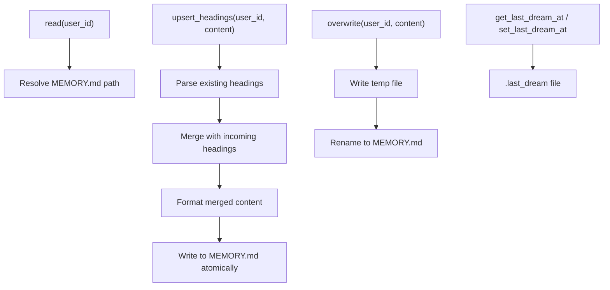

**Diagram sources**
- [file/memory.py:37-102](file://src/ark_agentic/core/storage/file/memory.py#L37-L102)
- [file/memory.py:106-141](file://src/ark_agentic/core/storage/file/memory.py#L106-L141)

**Section sources**
- [file/memory.py:27-171](file://src/ark_agentic/core/storage/file/memory.py#L27-L171)

### SQLite Session Implementation
- Uses SQLAlchemy AsyncEngine with SQLite dialect.
- Implements atomic append with sequence number assignment and conflict handling.
- Supports raw transcript replacement in a single transaction with ownership verification.
- Enforces user ownership in all queries.

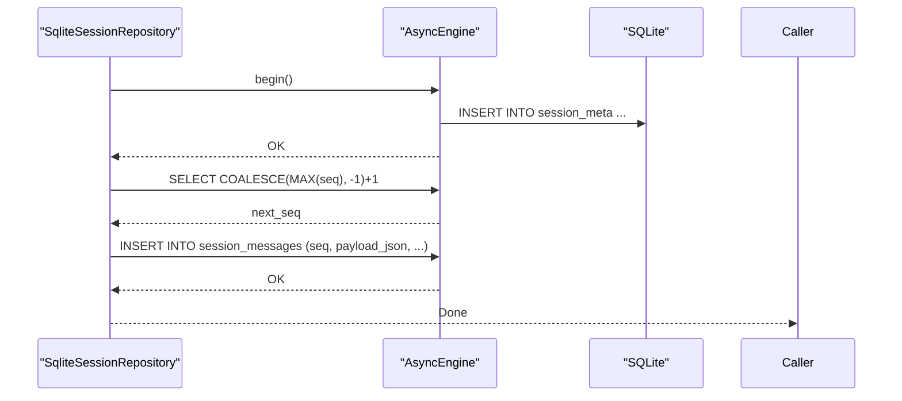

**Diagram sources**
- [database/sqlite/session.py:50-111](file://src/ark_agentic/core/storage/database/sqlite/session.py#L50-L111)
- [database/sqlite/session.py:315-356](file://src/ark_agentic/core/storage/database/sqlite/session.py#L315-L356)

**Section sources**
- [database/sqlite/session.py:42-364](file://src/ark_agentic/core/storage/database/sqlite/session.py#L42-L364)

### SQLite Memory Implementation
- Stores user memory as a single blob per user with heading-level upsert using read-modify-write in a transaction.
- Maintains last dream timestamp and updated_at for ordering.

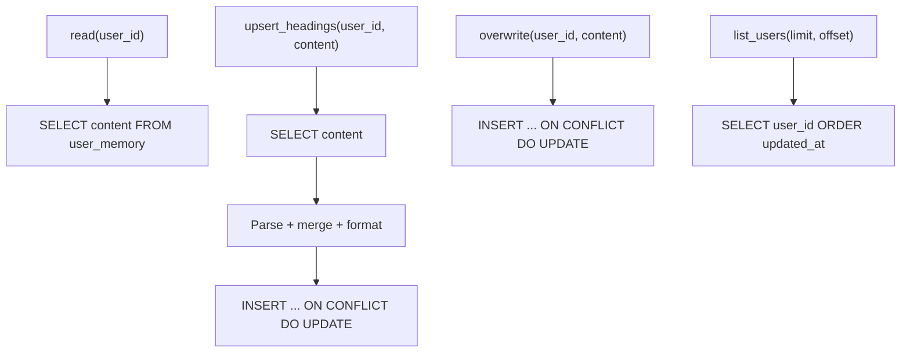

**Diagram sources**
- [database/sqlite/memory.py:31-95](file://src/ark_agentic/core/storage/database/sqlite/memory.py#L31-L95)
- [database/sqlite/memory.py:124-141](file://src/ark_agentic/core/storage/database/sqlite/memory.py#L124-L141)

**Section sources**
- [database/sqlite/memory.py:25-141](file://src/ark_agentic/core/storage/database/sqlite/memory.py#L25-L141)

### Database Schema and Migrations
- Core tables: session_meta, session_messages, user_memory.
- Indexes: composite index on session_messages(session_id, seq), index on session_messages(user_id), index on session_meta(user_id).
- Foreign key cascade ensures referential integrity.
- Migration system uses Alembic with a stamp-or-upgrade strategy to handle legacy deployments.

```mermaid
erDiagram
SESSION_META {
string session_id PK
string user_id
int updated_at
string model
string provider
text state_json
int prompt_tokens
int completion_tokens
int total_tokens
int compaction_count
text active_skill_ids_json
}
SESSION_MESSAGES {
int id PK AI
string session_id FK
string user_id
int seq
text payload_json
int timestamp
}
USER_MEMORY {
string user_id PK
text content
float last_dream_at
int updated_at
}
SESSION_MESSAGES }o--|| SESSION_META : "references"
```

**Diagram sources**
- [database/models.py:16-70](file://src/ark_agentic/core/storage/database/models.py#L16-L70)
- [database/migrations/versions/20260505_0001_initial_core_schema.py:17-84](file://src/ark_agentic/core/storage/database/migrations/versions/20260505_0001_initial_core_schema.py#L17-L84)

**Section sources**
- [database/models.py:16-70](file://src/ark_agentic/core/storage/database/models.py#L16-L70)
- [database/migrations/versions/20260505_0001_initial_core_schema.py:17-84](file://src/ark_agentic/core/storage/database/migrations/versions/20260505_0001_initial_core_schema.py#L17-L84)

### Engine Configuration and Migration Utilities
- Engine factory supports SQLite and external databases with pooling.
- SQLite pragmas are enabled for file-backed databases (WAL, foreign keys, synchronous).
- Migration helper supports stamp-or-upgrade and testing shortcuts.

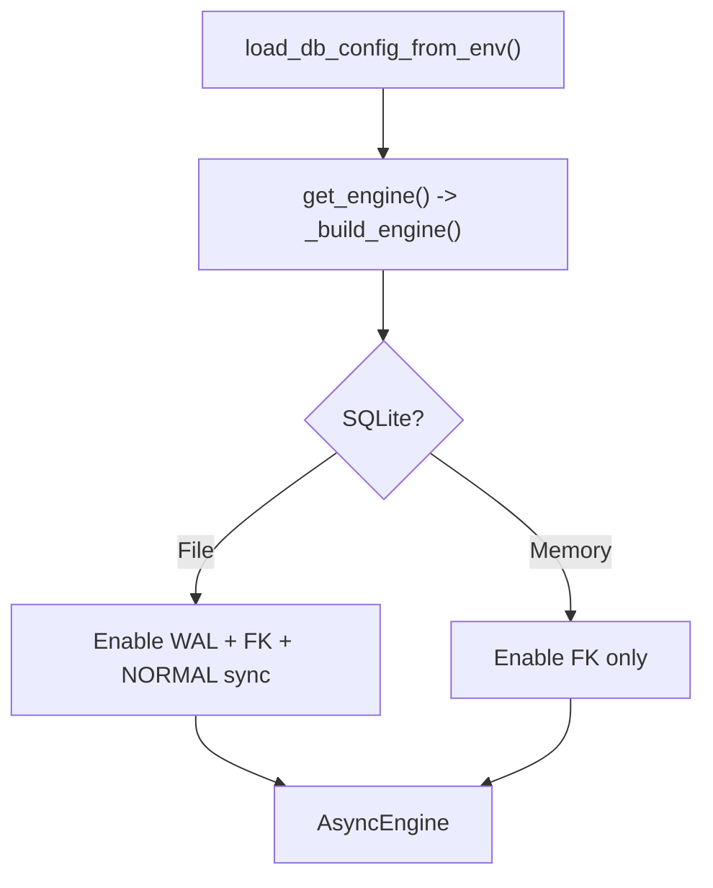

**Diagram sources**
- [database/config.py:24-41](file://src/ark_agentic/core/storage/database/config.py#L24-L41)
- [database/engine.py:108-118](file://src/ark_agentic/core/storage/database/engine.py#L108-L118)
- [database/engine.py:46-101](file://src/ark_agentic/core/storage/database/engine.py#L46-L101)

**Section sources**
- [database/config.py:17-41](file://src/ark_agentic/core/storage/database/config.py#L17-L41)
- [database/engine.py:71-101](file://src/ark_agentic/core/storage/database/engine.py#L71-L101)
- [database/migrate.py:28-94](file://src/ark_agentic/core/storage/database/migrate.py#L28-L94)

## Dependency Analysis
- Factory depends on mode and backend implementations.
- File backends depend on shared JSONL utilities and filesystem primitives.
- SQLite backends depend on SQLAlchemy models and engine utilities.
- Engine utilities depend on configuration and Alembic migration helpers.

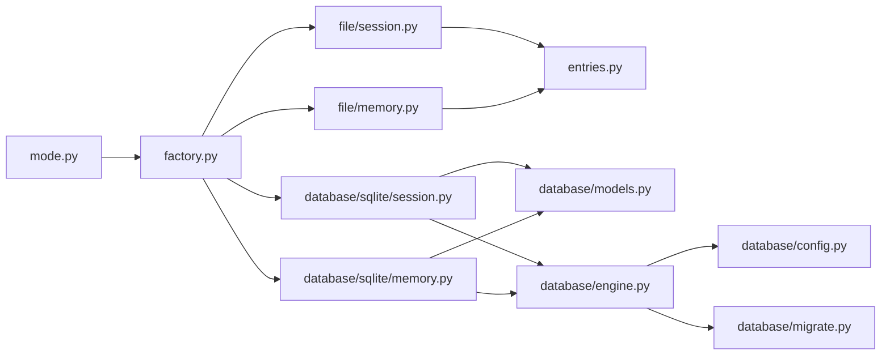

**Diagram sources**
- [factory.py:13-18](file://src/ark_agentic/core/storage/factory.py#L13-L18)
- [file/session.py:25-35](file://src/ark_agentic/core/storage/file/session.py#L25-L35)
- [file/memory.py:15-22](file://src/ark_agentic/core/storage/file/memory.py#L15-L22)
- [database/sqlite/session.py:29-39](file://src/ark_agentic/core/storage/database/sqlite/session.py#L29-L39)
- [database/sqlite/memory.py:18-23](file://src/ark_agentic/core/storage/database/sqlite/memory.py#L18-L23)
- [database/engine.py:23-27](file://src/ark_agentic/core/storage/database/engine.py#L23-L27)

**Section sources**
- [factory.py:13-18](file://src/ark_agentic/core/storage/factory.py#L13-L18)
- [file/session.py:25-35](file://src/ark_agentic/core/storage/file/session.py#L25-L35)
- [file/memory.py:15-22](file://src/ark_agentic/core/storage/file/memory.py#L15-L22)
- [database/sqlite/session.py:29-39](file://src/ark_agentic/core/storage/database/sqlite/session.py#L29-L39)
- [database/sqlite/memory.py:18-23](file://src/ark_agentic/core/storage/database/sqlite/memory.py#L18-L23)
- [database/engine.py:23-27](file://src/ark_agentic/core/storage/database/engine.py#L23-L27)

## Performance Considerations
- File backend:
  - JSONL append is O(1) per message; metadata cache reduces repeated reads for per-user maps.
  - File locks serialize concurrent writers; consider limiting concurrent appends per session.
  - Pagination helpers avoid loading entire transcripts when limit/offset are used.
- SQLite backend:
  - Composite index on (session_id, seq) supports efficient ordered loads.
  - Ownership checks in WHERE clauses prevent cross-user access and enable proper isolation.
  - Transactions batch inserts and enforce atomicity for transcript replacement.
  - Pool sizing configurable via environment for external databases; SQLite uses async driver with pragmas optimized for durability and concurrency.
- General:
  - Prefer paginated queries for large datasets.
  - Avoid limit=None on hot paths for PostgreSQL (planned enforcement) to prevent full scans.

[No sources needed since this section provides general guidance]

## Troubleshooting Guide
- Unsupported storage mode:
  - Symptom: ValueError indicating unsupported mode.
  - Action: Set DB_TYPE to "file" or "sqlite".
- Missing required path for file mode:
  - Symptom: ValueError requesting a path parameter when DB_TYPE=file.
  - Action: Provide the required directory path or switch to sqlite mode.
- JSONL validation failures:
  - Symptom: Validation errors during raw transcript replacement.
  - Action: Fix malformed JSONL content; ensure header and message entries conform to expected schema.
- Concurrency and integrity:
  - Symptom: IntegrityError on concurrent appends to the same session.
  - Action: Ensure per-session serialization or add retry-on-IntegrityError handling if dropping ordering guarantees.
- Ownership violations:
  - Symptom: Transcript replacement fails due to ownership mismatch.
  - Action: Verify session_id and user_id pairing; ensure the user owns the session before mutation.

**Section sources**
- [factory.py:21-27](file://src/ark_agentic/core/storage/factory.py#L21-L27)
- [file/session.py:149-163](file://src/ark_agentic/core/storage/file/session.py#L149-L163)
- [database/sqlite/session.py:342-347](file://src/ark_agentic/core/storage/database/sqlite/session.py#L342-L347)

## Conclusion
The storage subsystem provides a clean protocol-based abstraction enabling seamless backend switching between file and SQLite. The file backend offers simplicity and portability, while the SQLite backend scales with relational capabilities, indexing, and ACID properties. The factory pattern centralizes mode selection, and the migration utilities ensure robust schema evolution. By following the documented data access patterns, caching strategies, and performance guidelines, teams can deploy reliable and scalable persistence for agent sessions and memory.

[No sources needed since this section summarizes without analyzing specific files]

## Appendices

### Data Lifecycle Management and Retention
- Sessions:
  - Creation initializes metadata and transcript header.
  - Messages appended with monotonic sequence numbers; transcripts can be replaced atomically.
  - Metadata updates track model/provider/token usage and compaction counts.
  - Ownership enforced per user to prevent cross-session interference.
- Memory:
  - Heading-level upsert merges new content into existing sections.
  - Overwrite replaces entire content atomically.
  - Last dream timestamp records consolidation cadence for memory consolidation workflows.

**Section sources**
- [file/session.py:74-121](file://src/ark_agentic/core/storage/file/session.py#L74-L121)
- [file/session.py:143-163](file://src/ark_agentic/core/storage/file/session.py#L143-L163)
- [database/sqlite/session.py:50-111](file://src/ark_agentic/core/storage/database/sqlite/session.py#L50-L111)
- [database/sqlite/session.py:315-356](file://src/ark_agentic/core/storage/database/sqlite/session.py#L315-L356)
- [file/memory.py:44-102](file://src/ark_agentic/core/storage/file/memory.py#L44-L102)
- [database/sqlite/memory.py:40-95](file://src/ark_agentic/core/storage/database/sqlite/memory.py#L40-L95)

### Security and Backup Strategies
- Security:
  - File backend: user-scoped directories and locks protect data isolation.
  - SQLite backend: per-user WHERE clauses and foreign keys maintain referential integrity and ownership semantics.
- Backup:
  - File backend: snapshot directories containing JSONL and metadata files.
  - SQLite backend: export database or copy the SQLite file; enable WAL mode for improved durability.

[No sources needed since this section provides general guidance]

### Scaling Considerations
- File backend: suitable for single-node deployments; consider filesystem throughput and locking overhead under high concurrency.
- SQLite backend: WAL mode improves concurrency; external databases (e.g., PostgreSQL) can be configured via environment variables; tune pool size appropriately.
- Horizontal scaling: file backend is inherently single-writer; SQLite supports multiple readers/writers with WAL; consider sharding by user_id or session_id for very large workloads.

[No sources needed since this section provides general guidance]