# A2UI Component System

<cite>
**Referenced Files in This Document**
- [__init__.py](file://src/ark_agentic/core/a2ui/__init__.py)
- [blocks.py](file://src/ark_agentic/core/a2ui/blocks.py)
- [composer.py](file://src/ark_agentic/core/a2ui/composer.py)
- [renderer.py](file://src/ark_agentic/core/a2ui/renderer.py)
- [theme.py](file://src/ark_agentic/core/a2ui/theme.py)
- [transforms.py](file://src/ark_agentic/core/a2ui/transforms.py)
- [validator.py](file://src/ark_agentic/core/a2ui/validator.py)
- [guard.py](file://src/ark_agentic/core/a2ui/guard.py)
- [preset_registry.py](file://src/ark_agentic/core/a2ui/preset_registry.py)
- [contract_models.py](file://src/ark_agentic/core/a2ui/contract_models.py)
- [components.py](file://src/ark_agentic/agents/insurance/a2ui/components.py)
- [blocks.py](file://src/ark_agentic/agents/insurance/a2ui/blocks.py)
- [withdraw_a2ui_utils.py](file://src/ark_agentic/agents/insurance/a2ui/withdraw_a2ui_utils.py)
- [preset_extractors.py](file://src/ark_agentic/agents/securities/a2ui/preset_extractors.py)
- [template_renderer.py](file://src/ark_agentic/agents/securities/template_renderer.py)
- [schemas.py](file://src/ark_agentic/agents/securities/schemas.py)
- [render_a2ui.py](file://src/ark_agentic/core/tools/render_a2ui.py)
- [test_a2ui_blocks_components.py](file://tests/unit/agents/insurance/test_a2ui_blocks_components.py)
</cite>

## Update Summary
**Changes Made**
- Enhanced digest propagation documentation with structured llm_digest format and downstream integration
- Updated state management section to cover new state_delta merging and session persistence
- Added comprehensive component schema documentation with structured data validation
- Expanded template system documentation to include explicit presentation markers
- Updated architecture diagrams to reflect enhanced component composition patterns

## Table of Contents
1. [Introduction](#introduction)
2. [Project Structure](#project-structure)
3. [Core Components](#core-components)
4. [Architecture Overview](#architecture-overview)
5. [Enhanced Digest Propagation System](#enhanced-digest-propagation-system)
6. [State Management and Downstream Integration](#state-management-and-downstream-integration)
7. [Component Schema Documentation](#component-schema-documentation)
8. [Detailed Component Analysis](#detailed-component-analysis)
9. [Dependency Analysis](#dependency-analysis)
10. [Performance Considerations](#performance-considerations)
11. [Troubleshooting Guide](#troubleshooting-guide)
12. [Conclusion](#conclusion)
13. [Appendices](#appendices)

## Introduction
This document explains the A2UI component system used to render dynamic, agent-driven UI surfaces with enhanced digest propagation capabilities and improved state management. The system has been streamlined to focus on core UI rendering through direct component composition while providing robust downstream skill integration through structured digest formats and state delta mechanisms. It covers the complete architecture including block and component builders, the A2UI block system, component composition patterns, enhanced state management, and the JavaScript renderer integration.

## Project Structure
The A2UI system is split into two layers with enhanced state management:
- Core layer: Provides the rendering engine, block infrastructure, transforms, validators, theme, and contract validation.
- Agent-specific layer: Implements business-aware components and extractors for domains like Insurance and Securities with structured schema documentation.

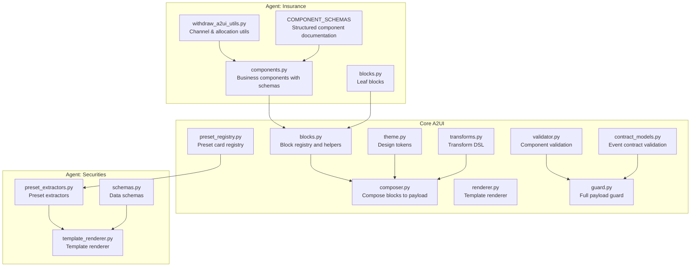

**Diagram sources**
- [blocks.py:1-149](file://src/ark_agentic/core/a2ui/blocks.py#L1-L149)
- [composer.py:1-123](file://src/ark_agentic/core/a2ui/composer.py#L1-L123)
- [renderer.py:1-53](file://src/ark_agentic/core/a2ui/renderer.py#L1-L53)
- [theme.py:1-39](file://src/ark_agentic/core/a2ui/theme.py#L1-L39)
- [transforms.py:1-396](file://src/ark_agentic/core/a2ui/transforms.py#L1-L396)
- [validator.py:1-227](file://src/ark_agentic/core/a2ui/validator.py#L1-L227)
- [guard.py:1-125](file://src/ark_agentic/core/a2ui/guard.py#L1-L125)
- [preset_registry.py:1-53](file://src/ark_agentic/core/a2ui/preset_registry.py#L1-L53)
- [contract_models.py:1-123](file://src/ark_agentic/core/a2ui/contract_models.py#L1-L123)
- [components.py:443-458](file://src/ark_agentic/agents/insurance/a2ui/components.py#L443-L458)
- [blocks.py:1-145](file://src/ark_agentic/agents/insurance/a2ui/blocks.py#L1-L145)
- [withdraw_a2ui_utils.py:1-123](file://src/ark_agentic/agents/insurance/a2ui/withdraw_a2ui_utils.py#L1-L123)
- [preset_extractors.py:1-222](file://src/ark_agentic/agents/securities/a2ui/preset_extractors.py#L1-L222)
- [template_renderer.py:1-374](file://src/ark_agentic/agents/securities/template_renderer.py#L1-L374)
- [schemas.py](file://src/ark_agentic/agents/securities/schemas.py)

**Section sources**
- [__init__.py:1-39](file://src/ark_agentic/core/a2ui/__init__.py#L1-L39)

## Core Components
- Block registry and helpers: Registers block builders, resolves bindings, and provides convenience constructors for components with enhanced digest and state management support.
- Composer: Assembles block descriptors into a standardized A2UI payload with a root Column and theme-aware defaults, supporting inline transform specifications.
- Renderer: Loads preset templates from disk and merges flat data into a complete payload with structured digest propagation.
- Theme: Centralized design tokens for colors, spacing, and typography.
- Transforms: Declarative data transformation engine to compute UI-ready values from raw data with error handling.
- Validator and Guard: Validates component structure, binding correctness, and data coverage with enhanced contract validation.
- Preset Registry: Manages preset card extractors for agent-specific rendering.
- Contract Models: Strict event payload validation ensuring protocol compliance for downstream integrations.

**Section sources**
- [blocks.py:1-149](file://src/ark_agentic/core/a2ui/blocks.py#L1-L149)
- [composer.py:1-123](file://src/ark_agentic/core/a2ui/composer.py#L1-L123)
- [renderer.py:1-53](file://src/ark_agentic/core/a2ui/renderer.py#L1-L53)
- [theme.py:1-39](file://src/ark_agentic/core/a2ui/theme.py#L1-L39)
- [transforms.py:1-396](file://src/ark_agentic/core/a2ui/transforms.py#L1-L396)
- [validator.py:1-227](file://src/ark_agentic/core/a2ui/validator.py#L1-L227)
- [guard.py:1-125](file://src/ark_agentic/core/a2ui/guard.py#L1-L125)
- [preset_registry.py:1-53](file://src/ark_agentic/core/a2ui/preset_registry.py#L1-L53)
- [contract_models.py:1-123](file://src/ark_agentic/core/a2ui/contract_models.py#L1-L123)

## Architecture Overview
The A2UI rendering pipeline integrates three streamlined pathways with enhanced state management:
- Dynamic blocks: Agent-defined block builders produce components with structured llm_digest and state_delta; Composer wraps them into a payload.
- Preset templates: Template renderer loads card-type templates and merges flat data with digest propagation.
- Securities presets: Domain-specific extractors and renderers for financial cards with schema validation.

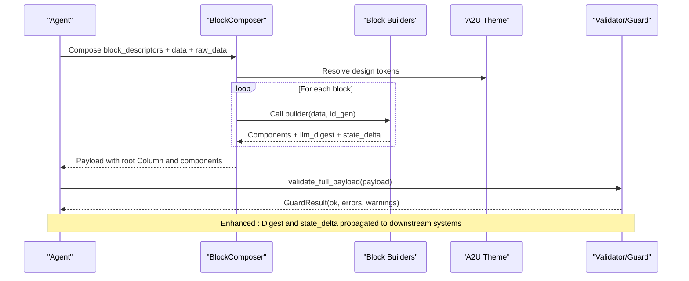

**Diagram sources**
- [composer.py:57-123](file://src/ark_agentic/core/a2ui/composer.py#L57-L123)
- [blocks.py:96-149](file://src/ark_agentic/core/a2ui/blocks.py#L96-L149)
- [theme.py:12-39](file://src/ark_agentic/core/a2ui/theme.py#L12-L39)
- [guard.py:83-125](file://src/ark_agentic/core/a2ui/guard.py#L83-L125)

## Enhanced Digest Propagation System
The A2UI system now provides structured digest propagation for downstream skill integration:

### Digest Format Specifications
- **Structured Format**: Digests follow a standardized format: `[Presentation Marker] Content | Key: Value | Total: Amount | Channel Summary`
- **Presentation Markers**: Explicit markers indicate digest purpose (e.g., `[已向用户展示卡片]`, `[方案摘要]`)
- **Channel Tracking**: Automatic channel identification and allocation summaries
- **Amount Precision**: Formatted currency values with proper decimal representation

### Digest Propagation Mechanism
- **Component-Level**: Individual components generate llm_digest strings during rendering
- **Pipeline-Level**: RenderA2UITool aggregates digests from all components
- **Downstream Integration**: Digests are attached to tool results for LLM conversation context

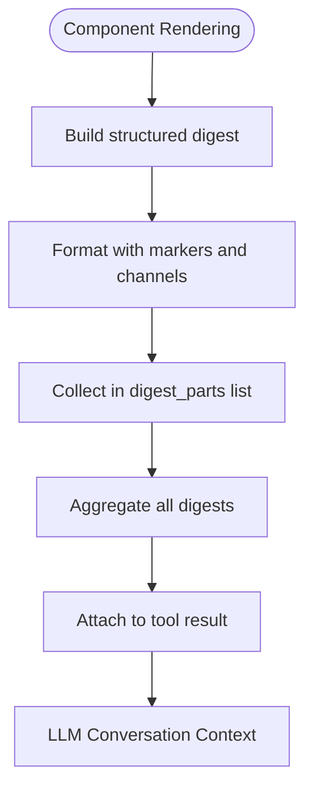

**Diagram sources**
- [components.py:420-432](file://src/ark_agentic/agents/insurance/a2ui/components.py#L420-L432)
- [render_a2ui.py:351-358](file://src/ark_agentic/core/tools/render_a2ui.py#L351-L358)

**Section sources**
- [components.py:420-432](file://src/ark_agentic/agents/insurance/a2ui/components.py#L420-L432)
- [render_a2ui.py:351-358](file://src/ark_agentic/core/tools/render_a2ui.py#L351-L358)
- [test_a2ui_blocks_components.py:326-334](file://tests/unit/agents/insurance/test_a2ui_blocks_components.py#L326-L334)

## State Management and Downstream Integration
The A2UI system provides comprehensive state management for downstream skill integration:

### State Delta Structure
- **Session Persistence**: state_delta values are merged into session.state for persistent storage
- **Component State**: Individual components contribute state fragments that are aggregated
- **Type Preservation**: Lists are extended, other types are overwritten during merge
- **Downstream Access**: Extracted state is available to subsequent tool calls and skills

### State Delta Propagation
- **Component-Level**: Components specify state_delta dictionaries containing business context
- **Pipeline-Level**: RenderA2UITool merges state deltas from all components
- **Session Integration**: Merged state is persisted in the agent session for future turns

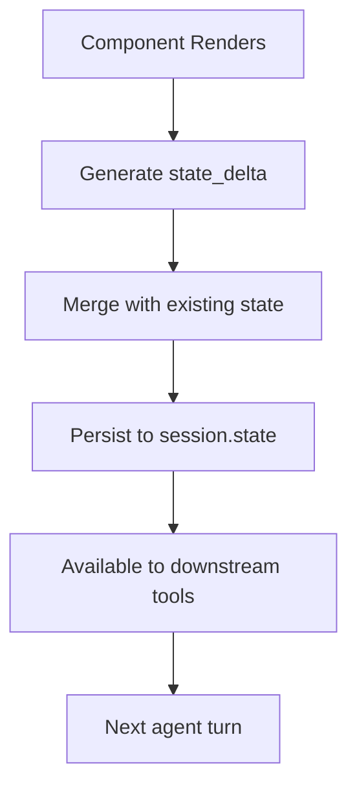

**Diagram sources**
- [components.py:428-432](file://src/ark_agentic/agents/insurance/a2ui/components.py#L428-L432)
- [render_a2ui.py:354-358](file://src/ark_agentic/core/tools/render_a2ui.py#L354-L358)

**Section sources**
- [components.py:428-432](file://src/ark_agentic/agents/insurance/a2ui/components.py#L428-L432)
- [render_a2ui.py:354-358](file://src/ark_agentic/core/tools/render_a2ui.py#L354-L358)
- [test_a2ui_blocks_components.py:336-348](file://tests/unit/agents/insurance/test_a2ui_blocks_components.py#L336-L348)

## Component Schema Documentation
The A2UI system now includes comprehensive component schema documentation for improved development and maintenance:

### Schema Structure
- **COMPONENT_SCHEMAS**: Dictionary mapping component names to structured documentation
- **Data Requirements**: Clear specification of required and optional data fields
- **Validation Support**: Schemas enable automated validation and IDE support
- **Domain-Specific**: Tailored schemas for different business domains

### Insurance Component Schemas
- **WithdrawSummaryHeader**: Sections configuration and policy exclusion options
- **WithdrawSummarySection**: Section type specification (zero_cost, loan, survival_fund, etc.)
- **WithdrawPlanCard**: Multi-channel allocation with target amounts and policy filtering

**Section sources**
- [components.py:443-458](file://src/ark_agentic/agents/insurance/a2ui/components.py#L443-L458)

## Detailed Component Analysis

### Block System and Composition
- Block registry: Agents register block builders under unique names; the core provides a safe lookup and error handling for unknown types.
- Inline transforms: Values in block data can embed transform specs; Composer resolves them against raw_data before invoking builders.
- Root composition: Composer wraps all emitted components under a root Column configured by the theme.

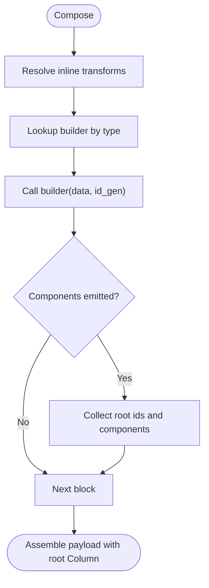

**Diagram sources**
- [composer.py:45-123](file://src/ark_agentic/core/a2ui/composer.py#L45-L123)
- [blocks.py:96-149](file://src/ark_agentic/core/a2ui/blocks.py#L96-L149)

**Section sources**
- [blocks.py:96-149](file://src/ark_agentic/core/a2ui/blocks.py#L96-L149)
- [composer.py:57-123](file://src/ark_agentic/core/a2ui/composer.py#L57-L123)

### Template System and Preset Rendering
- Template renderer loads a card-type template from disk, injects a surfaceId, and merges flat data into the payload's data field.
- Securities agent provides preset extractors and a dedicated template renderer for financial cards.
- Enhanced: Templates now support explicit presentation markers for structured digest integration.

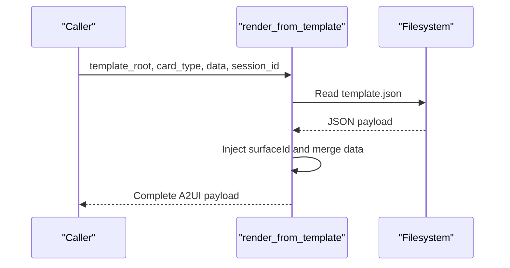

**Diagram sources**
- [renderer.py:15-53](file://src/ark_agentic/core/a2ui/renderer.py#L15-L53)
- [template_renderer.py](file://src/ark_agentic/agents/securities/template_renderer.py)

**Section sources**
- [renderer.py:15-53](file://src/ark_agentic/core/a2ui/renderer.py#L15-L53)
- [preset_extractors.py](file://src/ark_agentic/agents/securities/a2ui/preset_extractors.py)
- [template_renderer.py](file://src/ark_agentic/agents/securities/template_renderer.py)

### Transform DSL Engine
- Supports operators: get, sum, count, concat, select, switch, literal.
- Path resolution supports nested dicts, arrays, wildcards, and conditions.
- Formatting functions: currency, percent, int, raw.
- Errors are captured with context for LLM retry.

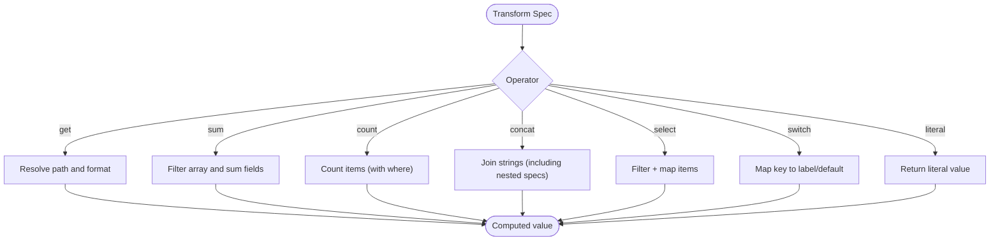

**Diagram sources**
- [transforms.py:186-316](file://src/ark_agentic/core/a2ui/transforms.py#L186-L316)

**Section sources**
- [transforms.py:1-396](file://src/ark_agentic/core/a2ui/transforms.py#L1-L396)

### Validation and Safety
- Component-level validation ensures supported component types, correct props, and binding XOR semantics.
- Full payload guard composes event contract validation, component validation, and data coverage checks.
- Enhanced: Contract models provide strict event payload validation for protocol compliance.

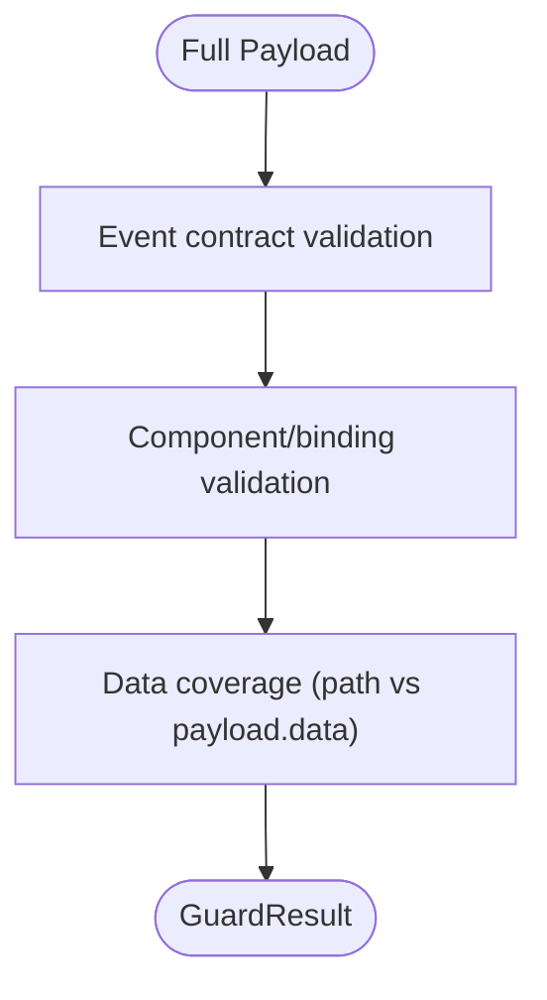

**Diagram sources**
- [guard.py:83-125](file://src/ark_agentic/core/a2ui/guard.py#L83-L125)
- [validator.py:88-227](file://src/ark_agentic/core/a2ui/validator.py#L88-L227)
- [contract_models.py:97-123](file://src/ark_agentic/core/a2ui/contract_models.py#L97-L123)

**Section sources**
- [guard.py:1-125](file://src/ark_agentic/core/a2ui/guard.py#L1-L125)
- [validator.py:1-227](file://src/ark_agentic/core/a2ui/validator.py#L1-L227)
- [contract_models.py:1-123](file://src/ark_agentic/core/a2ui/contract_models.py#L1-L123)

### Theming and Styling
- A2UITheme centralizes design tokens: accent colors, typography, spacing, and root layout.
- Components and blocks read theme values for consistent visuals across agents.

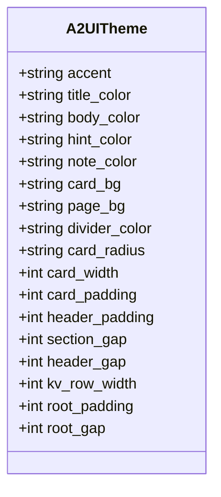

**Diagram sources**
- [theme.py:12-39](file://src/ark_agentic/core/a2ui/theme.py#L12-L39)

**Section sources**
- [theme.py:1-39](file://src/ark_agentic/core/a2ui/theme.py#L1-L39)

### Insurance Components and Utilities
- Business-aware components: Withdraw summary header/sections, and plan cards with structured schemas.
- Leaf blocks: Section headers, KV rows, totals, hints, action buttons, dividers.
- Channel utilities: Manage policy channels, allocations, and action generation.
- Enhanced: COMPONENT_SCHEMAS provide comprehensive documentation for all components.

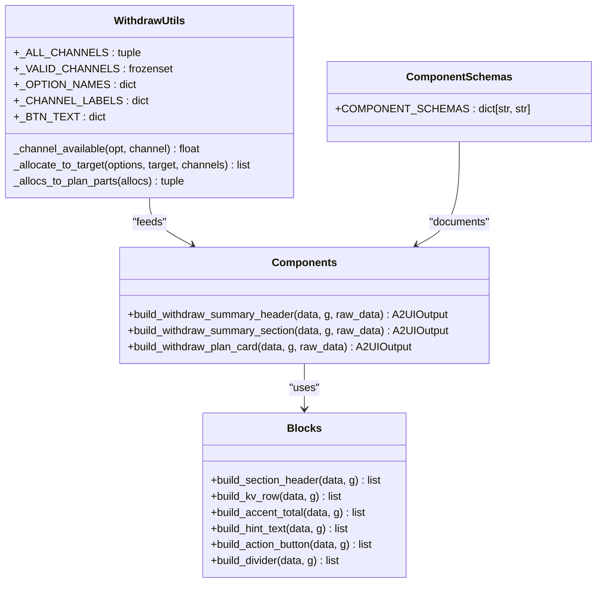

**Diagram sources**
- [components.py:144-438](file://src/ark_agentic/agents/insurance/a2ui/components.py#L144-L438)
- [blocks.py:29-141](file://src/ark_agentic/agents/insurance/a2ui/blocks.py#L29-L141)
- [withdraw_a2ui_utils.py:12-123](file://src/ark_agentic/agents/insurance/a2ui/withdraw_a2ui_utils.py#L12-L123)
- [components.py:443-458](file://src/ark_agentic/agents/insurance/a2ui/components.py#L443-L458)

**Section sources**
- [components.py:1-458](file://src/ark_agentic/agents/insurance/a2ui/components.py#L1-L458)
- [blocks.py:1-145](file://src/ark_agentic/agents/insurance/a2ui/blocks.py#L1-L145)
- [withdraw_a2ui_utils.py:1-123](file://src/ark_agentic/agents/insurance/a2ui/withdraw_a2ui_utils.py#L1-L123)
- [components.py:443-458](file://src/ark_agentic/agents/insurance/a2ui/components.py#L443-L458)

### Securities Presets and Rendering
- Securities agent provides preset extractors and a template renderer to generate financial cards from structured schemas.
- Schemas define the shape of data expected by the renderer.

**Section sources**
- [preset_extractors.py](file://src/ark_agentic/agents/securities/a2ui/preset_extractors.py)
- [template_renderer.py](file://src/ark_agentic/agents/securities/template_renderer.py)
- [schemas.py](file://src/ark_agentic/agents/securities/schemas.py)

## Dependency Analysis
- Core depends on theme, transforms, validators, and contract models.
- Agent components depend on core blocks and theme; they also rely on shared utilities for domain logic.
- Securities agent introduces its own renderer and extractors, decoupled from core.
- Enhanced: Contract models provide strict validation for all event payloads.

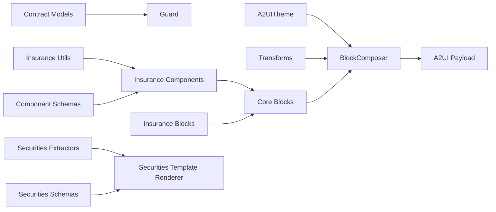

**Diagram sources**
- [composer.py:57-123](file://src/ark_agentic/core/a2ui/composer.py#L57-L123)
- [blocks.py:96-149](file://src/ark_agentic/core/a2ui/blocks.py#L96-L149)
- [components.py:23-458](file://src/ark_agentic/agents/insurance/a2ui/components.py#L23-L458)
- [blocks.py:16-145](file://src/ark_agentic/agents/insurance/a2ui/blocks.py#L16-L145)
- [withdraw_a2ui_utils.py:1-123](file://src/ark_agentic/agents/insurance/a2ui/withdraw_a2ui_utils.py#L1-L123)
- [contract_models.py:1-123](file://src/ark_agentic/core/a2ui/contract_models.py#L1-L123)
- [preset_extractors.py](file://src/ark_agentic/agents/securities/a2ui/preset_extractors.py)
- [template_renderer.py](file://src/ark_agentic/agents/securities/template_renderer.py)
- [schemas.py](file://src/ark_agentic/agents/securities/schemas.py)

**Section sources**
- [__init__.py:1-39](file://src/ark_agentic/core/a2ui/__init__.py#L1-L39)

## Performance Considerations
- Prefer compact payloads: avoid redundant components and excessive nesting.
- Use transforms judiciously: heavy aggregations should be precomputed upstream to reduce runtime cost.
- Leverage theme values to minimize per-component style overrides.
- Validate early: guard checks prevent rendering invalid payloads and reduce frontend work.
- **Enhanced**: Digest aggregation is optimized during pipeline execution to minimize memory overhead.

## Troubleshooting Guide
Common issues and resolutions:
- Unknown block type: Ensure the block is registered by the agent and available in the registry.
- Binding errors: Verify that binding fields contain exactly one of path or literalString and that paths exist in payload.data.
- Transform failures: Inspect operator usage and path correctness; warnings include operator and field context.
- Data coverage warnings: Ensure all path bindings reference keys present in payload.data.
- **Enhanced**: Digest format errors: Verify llm_digest follows structured format with proper markers and channel information.
- **Enhanced**: State delta conflicts: Check for conflicting state keys during merge operations.

**Section sources**
- [blocks.py:120-127](file://src/ark_agentic/core/a2ui/blocks.py#L120-L127)
- [validator.py:187-214](file://src/ark_agentic/core/a2ui/validator.py#L187-L214)
- [guard.py:39-80](file://src/ark_agentic/core/a2ui/guard.py#L39-L80)
- [transforms.py:186-316](file://src/ark_agentic/core/a2ui/transforms.py#L186-L316)

## Conclusion
The A2UI system provides a robust, extensible framework for composing dynamic UI surfaces from agent logic with enhanced digest propagation and state management capabilities. Its separation of concerns—core rendering, transforms, validation, contract enforcement, and agent-specific components—enables maintainable, theme-consistent UIs across domains. The addition of structured digest formats, comprehensive component schemas, and enhanced state management creates a powerful foundation for downstream skill integration and production deployment.

## Appendices

### Practical Examples

- Creating a custom block builder with enhanced digest support
  - Register a new block type with required keys and implement the builder to emit components, llm_digest, and state_delta.
  - Reference: [blocks.py:102-117](file://src/ark_agentic/core/a2ui/blocks.py#L102-L117)

- Implementing a component template with structured schemas
  - Place a template.json under the agent's templates directory and use the template renderer to load and merge data.
  - Reference: [renderer.py:15-53](file://src/ark_agentic/core/a2ui/renderer.py#L15-L53)

- Handling component interactions with state management
  - Define actions in Button props; resolve actions with helper to normalize arguments; utilize state_delta for downstream integration.
  - Reference: [blocks.py:113-125](file://src/ark_agentic/agents/insurance/a2ui/blocks.py#L113-L125), [blocks.py:83-89](file://src/ark_agentic/core/a2ui/blocks.py#L83-L89)

- Real-time updates with enhanced digest propagation
  - Use state_delta to propagate computed values to downstream tools; guard validates payload completeness; digest is aggregated for LLM context.
  - Reference: [components.py:425-432](file://src/ark_agentic/agents/insurance/a2ui/components.py#L425-L432), [guard.py:83-125](file://src/ark_agentic/core/a2ui/guard.py#L83-L125)

- Styling and theming
  - Configure A2UITheme for brand-consistent visuals; components consume theme tokens for colors and spacing.
  - Reference: [theme.py:12-39](file://src/ark_agentic/core/a2ui/theme.py#L12-L39)

- Responsive design patterns
  - Use width=100 and appropriate gaps/radii from the theme to achieve consistent layouts across devices.
  - Reference: [composer.py:97-108](file://src/ark_agentic/core/a2ui/composer.py#L97-L108), [theme.py:27-39](file://src/ark_agentic/core/a2ui/theme.py#L27-L39)

- **Enhanced**: Working with structured component schemas
  - Utilize COMPONENT_SCHEMAS for development assistance and validation support.
  - Reference: [components.py:443-458](file://src/ark_agentic/agents/insurance/a2ui/components.py#L443-L458)

- **Enhanced**: Managing digest propagation in pipelines
  - Understand how llm_digest is aggregated and attached to tool results for downstream integration.
  - Reference: [render_a2ui.py:351-358](file://src/ark_agentic/core/tools/render_a2ui.py#L351-L358), [test_a2ui_blocks_components.py:495-510](file://tests/unit/agents/insurance/test_a2ui_blocks_components.py#L495-L510)

- **Enhanced**: Leveraging state delta for downstream skills
  - Implement state_delta in components to provide context for subsequent tool calls and skills.
  - Reference: [components.py:428-432](file://src/ark_agentic/agents/insurance/a2ui/components.py#L428-L432), [test_a2ui_blocks_components.py:336-348](file://tests/unit/agents/insurance/test_a2ui_blocks_components.py#L336-L348)