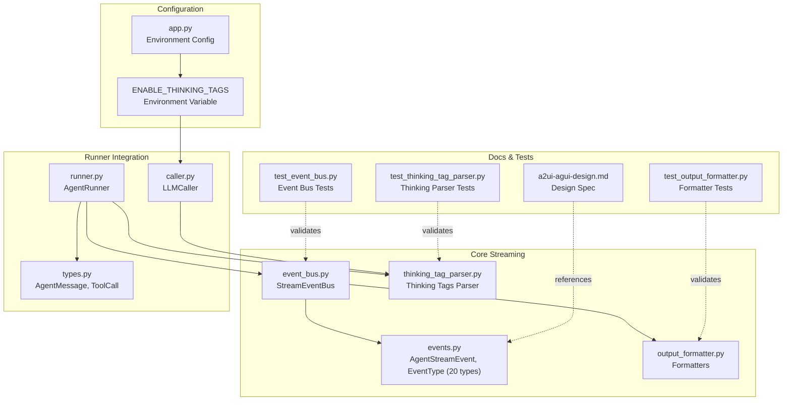
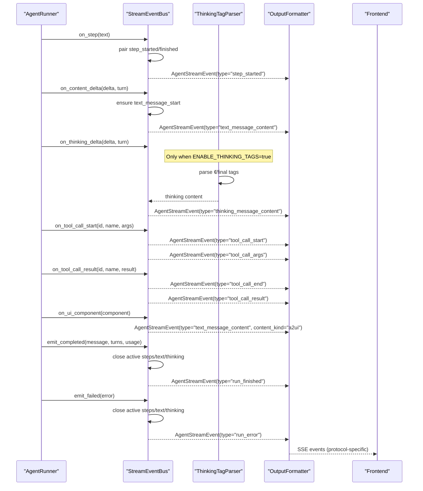
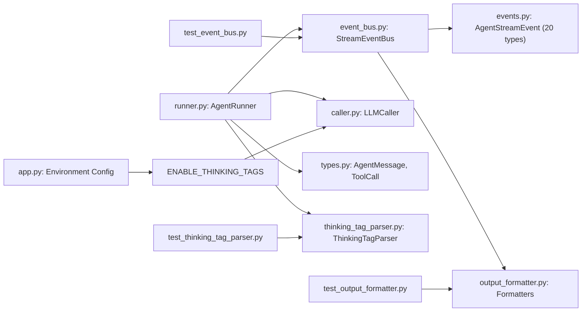

# AG-UI Streaming Protocol

<cite>
**Referenced Files in This Document**
- [events.py](file://src/ark_agentic/core/stream/events.py)
- [event_bus.py](file://src/ark_agentic/core/stream/event_bus.py)
- [output_formatter.py](file://src/ark_agentic/core/stream/output_formatter.py)
- [runner.py](file://src/ark_agentic/core/runner.py)
- [thinking_tag_parser.py](file://src/ark_agentic/core/stream/thinking_tag_parser.py)
- [types.py](file://src/ark_agentic/core/types.py)
- [a2ui-agui-design.md](file://docs/core/a2ui-agui-design.md)
- [test_event_bus.py](file://tests/unit/core/test_event_bus.py)
- [test_output_formatter.py](file://tests/unit/core/test_output_formatter.py)
- [app.py](file://src/ark_agentic/app.py)
- [README.md](file://README.md)
- [caller.py](file://src/ark_agentic/core/llm/caller.py)
</cite>

## Update Summary
**Changes Made**
- Updated event type count from 17 to 20 event types with new thinking message support
- Added ENABLE_THINKING_TAGS environment variable configuration requirement
- Enhanced thinking message lifecycle documentation with conditional availability
- Updated architecture diagrams to reflect thinking message processing flow
- Added configuration examples for enabling thinking tags

## Table of Contents
1. [Introduction](#introduction)
2. [Project Structure](#project-structure)
3. [Core Components](#core-components)
4. [Architecture Overview](#architecture-overview)
5. [Detailed Component Analysis](#detailed-component-analysis)
6. [Dependency Analysis](#dependency-analysis)
7. [Performance Considerations](#performance-considerations)
8. [Troubleshooting Guide](#troubleshooting-guide)
9. [Conclusion](#conclusion)
10. [Appendices](#appendices)

## Introduction
This document describes the AG-UI streaming protocol used by the Ark Agentic Space platform. It defines the 20 standardized event types, the event bus architecture, how runner callbacks map to AG-UI events, and the output formatting pipeline. The protocol now includes enhanced thinking message support with conditional availability through the ENABLE_THINKING_TAGS environment variable. It also provides practical guidance for implementing custom streaming responses, handling event sequences, and managing real-time communication between backend and frontend systems.

## Project Structure
The AG-UI streaming implementation is centered in the core streaming module with supporting components for runner orchestration, formatting, and testing. The thinking message support is conditionally enabled through environment configuration.

**Diagram sources**
- [events.py:67-116](file://src/ark_agentic/core/stream/events.py#L67-L116)
- [event_bus.py:67-248](file://src/ark_agentic/core/stream/event_bus.py#L67-L248)
- [output_formatter.py:59-444](file://src/ark_agentic/core/stream/output_formatter.py#L59-L444)
- [runner.py:153-846](file://src/ark_agentic/core/runner.py#L153-L846)
- [thinking_tag_parser.py:48-210](file://src/ark_agentic/core/stream/thinking_tag_parser.py#L48-L210)
- [types.py:190-229](file://src/ark_agentic/core/types.py#L190-L229)
- [a2ui-agui-design.md:1-132](file://docs/core/a2ui-agui-design.md#L1-L132)
- [test_event_bus.py:1-253](file://tests/unit/core/test_event_bus.py#L1-L253)
- [test_output_formatter.py:1-518](file://tests/unit/core/test_output_formatter.py#L1-L518)
- [app.py:54-63](file://src/ark_agentic/app.py#L54-L63)
- [caller.py:24-31](file://src/ark_agentic/core/llm/caller.py#L24-L31)

**Section sources**
- [events.py:1-116](file://src/ark_agentic/core/stream/events.py#L1-L116)
- [event_bus.py:1-248](file://src/ark_agentic/core/stream/event_bus.py#L1-L248)
- [output_formatter.py:1-444](file://src/ark_agentic/core/stream/output_formatter.py#L1-L444)
- [runner.py:1-1056](file://src/ark_agentic/core/runner.py#L1-L1056)
- [thinking_tag_parser.py:1-210](file://src/ark_agentic/core/stream/thinking_tag_parser.py#L1-L210)
- [types.py:1-413](file://src/ark_agentic/core/types.py#L1-L413)
- [a2ui-agui-design.md:1-132](file://docs/core/a2ui-agui-design.md#L1-L132)
- [test_event_bus.py:1-253](file://tests/unit/core/test_event_bus.py#L1-L253)
- [test_output_formatter.py:1-518](file://tests/unit/core/test_output_formatter.py#L1-L518)
- [app.py:54-63](file://src/ark_agentic/app.py#L54-L63)
- [caller.py:24-31](file://src/ark_agentic/core/llm/caller.py#L24-L31)

## Core Components
- **AgentStreamEvent**: The single internal event model carrying all AG-UI event data. It includes type, sequence, run/session identifiers, and fields specific to each event category. Now defines 20 event types including thinking message support.
- **StreamEventBus**: Translates runner callbacks into AG-UI events, manages lifecycle pairing (steps, text messages, thinking messages), and emits terminal events. Supports thinking message lifecycle when enabled.
- **OutputFormatter**: Adapts AgentStreamEvent to multiple transport protocols (agui, enterprise, internal, alone).
- **AgentRunner**: Orchestrates ReAct loops, invokes LLM/tool execution, and emits AG-UI events via the event bus. Integrates thinking tag parsing when enabled.
- **ThinkingTagParser**: Parses 《/final tags for extended reasoning separation and fallback logic. Conditional availability controlled by ENABLE_THINKING_TAGS.
- **Types**: Defines AgentMessage, ToolCall, and related structures used by runners and tools.

**Section sources**
- [events.py:67-116](file://src/ark_agentic/core/stream/events.py#L67-L116)
- [event_bus.py:67-248](file://src/ark_agentic/core/stream/event_bus.py#L67-L248)
- [output_formatter.py:48-444](file://src/ark_agentic/core/stream/output_formatter.py#L48-L444)
- [runner.py:153-846](file://src/ark_agentic/core/runner.py#L153-L846)
- [thinking_tag_parser.py:48-210](file://src/ark_agentic/core/stream/thinking_tag_parser.py#L48-L210)
- [types.py:190-229](file://src/ark_agentic/core/types.py#L190-L229)

## Architecture Overview
The AG-UI protocol is a real-time event bus over SSE with enhanced thinking message support. The runner emits signals that the event bus expands into complete AG-UI sequences. The output formatter adapts these events to the chosen transport protocol. Thinking message processing is conditionally enabled through the ENABLE_THINKING_TAGS environment variable.

**Diagram sources**
- [runner.py:478-486](file://src/ark_agentic/core/runner.py#L478-L486)
- [runner.py:652-659](file://src/ark_agentic/core/runner.py#L652-L659)
- [runner.py:768-772](file://src/ark_agentic/core/runner.py#L768-L772)
- [event_bus.py:146-248](file://src/ark_agentic/core/stream/event_bus.py#L146-L248)
- [output_formatter.py:59-444](file://src/ark_agentic/core/stream/output_formatter.py#L59-L444)
- [thinking_tag_parser.py:63-81](file://src/ark_agentic/core/stream/thinking_tag_parser.py#L63-L81)

## Detailed Component Analysis

### AG-UI Event Model and 20 Event Types
The AgentStreamEvent model defines the canonical event structure. The 20 event types are grouped as follows:
- **Run lifecycle**: run_started, run_finished, run_error
- **Step lifecycle**: step_started, step_finished
- **Text message lifecycle**: text_message_start, text_message_content, text_message_end
- **Tool call lifecycle**: tool_call_start, tool_call_args, tool_call_end, tool_call_result
- **State synchronization**: state_snapshot, state_delta
- **Messages snapshot**: messages_snapshot
- **Thinking message lifecycle**: thinking_message_start, thinking_message_content, thinking_message_end (conditionally available)
- **Custom/raw**: custom, raw

These types are defined as a literal union and documented in the design spec. The thinking message types are only available when ENABLE_THINKING_TAGS environment variable is set to true.

**Section sources**
- [events.py:30-61](file://src/ark_agentic/core/stream/events.py#L30-L61)
- [a2ui-agui-design.md:8-22](file://docs/core/a2ui-agui-design.md#L8-L22)
- [README.md:702](file://README.md#L702)
- [README.md:777](file://README.md#L777)

### Event Bus Lifecycle Management
StreamEventBus translates runner callbacks into AG-UI sequences:
- **on_step(text)**: Emits step_started; if another step starts, it automatically emits step_finished for the previous step.
- **on_content_delta(delta, turn)**: Ensures a text message is started (emits text_message_start), then emits text_message_content with the delta and turn.
- **on_thinking_delta(delta, turn)**: Conditionally processes thinking content when ENABLE_THINKING_TAGS is enabled. Emits thinking_message_start (first time), then thinking_message_content for subsequent deltas.
- **on_tool_call_start(id, name, args)**: Emits tool_call_start followed by tool_call_args.
- **on_tool_call_result(id, name, result)**: Emits tool_call_end followed by tool_call_result (with truncation for large results).
- **on_ui_component(component)**: Emits text_message_content with content_kind="a2ui".
- **on_custom_event(custom_type, custom_data)**: Emits custom event.
- **emit_created(content)**: Emits run_started.
- **emit_completed(message, turns, usage)**: Emits run_finished and ensures all active steps, text, and thinking messages are closed.
- **emit_failed(error)**: Emits run_error and ensures all active steps, text, and thinking messages are closed.

The bus maintains internal state to pair start/end events and ensure proper termination. Thinking message lifecycle management is handled separately from text message lifecycle.

**Section sources**
- [event_bus.py:67-248](file://src/ark_agentic/core/stream/event_bus.py#L67-L248)
- [test_event_bus.py:24-253](file://tests/unit/core/test_event_bus.py#L24-L253)

### Runner Callbacks to AG-UI Mapping
The runner maps its internal callback events to the event bus:
- **Step transitions**: "step" events map to on_step.
- **UI component events**: "ui_component" events map to on_ui_component.
- **Other custom events**: map to on_custom_event.
- **Content deltas**: map to on_content_delta for final text content.
- **Thinking deltas**: map to on_thinking_delta for reasoning content (when enabled).

Additionally, during streaming, the runner invokes on_content_delta and on_thinking_delta callbacks, which the event bus converts into text and thinking message events respectively. The thinking delta processing is controlled by the ENABLE_THINKING_TAGS environment variable.

**Section sources**
- [runner.py:478-486](file://src/ark_agentic/core/runner.py#L478-L486)
- [runner.py:652-659](file://src/ark_agentic/core/runner.py#L652-L659)

### Output Formatting Pipeline
The output formatter adapts AgentStreamEvent to multiple protocols:
- **agui**: Bare AG-UI events (original JSON).
- **enterprise**: AGUIEnvelope wrapper with reasoning framing and structured reasoning messages.
- **internal**: Old response.* format for backward compatibility.
- **alone**: ALONE protocol (sa_* events) for legacy clients.

The enterprise formatter:
- Skips certain events (tool_call_start, tool_call_args, tool_call_end, tool_call_result, step_finished).
- Automatically wraps reasoning phases with reasoning_start/reasoning_end around thinking and step events.
- Sets ui_protocol and ui_data appropriately for each event type.
- Detects JSON in run_finished content and sets ui_protocol=json accordingly.

The internal formatter:
- Maps AG-UI events to legacy response.* aliases.
- Skips certain events (text_message_start, text_message_end, tool_call_args, tool_call_end, state_snapshot, state_delta, messages_snapshot, raw).

The alone formatter:
- Maps AG-UI events to sa_* events.
- Adds sa_done after sa_stream_complete.

**Section sources**
- [output_formatter.py:59-444](file://src/ark_agentic/core/stream/output_formatter.py#L59-L444)
- [test_output_formatter.py:36-518](file://tests/unit/core/test_output_formatter.py#L36-L518)

### Thinking Tag Parsing and Extended Reasoning
The ThinkingTagParser separates 《 and <final> content streams:
- Maintains state across chunks and buffers partial tags.
- Extracts thinking content and final content distinctly.
- Supports strict mode where only content inside <final> is considered final.
- Provides fallback extraction for non-think content when no final content appears.

This enables the runner to route thinking deltas to thinking_message_content and final answers to text_message_content. The thinking tag parsing is conditionally enabled through the ENABLE_THINKING_TAGS environment variable.

**Section sources**
- [thinking_tag_parser.py:48-210](file://src/ark_agentic/core/stream/thinking_tag_parser.py#L48-L210)

### Environment Configuration and Conditional Availability
The thinking message support is conditionally enabled through the ENABLE_THINKING_TAGS environment variable:

**Configuration Options:**
- **ENABLE_THINKING_TAGS=false** (default): Thinking message events are disabled
- **ENABLE_THINKING_TAGS=true**: Thinking message events are enabled

**Implementation Details:**
- The app.py reads the environment variable and passes it to agent creation
- The RunnerConfig.enable_thinking_tags controls LLMCaller behavior
- The LLMCaller creates ThinkingTagParser instances only when enabled
- The StreamEventBus processes thinking deltas only when enabled

**Section sources**
- [app.py:54-63](file://src/ark_agentic/app.py#L54-L63)
- [runner.py:71-72](file://src/ark_agentic/core/runner.py#L71-L72)
- [runner.py:190](file://src/ark_agentic/core/runner.py#L190)
- [caller.py:88-97](file://src/ark_agentic/core/llm/caller.py#L88-L97)

### Practical Examples

#### Implementing Custom Streaming Responses
To emit custom events:
- Use on_custom_event(custom_type, custom_data) on the event bus.
- The enterprise formatter will emit a custom event with type and ui_protocol derived from custom_data.

For A2UI components:
- Use on_ui_component(component) to emit text_message_content with content_kind="a2ui".

For tool results:
- Use on_tool_call_result to emit tool_call_end and tool_call_result.

#### Handling Event Sequences
- **Steps**: Consecutive on_step calls automatically close the previous step with step_finished before emitting the next step_started.
- **Text messages**: on_content_delta ensures text_message_start is emitted once, then emits text_message_content for subsequent deltas, and run completion/emergency failure emits text_message_end.
- **Thinking messages**: on_thinking_delta ensures thinking_message_start (first time), emits thinking_message_content for subsequent deltas, and run completion/emergency failure emits thinking_message_end (only when enabled).

#### Managing Real-Time Communication
- The runner runs a ReAct loop, invoking LLM and tools, and emitting AG-UI events via the event bus.
- The event bus pushes AgentStreamEvent instances into an asyncio.Queue.
- The application consumes the queue, applies the selected OutputFormatter, and yields SSE events to the frontend.
- Thinking message processing is automatically included when ENABLE_THINKING_TAGS is set to true.

**Section sources**
- [event_bus.py:117-165](file://src/ark_agentic/core/stream/event_bus.py#L117-L165)
- [test_event_bus.py:44-91](file://tests/unit/core/test_event_bus.py#L44-L91)

## Dependency Analysis
The following diagram shows key dependencies among components:

**Diagram sources**
- [runner.py:153-846](file://src/ark_agentic/core/runner.py#L153-L846)
- [event_bus.py:67-248](file://src/ark_agentic/core/stream/event_bus.py#L67-L248)
- [events.py:67-116](file://src/ark_agentic/core/stream/events.py#L67-L116)
- [output_formatter.py:59-444](file://src/ark_agentic/core/stream/output_formatter.py#L59-L444)
- [types.py:190-229](file://src/ark_agentic/core/types.py#L190-L229)
- [thinking_tag_parser.py:48-210](file://src/ark_agentic/core/stream/thinking_tag_parser.py#L48-L210)
- [app.py:54-63](file://src/ark_agentic/app.py#L54-L63)
- [caller.py:24-31](file://src/ark_agentic/core/llm/caller.py#L24-L31)
- [test_event_bus.py:1-253](file://tests/unit/core/test_event_bus.py#L1-L253)
- [test_output_formatter.py:1-518](file://tests/unit/core/test_output_formatter.py#L1-L518)
- [test_thinking_tag_parser.py:1-299](file://tests/unit/core/test_thinking_tag_parser.py#L1-L299)

**Section sources**
- [runner.py:153-846](file://src/ark_agentic/core/runner.py#L153-L846)
- [event_bus.py:67-248](file://src/ark_agentic/core/stream/event_bus.py#L67-L248)
- [output_formatter.py:59-444](file://src/ark_agentic/core/stream/output_formatter.py#L59-L444)
- [types.py:190-229](file://src/ark_agentic/core/types.py#L190-L229)
- [thinking_tag_parser.py:48-210](file://src/ark_agentic/core/stream/thinking_tag_parser.py#L48-L210)
- [app.py:54-63](file://src/ark_agentic/app.py#L54-L63)
- [caller.py:24-31](file://src/ark_agentic/core/llm/caller.py#L24-L31)
- [test_event_bus.py:1-253](file://tests/unit/core/test_event_bus.py#L1-L253)
- [test_output_formatter.py:1-518](file://tests/unit/core/test_output_formatter.py#L1-L518)
- [test_thinking_tag_parser.py:1-299](file://tests/unit/core/test_thinking_tag_parser.py#L1-L299)

## Performance Considerations
- **Event batching**: The event bus uses an asyncio.Queue to decouple producer (runner) and consumer (formatter/frontend), enabling asynchronous processing.
- **Conditional thinking processing**: Thinking tag parsing is only performed when ENABLE_THINKING_TAGS is true, avoiding unnecessary processing overhead.
- **Truncation**: Tool call results exceeding length limits are truncated to avoid oversized payloads.
- **JSON detection**: run_finished content is scanned for JSON to set ui_protocol appropriately, reducing downstream parsing overhead.
- **State minimization**: The event bus tracks minimal state (active step, text/thinking message IDs) to maintain correctness without heavy memory usage.
- **Parser optimization**: ThinkingTagParser efficiently handles cross-chunk tag boundaries and maintains minimal state for tag parsing.

## Troubleshooting Guide
Common issues and resolutions:
- **Missing text_message_end**: Ensure emit_completed or emit_failed is called so the event bus can close active text messages.
- **Missing thinking_message_end**: Similarly, ensure emit_completed or emit_failed is called to close thinking messages (only when enabled).
- **Empty deltas ignored**: on_content_delta/on_thinking_delta ignore empty strings; ensure non-empty deltas are passed.
- **Thinking messages not appearing**: Verify ENABLE_THINKING_TAGS environment variable is set to true.
- **Tool result truncation**: Very large tool results are truncated; consider optimizing tool output or offloading large payloads.
- **Protocol mismatch**: Verify the selected formatter matches the frontend expectations (agui, enterprise, internal, alone).

Validation references:
- Event bus lifecycle tests confirm automatic closing of steps, text, and thinking messages.
- Output formatter tests verify protocol-specific behavior and JSON detection.
- Thinking tag parser tests validate cross-chunk boundary handling and strict mode behavior.

**Section sources**
- [test_event_bus.py:57-91](file://tests/unit/core/test_event_bus.py#L57-L91)
- [test_output_formatter.py:133-282](file://tests/unit/core/test_output_formatter.py#L133-L282)
- [test_thinking_tag_parser.py:19-299](file://tests/unit/core/test_thinking_tag_parser.py#L19-L299)

## Conclusion
The AG-UI streaming protocol provides a robust, extensible framework for real-time agent-to-frontend communication with enhanced thinking message support. The event bus ensures correct lifecycle pairing and terminal event emission, while the output formatter supports multiple transport protocols. The runner integrates seamlessly with the event bus to produce standardized AG-UI events, and the thinking tag parser enables clear separation of reasoning and final answers when thinking tags are enabled through the ENABLE_THINKING_TAGS environment variable.

## Appendices

### AG-UI Event Type Reference
- **Run lifecycle**: run_started, run_finished, run_error
- **Step lifecycle**: step_started, step_finished
- **Text message lifecycle**: text_message_start, text_message_content, text_message_end
- **Tool call lifecycle**: tool_call_start, tool_call_args, tool_call_end, tool_call_result
- **State synchronization**: state_snapshot, state_delta
- **Messages snapshot**: messages_snapshot
- **Thinking message lifecycle**: thinking_message_start, thinking_message_content, thinking_message_end (conditionally available)
- **Custom/raw**: custom, raw

**Section sources**
- [events.py:30-61](file://src/ark_agentic/core/stream/events.py#L30-L61)
- [a2ui-agui-design.md:8-22](file://docs/core/a2ui-agui-design.md#L8-L22)

### Environment Configuration Reference
- **ENABLE_THINKING_TAGS**: Enable thinking tag parsing (default: false)
  - Set to "true" or "1" to enable thinking message support
  - Set to any other value to disable thinking message support

**Section sources**
- [README.md:702](file://README.md#L702)
- [app.py:54-63](file://src/ark_agentic/app.py#L54-L63)
- [caller.py:88-97](file://src/ark_agentic/core/llm/caller.py#L88-L97)