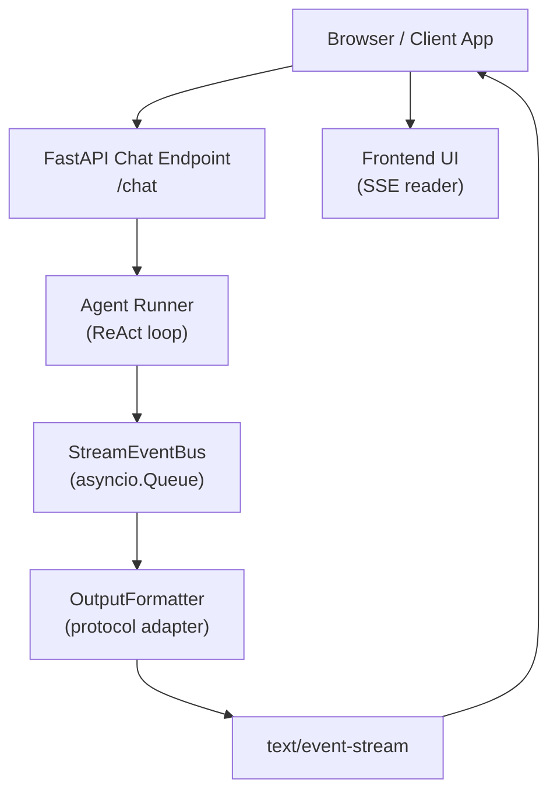
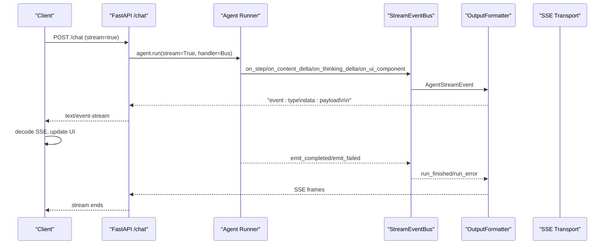
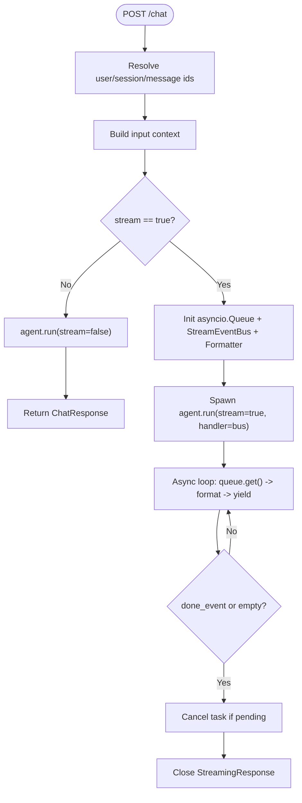
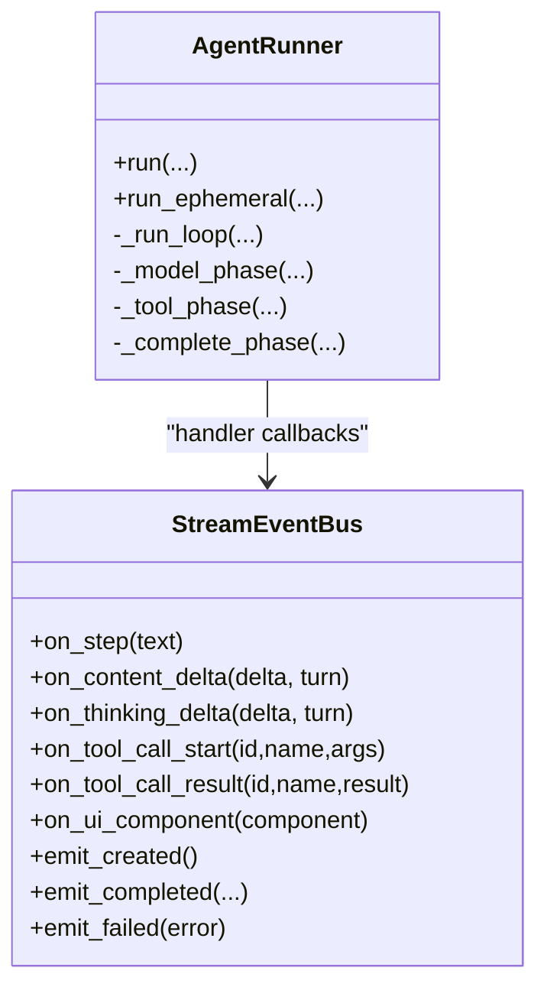
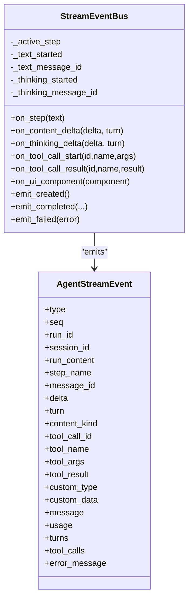
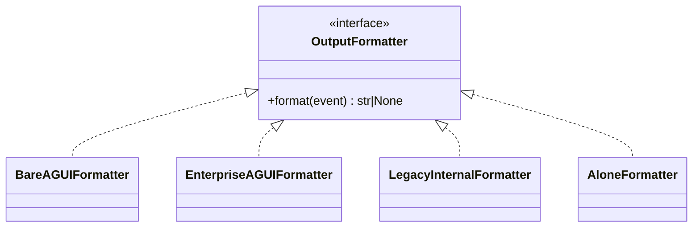
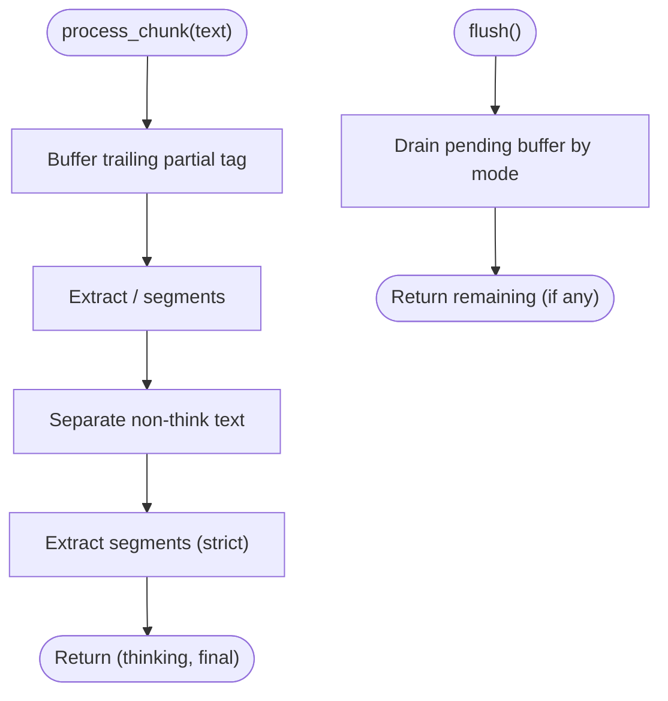
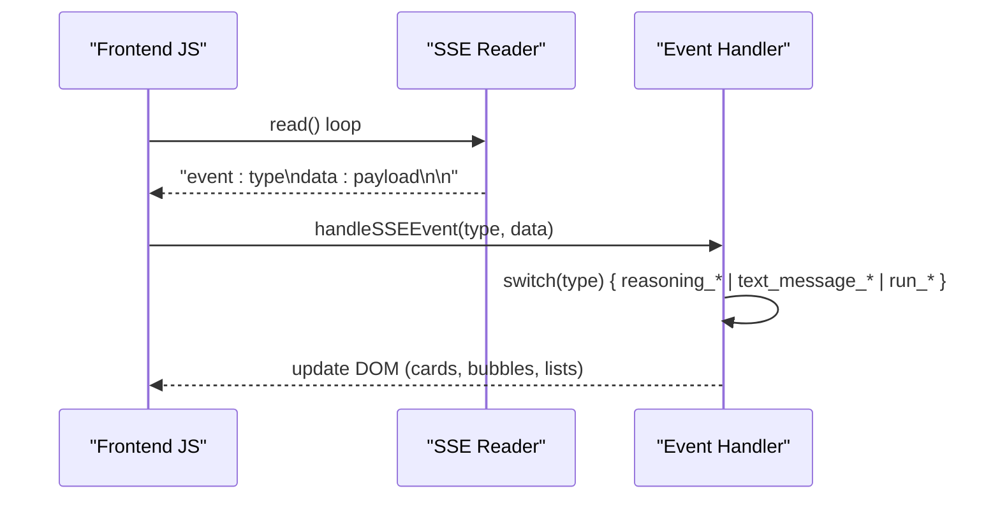
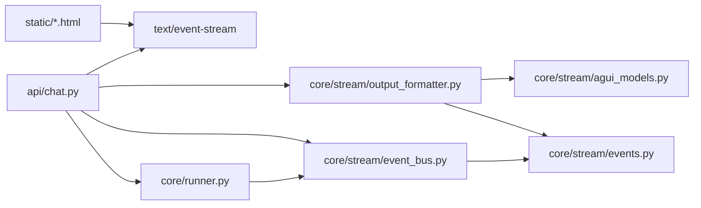

# Streaming Integration Patterns

<cite>
**Referenced Files in This Document**
- [app.py](file://src/ark_agentic/app.py)
- [chat.py](file://src/ark_agentic/api/chat.py)
- [events.py](file://src/ark_agentic/core/stream/events.py)
- [event_bus.py](file://src/ark_agentic/core/stream/event_bus.py)
- [output_formatter.py](file://src/ark_agentic/core/stream/output_formatter.py)
- [thinking_tag_parser.py](file://src/ark_agentic/core/stream/thinking_tag_parser.py)
- [runner.py](file://src/ark_agentic/core/runner.py)
- [README.md](file://src/ark_agentic/agents/securities/README.md)
- [insurance-agui.html](file://src/ark_agentic/static/insurance-agui.html)
</cite>

## Table of Contents
1. [Introduction](#introduction)
2. [Project Structure](#project-structure)
3. [Core Components](#core-components)
4. [Architecture Overview](#architecture-overview)
5. [Detailed Component Analysis](#detailed-component-analysis)
6. [Dependency Analysis](#dependency-analysis)
7. [Performance Considerations](#performance-considerations)
8. [Troubleshooting Guide](#troubleshooting-guide)
9. [Conclusion](#conclusion)
10. [Appendices](#appendices)

## Introduction
This document explains streaming integration patterns for real-time, server-driven experiences built on FastAPI. It covers:
- How FastAPI endpoints emit Server-Sent Events (SSE) for streaming
- How backend event buses translate agent callbacks into structured AG-UI events
- How output formatters adapt events to transport protocols (enterprise envelopes, legacy formats, bare AG-UI)
- How frontend UIs consume SSE and update in real time
- How the thinking tag parser separates reasoning from final answers during streaming
- Practical examples for chat interfaces, real-time dashboards, and interactive applications
- Best practices for error handling, connection management, and performance optimization

## Project Structure
The streaming stack spans API routes, event modeling, an event bus, output formatting, and frontend consumption. The diagram below maps the primary runtime flow from client request to rendered UI.

**Diagram sources**
- [chat.py:27-177](file://src/ark_agentic/api/chat.py#L27-L177)
- [runner.py:240-287](file://src/ark_agentic/core/runner.py#L240-L287)
- [event_bus.py:67-248](file://src/ark_agentic/core/stream/event_bus.py#L67-L248)
- [output_formatter.py:48-444](file://src/ark_agentic/core/stream/output_formatter.py#L48-L444)

**Section sources**
- [app.py:84-134](file://src/ark_agentic/app.py#L84-L134)
- [chat.py:27-177](file://src/ark_agentic/api/chat.py#L27-L177)

## Core Components
- FastAPI Chat Endpoint: Validates inputs, resolves sessions, and streams SSE via an async generator that reads from an event queue and formats events per protocol.
- Agent Runner: Executes ReAct loops, emitting deltas for content and thinking, tool calls, and UI components. It integrates with the event bus and supports streaming and non-streaming modes.
- StreamEventBus: Translates runner callbacks into AG-UI native events and manages pairing of start/finish semantics.
- OutputFormatter: Adapts AG-UI events to multiple transport protocols (enterprise envelopes, legacy internal, bare AG-UI, ALONE).
- Thinking Tag Parser: Streams and parses <think>/<final> tags to separate reasoning from final answers, supporting strict mode and cross-chunk continuity.

**Section sources**
- [chat.py:27-177](file://src/ark_agentic/api/chat.py#L27-L177)
- [runner.py:240-287](file://src/ark_agentic/core/runner.py#L240-L287)
- [event_bus.py:67-248](file://src/ark_agentic/core/stream/event_bus.py#L67-L248)
- [output_formatter.py:48-444](file://src/ark_agentic/core/stream/output_formatter.py#L48-L444)
- [thinking_tag_parser.py:47-210](file://src/ark_agentic/core/stream/thinking_tag_parser.py#L47-L210)

## Architecture Overview
The streaming pipeline converts agent-generated deltas into SSE events consumed by the browser. The enterprise formatter wraps events in an envelope for compatibility with existing frontends.

**Diagram sources**
- [chat.py:115-177](file://src/ark_agentic/api/chat.py#L115-L177)
- [runner.py:652-669](file://src/ark_agentic/core/runner.py#L652-L669)
- [event_bus.py:146-248](file://src/ark_agentic/core/stream/event_bus.py#L146-L248)
- [output_formatter.py:155-216](file://src/ark_agentic/core/stream/output_formatter.py#L155-L216)

## Detailed Component Analysis

### FastAPI Streaming Endpoint
- Accepts chat requests with optional streaming, protocol selection, and session/context resolution.
- Creates an asyncio queue and an event bus; runs the agent asynchronously; yields formatted SSE frames until completion or error.
- Emits run_started early, then forwards run_finished or run_error to close active messages and steps.

**Diagram sources**
- [chat.py:27-177](file://src/ark_agentic/api/chat.py#L27-L177)

**Section sources**
- [chat.py:27-177](file://src/ark_agentic/api/chat.py#L27-L177)

### Agent Runner and Callbacks
- Emits deltas for content and thinking, tool call lifecycle, and UI components.
- Integrates with the thinking tag parser when enabled to route reasoning vs final content.
- Emits structured AG-UI events that the bus pairs and the formatter adapts.

**Diagram sources**
- [runner.py:240-287](file://src/ark_agentic/core/runner.py#L240-L287)
- [event_bus.py:67-248](file://src/ark_agentic/core/stream/event_bus.py#L67-L248)

**Section sources**
- [runner.py:652-669](file://src/ark_agentic/core/runner.py#L652-L669)
- [runner.py:736-800](file://src/ark_agentic/core/runner.py#L736-L800)

### Stream Event Model and Bus
- Defines AG-UI event types and a unified event model with optional fields.
- StreamEventBus translates runner callbacks into paired start/finish semantics and emits run lifecycle events.

**Diagram sources**
- [events.py:67-116](file://src/ark_agentic/core/stream/events.py#L67-L116)
- [event_bus.py:67-248](file://src/ark_agentic/core/stream/event_bus.py#L67-L248)

**Section sources**
- [events.py:30-116](file://src/ark_agentic/core/stream/events.py#L30-L116)
- [event_bus.py:67-248](file://src/ark_agentic/core/stream/event_bus.py#L67-L248)

### Output Formatters and Protocols
- Supports multiple transport protocols:
  - agui: bare AG-UI events
  - enterprise: envelopes with reasoning framing
  - internal: legacy response.* events
  - alone: ALONE sa_* events
- The enterprise formatter wraps events in an AGUIEnvelope and injects reasoning_start/reasoning_end around thinking and step events.

**Diagram sources**
- [output_formatter.py:48-444](file://src/ark_agentic/core/stream/output_formatter.py#L48-L444)

**Section sources**
- [output_formatter.py:155-216](file://src/ark_agentic/core/stream/output_formatter.py#L155-L216)
- [output_formatter.py:67-151](file://src/ark_agentic/core/stream/output_formatter.py#L67-L151)
- [output_formatter.py:341-415](file://src/ark_agentic/core/stream/output_formatter.py#L341-L415)

### Thinking Tag Parser
- Parses <think> and <final> tags across streaming chunks, maintaining state for strict mode.
- Produces reasoning content and final content separately; supports flushing at stream end.

**Diagram sources**
- [thinking_tag_parser.py:63-210](file://src/ark_agentic/core/stream/thinking_tag_parser.py#L63-L210)

**Section sources**
- [thinking_tag_parser.py:47-210](file://src/ark_agentic/core/stream/thinking_tag_parser.py#L47-L210)

### Frontend SSE Consumption and UI Updates
- JavaScript clients read the SSE stream, parse event/data lines, and dispatch to handlers for reasoning, content, and UI components.
- The enterprise formatter’s reasoning framing aligns with UI cards that show “thinking” and “final answer.”

**Diagram sources**
- [README.md:468-570](file://src/ark_agentic/agents/securities/README.md#L468-L570)
- [insurance-agui.html:1120-1190](file://src/ark_agentic/static/insurance-agui.html#L1120-L1190)

**Section sources**
- [README.md:468-570](file://src/ark_agentic/agents/securities/README.md#L468-L570)
- [insurance-agui.html:1120-1190](file://src/ark_agentic/static/insurance-agui.html#L1120-L1190)

## Dependency Analysis
The streaming stack exhibits clean separation of concerns:
- API depends on Runner and StreamEventBus
- Runner depends on LLM caller, tool executor, and StreamEventBus
- StreamEventBus depends on AG-UI event model
- OutputFormatter depends on StreamEventBus and AG-UI envelope models
- Frontend depends on SSE frames and formatter protocol

**Diagram sources**
- [chat.py:15-20](file://src/ark_agentic/api/chat.py#L15-L20)
- [runner.py:32-36](file://src/ark_agentic/core/runner.py#L32-L36)
- [event_bus.py:20](file://src/ark_agentic/core/stream/event_bus.py#L20)
- [events.py:27-28](file://src/ark_agentic/core/stream/events.py#L27-L28)
- [output_formatter.py:20-21](file://src/ark_agentic/core/stream/output_formatter.py#L20-L21)

**Section sources**
- [chat.py:15-20](file://src/ark_agentic/api/chat.py#L15-L20)
- [runner.py:32-36](file://src/ark_agentic/core/runner.py#L32-L36)
- [event_bus.py:20](file://src/ark_agentic/core/stream/event_bus.py#L20)
- [events.py:27-28](file://src/ark_agentic/core/stream/events.py#L27-L28)
- [output_formatter.py:20-21](file://src/ark_agentic/core/stream/output_formatter.py#L20-L21)

## Performance Considerations
- Queue sizing and backpressure: Use bounded queues and monitor consumer lag to avoid unbounded growth.
- Chunking and batching: Emit deltas as soon as available; avoid large intermediate buffers.
- Protocol overhead: Enterprise envelopes add JSON wrappers; choose protocol based on frontend needs.
- Concurrency: Keep agent runs and SSE emission in separate tasks; cancel tasks on client disconnect.
- Tokenization and truncation: Monitor finish reasons and prompt/completion token accumulation to detect length limits.
- Memory and state: Reset parsers and state machines per turn; flush pending buffers on completion.

[No sources needed since this section provides general guidance]

## Troubleshooting Guide
Common issues and remedies:
- No SSE frames received
  - Verify endpoint accepts stream=true and protocol is supported.
  - Confirm the formatter produces non-empty lines and the client reads event/data pairs.
- Missing reasoning framing
  - Ensure the enterprise formatter is used and run_started is emitted before thinking events.
- Lost final answer
  - In strict mode, only content inside <final> is considered final; ensure the agent emits <final> tags.
- Tool call results too large
  - The bus truncates long results; consider reducing tool output size or streaming tool progress.
- Connection drops
  - The SSE loop cancels the agent task on done; ensure the client handles reconnects and resumes sessions.

**Section sources**
- [chat.py:159-177](file://src/ark_agentic/api/chat.py#L159-L177)
- [event_bus.py:186-200](file://src/ark_agentic/core/stream/event_bus.py#L186-L200)
- [thinking_tag_parser.py:83-94](file://src/ark_agentic/core/stream/thinking_tag_parser.py#L83-L94)

## Conclusion
The streaming stack cleanly separates concerns across API, runner, event bus, and formatter layers. By leveraging AG-UI events and protocol adapters, it enables flexible transport and robust frontend integration. The thinking tag parser ensures precise separation of reasoning and final answers, while the enterprise formatter aligns backend events with existing UI expectations.

[No sources needed since this section summarizes without analyzing specific files]

## Appendices

### Practical Examples Index
- Chat interface with reasoning and final answer cards
  - Backend: SSE frames emitted via the chat endpoint
  - Frontend: SSE reader parsing event/data lines and updating UI
  - Reference: [README.md:468-570](file://src/ark_agentic/agents/securities/README.md#L468-L570), [insurance-agui.html:1120-1190](file://src/ark_agentic/static/insurance-agui.html#L1120-L1190)
- Real-time dashboard updates
  - Backend: Emit tool call results and state deltas as UI components
  - Frontend: Render A2UI cards from custom events
  - Reference: [output_formatter.py:324-338](file://src/ark_agentic/core/stream/output_formatter.py#L324-L338)
- Interactive applications with ReAct loops
  - Backend: Stream content and thinking deltas; pair start/finish events automatically
  - Frontend: Update thinking card and answer bubble in real time
  - Reference: [event_bus.py:146-248](file://src/ark_agentic/core/stream/event_bus.py#L146-L248)

### Best Practices Checklist
- Always emit run_started before streaming content
- Pair start/finish semantics for steps and messages
- Use strict thinking tag mode to guarantee final answer delivery
- Choose protocol based on frontend compatibility needs
- Handle client disconnects gracefully and cancel agent tasks
- Monitor token usage and length truncation signals
- Keep tool outputs concise; stream progress when possible

[No sources needed since this section provides general guidance]