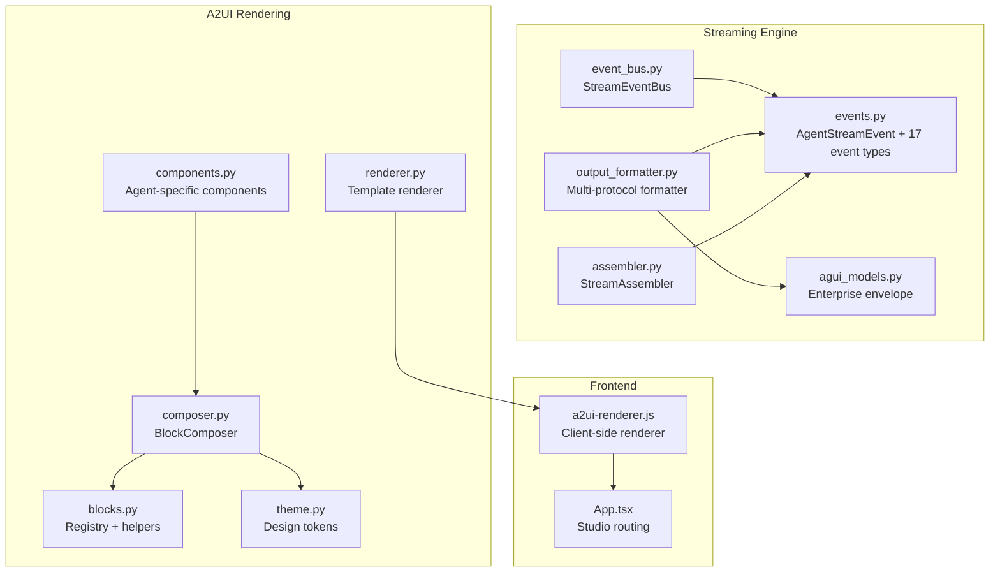
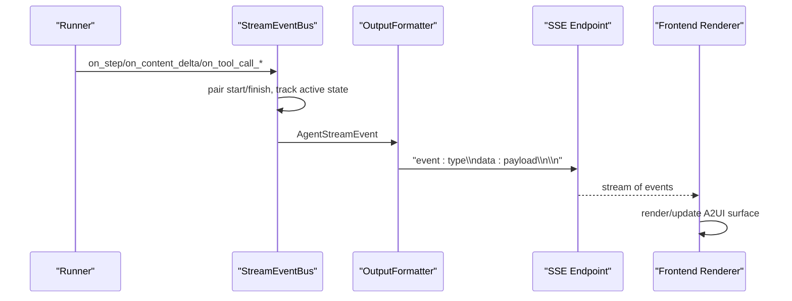
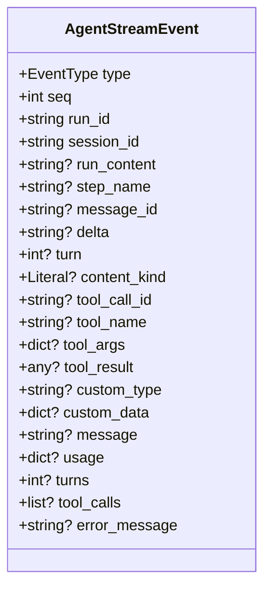
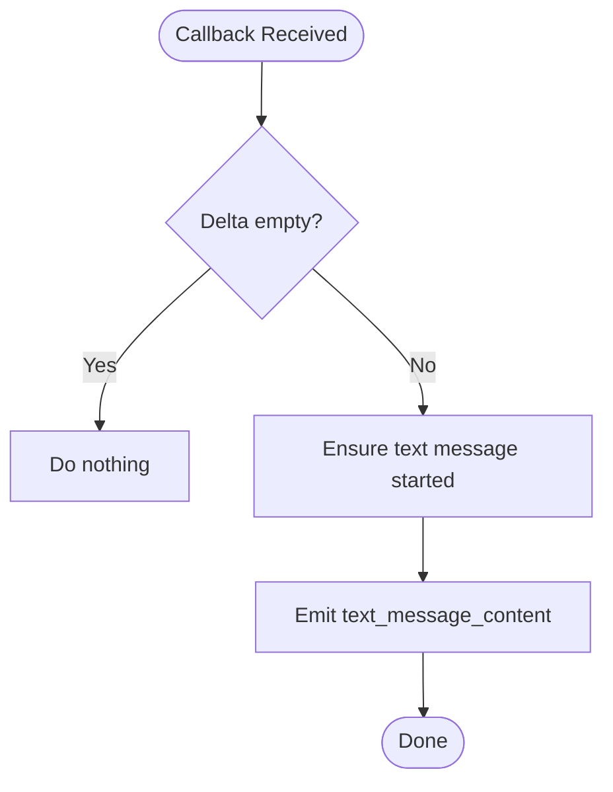
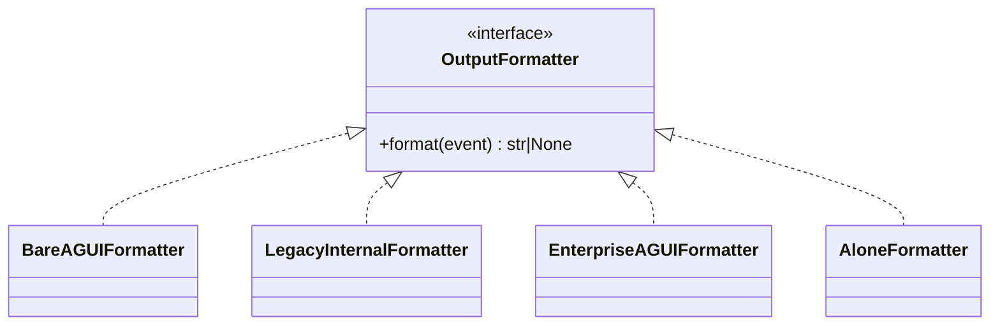
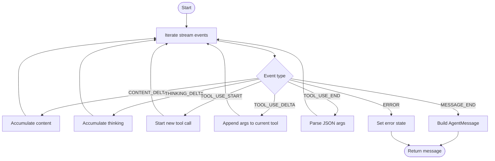
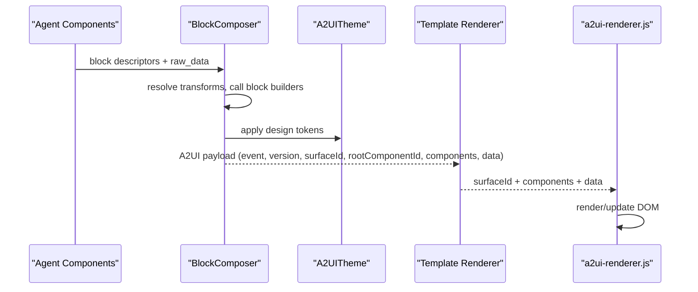
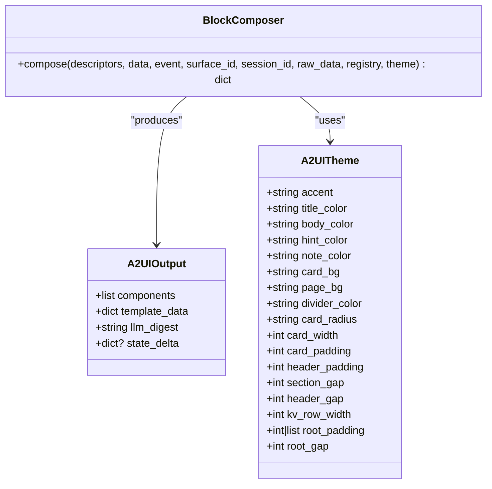
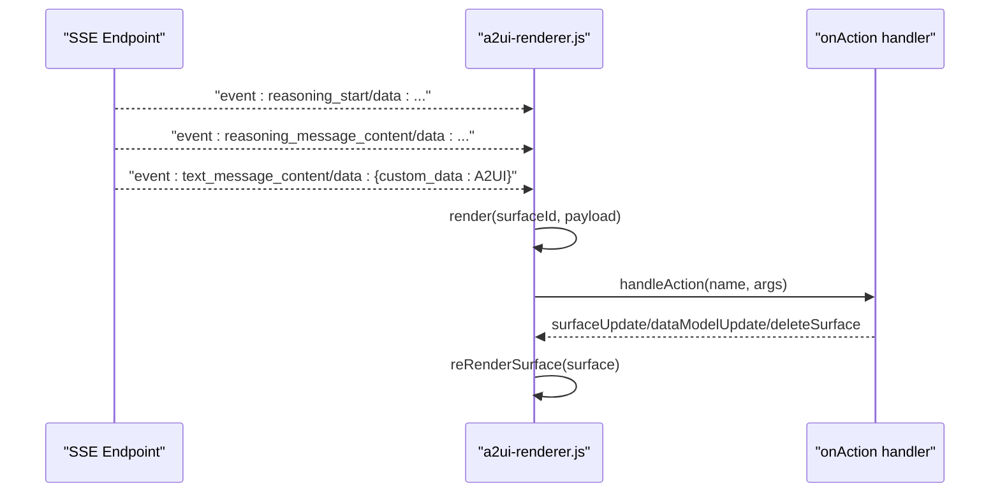
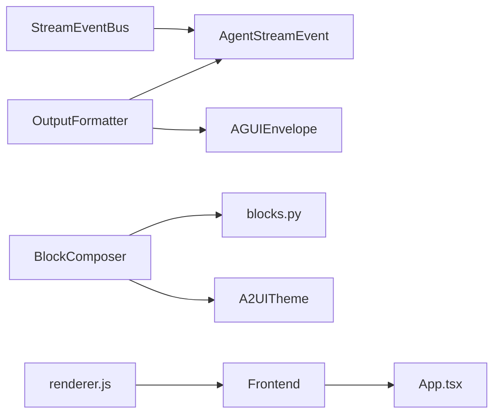

# Streaming and UI Framework

<cite>
**Referenced Files in This Document**
- [events.py](file://src/ark_agentic/core/stream/events.py)
- [event_bus.py](file://src/ark_agentic/core/stream/event_bus.py)
- [output_formatter.py](file://src/ark_agentic/core/stream/output_formatter.py)
- [assembler.py](file://src/ark_agentic/core/stream/assembler.py)
- [agui_models.py](file://src/ark_agentic/core/stream/agui_models.py)
- [__init__.py](file://src/ark_agentic/core/a2ui/__init__.py)
- [blocks.py](file://src/ark_agentic/core/a2ui/blocks.py)
- [renderer.py](file://src/ark_agentic/core/a2ui/renderer.py)
- [composer.py](file://src/ark_agentic/core/a2ui/composer.py)
- [theme.py](file://src/ark_agentic/core/a2ui/theme.py)
- [components.py](file://src/ark_agentic/agents/insurance/a2ui/components.py)
- [a2ui-renderer.js](file://src/ark_agentic/static/a2ui-renderer.js)
- [App.tsx](file://src/ark_agentic/studio/frontend/src/App.tsx)
</cite>

## Table of Contents
1. [Introduction](#introduction)
2. [Project Structure](#project-structure)
3. [Core Components](#core-components)
4. [Architecture Overview](#architecture-overview)
5. [Detailed Component Analysis](#detailed-component-analysis)
6. [Dependency Analysis](#dependency-analysis)
7. [Performance Considerations](#performance-considerations)
8. [Troubleshooting Guide](#troubleshooting-guide)
9. [Conclusion](#conclusion)
10. [Appendices](#appendices)

## Introduction
This document explains the streaming and UI framework powering real-time agent interactions. It covers:
- The AG-UI protocol with all 17 event types and how they map to internal runner signals
- The streaming event bus and output formatter supporting multiple transport protocols
- The A2UI component system including card, button, form, and chart components
- The streaming event assembly pipeline and frontend-backend communication patterns
- Practical examples for building custom streaming responses and rich UI components

## Project Structure
The framework is organized around two pillars:
- Streaming engine: event modeling, event bus, output formatting, and assembly
- A2UI rendering engine: block composition, theme-driven rendering, and frontend renderer

**Diagram sources**
- [events.py:1-116](file://src/ark_agentic/core/stream/events.py#L1-L116)
- [event_bus.py:1-248](file://src/ark_agentic/core/stream/event_bus.py#L1-L248)
- [output_formatter.py:1-444](file://src/ark_agentic/core/stream/output_formatter.py#L1-L444)
- [assembler.py:1-398](file://src/ark_agentic/core/stream/assembler.py#L1-L398)
- [agui_models.py:1-51](file://src/ark_agentic/core/stream/agui_models.py#L1-L51)
- [composer.py:1-123](file://src/ark_agentic/core/a2ui/composer.py#L1-L123)
- [blocks.py:1-149](file://src/ark_agentic/core/a2ui/blocks.py#L1-L149)
- [renderer.py:1-53](file://src/ark_agentic/core/a2ui/renderer.py#L1-L53)
- [theme.py:1-39](file://src/ark_agentic/core/a2ui/theme.py#L1-L39)
- [components.py:1-411](file://src/ark_agentic/agents/insurance/a2ui/components.py#L1-L411)
- [a2ui-renderer.js:1-1010](file://src/ark_agentic/static/a2ui-renderer.js#L1-L1010)
- [App.tsx:1-27](file://src/ark_agentic/studio/frontend/src/App.tsx#L1-L27)

**Section sources**
- [events.py:1-116](file://src/ark_agentic/core/stream/events.py#L1-L116)
- [event_bus.py:1-248](file://src/ark_agentic/core/stream/event_bus.py#L1-L248)
- [output_formatter.py:1-444](file://src/ark_agentic/core/stream/output_formatter.py#L1-L444)
- [assembler.py:1-398](file://src/ark_agentic/core/stream/assembler.py#L1-L398)
- [agui_models.py:1-51](file://src/ark_agentic/core/stream/agui_models.py#L1-L51)
- [composer.py:1-123](file://src/ark_agentic/core/a2ui/composer.py#L1-L123)
- [blocks.py:1-149](file://src/ark_agentic/core/a2ui/blocks.py#L1-L149)
- [renderer.py:1-53](file://src/ark_agentic/core/a2ui/renderer.py#L1-L53)
- [theme.py:1-39](file://src/ark_agentic/core/a2ui/theme.py#L1-L39)
- [components.py:1-411](file://src/ark_agentic/agents/insurance/a2ui/components.py#L1-L411)
- [a2ui-renderer.js:1-1010](file://src/ark_agentic/static/a2ui-renderer.js#L1-L1010)
- [App.tsx:1-27](file://src/ark_agentic/studio/frontend/src/App.tsx#L1-L27)

## Core Components
- AG-UI native event model and 17 event types
- StreamEventBus translating runner callbacks into AG-UI events
- OutputFormatter adapting events to multiple transport protocols
- StreamAssembler assembling LLM chunks into structured messages
- A2UI rendering pipeline: BlockComposer, theme, and client-side renderer

Key responsibilities:
- events.py defines the canonical event schema and selection of fields per type
- event_bus.py manages lifecycle pairing and emits AG-UI events
- output_formatter.py converts events to SSE with protocol variants
- assembler.py reconstructs coherent messages from streaming tokens
- composer.py composes block descriptors into a standardized A2UI payload
- renderer.js renders A2UI payloads into DOM with actions and updates

**Section sources**
- [events.py:30-116](file://src/ark_agentic/core/stream/events.py#L30-L116)
- [event_bus.py:67-248](file://src/ark_agentic/core/stream/event_bus.py#L67-L248)
- [output_formatter.py:48-444](file://src/ark_agentic/core/stream/output_formatter.py#L48-L444)
- [assembler.py:79-270](file://src/ark_agentic/core/stream/assembler.py#L79-L270)
- [composer.py:57-123](file://src/ark_agentic/core/a2ui/composer.py#L57-L123)
- [renderer.py:15-53](file://src/ark_agentic/core/a2ui/renderer.py#L15-L53)

## Architecture Overview
The framework follows a producer-consumer pattern:
- Producer: StreamEventBus receives runner callbacks and emits AG-UI events
- Processor: OutputFormatter adapts events to chosen protocol (agui/internal/enterprise/alone)
- Consumer: Frontend receives SSE and renders either raw AG-UI or enterprise envelopes

**Diagram sources**
- [event_bus.py:67-248](file://src/ark_agentic/core/stream/event_bus.py#L67-L248)
- [output_formatter.py:59-444](file://src/ark_agentic/core/stream/output_formatter.py#L59-L444)
- [a2ui-renderer.js:867-985](file://src/ark_agentic/static/a2ui-renderer.js#L867-L985)

## Detailed Component Analysis

### AG-UI Protocol and Event Types
The AG-UI protocol defines 17 event types covering lifecycle, text streaming, tool calls, state synchronization, message snapshots, thinking tags, and custom/raw passthrough. The event model is a Pydantic schema selecting fields per type.

**Diagram sources**
- [events.py:67-116](file://src/ark_agentic/core/stream/events.py#L67-L116)

**Section sources**
- [events.py:30-116](file://src/ark_agentic/core/stream/events.py#L30-L116)

### StreamEventBus: Event Assembly and Pairing
StreamEventBus translates runner callbacks into AG-UI events and maintains active states for steps and messages. It ensures proper pairing of start/finish events and auto-closes active states on terminal events.

**Diagram sources**
- [event_bus.py:146-171](file://src/ark_agentic/core/stream/event_bus.py#L146-L171)

**Section sources**
- [event_bus.py:67-248](file://src/ark_agentic/core/stream/event_bus.py#L67-L248)

### OutputFormatter: Multi-Protocol Adapter
OutputFormatter supports four protocols:
- agui: bare AG-UI events
- internal: legacy response.* events for backward compatibility
- enterprise: AGUIEnvelope wrapper with reasoning_start/reasoning_message_content/reasoning_end
- alone: ALONE sa_* events

It maps AG-UI fields to protocol-specific payloads and handles special cases like truncating long tool results and wrapping reasoning content.

**Diagram sources**
- [output_formatter.py:48-444](file://src/ark_agentic/core/stream/output_formatter.py#L48-L444)

**Section sources**
- [output_formatter.py:59-444](file://src/ark_agentic/core/stream/output_formatter.py#L59-L444)
- [agui_models.py:16-51](file://src/ark_agentic/core/stream/agui_models.py#L16-L51)

### StreamAssembler: LLM Chunk Assembly
StreamAssembler reconstructs coherent messages from streaming tokens, accumulating content, thinking, and tool call arguments. It parses provider-specific SSE formats (Anthropic/OpenAI) and builds AgentMessage with tool calls and usage.

**Diagram sources**
- [assembler.py:79-270](file://src/ark_agentic/core/stream/assembler.py#L79-L270)

**Section sources**
- [assembler.py:79-398](file://src/ark_agentic/core/stream/assembler.py#L79-L398)

### A2UI Rendering Pipeline
A2UI rendering composes business-aware components into a standardized payload:
- BlockComposer resolves inline transforms, invokes block builders, and wraps components under a root Column
- Theme defines immutable design tokens applied by renderers
- Template renderer loads card templates and merges data into a complete A2UI payload
- Frontend renderer interprets A2UI payloads, binds data, applies actions, and updates surfaces

**Diagram sources**
- [composer.py:57-123](file://src/ark_agentic/core/a2ui/composer.py#L57-L123)
- [theme.py:12-39](file://src/ark_agentic/core/a2ui/theme.py#L12-L39)
- [renderer.py:15-53](file://src/ark_agentic/core/a2ui/renderer.py#L15-L53)
- [a2ui-renderer.js:867-985](file://src/ark_agentic/static/a2ui-renderer.js#L867-L985)

**Section sources**
- [composer.py:57-123](file://src/ark_agentic/core/a2ui/composer.py#L57-L123)
- [blocks.py:46-149](file://src/ark_agentic/core/a2ui/blocks.py#L46-L149)
- [renderer.py:15-53](file://src/ark_agentic/core/a2ui/renderer.py#L15-L53)
- [theme.py:12-39](file://src/ark_agentic/core/a2ui/theme.py#L12-L39)
- [components.py:56-411](file://src/ark_agentic/agents/insurance/a2ui/components.py#L56-L411)

### A2UI Components: Card, Button, Form, Chart
- Card: structural container with theme-applied padding, radius, and background
- Button: styled button with action binding and optional once-only behavior
- Form: composed via Row/Column/List/Table with data bindings and actions
- Chart: rendered via dedicated component (e.g., CarInsPolicy) with theme tokens

**Diagram sources**
- [blocks.py:46-60](file://src/ark_agentic/core/a2ui/blocks.py#L46-L60)
- [composer.py:57-123](file://src/ark_agentic/core/a2ui/composer.py#L57-L123)
- [theme.py:12-39](file://src/ark_agentic/core/a2ui/theme.py#L12-L39)

**Section sources**
- [blocks.py:46-149](file://src/ark_agentic/core/a2ui/blocks.py#L46-L149)
- [components.py:120-401](file://src/ark_agentic/agents/insurance/a2ui/components.py#L120-L401)
- [a2ui-renderer.js:196-793](file://src/ark_agentic/static/a2ui-renderer.js#L196-L793)

### Web UI Integration and Frontend-Backend Communication
- Backend streams AG-UI or enterprise events over SSE
- Frontend uses a2ui-renderer.js to render A2UI payloads and handle actions
- Studio frontend routes define the SPA layout and protected views

**Diagram sources**
- [output_formatter.py:155-338](file://src/ark_agentic/core/stream/output_formatter.py#L155-L338)
- [a2ui-renderer.js:867-985](file://src/ark_agentic/static/a2ui-renderer.js#L867-L985)
- [App.tsx:1-27](file://src/ark_agentic/studio/frontend/src/App.tsx#L1-L27)

**Section sources**
- [output_formatter.py:155-338](file://src/ark_agentic/core/stream/output_formatter.py#L155-L338)
- [a2ui-renderer.js:867-1010](file://src/ark_agentic/static/a2ui-renderer.js#L867-L1010)
- [App.tsx:1-27](file://src/ark_agentic/studio/frontend/src/App.tsx#L1-L27)

## Dependency Analysis
- StreamEventBus depends on AgentStreamEvent and maintains internal state for active steps and messages
- OutputFormatter depends on AGUIEnvelope and maps AG-UI fields to protocol-specific payloads
- A2UI rendering depends on theme tokens and block registry; components depend on business logic and theme
- Frontend renderer depends on A2UI payload structure and exposes public APIs for surface lifecycle

**Diagram sources**
- [event_bus.py:20-116](file://src/ark_agentic/core/stream/event_bus.py#L20-L116)
- [output_formatter.py:20-444](file://src/ark_agentic/core/stream/output_formatter.py#L20-L444)
- [composer.py:20-123](file://src/ark_agentic/core/a2ui/composer.py#L20-L123)
- [blocks.py:19-149](file://src/ark_agentic/core/a2ui/blocks.py#L19-L149)
- [theme.py:12-39](file://src/ark_agentic/core/a2ui/theme.py#L12-L39)
- [a2ui-renderer.js:867-1010](file://src/ark_agentic/static/a2ui-renderer.js#L867-L1010)
- [App.tsx:1-27](file://src/ark_agentic/studio/frontend/src/App.tsx#L1-L27)

**Section sources**
- [event_bus.py:67-248](file://src/ark_agentic/core/stream/event_bus.py#L67-L248)
- [output_formatter.py:48-444](file://src/ark_agentic/core/stream/output_formatter.py#L48-L444)
- [composer.py:57-123](file://src/ark_agentic/core/a2ui/composer.py#L57-L123)
- [blocks.py:96-149](file://src/ark_agentic/core/a2ui/blocks.py#L96-L149)
- [theme.py:12-39](file://src/ark_agentic/core/a2ui/theme.py#L12-L39)
- [a2ui-renderer.js:867-1010](file://src/ark_agentic/static/a2ui-renderer.js#L867-L1010)
- [App.tsx:1-27](file://src/ark_agentic/studio/frontend/src/App.tsx#L1-L27)

## Performance Considerations
- Event batching and minimal payload construction reduce overhead
- Truncation of long tool results prevents oversized payloads
- Enterprise formatter defers reasoning content until needed to minimize latency
- Frontend renderer updates only changed surfaces to limit DOM work

## Troubleshooting Guide
- If reasoning frames are missing in enterprise mode, verify run_started triggers reasoning_start and ensure thinking_message_* events are not skipped
- If A2UI components do not render, check surfaceId and rootComponentId presence in the payload and confirm component registry includes required builders
- If actions are not triggered, ensure onAction handler is wired and action names match renderer’s supported actions
- For legacy compatibility, confirm internal formatter mappings align with expected response.* event names

**Section sources**
- [output_formatter.py:155-338](file://src/ark_agentic/core/stream/output_formatter.py#L155-L338)
- [a2ui-renderer.js:795-829](file://src/ark_agentic/static/a2ui-renderer.js#L795-L829)

## Conclusion
The streaming and UI framework provides a robust, extensible foundation for real-time agent interactions. By standardizing on AG-UI events, supporting multiple output protocols, and offering a powerful A2UI rendering pipeline, it enables rich UI experiences and seamless frontend-backend integration.

## Appendices

### AG-UI Event Types Reference
- Core lifecycle: run_started, run_finished, run_error
- Sub-steps: step_started, step_finished
- Text streaming: text_message_start, text_message_content, text_message_end
- Tool calls: tool_call_start, tool_call_args, tool_call_end, tool_call_result
- State sync: state_snapshot, state_delta
- Messages snapshot: messages_snapshot
- Thinking tags: thinking_message_start, thinking_message_content, thinking_message_end
- Custom/raw: custom, raw

**Section sources**
- [events.py:30-61](file://src/ark_agentic/core/stream/events.py#L30-L61)

### Practical Examples

- Implementing custom streaming responses
  - Use StreamEventBus callbacks to emit text_message_content with content_kind set to "a2ui" and custom_data containing A2UI component payload
  - Ensure run_started precedes content and run_finished closes active states

  **Section sources**
  - [event_bus.py:202-214](file://src/ark_agentic/core/stream/event_bus.py#L202-L214)
  - [events.py:87-106](file://src/ark_agentic/core/stream/events.py#L87-L106)

- Creating rich UI components
  - Compose blocks using BlockComposer with descriptors referencing agent-specific component builders
  - Apply theme tokens for consistent visuals and use inline transforms to compute values at compose-time

  **Section sources**
  - [composer.py:60-123](file://src/ark_agentic/core/a2ui/composer.py#L60-L123)
  - [theme.py:12-39](file://src/ark_agentic/core/a2ui/theme.py#L12-L39)
  - [components.py:56-411](file://src/ark_agentic/agents/insurance/a2ui/components.py#L56-L411)

- Handling real-time user interactions
  - Bind actions in component props and forward them to onAction; renderer dispatches supported actions and toggles popups

  **Section sources**
  - [a2ui-renderer.js:795-829](file://src/ark_agentic/static/a2ui-renderer.js#L795-L829)
  - [a2ui-renderer.js:846-856](file://src/ark_agentic/static/a2ui-renderer.js#L846-L856)