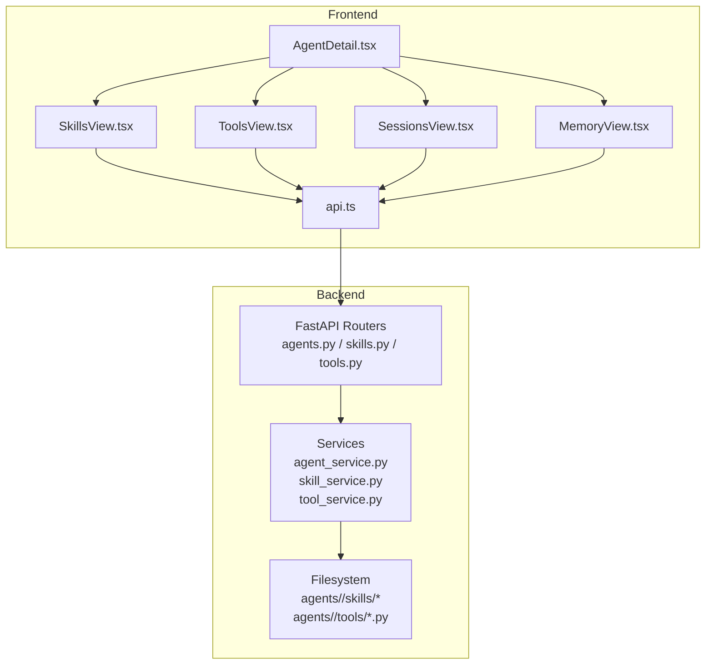
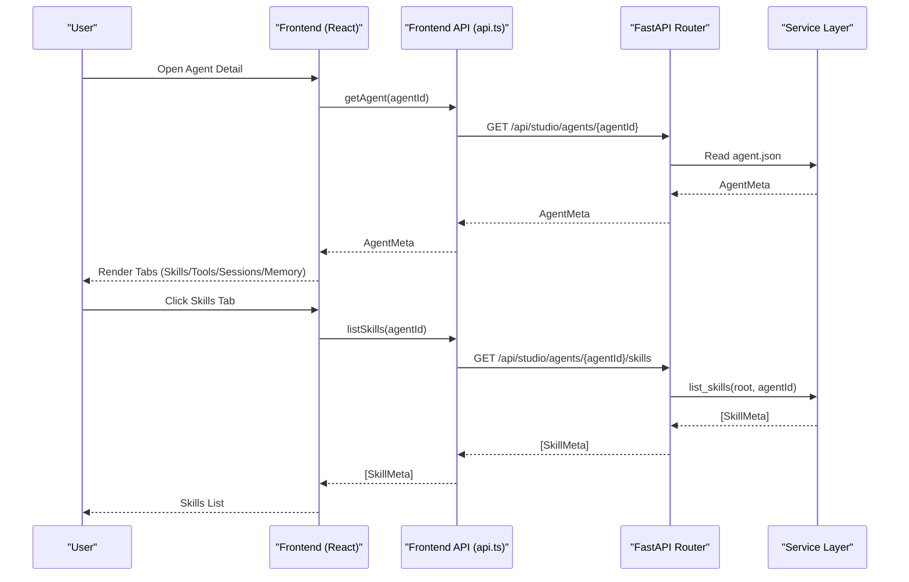
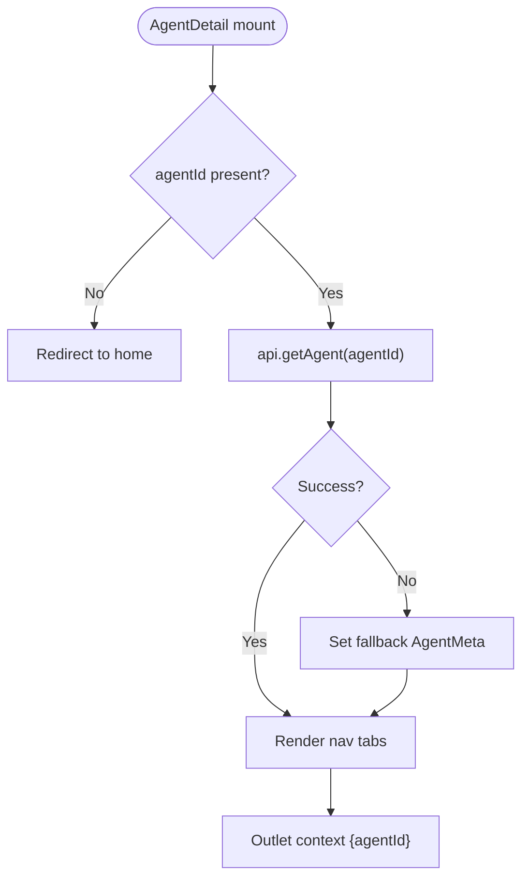
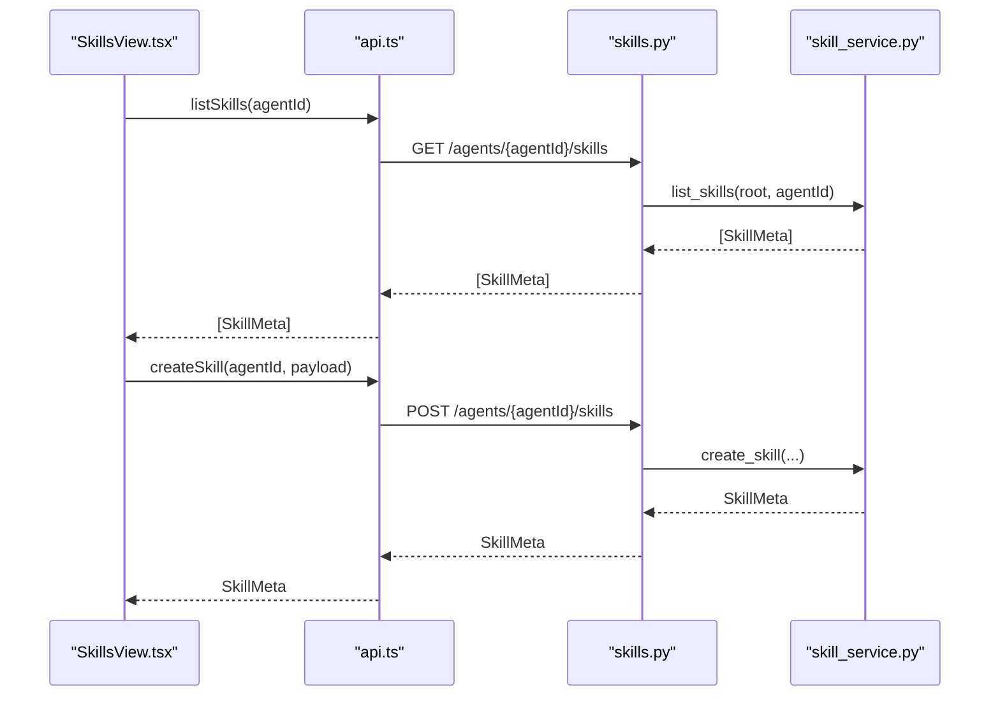
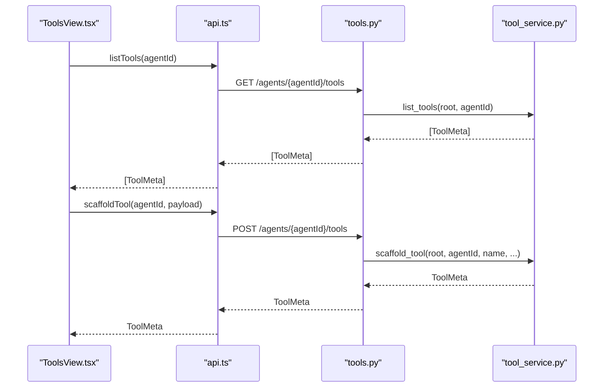
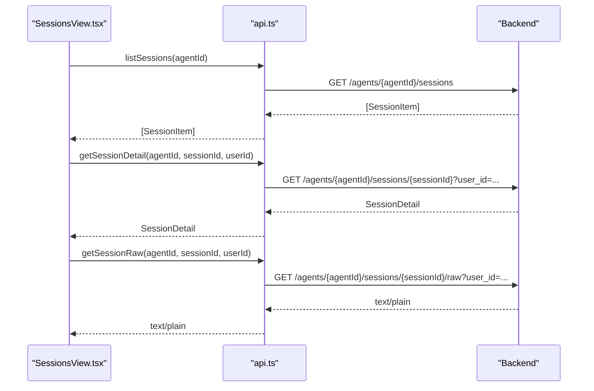
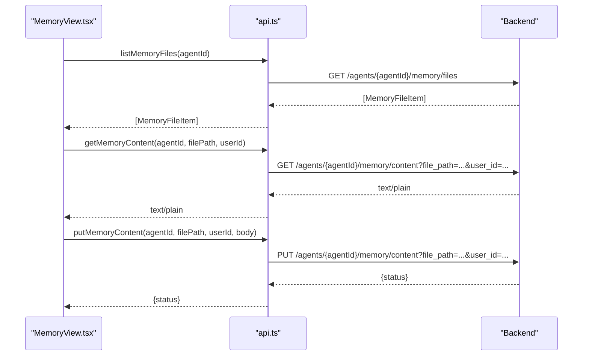
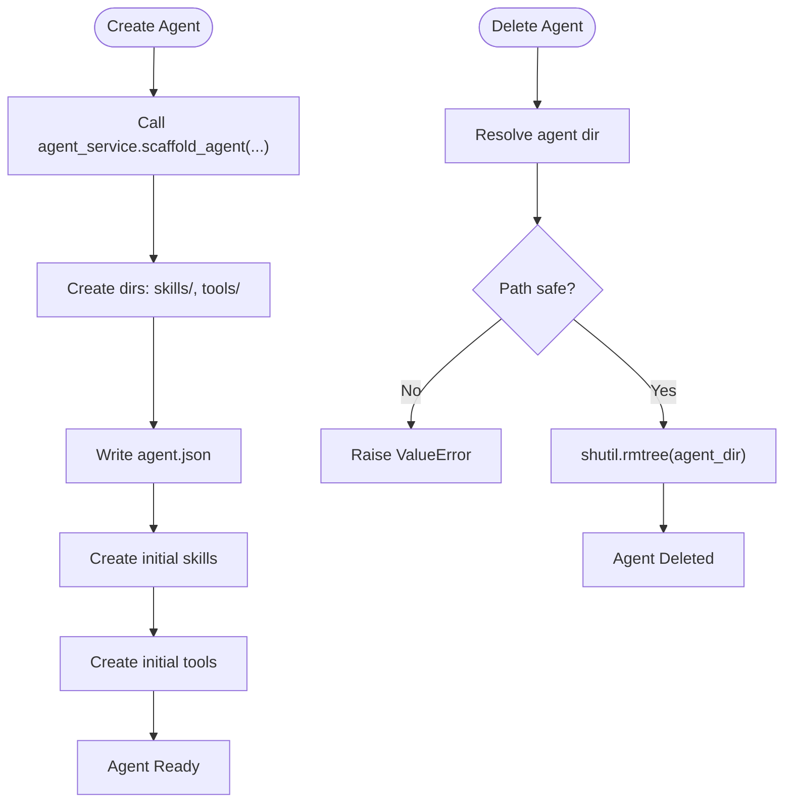
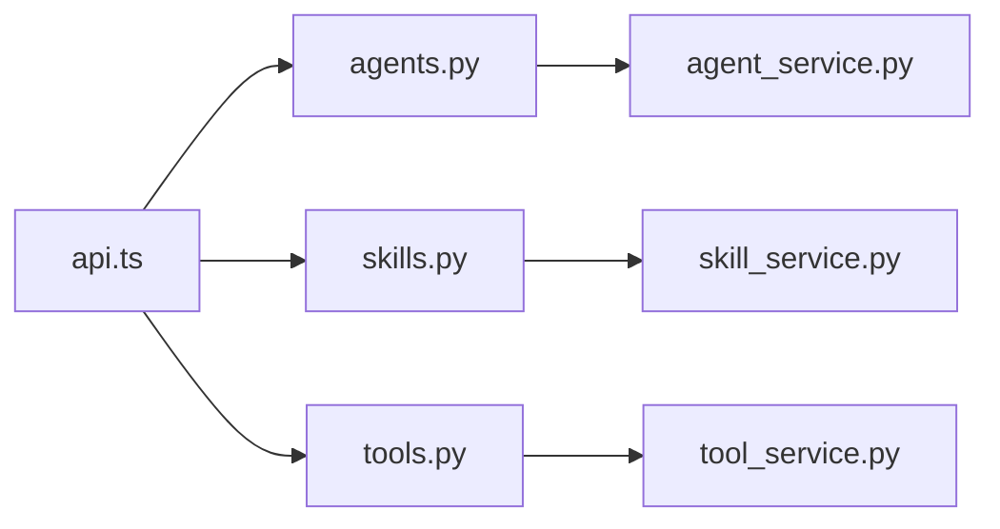

# Agent Management Interface

<cite>
**Referenced Files in This Document**
- [AgentDetail.tsx](file://src/ark_agentic/studio/frontend/src/pages/AgentDetail.tsx)
- [SkillsView.tsx](file://src/ark_agentic/studio/frontend/src/pages/SkillsView.tsx)
- [ToolsView.tsx](file://src/ark_agentic/studio/frontend/src/pages/ToolsView.tsx)
- [SessionsView.tsx](file://src/ark_agentic/studio/frontend/src/pages/SessionsView.tsx)
- [MemoryView.tsx](file://src/ark_agentic/studio/frontend/src/pages/MemoryView.tsx)
- [api.ts](file://src/ark_agentic/studio/frontend/src/api.ts)
- [agents.py](file://src/ark_agentic/studio/api/agents.py)
- [skills.py](file://src/ark_agentic/studio/api/skills.py)
- [tools.py](file://src/ark_agentic/studio/api/tools.py)
- [agent_service.py](file://src/ark_agentic/studio/services/agent_service.py)
- [skill_service.py](file://src/ark_agentic/studio/services/skill_service.py)
- [tool_service.py](file://src/ark_agentic/studio/services/tool_service.py)
</cite>

## Table of Contents
1. [Introduction](#introduction)
2. [Project Structure](#project-structure)
3. [Core Components](#core-components)
4. [Architecture Overview](#architecture-overview)
5. [Detailed Component Analysis](#detailed-component-analysis)
6. [Dependency Analysis](#dependency-analysis)
7. [Performance Considerations](#performance-considerations)
8. [Troubleshooting Guide](#troubleshooting-guide)
9. [Conclusion](#conclusion)
10. [Appendices](#appendices)

## Introduction
This document describes the Agent Management interface for the Ark Agentic Studio. It covers the agent detail view, configuration panels for skills and tools, and management workflows for agents, skills, and tools. It also explains the agent lifecycle (creation, modification, activation, deletion), configuration options, and integration with backend services. Practical guides for configuring agents, monitoring performance via sessions and memory, and troubleshooting common issues are included, along with the agent service APIs and how the frontend interacts with the backend.

## Project Structure
The Agent Management interface is implemented as a React single-page application integrated with a FastAPI backend. The frontend organizes views by tabs (Skills, Tools, Sessions, Memory) under the agent detail route. The backend exposes thin HTTP endpoints that delegate to pure service-layer modules responsible for filesystem operations and parsing.

**Diagram sources**
- [AgentDetail.tsx:29-76](file://src/ark_agentic/studio/frontend/src/pages/AgentDetail.tsx#L29-L76)
- [SkillsView.tsx:9-38](file://src/ark_agentic/studio/frontend/src/pages/SkillsView.tsx#L9-L38)
- [ToolsView.tsx:9-36](file://src/ark_agentic/studio/frontend/src/pages/ToolsView.tsx#L9-L36)
- [SessionsView.tsx:55-106](file://src/ark_agentic/studio/frontend/src/pages/SessionsView.tsx#L55-L106)
- [MemoryView.tsx:30-71](file://src/ark_agentic/studio/frontend/src/pages/MemoryView.tsx#L30-L71)
- [api.ts:194-287](file://src/ark_agentic/studio/frontend/src/api.ts#L194-L287)
- [agents.py:76-131](file://src/ark_agentic/studio/api/agents.py#L76-L131)
- [skills.py:57-113](file://src/ark_agentic/studio/api/skills.py#L57-L113)
- [tools.py:41-66](file://src/ark_agentic/studio/api/tools.py#L41-L66)
- [agent_service.py:140-198](file://src/ark_agentic/studio/services/agent_service.py#L140-L198)
- [skill_service.py:42-183](file://src/ark_agentic/studio/services/skill_service.py#L42-L183)
- [tool_service.py:40-99](file://src/ark_agentic/studio/services/tool_service.py#L40-L99)

**Section sources**
- [AgentDetail.tsx:29-76](file://src/ark_agentic/studio/frontend/src/pages/AgentDetail.tsx#L29-L76)
- [api.ts:194-287](file://src/ark_agentic/studio/frontend/src/api.ts#L194-L287)
- [agents.py:76-131](file://src/ark_agentic/studio/api/agents.py#L76-L131)
- [skills.py:57-113](file://src/ark_agentic/studio/api/skills.py#L57-L113)
- [tools.py:41-66](file://src/ark_agentic/studio/api/tools.py#L41-L66)

## Core Components
- Agent detail view: Renders tabs for Skills, Tools, Sessions, and Memory. Fetches agent metadata and passes agentId to nested views.
- Skills panel: Lists, creates, edits, and deletes skills backed by Markdown files with YAML frontmatter.
- Tools panel: Lists tools generated from Python files and scaffolds new tools from a template.
- Sessions panel: Lists conversations per user, renders structured messages, and allows raw JSONL inspection/edit.
- Memory panel: Lists memory files per user, renders formatted content, and supports inline editing.
- Frontend API client: Centralized fetch wrappers for agents, skills, tools, sessions, and memory.
- Backend routers: Thin HTTP endpoints validating requests and delegating to services.
- Service layer: Pure business logic for filesystem operations and parsing.

**Section sources**
- [AgentDetail.tsx:29-76](file://src/ark_agentic/studio/frontend/src/pages/AgentDetail.tsx#L29-L76)
- [SkillsView.tsx:9-38](file://src/ark_agentic/studio/frontend/src/pages/SkillsView.tsx#L9-L38)
- [ToolsView.tsx:9-36](file://src/ark_agentic/studio/frontend/src/pages/ToolsView.tsx#L9-L36)
- [SessionsView.tsx:55-106](file://src/ark_agentic/studio/frontend/src/pages/SessionsView.tsx#L55-L106)
- [MemoryView.tsx:30-71](file://src/ark_agentic/studio/frontend/src/pages/MemoryView.tsx#L30-L71)
- [api.ts:194-287](file://src/ark_agentic/studio/frontend/src/api.ts#L194-L287)
- [skills.py:57-113](file://src/ark_agentic/studio/api/skills.py#L57-L113)
- [tools.py:41-66](file://src/ark_agentic/studio/api/tools.py#L41-L66)

## Architecture Overview
The frontend communicates with the backend via REST endpoints. The backend routes accept requests, validate them, and call service-layer functions that operate on the filesystem. The service layer encapsulates all domain logic and filesystem operations, keeping the HTTP layer thin.

**Diagram sources**
- [AgentDetail.tsx:29-76](file://src/ark_agentic/studio/frontend/src/pages/AgentDetail.tsx#L29-L76)
- [api.ts:194-210](file://src/ark_agentic/studio/frontend/src/api.ts#L194-L210)
- [agents.py:93-104](file://src/ark_agentic/studio/api/agents.py#L93-L104)
- [skills.py:57-65](file://src/ark_agentic/studio/api/skills.py#L57-L65)
- [skill_service.py:42-57](file://src/ark_agentic/studio/services/skill_service.py#L42-L57)

## Detailed Component Analysis

### Agent Detail View
- Purpose: Hosts the agent detail page with tabbed navigation for Skills, Tools, Sessions, and Memory.
- Behavior:
  - Loads agent metadata by agentId.
  - Provides a loading state and fallback metadata if agent.json is missing.
  - Passes agentId to child views via outlet context.
- UX: Renders a tab bar and outlet area for dynamic content.

**Diagram sources**
- [AgentDetail.tsx:29-76](file://src/ark_agentic/studio/frontend/src/pages/AgentDetail.tsx#L29-L76)
- [api.ts:199-200](file://src/ark_agentic/studio/frontend/src/api.ts#L199-L200)

**Section sources**
- [AgentDetail.tsx:29-76](file://src/ark_agentic/studio/frontend/src/pages/AgentDetail.tsx#L29-L76)
- [api.ts:199-200](file://src/ark_agentic/studio/frontend/src/api.ts#L199-L200)

### Skills Panel
- Purpose: Manage agent skills as Markdown files with YAML frontmatter.
- Features:
  - List skills with metadata and file path.
  - Create new skills with name, description, and content.
  - Edit existing skills (update frontmatter or content).
  - Delete skills with confirmation dialog.
  - View skill content and metadata cards.
- Backend integration: Delegates to skill_service via thin FastAPI endpoints.

**Diagram sources**
- [SkillsView.tsx:30-38](file://src/ark_agentic/studio/frontend/src/pages/SkillsView.tsx#L30-L38)
- [api.ts:203-220](file://src/ark_agentic/studio/frontend/src/api.ts#L203-L220)
- [skills.py:57-83](file://src/ark_agentic/studio/api/skills.py#L57-L83)
- [skill_service.py:42-101](file://src/ark_agentic/studio/services/skill_service.py#L42-L101)

**Section sources**
- [SkillsView.tsx:9-38](file://src/ark_agentic/studio/frontend/src/pages/SkillsView.tsx#L9-L38)
- [SkillsView.tsx:55-89](file://src/ark_agentic/studio/frontend/src/pages/SkillsView.tsx#L55-L89)
- [SkillsView.tsx:165-245](file://src/ark_agentic/studio/frontend/src/pages/SkillsView.tsx#L165-L245)
- [api.ts:203-220](file://src/ark_agentic/studio/frontend/src/api.ts#L203-L220)
- [skills.py:57-113](file://src/ark_agentic/studio/api/skills.py#L57-L113)
- [skill_service.py:42-183](file://src/ark_agentic/studio/services/skill_service.py#L42-L183)

### Tools Panel
- Purpose: Manage agent tools generated from Python files and scaffold new tools from a template.
- Features:
  - List tools with group, file path, and parameter schema.
  - Scaffold new tools with name, description, and parameter specs.
  - View tool metadata and parameter JSON schema.
- Backend integration: Delegates to tool_service via thin FastAPI endpoints.

**Diagram sources**
- [ToolsView.tsx:28-36](file://src/ark_agentic/studio/frontend/src/pages/ToolsView.tsx#L28-L36)
- [api.ts:223-230](file://src/ark_agentic/studio/frontend/src/api.ts#L223-L230)
- [tools.py:41-66](file://src/ark_agentic/studio/api/tools.py#L41-L66)
- [tool_service.py:40-99](file://src/ark_agentic/studio/services/tool_service.py#L40-L99)

**Section sources**
- [ToolsView.tsx:9-36](file://src/ark_agentic/studio/frontend/src/pages/ToolsView.tsx#L9-L36)
- [ToolsView.tsx:38-55](file://src/ark_agentic/studio/frontend/src/pages/ToolsView.tsx#L38-L55)
- [ToolsView.tsx:124-163](file://src/ark_agentic/studio/frontend/src/pages/ToolsView.tsx#L124-L163)
- [api.ts:223-230](file://src/ark_agentic/studio/frontend/src/api.ts#L223-L230)
- [tools.py:41-66](file://src/ark_agentic/studio/api/tools.py#L41-L66)
- [tool_service.py:40-99](file://src/ark_agentic/studio/services/tool_service.py#L40-L99)

### Sessions Panel
- Purpose: Inspect and manage agent sessions, including conversation rendering and raw JSONL editing.
- Features:
  - Group sessions by user, sort by recency.
  - Switch between conversation and raw JSONL tabs.
  - Load and save raw session content.
  - Render structured messages and runtime state.
- Backend integration: Uses dedicated endpoints for listing sessions, fetching details, and raw content.

**Diagram sources**
- [SessionsView.tsx:99-140](file://src/ark_agentic/studio/frontend/src/pages/SessionsView.tsx#L99-L140)
- [api.ts:233-246](file://src/ark_agentic/studio/frontend/src/api.ts#L233-L246)

**Section sources**
- [SessionsView.tsx:55-106](file://src/ark_agentic/studio/frontend/src/pages/SessionsView.tsx#L55-L106)
- [SessionsView.tsx:136-140](file://src/ark_agentic/studio/frontend/src/pages/SessionsView.tsx#L136-L140)
- [SessionsView.tsx:164-301](file://src/ark_agentic/studio/frontend/src/pages/SessionsView.tsx#L164-L301)
- [api.ts:233-259](file://src/ark_agentic/studio/frontend/src/api.ts#L233-L259)

### Memory Panel
- Purpose: Browse and edit agent memory files (e.g., MEMORY.md) per user.
- Features:
  - Group files by user, sort by type and size.
  - Preview formatted memory content.
  - Inline edit and save memory content.
- Backend integration: Uses endpoints for listing files and retrieving/editing content.

**Diagram sources**
- [MemoryView.tsx:64-91](file://src/ark_agentic/studio/frontend/src/pages/MemoryView.tsx#L64-L91)
- [api.ts:262-286](file://src/ark_agentic/studio/frontend/src/api.ts#L262-L286)

**Section sources**
- [MemoryView.tsx:30-71](file://src/ark_agentic/studio/frontend/src/pages/MemoryView.tsx#L30-L71)
- [MemoryView.tsx:73-91](file://src/ark_agentic/studio/frontend/src/pages/MemoryView.tsx#L73-L91)
- [MemoryView.tsx:121-215](file://src/ark_agentic/studio/frontend/src/pages/MemoryView.tsx#L121-L215)
- [api.ts:262-286](file://src/ark_agentic/studio/frontend/src/api.ts#L262-L286)

### Agent Lifecycle Management
- Creation:
  - Frontend: Not exposed in current UI; creation is handled by backend agent scaffolding service and HTTP endpoint.
  - Backend: Creates agent directory with skills and tools subdirectories, writes agent.json, and initializes optional LLM config.
- Modification:
  - Frontend: Agent metadata is read-only in the current UI; agent.json is written by backend scaffolding.
  - Backend: Updates agent.json timestamps and fields.
- Activation:
  - Agent status defaults to active during creation; no explicit activation endpoint is exposed in the current UI.
- Deletion:
  - Backend: Removes the agent directory recursively with safety checks; meta_builder agent cannot be deleted.

**Diagram sources**
- [agent_service.py:60-137](file://src/ark_agentic/studio/services/agent_service.py#L60-L137)
- [agent_service.py:160-181](file://src/ark_agentic/studio/services/agent_service.py#L160-L181)
- [agents.py:106-131](file://src/ark_agentic/studio/api/agents.py#L106-L131)

**Section sources**
- [agent_service.py:60-137](file://src/ark_agentic/studio/services/agent_service.py#L60-L137)
- [agent_service.py:160-181](file://src/ark_agentic/studio/services/agent_service.py#L160-L181)
- [agents.py:106-131](file://src/ark_agentic/studio/api/agents.py#L106-L131)

### Agent Configuration Options and Integration
- Agent metadata:
  - Fields: id, name, description, status, created_at, updated_at.
  - Stored in agent.json; created via backend scaffolding.
- Skills configuration:
  - YAML frontmatter supports name, description, version, invocation_policy, group, tags.
  - Content is free-form Markdown; can include frontmatter or separate body.
- Tools configuration:
  - Python class-based tools with attributes: name, description, group, parameters.
  - Parameters are defined via ToolParameter specs rendered into a template.
- Integration with backend:
  - Frontend API client calls backend endpoints for agents, skills, tools, sessions, and memory.
  - Backend routers validate inputs and delegate to services.
  - Services operate on the filesystem and parse files without side effects.

**Section sources**
- [agents.py:27-47](file://src/ark_agentic/studio/api/agents.py#L27-L47)
- [agent_service.py:30-56](file://src/ark_agentic/studio/services/agent_service.py#L30-L56)
- [skill_service.py:25-35](file://src/ark_agentic/studio/services/skill_service.py#L25-L35)
- [tool_service.py:23-36](file://src/ark_agentic/studio/services/tool_service.py#L23-L36)
- [api.ts:194-287](file://src/ark_agentic/studio/frontend/src/api.ts#L194-L287)

## Dependency Analysis
- Frontend depends on centralized API module for all backend interactions.
- Backend routers depend on service-layer modules for business logic.
- Services depend on filesystem paths and parsing utilities.
- There are no circular dependencies between routers and services; each router delegates to a single service.

**Diagram sources**
- [api.ts:194-287](file://src/ark_agentic/studio/frontend/src/api.ts#L194-L287)
- [agents.py:76-131](file://src/ark_agentic/studio/api/agents.py#L76-L131)
- [skills.py:57-113](file://src/ark_agentic/studio/api/skills.py#L57-L113)
- [tools.py:41-66](file://src/ark_agentic/studio/api/tools.py#L41-L66)
- [agent_service.py:140-198](file://src/ark_agentic/studio/services/agent_service.py#L140-L198)
- [skill_service.py:42-183](file://src/ark_agentic/studio/services/skill_service.py#L42-L183)
- [tool_service.py:40-99](file://src/ark_agentic/studio/services/tool_service.py#L40-L99)

**Section sources**
- [api.ts:194-287](file://src/ark_agentic/studio/frontend/src/api.ts#L194-L287)
- [agents.py:76-131](file://src/ark_agentic/studio/api/agents.py#L76-L131)
- [skills.py:57-113](file://src/ark_agentic/studio/api/skills.py#L57-L113)
- [tools.py:41-66](file://src/ark_agentic/studio/api/tools.py#L41-L66)

## Performance Considerations
- Master-detail layout: Panels lazy-load data on selection to minimize initial payload.
- State grouping: Sessions and memory group items by user to reduce list rendering overhead.
- File parsing: Skills and tools rely on lightweight filesystem scanning and parsing; avoid frequent reloads.
- Caching: Backend refreshes skill caches after mutations to avoid stale in-memory state.

[No sources needed since this section provides general guidance]

## Troubleshooting Guide
- Agent not found:
  - Symptom: 404 when listing or fetching agent.
  - Cause: agent_id does not correspond to an existing directory.
  - Action: Verify agent_id and directory existence.
- Skill conflicts:
  - Symptom: 409 when creating skill.
  - Cause: Skill directory already exists.
  - Action: Choose a different skill name or delete the existing directory.
- Tool conflicts:
  - Symptom: 409 when scaffolding tool.
  - Cause: Tool file already exists.
  - Action: Choose a different tool name.
- Path safety violations:
  - Symptom: 400 when deleting skill or agent.
  - Cause: Attempted path traversal outside allowed scope.
  - Action: Do not modify paths manually; use provided UI actions.
- Tool name invalid:
  - Symptom: 400 when scaffolding tool.
  - Cause: Tool name is not a valid Python identifier.
  - Action: Use a valid Python identifier for tool name.
- Session/raw edit failures:
  - Symptom: Save fails or raw content not loaded.
  - Cause: Missing user_id or malformed JSONL.
  - Action: Ensure user_id is provided and content is valid JSONL.

**Section sources**
- [skills.py:76-82](file://src/ark_agentic/studio/api/skills.py#L76-L82)
- [tools.py:60-65](file://src/ark_agentic/studio/api/tools.py#L60-L65)
- [agent_service.py:167-178](file://src/ark_agentic/studio/services/agent_service.py#L167-L178)
- [skill_service.py:176-180](file://src/ark_agentic/studio/services/skill_service.py#L176-L180)
- [SessionsView.tsx:142-155](file://src/ark_agentic/studio/frontend/src/pages/SessionsView.tsx#L142-L155)
- [api.ts:248-259](file://src/ark_agentic/studio/frontend/src/api.ts#L248-L259)

## Conclusion
The Agent Management interface provides a cohesive, tabbed experience for inspecting and managing agents, skills, tools, sessions, and memory. The frontend integrates tightly with backend endpoints that delegate to pure service-layer modules, ensuring clean separation of concerns and robust filesystem operations. The current UI focuses on viewing and editing; agent creation and deletion are handled by backend scaffolding and HTTP endpoints. The provided APIs and service layers support practical configuration, monitoring, and troubleshooting workflows.

[No sources needed since this section summarizes without analyzing specific files]

## Appendices

### API Reference Summary
- Agents
  - GET /api/studio/agents
  - GET /api/studio/agents/{agent_id}
  - POST /api/studio/agents
- Skills
  - GET /api/studio/agents/{agent_id}/skills
  - POST /api/studio/agents/{agent_id}/skills
  - PUT /api/studio/agents/{agent_id}/skills/{skill_id}
  - DELETE /api/studio/agents/{agent_id}/skills/{skill_id}
- Tools
  - GET /api/studio/agents/{agent_id}/tools
  - POST /api/studio/agents/{agent_id}/tools
- Sessions
  - GET /api/studio/agents/{agent_id}/sessions
  - GET /api/studio/agents/{agent_id}/sessions/{sessionId}?user_id=...
  - GET /api/studio/agents/{agent_id}/sessions/{sessionId}/raw?user_id=...
  - PUT /api/studio/agents/{agent_id}/sessions/{sessionId}/raw?user_id=...
- Memory
  - GET /api/studio/agents/{agent_id}/memory/files
  - GET /api/studio/agents/{agent_id}/memory/content?file_path=...&user_id=...
  - PUT /api/studio/agents/{agent_id}/memory/content?file_path=...&user_id=...

**Section sources**
- [agents.py:76-131](file://src/ark_agentic/studio/api/agents.py#L76-L131)
- [skills.py:57-113](file://src/ark_agentic/studio/api/skills.py#L57-L113)
- [tools.py:41-66](file://src/ark_agentic/studio/api/tools.py#L41-L66)
- [api.ts:194-287](file://src/ark_agentic/studio/frontend/src/api.ts#L194-L287)