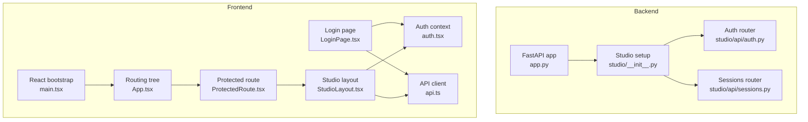
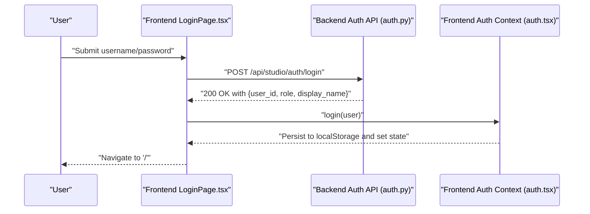
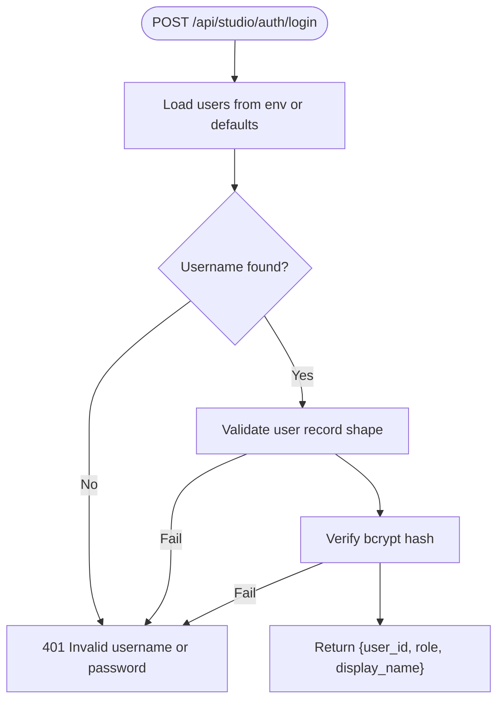
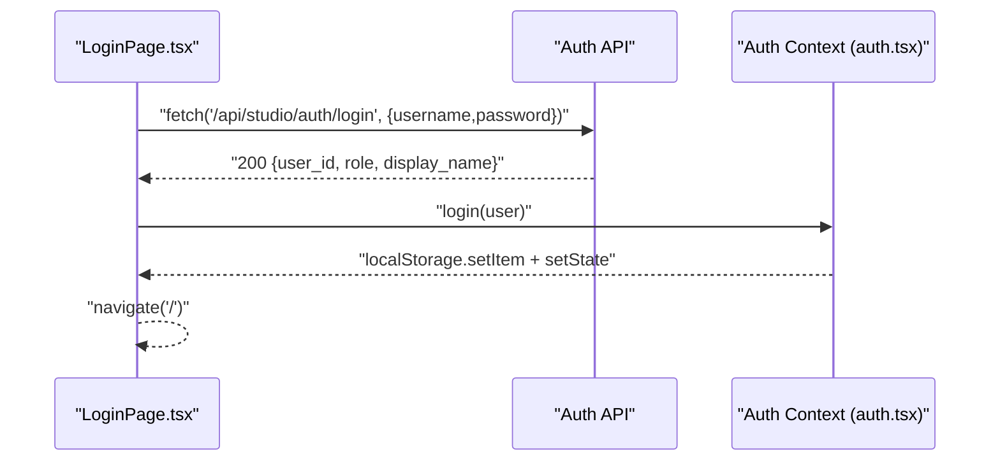
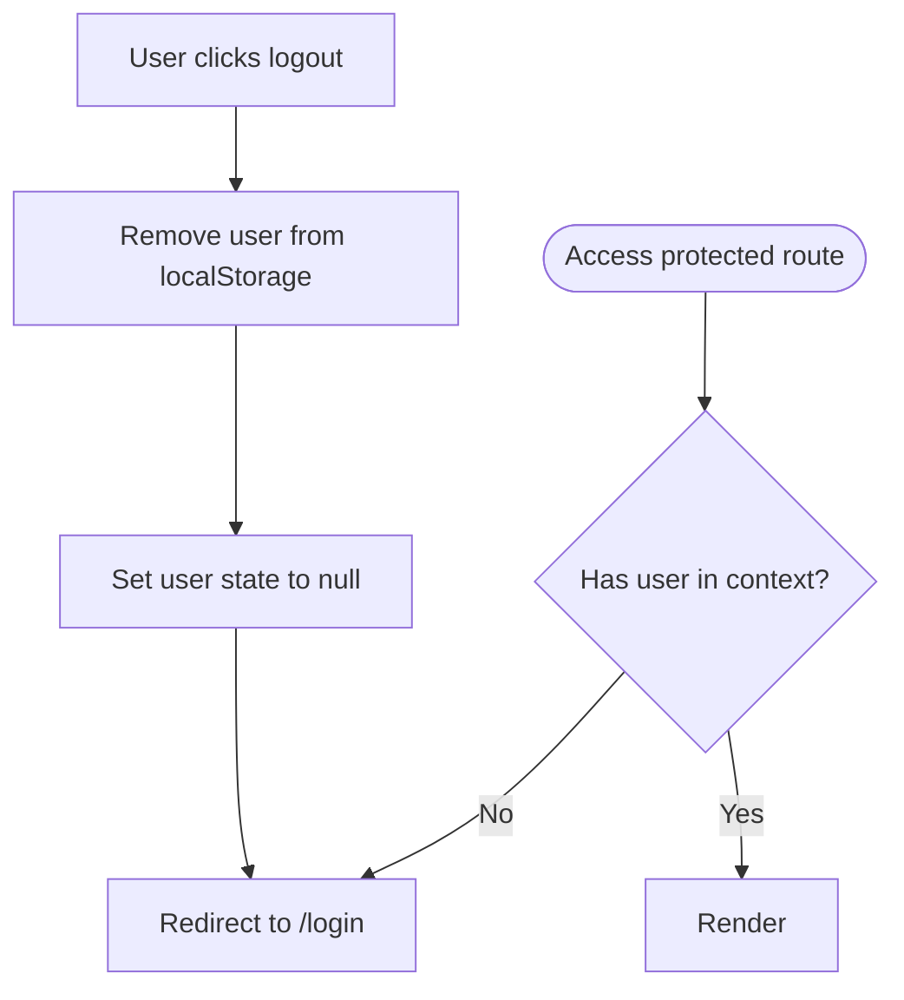
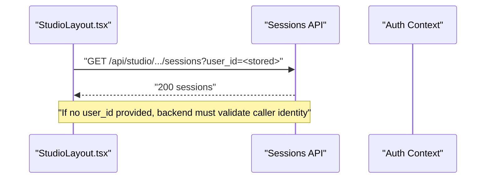
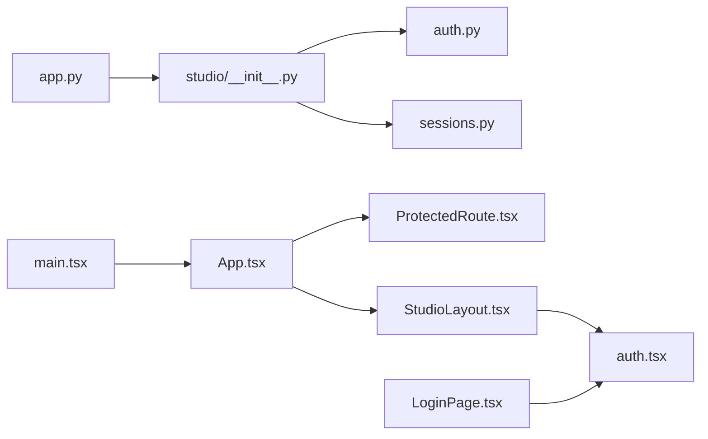

# Authentication and Authorization

<cite>
**Referenced Files in This Document**
- [auth.py](file://src/ark_agentic/studio/api/auth.py)
- [auth.tsx](file://src/ark_agentic/studio/frontend/src/auth.tsx)
- [ProtectedRoute.tsx](file://src/ark_agentic/studio/frontend/src/components/ProtectedRoute.tsx)
- [LoginPage.tsx](file://src/ark_agentic/studio/frontend/src/pages/LoginPage.tsx)
- [api.ts](file://src/ark_agentic/studio/frontend/src/api.ts)
- [StudioLayout.tsx](file://src/ark_agentic/studio/frontend/src/layouts/StudioLayout.tsx)
- [App.tsx](file://src/ark_agentic/studio/frontend/src/App.tsx)
- [main.tsx](file://src/ark_agentic/studio/frontend/src/main.tsx)
- [sessions.py](file://src/ark_agentic/studio/api/sessions.py)
- [studio/__init__.py](file://src/ark_agentic/studio/__init__.py)
- [app.py](file://src/ark_agentic/app.py)
- [test_auth_login.py](file://tests/unit/studio/test_auth_login.py)
</cite>

## Table of Contents
1. [Introduction](#introduction)
2. [Project Structure](#project-structure)
3. [Core Components](#core-components)
4. [Architecture Overview](#architecture-overview)
5. [Detailed Component Analysis](#detailed-component-analysis)
6. [Dependency Analysis](#dependency-analysis)
7. [Performance Considerations](#performance-considerations)
8. [Troubleshooting Guide](#troubleshooting-guide)
9. [Conclusion](#conclusion)

## Introduction
This document describes the Studio authentication and authorization system. It covers the login workflow, user session handling, protected route enforcement, and backend authentication endpoints. It also documents how the frontend manages user state, how protected resources are gated, and how to implement authentication guards and error handling. Role-based access control is supported via a role field returned during login, enabling simple editor/viewer permissions in the frontend.

## Project Structure
Studio’s authentication spans a small set of backend and frontend modules:
- Backend: FastAPI router for authentication under the Studio API namespace
- Frontend: React context for user state, login page, protected route guard, and layout with logout
- Routing: Studio routes are conditionally mounted behind an environment gate

**Diagram sources**
- [app.py:100-101](file://src/ark_agentic/app.py#L100-L101)
- [studio/__init__.py:38-43](file://src/ark_agentic/studio/__init__.py#L38-L43)
- [auth.py:26](file://src/ark_agentic/studio/api/auth.py#L26)
- [sessions.py:22](file://src/ark_agentic/studio/api/sessions.py#L22)
- [main.tsx:8-15](file://src/ark_agentic/studio/frontend/src/main.tsx#L8-L15)
- [App.tsx:8-26](file://src/ark_agentic/studio/frontend/src/App.tsx#L8-L26)
- [ProtectedRoute.tsx:4-8](file://src/ark_agentic/studio/frontend/src/components/ProtectedRoute.tsx#L4-L8)
- [LoginPage.tsx:5](file://src/ark_agentic/studio/frontend/src/pages/LoginPage.tsx#L5)
- [auth.tsx:28-46](file://src/ark_agentic/studio/frontend/src/auth.tsx#L28-L46)
- [StudioLayout.tsx:9-29](file://src/ark_agentic/studio/frontend/src/layouts/StudioLayout.tsx#L9-L29)
- [api.ts:59-97](file://src/ark_agentic/studio/frontend/src/api.ts#L59-L97)

**Section sources**
- [app.py:100-101](file://src/ark_agentic/app.py#L100-L101)
- [studio/__init__.py:38-43](file://src/ark_agentic/studio/__init__.py#L38-L43)
- [main.tsx:8-15](file://src/ark_agentic/studio/frontend/src/main.tsx#L8-L15)
- [App.tsx:8-26](file://src/ark_agentic/studio/frontend/src/App.tsx#L8-L26)

## Core Components
- Backend authentication endpoint: validates credentials and returns a minimal user profile
- Frontend authentication context: stores user in localStorage and exposes login/logout
- Protected route guard: enforces authentication for protected pages
- Login page: posts credentials to backend and persists user on success
- Layout and logout: displays role and logs out by clearing local storage
- Sessions API: protected by the presence of a valid user in localStorage

Key roles and fields:
- role: editor or viewer
- user_id: unique identifier
- display_name: human-readable name

**Section sources**
- [auth.py:94-114](file://src/ark_agentic/studio/api/auth.py#L94-L114)
- [auth.tsx:3-13](file://src/ark_agentic/studio/frontend/src/auth.tsx#L3-L13)
- [ProtectedRoute.tsx:4-8](file://src/ark_agentic/studio/frontend/src/components/ProtectedRoute.tsx#L4-L8)
- [LoginPage.tsx:5](file://src/ark_agentic/studio/frontend/src/pages/LoginPage.tsx#L5)
- [StudioLayout.tsx:23-29](file://src/ark_agentic/studio/frontend/src/layouts/StudioLayout.tsx#L23-L29)
- [sessions.py:84-114](file://src/ark_agentic/studio/api/sessions.py#L84-L114)

## Architecture Overview
The authentication flow is a simple, stateless pattern:
- Frontend posts credentials to the backend login endpoint
- Backend validates against configured users and bcrypt hash
- On success, backend returns user profile (role, user_id, display_name)
- Frontend stores user in localStorage and navigates to the dashboard
- Protected routes enforce that a user exists in localStorage
- Subsequent requests to Studio APIs can optionally use the stored user_id

**Diagram sources**
- [LoginPage.tsx:15-38](file://src/ark_agentic/studio/frontend/src/pages/LoginPage.tsx#L15-L38)
- [auth.py:94-114](file://src/ark_agentic/studio/api/auth.py#L94-L114)
- [auth.tsx:31-34](file://src/ark_agentic/studio/frontend/src/auth.tsx#L31-L34)

## Detailed Component Analysis

### Backend Authentication Endpoint
- Endpoint: POST /api/studio/auth/login
- Accepts: username, password
- Validates: user exists and password matches bcrypt hash
- Returns: user_id, role, display_name
- Users source: environment variable STUDIO_USERS JSON object or defaults

**Diagram sources**
- [auth.py:94-114](file://src/ark_agentic/studio/api/auth.py#L94-L114)
- [auth.py:68-80](file://src/ark_agentic/studio/api/auth.py#L68-L80)
- [auth.py:83-91](file://src/ark_agentic/studio/api/auth.py#L83-L91)

**Section sources**
- [auth.py:94-114](file://src/ark_agentic/studio/api/auth.py#L94-L114)
- [auth.py:68-80](file://src/ark_agentic/studio/api/auth.py#L68-L80)
- [auth.py:83-91](file://src/ark_agentic/studio/api/auth.py#L83-L91)

### Frontend Authentication Context and Login Page
- Auth context stores user in localStorage and exposes login/logout
- LoginPage posts credentials to the backend and handles errors
- On success, navigates to home; on failure, shows error message

**Diagram sources**
- [LoginPage.tsx:15-38](file://src/ark_agentic/studio/frontend/src/pages/LoginPage.tsx#L15-L38)
- [auth.tsx:31-34](file://src/ark_agentic/studio/frontend/src/auth.tsx#L31-L34)

**Section sources**
- [auth.tsx:28-46](file://src/ark_agentic/studio/frontend/src/auth.tsx#L28-L46)
- [LoginPage.tsx:15-38](file://src/ark_agentic/studio/frontend/src/pages/LoginPage.tsx#L15-L38)

### Protected Routes and Logout
- ProtectedRoute enforces authentication by checking the presence of a user in context
- StudioLayout displays role badge and provides logout
- Logout clears localStorage and navigates to login

**Diagram sources**
- [ProtectedRoute.tsx:4-8](file://src/ark_agentic/studio/frontend/src/components/ProtectedRoute.tsx#L4-L8)
- [StudioLayout.tsx:26-29](file://src/ark_agentic/studio/frontend/src/layouts/StudioLayout.tsx#L26-L29)
- [auth.tsx:36-39](file://src/ark_agentic/studio/frontend/src/auth.tsx#L36-L39)

**Section sources**
- [ProtectedRoute.tsx:4-8](file://src/ark_agentic/studio/frontend/src/components/ProtectedRoute.tsx#L4-L8)
- [StudioLayout.tsx:23-29](file://src/ark_agentic/studio/frontend/src/layouts/StudioLayout.tsx#L23-L29)
- [auth.tsx:36-39](file://src/ark_agentic/studio/frontend/src/auth.tsx#L36-L39)

### Role-Based Access Control and Editor Features
- role is returned by login and exposed via the Auth context
- StudioLayout conditionally renders advanced panels for editor role
- Use role in your components to restrict actions and UI elements

Practical usage:
- Read role from context in components
- Gate sensitive UI or actions based on role
- Pass role to layout components to control navigation visibility

**Section sources**
- [auth.tsx:3-13](file://src/ark_agentic/studio/frontend/src/auth.tsx#L3-L13)
- [StudioLayout.tsx:23](file://src/ark_agentic/studio/frontend/src/layouts/StudioLayout.tsx#L23)

### Protected Resource Access and User State
- Sessions API endpoints require a valid user_id query parameter
- Frontend’s API client reads user_id from localStorage when available
- The x-ark-user-id header is set automatically when a user is present

**Diagram sources**
- [sessions.py:84-114](file://src/ark_agentic/studio/api/sessions.py#L84-L114)
- [api.ts:60-63](file://src/ark_agentic/studio/frontend/src/api.ts#L60-L63)
- [api.ts:10-18](file://src/ark_agentic/studio/frontend/src/api.ts#L10-L18)

**Section sources**
- [sessions.py:117-143](file://src/ark_agentic/studio/api/sessions.py#L117-L143)
- [api.ts:60-63](file://src/ark_agentic/studio/frontend/src/api.ts#L60-L63)
- [api.ts:10-18](file://src/ark_agentic/studio/frontend/src/api.ts#L10-L18)

### Logout Procedure
- Clicking “Sign Out” triggers logout
- Removes user from localStorage and resets state
- Navigates to /login

Implementation pointers:
- Call the logout function from the Auth context
- Ensure all downstream components re-render without user state

**Section sources**
- [StudioLayout.tsx:26-29](file://src/ark_agentic/studio/frontend/src/layouts/StudioLayout.tsx#L26-L29)
- [auth.tsx:36-39](file://src/ark_agentic/studio/frontend/src/auth.tsx#L36-L39)

## Dependency Analysis
- Backend routing is mounted under /api/studio by Studio setup
- App mounts Studio routes conditionally via environment gate
- Frontend bootstraps routing and authentication context at startup

**Diagram sources**
- [app.py:100-101](file://src/ark_agentic/app.py#L100-L101)
- [studio/__init__.py:38-43](file://src/ark_agentic/studio/__init__.py#L38-L43)
- [main.tsx:8-15](file://src/ark_agentic/studio/frontend/src/main.tsx#L8-L15)
- [App.tsx:8-26](file://src/ark_agentic/studio/frontend/src/App.tsx#L8-L26)

**Section sources**
- [app.py:100-101](file://src/ark_agentic/app.py#L100-L101)
- [studio/__init__.py:38-43](file://src/ark_agentic/studio/__init__.py#L38-L43)
- [main.tsx:8-15](file://src/ark_agentic/studio/frontend/src/main.tsx#L8-L15)

## Performance Considerations
- Authentication is CPU-bound hashing; bcrypt cost is fixed at login time
- Frontend performs localStorage reads/writes synchronously; negligible overhead
- Protected routes are checked on every navigation; keep checks lightweight
- Consider debouncing repeated login attempts at the network layer if needed

## Troubleshooting Guide
Common issues and resolutions:
- Invalid username or password
  - Cause: wrong credentials or malformed user record
  - Behavior: 401 response
  - Action: verify credentials and user record shape
- Invalid bcrypt hash
  - Cause: corrupted or legacy plaintext password field
  - Behavior: 401 response
  - Action: ensure password_hash is present and valid
- Invalid STUDIO_USERS JSON
  - Cause: malformed JSON in environment
  - Behavior: falls back to defaults
  - Action: fix JSON or remove the env var to use defaults
- Protected route redirect loop
  - Cause: user cleared from localStorage unexpectedly
  - Behavior: redirected to /login
  - Action: ensure logout is intentional and only clears localStorage

Validation references:
- Login success/failure and fallback behavior are covered by unit tests

**Section sources**
- [auth.py:98-108](file://src/ark_agentic/studio/api/auth.py#L98-L108)
- [auth.py:89-91](file://src/ark_agentic/studio/api/auth.py#L89-L91)
- [auth.py:74-78](file://src/ark_agentic/studio/api/auth.py#L74-L78)
- [test_auth_login.py:42-72](file://tests/unit/studio/test_auth_login.py#L42-L72)
- [test_auth_login.py:101-118](file://tests/unit/studio/test_auth_login.py#L101-L118)
- [test_auth_login.py:122-132](file://tests/unit/studio/test_auth_login.py#L122-L132)

## Conclusion
Studio’s authentication system is intentionally simple and stateless:
- Login validates credentials against configured users and bcrypt hashes
- Frontend stores a minimal user profile in localStorage
- Protected routes and layout enforce access based on presence of user state
- Role-based UI decisions are supported via the role field
- Sessions endpoints require a user_id parameter, enabling per-user isolation

This design is suitable for development and controlled environments. For production, consider adding CSRF protection, rate limiting, secure cookies, and centralized session management.