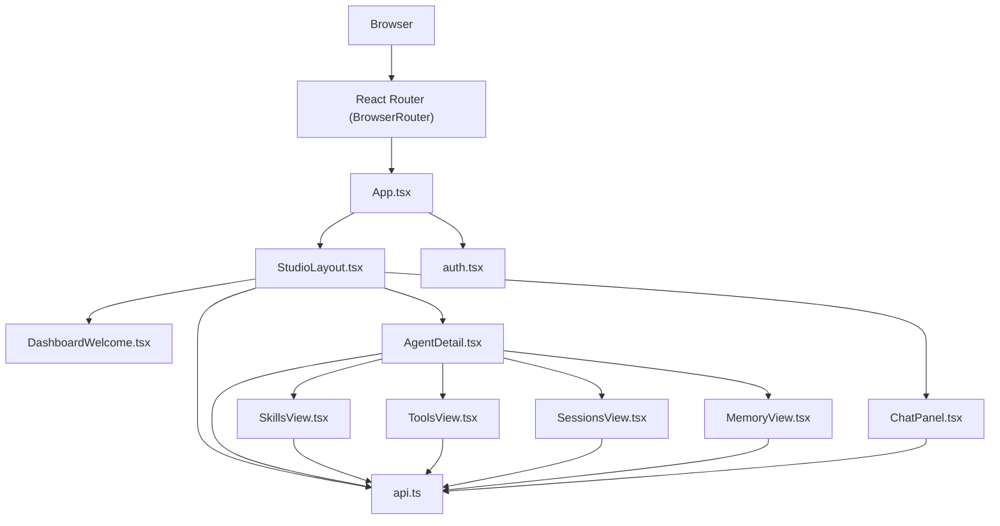
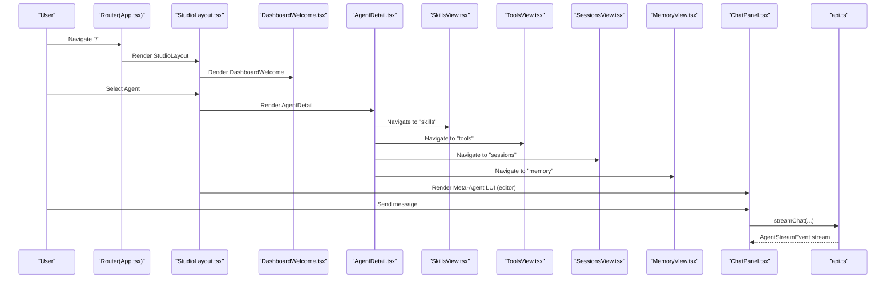
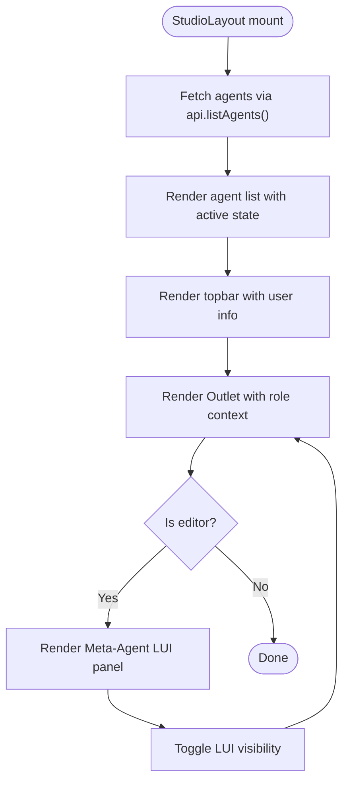
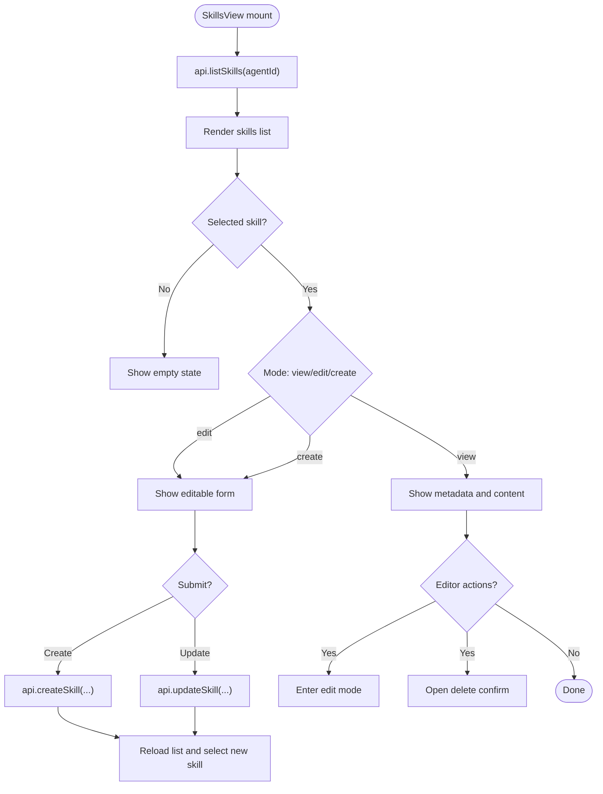
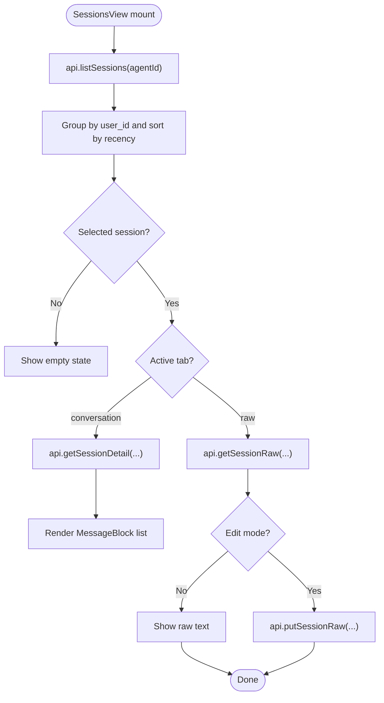
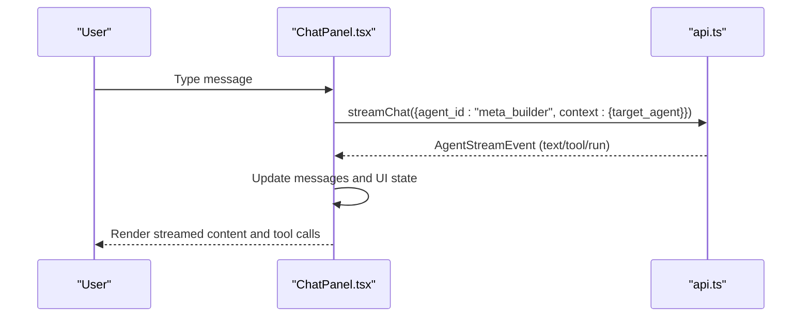
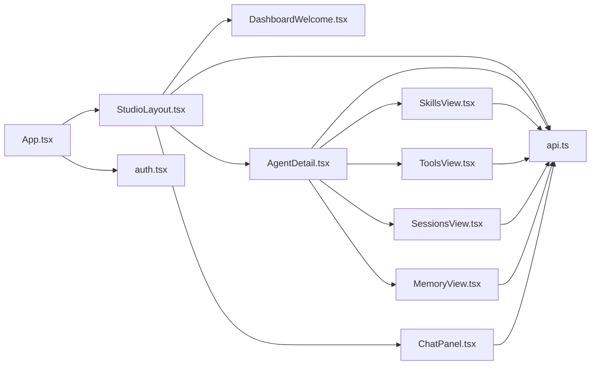

# Dashboard Overview

<cite>
**Referenced Files in This Document**
- [StudioLayout.tsx](file://src/ark_agentic/studio/frontend/src/layouts/StudioLayout.tsx)
- [DashboardWelcome.tsx](file://src/ark_agentic/studio/frontend/src/pages/DashboardWelcome.tsx)
- [App.tsx](file://src/ark_agentic/studio/frontend/src/App.tsx)
- [main.tsx](file://src/ark_agentic/studio/frontend/src/main.tsx)
- [api.ts](file://src/ark_agentic/studio/frontend/src/api.ts)
- [auth.tsx](file://src/ark_agentic/studio/frontend/src/auth.tsx)
- [ProtectedRoute.tsx](file://src/ark_agentic/studio/frontend/src/components/ProtectedRoute.tsx)
- [AgentDetail.tsx](file://src/ark_agentic/studio/frontend/src/pages/AgentDetail.tsx)
- [ChatPanel.tsx](file://src/ark_agentic/studio/frontend/src/pages/ChatPanel.tsx)
- [SkillsView.tsx](file://src/ark_agentic/studio/frontend/src/pages/SkillsView.tsx)
- [ToolsView.tsx](file://src/ark_agentic/studio/frontend/src/pages/ToolsView.tsx)
- [SessionsView.tsx](file://src/ark_agentic/studio/frontend/src/pages/SessionsView.tsx)
- [MemoryView.tsx](file://src/ark_agentic/studio/frontend/src/pages/MemoryView.tsx)
- [MessageBlock.tsx](file://src/ark_agentic/studio/frontend/src/components/MessageBlock.tsx)
- [ToolCallCard.tsx](file://src/ark_agentic/studio/frontend/src/components/ToolCallCard.tsx)
- [index.css](file://src/ark_agentic/studio/frontend/src/index.css)
</cite>

## Table of Contents
1. [Introduction](#introduction)
2. [Project Structure](#project-structure)
3. [Core Components](#core-components)
4. [Architecture Overview](#architecture-overview)
5. [Detailed Component Analysis](#detailed-component-analysis)
6. [Dependency Analysis](#dependency-analysis)
7. [Performance Considerations](#performance-considerations)
8. [Troubleshooting Guide](#troubleshooting-guide)
9. [Conclusion](#conclusion)
10. [Appendices](#appendices)

## Introduction
This document describes the Studio dashboard interface, focusing on the main dashboard layout, navigation structure, overview statistics display, agent listing, system health indicators, recent activity feeds, and quick access controls. It also covers responsive design implementation, navigation patterns, and user experience flows, along with practical guides for navigating the dashboard, understanding system status, and accessing different management sections. The layout components and their integration with the overall Studio architecture are explained in detail.

## Project Structure
The Studio frontend is a React application bootstrapped with Vite and routed via React Router. The routing hierarchy defines the dashboard shell, agent-centric detail views, and the Meta-Agent live UI (LUI) panel. Authentication is handled via a local storage-backed context provider.

**Diagram sources**
- [App.tsx:1-27](file://src/ark_agentic/studio/frontend/src/App.tsx#L1-L27)
- [StudioLayout.tsx:1-129](file://src/ark_agentic/studio/frontend/src/layouts/StudioLayout.tsx#L1-L129)
- [DashboardWelcome.tsx:1-32](file://src/ark_agentic/studio/frontend/src/pages/DashboardWelcome.tsx#L1-L32)
- [AgentDetail.tsx:1-77](file://src/ark_agentic/studio/frontend/src/pages/AgentDetail.tsx#L1-L77)
- [SkillsView.tsx:1-267](file://src/ark_agentic/studio/frontend/src/pages/SkillsView.tsx#L1-L267)
- [ToolsView.tsx:1-171](file://src/ark_agentic/studio/frontend/src/pages/ToolsView.tsx#L1-L171)
- [SessionsView.tsx:1-304](file://src/ark_agentic/studio/frontend/src/pages/SessionsView.tsx#L1-L304)
- [MemoryView.tsx:1-217](file://src/ark_agentic/studio/frontend/src/pages/MemoryView.tsx#L1-L217)
- [ChatPanel.tsx:1-227](file://src/ark_agentic/studio/frontend/src/pages/ChatPanel.tsx#L1-L227)
- [auth.tsx:1-53](file://src/ark_agentic/studio/frontend/src/auth.tsx#L1-L53)
- [api.ts:1-289](file://src/ark_agentic/studio/frontend/src/api.ts#L1-L289)

**Section sources**
- [main.tsx:1-17](file://src/ark_agentic/studio/frontend/src/main.tsx#L1-L17)
- [App.tsx:1-27](file://src/ark_agentic/studio/frontend/src/App.tsx#L1-L27)

## Core Components
- StudioLayout: Provides the three-pane shell (left agent list, middle dynamic GUI, right Meta-Agent LUI), topbar with branding and user info, and editor-only LUI toggle.
- DashboardWelcome: Onboarding/welcome content and quick access to Meta-Agent creation flow.
- AgentDetail: Tabbed agent detail area with Skills, Tools, Sessions, and Memory views.
- SkillsView: Master-detail view for agent skills with create/edit/view modes and CRUD actions.
- ToolsView: Master-detail view for agent tools with scaffolding and metadata display.
- SessionsView: Conversation viewer and raw JSONL editor for agent sessions.
- MemoryView: Grouped memory file browser with content viewer/editor.
- ChatPanel: Live streaming chat panel for the Meta-Agent with tool call visualization.
- API client: Typed fetch wrappers for agents, skills, tools, sessions, and memory.
- Auth: Local storage-backed user context with login/logout.
- ProtectedRoute: Route guard ensuring authentication.

**Section sources**
- [StudioLayout.tsx:7-129](file://src/ark_agentic/studio/frontend/src/layouts/StudioLayout.tsx#L7-L129)
- [DashboardWelcome.tsx:3-32](file://src/ark_agentic/studio/frontend/src/pages/DashboardWelcome.tsx#L3-L32)
- [AgentDetail.tsx:29-77](file://src/ark_agentic/studio/frontend/src/pages/AgentDetail.tsx#L29-L77)
- [SkillsView.tsx:9-267](file://src/ark_agentic/studio/frontend/src/pages/SkillsView.tsx#L9-L267)
- [ToolsView.tsx:9-171](file://src/ark_agentic/studio/frontend/src/pages/ToolsView.tsx#L9-L171)
- [SessionsView.tsx:55-304](file://src/ark_agentic/studio/frontend/src/pages/SessionsView.tsx#L55-L304)
- [MemoryView.tsx:30-217](file://src/ark_agentic/studio/frontend/src/pages/MemoryView.tsx#L30-L217)
- [ChatPanel.tsx:28-227](file://src/ark_agentic/studio/frontend/src/pages/ChatPanel.tsx#L28-L227)
- [api.ts:194-289](file://src/ark_agentic/studio/frontend/src/api.ts#L194-L289)
- [auth.tsx:28-53](file://src/ark_agentic/studio/frontend/src/auth.tsx#L28-L53)
- [ProtectedRoute.tsx:1-9](file://src/ark_agentic/studio/frontend/src/components/ProtectedRoute.tsx#L1-L9)

## Architecture Overview
The Studio dashboard follows a shell-and-content pattern:
- Shell: StudioLayout manages the topbar, agent sidebar, main content outlet, and Meta-Agent LUI.
- Routing: App.tsx defines routes under a protected layout. Index route renders DashboardWelcome; agent routes render AgentDetail tabs.
- Data access: api.ts encapsulates typed fetch calls to the Studio backend.
- Authentication: auth.tsx provides a user context; ProtectedRoute enforces access control.
- Real-time: ChatPanel streams events from /chat using a server-sent event-like generator.

**Diagram sources**
- [App.tsx:8-26](file://src/ark_agentic/studio/frontend/src/App.tsx#L8-L26)
- [StudioLayout.tsx:31-129](file://src/ark_agentic/studio/frontend/src/layouts/StudioLayout.tsx#L31-L129)
- [DashboardWelcome.tsx:6-32](file://src/ark_agentic/studio/frontend/src/pages/DashboardWelcome.tsx#L6-L32)
- [AgentDetail.tsx:29-77](file://src/ark_agentic/studio/frontend/src/pages/AgentDetail.tsx#L29-L77)
- [SkillsView.tsx:9-267](file://src/ark_agentic/studio/frontend/src/pages/SkillsView.tsx#L9-L267)
- [ToolsView.tsx:9-171](file://src/ark_agentic/studio/frontend/src/pages/ToolsView.tsx#L9-L171)
- [SessionsView.tsx:55-304](file://src/ark_agentic/studio/frontend/src/pages/SessionsView.tsx#L55-L304)
- [MemoryView.tsx:30-217](file://src/ark_agentic/studio/frontend/src/pages/MemoryView.tsx#L30-L217)
- [ChatPanel.tsx:28-227](file://src/ark_agentic/studio/frontend/src/pages/ChatPanel.tsx#L28-L227)
- [api.ts:59-97](file://src/ark_agentic/studio/frontend/src/api.ts#L59-L97)

## Detailed Component Analysis

### StudioLayout: Three-Pane Shell and Navigation
StudioLayout composes the topbar, agent sidebar, dynamic GUI outlet, and Meta-Agent LUI panel. It:
- Fetches agents on mount and renders a scrollable list with active state.
- Displays user role badge and logout button.
- Conditionally renders the LUI panel for editors and supports collapsing/expanding.
- Injects role context to child outlets.

**Diagram sources**
- [StudioLayout.tsx:15-129](file://src/ark_agentic/studio/frontend/src/layouts/StudioLayout.tsx#L15-L129)
- [api.ts:194-200](file://src/ark_agentic/studio/frontend/src/api.ts#L194-L200)
- [auth.tsx:3-7](file://src/ark_agentic/studio/frontend/src/auth.tsx#L3-L7)

**Section sources**
- [StudioLayout.tsx:7-129](file://src/ark_agentic/studio/frontend/src/layouts/StudioLayout.tsx#L7-L129)
- [api.ts:194-200](file://src/ark_agentic/studio/frontend/src/api.ts#L194-L200)
- [auth.tsx:28-53](file://src/ark_agentic/studio/frontend/src/auth.tsx#L28-L53)

### DashboardWelcome: Onboarding and Quick Access
DashboardWelcome provides:
- A welcoming header.
- A banner inviting users to create agents/skills/tools via the Meta-Agent chat, with click-to-navigate behavior.

**Section sources**
- [DashboardWelcome.tsx:3-32](file://src/ark_agentic/studio/frontend/src/pages/DashboardWelcome.tsx#L3-L32)

### AgentDetail: Tabs and Role-Based Controls
AgentDetail renders a tab bar for Skills, Tools, Sessions, and Memory. It:
- Loads agent metadata and shows loading/error states.
- Passes agentId context to child tabs.

**Section sources**
- [AgentDetail.tsx:29-77](file://src/ark_agentic/studio/frontend/src/pages/AgentDetail.tsx#L29-L77)

### SkillsView: Master-Detail with CRUD
SkillsView implements a master-detail layout:
- Master: Lists skills with selection and create/edit actions (editor role).
- Detail: View mode shows metadata and content; create/edit modes enable saving.
- Toast notifications and confirm dialogs for destructive actions.

**Diagram sources**
- [SkillsView.tsx:30-92](file://src/ark_agentic/studio/frontend/src/pages/SkillsView.tsx#L30-L92)
- [SkillsView.tsx:55-89](file://src/ark_agentic/studio/frontend/src/pages/SkillsView.tsx#L55-L89)
- [api.ts:203-220](file://src/ark_agentic/studio/frontend/src/api.ts#L203-L220)

**Section sources**
- [SkillsView.tsx:9-267](file://src/ark_agentic/studio/frontend/src/pages/SkillsView.tsx#L9-L267)
- [api.ts:203-220](file://src/ark_agentic/studio/frontend/src/api.ts#L203-L220)

### ToolsView: Tool Scaffolding and Metadata
ToolsView provides:
- Master: Lists tools with selection and scaffolding action (editor role).
- Detail: Shows group and parameter schema; scaffolding generates a Python template.

**Section sources**
- [ToolsView.tsx:9-171](file://src/ark_agentic/studio/frontend/src/pages/ToolsView.tsx#L9-L171)
- [api.ts:222-230](file://src/ark_agentic/studio/frontend/src/api.ts#L222-L230)

### SessionsView: Conversation and Raw JSONL
SessionsView groups sessions by user, supports:
- Conversation tab: Renders structured messages, state viewer, and turn dividers.
- Raw tab: Edits and saves raw JSONL with status feedback.

**Diagram sources**
- [SessionsView.tsx:99-140](file://src/ark_agentic/studio/frontend/src/pages/SessionsView.tsx#L99-L140)
- [SessionsView.tsx:108-134](file://src/ark_agentic/studio/frontend/src/pages/SessionsView.tsx#L108-L134)
- [MessageBlock.tsx:11-93](file://src/ark_agentic/studio/frontend/src/components/MessageBlock.tsx#L11-L93)
- [api.ts:232-259](file://src/ark_agentic/studio/frontend/src/api.ts#L232-L259)

**Section sources**
- [SessionsView.tsx:55-304](file://src/ark_agentic/studio/frontend/src/pages/SessionsView.tsx#L55-L304)
- [MessageBlock.tsx:11-93](file://src/ark_agentic/studio/frontend/src/components/MessageBlock.tsx#L11-L93)
- [api.ts:232-259](file://src/ark_agentic/studio/frontend/src/api.ts#L232-L259)

### MemoryView: Grouped Files and Editor
MemoryView organizes memory files by user and type, with:
- Grouped list with expand/collapse.
- Content viewer/editor with save feedback.

**Section sources**
- [MemoryView.tsx:30-217](file://src/ark_agentic/studio/frontend/src/pages/MemoryView.tsx#L30-L217)
- [api.ts:261-286](file://src/ark_agentic/studio/frontend/src/api.ts#L261-L286)

### ChatPanel: Meta-Agent LUI and Streaming
ChatPanel provides:
- Welcome message and input area.
- Streaming chat to meta_builder with session scoping.
- Tool call visualization and error handling.

**Diagram sources**
- [ChatPanel.tsx:28-125](file://src/ark_agentic/studio/frontend/src/pages/ChatPanel.tsx#L28-L125)
- [api.ts:59-97](file://src/ark_agentic/studio/frontend/src/api.ts#L59-L97)

**Section sources**
- [ChatPanel.tsx:28-227](file://src/ark_agentic/studio/frontend/src/pages/ChatPanel.tsx#L28-L227)
- [api.ts:59-97](file://src/ark_agentic/studio/frontend/src/api.ts#L59-L97)

### Authentication and Route Protection
- AuthProvider stores user in localStorage and exposes login/logout.
- ProtectedRoute redirects unauthenticated users to /login.

**Section sources**
- [auth.tsx:28-53](file://src/ark_agentic/studio/frontend/src/auth.tsx#L28-L53)
- [ProtectedRoute.tsx:1-9](file://src/ark_agentic/studio/frontend/src/components/ProtectedRoute.tsx#L1-L9)

## Dependency Analysis
The dashboard components depend on:
- Routing: React Router for navigation and nested routes.
- State: React hooks for local state and context providers.
- Data: api.ts for backend integration.
- UI: Shared CSS classes for consistent layout and theming.

**Diagram sources**
- [App.tsx:8-26](file://src/ark_agentic/studio/frontend/src/App.tsx#L8-L26)
- [StudioLayout.tsx:31-129](file://src/ark_agentic/studio/frontend/src/layouts/StudioLayout.tsx#L31-L129)
- [AgentDetail.tsx:29-77](file://src/ark_agentic/studio/frontend/src/pages/AgentDetail.tsx#L29-L77)
- [SkillsView.tsx:9-267](file://src/ark_agentic/studio/frontend/src/pages/SkillsView.tsx#L9-L267)
- [ToolsView.tsx:9-171](file://src/ark_agentic/studio/frontend/src/pages/ToolsView.tsx#L9-L171)
- [SessionsView.tsx:55-304](file://src/ark_agentic/studio/frontend/src/pages/SessionsView.tsx#L55-L304)
- [MemoryView.tsx:30-217](file://src/ark_agentic/studio/frontend/src/pages/MemoryView.tsx#L30-L217)
- [ChatPanel.tsx:28-227](file://src/ark_agentic/studio/frontend/src/pages/ChatPanel.tsx#L28-L227)
- [api.ts:194-289](file://src/ark_agentic/studio/frontend/src/api.ts#L194-L289)
- [auth.tsx:28-53](file://src/ark_agentic/studio/frontend/src/auth.tsx#L28-L53)

**Section sources**
- [App.tsx:8-26](file://src/ark_agentic/studio/frontend/src/App.tsx#L8-L26)
- [StudioLayout.tsx:31-129](file://src/ark_agentic/studio/frontend/src/layouts/StudioLayout.tsx#L31-L129)
- [api.ts:194-289](file://src/ark_agentic/studio/frontend/src/api.ts#L194-L289)

## Performance Considerations
- Efficient rendering: Master-detail components avoid re-rendering unrelated panes when switching selections.
- Lazy loading: Views show loading spinners during network requests.
- Streaming: ChatPanel uses an async generator to process incremental events, minimizing UI blocking.
- Minimal state updates: Local state is scoped to each view to reduce unnecessary re-renders.

[No sources needed since this section provides general guidance]

## Troubleshooting Guide
Common issues and resolutions:
- Authentication failures: ProtectedRoute redirects to /login; ensure AuthProvider wraps the app and user is present in localStorage.
- Network errors: API functions throw descriptive errors; check console/network tab for 4xx/5xx responses.
- Chat streaming errors: ChatPanel displays error messages and disables input during failures; retry after resolving backend connectivity.
- Empty lists: AgentDetail and views show empty states when no data is available; verify backend endpoints and permissions.

**Section sources**
- [ProtectedRoute.tsx:4-8](file://src/ark_agentic/studio/frontend/src/components/ProtectedRoute.tsx#L4-L8)
- [api.ts:183-190](file://src/ark_agentic/studio/frontend/src/api.ts#L183-L190)
- [ChatPanel.tsx:101-110](file://src/ark_agentic/studio/frontend/src/pages/ChatPanel.tsx#L101-L110)

## Conclusion
The Studio dashboard provides a structured, role-aware interface for managing agents, skills, tools, sessions, and memory. Its three-pane shell, real-time Meta-Agent LUI, and master-detail views deliver a cohesive UX. The routing, authentication, and API abstractions enable scalable extension and maintenance.

[No sources needed since this section summarizes without analyzing specific files]

## Appendices

### Responsive Design and Layout Patterns
- Flexbox-based three-column layout: agent list, main content, and optional LUI panel.
- Scrollable lists with fixed item heights to prevent layout shifts.
- CSS custom properties for spacing, colors, and shadows to maintain consistency.
- Master-detail containers adapt to available space with flexible widths.

**Section sources**
- [index.css:290-437](file://src/ark_agentic/studio/frontend/src/index.css#L290-L437)
- [SkillsView.tsx:94-267](file://src/ark_agentic/studio/frontend/src/pages/SkillsView.tsx#L94-L267)
- [ToolsView.tsx:60-171](file://src/ark_agentic/studio/frontend/src/pages/ToolsView.tsx#L60-L171)
- [SessionsView.tsx:164-304](file://src/ark_agentic/studio/frontend/src/pages/SessionsView.tsx#L164-L304)
- [MemoryView.tsx:121-217](file://src/ark_agentic/studio/frontend/src/pages/MemoryView.tsx#L121-L217)

### Navigation Patterns and User Flows
- From dashboard to agent detail: Click agent in sidebar navigates to AgentDetail with default skills tab.
- From agent detail to management sections: Use tabs to switch between skills, tools, sessions, and memory.
- From dashboard to Meta-Agent: Use the welcome banner or LUI toggle to access the Meta-Agent chat.

**Section sources**
- [StudioLayout.tsx:74-84](file://src/ark_agentic/studio/frontend/src/layouts/StudioLayout.tsx#L74-L84)
- [App.tsx:15-21](file://src/ark_agentic/studio/frontend/src/App.tsx#L15-L21)
- [DashboardWelcome.tsx:17-28](file://src/ark_agentic/studio/frontend/src/pages/DashboardWelcome.tsx#L17-L28)

### Understanding System Status and Health Indicators
- Topbar user badge reflects role (editor/viewer).
- LUI status dot indicates Meta-Agent availability.
- Agent list items display agent identifiers and descriptions.
- Tool call cards show execution status (ok/error) and argument/result previews.

**Section sources**
- [StudioLayout.tsx:42-52](file://src/ark_agentic/studio/frontend/src/layouts/StudioLayout.tsx#L42-L52)
- [StudioLayout.tsx:94-100](file://src/ark_agentic/studio/frontend/src/layouts/StudioLayout.tsx#L94-L100)
- [ToolCallCard.tsx:8-40](file://src/ark_agentic/studio/frontend/src/components/ToolCallCard.tsx#L8-L40)

### Practical Guides
- Navigating the dashboard:
  - Log in via /login; ProtectedRoute ensures access.
  - Select an agent from the left sidebar to open AgentDetail.
  - Switch tabs to manage skills, tools, sessions, or memory.
- Understanding system status:
  - Role badge determines available actions (e.g., create/edit).
  - LUI status dot indicates Meta-Agent readiness.
- Accessing management sections:
  - Use the “＋ New Skill” and “＋ New Tool” buttons (editor role).
  - Use “Edit” and “Save” in sessions/memory/raw tabs to modify content.

**Section sources**
- [auth.tsx:28-53](file://src/ark_agentic/studio/frontend/src/auth.tsx#L28-L53)
- [ProtectedRoute.tsx:4-8](file://src/ark_agentic/studio/frontend/src/components/ProtectedRoute.tsx#L4-L8)
- [SkillsView.tsx:98-100](file://src/ark_agentic/studio/frontend/src/pages/SkillsView.tsx#L98-L100)
- [ToolsView.tsx:65-66](file://src/ark_agentic/studio/frontend/src/pages/ToolsView.tsx#L65-L66)
- [SessionsView.tsx:263-287](file://src/ark_agentic/studio/frontend/src/pages/SessionsView.tsx#L263-L287)
- [MemoryView.tsx:179-202](file://src/ark_agentic/studio/frontend/src/pages/MemoryView.tsx#L179-L202)