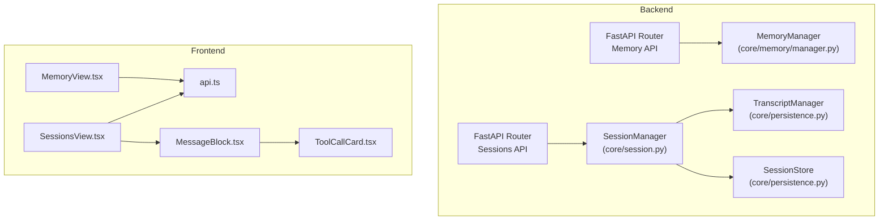
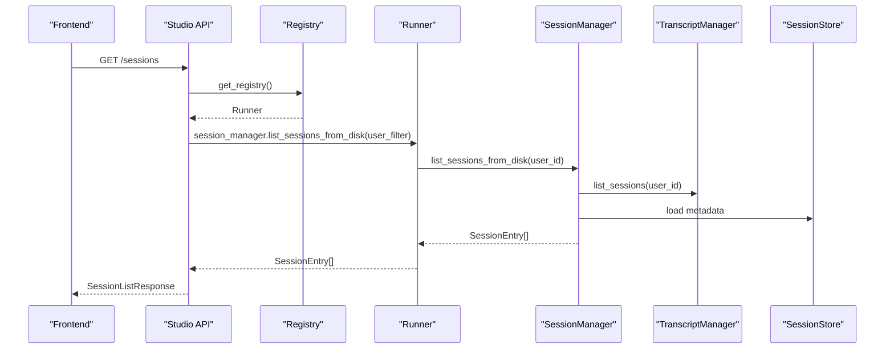
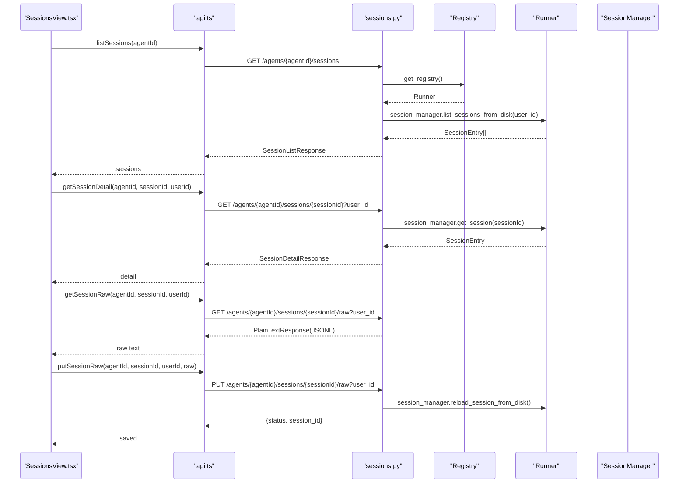
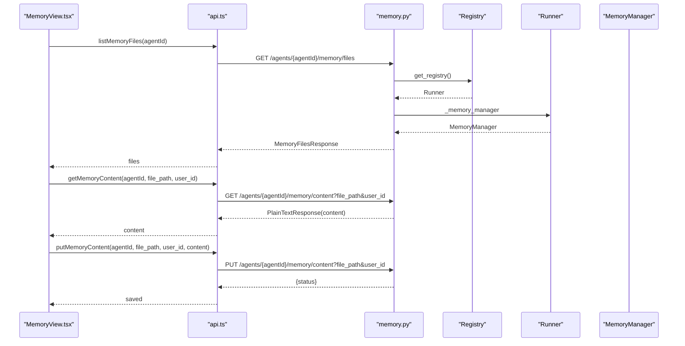
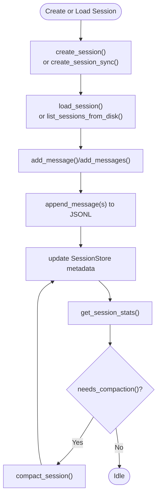
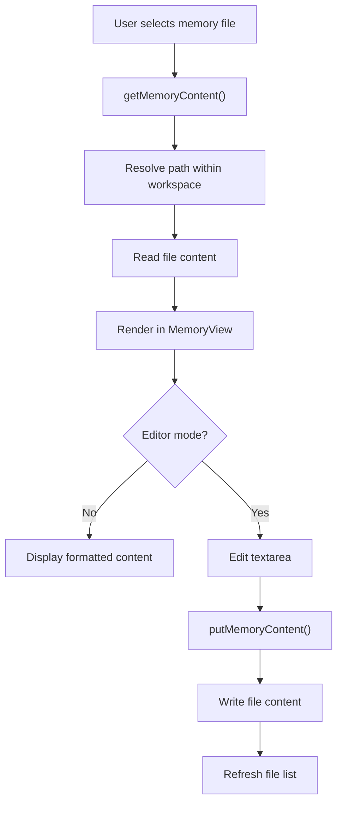
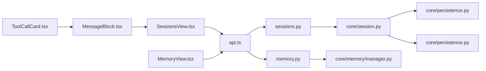

# Session and Memory Monitoring

<cite>
**Referenced Files in This Document**
- [sessions.py](file://src/ark_agentic/studio/api/sessions.py)
- [memory.py](file://src/ark_agentic/studio/api/memory.py)
- [session.py](file://src/ark_agentic/core/session.py)
- [persistence.py](file://src/ark_agentic/core/persistence.py)
- [types.py](file://src/ark_agentic/core/types.py)
- [manager.py](file://src/ark_agentic/core/memory/manager.py)
- [user_profile.py](file://src/ark_agentic/core/memory/user_profile.py)
- [SessionsView.tsx](file://src/ark_agentic/studio/frontend/src/pages/SessionsView.tsx)
- [MemoryView.tsx](file://src/ark_agentic/studio/frontend/src/pages/MemoryView.tsx)
- [api.ts](file://src/ark_agentic/studio/frontend/src/api.ts)
- [MessageBlock.tsx](file://src/ark_agentic/studio/frontend/src/components/MessageBlock.tsx)
- [ToolCallCard.tsx](file://src/ark_agentic/studio/frontend/src/components/ToolCallCard.tsx)
</cite>

## Table of Contents
1. [Introduction](#introduction)
2. [Project Structure](#project-structure)
3. [Core Components](#core-components)
4. [Architecture Overview](#architecture-overview)
5. [Detailed Component Analysis](#detailed-component-analysis)
6. [Dependency Analysis](#dependency-analysis)
7. [Performance Considerations](#performance-considerations)
8. [Troubleshooting Guide](#troubleshooting-guide)
9. [Conclusion](#conclusion)

## Introduction
This document explains the Session and Memory monitoring interfaces used to observe and manage agent conversations and memory states. It covers:
- Session lifecycle management and conversation history viewing
- Memory state inspection and editing
- Real-time monitoring capabilities via the frontend
- APIs for listing, loading, and editing sessions and memory files
- Practical guides for monitoring agent conversations, analyzing memory usage patterns, and troubleshooting session-related issues

## Project Structure
The monitoring stack spans backend APIs, core runtime components, and a React-based frontend:
- Backend APIs expose endpoints for sessions and memory
- Core runtime manages session state, persistence, and memory files
- Frontend provides master-detail views for sessions and memory files, with interactive controls

**Diagram sources**
- [sessions.py:1-200](file://src/ark_agentic/studio/api/sessions.py#L1-L200)
- [memory.py:1-160](file://src/ark_agentic/studio/api/memory.py#L1-L160)
- [session.py:1-482](file://src/ark_agentic/core/session.py#L1-L482)
- [persistence.py:1-783](file://src/ark_agentic/core/persistence.py#L1-L783)
- [manager.py:1-92](file://src/ark_agentic/core/memory/manager.py#L1-L92)
- [SessionsView.tsx:1-304](file://src/ark_agentic/studio/frontend/src/pages/SessionsView.tsx#L1-L304)
- [MemoryView.tsx:1-217](file://src/ark_agentic/studio/frontend/src/pages/MemoryView.tsx#L1-L217)
- [api.ts:1-289](file://src/ark_agentic/studio/frontend/src/api.ts#L1-L289)
- [MessageBlock.tsx:1-93](file://src/ark_agentic/studio/frontend/src/components/MessageBlock.tsx#L1-L93)
- [ToolCallCard.tsx:1-40](file://src/ark_agentic/studio/frontend/src/components/ToolCallCard.tsx#L1-L40)

**Section sources**
- [sessions.py:1-200](file://src/ark_agentic/studio/api/sessions.py#L1-L200)
- [memory.py:1-160](file://src/ark_agentic/studio/api/memory.py#L1-L160)
- [session.py:1-482](file://src/ark_agentic/core/session.py#L1-L482)
- [persistence.py:1-783](file://src/ark_agentic/core/persistence.py#L1-L783)
- [manager.py:1-92](file://src/ark_agentic/core/memory/manager.py#L1-L92)
- [SessionsView.tsx:1-304](file://src/ark_agentic/studio/frontend/src/pages/SessionsView.tsx#L1-L304)
- [MemoryView.tsx:1-217](file://src/ark_agentic/studio/frontend/src/pages/MemoryView.tsx#L1-L217)
- [api.ts:1-289](file://src/ark_agentic/studio/frontend/src/api.ts#L1-L289)
- [MessageBlock.tsx:1-93](file://src/ark_agentic/studio/frontend/src/components/MessageBlock.tsx#L1-L93)
- [ToolCallCard.tsx:1-40](file://src/ark_agentic/studio/frontend/src/components/ToolCallCard.tsx#L1-L40)

## Core Components
- Sessions API: Lists sessions, loads conversation details, and exposes raw JSONL access for editing
- Memory API: Discovers memory files, reads/writes content, and enforces safe path resolution
- SessionManager: Manages session lifecycle, message history, token usage, and compaction
- TranscriptManager and SessionStore: Persist and load session transcripts and metadata
- MemoryManager: Provides workspace-aware memory file access and heading-based upsert semantics
- Frontend Views: Interactive dashboards for browsing sessions and memory files with editing capabilities

**Section sources**
- [sessions.py:84-200](file://src/ark_agentic/studio/api/sessions.py#L84-L200)
- [memory.py:105-160](file://src/ark_agentic/studio/api/memory.py#L105-L160)
- [session.py:24-482](file://src/ark_agentic/core/session.py#L24-L482)
- [persistence.py:388-783](file://src/ark_agentic/core/persistence.py#L388-L783)
- [manager.py:24-92](file://src/ark_agentic/core/memory/manager.py#L24-L92)
- [SessionsView.tsx:55-304](file://src/ark_agentic/studio/frontend/src/pages/SessionsView.tsx#L55-L304)
- [MemoryView.tsx:30-217](file://src/ark_agentic/studio/frontend/src/pages/MemoryView.tsx#L30-L217)

## Architecture Overview
The monitoring architecture integrates backend APIs with core runtime components and a React frontend. The frontend consumes typed APIs to present session and memory data, enabling operators to inspect, analyze, and edit agent interactions and memory content.

**Diagram sources**
- [sessions.py:84-114](file://src/ark_agentic/studio/api/sessions.py#L84-L114)
- [session.py:127-144](file://src/ark_agentic/core/session.py#L127-L144)
- [persistence.py:545-571](file://src/ark_agentic/core/persistence.py#L545-L571)

## Detailed Component Analysis

### Sessions API and Frontend Integration
- Backend endpoints:
  - List sessions per agent (optionally filter by user)
  - Get session detail with messages and state
  - Raw JSONL read/write for admin-level editing
- Frontend:
  - Groups sessions by user, sorts by recency, supports switching tabs between conversation and raw JSONL
  - Renders messages with tool calls, tool results, thinking, and metadata
  - Allows editing raw JSONL and saving back to disk

**Diagram sources**
- [SessionsView.tsx:99-155](file://src/ark_agentic/studio/frontend/src/pages/SessionsView.tsx#L99-L155)
- [api.ts:233-259](file://src/ark_agentic/studio/frontend/src/api.ts#L233-L259)
- [sessions.py:84-200](file://src/ark_agentic/studio/api/sessions.py#L84-L200)
- [session.py:146-182](file://src/ark_agentic/core/session.py#L146-L182)

**Section sources**
- [sessions.py:84-200](file://src/ark_agentic/studio/api/sessions.py#L84-L200)
- [SessionsView.tsx:55-304](file://src/ark_agentic/studio/frontend/src/pages/SessionsView.tsx#L55-L304)
- [api.ts:233-259](file://src/ark_agentic/studio/frontend/src/api.ts#L233-L259)
- [MessageBlock.tsx:11-93](file://src/ark_agentic/studio/frontend/src/components/MessageBlock.tsx#L11-L93)
- [ToolCallCard.tsx:8-40](file://src/ark_agentic/studio/frontend/src/components/ToolCallCard.tsx#L8-L40)

### Memory API and Frontend Integration
- Backend endpoints:
  - List memory files grouped by user and type
  - Read/write memory content with safe path resolution
- Frontend:
  - Lists memory files, groups by user/global, shows sizes and modification times
  - Renders content with markdown-like headings, supports editing and saving

**Diagram sources**
- [MemoryView.tsx:64-107](file://src/ark_agentic/studio/frontend/src/pages/MemoryView.tsx#L64-L107)
- [api.ts:262-286](file://src/ark_agentic/studio/frontend/src/api.ts#L262-L286)
- [memory.py:105-160](file://src/ark_agentic/studio/api/memory.py#L105-L160)
- [manager.py:24-92](file://src/ark_agentic/core/memory/manager.py#L24-L92)

**Section sources**
- [memory.py:105-160](file://src/ark_agentic/studio/api/memory.py#L105-L160)
- [MemoryView.tsx:30-217](file://src/ark_agentic/studio/frontend/src/pages/MemoryView.tsx#L30-L217)
- [api.ts:262-286](file://src/ark_agentic/studio/frontend/src/api.ts#L262-L286)
- [manager.py:24-92](file://src/ark_agentic/core/memory/manager.py#L24-L92)
- [user_profile.py:26-114](file://src/ark_agentic/core/memory/user_profile.py#L26-L114)

### Session Lifecycle Management
SessionManager orchestrates session creation, loading, persistence, and cleanup. It maintains in-memory sessions and synchronizes with disk-backed transcripts and metadata.

**Diagram sources**
- [session.py:40-122](file://src/ark_agentic/core/session.py#L40-L122)
- [session.py:184-227](file://src/ark_agentic/core/session.py#L184-L227)
- [session.py:265-351](file://src/ark_agentic/core/session.py#L265-L351)
- [session.py:383-431](file://src/ark_agentic/core/session.py#L383-L431)
- [persistence.py:388-520](file://src/ark_agentic/core/persistence.py#L388-L520)
- [persistence.py:684-783](file://src/ark_agentic/core/persistence.py#L684-L783)

**Section sources**
- [session.py:24-482](file://src/ark_agentic/core/session.py#L24-L482)
- [persistence.py:388-783](file://src/ark_agentic/core/persistence.py#L388-L783)
- [types.py:342-413](file://src/ark_agentic/core/types.py#L342-L413)

### Memory State Inspection and Editing
MemoryManager provides workspace-aware access to MEMORY.md files. Content is managed via heading-based upsert semantics, enabling targeted updates without rewriting entire files.

**Diagram sources**
- [memory.py:125-159](file://src/ark_agentic/studio/api/memory.py#L125-L159)
- [MemoryView.tsx:73-107](file://src/ark_agentic/studio/frontend/src/pages/MemoryView.tsx#L73-L107)
- [manager.py:37-69](file://src/ark_agentic/core/memory/manager.py#L37-L69)
- [user_profile.py:26-94](file://src/ark_agentic/core/memory/user_profile.py#L26-L94)

**Section sources**
- [memory.py:105-160](file://src/ark_agentic/studio/api/memory.py#L105-L160)
- [manager.py:24-92](file://src/ark_agentic/core/memory/manager.py#L24-L92)
- [user_profile.py:26-114](file://src/ark_agentic/core/memory/user_profile.py#L26-L114)
- [MemoryView.tsx:30-217](file://src/ark_agentic/studio/frontend/src/pages/MemoryView.tsx#L30-L217)

## Dependency Analysis
The frontend depends on typed API clients to interact with backend endpoints. The backend relies on core runtime components for session and memory management.

**Diagram sources**
- [api.ts:194-289](file://src/ark_agentic/studio/frontend/src/api.ts#L194-L289)
- [sessions.py:17-22](file://src/ark_agentic/studio/api/sessions.py#L17-L22)
- [memory.py:17-21](file://src/ark_agentic/studio/api/memory.py#L17-L21)
- [session.py:18-21](file://src/ark_agentic/core/session.py#L18-L21)
- [persistence.py:26-28](file://src/ark_agentic/core/persistence.py#L26-L28)
- [manager.py:13-15](file://src/ark_agentic/core/memory/manager.py#L13-L15)
- [SessionsView.tsx:1-6](file://src/ark_agentic/studio/frontend/src/pages/SessionsView.tsx#L1-L6)
- [MemoryView.tsx:1-5](file://src/ark_agentic/studio/frontend/src/pages/MemoryView.tsx#L1-L5)
- [MessageBlock.tsx:1-4](file://src/ark_agentic/studio/frontend/src/components/MessageBlock.tsx#L1-L4)
- [ToolCallCard.tsx:1-6](file://src/ark_agentic/studio/frontend/src/components/ToolCallCard.tsx#L1-L6)

**Section sources**
- [api.ts:194-289](file://src/ark_agentic/studio/frontend/src/api.ts#L194-L289)
- [sessions.py:17-22](file://src/ark_agentic/studio/api/sessions.py#L17-L22)
- [memory.py:17-21](file://src/ark_agentic/studio/api/memory.py#L17-L21)
- [session.py:18-21](file://src/ark_agentic/core/session.py#L18-L21)
- [persistence.py:26-28](file://src/ark_agentic/core/persistence.py#L26-L28)
- [manager.py:13-15](file://src/ark_agentic/core/memory/manager.py#L13-L15)

## Performance Considerations
- JSONL persistence uses file locks to prevent corruption during concurrent writes; ensure adequate disk throughput for high-volume sessions
- Session metadata caching reduces repeated disk reads for session lists; tune cache TTL for balancing freshness and performance
- Token usage and compaction statistics enable proactive trimming of long histories to maintain model context limits
- Memory file operations are lightweight; avoid excessive concurrent edits to reduce contention

[No sources needed since this section provides general guidance]

## Troubleshooting Guide
Common issues and resolutions:
- Session not found
  - Verify agent_id and session_id correctness; ensure user_id matches ownership
  - Confirm persistence is enabled and session files exist on disk
- Raw JSONL validation errors
  - Ensure the first line is a valid session header and subsequent lines are message entries
  - Match session header id with the requested session_id
- Memory file not found
  - Confirm file_path is within the agent’s workspace and not attempting path traversal
  - Check user_id scope for user-specific files
- Permission denied for memory editing
  - Only editors can modify memory content; verify role permissions
- Session detail fails to load
  - Check that the session exists and is readable; confirm transcript integrity

**Section sources**
- [sessions.py:126-136](file://src/ark_agentic/studio/api/sessions.py#L126-L136)
- [sessions.py:160-166](file://src/ark_agentic/studio/api/sessions.py#L160-L166)
- [sessions.py:186-199](file://src/ark_agentic/studio/api/sessions.py#L186-L199)
- [memory.py:132-139](file://src/ark_agentic/studio/api/memory.py#L132-L139)
- [memory.py:149-158](file://src/ark_agentic/studio/api/memory.py#L149-L158)
- [persistence.py:594-631](file://src/ark_agentic/core/persistence.py#L594-L631)

## Conclusion
The Session and Memory monitoring interfaces provide a robust foundation for observing and managing agent interactions and memory states. The backend APIs offer precise control over session and memory operations, while the frontend delivers intuitive dashboards for real-time inspection and editing. By leveraging session lifecycle hooks, persistence mechanisms, and memory upsert semantics, operators can effectively monitor, analyze, and troubleshoot agent behavior.