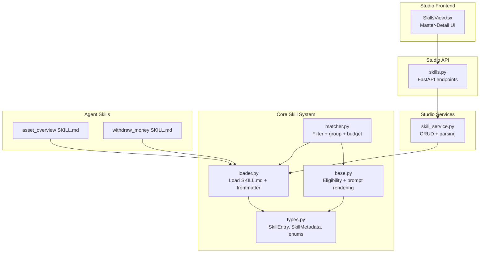
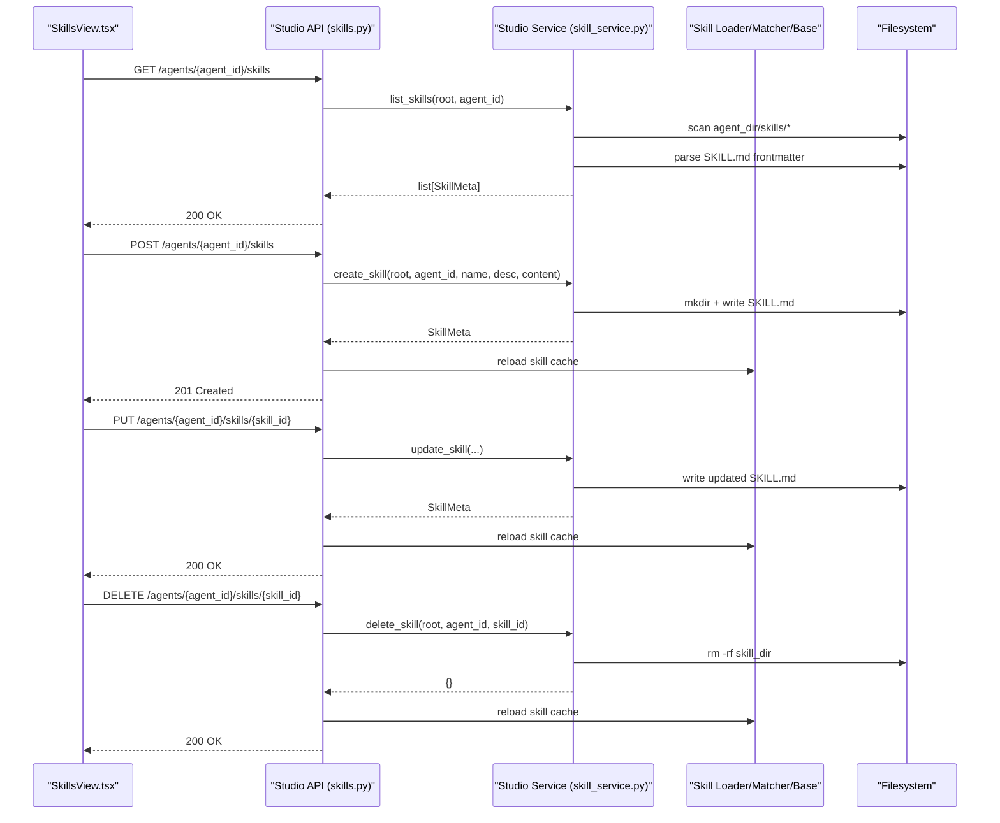
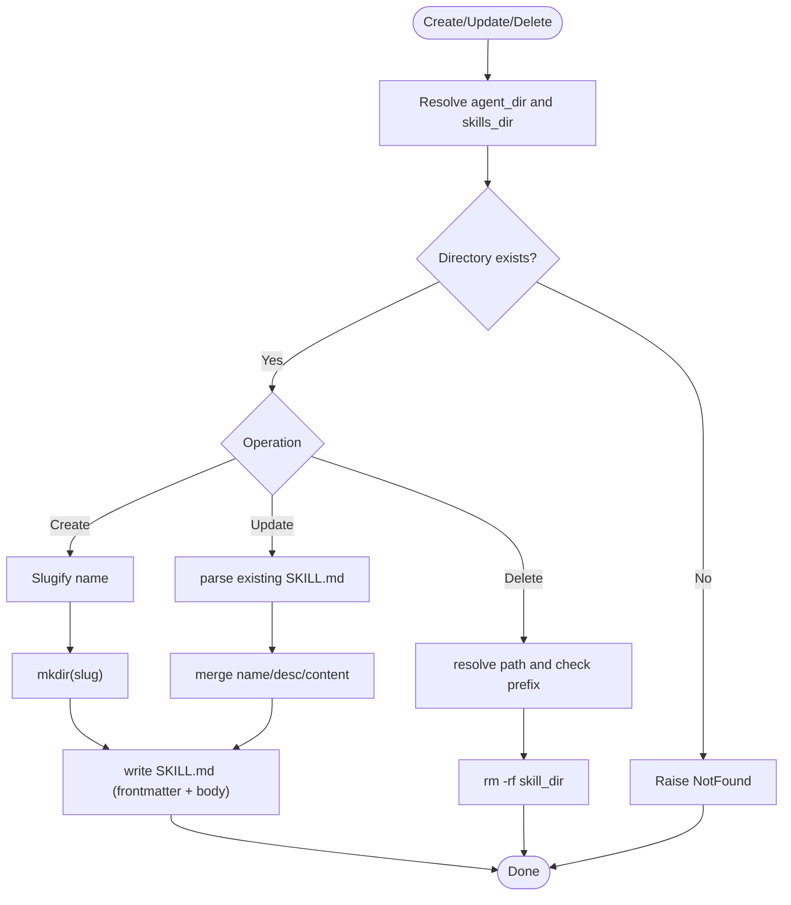
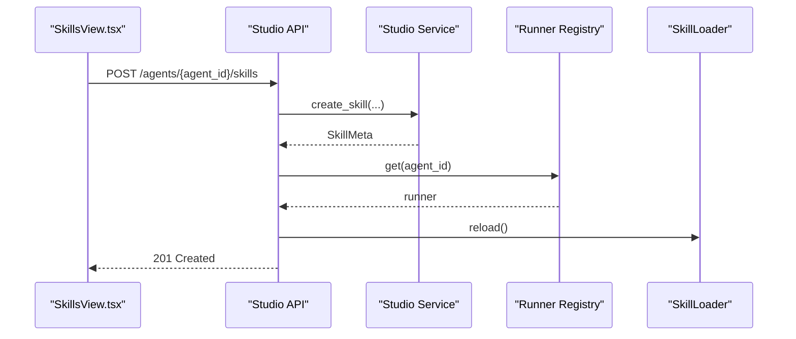
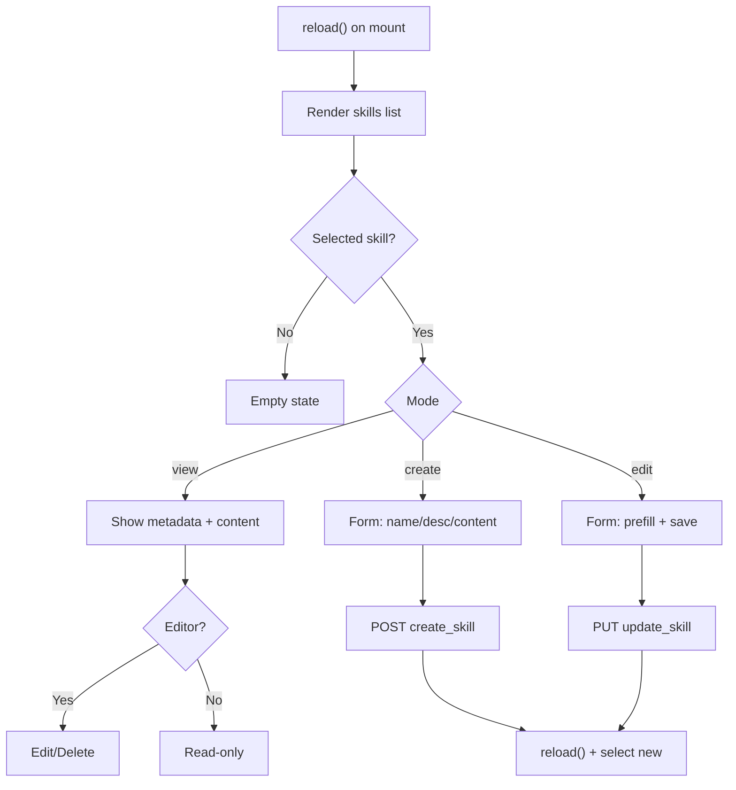
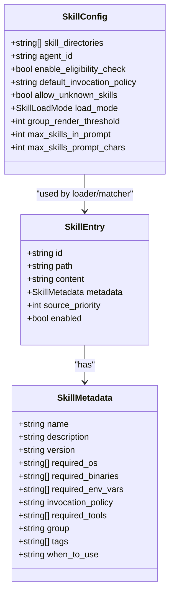
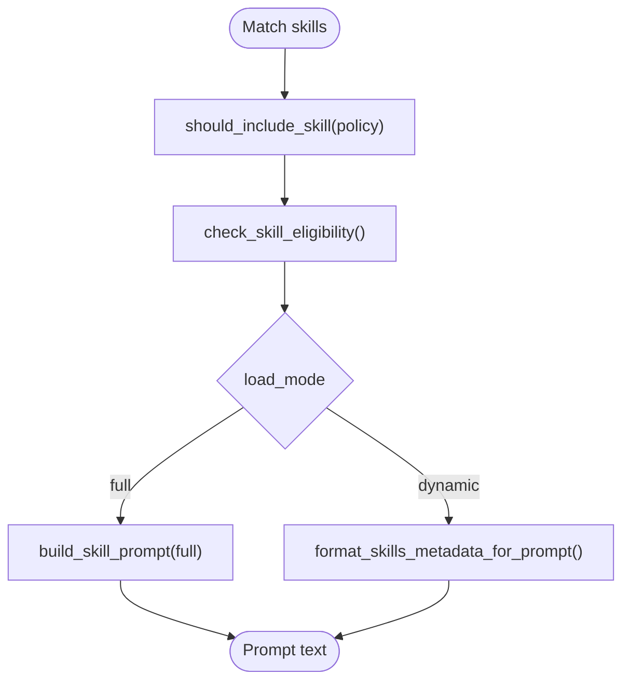
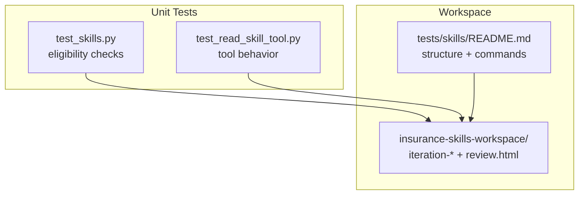
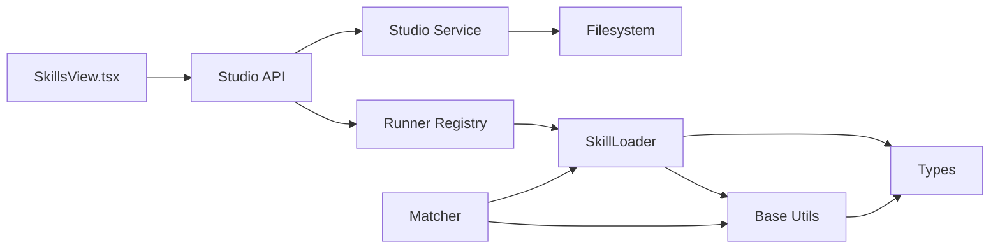

# Skill Management Interface

<cite>
**Referenced Files in This Document**
- [skill_service.py](file://src/ark_agentic/studio/services/skill_service.py)
- [skills.py](file://src/ark_agentic/studio/api/skills.py)
- [SkillsView.tsx](file://src/ark_agentic/studio/frontend/src/pages/SkillsView.tsx)
- [base.py](file://src/ark_agentic/core/skills/base.py)
- [loader.py](file://src/ark_agentic/core/skills/loader.py)
- [matcher.py](file://src/ark_agentic/core/skills/matcher.py)
- [types.py](file://src/ark_agentic/core/types.py)
- [asset_overview SKILL.md](file://src/ark_agentic/agents/securities/skills/asset_overview/SKILL.md)
- [withdraw_money SKILL.md](file://src/ark_agentic/agents/insurance/skills/withdraw_money/SKILL.md)
- [test_skills.py](file://tests/unit/core/test_skills.py)
- [test_read_skill_tool.py](file://tests/unit/core/test_read_skill_tool.py)
- [README.md](file://tests/skills/README.md)
</cite>

## Table of Contents
1. [Introduction](#introduction)
2. [Project Structure](#project-structure)
3. [Core Components](#core-components)
4. [Architecture Overview](#architecture-overview)
5. [Detailed Component Analysis](#detailed-component-analysis)
6. [Dependency Analysis](#dependency-analysis)
7. [Performance Considerations](#performance-considerations)
8. [Troubleshooting Guide](#troubleshooting-guide)
9. [Conclusion](#conclusion)
10. [Appendices](#appendices)

## Introduction
This document describes the Skill Management Interface for the Ark Agentic platform. It covers how skills are visualized, configured, tested, and integrated into the agent ecosystem. The skill lifecycle spans creation, metadata management, parameter configuration via frontmatter, runtime loading and matching, testing and evaluation, and deployment within agents. The interface consists of:
- Backend services for CRUD operations and parsing skill metadata
- API endpoints that expose skill management to the Studio frontend
- A React-based UI for viewing, editing, and deleting skills
- Core skill systems for loading, eligibility checking, matching, and rendering prompts
- Testing and evaluation frameworks for validating skill functionality

## Project Structure
The Skill Management Interface spans backend services, API endpoints, frontend UI, and core skill infrastructure:

**Diagram sources**
- [SkillsView.tsx:1-267](file://src/ark_agentic/studio/frontend/src/pages/SkillsView.tsx#L1-L267)
- [skills.py:1-113](file://src/ark_agentic/studio/api/skills.py#L1-L113)
- [skill_service.py:1-289](file://src/ark_agentic/studio/services/skill_service.py#L1-L289)
- [loader.py:1-177](file://src/ark_agentic/core/skills/loader.py#L1-L177)
- [base.py:1-325](file://src/ark_agentic/core/skills/base.py#L1-L325)
- [matcher.py:1-152](file://src/ark_agentic/core/skills/matcher.py#L1-L152)
- [types.py:1-413](file://src/ark_agentic/core/types.py#L1-L413)
- [asset_overview SKILL.md:1-186](file://src/ark_agentic/agents/securities/skills/asset_overview/SKILL.md#L1-L186)
- [withdraw_money SKILL.md:1-270](file://src/ark_agentic/agents/insurance/skills/withdraw_money/SKILL.md#L1-L270)

**Section sources**
- [SkillsView.tsx:1-267](file://src/ark_agentic/studio/frontend/src/pages/SkillsView.tsx#L1-L267)
- [skills.py:1-113](file://src/ark_agentic/studio/api/skills.py#L1-L113)
- [skill_service.py:1-289](file://src/ark_agentic/studio/services/skill_service.py#L1-L289)
- [loader.py:1-177](file://src/ark_agentic/core/skills/loader.py#L1-L177)
- [base.py:1-325](file://src/ark_agentic/core/skills/base.py#L1-L325)
- [matcher.py:1-152](file://src/ark_agentic/core/skills/matcher.py#L1-L152)
- [types.py:1-413](file://src/ark_agentic/core/types.py#L1-L413)

## Core Components
- Studio Services: Provide CRUD operations for skills and parse metadata from SKILL.md files. They operate independently of HTTP and can be reused by endpoints and tools.
- Studio API: Thin HTTP layer exposing endpoints to list, create, update, and delete skills for a given agent. It triggers skill cache reload after mutations.
- Studio Frontend: Master-detail UI for browsing skills, viewing metadata and content, and editing skill frontmatter and body.
- Core Skill Loader: Loads SKILL.md files from configured directories, parses YAML frontmatter, constructs SkillEntry objects, and resolves global skill IDs.
- Skill Eligibility and Matching: Filters skills by invocation policy and environment/tool requirements, then groups them for prompt injection or metadata-only presentation.
- Prompt Rendering: Formats skills for either full-injection or metadata-only modes, with budget controls and grouping thresholds.
- Types: Defines SkillEntry, SkillMetadata, enums for load modes and tool result types, and related structures.

**Section sources**
- [skill_service.py:42-183](file://src/ark_agentic/studio/services/skill_service.py#L42-L183)
- [skills.py:57-112](file://src/ark_agentic/studio/api/skills.py#L57-L112)
- [SkillsView.tsx:9-267](file://src/ark_agentic/studio/frontend/src/pages/SkillsView.tsx#L9-L267)
- [loader.py:25-171](file://src/ark_agentic/core/skills/loader.py#L25-L171)
- [base.py:19-325](file://src/ark_agentic/core/skills/base.py#L19-L325)
- [matcher.py:27-152](file://src/ark_agentic/core/skills/matcher.py#L27-L152)
- [types.py:234-289](file://src/ark_agentic/core/types.py#L234-L289)

## Architecture Overview
The skill lifecycle integrates frontend, backend, and core systems:

**Diagram sources**
- [SkillsView.tsx:30-90](file://src/ark_agentic/studio/frontend/src/pages/SkillsView.tsx#L30-L90)
- [skills.py:57-112](file://src/ark_agentic/studio/api/skills.py#L57-L112)
- [skill_service.py:42-183](file://src/ark_agentic/studio/services/skill_service.py#L42-L183)
- [loader.py:168-171](file://src/ark_agentic/core/skills/loader.py#L168-L171)

## Detailed Component Analysis

### Studio Services: Skill CRUD and Parsing
- list_skills: Scans agent’s skills directory, parses SKILL.md, and returns SkillMeta list.
- create_skill: Validates name, ensures agent directory exists, slugifies name, creates directory and SKILL.md with YAML frontmatter and optional body.
- update_skill: Reads existing frontmatter, merges updates, preserves body unless full replacement is provided, writes updated SKILL.md.
- delete_skill: Removes skill directory with safety checks against path traversal.
- Helper functions: generate_skill_md, slugify, parse_skill_dir, extract_body.

**Diagram sources**
- [skill_service.py:42-183](file://src/ark_agentic/studio/services/skill_service.py#L42-L183)

**Section sources**
- [skill_service.py:42-183](file://src/ark_agentic/studio/services/skill_service.py#L42-L183)

### Studio API: Thin HTTP Layer
- Endpoints:
  - GET /agents/{agent_id}/skills → list_skills
  - POST /agents/{agent_id}/skills → create_skill
  - PUT /agents/{agent_id}/skills/{skill_id} → update_skill
  - DELETE /agents/{agent_id}/skills/{skill_id} → delete_skill
- After mutation, triggers runner.skill_loader.reload to refresh cached skills.

**Diagram sources**
- [skills.py:44-53](file://src/ark_agentic/studio/api/skills.py#L44-L53)
- [skills.py:68-98](file://src/ark_agentic/studio/api/skills.py#L68-L98)

**Section sources**
- [skills.py:57-112](file://src/ark_agentic/studio/api/skills.py#L57-L112)

### Studio Frontend: SkillsView
- Modes: view, create, edit
- Features:
  - List skills with selection
  - Create/edit form for name, description, content
  - View metadata (id, version, policy, group, tags, file_path)
  - View prompt guidelines (SKILL.md body)
  - Delete confirmation dialog
  - Toast notifications and error handling

**Diagram sources**
- [SkillsView.tsx:30-90](file://src/ark_agentic/studio/frontend/src/pages/SkillsView.tsx#L30-L90)

**Section sources**
- [SkillsView.tsx:9-267](file://src/ark_agentic/studio/frontend/src/pages/SkillsView.tsx#L9-L267)

### Core Skill Loader and Metadata
- SkillLoader loads SKILL.md from configured directories, supports frontmatter parsing, and resolves global skill IDs.
- SkillMetadata fields include name, description, version, required_os/binaries/env_vars, invocation_policy, required_tools, group, tags, and when_to_use.
- Eligibility checks: OS, binaries, environment variables, and required tools availability.
- Matching: Filters by policy (auto/manual/always), applies eligibility, and decides full-inject vs metadata-only based on load mode.

**Diagram sources**
- [types.py:234-289](file://src/ark_agentic/core/types.py#L234-L289)
- [loader.py:25-171](file://src/ark_agentic/core/skills/loader.py#L25-L171)
- [base.py:19-50](file://src/ark_agentic/core/skills/base.py#L19-L50)

**Section sources**
- [loader.py:25-171](file://src/ark_agentic/core/skills/loader.py#L25-L171)
- [base.py:51-138](file://src/ark_agentic/core/skills/base.py#L51-L138)
- [types.py:234-289](file://src/ark_agentic/core/types.py#L234-L289)

### Prompt Rendering and Budget Controls
- Two modes:
  - full: Injects full skill bodies into system prompt
  - dynamic: Injects only metadata and uses read_skill to fetch bodies on demand
- Budget controls: Cap by count and character length; adaptive grouping when exceeding threshold.
- Eligibility and inclusion filters applied before budgeting.

**Diagram sources**
- [matcher.py:64-126](file://src/ark_agentic/core/skills/matcher.py#L64-L126)
- [base.py:245-325](file://src/ark_agentic/core/skills/base.py#L245-L325)

**Section sources**
- [matcher.py:64-136](file://src/ark_agentic/core/skills/matcher.py#L64-L136)
- [base.py:245-325](file://src/ark_agentic/core/skills/base.py#L245-L325)

### Skill Examples and Metadata Patterns
- Securities asset overview skill demonstrates:
  - YAML frontmatter with name, description, version, invocation_policy, group, tags, required_tools
  - Rich instruction body with structured steps, routing boundaries, tool contracts, and output strategies
- Insurance withdraw money skill demonstrates:
  - A2UI-driven UI composition with component blocks
  - Case-based execution flows (overview, specific plan, adjustment)
  - Strict output constraints requiring render_a2ui

These examples illustrate how frontmatter drives runtime behavior and how skills define their own operational contracts.

**Section sources**
- [asset_overview SKILL.md:1-186](file://src/ark_agentic/agents/securities/skills/asset_overview/SKILL.md#L1-L186)
- [withdraw_money SKILL.md:1-270](file://src/ark_agentic/agents/insurance/skills/withdraw_money/SKILL.md#L1-L270)

### Testing Interfaces and Evaluation
- Unit tests validate:
  - Skill eligibility checks under various conditions
  - read_skill tool behavior for valid/invalid/nonexistent IDs
- E2E workspace for skill evaluations:
  - Separate test assets under tests/skills
  - Iterative runs with with_skill and without_skill comparisons
  - Static HTML viewer generation for evaluation reports

**Diagram sources**
- [test_skills.py:45-87](file://tests/unit/core/test_skills.py#L45-L87)
- [test_read_skill_tool.py:39-68](file://tests/unit/core/test_read_skill_tool.py#L39-L68)
- [README.md:1-28](file://tests/skills/README.md#L1-L28)

**Section sources**
- [test_skills.py:45-87](file://tests/unit/core/test_skills.py#L45-L87)
- [test_read_skill_tool.py:39-68](file://tests/unit/core/test_read_skill_tool.py#L39-L68)
- [README.md:1-28](file://tests/skills/README.md#L1-L28)

## Dependency Analysis
- Frontend depends on Studio API for CRUD operations.
- Studio API depends on Studio Services for business logic and on the Runner Registry to trigger cache reloads.
- Studio Services depend on filesystem and YAML parsing; they also rely on core types for SkillEntry/SkillMetadata.
- Core loader/matcher depend on types and base utilities for eligibility and rendering.
- Agent skills (SKILL.md) are consumed by the loader and influence runtime behavior via frontmatter.

**Diagram sources**
- [SkillsView.tsx:30-90](file://src/ark_agentic/studio/frontend/src/pages/SkillsView.tsx#L30-L90)
- [skills.py:44-53](file://src/ark_agentic/studio/api/skills.py#L44-L53)
- [skill_service.py:42-183](file://src/ark_agentic/studio/services/skill_service.py#L42-L183)
- [loader.py:25-171](file://src/ark_agentic/core/skills/loader.py#L25-L171)
- [base.py:19-50](file://src/ark_agentic/core/skills/base.py#L19-L50)
- [matcher.py:55-152](file://src/ark_agentic/core/skills/matcher.py#L55-L152)
- [types.py:234-289](file://src/ark_agentic/core/types.py#L234-L289)

**Section sources**
- [skills.py:44-53](file://src/ark_agentic/studio/api/skills.py#L44-L53)
- [loader.py:25-171](file://src/ark_agentic/core/skills/loader.py#L25-L171)
- [matcher.py:55-152](file://src/ark_agentic/core/skills/matcher.py#L55-L152)
- [base.py:19-50](file://src/ark_agentic/core/skills/base.py#L19-L50)
- [types.py:234-289](file://src/ark_agentic/core/types.py#L234-L289)

## Performance Considerations
- Budget-aware rendering: Limit number of skills and total prompt characters; truncate and warn when exceeded.
- Adaptive grouping: Switch from flat to grouped XML when exceeding threshold to reduce redundancy.
- Dynamic mode: Prefer metadata-only injection to minimize token usage and improve latency.
- Eligibility filtering: Reduce candidate pool early to avoid unnecessary processing.
- Cache reload: After mutations, reload skill cache to avoid stale state.

[No sources needed since this section provides general guidance]

## Troubleshooting Guide
Common issues and resolutions:
- Agent not found: Ensure agent_id exists and agent_dir/skills exists; endpoints raise 404 accordingly.
- Skill already exists: Creation fails if slug conflicts; choose a different name.
- Skill not found: Update/delete raises 404 if skill_id does not exist.
- Path traversal: Deletion validates directory path to prevent unsafe removal.
- Eligibility failures: Skills may be excluded if required OS/binaries/env_vars/tools are missing; adjust environment or frontmatter.
- Tool read failures: The read_skill tool returns clear error messages for unknown or invalid IDs.

**Section sources**
- [skills.py:63-111](file://src/ark_agentic/studio/api/skills.py#L63-L111)
- [skill_service.py:46-182](file://src/ark_agentic/studio/services/skill_service.py#L46-L182)
- [base.py:51-101](file://src/ark_agentic/core/skills/base.py#L51-L101)
- [test_read_skill_tool.py:55-68](file://tests/unit/core/test_read_skill_tool.py#L55-L68)

## Conclusion
The Skill Management Interface provides a cohesive workflow for creating, configuring, visualizing, and managing skills within the agent ecosystem. The backend services and API offer robust CRUD operations with safe filesystem handling and cache synchronization. The frontend delivers an intuitive master-detail interface for authoring skills. The core skill system enforces eligibility, supports flexible matching and rendering modes, and integrates tightly with agent runtime. Comprehensive testing and evaluation facilities support continuous validation and improvement of skills.

[No sources needed since this section summarizes without analyzing specific files]

## Appendices

### Practical Guides

- Developing a new skill
  - Use the Studio UI to create a new skill; provide name and description; optionally include initial content.
  - Define YAML frontmatter in SKILL.md with name, description, version, invocation_policy, group, tags, and required_tools.
  - Add detailed instructions, routing rules, tool contracts, and output strategies in the body.

- Configuring skill parameters
  - Use frontmatter fields to control environment requirements (required_os, required_binaries, required_env_vars), invocation policy (auto/manual/always), grouping (group), tagging (tags), and tool dependencies (required_tools).
  - Adjust load mode and budget thresholds in SkillConfig to optimize performance and prompt size.

- Validating skill functionality
  - Run unit tests to verify eligibility checks and tool behavior.
  - Use the evaluation workspace to compare runs with and without the skill and generate reports via the static viewer.

**Section sources**
- [SkillsView.tsx:40-89](file://src/ark_agentic/studio/frontend/src/pages/SkillsView.tsx#L40-L89)
- [asset_overview SKILL.md:1-186](file://src/ark_agentic/agents/securities/skills/asset_overview/SKILL.md#L1-L186)
- [withdraw_money SKILL.md:1-270](file://src/ark_agentic/agents/insurance/skills/withdraw_money/SKILL.md#L1-L270)
- [test_skills.py:45-87](file://tests/unit/core/test_skills.py#L45-L87)
- [README.md:1-28](file://tests/skills/README.md#L1-L28)