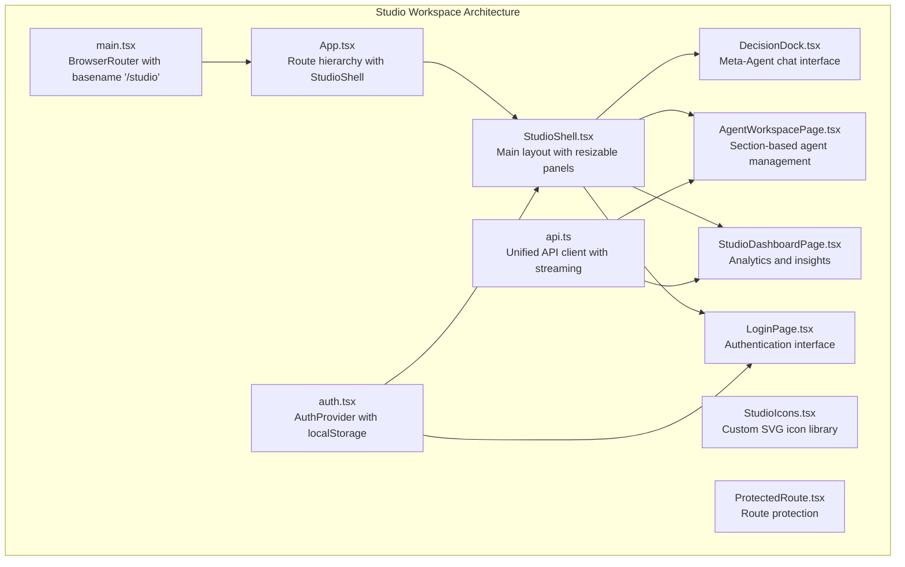
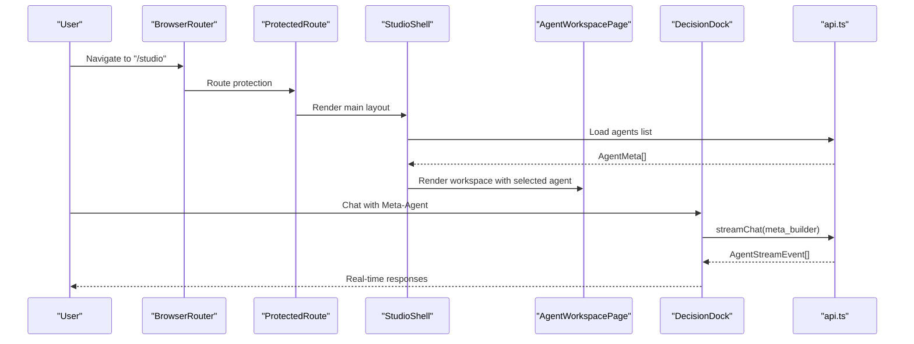
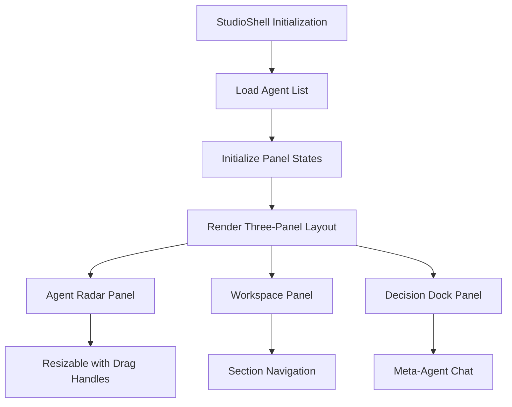
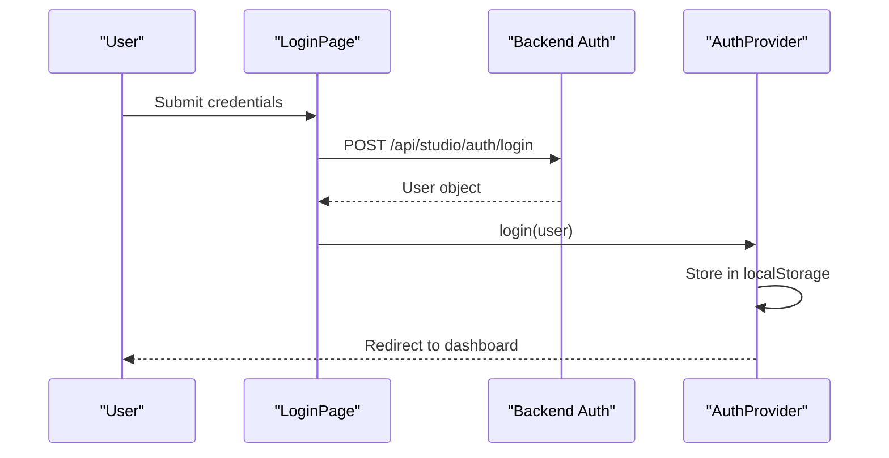
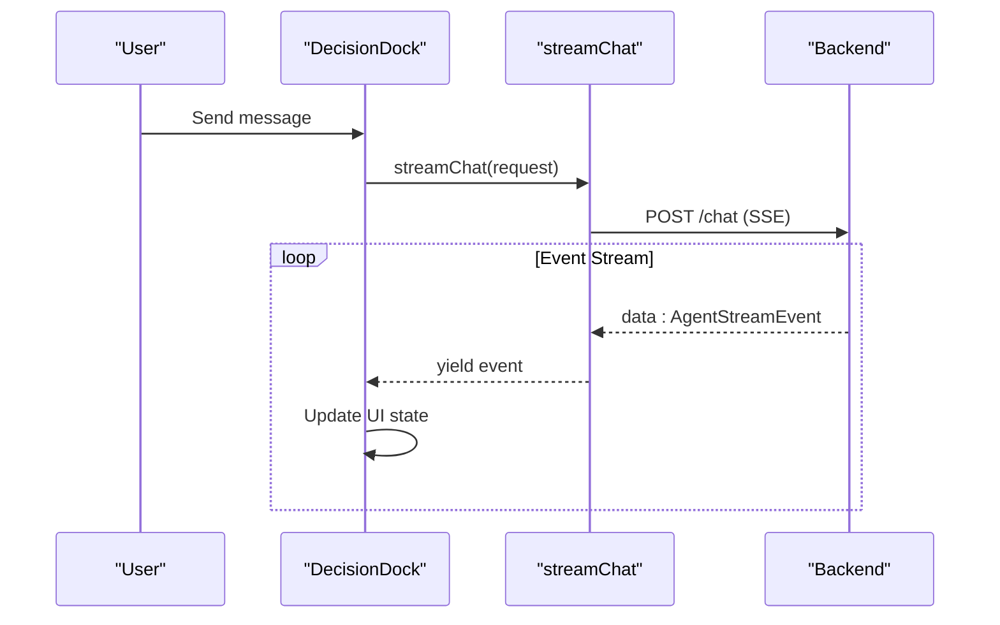
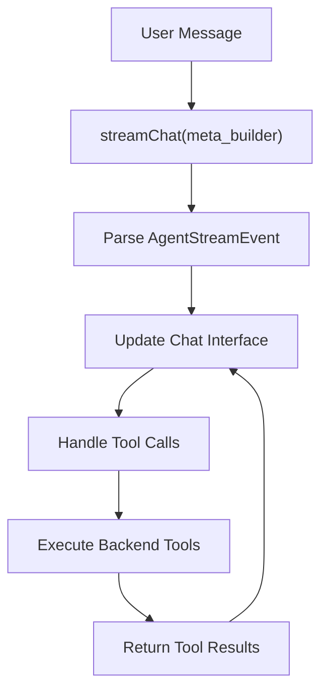

# Studio Interface

<cite>
**Referenced Files in This Document**
- [App.tsx](file://src/ark_agentic/studio/frontend/src/App.tsx)
- [main.tsx](file://src/ark_agentic/studio/frontend/src/main.tsx)
- [StudioShell.tsx](file://src/ark_agentic/studio/frontend/src/layouts/StudioShell.tsx)
- [DecisionDock.tsx](file://src/ark_agentic/studio/frontend/src/components/DecisionDock.tsx)
- [StudioIcons.tsx](file://src/ark_agentic/studio/frontend/src/components/StudioIcons.tsx)
- [AgentWorkspacePage.tsx](file://src/ark_agentic/studio/frontend/src/pages/AgentWorkspacePage.tsx)
- [StudioDashboardPage.tsx](file://src/ark_agentic/studio/frontend/src/pages/StudioDashboardPage.tsx)
- [LoginPage.tsx](file://src/ark_agentic/studio/frontend/src/pages/LoginPage.tsx)
- [auth.tsx](file://src/ark_agentic/studio/frontend/src/auth.tsx)
- [api.ts](file://src/ark_agentic/studio/frontend/src/api.ts)
- [ProtectedRoute.tsx](file://src/ark_agentic/studio/frontend/src/components/ProtectedRoute.tsx)
</cite>

## Update Summary
**Changes Made**
- Updated architecture to reflect new workspace-centric design with StudioShell as main layout
- Added comprehensive documentation for DecisionDock meta-agent chat interface
- Documented new AgentWorkspacePage with split-pane navigation and section-based routing
- Enhanced dashboard with advanced analytics and visualization components
- Updated authentication and routing structure with improved localization support
- Added new icon system and responsive workspace layout

## Table of Contents
1. [Introduction](#introduction)
2. [Project Structure](#project-structure)
3. [Core Components](#core-components)
4. [Architecture Overview](#architecture-overview)
5. [Detailed Component Analysis](#detailed-component-analysis)
6. [Enhanced Workspace Architecture](#enhanced-workspace-architecture)
7. [DecisionDock Meta-Agent Interface](#decisiondock-meta-agent-interface)
8. [Agent Workspace Navigation](#agent-workspace-navigation)
9. [Dashboard Analytics and Insights](#dashboard-analytics-and-insights)
10. [Authentication and Access Control](#authentication-and-access-control)
11. [Real-Time Updates and Streaming](#real-time-updates-and-streaming)
12. [Localization and Internationalization](#localization-and-internationalization)
13. [Performance Considerations](#performance-considerations)
14. [Troubleshooting Guide](#troubleshooting-guide)
15. [Conclusion](#conclusion)
16. [Appendices](#appendices)

## Introduction
This document describes the Studio management interface for developing and operating agents within the Ark-Agentic platform. The Studio interface has undergone a comprehensive UI redesign featuring a new workspace architecture with enhanced navigation, improved localization support, and powerful meta-agent capabilities through the DecisionDock system. The interface now provides a unified control panel for managing agents, skills, tools, sessions, and memory with advanced visualization and debugging capabilities.

## Project Structure
The Studio frontend is a modern React application built with TypeScript and Vite, featuring a workspace-centric architecture. The new structure emphasizes agent-focused workflows with a collapsible agent radar, resizable decision dock, and section-based navigation.

**Diagram sources**
- [main.tsx:1-17](file://src/ark_agentic/studio/frontend/src/main.tsx#L1-L17)
- [App.tsx:1-22](file://src/ark_agentic/studio/frontend/src/App.tsx#L1-L22)
- [StudioShell.tsx:1-310](file://src/ark_agentic/studio/frontend/src/layouts/StudioShell.tsx#L1-L310)
- [DecisionDock.tsx:1-334](file://src/ark_agentic/studio/frontend/src/components/DecisionDock.tsx#L1-L334)
- [AgentWorkspacePage.tsx:1-800](file://src/ark_agentic/studio/frontend/src/pages/AgentWorkspacePage.tsx#L1-L800)
- [StudioDashboardPage.tsx:1-803](file://src/ark_agentic/studio/frontend/src/pages/StudioDashboardPage.tsx#L1-L803)
- [LoginPage.tsx:1-112](file://src/ark_agentic/studio/frontend/src/pages/LoginPage.tsx#L1-L112)
- [auth.tsx:1-53](file://src/ark_agentic/studio/frontend/src/auth.tsx#L1-L53)
- [api.ts:1-290](file://src/ark_agentic/studio/frontend/src/api.ts#L1-L290)
- [StudioIcons.tsx:1-221](file://src/ark_agentic/studio/frontend/src/components/StudioIcons.tsx#L1-L221)

**Section sources**
- [main.tsx:1-17](file://src/ark_agentic/studio/frontend/src/main.tsx#L1-L17)
- [App.tsx:1-22](file://src/ark_agentic/studio/frontend/src/App.tsx#L1-L22)
- [StudioShell.tsx:1-310](file://src/ark_agentic/studio/frontend/src/layouts/StudioShell.tsx#L1-L310)

## Core Components
- **StudioShell**: Main workspace layout with resizable panels, agent radar, and decision dock
- **DecisionDock**: Meta-Agent chat interface for creating skills, tools, and agents
- **AgentWorkspacePage**: Section-based agent management with overview, skills, tools, sessions, and memory
- **StudioDashboardPage**: Advanced analytics dashboard with metrics, distributions, and insights
- **StudioIcons**: Comprehensive SVG icon library for consistent UI elements
- **Enhanced API client**: Unified interface for all backend operations with streaming support

**Section sources**
- [StudioShell.tsx:1-310](file://src/ark_agentic/studio/frontend/src/layouts/StudioShell.tsx#L1-L310)
- [DecisionDock.tsx:1-334](file://src/ark_agentic/studio/frontend/src/components/DecisionDock.tsx#L1-L334)
- [AgentWorkspacePage.tsx:1-800](file://src/ark_agentic/studio/frontend/src/pages/AgentWorkspacePage.tsx#L1-L800)
- [StudioDashboardPage.tsx:1-803](file://src/ark_agentic/studio/frontend/src/pages/StudioDashboardPage.tsx#L1-L803)
- [StudioIcons.tsx:1-221](file://src/ark_agentic/studio/frontend/src/components/StudioIcons.tsx#L1-L221)
- [api.ts:1-290](file://src/ark_agentic/studio/frontend/src/api.ts#L1-L290)

## Architecture Overview
The Studio interface follows a workspace-centric architecture with three main panels: agent radar (left), workspace (center), and decision dock (right). The architecture emphasizes agent-focused workflows with real-time collaboration capabilities through the meta-agent system.

**Diagram sources**
- [App.tsx:1-22](file://src/ark_agentic/studio/frontend/src/App.tsx#L1-L22)
- [StudioShell.tsx:54-69](file://src/ark_agentic/studio/frontend/src/layouts/StudioShell.tsx#L54-L69)
- [DecisionDock.tsx:107-212](file://src/ark_agentic/studio/frontend/src/components/DecisionDock.tsx#L107-L212)
- [api.ts:59-97](file://src/ark_agentic/studio/frontend/src/api.ts#L59-L97)

## Detailed Component Analysis

### Enhanced Workspace Architecture
The StudioShell serves as the main workspace container with resizable panels and intelligent agent management. It implements a three-panel layout with configurable widths and responsive behavior.

**Key Features:**
- **Resizable Panels**: Agent radar and decision dock with drag handles for width adjustment
- **Agent Radar**: Collapsible sidebar with search, refresh, and agent selection
- **Decision Dock**: Right-side meta-agent chat panel with session management
- **Workspace Area**: Central content area with section-based navigation
- **Responsive Design**: Dynamic panel visibility and layout adaptation

**Diagram sources**
- [StudioShell.tsx:38-103](file://src/ark_agentic/studio/frontend/src/layouts/StudioShell.tsx#L38-L103)
- [StudioShell.tsx:174-295](file://src/ark_agentic/studio/frontend/src/layouts/StudioShell.tsx#L174-L295)

**Section sources**
- [StudioShell.tsx:1-310](file://src/ark_agentic/studio/frontend/src/layouts/StudioShell.tsx#L1-L310)

### Authentication and Access Control
The authentication system uses localStorage for persistent user sessions with role-based access control. The system supports both editor and viewer roles with appropriate UI restrictions.

**Authentication Flow:**
- User credentials validated against backend
- User object stored in localStorage with automatic session restoration
- Role-based UI rendering (editor vs viewer)
- ProtectedRoute wrapper ensures unauthorized access prevention

**Diagram sources**
- [LoginPage.tsx:16-41](file://src/ark_agentic/studio/frontend/src/pages/LoginPage.tsx#L16-L41)
- [auth.tsx:31-39](file://src/ark_agentic/studio/frontend/src/auth.tsx#L31-L39)

**Section sources**
- [auth.tsx:1-53](file://src/ark_agentic/studio/frontend/src/auth.tsx#L1-L53)
- [LoginPage.tsx:1-112](file://src/ark_agentic/studio/frontend/src/pages/LoginPage.tsx#L1-L112)

### Real-Time Updates and Streaming
The API client provides comprehensive streaming support for real-time interactions, particularly for the meta-agent chat system. The streaming implementation handles Server-Sent Events with proper error handling and connection management.

**Streaming Features:**
- Async generator interface for event-driven communication
- Support for text deltas, tool call lifecycle, and run lifecycle events
- Automatic session ID management for chat continuity
- Robust error handling with user-friendly error messages

**Diagram sources**
- [DecisionDock.tsx:107-212](file://src/ark_agentic/studio/frontend/src/components/DecisionDock.tsx#L107-L212)
- [api.ts:59-97](file://src/ark_agentic/studio/frontend/src/api.ts#L59-L97)

**Section sources**
- [api.ts:1-290](file://src/ark_agentic/studio/frontend/src/api.ts#L1-L290)
- [DecisionDock.tsx:1-334](file://src/ark_agentic/studio/frontend/src/components/DecisionDock.tsx#L1-L334)

## Enhanced Workspace Architecture

### StudioShell Layout System
The StudioShell component implements a sophisticated three-panel layout system with dynamic resizing and responsive behavior. The layout adapts to different screen sizes and user preferences while maintaining optimal workspace ergonomics.

**Layout Configuration:**
- **Agent Radar**: Primary navigation sidebar with agent listing and search
- **Workspace**: Central content area with section-based navigation
- **Decision Dock**: Secondary panel for meta-agent interactions
- **Global Rail**: Vertical navigation for main sections and agent radar toggle

**Panel Management:**
- Configurable minimum and maximum widths for each panel
- Smooth resizing with visual feedback during drag operations
- Persistent panel states across browser sessions
- Adaptive layout for mobile and desktop environments

**Section sources**
- [StudioShell.tsx:1-310](file://src/ark_agentic/studio/frontend/src/layouts/StudioShell.tsx#L1-L310)

### Agent Radar Functionality
The agent radar provides comprehensive agent management with search, filtering, and quick navigation capabilities. The component maintains an up-to-date list of agents with real-time loading indicators and error handling.

**Agent Radar Features:**
- Real-time agent list loading with progress indicators
- Intelligent search filtering by name, ID, and description
- Refresh functionality with error state management
- Active agent highlighting and keyboard navigation support
- Responsive design with collapse/expand functionality

**Section sources**
- [StudioShell.tsx:105-120](file://src/ark_agentic/studio/frontend/src/layouts/StudioShell.tsx#L105-L120)
- [StudioShell.tsx:243-267](file://src/ark_agentic/studio/frontend/src/layouts/StudioShell.tsx#L243-L267)

## DecisionDock Meta-Agent Interface

### Meta-Agent Chat System
The DecisionDock component provides an integrated meta-agent chat interface that enables natural language interactions for creating skills, tools, and agents. The system supports complex workflows with real-time feedback and session management.

**Chat Interface Features:**
- Natural language processing for agent interactions
- Real-time streaming responses with typing indicators
- Tool call visualization and execution tracking
- Session persistence with fresh session initiation
- Resizeable dock with drag handles for workspace optimization

**Meta-Agent Capabilities:**
- Skill creation and modification assistance
- Tool scaffolding generation with parameter validation
- Agent composition and configuration guidance
- Code generation and template suggestions
- Error handling and recovery mechanisms

**Diagram sources**
- [DecisionDock.tsx:107-212](file://src/ark_agentic/studio/frontend/src/components/DecisionDock.tsx#L107-L212)
- [api.ts:59-97](file://src/ark_agentic/studio/frontend/src/api.ts#L59-L97)

**Section sources**
- [DecisionDock.tsx:1-334](file://src/ark_agentic/studio/frontend/src/components/DecisionDock.tsx#L1-L334)
- [api.ts:1-290](file://src/ark_agentic/studio/frontend/src/api.ts#L1-L290)

### Decision Dock Controls and Interaction
The decision dock includes comprehensive controls for managing chat sessions, resizing the dock, and interacting with the meta-agent system. The interface supports both keyboard and mouse interactions with accessibility considerations.

**Dock Controls:**
- Resize handle with visual feedback during dragging
- Session management with fresh session initiation
- Minimize/maximize functionality with restore button
- Disabled states during streaming operations
- Keyboard navigation and accessibility support

**Section sources**
- [DecisionDock.tsx:227-233](file://src/ark_agentic/studio/frontend/src/components/DecisionDock.tsx#L227-L233)
- [DecisionDock.tsx:252-270](file://src/ark_agentic/studio/frontend/src/components/DecisionDock.tsx#L252-L270)

## Agent Workspace Navigation

### Section-Based Navigation System
The AgentWorkspacePage implements a comprehensive section-based navigation system that organizes agent management tasks into logical categories. Each section provides specialized interfaces for different aspects of agent development and operation.

**Navigation Structure:**
- **Overview**: High-level agent metrics and recent activity
- **Skills**: Skill management with create, edit, and delete operations
- **Tools**: Tool configuration and scaffolding
- **Sessions**: Session monitoring and analysis
- **Memory**: Memory file management and inspection

**Section Navigation Features:**
- Tab-based navigation with active state indication
- Keyboard navigation support with focus management
- Route-based navigation with parameter passing
- Responsive design with mobile-friendly navigation
- Accessibility compliance with ARIA labels

**Section sources**
- [AgentWorkspacePage.tsx:441-496](file://src/ark_agentic/studio/frontend/src/pages/AgentWorkspacePage.tsx#L441-L496)
- [AgentWorkspacePage.tsx:474-486](file://src/ark_agentic/studio/frontend/src/pages/AgentWorkspacePage.tsx#L474-L486)

### Workspace Context and State Management
The workspace maintains comprehensive state management for agent context, navigation state, and user interactions. The system ensures consistent state across different sections while optimizing performance through selective re-rendering.

**State Management Features:**
- Context propagation through React outlet context
- Active section tracking and navigation state
- Selected agent persistence across workspace operations
- Loading states for asynchronous operations
- Error boundary handling for robust user experience

**Section sources**
- [AgentWorkspacePage.tsx:442-448](file://src/ark_agentic/studio/frontend/src/pages/AgentWorkspacePage.tsx#L442-L448)
- [StudioShell.tsx:271-280](file://src/ark_agentic/studio/frontend/src/layouts/StudioShell.tsx#L271-L280)

## Dashboard Analytics and Insights

### Comprehensive Analytics Dashboard
The StudioDashboardPage provides advanced analytics and insights into the entire agent ecosystem. The dashboard presents aggregated metrics, distributions, and trends across agents, skills, tools, sessions, and memory systems.

**Dashboard Components:**
- **Metric Cards**: Key performance indicators with trend visualization
- **Distribution Charts**: Visual representations of data distributions
- **Insight Panels**: Detailed breakdowns of system health and usage patterns
- **Interactive Elements**: Drill-down capabilities and filtering options

**Analytics Features:**
- Cumulative trend analysis for multiple time periods
- Distribution analysis for groups, tags, and categories
- Coverage metrics for agent adoption and utilization
- Storage and memory usage tracking
- User engagement and session analysis

**Section sources**
- [StudioDashboardPage.tsx:1-803](file://src/ark_agentic/studio/frontend/src/pages/StudioDashboardPage.tsx#L1-L803)

### Metric Visualization and Trend Analysis
The dashboard employs sophisticated visualization techniques to present complex data in an accessible format. The system uses SVG-based charts and responsive layouts to ensure optimal viewing across different devices and screen sizes.

**Visualization Components:**
- **Mini-Trend Charts**: Compact trend indicators for metric cards
- **Distribution Bars**: Horizontal bar charts for categorical data
- **Stacked Layouts**: Multi-panel arrangements for comprehensive analysis
- **Responsive Design**: Adaptive layouts that optimize for different screen sizes

**Section sources**
- [StudioDashboardPage.tsx:191-235](file://src/ark_agentic/studio/frontend/src/pages/StudioDashboardPage.tsx#L191-L235)
- [StudioDashboardPage.tsx:247-299](file://src/ark_agentic/studio/frontend/src/pages/StudioDashboardPage.tsx#L247-L299)

## Localization and Internationalization

### Multilingual Support Implementation
The Studio interface includes comprehensive localization support with Chinese language integration alongside English. The system provides localized text for UI elements, error messages, and content presentation.

**Localization Features:**
- Chinese language support for interface elements
- Localized date formatting and time displays
- Regional number formatting and currency representation
- Cultural adaptation for date/time conventions
- Right-to-left language support considerations

**Section sources**
- [StudioShell.tsx:159](file://src/ark_agentic/studio/frontend/src/layouts/StudioShell.tsx#L159)
- [StudioDashboardPage.tsx:46-58](file://src/ark_agentic/studio/frontend/src/pages/StudioDashboardPage.tsx#L46-L58)

### Icon System and Visual Language
The StudioIcons component provides a comprehensive library of custom SVG icons designed specifically for the Studio interface. The icon system ensures visual consistency and accessibility across all interface elements.

**Icon Library:**
- **Navigation Icons**: Overview, skills, tools, sessions, memory navigation
- **Action Icons**: Search, refresh, plus, close, copy, expand/collapse
- **System Icons**: Agent, logout, spark, trace, robot
- **Accessibility**: Proper ARIA labeling and semantic meaning

**Section sources**
- [StudioIcons.tsx:1-221](file://src/ark_agentic/studio/frontend/src/components/StudioIcons.tsx#L1-L221)

## Performance Considerations
- **Lazy Loading**: Components implement lazy loading strategies for optimal performance
- **State Optimization**: Efficient state management with selective re-rendering
- **Memory Management**: Proper cleanup of event listeners and streaming connections
- **Responsive Design**: Adaptive layouts that optimize for different device capabilities
- **Accessibility**: Comprehensive ARIA support and keyboard navigation
- **Error Boundaries**: Robust error handling with graceful degradation

## Troubleshooting Guide
- **Authentication Issues**:
  - Verify localStorage contains valid user session data
  - Check backend authentication endpoint availability
  - Clear browser cache and localStorage for session reset
- **Streaming Connection Problems**:
  - Ensure /chat endpoint supports Server-Sent Events
  - Check network connectivity and CORS configuration
  - Verify user authentication for streaming access
- **Panel Resizing Issues**:
  - Confirm pointer event handling is not blocked by overlays
  - Check CSS pointer-events and z-index configurations
  - Verify resize handler event listeners are attached
- **Workspace Navigation Problems**:
  - Validate route parameters and section validation logic
  - Check outlet context propagation for nested components
  - Ensure proper state synchronization across workspace sections

**Section sources**
- [DecisionDock.tsx:195-211](file://src/ark_agentic/studio/frontend/src/components/DecisionDock.tsx#L195-L211)
- [StudioShell.tsx:142-103](file://src/ark_agentic/studio/frontend/src/layouts/StudioShell.tsx#L142-L103)

## Conclusion
The Studio interface represents a comprehensive evolution in agent management and development workflows. The new workspace architecture with DecisionDock integration, enhanced navigation, and advanced analytics provides a powerful platform for developing, deploying, and operating sophisticated AI agents. The system's emphasis on real-time collaboration, comprehensive visualization, and role-based access control creates an intuitive environment for both technical and non-technical users to effectively manage complex agent ecosystems.

## Appendices

### Practical Guides

- **Accessing the Studio Interface**
  - Navigate to `/studio` path within the application
  - Login with valid credentials to access protected routes
  - Use the global rail navigation for main sections
  - Reference: [main.tsx:10](file://src/ark_agentic/studio/frontend/src/main.tsx#L10), [App.tsx:12-18](file://src/ark_agentic/studio/frontend/src/App.tsx#L12-L18)

- **Managing Agent Workspaces**
  - Use the agent radar to select target agents
  - Navigate between sections using workspace tabs
  - Utilize the decision dock for meta-agent assistance
  - Reference: [StudioShell.tsx:243-267](file://src/ark_agentic/studio/frontend/src/layouts/StudioShell.tsx#L243-L267), [AgentWorkspacePage.tsx:474-486](file://src/ark_agentic/studio/frontend/src/pages/AgentWorkspacePage.tsx#L474-L486)

- **Using the DecisionDock Meta-Agent**
  - Open DecisionDock from the right panel
  - Type natural language commands for agent assistance
  - Monitor tool execution and results in real-time
  - Start fresh sessions when needed
  - Reference: [DecisionDock.tsx:107-212](file://src/ark_agentic/studio/frontend/src/components/DecisionDock.tsx#L107-L212), [StudioShell.tsx:283-294](file://src/ark_agentic/studio/frontend/src/layouts/StudioShell.tsx#L283-L294)

- **Monitoring Dashboard Analytics**
  - Access the dashboard for system-wide metrics
  - Analyze trends across agents, skills, tools, and sessions
  - Review distribution charts for detailed insights
  - Export or share dashboard findings
  - Reference: [StudioDashboardPage.tsx:573-651](file://src/ark_agentic/studio/frontend/src/pages/StudioDashboardPage.tsx#L573-L651)

- **Authentication and Session Management**
  - Login via the dedicated login page
  - Session persistence through localStorage
  - Role-based access control for feature availability
  - Secure logout and session termination
  - Reference: [LoginPage.tsx:16-41](file://src/ark_agentic/studio/frontend/src/pages/LoginPage.tsx#L16-L41), [auth.tsx:31-39](file://src/ark_agentic/studio/frontend/src/auth.tsx#L31-L39)

- **Real-Time Communication and Streaming**
  - Establish streaming connections for live updates
  - Handle Server-Sent Events with proper error management
  - Monitor connection health and auto-reconnect capabilities
  - Debug streaming issues through developer tools
  - Reference: [api.ts:59-97](file://src/ark_agentic/studio/frontend/src/api.ts#L59-L97), [DecisionDock.tsx:135-194](file://src/ark_agentic/studio/frontend/src/components/DecisionDock.tsx#L135-L194)