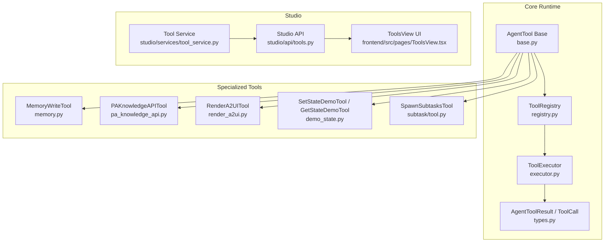
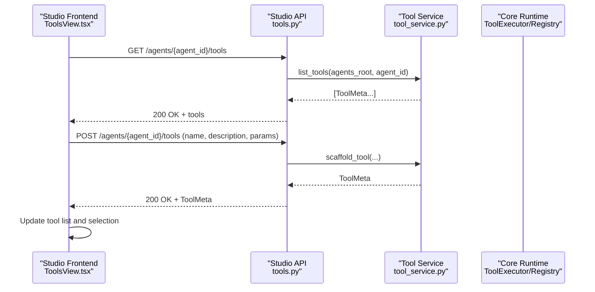
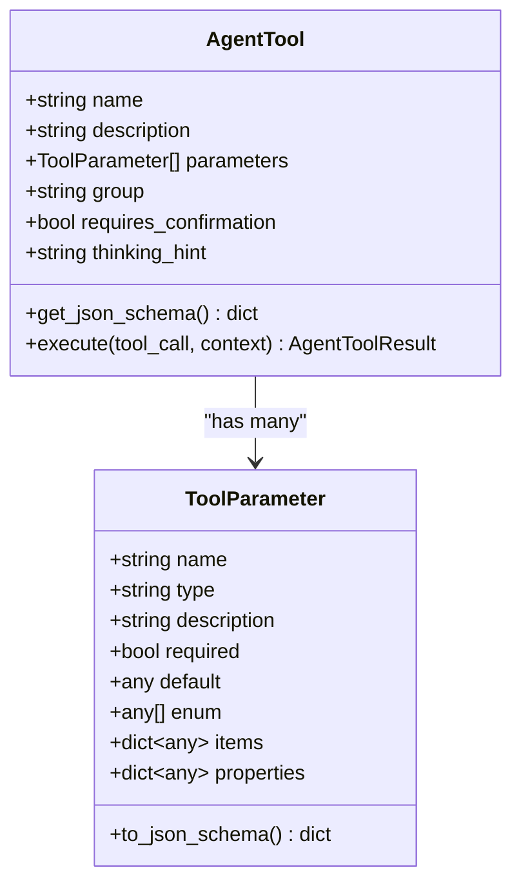
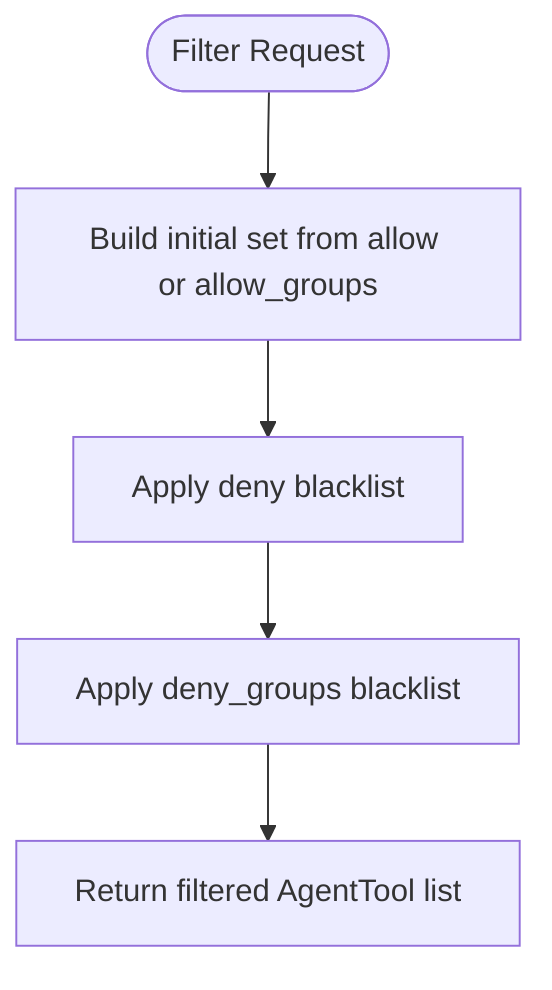
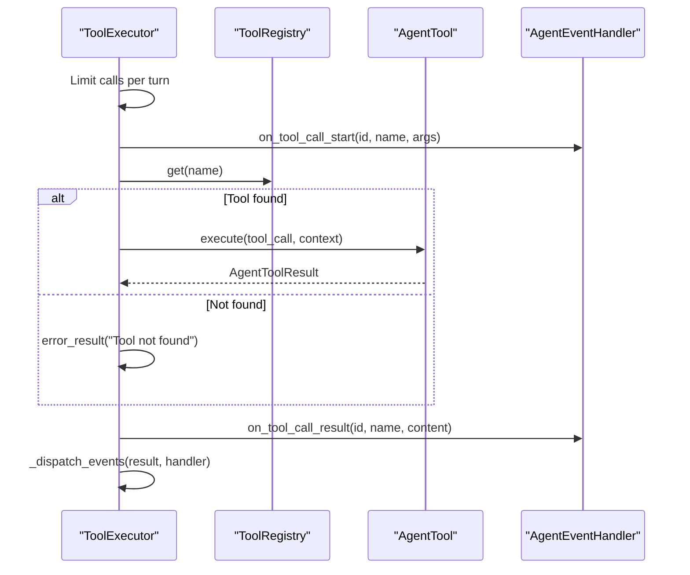
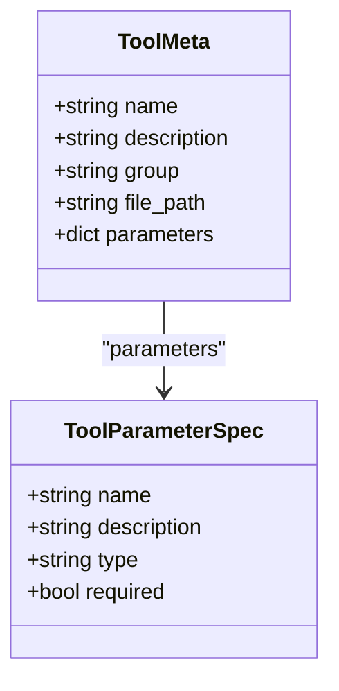
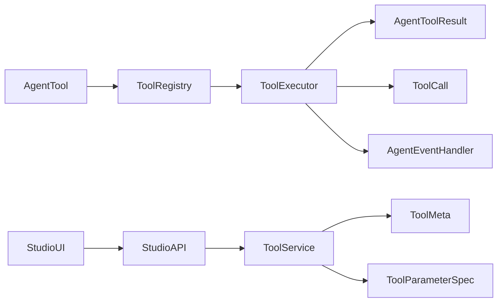

# Tool Management Interface

<cite>
**Referenced Files in This Document**
- [base.py](file://src/ark_agentic/core/tools/base.py)
- [registry.py](file://src/ark_agentic/core/tools/registry.py)
- [executor.py](file://src/ark_agentic/core/tools/executor.py)
- [memory.py](file://src/ark_agentic/core/tools/memory.py)
- [pa_knowledge_api.py](file://src/ark_agentic/core/tools/pa_knowledge_api.py)
- [demo_state.py](file://src/ark_agentic/core/tools/demo_state.py)
- [render_a2ui.py](file://src/ark_agentic/core/tools/render_a2ui.py)
- [tool_service.py](file://src/ark_agentic/studio/services/tool_service.py)
- [tools.py](file://src/ark_agentic/studio/api/tools.py)
- [ToolsView.tsx](file://src/ark_agentic/studio/frontend/src/pages/ToolsView.tsx)
- [types.py](file://src/ark_agentic/core/types.py)
- [tool.py](file://src/ark_agentic/core/subtask/tool.py)
</cite>

## Table of Contents
1. [Introduction](#introduction)
2. [Project Structure](#project-structure)
3. [Core Components](#core-components)
4. [Architecture Overview](#architecture-overview)
5. [Detailed Component Analysis](#detailed-component-analysis)
6. [Dependency Analysis](#dependency-analysis)
7. [Performance Considerations](#performance-considerations)
8. [Troubleshooting Guide](#troubleshooting-guide)
9. [Conclusion](#conclusion)
10. [Appendices](#appendices)

## Introduction
This document describes the Tool Management Interface for the Ark Agentic Space platform. It covers how tools are defined, configured, registered, executed, and surfaced in the Studio UI. It also documents the tool lifecycle, development workflow, parameter configuration, integration patterns with agents, testing interfaces, validation processes, and performance monitoring capabilities. The goal is to provide both conceptual understanding and practical guidance for building and managing tools within the system.

## Project Structure
The Tool Management Interface spans several layers:
- Core tool definitions and runtime: core/tools/*
- Tool execution and orchestration: core/tools/executor.py, core/types.py
- Tool registry and filtering: core/tools/registry.py
- Specialized tools: memory, PA knowledge API, A2UI rendering, demo state
- Studio tooling service and API: studio/services/tool_service.py, studio/api/tools.py
- Studio frontend: studio/frontend/src/pages/ToolsView.tsx

**Diagram sources**
- [base.py:46-114](file://src/ark_agentic/core/tools/base.py#L46-L114)
- [registry.py:14-93](file://src/ark_agentic/core/tools/registry.py#L14-L93)
- [executor.py:29-97](file://src/ark_agentic/core/tools/executor.py#L29-L97)
- [types.py:69-187](file://src/ark_agentic/core/types.py#L69-L187)
- [memory.py:39-107](file://src/ark_agentic/core/tools/memory.py#L39-L107)
- [pa_knowledge_api.py:71-195](file://src/ark_agentic/core/tools/pa_knowledge_api.py#L71-L195)
- [render_a2ui.py:105-274](file://src/ark_agentic/core/tools/render_a2ui.py#L105-L274)
- [demo_state.py:16-112](file://src/ark_agentic/core/tools/demo_state.py#L16-L112)
- [tool.py:61-163](file://src/ark_agentic/core/subtask/tool.py#L61-L163)
- [tool_service.py:40-98](file://src/ark_agentic/studio/services/tool_service.py#L40-L98)
- [tools.py:41-65](file://src/ark_agentic/studio/api/tools.py#L41-L65)
- [ToolsView.tsx:9-170](file://src/ark_agentic/studio/frontend/src/pages/ToolsView.tsx#L9-L170)

**Section sources**
- [base.py:1-286](file://src/ark_agentic/core/tools/base.py#L1-L286)
- [registry.py:1-178](file://src/ark_agentic/core/tools/registry.py#L1-L178)
- [executor.py:1-123](file://src/ark_agentic/core/tools/executor.py#L1-L123)
- [types.py:1-413](file://src/ark_agentic/core/types.py#L1-L413)
- [tool_service.py:1-235](file://src/ark_agentic/studio/services/tool_service.py#L1-L235)
- [tools.py:1-66](file://src/ark_agentic/studio/api/tools.py#L1-L66)
- [ToolsView.tsx:1-171](file://src/ark_agentic/studio/frontend/src/pages/ToolsView.tsx#L1-L171)

## Core Components
- AgentTool base class defines the contract for all tools, including name, description, parameters, group, confirmation requirement, and the execute method. It also generates JSON Schema for LLM function calling and supports optional LangChain adapter.
- ToolRegistry manages registration, lookup, grouping, filtering, and schema generation for tools.
- ToolExecutor executes ToolCalls against the registry with timeouts, error handling, and event dispatching to the AgentEventHandler.
- Specialized tools include MemoryWriteTool for persistent memory updates, PAKnowledgeAPITool for external knowledge retrieval, RenderA2UITool for UI rendering, demo state tools for session state manipulation, and SpawnSubtasksTool for parallel subtask execution.

**Section sources**
- [base.py:46-114](file://src/ark_agentic/core/tools/base.py#L46-L114)
- [registry.py:14-178](file://src/ark_agentic/core/tools/registry.py#L14-L178)
- [executor.py:29-123](file://src/ark_agentic/core/tools/executor.py#L29-L123)
- [memory.py:39-113](file://src/ark_agentic/core/tools/memory.py#L39-L113)
- [pa_knowledge_api.py:71-231](file://src/ark_agentic/core/tools/pa_knowledge_api.py#L71-L231)
- [render_a2ui.py:105-584](file://src/ark_agentic/core/tools/render_a2ui.py#L105-L584)
- [demo_state.py:16-112](file://src/ark_agentic/core/tools/demo_state.py#L16-L112)
- [tool.py:61-318](file://src/ark_agentic/core/subtask/tool.py#L61-L318)

## Architecture Overview
The tool lifecycle integrates frontend, backend, and core runtime:
- Studio UI lists tools and scaffolds new ones.
- Studio API validates requests and delegates to the tool service.
- Tool service parses agent tool files and generates scaffolding using AST.
- Core runtime registers tools, executes them, and emits structured events.

**Diagram sources**
- [ToolsView.tsx:28-55](file://src/ark_agentic/studio/frontend/src/pages/ToolsView.tsx#L28-L55)
- [tools.py:41-65](file://src/ark_agentic/studio/api/tools.py#L41-L65)
- [tool_service.py:40-98](file://src/ark_agentic/studio/services/tool_service.py#L40-L98)

## Detailed Component Analysis

### Tool Definition and Parameter Configuration
- Tool definition: Each tool extends AgentTool and sets name, description, group, and parameters. Parameters are defined via ToolParameter with type, description, required flag, defaults, enums, and nested items/properties for arrays/objects.
- JSON Schema generation: Tools expose get_json_schema() to produce LLM-compatible function specs.
- Parameter helpers: read_*_param functions provide robust parsing with defaults and required variants.

**Diagram sources**
- [base.py:16-114](file://src/ark_agentic/core/tools/base.py#L16-L114)

**Section sources**
- [base.py:16-114](file://src/ark_agentic/core/tools/base.py#L16-L114)

### Tool Registry Management
- Registration: register(tool) prevents duplicates and tracks groups.
- Lookup: get(name), get_required(name), get_by_group(group), list_all(), list_names(), list_groups().
- Unregister: unregister(name) removes tool and cleans group membership.
- Filtering: filter(allow, deny, allow_groups, deny_groups) for policy-driven tool availability.
- Schema export: get_schemas(names, groups, exclude) for LLM function calling.

**Diagram sources**
- [registry.py:130-168](file://src/ark_agentic/core/tools/registry.py#L130-L168)

**Section sources**
- [registry.py:14-178](file://src/ark_agentic/core/tools/registry.py#L14-L178)

### Tool Execution Lifecycle
- ToolExecutor.execute(tool_calls, context, handler) enforces per-turn limits, executes tools concurrently, applies timeouts, and dispatches events.
- Event routing: ToolExecutor._dispatch_events forwards UIComponentToolEvent, CustomToolEvent, and StepToolEvent to the handler.
- Error handling: Catches missing tools, timeouts, and exceptions, returning AgentToolResult.error_result with structured metadata.

**Diagram sources**
- [executor.py:43-96](file://src/ark_agentic/core/tools/executor.py#L43-L96)
- [types.py:50-67](file://src/ark_agentic/core/types.py#L50-L67)

**Section sources**
- [executor.py:29-123](file://src/ark_agentic/core/tools/executor.py#L29-L123)
- [types.py:69-187](file://src/ark_agentic/core/types.py#L69-L187)

### Specialized Tools

#### Memory Write Tool
- Purpose: Persist incremental user memory entries using heading-based markdown.
- Parameters: content (string) required.
- Behavior: Validates headings, writes changes, reports saved headings and dropped headings, handles errors gracefully.

**Section sources**
- [memory.py:39-113](file://src/ark_agentic/core/tools/memory.py#L39-L113)

#### PA Knowledge API Tool
- Purpose: Query internal knowledge base with parallel multi-query support and token caching.
- Parameters: queries (array of strings).
- Features: Dynamic token refresh with TTL, concurrent requests, result fusion and deduplication.

**Section sources**
- [pa_knowledge_api.py:71-231](file://src/ark_agentic/core/tools/pa_knowledge_api.py#L71-L231)

#### A2UI Rendering Tool
- Purpose: Unified rendering tool supporting three modes: blocks, card_type, preset_type.
- Dynamic parameters: Generated based on provided configurations (BlocksConfig, TemplateConfig, PresetRegistry).
- Validation: Strict validation of rendered payloads with warnings and metadata.

**Section sources**
- [render_a2ui.py:105-584](file://src/ark_agentic/core/tools/render_a2ui.py#L105-L584)

#### Demo State Tools
- Purpose: Demonstrate session state read/write via tools.
- SetStateDemoTool: Writes key-value pairs into session.state via result.metadata.state_delta.
- GetStateDemoTool: Reads values from context/session state.

**Section sources**
- [demo_state.py:16-112](file://src/ark_agentic/core/tools/demo_state.py#L16-L112)

#### Subtask Tool
- Purpose: Spawn parallel subtasks with isolated sessions, configurable concurrency and timeouts.
- Parameters: tasks (array of task specs with label and optional tools whitelist).
- Behavior: Prevents nesting, aggregates state deltas and token usage, optionally persists transcripts.

**Section sources**
- [tool.py:61-318](file://src/ark_agentic/core/subtask/tool.py#L61-L318)

### Studio Tool Management API and UI

#### Backend API
- list_tools(agent_id): Returns ToolMeta list by parsing agent tool files with AST.
- scaffold_tool(agent_id, name, description, parameters): Generates a Python tool scaffold and returns ToolMeta.

**Diagram sources**
- [tool_service.py:23-36](file://src/ark_agentic/studio/services/tool_service.py#L23-L36)
- [tool_service.py:31-36](file://src/ark_agentic/studio/services/tool_service.py#L31-L36)

**Section sources**
- [tool_service.py:40-177](file://src/ark_agentic/studio/services/tool_service.py#L40-L177)
- [tools.py:41-65](file://src/ark_agentic/studio/api/tools.py#L41-L65)

#### Frontend UI
- ToolsView displays a master-detail layout:
  - Master: Lists tools with name and description, allows selection.
  - Detail: Shows selected tool metadata and parameters schema.
  - Scaffold: Generates new tool scaffolding with name and description.

**Section sources**
- [ToolsView.tsx:9-170](file://src/ark_agentic/studio/frontend/src/pages/ToolsView.tsx#L9-L170)

## Dependency Analysis
- ToolRegistry depends on AgentTool and maintains name-to-tool mapping and group memberships.
- ToolExecutor depends on ToolRegistry, AgentToolResult, ToolCall, and AgentEventHandler for event distribution.
- Specialized tools depend on AgentTool base and core types.
- Studio tool service uses AST to parse tool files and renders scaffolding templates.
- Studio API depends on tool_service and validates requests.

**Diagram sources**
- [registry.py:14-93](file://src/ark_agentic/core/tools/registry.py#L14-L93)
- [executor.py:29-97](file://src/ark_agentic/core/tools/executor.py#L29-L97)
- [types.py:69-187](file://src/ark_agentic/core/types.py#L69-L187)
- [tool_service.py:40-177](file://src/ark_agentic/studio/services/tool_service.py#L40-L177)
- [tools.py:41-65](file://src/ark_agentic/studio/api/tools.py#L41-L65)

**Section sources**
- [registry.py:14-178](file://src/ark_agentic/core/tools/registry.py#L14-L178)
- [executor.py:29-123](file://src/ark_agentic/core/tools/executor.py#L29-L123)
- [types.py:69-187](file://src/ark_agentic/core/types.py#L69-L187)
- [tool_service.py:40-177](file://src/ark_agentic/studio/services/tool_service.py#L40-L177)
- [tools.py:41-65](file://src/ark_agentic/studio/api/tools.py#L41-L65)

## Performance Considerations
- Concurrency and limits: ToolExecutor limits per-turn calls and uses asyncio.gather for parallel execution.
- Timeouts: Per-call timeout prevents long-running tools from blocking the loop.
- Subtasks: SpawnSubtasksTool uses semaphores and per-task timeouts to control resource usage.
- Validation overhead: A2UI strict validation can add CPU cost; controlled via environment variable.
- Token management: PA Knowledge API caches tokens with TTL to reduce auth overhead.

[No sources needed since this section provides general guidance]

## Troubleshooting Guide
Common issues and resolutions:
- Tool not found: Ensure tool is registered under the correct name; check ToolRegistry.has(name) and list_names().
- Missing required parameters: Use read_*_param_required helpers to enforce presence; verify ToolParameter.required flags.
- Timeout during execution: Increase ToolExecutor timeout or optimize tool logic; inspect logs for slow operations.
- A2UI validation failures: Review strict validation warnings and fix contract violations; adjust A2UI_STRICT_VALIDATION.
- PA token errors: Verify app_secret and token_auth_url; ensure token TTL and refresh logic are functioning.
- Subtask nesting: spawn_subtasks rejects nested invocations; avoid invoking subtasks from within subtasks.

**Section sources**
- [executor.py:77-96](file://src/ark_agentic/core/tools/executor.py#L77-L96)
- [render_a2ui.py:557-584](file://src/ark_agentic/core/tools/render_a2ui.py#L557-L584)
- [pa_knowledge_api.py:105-133](file://src/ark_agentic/core/tools/pa_knowledge_api.py#L105-L133)
- [tool.py:108-113](file://src/ark_agentic/core/subtask/tool.py#L108-L113)

## Conclusion
The Tool Management Interface provides a robust, extensible framework for defining, registering, executing, and managing tools. The Studio UI enables developers to scaffold and inspect tools, while the core runtime ensures safe, monitored execution with structured events and validation. Specialized tools cover memory persistence, external knowledge retrieval, UI rendering, state management, and parallel subtask execution, enabling flexible agent workflows.

## Appendices

### Practical Guides

#### Creating a Custom Tool
- Define a new class extending AgentTool with name, description, and parameters.
- Implement execute(tool_call, context) to perform the desired action and return AgentToolResult.
- Register the tool with ToolRegistry.register(tool) or via runner.register_tool().

**Section sources**
- [base.py:46-114](file://src/ark_agentic/core/tools/base.py#L46-L114)
- [registry.py:24-40](file://src/ark_agentic/core/tools/registry.py#L24-L40)

#### Configuring Tool Parameters
- Use ToolParameter with appropriate type, description, required flag, and defaults.
- For arrays and objects, specify items and properties respectively.
- Generate JSON Schema via get_json_schema() for LLM function calling.

**Section sources**
- [base.py:16-44](file://src/ark_agentic/core/tools/base.py#L16-L44)
- [base.py:76-98](file://src/ark_agentic/core/tools/base.py#L76-L98)

#### Integrating Tools into Agent Workflows
- Register tools with the agent’s ToolRegistry.
- Use ToolRegistry.filter() to apply allow/deny policies by name or group.
- Leverage ToolExecutor to run ToolCalls with timeouts and event dispatching.

**Section sources**
- [registry.py:130-168](file://src/ark_agentic/core/tools/registry.py#L130-L168)
- [executor.py:43-96](file://src/ark_agentic/core/tools/executor.py#L43-L96)

#### Tool Testing Interfaces
- Use Studio API endpoints to list and scaffold tools for quick iteration.
- Parse tool metadata via tool_service.parse_tool_file() to validate structure without executing code.
- For specialized tools:
  - MemoryWriteTool: Test with valid heading-based markdown content.
  - PAKnowledgeAPITool: Provide valid queries and auth configuration.
  - RenderA2UITool: Supply blocks/card_type/preset_type with proper parameters.

**Section sources**
- [tools.py:41-65](file://src/ark_agentic/studio/api/tools.py#L41-L65)
- [tool_service.py:101-176](file://src/ark_agentic/studio/services/tool_service.py#L101-L176)
- [memory.py:66-107](file://src/ark_agentic/core/tools/memory.py#L66-L107)
- [pa_knowledge_api.py:156-195](file://src/ark_agentic/core/tools/pa_knowledge_api.py#L156-L195)
- [render_a2ui.py:246-274](file://src/ark_agentic/core/tools/render_a2ui.py#L246-L274)

#### Validation Processes
- Tool schema validation: ToolParameter.to_json_schema() and AgentTool.get_json_schema().
- A2UI payload validation: RenderA2UITool validates output and attaches warnings and metadata.
- Registry filtering: ToolRegistry.filter() enforces allow/deny policies.

**Section sources**
- [base.py:29-98](file://src/ark_agentic/core/tools/base.py#L29-L98)
- [render_a2ui.py:557-584](file://src/ark_agentic/core/tools/render_a2ui.py#L557-L584)
- [registry.py:130-168](file://src/ark_agentic/core/tools/registry.py#L130-L168)

#### Performance Monitoring Capabilities
- ToolExecutor logs start/done, errors, and timeouts; tracks result sizes.
- Subtask tool aggregates token usage and execution summaries.
- A2UI validation metadata includes warnings and enforcement mode.

**Section sources**
- [executor.py:69-96](file://src/ark_agentic/core/tools/executor.py#L69-L96)
- [tool.py:125-163](file://src/ark_agentic/core/subtask/tool.py#L125-L163)
- [render_a2ui.py:576-584](file://src/ark_agentic/core/tools/render_a2ui.py#L576-L584)