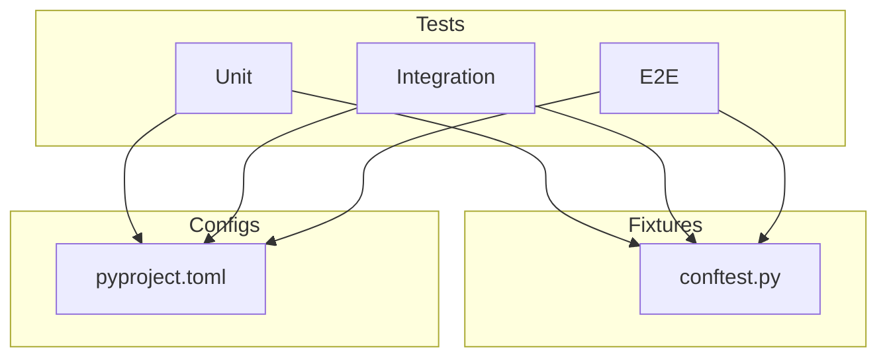
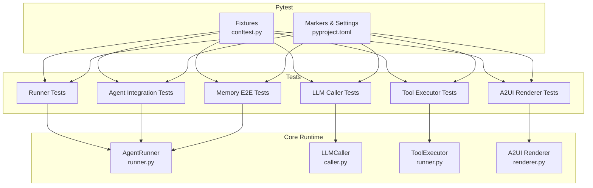
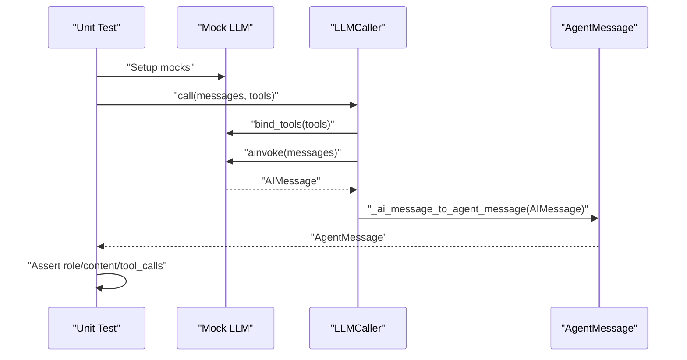
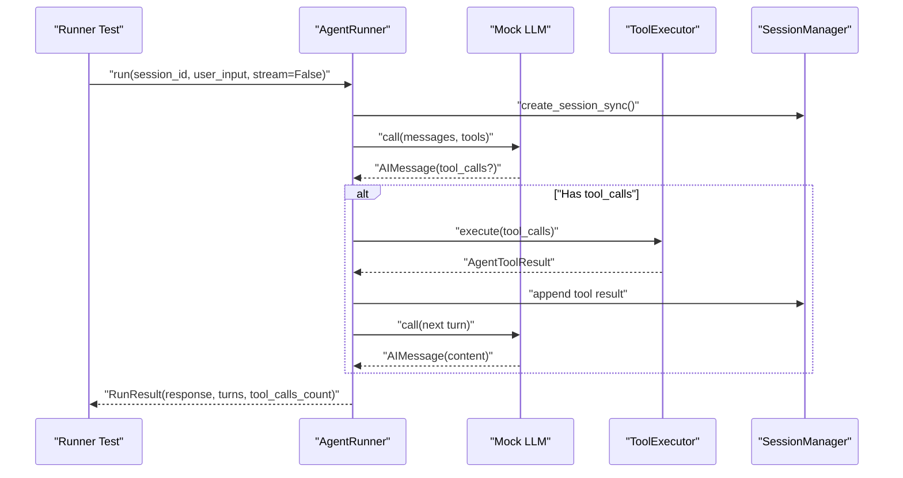
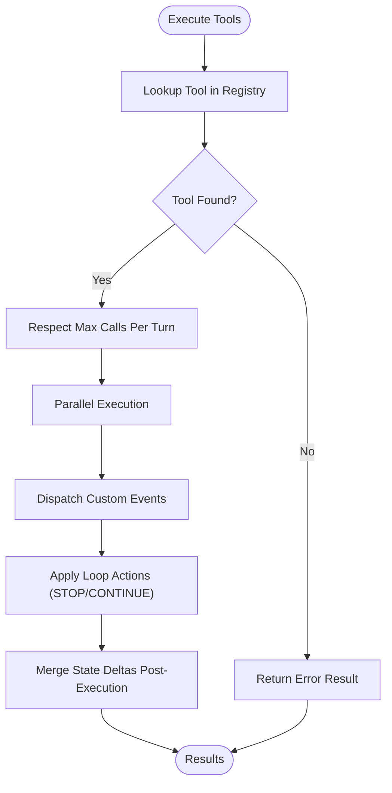
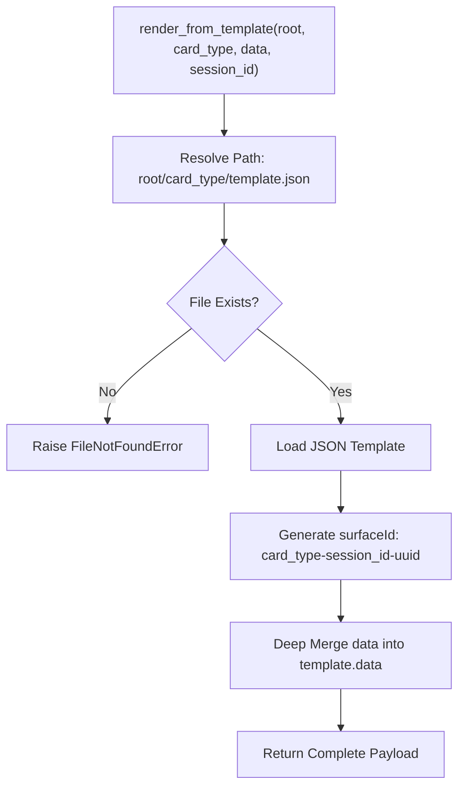
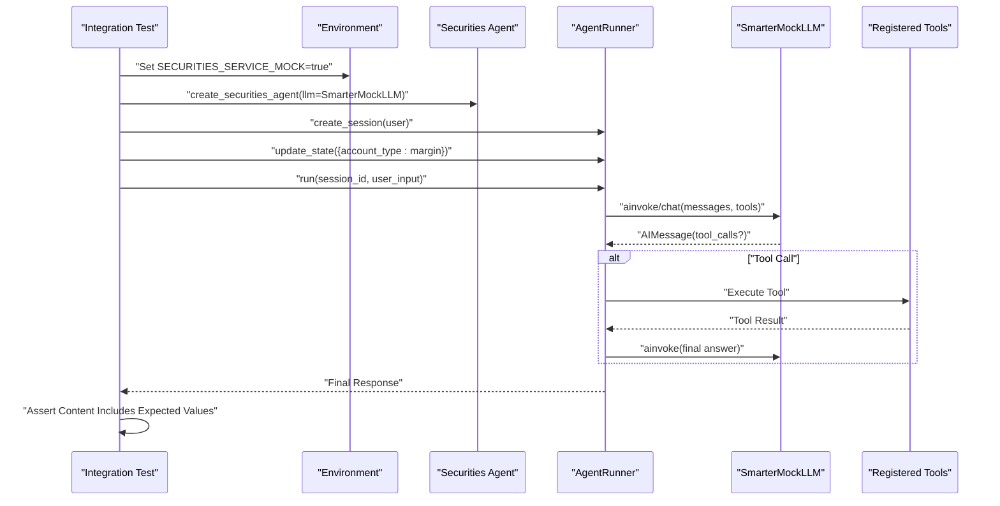
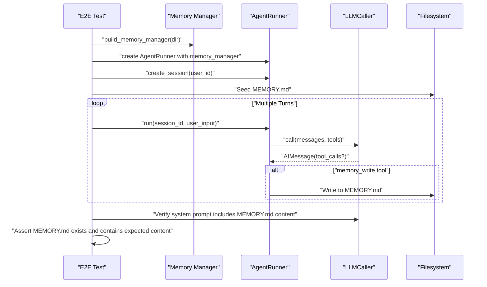
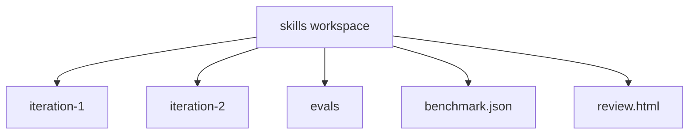
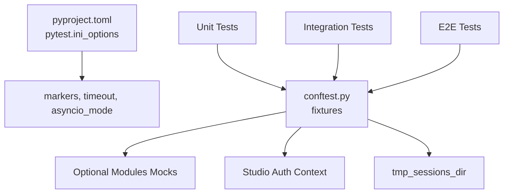

# Testing Framework

<cite>
**Referenced Files in This Document**
- [pyproject.toml](file://pyproject.toml)
- [conftest.py](file://tests/conftest.py)
- [test_llm_caller.py](file://tests/unit/core/test_llm_caller.py)
- [test_runner.py](file://tests/unit/core/test_runner.py)
- [test_a2ui_renderer.py](file://tests/unit/core/test_a2ui_renderer.py)
- [test_llm_from_env.py](file://tests/unit/core/test_llm_from_env.py)
- [test_tool_executor.py](file://tests/unit/core/test_tool_executor.py)
- [test_agent_integration.py](file://tests/integration/test_agent_integration.py)
- [test_memory_e2e.py](file://tests/e2e/test_memory_e2e.py)
- [README.md](file://tests/skills/README.md)
- [caller.py](file://src/ark_agentic/core/llm/caller.py)
- [runner.py](file://src/ark_agentic/core/runtime/runner.py)
- [renderer.py](file://src/ark_agentic/core/a2ui/renderer.py)
</cite>

## Table of Contents
1. [Introduction](#introduction)
2. [Project Structure](#project-structure)
3. [Core Components](#core-components)
4. [Architecture Overview](#architecture-overview)
5. [Detailed Component Analysis](#detailed-component-analysis)
6. [Dependency Analysis](#dependency-analysis)
7. [Performance Considerations](#performance-considerations)
8. [Troubleshooting Guide](#troubleshooting-guide)
9. [Conclusion](#conclusion)
10. [Appendices](#appendices)

## Introduction
This document describes the Ark Agentic testing framework with a focus on unit, integration, and end-to-end testing strategies. It explains the pytest-based infrastructure, test organization patterns, and fixture management for LLM interactions. It documents methodologies for agent behavior, tool execution, A2UI rendering, and plugin functionality. Practical examples demonstrate testing ReAct loops, validating tool outputs, and verifying UI generation. Guidelines cover writing effective tests, mocking LLM responses, and testing asynchronous operations. Best practices address AI agent systems, performance testing, and continuous integration setup. The evaluation framework for skill assessment, test data management, and debugging failures are included, along with examples for custom agents, tools, and plugins.

## Project Structure
The repository organizes tests by scope:
- Unit tests under tests/unit validate individual components such as LLM callers, runners, tools, and A2UI rendering.
- Integration tests under tests/integration validate cross-module behavior, including agent integration and API flows.
- End-to-end tests under tests/e2e validate lifecycle and memory integration across sessions.

Key configuration and fixtures live in tests/conftest.py, while pytest settings are defined in pyproject.toml.

**Diagram sources**
- [pyproject.toml:65-72](file://pyproject.toml#L65-L72)
- [conftest.py:1-101](file://tests/conftest.py#L1-L101)

**Section sources**
- [pyproject.toml:65-72](file://pyproject.toml#L65-L72)
- [conftest.py:1-101](file://tests/conftest.py#L1-L101)

## Core Components
This section highlights the primary testing components and their roles:
- LLMCaller: Encapsulates LLM invocation and streaming, converting LangChain messages to internal AgentMessage types and handling retries.
- AgentRunner: Executes ReAct loops, orchestrating LLM calls, tool execution, streaming callbacks, and session/state management.
- ToolExecutor: Executes registered tools, respecting concurrency limits and timeouts, emitting events and handling loop actions.
- A2UI Renderer: Renders UI payloads from templates, injecting identifiers and merging data.
- Fixtures and Environment: Pytest fixtures provide temporary directories, mocked authentication, and isolated Studio repositories.

Examples of tests:
- LLMCaller tests validate AIMessage mapping and error wrapping.
- Runner tests validate ReAct loop behavior, tool calls, streaming deltas, A2UI history markers, and state handling.
- ToolExecutor tests validate unknown tool handling, max calls enforcement, parallel execution semantics, and event dispatch.
- A2UI renderer tests validate template loading, surface ID generation, and data merging.
- Integration tests validate agent flows with mocked LLMs and environment toggles.
- E2E tests validate memory compaction, memory injection into prompts, and memory write tool persistence.

**Section sources**
- [test_llm_caller.py:1-48](file://tests/unit/core/test_llm_caller.py#L1-L48)
- [test_runner.py:1-756](file://tests/unit/core/test_runner.py#L1-L756)
- [test_tool_executor.py:1-162](file://tests/unit/core/test_tool_executor.py#L1-L162)
- [test_a2ui_renderer.py:1-95](file://tests/unit/core/test_a2ui_renderer.py#L1-L95)
- [test_agent_integration.py:1-294](file://tests/integration/test_agent_integration.py#L1-L294)
- [test_memory_e2e.py:1-260](file://tests/e2e/test_memory_e2e.py#L1-L260)

## Architecture Overview
The testing architecture centers around pytest fixtures and mocks to isolate subsystems while validating cross-cutting behaviors.

**Diagram sources**
- [conftest.py:38-101](file://tests/conftest.py#L38-L101)
- [pyproject.toml:65-72](file://pyproject.toml#L65-L72)
- [runner.py:171-200](file://src/ark_agentic/core/runtime/runner.py#L171-L200)
- [caller.py:63-257](file://src/ark_agentic/core/llm/caller.py#L63-L257)
- [renderer.py:15-53](file://src/ark_agentic/core/a2ui/renderer.py#L15-L53)

## Detailed Component Analysis

### LLM Caller Testing
This suite validates LLMCaller’s conversion of AIMessage to AgentMessage and robust error handling.

**Diagram sources**
- [test_llm_caller.py:13-48](file://tests/unit/core/test_llm_caller.py#L13-L48)
- [caller.py:107-132](file://src/ark_agentic/core/llm/caller.py#L107-L132)

Practical guidance:
- Use AsyncMock for ainvoke and AIMessage for tool_calls.
- Validate error propagation by asserting LLMError exceptions.
- Keep tool schemas minimal and deterministic for reproducible tests.

**Section sources**
- [test_llm_caller.py:13-48](file://tests/unit/core/test_llm_caller.py#L13-L48)
- [caller.py:240-257](file://src/ark_agentic/core/llm/caller.py#L240-L257)

### Agent Runner Testing (ReAct Loops, Streaming, A2UI)
Runner tests validate the ReAct loop, tool execution, streaming deltas, and A2UI history markers.

**Diagram sources**
- [test_runner.py:147-201](file://tests/unit/core/test_runner.py#L147-L201)
- [runner.py:171-200](file://src/ark_agentic/core/runtime/runner.py#L171-L200)

Additional scenarios validated:
- Streaming text and tool-call chunks, capturing deltas and tool-start events.
- Tool thinking hints driving step notifications.
- State deltas merged into session state; temp keys stripped after run.
- A2UI history markers neutralized; on_ui_component still fires for frontend delivery.
- render_a2ui argument preservation for few-shot examples; non-A2UI args redacted appropriately.

**Section sources**
- [test_runner.py:203-321](file://tests/unit/core/test_runner.py#L203-L321)
- [test_runner.py:323-402](file://tests/unit/core/test_runner.py#L323-L402)
- [test_runner.py:427-598](file://tests/unit/core/test_runner.py#L427-L598)
- [test_runner.py:600-710](file://tests/unit/core/test_runner.py#L600-L710)

### Tool Execution Testing
ToolExecutor tests validate execution semantics, concurrency, and event emission.

**Diagram sources**
- [test_tool_executor.py:47-162](file://tests/unit/core/test_tool_executor.py#L47-L162)
- [runner.py:171-200](file://src/ark_agentic/core/runtime/runner.py#L171-L200)

Key validations:
- Unknown tools produce error results.
- Exceeding max calls truncates results.
- Parallel execution does not expose intermediate state_delta to other tools.
- STOP action is respected; loop continues until STOP is processed at runner level.
- Custom tool events are dispatched to handlers.

**Section sources**
- [test_tool_executor.py:47-162](file://tests/unit/core/test_tool_executor.py#L47-L162)

### A2UI Rendering Testing
A2UI renderer tests validate template loading, surface ID generation, and data merging.

**Diagram sources**
- [test_a2ui_renderer.py:23-95](file://tests/unit/core/test_a2ui_renderer.py#L23-L95)
- [renderer.py:15-53](file://src/ark_agentic/core/a2ui/renderer.py#L15-L53)

Validation outcomes:
- Correct event/version/rootComponentId and surfaceId prefixes.
- Overwrite of template data with input data.
- Proper error handling for missing card types.

**Section sources**
- [test_a2ui_renderer.py:23-95](file://tests/unit/core/test_a2ui_renderer.py#L23-L95)
- [renderer.py:15-53](file://src/ark_agentic/core/a2ui/renderer.py#L15-L53)

### Integration Testing: Agent Behavior and Tool Execution
Integration tests validate agent flows with mocked LLMs and environment toggles.

**Diagram sources**
- [test_agent_integration.py:258-291](file://tests/integration/test_agent_integration.py#L258-L291)

Guidelines:
- Use environment flags to toggle mock services.
- Provide deterministic tool-call responses and final answers.
- Validate token usage metadata and streaming chunk composition.

**Section sources**
- [test_agent_integration.py:13-199](file://tests/integration/test_agent_integration.py#L13-L199)
- [test_agent_integration.py:258-291](file://tests/integration/test_agent_integration.py#L258-L291)

### End-to-End Testing: Memory Lifecycle and Prompt Injection
E2E tests validate memory compaction, prompt injection, and memory write tool persistence.

**Diagram sources**
- [test_memory_e2e.py:99-260](file://tests/e2e/test_memory_e2e.py#L99-L260)

Validation outcomes:
- Context compaction triggers flush and writes to MEMORY.md.
- MEMORY.md content is injected into system prompts.
- memory_write tool persists content and is reflected in subsequent runs.

**Section sources**
- [test_memory_e2e.py:99-260](file://tests/e2e/test_memory_e2e.py#L99-L260)

### Skill Evaluation Workspace
The tests/skills directory provides structured evaluation workspaces for skill assessment, including iterations and benchmarks.

**Diagram sources**
- [README.md:1-28](file://tests/skills/README.md#L1-L28)

**Section sources**
- [README.md:1-28](file://tests/skills/README.md#L1-L28)

## Dependency Analysis
The testing framework relies on pytest configurations and fixtures to manage optional dependencies and environment isolation.

**Diagram sources**
- [pyproject.toml:65-72](file://pyproject.toml#L65-L72)
- [conftest.py:19-36](file://tests/conftest.py#L19-L36)
- [conftest.py:57-101](file://tests/conftest.py#L57-L101)

Observations:
- Optional modules are stubbed when unavailable to avoid import failures.
- Studio authentication fixtures configure isolated repositories and headers.
- Temporary directories ensure clean session state per test.

**Section sources**
- [pyproject.toml:65-72](file://pyproject.toml#L65-L72)
- [conftest.py:19-36](file://tests/conftest.py#L19-L36)
- [conftest.py:57-101](file://tests/conftest.py#L57-L101)

## Performance Considerations
- Asynchronous tests: Use pytest-asyncio and asyncio_mode configured in pyproject.toml to handle async fixtures and coroutines.
- Timeouts: Global timeout setting prevents long-running tests from blocking CI.
- Streaming: Prefer deterministic streaming chunk sequences in tests to avoid flakiness.
- Mocking: Replace external LLM calls with lightweight mocks to reduce latency and network variability.
- Concurrency: Validate parallel tool execution semantics without relying on shared mutable state between tools.

[No sources needed since this section provides general guidance]

## Troubleshooting Guide
Common issues and resolutions:
- Missing environment variables for LLM creation:
  - Ensure MODEL_NAME and provider-specific keys are set when testing LLM factory functions.
  - Reference environment-based LLM creation tests for expected error messages and behaviors.
- LLM provider misconfiguration:
  - Validate provider selection and base URL propagation for OpenAI-compatible and PA providers.
- Fixture-related failures:
  - Confirm optional module stubbing is active when heavy dependencies are absent.
  - Verify Studio auth context isolation and temporary database engines.
- Streaming and tool-call chunk parsing:
  - Ensure tool_call_chunks and finish_reason handling align with provider-specific behaviors.
- A2UI rendering errors:
  - Confirm template existence and JSON validity; verify surfaceId generation and data merging.

**Section sources**
- [test_llm_from_env.py:10-67](file://tests/unit/core/test_llm_from_env.py#L10-L67)
- [conftest.py:19-36](file://tests/conftest.py#L19-L36)
- [conftest.py:57-101](file://tests/conftest.py#L57-L101)
- [caller.py:170-238](file://src/ark_agentic/core/llm/caller.py#L170-L238)
- [renderer.py:38-41](file://src/ark_agentic/core/a2ui/renderer.py#L38-L41)

## Conclusion
The Ark Agentic testing framework leverages pytest fixtures, mocks, and structured test organization to validate LLM interactions, agent ReAct loops, tool execution, A2UI rendering, and end-to-end memory lifecycles. By isolating dependencies, enforcing timeouts, and validating streaming and state semantics, the suite ensures reliable and maintainable tests for AI agent systems. The skill evaluation workspace further supports iterative assessment and improvement of agent capabilities.

[No sources needed since this section summarizes without analyzing specific files]

## Appendices

### Writing Effective Tests
- Use AsyncMock for async LLM calls and deterministic AIMessage/tool_calls.
- Keep tool schemas minimal and deterministic; register tools via ToolRegistry in tests.
- Validate both non-streaming and streaming paths; capture deltas and tool-call chunks.
- Assert session state transitions and A2UI history markers to prevent regressions.
- Employ environment flags to toggle mock services for integration tests.

[No sources needed since this section provides general guidance]

### Mocking LLM Responses
- For unit tests, construct AIMessage objects with tool_calls and content.
- For integration tests, implement a SmarterMockLLM that responds differently based on user/tool messages.
- For E2E tests, patch LLMCaller.call/call_streaming to inject controlled responses.

**Section sources**
- [test_llm_caller.py:13-48](file://tests/unit/core/test_llm_caller.py#L13-L48)
- [test_agent_integration.py:13-199](file://tests/integration/test_agent_integration.py#L13-L199)
- [test_memory_e2e.py:100-139](file://tests/e2e/test_memory_e2e.py#L100-L139)

### Testing Asynchronous Operations
- Use pytest.mark.asyncio and AsyncMock for async fixtures and method calls.
- Validate loop termination conditions and tool-call limits.
- Ensure streaming callbacks receive incremental deltas and tool-call start/end events.

**Section sources**
- [test_runner.py:147-321](file://tests/unit/core/test_runner.py#L147-L321)
- [test_tool_executor.py:137-162](file://tests/unit/core/test_tool_executor.py#L137-L162)

### Continuous Integration Setup
- Configure pytest settings in pyproject.toml for asyncio_mode, testpaths, timeout, and markers.
- Use fixtures to isolate databases and temporary directories.
- Mark slow tests with a custom marker to allow selective execution.

**Section sources**
- [pyproject.toml:65-72](file://pyproject.toml#L65-L72)
- [conftest.py:57-101](file://tests/conftest.py#L57-L101)

### Evaluation Framework for Skill Assessment
- Use the skills workspace to organize iterations, benchmarks, and evaluation reports.
- Generate static review pages for human assessment and regression tracking.

**Section sources**
- [README.md:1-28](file://tests/skills/README.md#L1-L28)