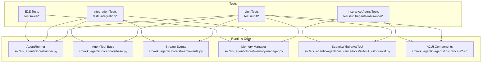
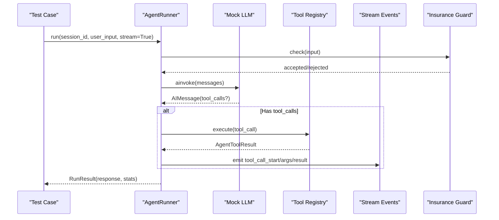
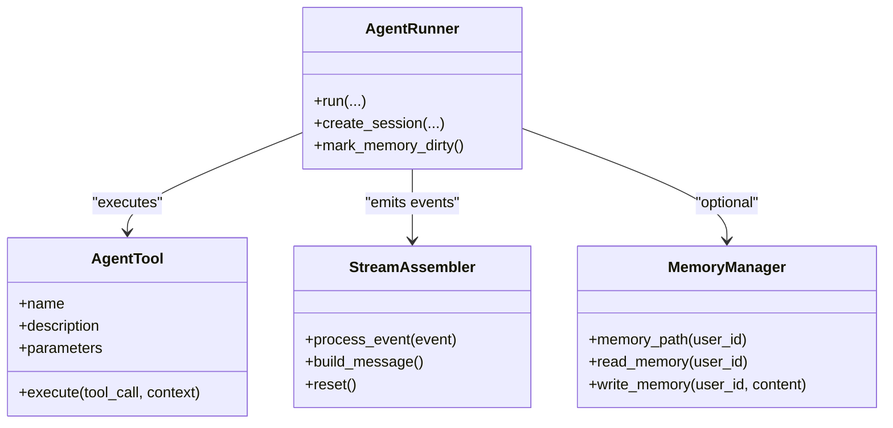
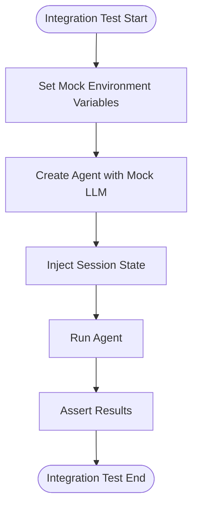
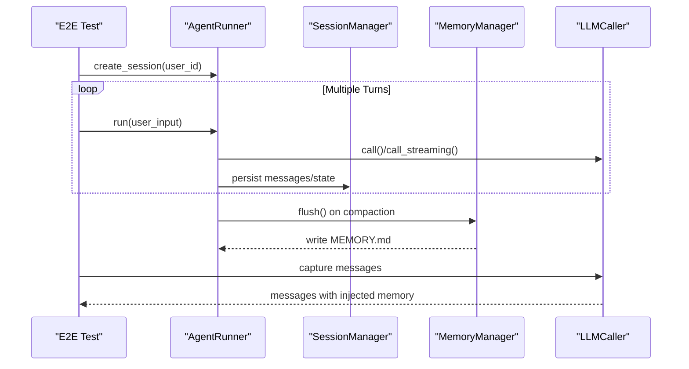
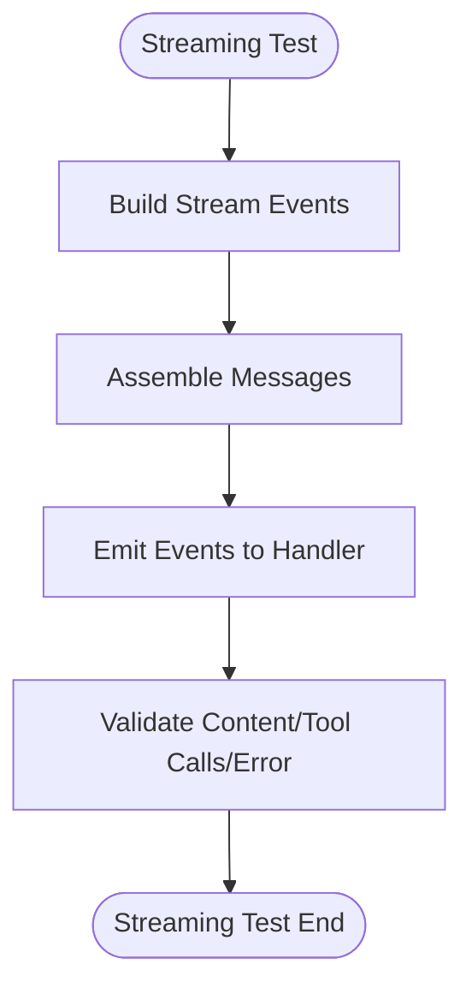
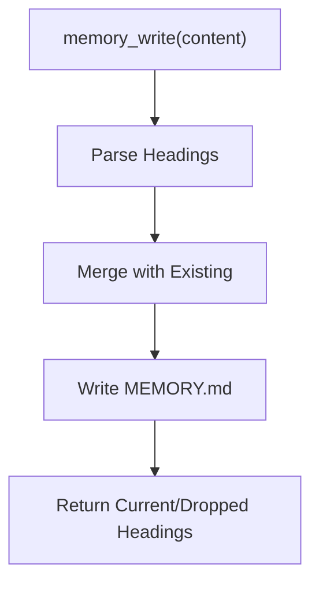
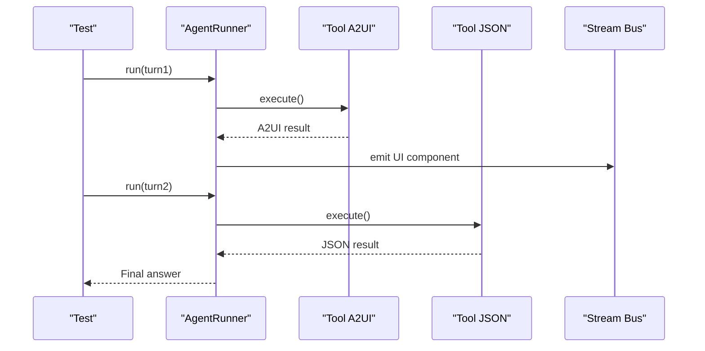
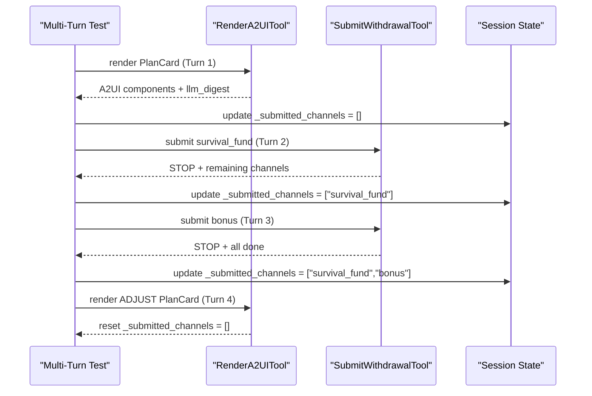
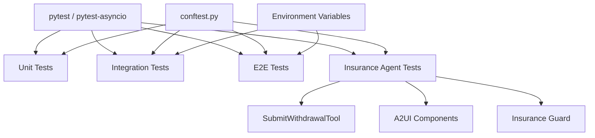

# Testing and Development

<cite>
**Referenced Files in This Document**
- [README.md](file://README.md)
- [pyproject.toml](file://pyproject.toml)
- [conftest.py](file://tests/conftest.py)
- [test_runner.py](file://tests/unit/core/test_runner.py)
- [test_stream.py](file://tests/unit/core/test_stream.py)
- [test_memory_tools.py](file://tests/unit/core/test_memory_tools.py)
- [test_agent_integration.py](file://tests/integration/test_agent_integration.py)
- [test_memory_e2e.py](file://tests/e2e/test_memory_e2e.py)
- [runner.py](file://src/ark_agentic/core/runner.py)
- [base.py](file://src/ark_agentic/core/tools/base.py)
- [events.py](file://src/ark_agentic/core/stream/events.py)
- [manager.py](file://src/ark_agentic/core/memory/manager.py)
- [test_cli.py](file://tests/integration/cli/test_cli.py)
- [test_chat_api.py](file://tests/integration/test_chat_api.py)
- [test_skills_integration.py](file://tests/integration/test_skills_integration.py)
- [test_tool_service.py](file://tests/integration/test_tool_service.py)
- [test_studio_agents.py](file://tests/integration/test_studio_agents.py)
- [test_studio_sessions_memory.py](file://tests/integration/test_studio_sessions_memory.py)
- [test_studio_skills.py](file://tests/integration/test_studio_skills.py)
- [test_studio_tools.py](file://tests/integration/test_studio_tools.py)
- [test_securities_integration.py](file://tests/integration/test_securities_integration.py)
- [test_setup_studio_from_env.py](file://tests/integration/test_setup_studio_from_env.py)
- [test_context_injection.py](file://tests/integration/test_context_injection.py)
- [test_app_integration.py](file://tests/integration/test_app_integration.py)
- [test_agent_integration.py](file://tests/integration/agents/insurance/test_insurance_api_from_env.py)
- [test_mock_loader_and_service_adapter.py](file://tests/integration/agents/securities/test_mock_loader_and_service_adapter.py)
- [test_subtask_e2e.py](file://scripts/test_subtask_e2e.py)
- [gen_seed_data.py](file://scripts/gen_seed_data.py)
- [update_mock_data_to_str.py](file://scripts/update_mock_data_to_str.py)
- [test_withdrawal_multiturn.py](file://tests/unit/agents/insurance/test_withdrawal_multiturn.py)
- [test_submit_withdrawal.py](file://tests/unit/agents/insurance/test_submit_withdrawal.py)
- [submit_withdrawal.py](file://src/ark_agentic/agents/insurance/tools/submit_withdrawal.py)
- [test_a2ui_blocks_components.py](file://tests/unit/agents/insurance/test_a2ui_blocks_components.py)
- [blocks.py](file://src/ark_agentic/agents/insurance/a2ui/blocks.py)
- [components.py](file://src/ark_agentic/agents/insurance/a2ui/components.py)
- [withdraw_a2ui_utils.py](file://src/ark_agentic/agents/insurance/a2ui/withdraw_a2ui_utils.py)
- [test_rule_engine.py](file://tests/unit/agents/insurance/test_rule_engine.py)
- [test_guard.py](file://tests/unit/agents/insurance/test_guard.py)
</cite>

## Update Summary
**Changes Made**
- Added comprehensive documentation for new multi-turn integration test suite for withdrawal process validation
- Enhanced unit test coverage documentation for submit_withdrawal tool with detailed test scenarios
- Expanded A2UI component testing framework documentation with detailed block and component validation
- Updated testing strategies to include advanced state management and cross-turn validation
- Added documentation for insurance agent testing patterns and guardrail implementations

## Table of Contents
1. [Introduction](#introduction)
2. [Project Structure](#project-structure)
3. [Core Components](#core-components)
4. [Architecture Overview](#architecture-overview)
5. [Detailed Component Analysis](#detailed-component-analysis)
6. [Advanced Testing Framework](#advanced-testing-framework)
7. [Dependency Analysis](#dependency-analysis)
8. [Performance Considerations](#performance-considerations)
9. [Troubleshooting Guide](#troubleshooting-guide)
10. [Conclusion](#conclusion)
11. [Appendices](#appendices)

## Introduction
This document provides comprehensive testing strategies and development workflows for the project. It covers the testing architecture across unit, integration, and end-to-end levels, outlines fixtures and mocking strategies, and documents test data management. It also includes guidelines for writing effective tests for agents, tools, and skills, along with development workflows, debugging techniques, performance profiling, and continuous integration practices.

**Updated** Enhanced with comprehensive multi-turn integration testing for withdrawal processes, detailed unit tests for submit_withdrawal tool, and expanded A2UI component testing framework.

## Project Structure
The repository organizes tests by scope:
- Unit tests under tests/unit focus on isolated components (runner, stream, memory tools, etc.).
- Integration tests under tests/integration validate cross-component behavior and API integrations.
- End-to-end tests under tests/e2e exercise lifecycle and memory system flows.
- Advanced insurance agent testing under tests/unit/agents/insurance covers specialized workflows.

Key runtime components relevant to testing:
- AgentRunner orchestrates ReAct loops, tool execution, and streaming.
- Tool base class defines the contract for tools.
- Stream events define the AG-UI protocol for streaming.
- Memory manager provides lightweight file-based memory storage.
- Insurance agent tools and A2UI components provide specialized financial workflows.

**Diagram sources**
- [runner.py:153-200](file://src/ark_agentic/core/runner.py#L153-L200)
- [base.py:46-114](file://src/ark_agentic/core/tools/base.py#L46-L114)
- [events.py:67-116](file://src/ark_agentic/core/stream/events.py#L67-L116)
- [manager.py:24-92](file://src/ark_agentic/core/memory/manager.py#L24-L92)
- [submit_withdrawal.py:118-194](file://src/ark_agentic/agents/insurance/tools/submit_withdrawal.py#L118-L194)
- [blocks.py:25-145](file://src/ark_agentic/agents/insurance/a2ui/blocks.py#L25-L145)
- [components.py:56-442](file://src/ark_agentic/agents/insurance/a2ui/components.py#L56-L442)

**Section sources**
- [README.md:729-742](file://README.md#L729-L742)
- [pyproject.toml:67-74](file://pyproject.toml#L67-L74)

## Core Components
- AgentRunner: Executes ReAct loops, manages sessions, tool execution, and streaming callbacks.
- AgentTool: Defines tool contracts and JSON schema generation for function calling.
- Stream events: Define AG-UI protocol events emitted during runs.
- Memory manager: Provides file-based memory read/write for user profiles.
- SubmitWithdrawalTool: Specialized insurance tool for withdrawal process management.
- A2UI Components: Business-aware UI component builders with state management.
- Insurance Guard: Temperature-controlled intake guard with business keyword filtering.

These components are exercised across unit, integration, and end-to-end tests to ensure correctness and reliability.

**Section sources**
- [runner.py:153-200](file://src/ark_agentic/core/runner.py#L153-L200)
- [base.py:46-114](file://src/ark_agentic/core/tools/base.py#L46-L114)
- [events.py:67-116](file://src/ark_agentic/core/stream/events.py#L67-L116)
- [manager.py:24-92](file://src/ark_agentic/core/memory/manager.py#L24-L92)
- [submit_withdrawal.py:118-194](file://src/ark_agentic/agents/insurance/tools/submit_withdrawal.py#L118-L194)
- [blocks.py:25-145](file://src/ark_agentic/agents/insurance/a2ui/blocks.py#L25-L145)
- [components.py:56-442](file://src/ark_agentic/agents/insurance/a2ui/components.py#L56-L442)

## Architecture Overview
The testing architecture aligns with the runtime architecture:
- Unit tests mock LLMs and tools to validate core logic deterministically.
- Integration tests validate real-world flows with mocked services and environment variables.
- End-to-end tests validate memory lifecycle and long-running sessions.
- Advanced insurance agent tests validate complex multi-turn workflows and state management.

**Diagram sources**
- [test_runner.py:125-300](file://tests/unit/core/test_runner.py#L125-L300)
- [runner.py:153-200](file://src/ark_agentic/core/runner.py#L153-L200)
- [events.py:67-116](file://src/ark_agentic/core/stream/events.py#L67-L116)
- [test_guard.py:57-96](file://tests/unit/agents/insurance/test_guard.py#L57-L96)

## Detailed Component Analysis

### Unit Testing Strategy
- Fixtures and mocks:
  - conftest sets up optional module mocks and provides a temporary sessions directory fixture.
  - Unit tests commonly use mock LLMs and tool registries to isolate logic.
- Representative unit tests:
  - Runner behavior: basic text responses, tool calls, streaming, state deltas, A2UI handling, and argument redaction.
  - Stream assembler: content/thought accumulation, tool call assembly, error handling, and callbacks.
  - Memory tools: upsert semantics, empty-content delete, missing user-id rejection, and concurrent heading safety.

**Diagram sources**
- [runner.py:153-200](file://src/ark_agentic/core/runner.py#L153-L200)
- [base.py:46-114](file://src/ark_agentic/core/tools/base.py#L46-L114)
- [events.py:67-116](file://src/ark_agentic/core/stream/events.py#L67-L116)
- [manager.py:24-92](file://src/ark_agentic/core/memory/manager.py#L24-L92)

**Section sources**
- [conftest.py:17-39](file://tests/conftest.py#L17-L39)
- [test_runner.py:125-300](file://tests/unit/core/test_runner.py#L125-L300)
- [test_stream.py:28-174](file://tests/unit/core/test_stream.py#L28-L174)
- [test_memory_tools.py:28-163](file://tests/unit/core/test_memory_tools.py#L28-L163)

### Integration Testing Strategy
- Environment-driven mocking:
  - Integration tests set environment variables to force mock services for securities and other providers.
- Representative integration tests:
  - Agent integration validates end-to-end flows with mocked LLMs and tool outputs.
  - API and CLI integration tests validate server behavior and command-line entry points.
  - Studio integration tests validate agent, skill, tool, and session/memory views.

**Diagram sources**
- [test_agent_integration.py:258-291](file://tests/integration/test_agent_integration.py#L258-L291)

**Section sources**
- [test_agent_integration.py:258-291](file://tests/integration/test_agent_integration.py#L258-L291)
- [test_cli.py](file://tests/integration/cli/test_cli.py)
- [test_chat_api.py](file://tests/integration/test_chat_api.py)
- [test_skills_integration.py](file://tests/integration/test_skills_integration.py)
- [test_tool_service.py](file://tests/integration/test_tool_service.py)
- [test_studio_agents.py](file://tests/integration/test_studio_agents.py)
- [test_studio_sessions_memory.py](file://tests/integration/test_studio_sessions_memory.py)
- [test_studio_skills.py](file://tests/integration/test_studio_skills.py)
- [test_studio_tools.py](file://tests/integration/test_studio_tools.py)
- [test_securities_integration.py](file://tests/integration/test_securities_integration.py)
- [test_setup_studio_from_env.py](file://tests/integration/test_setup_studio_from_env.py)
- [test_context_injection.py](file://tests/integration/test_context_injection.py)
- [test_app_integration.py](file://tests/integration/test_app_integration.py)

### End-to-End Testing Strategy
- Memory lifecycle E2E:
  - Validates compaction triggering flush, MEMORY.md writing, system prompt injection, and memory_write tool usage.
- Representative E2E test:
  - Memory E2E test exercises compaction, flushing, and prompt injection across multiple turns.

**Diagram sources**
- [test_memory_e2e.py:100-210](file://tests/e2e/test_memory_e2e.py#L100-L210)

**Section sources**
- [test_memory_e2e.py:100-210](file://tests/e2e/test_memory_e2e.py#L100-L210)

### Streaming Responses Testing
- Event coverage:
  - Stream assembler tests cover content deltas, thinking deltas, tool use start/end, and error handling.
- Runner streaming tests:
  - Validate streaming text responses, tool-call streaming, step callbacks, and A2UI component emission.

**Diagram sources**
- [test_stream.py:28-174](file://tests/unit/core/test_stream.py#L28-L174)
- [test_runner.py:181-300](file://tests/unit/core/test_runner.py#L181-L300)

**Section sources**
- [test_stream.py:28-174](file://tests/unit/core/test_stream.py#L28-L174)
- [test_runner.py:181-300](file://tests/unit/core/test_runner.py#L181-L300)

### Memory Operations Testing
- Upsert semantics:
  - Writing new headings preserves existing ones; empty-body headings delete headings.
- Provider and context:
  - Tests validate missing user-id context and heading-less content rejection.
- Lifecycle:
  - Integration of memory_write tool within AgentRunner and persistence to MEMORY.md.

**Diagram sources**
- [test_memory_tools.py:40-163](file://tests/unit/core/test_memory_tools.py#L40-L163)
- [manager.py:45-69](file://src/ark_agentic/core/memory/manager.py#L45-L69)

**Section sources**
- [test_memory_tools.py:40-163](file://tests/unit/core/test_memory_tools.py#L40-L163)
- [manager.py:45-69](file://src/ark_agentic/core/memory/manager.py#L45-L69)

### Complex Agent Interactions Testing
- Multi-turn orchestration:
  - Tests validate tool-call chaining, state propagation, and final answer synthesis.
- A2UI and redaction:
  - Tests ensure A2UI markers and argument preservation/redaction rules are enforced.
- Subtask spawning:
  - E2E script demonstrates multi-subtask execution patterns.

**Diagram sources**
- [test_runner.py:489-576](file://tests/unit/core/test_runner.py#L489-L576)
- [test_subtask_e2e.py](file://scripts/test_subtask_e2e.py)

**Section sources**
- [test_runner.py:489-576](file://tests/unit/core/test_runner.py#L489-L576)
- [test_subtask_e2e.py](file://scripts/test_subtask_e2e.py)

### Test Fixtures and Mocking Strategies
- Optional dependency mocks:
  - conftest injects MagicMock for optional modules to avoid installation overhead.
- Temporary directories:
  - tmp_sessions_dir fixture ensures isolated session storage for tests requiring SessionManager.
- Mock LLMs:
  - Unit tests use minimal mock LLMs compatible with LangChain interfaces to simulate streaming and non-streaming responses.
- Monkey patching:
  - Integration and E2E tests use monkeypatch to stub LLMCaller and MemoryFlusher for deterministic behavior.

**Section sources**
- [conftest.py:17-39](file://tests/conftest.py#L17-L39)
- [test_agent_integration.py:13-199](file://tests/integration/test_agent_integration.py#L13-L199)
- [test_memory_e2e.py:118-137](file://tests/e2e/test_memory_e2e.py#L118-L137)

### Test Data Management
- Mock data:
  - Securities mock data resides under src/ark_agentic/agents/securities/mock_data.
- Seed data generation:
  - Scripts gen_seed_data.py and update_mock_data_to_str.py support generating and normalizing mock datasets.
- Environment-driven selection:
  - Integration tests rely on environment variables to toggle mock services.

**Section sources**
- [gen_seed_data.py](file://scripts/gen_seed_data.py)
- [update_mock_data_to_str.py](file://scripts/update_mock_data_to_str.py)

### Guidelines for Writing Effective Tests
- Agents:
  - Use mock LLMs to control tool-call responses and streaming behavior.
  - Validate RunResult fields (response, turns, tool_calls_count) and session state updates.
- Tools:
  - Implement AgentTool subclasses with proper JSON schema and execute logic.
  - Test parameter extraction helpers and error conditions.
- Skills:
  - Validate skill loading modes and invocation policies.
  - Use fixtures to simulate skill workspaces and evaluation artifacts.

**Section sources**
- [base.py:46-114](file://src/ark_agentic/core/tools/base.py#L46-L114)
- [test_skills_integration.py](file://tests/integration/test_skills_integration.py)

## Advanced Testing Framework

### Multi-Turn Integration Testing for Withdrawal Process
The insurance agent testing framework now includes comprehensive multi-turn integration tests that validate the complete withdrawal process workflow across multiple conversation turns.

**Key Features:**
- Complete state flow validation across 4+ turns
- Real insurance tools without LLM mocking
- Zero-cost plan rendering and continuation
- Channel submission tracking and remaining channel detection
- ADJUST mode reset functionality
- Cross-turn state persistence and convergence

**Diagram sources**
- [test_withdrawal_multiturn.py:91-177](file://tests/unit/agents/insurance/test_withdrawal_multiturn.py#L91-L177)

**Section sources**
- [test_withdrawal_multiturn.py:1-316](file://tests/unit/agents/insurance/test_withdrawal_multiturn.py#L1-L316)

### Enhanced Unit Tests for SubmitWithdrawal Tool
The submit_withdrawal tool now has comprehensive unit tests covering over 480 lines of test scenarios, validating state-only policies, anti-reentry mechanisms, and cross-turn convergence.

**Test Categories:**
- Operation type resolution and channel mapping
- Remaining channel detection and state management
- Stop message construction and flow type mapping
- Anti-reentry protection and convergence validation
- Three-channel plan completion scenarios
- Error handling for invalid operations

**Key Validation Points:**
- `_resolve_policies_from_state()` function behavior
- `_find_remaining_channels()` state tracking
- `_build_stop_message()` content construction
- State delta accumulation across turns
- Flow type mapping stability
- Error condition handling

**Section sources**
- [test_submit_withdrawal.py:1-481](file://tests/unit/agents/insurance/test_submit_withdrawal.py#L1-L481)
- [submit_withdrawal.py:52-194](file://src/ark_agentic/agents/insurance/tools/submit_withdrawal.py#L52-L194)

### Expanded A2UI Component Testing Framework
The A2UI testing framework has been significantly expanded to validate comprehensive UI component behavior, state management, and agent pipeline integration.

**Component Testing Coverage:**
- Block builders validation (SectionHeader, KVRow, AccentTotal, HintText, ActionButton, Divider)
- Component builders validation (WithdrawSummaryHeader, WithdrawSummarySection, WithdrawPlanCard)
- State delta validation and session state management
- LLDM digest propagation and content formatting
- Theme application and styling validation
- Nested component expansion and depth limits
- Business logic integration and data transformation

**Advanced Validation Scenarios:**
- Multi-channel plan allocation and distribution
- Zero-cost plan validation and channel exclusivity
- Loan section calculation and interest implications
- Surrender total color coding and risk indication
- Button variant customization and action mapping
- Card expansion pipeline validation
- Transform resolution in component children

**Section sources**
- [test_a2ui_blocks_components.py:1-546](file://tests/unit/agents/insurance/test_a2ui_blocks_components.py#L1-L546)
- [blocks.py:25-145](file://src/ark_agentic/agents/insurance/a2ui/blocks.py#L25-L145)
- [components.py:56-442](file://src/ark_agentic/agents/insurance/a2ui/components.py#L56-L442)
- [withdraw_a2ui_utils.py:1-123](file://src/ark_agentic/agents/insurance/a2ui/withdraw_a2ui_utils.py#L1-L123)

### Insurance Agent Guard Testing
The insurance agent guard testing framework validates temperature control, business keyword filtering, and memory pattern recognition.

**Guard Testing Features:**
- Temperature override validation (temperature=0 enforcement)
- Few-shot prompt classification testing
- Business keyword fast-path bypass validation
- Memory/preference pattern recognition
- History window management and filtering
- Malformed JSON and failure handling

**Section sources**
- [test_guard.py:1-297](file://tests/unit/agents/insurance/test_guard.py#L1-L297)

### Rule Engine Testing
The rule engine testing validates amount validation and business logic enforcement.

**Rule Engine Validation:**
- Negative amount rejection
- Zero amount validation
- Business rule compliance checking
- Error message formatting and localization

**Section sources**
- [test_rule_engine.py:1-69](file://tests/unit/agents/insurance/test_rule_engine.py#L1-L69)

## Dependency Analysis
The testing suite depends on:
- pytest and pytest-asyncio for async test execution.
- Optional dependency mocks to ensure tests run without heavy packages.
- Environment variables to control mock behavior in integration and E2E tests.
- Advanced insurance agent testing requires specialized tool and component dependencies.

**Diagram sources**
- [pyproject.toml:67-74](file://pyproject.toml#L67-L74)
- [conftest.py:17-39](file://tests/conftest.py#L17-L39)
- [submit_withdrawal.py:118-194](file://src/ark_agentic/agents/insurance/tools/submit_withdrawal.py#L118-L194)
- [components.py:56-442](file://src/ark_agentic/agents/insurance/a2ui/components.py#L56-L442)

**Section sources**
- [pyproject.toml:67-74](file://pyproject.toml#L67-L74)
- [conftest.py:17-39](file://tests/conftest.py#L17-L39)

## Performance Considerations
- Asynchronous execution:
  - Use pytest-asyncio to run async tests efficiently.
- Streaming throughput:
  - Validate stream assembler performance under high-frequency deltas.
- Memory footprint:
  - Prefer file-based memory for E2E tests to avoid database overhead.
- Test isolation:
  - Use tmp_path fixtures to minimize I/O contention across tests.
- Multi-turn test optimization:
  - Insurance agent tests leverage shared fixtures to reduce setup overhead.
- A2UI component testing:
  - Comprehensive component validation benefits from fixture reuse and shared test data.

## Troubleshooting Guide
- Slow tests:
  - Mark intentionally slow tests with pytest markers and skip them with -m "not slow".
- Timeout failures:
  - Increase timeouts for integration tests that require external services.
- Mock mismatches:
  - Ensure mock LLMs return expected tool_calls and content structures.
- Environment issues:
  - Confirm environment variables for mock services are set before running integration tests.
- Multi-turn test failures:
  - Validate state delta accumulation and session state persistence across turns.
- A2UI component validation:
  - Check component ID generation and theme application consistency.
- Submit withdrawal tool errors:
  - Verify operation type mapping and channel availability validation.

**Section sources**
- [pyproject.toml:70-74](file://pyproject.toml#L70-L74)
- [test_agent_integration.py:258-291](file://tests/integration/test_agent_integration.py#L258-L291)
- [test_withdrawal_multiturn.py:91-177](file://tests/unit/agents/insurance/test_withdrawal_multiturn.py#L91-L177)

## Conclusion
The testing and development workflow leverages a layered approach: unit tests for deterministic logic, integration tests for cross-component behavior, and E2E tests for lifecycle validation. The suite employs robust fixtures, environment-driven mocking, and clear guidelines for testing agents, tools, and skills. 

**Updated** The recent enhancements include comprehensive multi-turn integration testing for withdrawal processes, detailed unit tests for submit_withdrawal tool with extensive state validation, and an expanded A2UI component testing framework with advanced UI validation scenarios. These improvements provide thorough coverage of complex insurance agent workflows, state management across multiple conversation turns, and comprehensive UI component behavior validation.

Continuous improvement is supported by structured fixtures, clear markers, and comprehensive coverage of streaming, memory, complex agent interactions, and specialized insurance agent testing patterns.

## Appendices

### Continuous Integration Setup and Quality Assurance Practices
- Test execution:
  - Run tests with pytest and utilize markers to filter slow tests.
- Dependencies:
  - Install dev dependencies to enable testing and linting.
- Scripts:
  - Use provided scripts to generate seed data and normalize mock data for reproducible tests.
- Advanced testing:
  - Insurance agent tests require specialized setup for A2UI components and state management.
  - Multi-turn integration tests benefit from shared fixtures and comprehensive test data.

**Section sources**
- [README.md:729-742](file://README.md#L729-L742)
- [pyproject.toml:29-40](file://pyproject.toml#L29-L40)
- [gen_seed_data.py](file://scripts/gen_seed_data.py)
- [update_mock_data_to_str.py](file://scripts/update_mock_data_to_str.py)
- [test_withdrawal_multiturn.py:57-80](file://tests/unit/agents/insurance/test_withdrawal_multiturn.py#L57-L80)
- [test_a2ui_blocks_components.py:380-396](file://tests/unit/agents/insurance/test_a2ui_blocks_components.py#L380-L396)