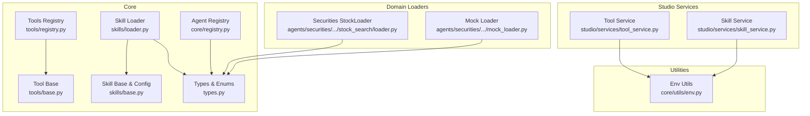
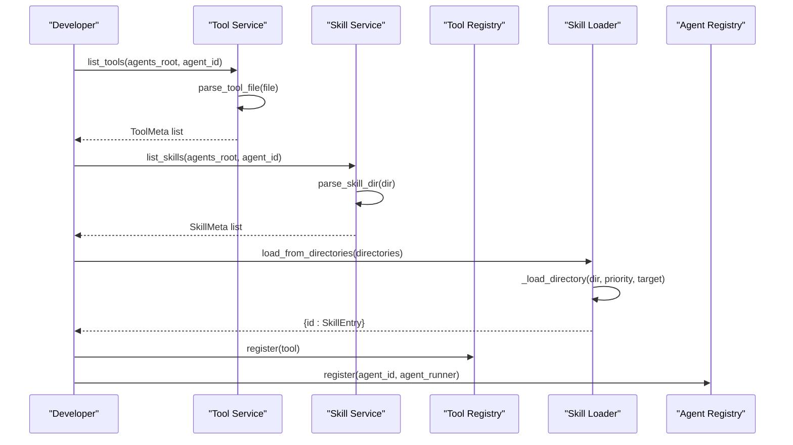
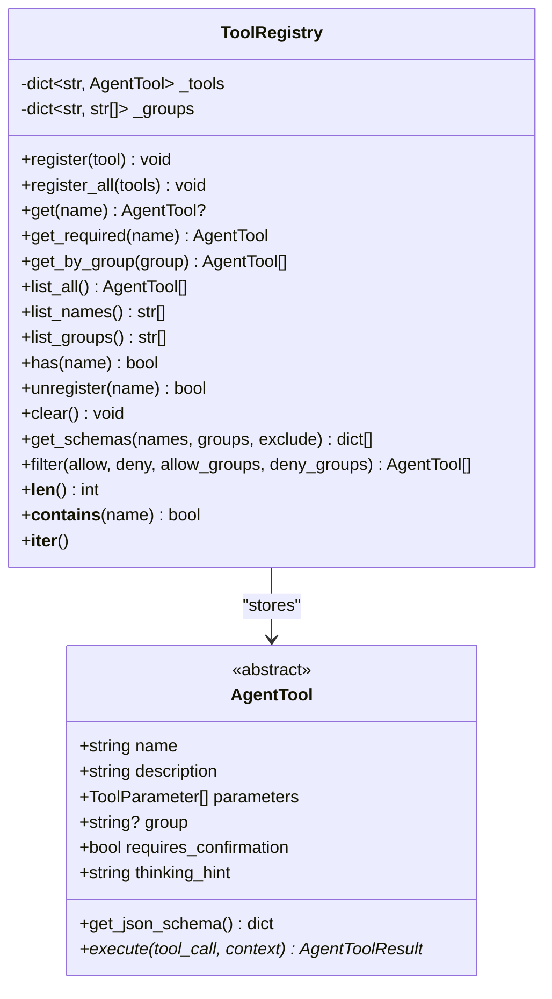
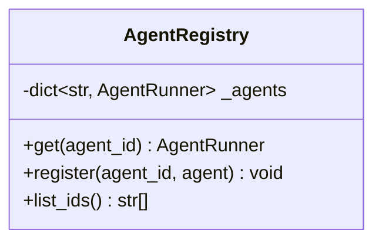
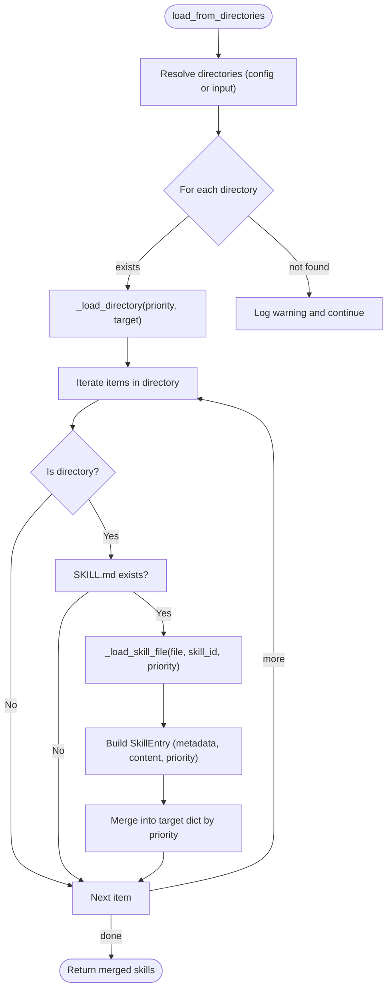
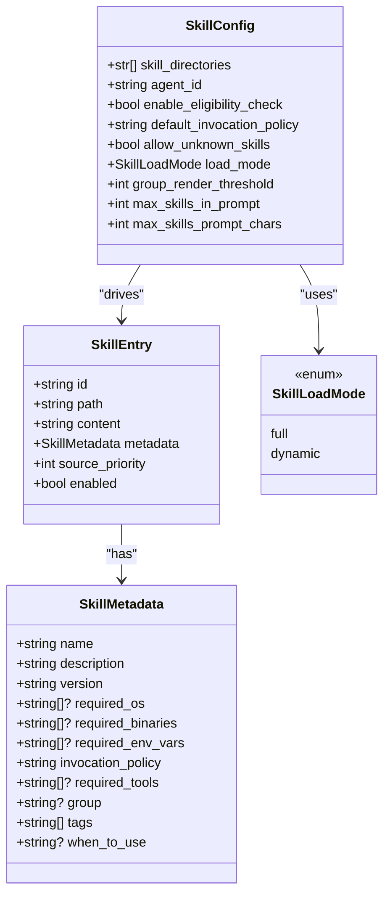
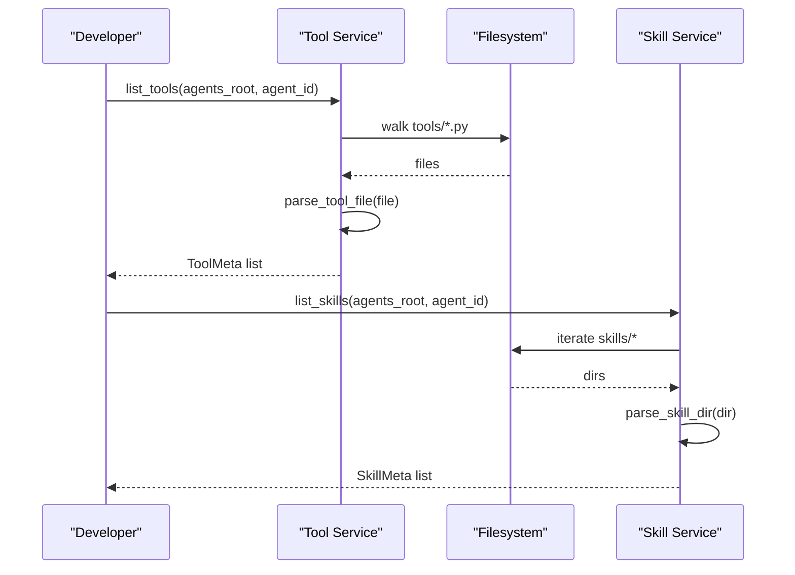
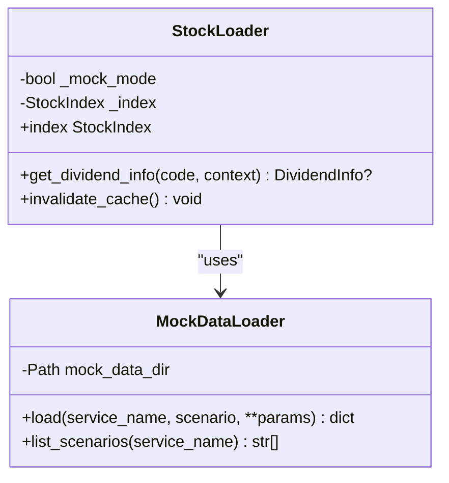
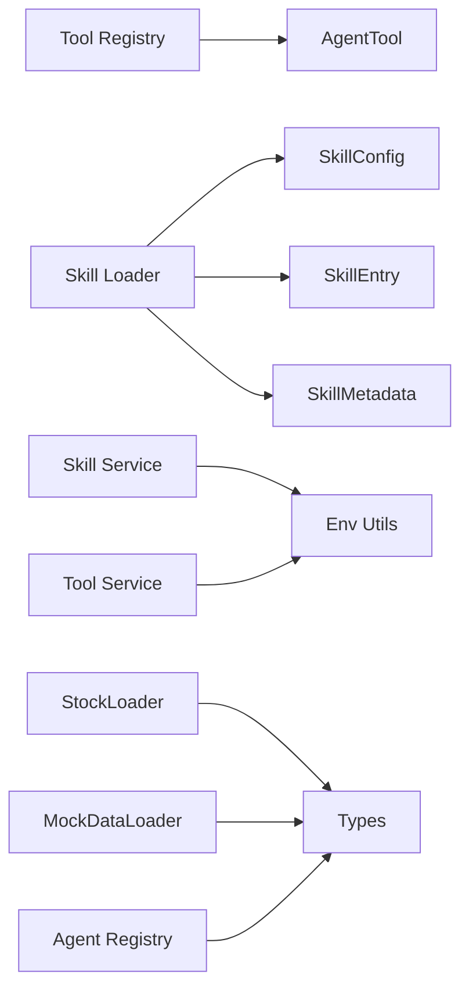

# Registry and Loader Systems

<cite>
**Referenced Files in This Document**
- [registry.py](file://src/ark_agentic/core/tools/registry.py)
- [base.py](file://src/ark_agentic/core/tools/base.py)
- [loader.py](file://src/ark_agentic/core/skills/loader.py)
- [base.py](file://src/ark_agentic/core/skills/base.py)
- [types.py](file://src/ark_agentic/core/types.py)
- [registry.py](file://src/ark_agentic/core/registry.py)
- [tool_service.py](file://src/ark_agentic/studio/services/tool_service.py)
- [skill_service.py](file://src/ark_agentic/studio/services/skill_service.py)
- [env.py](file://src/ark_agentic/core/utils/env.py)
- [loader.py](file://src/ark_agentic/agents/securities/tools/service/stock_search/loader.py)
- [mock_loader.py](file://src/ark_agentic/agents/securities/tools/service/mock_loader.py)
- [SKILL.md](file://src/ark_agentic/agents/insurance/skills/withdraw_money/SKILL.md)
</cite>

## Table of Contents
1. [Introduction](#introduction)
2. [Project Structure](#project-structure)
3. [Core Components](#core-components)
4. [Architecture Overview](#architecture-overview)
5. [Detailed Component Analysis](#detailed-component-analysis)
6. [Dependency Analysis](#dependency-analysis)
7. [Performance Considerations](#performance-considerations)
8. [Troubleshooting Guide](#troubleshooting-guide)
9. [Conclusion](#conclusion)
10. [Appendices](#appendices)

## Introduction
This document explains the centralized registry and loader systems that manage tools and skills in the project. It covers:
- Centralized registries for tools and agents
- Skill loader implementation with frontmatter parsing, priority-based overrides, and filtering
- Registration patterns, discovery mechanisms, and lookup workflows
- Practical examples for extending registries, implementing custom loaders, and scaling to large catalogs
- Performance optimizations, memory management, and concurrent access patterns
- Maintenance, cleanup, and troubleshooting guidance

## Project Structure
The registry and loader systems span several modules:
- Tools: registry and base tool definitions
- Skills: loader, configuration, eligibility checks, and rendering helpers
- Agent registry for runtime instances
- Studio services for tool/skill CRUD and parsing
- Utilities for environment-aware path resolution
- Example domain-specific loaders (mock and caching)

**Diagram sources**
- [registry.py:14-178](file://src/ark_agentic/core/tools/registry.py#L14-L178)
- [base.py:46-114](file://src/ark_agentic/core/tools/base.py#L46-L114)
- [loader.py:25-177](file://src/ark_agentic/core/skills/loader.py#L25-L177)
- [base.py:19-50](file://src/ark_agentic/core/skills/base.py#L19-L50)
- [types.py:234-325](file://src/ark_agentic/core/types.py#L234-L325)
- [registry.py:13-29](file://src/ark_agentic/core/registry.py#L13-L29)
- [tool_service.py:40-177](file://src/ark_agentic/studio/services/tool_service.py#L40-L177)
- [skill_service.py:42-279](file://src/ark_agentic/studio/services/skill_service.py#L42-L279)
- [env.py:9-59](file://src/ark_agentic/core/utils/env.py#L9-L59)
- [loader.py:74-138](file://src/ark_agentic/agents/securities/tools/service/stock_search/loader.py#L74-L138)
- [mock_loader.py:17-105](file://src/ark_agentic/agents/securities/tools/service/mock_loader.py#L17-L105)

**Section sources**
- [registry.py:14-178](file://src/ark_agentic/core/tools/registry.py#L14-L178)
- [loader.py:25-177](file://src/ark_agentic/core/skills/loader.py#L25-L177)
- [base.py:19-50](file://src/ark_agentic/core/skills/base.py#L19-L50)
- [types.py:234-325](file://src/ark_agentic/core/types.py#L234-L325)
- [registry.py:13-29](file://src/ark_agentic/core/registry.py#L13-L29)
- [tool_service.py:40-177](file://src/ark_agentic/studio/services/tool_service.py#L40-L177)
- [skill_service.py:42-279](file://src/ark_agentic/studio/services/skill_service.py#L42-L279)
- [env.py:9-59](file://src/ark_agentic/core/utils/env.py#L9-L59)
- [loader.py:74-138](file://src/ark_agentic/agents/securities/tools/service/stock_search/loader.py#L74-L138)
- [mock_loader.py:17-105](file://src/ark_agentic/agents/securities/tools/service/mock_loader.py#L17-L105)

## Core Components
- Tool Registry: central registry for AgentTool instances with group-aware lookup, filtering, and schema generation
- Agent Registry: stores AgentRunner instances keyed by agent_id
- Skill Loader: loads SKILL.md entries from directories, parses frontmatter, merges metadata, and supports priority-based overrides
- Skill Base & Config: defines SkillConfig, eligibility checks, inclusion policies, and prompt formatting helpers
- Types: shared dataclasses/enums for tools, skills, and run options
- Studio Services: tool/skill CRUD and AST-based parsing for development-time tool scaffolding and skill inspection
- Domain Loaders: example loaders with caching and mock strategies

Key responsibilities:
- Tool registration and discovery via ToolRegistry
- Skill catalog construction and filtering via SkillLoader and SkillConfig
- Environment-aware path resolution via env utilities
- Development-time tool/skill introspection and scaffolding via Studio services

**Section sources**
- [registry.py:14-178](file://src/ark_agentic/core/tools/registry.py#L14-L178)
- [registry.py:13-29](file://src/ark_agentic/core/registry.py#L13-L29)
- [loader.py:25-177](file://src/ark_agentic/core/skills/loader.py#L25-L177)
- [base.py:19-50](file://src/ark_agentic/core/skills/base.py#L19-L50)
- [types.py:234-325](file://src/ark_agentic/core/types.py#L234-L325)
- [tool_service.py:40-177](file://src/ark_agentic/studio/services/tool_service.py#L40-L177)
- [skill_service.py:42-279](file://src/ark_agentic/studio/services/skill_service.py#L42-L279)
- [env.py:9-59](file://src/ark_agentic/core/utils/env.py#L9-L59)

## Architecture Overview
The system separates concerns across modules:
- Runtime registries (tools, agents) for discovery and execution
- Loader subsystems for building catalogs (skills) and parsing structured metadata
- Studio services for developer ergonomics (tool/skill CRUD and parsing)
- Utilities for robust path resolution and environment handling
- Domain loaders demonstrate caching and mock strategies

**Diagram sources**
- [tool_service.py:40-177](file://src/ark_agentic/studio/services/tool_service.py#L40-L177)
- [skill_service.py:42-279](file://src/ark_agentic/studio/services/skill_service.py#L42-L279)
- [loader.py:35-84](file://src/ark_agentic/core/skills/loader.py#L35-L84)
- [registry.py:24-40](file://src/ark_agentic/core/tools/registry.py#L24-L40)
- [registry.py:24-25](file://src/ark_agentic/core/registry.py#L24-L25)

## Detailed Component Analysis

### Tool Registry
The Tool Registry manages AgentTool instances with:
- Registration and batch registration
- Lookup by name and group
- Filtering and schema generation for function-calling
- Unregistration and clearing
- Iteration and membership testing

**Diagram sources**
- [registry.py:14-178](file://src/ark_agentic/core/tools/registry.py#L14-L178)
- [base.py:46-114](file://src/ark_agentic/core/tools/base.py#L46-L114)

**Section sources**
- [registry.py:14-178](file://src/ark_agentic/core/tools/registry.py#L14-L178)
- [base.py:46-114](file://src/ark_agentic/core/tools/base.py#L46-L114)

### Agent Registry
The Agent Registry stores AgentRunner instances keyed by agent_id, enabling runtime lookup and lifecycle management.

**Diagram sources**
- [registry.py:13-29](file://src/ark_agentic/core/registry.py#L13-L29)

**Section sources**
- [registry.py:13-29](file://src/ark_agentic/core/registry.py#L13-L29)

### Skill Loader
The Skill Loader builds a catalog from multiple directories, parsing SKILL.md frontmatter and merging entries by source priority. It supports:
- Loading from ordered directories
- Frontmatter parsing and metadata construction
- Priority-based deduplication and override
- Listing and retrieval of skills
- Reload capability

**Diagram sources**
- [loader.py:35-84](file://src/ark_agentic/core/skills/loader.py#L35-L84)
- [loader.py:85-107](file://src/ark_agentic/core/skills/loader.py#L85-L107)
- [loader.py:109-130](file://src/ark_agentic/core/skills/loader.py#L109-L130)
- [loader.py:131-154](file://src/ark_agentic/core/skills/loader.py#L131-L154)

**Section sources**
- [loader.py:25-177](file://src/ark_agentic/core/skills/loader.py#L25-L177)

### Skill Base and Configuration
SkillConfig controls loading behavior, eligibility checks, and prompt formatting. Eligibility checks validate OS, binaries, environment variables, and required tools. Prompt formatting supports both flat and grouped XML rendering with budgeting.

**Diagram sources**
- [base.py:19-50](file://src/ark_agentic/core/skills/base.py#L19-L50)
- [types.py:234-325](file://src/ark_agentic/core/types.py#L234-L325)

**Section sources**
- [base.py:19-50](file://src/ark_agentic/core/skills/base.py#L19-L50)
- [types.py:234-325](file://src/ark_agentic/core/types.py#L234-L325)

### Studio Services: Tool and Skill Management
Studio services provide:
- Tool listing and scaffolding via AST parsing
- Skill CRUD and parsing with frontmatter extraction
- Safe path resolution and slugification

**Diagram sources**
- [tool_service.py:40-177](file://src/ark_agentic/studio/services/tool_service.py#L40-L177)
- [skill_service.py:42-279](file://src/ark_agentic/studio/services/skill_service.py#L42-L279)
- [env.py:38-59](file://src/ark_agentic/core/utils/env.py#L38-L59)

**Section sources**
- [tool_service.py:40-177](file://src/ark_agentic/studio/services/tool_service.py#L40-L177)
- [skill_service.py:42-279](file://src/ark_agentic/studio/services/skill_service.py#L42-L279)
- [env.py:38-59](file://src/ark_agentic/core/utils/env.py#L38-L59)

### Domain Loaders: Caching and Mock Strategies
Domain loaders demonstrate:
- Process-level caching with LRU caches
- Mock data loading with fallback strategies
- Context-aware mock mode selection

**Diagram sources**
- [loader.py:74-138](file://src/ark_agentic/agents/securities/tools/service/stock_search/loader.py#L74-L138)
- [mock_loader.py:17-105](file://src/ark_agentic/agents/securities/tools/service/mock_loader.py#L17-L105)

**Section sources**
- [loader.py:74-138](file://src/ark_agentic/agents/securities/tools/service/stock_search/loader.py#L74-L138)
- [mock_loader.py:17-105](file://src/ark_agentic/agents/securities/tools/service/mock_loader.py#L17-L105)

## Dependency Analysis
- Tool Registry depends on AgentTool for schema generation and execution
- Skill Loader depends on SkillConfig, SkillEntry, and SkillMetadata
- Studio services depend on env utilities for path resolution
- Domain loaders depend on types for shared models and enums
- Agent Registry depends on AgentRunner types (referenced in module docstring)

**Diagram sources**
- [registry.py:14-178](file://src/ark_agentic/core/tools/registry.py#L14-L178)
- [base.py:46-114](file://src/ark_agentic/core/tools/base.py#L46-L114)
- [loader.py:25-177](file://src/ark_agentic/core/skills/loader.py#L25-L177)
- [base.py:19-50](file://src/ark_agentic/core/skills/base.py#L19-L50)
- [types.py:234-325](file://src/ark_agentic/core/types.py#L234-L325)
- [tool_service.py:40-177](file://src/ark_agentic/studio/services/tool_service.py#L40-L177)
- [skill_service.py:42-279](file://src/ark_agentic/studio/services/skill_service.py#L42-L279)
- [env.py:9-59](file://src/ark_agentic/core/utils/env.py#L9-L59)
- [loader.py:74-138](file://src/ark_agentic/agents/securities/tools/service/stock_search/loader.py#L74-L138)
- [mock_loader.py:17-105](file://src/ark_agentic/agents/securities/tools/service/mock_loader.py#L17-L105)
- [registry.py:13-29](file://src/ark_agentic/core/registry.py#L13-L29)

**Section sources**
- [registry.py:14-178](file://src/ark_agentic/core/tools/registry.py#L14-L178)
- [loader.py:25-177](file://src/ark_agentic/core/skills/loader.py#L25-L177)
- [base.py:19-50](file://src/ark_agentic/core/skills/base.py#L19-L50)
- [types.py:234-325](file://src/ark_agentic/core/types.py#L234-L325)
- [tool_service.py:40-177](file://src/ark_agentic/studio/services/tool_service.py#L40-L177)
- [skill_service.py:42-279](file://src/ark_agentic/studio/services/skill_service.py#L42-L279)
- [env.py:9-59](file://src/ark_agentic/core/utils/env.py#L9-L59)
- [loader.py:74-138](file://src/ark_agentic/agents/securities/tools/service/stock_search/loader.py#L74-L138)
- [mock_loader.py:17-105](file://src/ark_agentic/agents/securities/tools/service/mock_loader.py#L17-L105)
- [registry.py:13-29](file://src/ark_agentic/core/registry.py#L13-L29)

## Performance Considerations
- Tool Registry
  - O(1) average-case lookups by name and group membership stored in hash maps
  - Schema generation and filtering operate over registered sets; keep registrations minimal and targeted
- Skill Loader
  - Directory scanning is linear in number of items; prioritize fewer, well-structured directories
  - Frontmatter parsing uses regex and YAML; avoid malformed SKILL.md files to prevent repeated failures
  - Priority-based merge ensures latest priority wins; order directories carefully to minimize overrides
- Prompt Formatting
  - Budgeting uses binary search to truncate; keep thresholds aligned with token budgets
  - Grouped vs flat rendering toggled by threshold; tune for UI readability and token limits
- Domain Loaders
  - LRU caches reduce repeated IO; invalidate caches during hot-reloads or tests
  - Mock loaders provide deterministic responses; ensure default fallbacks exist

[No sources needed since this section provides general guidance]

## Troubleshooting Guide
Common issues and resolutions:
- Tool not found
  - Verify registration and name spelling; use required-accessor to raise explicit errors
  - Check group filters and membership
- Skill not loaded
  - Confirm SKILL.md exists under a directory; ensure frontmatter is valid YAML
  - Validate agent_id and directory ordering for priority overrides
- Eligibility failures
  - Check OS, binaries, environment variables, and required tools availability
  - Adjust context to expose available tools
- Path resolution errors
  - Ensure AGENTS_ROOT is set or project layout matches expected structure
  - Use resolve_agent_dir to validate agent directories
- Mock loader warnings
  - Confirm mock data directory exists; create default files if missing
  - Use list_scenarios to discover available scenarios

**Section sources**
- [registry.py:45-50](file://src/ark_agentic/core/tools/registry.py#L45-L50)
- [loader.py:53-55](file://src/ark_agentic/core/skills/loader.py#L53-L55)
- [base.py:51-101](file://src/ark_agentic/core/skills/base.py#L51-L101)
- [env.py:38-59](file://src/ark_agentic/core/utils/env.py#L38-L59)
- [mock_loader.py:20-30](file://src/ark_agentic/agents/securities/tools/service/mock_loader.py#L20-L30)

## Conclusion
The registry and loader systems provide a robust foundation for managing tools and skills:
- Centralized registries enable fast discovery and controlled exposure
- Skill loader supports structured, frontmatter-driven catalogs with priority-based overrides
- Studio services streamline development workflows
- Domain loaders illustrate caching and mock strategies for production-grade performance and reliability

Adopt the recommended patterns for registration, filtering, and prompt formatting to scale effectively and maintain high performance.

[No sources needed since this section summarizes without analyzing specific files]

## Appendices

### Practical Examples

- Extending the Tool Registry
  - Register tools programmatically or via batch registration
  - Use group-aware filtering for policy-based exposure
  - Generate JSON schemas for function-calling integrations

  **Section sources**
  - [registry.py:24-40](file://src/ark_agentic/core/tools/registry.py#L24-L40)
  - [registry.py:130-169](file://src/ark_agentic/core/tools/registry.py#L130-L169)
  - [base.py:76-98](file://src/ark_agentic/core/tools/base.py#L76-L98)

- Implementing a Custom Skill Loader
  - Subclass or compose a loader similar to SkillLoader
  - Parse frontmatter and construct SkillEntry with metadata
  - Respect priority and apply overrides consistently

  **Section sources**
  - [loader.py:25-177](file://src/ark_agentic/core/skills/loader.py#L25-L177)
  - [base.py:131-154](file://src/ark_agentic/core/skills/base.py#L131-L154)

- Managing Large-Scale Catalogs
  - Split directories by domain or team ownership
  - Use grouping and tags for discoverability
  - Tune thresholds and budgets for prompt formatting
  - Employ caching and lazy initialization for heavy resources

  **Section sources**
  - [loader.py:35-61](file://src/ark_agentic/core/skills/loader.py#L35-L61)
  - [base.py:245-325](file://src/ark_agentic/core/skills/base.py#L245-L325)

- Registry Maintenance and Cleanup
  - Periodically clear stale registrations
  - Remove unused directories and orphaned SKILL.md files
  - Validate eligibility preconditions regularly

  **Section sources**
  - [registry.py:89-93](file://src/ark_agentic/core/tools/registry.py#L89-L93)
  - [loader.py:168-170](file://src/ark_agentic/core/skills/loader.py#L168-L170)

- Example Skill Entry (Insurance Withdraw Money)
  - Demonstrates frontmatter fields, required tools, and invocation policy

  **Section sources**
  - [SKILL.md:1-15](file://src/ark_agentic/agents/insurance/skills/withdraw_money/SKILL.md#L1-L15)