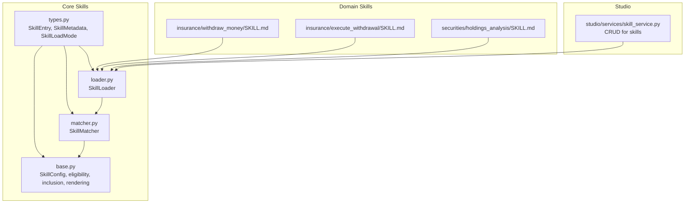
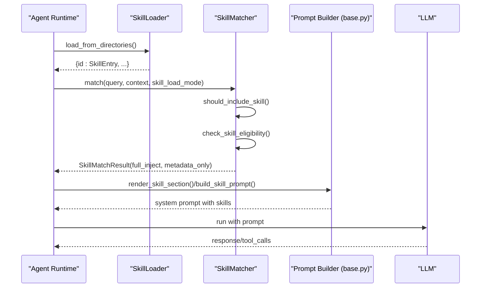
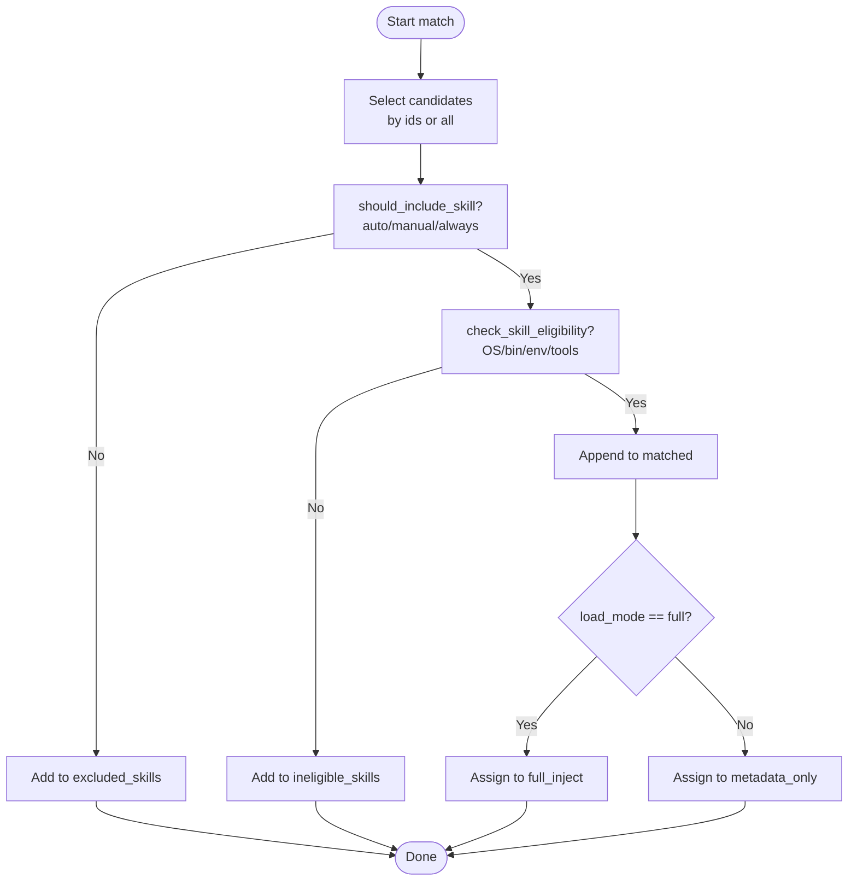
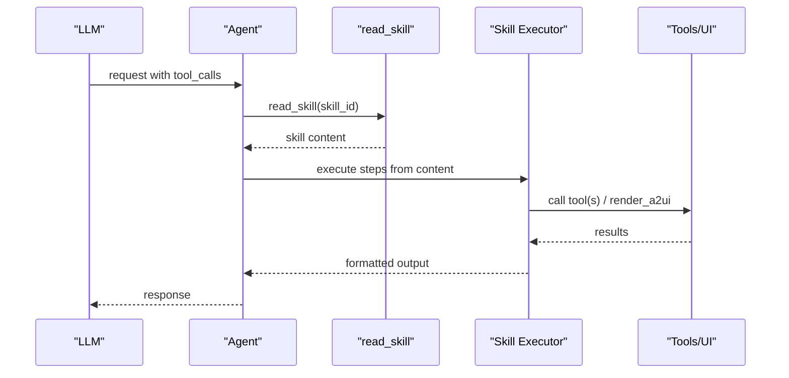
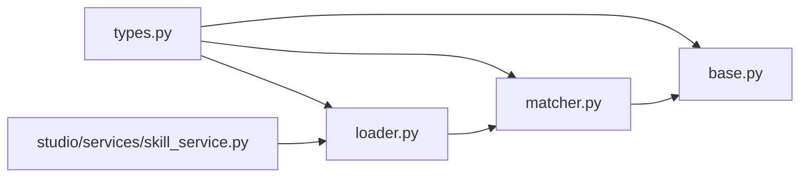

# Skills Development

<cite>
**Referenced Files in This Document**
- [base.py](file://src/ark_agentic/core/skills/base.py)
- [loader.py](file://src/ark_agentic/core/skills/loader.py)
- [matcher.py](file://src/ark_agentic/core/skills/matcher.py)
- [types.py](file://src/ark_agentic/core/types.py)
- [skill_service.py](file://src/ark_agentic/studio/services/skill_service.py)
- [execute_withdrawal/SKILL.md](file://src/ark_agentic/agents/insurance/skills/execute_withdrawal/SKILL.md)
- [withdraw_money/SKILL.md](file://src/ark_agentic/agents/insurance/skills/withdraw_money/SKILL.md)
- [holdings_analysis/SKILL.md](file://src/ark_agentic/agents/securities/skills/holdings_analysis/SKILL.md)
- [test_runner_skill_load_mode.py](file://tests/unit/core/test_runner_skill_load_mode.py)
- [test_skills.py](file://tests/unit/core/test_skills.py)
- [test_read_skill_tool.py](file://tests/unit/core/test_read_skill_tool.py)
- [test_asset_overview_skill.py](file://tests/unit/skills/test_asset_overview_skill.py)
- [README.md](file://tests/skills/README.md)
</cite>

## Table of Contents
1. [Introduction](#introduction)
2. [Project Structure](#project-structure)
3. [Core Components](#core-components)
4. [Architecture Overview](#architecture-overview)
5. [Detailed Component Analysis](#detailed-component-analysis)
6. [Dependency Analysis](#dependency-analysis)
7. [Performance Considerations](#performance-considerations)
8. [Troubleshooting Guide](#troubleshooting-guide)
9. [Conclusion](#conclusion)
10. [Appendices](#appendices)

## Introduction
This document describes the skills development system used to define, load, filter, and execute domain-specific capabilities within agents. It covers the Skill base class architecture, skill configuration format, execution patterns, loading modes (full, dynamic, semantic), matching and resolution strategies, best practices, and testing/evaluation approaches. Practical examples demonstrate creating domain-specific skills, composing skills, validating parameters, formatting results, and integrating skills into agent workflows.

## Project Structure
The skills system is centered around three core modules:
- Loader: discovers and parses SKILL.md files with YAML frontmatter into SkillEntry objects.
- Matcher: filters and groups skills according to eligibility, invocation policy, and load mode.
- Base: renders skill prompts for both full-injection and metadata-only injection modes, and applies budgeting controls.

Supporting types define SkillEntry, SkillMetadata, and SkillLoadMode. The Studio skill service provides CRUD operations for skills under an agent’s skills directory. Example skills illustrate real-world usage in domains such as insurance and securities.

**Diagram sources**
- [types.py:234-300](file://src/ark_agentic/core/types.py#L234-L300)
- [loader.py:25-177](file://src/ark_agentic/core/skills/loader.py#L25-L177)
- [matcher.py:55-152](file://src/ark_agentic/core/skills/matcher.py#L55-L152)
- [base.py:19-325](file://src/ark_agentic/core/skills/base.py#L19-L325)
- [skill_service.py:42-289](file://src/ark_agentic/studio/services/skill_service.py#L42-L289)
- [withdraw_money/SKILL.md:1-270](file://src/ark_agentic/agents/insurance/skills/withdraw_money/SKILL.md#L1-L270)
- [execute_withdrawal/SKILL.md:1-180](file://src/ark_agentic/agents/insurance/skills/execute_withdrawal/SKILL.md#L1-L180)
- [holdings_analysis/SKILL.md:1-243](file://src/ark_agentic/agents/securities/skills/holdings_analysis/SKILL.md#L1-L243)

**Section sources**
- [types.py:234-300](file://src/ark_agentic/core/types.py#L234-L300)
- [loader.py:25-177](file://src/ark_agentic/core/skills/loader.py#L25-L177)
- [matcher.py:55-152](file://src/ark_agentic/core/skills/matcher.py#L55-L152)
- [base.py:19-325](file://src/ark_agentic/core/skills/base.py#L19-L325)
- [skill_service.py:42-289](file://src/ark_agentic/studio/services/skill_service.py#L42-L289)

## Core Components
- SkillConfig: Controls skill directories, agent-scoped IDs, eligibility checks, invocation policy defaults, load mode, grouping thresholds, and prompt budgets.
- SkillLoader: Scans directories for SKILL.md files, parses YAML frontmatter, merges “when to use” into description, constructs SkillEntry, and resolves priority-based overrides.
- SkillMatcher: Filters skills by invocation policy and eligibility, then assigns them to full_inject or metadata_only based on load mode.
- Prompt rendering: Formats skills as XML lists (flat or grouped), applies budget caps, and injects instructions for metadata-only mode.

Key behaviors:
- Eligibility checks include OS, binaries, environment variables, and required tools present in context.
- Inclusion decisions support auto/manual/always policies; manual requires explicit request via context.
- Rendering supports two modes:
  - full: injects full skill bodies into system prompt.
  - dynamic: injects metadata list plus instructions to call read_skill per request.

**Section sources**
- [base.py:19-325](file://src/ark_agentic/core/skills/base.py#L19-L325)
- [loader.py:25-177](file://src/ark_agentic/core/skills/loader.py#L25-L177)
- [matcher.py:55-152](file://src/ark_agentic/core/skills/matcher.py#L55-L152)
- [types.py:234-300](file://src/ark_agentic/core/types.py#L234-L300)

## Architecture Overview
The skills pipeline integrates loader, matcher, and base rendering into agent runtime prompts. The Studio skill service enables authoring and maintenance of skills under agent directories.

**Diagram sources**
- [loader.py:35-61](file://src/ark_agentic/core/skills/loader.py#L35-L61)
- [matcher.py:64-126](file://src/ark_agentic/core/skills/matcher.py#L64-L126)
- [base.py:285-325](file://src/ark_agentic/core/skills/base.py#L285-L325)

## Detailed Component Analysis

### Skill Configuration Format
Skills are authored as SKILL.md with a YAML frontmatter block. Loader parses frontmatter into SkillMetadata and merges “when to use” into description. The Studio skill service also supports generating SKILL.md with frontmatter and content.

- Required frontmatter keys: name, description.
- Optional keys: version, required_os, required_binaries, required_env_vars, invocation_policy, required_tools, group, tags, when_to_use.
- Loader builds SkillEntry with id, path, content, metadata, source_priority, enabled.

Best practices:
- Keep description concise; use when_to_use to capture intent triggers.
- Use group and tags for logical organization and filtering.
- Set invocation_policy to align with desired triggering behavior.

**Section sources**
- [loader.py:109-154](file://src/ark_agentic/core/skills/loader.py#L109-L154)
- [types.py:234-290](file://src/ark_agentic/core/types.py#L234-L290)
- [skill_service.py:187-207](file://src/ark_agentic/studio/services/skill_service.py#L187-L207)

### Skill Loading Modes
- full: Injects full skill bodies into the system prompt.
- dynamic: Injects only metadata and instructions to call read_skill later.
- semantic: Not implemented in the referenced code; see “Semantic” below.

Behavioral differences validated by tests:
- Dynamic mode registers read_skill and injects business protocol plus metadata list.
- Full mode injects full skill bodies.

**Section sources**
- [base.py:285-325](file://src/ark_agentic/core/skills/base.py#L285-L325)
- [test_runner_skill_load_mode.py:107-146](file://tests/unit/core/test_runner_skill_load_mode.py#L107-L146)
- [test_skills.py:611-640](file://tests/unit/core/test_skills.py#L611-L640)

### Skill Matching Algorithms
- Invocation policy filtering: auto/manual/always.
- Eligibility filtering: OS/binaries/env/required_tools.
- Load mode assignment: full_inject vs metadata_only.
- Tag/group helpers: get_skill_by_tag/get_skill_by_group.

**Diagram sources**
- [matcher.py:64-126](file://src/ark_agentic/core/skills/matcher.py#L64-L126)
- [base.py:104-138](file://src/ark_agentic/core/skills/base.py#L104-L138)

**Section sources**
- [matcher.py:55-152](file://src/ark_agentic/core/skills/matcher.py#L55-L152)
- [base.py:51-138](file://src/ark_agentic/core/skills/base.py#L51-L138)

### Skill Resolution Strategies
- Priority-based override: Later directories with same id override earlier ones based on source_priority.
- Budget-aware rendering: Limits by count and character length; truncates with a hint when exceeding limits.
- Grouping: Renders flat XML for small sets, grouped XML for larger sets.

**Section sources**
- [loader.py:77-84](file://src/ark_agentic/core/skills/loader.py#L77-L84)
- [base.py:210-243](file://src/ark_agentic/core/skills/base.py#L210-L243)
- [base.py:192-207](file://src/ark_agentic/core/skills/base.py#L192-L207)

### Skill Execution Patterns
- read_skill tool: In dynamic mode, LLM requests a specific skill body via read_skill to execute.
- Domain skills orchestrate tools and UI components:
  - Insurance: withdraw_money orchestrates rule_engine, customer_info, and render_a2ui; execute_withdrawal submits via submit_withdrawal.
  - Securities: holdings_analysis routes intent to etf_holdings, hksc_holdings, fund_holdings, and render_a2ui.

**Diagram sources**
- [base.py:156-164](file://src/ark_agentic/core/skills/base.py#L156-L164)
- [execute_withdrawal/SKILL.md:14-83](file://src/ark_agentic/agents/insurance/skills/execute_withdrawal/SKILL.md#L14-L83)
- [holdings_analysis/SKILL.md:127-196](file://src/ark_agentic/agents/securities/skills/holdings_analysis/SKILL.md#L127-L196)

**Section sources**
- [base.py:156-164](file://src/ark_agentic/core/skills/base.py#L156-L164)
- [execute_withdrawal/SKILL.md:14-180](file://src/ark_agentic/agents/insurance/skills/execute_withdrawal/SKILL.md#L14-L180)
- [withdraw_money/SKILL.md:17-270](file://src/ark_agentic/agents/insurance/skills/withdraw_money/SKILL.md#L17-L270)
- [holdings_analysis/SKILL.md:198-243](file://src/ark_agentic/agents/securities/skills/holdings_analysis/SKILL.md#L198-L243)

### Practical Examples

#### Creating a Domain-Specific Skill (Securities Holdings)
- Define SKILL.md with frontmatter (name, description, tags, required_tools).
- Implement intent parsing and routing (MODE_CARD vs MODE_TEXT).
- Enforce tool ordering and safety constraints (no concurrency, no reuse of cached data).
- Render UI cards via render_a2ui and summarize results appropriately.

**Section sources**
- [holdings_analysis/SKILL.md:1-243](file://src/ark_agentic/agents/securities/skills/holdings_analysis/SKILL.md#L1-L243)

#### Implementing Skill Hierarchies (Insurance Withdrawal)
- withdraw_money: high-level orchestration of rule_engine, customer_info, and render_a2ui.
- execute_withdrawal: low-level execution via submit_withdrawal with strict decision flow and STOP constraints.

**Section sources**
- [withdraw_money/SKILL.md:17-270](file://src/ark_agentic/agents/insurance/skills/withdraw_money/SKILL.md#L17-L270)
- [execute_withdrawal/SKILL.md:14-180](file://src/ark_agentic/agents/insurance/skills/execute_withdrawal/SKILL.md#L14-L180)

#### Integrating Skills into Agent Workflows
- Use SkillMatcher to select applicable skills per query and context.
- Use SkillLoader to discover and parse skills from configured directories.
- Use read_skill to fetch skill bodies on demand in dynamic mode.

**Section sources**
- [matcher.py:64-126](file://src/ark_agentic/core/skills/matcher.py#L64-L126)
- [loader.py:35-61](file://src/ark_agentic/core/skills/loader.py#L35-L61)
- [base.py:285-325](file://src/ark_agentic/core/skills/base.py#L285-L325)

### Skill Selection Criteria and Execution Contexts
- Invocation policy: auto (default), manual (requires explicit request), always.
- Eligibility: OS/platform, required binaries, environment variables, required tools in context.
- Context keys influencing selection: requested_skills for manual policy.
- Execution context: availability of tools, environment, and prior tool results (e.g., previous submit_withdrawal results).

**Section sources**
- [base.py:104-138](file://src/ark_agentic/core/skills/base.py#L104-L138)
- [base.py:51-101](file://src/ark_agentic/core/skills/base.py#L51-L101)
- [execute_withdrawal/SKILL.md:46-83](file://src/ark_agentic/agents/insurance/skills/execute_withdrawal/SKILL.md#L46-L83)

### Best Practices
- Composition: Prefer higher-level orchestrators (e.g., withdraw_money) delegating to lower-level executors (e.g., execute_withdrawal).
- Parameter validation: Validate tool arguments and enforce STOP constraints after invoking tools that trigger external flows.
- Result formatting: Use render_a2ui for UI-centric outputs; keep text summaries concise and structured.
- Performance optimization: Use dynamic mode to reduce prompt size; apply budget caps; avoid redundant tool calls; group skills for readability.

**Section sources**
- [execute_withdrawal/SKILL.md:171-180](file://src/ark_agentic/agents/insurance/skills/execute_withdrawal/SKILL.md#L171-L180)
- [holdings_analysis/SKILL.md:198-243](file://src/ark_agentic/agents/securities/skills/holdings_analysis/SKILL.md#L198-L243)
- [base.py:210-243](file://src/ark_agentic/core/skills/base.py#L210-L243)

## Dependency Analysis
- Loader depends on SkillConfig and types.SkillEntry/Metadata.
- Matcher depends on Loader and base utilities for eligibility and inclusion.
- Base depends on types.SkillLoadMode and SkillEntry for rendering.
- Studio skill_service depends on YAML parsing and file system utilities to manage SKILL.md.

**Diagram sources**
- [types.py:234-300](file://src/ark_agentic/core/types.py#L234-L300)
- [loader.py:25-177](file://src/ark_agentic/core/skills/loader.py#L25-L177)
- [matcher.py:55-152](file://src/ark_agentic/core/skills/matcher.py#L55-L152)
- [base.py:19-325](file://src/ark_agentic/core/skills/base.py#L19-L325)
- [skill_service.py:42-289](file://src/ark_agentic/studio/services/skill_service.py#L42-L289)

**Section sources**
- [types.py:234-300](file://src/ark_agentic/core/types.py#L234-L300)
- [loader.py:25-177](file://src/ark_agentic/core/skills/loader.py#L25-L177)
- [matcher.py:55-152](file://src/ark_agentic/core/skills/matcher.py#L55-L152)
- [base.py:19-325](file://src/ark_agentic/core/skills/base.py#L19-L325)
- [skill_service.py:42-289](file://src/ark_agentic/studio/services/skill_service.py#L42-L289)

## Performance Considerations
- Use dynamic mode to minimize prompt size and token usage.
- Apply max_skills_in_prompt and max_skills_prompt_chars to cap rendering.
- Prefer grouped XML for large skill sets to improve readability and reduce duplication.
- Avoid unnecessary tool calls; batch only when safe and required.

[No sources needed since this section provides general guidance]

## Troubleshooting Guide
Common issues and resolutions:
- Unknown skill id: read_skill returns an error; verify skill id and that it was loaded.
- Missing tools or environment: eligibility failure; ensure required_tools and environment variables are satisfied.
- Excessive prompt size: switch to dynamic mode or reduce skill count/thresholds.
- Incorrect load mode behavior: confirm SkillConfig.load_mode and tests for dynamic registration of read_skill.

Validation references:
- read_skill error handling and content retrieval.
- Dynamic mode prompt injection and read_skill instruction presence.
- Skills metadata-only rendering and full-body exclusion.

**Section sources**
- [test_read_skill_tool.py:39-68](file://tests/unit/core/test_read_skill_tool.py#L39-L68)
- [test_runner_skill_load_mode.py:107-146](file://tests/unit/core/test_runner_skill_load_mode.py#L107-L146)
- [test_skills.py:117-140](file://tests/unit/core/test_skills.py#L117-L140)

## Conclusion
The skills system provides a robust framework for authoring, loading, filtering, and executing domain-specific capabilities. By structuring skills with clear frontmatter, organizing them by group/tags, and leveraging dynamic mode for scalability, developers can build reliable agent workflows. Adhering to execution patterns, validation rules, and formatting guidelines ensures predictable behavior and maintainable systems.

[No sources needed since this section summarizes without analyzing specific files]

## Appendices

### Semantic Loading Mode
- The codebase defines SkillLoadMode with values full and dynamic. There is no semantic mode implementation in the referenced files.

**Section sources**
- [types.py:294-299](file://src/ark_agentic/core/types.py#L294-L299)

### Testing and Evaluation Methodologies
- Workspace-driven evaluations compare runs “with skill” vs “without skill.”
- Outputs include response text and tool calls; a static viewer is available to review results.
- Example evaluation script demonstrates toggling skill loader and capturing outputs.

**Section sources**
- [README.md:1-28](file://tests/skills/README.md#L1-L28)
- [test_asset_overview_skill.py:20-103](file://tests/unit/skills/test_asset_overview_skill.py#L20-L103)