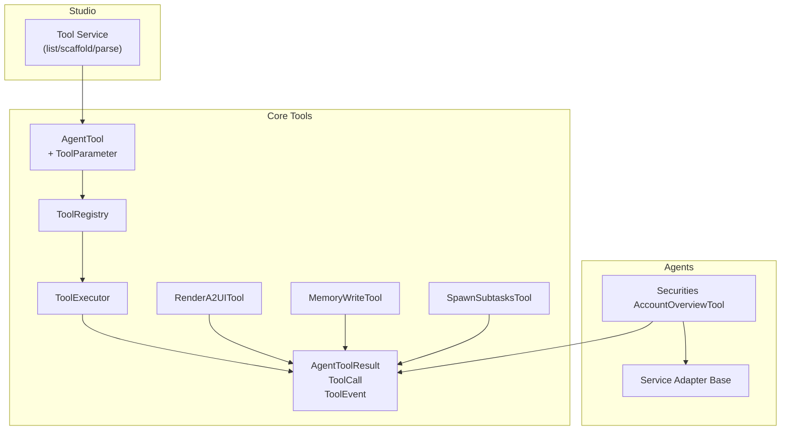
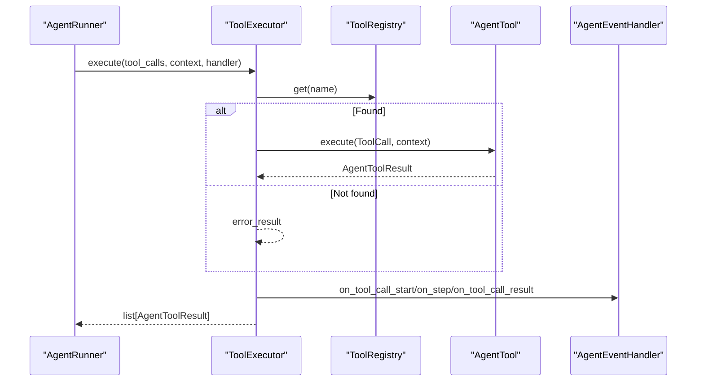
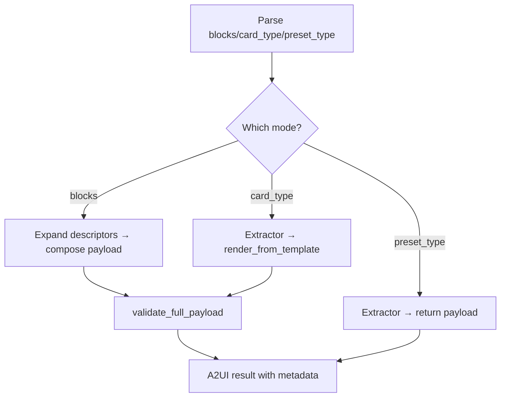
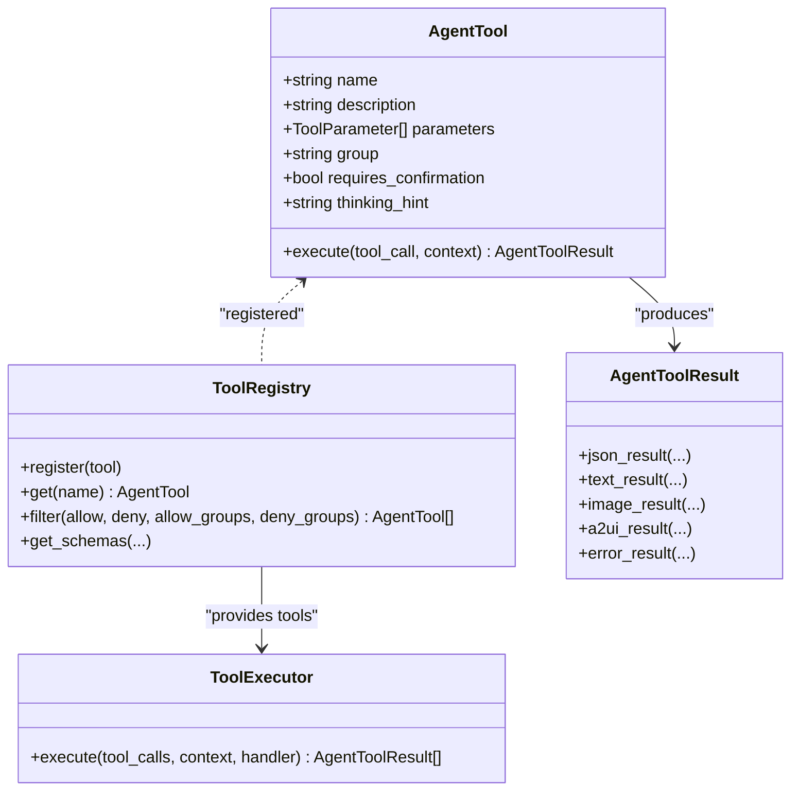

# Tools Development

<cite>
**Referenced Files in This Document**
- [base.py](file://src/ark_agentic/core/tools/base.py)
- [executor.py](file://src/ark_agentic/core/tools/executor.py)
- [registry.py](file://src/ark_agentic/core/tools/registry.py)
- [__init__.py](file://src/ark_agentic/core/tools/__init__.py)
- [types.py](file://src/ark_agentic/core/types.py)
- [memory.py](file://src/ark_agentic/core/tools/memory.py)
- [render_a2ui.py](file://src/ark_agentic/core/tools/render_a2ui.py)
- [demo_a2ui.py](file://src/ark_agentic/core/tools/demo_a2ui.py)
- [demo_state.py](file://src/ark_agentic/core/tools/demo_state.py)
- [tool.py](file://src/ark_agentic/core/subtask/tool.py)
- [account_overview.py](file://src/ark_agentic/agents/securities/tools/agent/account_overview.py)
- [base.py](file://src/ark_agentic/agents/securities/tools/service/base.py)
- [tool_service.py](file://src/ark_agentic/studio/services/tool_service.py)
</cite>

## Table of Contents
1. [Introduction](#introduction)
2. [Project Structure](#project-structure)
3. [Core Components](#core-components)
4. [Architecture Overview](#architecture-overview)
5. [Detailed Component Analysis](#detailed-component-analysis)
6. [Dependency Analysis](#dependency-analysis)
7. [Performance Considerations](#performance-considerations)
8. [Troubleshooting Guide](#troubleshooting-guide)
9. [Conclusion](#conclusion)
10. [Appendices](#appendices)

## Introduction
This document explains the tools development system used by the agent runtime. It covers the AgentTool base class architecture, tool lifecycle management, execution patterns, registration mechanisms, parameter validation, result formatting, error handling, and integration with memory and A2UI rendering. It also provides guidance on building custom tools across domains, concurrency strategies, composition techniques, debugging/testing, and best practices for performance and state management.

## Project Structure
The tools system is centered under core/tools and integrates with agent-specific tools, streaming/event bus, memory, and A2UI rendering. The high-level layout supports:
- Base tool abstractions and parameter helpers
- Tool registry and executor
- Domain-specific tools (e.g., securities)
- A2UI rendering tool supporting multiple modes
- Subtask spawning for parallel execution
- Studio tool scaffolding and introspection



**Diagram sources**
- [base.py:46-286](file://src/ark_agentic/core/tools/base.py#L46-L286)
- [registry.py:14-178](file://src/ark_agentic/core/tools/registry.py#L14-L178)
- [executor.py:29-123](file://src/ark_agentic/core/tools/executor.py#L29-L123)
- [types.py:44-187](file://src/ark_agentic/core/types.py#L44-L187)
- [render_a2ui.py:105-607](file://src/ark_agentic/core/tools/render_a2ui.py#L105-L607)
- [memory.py:39-113](file://src/ark_agentic/core/tools/memory.py#L39-L113)
- [tool.py:61-318](file://src/ark_agentic/core/subtask/tool.py#L61-L318)
- [account_overview.py:57-108](file://src/ark_agentic/agents/securities/tools/agent/account_overview.py#L57-L108)
- [base.py:38-212](file://src/ark_agentic/agents/securities/tools/service/base.py#L38-L212)
- [tool_service.py:40-235](file://src/ark_agentic/studio/services/tool_service.py#L40-L235)

**Section sources**
- [__init__.py:7-53](file://src/ark_agentic/core/tools/__init__.py#L7-L53)

## Core Components
- AgentTool: Abstract base class defining tool identity, parameters, JSON schema generation, and the asynchronous execute contract. Includes optional adapters to LangChain structured tools.
- ToolParameter: Defines parameter metadata and converts to JSON Schema.
- ToolRegistry: Central registry for tools and groups; supports filtering, schema generation, and lookup.
- ToolExecutor: Executes a batch of ToolCalls concurrently with timeouts, error handling, and event dispatch.
- AgentToolResult: Unified result container supporting JSON, text, image, A2UI, and error types, plus events and loop control.
- ToolCall: Request envelope for tool invocations.
- ToolEvent family: Events for UI components, custom business events, and step updates.

Key behaviors:
- Tool lifecycle: Registration → Execution → Result emission → Event distribution.
- Parameter validation: Tool-level parameter lists and helpers for robust parsing.
- Result formatting: Factory methods produce standardized results; A2UI results auto-generate UI events.
- Error handling: Centralized try/catch with timeouts and error results.

**Section sources**
- [base.py:46-286](file://src/ark_agentic/core/tools/base.py#L46-L286)
- [registry.py:14-178](file://src/ark_agentic/core/tools/registry.py#L14-L178)
- [executor.py:29-123](file://src/ark_agentic/core/tools/executor.py#L29-L123)
- [types.py:44-187](file://src/ark_agentic/core/types.py#L44-L187)

## Architecture Overview
The tools architecture separates concerns:
- Registry manages tool discovery and schema generation.
- Executor orchestrates execution, enforces limits, and dispatches events.
- Tools encapsulate domain logic and produce standardized results.
- A2UI rendering tool unifies three rendering modes and validates payloads.
- Memory tool persists incremental state deltas.
- Subtask tool spawns isolated, parallel sub-runs.



**Diagram sources**
- [executor.py:43-96](file://src/ark_agentic/core/tools/executor.py#L43-L96)
- [registry.py:41-50](file://src/ark_agentic/core/tools/registry.py#L41-L50)
- [types.py:69-98](file://src/ark_agentic/core/types.py#L69-L98)

## Detailed Component Analysis

### AgentTool Base Class and Parameter Helpers
- Responsibilities:
  - Define tool identity (name, description), optional group, confirmation flag, and thinking hint.
  - Build JSON Schema for function calling.
  - Provide execute contract returning AgentToolResult.
  - Optional LangChain adapter for structured tools.
- Parameter helpers:
  - Strongly-typed readers for strings, integers, floats, booleans, lists, and dicts with defaults and required variants.
  - Robust conversion with safe fallbacks.

Best practices:
- Always set name and description; derive parameters from ToolParameter list.
- Use parameter helpers to avoid manual coercion and improve reliability.
- Keep execute free of side effects; delegate IO to adapters/services.

**Section sources**
- [base.py:46-160](file://src/ark_agentic/core/tools/base.py#L46-L160)
- [base.py:166-286](file://src/ark_agentic/core/tools/base.py#L166-L286)

### ToolRegistry
- Features:
  - Register/unregister tools and maintain group membership.
  - List tools, names, groups; filter by allow/deny lists or groups.
  - Generate JSON Schemas for LLM function calling.
- Strategies:
  - Allow/deny filters for policy-driven tool exposure.
  - Group-based inclusion/exclusion.

**Section sources**
- [registry.py:14-178](file://src/ark_agentic/core/tools/registry.py#L14-L178)

### ToolExecutor
- Execution model:
  - Concurrency: gather over a capped subset of ToolCalls.
  - Timeouts: per-tool wait_for with error result on timeout.
  - Error handling: catch exceptions and wrap as error results.
  - Event dispatch: route UI components, custom events, and step updates.
- Controls:
  - Timeout and max calls per turn configurable.

```mermaid
flowchart TD
Start(["execute(tool_calls, context, handler)"]) --> Limit["Limit to max_calls_per_turn"]
Limit --> Gather["asyncio.gather(_execute_single for each)"]
Gather --> Dispatch["Dispatch events for each result"]
Dispatch --> Return(["Return results"])
subgraph "_execute_single(tc, ctx, handler)"]
Lookup["registry.get(tc.name)"] --> Found{"Found?"}
Found -- No --> ErrRes["error_result"]
Found -- Yes --> TryExec["wait_for(tool.execute(...))"]
TryExec --> Timeout{"Timeout?"}
Timeout -- Yes --> ErrRes2["error_result(timeout)"]
Timeout -- No --> OkRes["return result"]
end
```

**Diagram sources**
- [executor.py:43-96](file://src/ark_agentic/core/tools/executor.py#L43-L96)

**Section sources**
- [executor.py:29-123](file://src/ark_agentic/core/tools/executor.py#L29-L123)

### AgentToolResult and ToolCall
- AgentToolResult:
  - Factory methods for JSON, text, image, A2UI, and error.
  - Supports metadata, loop action control, and events.
  - A2UI results auto-generate UIComponentToolEvent entries.
- ToolCall:
  - Envelope with id, name, and arguments; helper to create with UUID.

Integration points:
- ToolExecutor maps results to UI events and custom events.
- Runner consumes loop actions to control ReAct iterations.

**Section sources**
- [types.py:69-187](file://src/ark_agentic/core/types.py#L69-L187)

### A2UI Rendering Tool (RenderA2UITool)
- Modes:
  - Blocks: dynamic composition via block descriptors.
  - Card type: template-driven rendering with extractors.
  - Preset type: direct frontend-ready payload.
- Dynamic parameters:
  - Parameters are generated based on enabled configs; mutually exclusive per call.
- Validation:
  - Validates full payload against A2UI contract; supports strict enforcement vs warnings.
- State enrichment:
  - Attaches llm_digest and merged state_delta to metadata.



**Diagram sources**
- [render_a2ui.py:246-584](file://src/ark_agentic/core/tools/render_a2ui.py#L246-L584)

**Section sources**
- [render_a2ui.py:105-607](file://src/ark_agentic/core/tools/render_a2ui.py#L105-L607)

### Memory Write Tool
- Purpose:
  - Incrementally write/update user memory with heading-based markdown.
- Behavior:
  - Validates presence of user ID in context.
  - Writes content via MemoryManager and returns saved status and current headings.
- Integration:
  - Uses context to resolve MemoryManager provider.

**Section sources**
- [memory.py:39-113](file://src/ark_agentic/core/tools/memory.py#L39-L113)

### Demo Tools
- DemoA2UITool:
  - Returns A2UI component payload to demonstrate streaming pipeline.
- DemoStateTool / GetStateDemoTool:
  - Illustrate session state read/write via metadata.state_delta and context.

**Section sources**
- [demo_a2ui.py:17-74](file://src/ark_agentic/core/tools/demo_a2ui.py#L17-L74)
- [demo_state.py:16-113](file://src/ark_agentic/core/tools/demo_state.py#L16-L113)

### Subtask Tool (Parallel Composition)
- Purpose:
  - Spawn multiple independent subtasks in isolated sessions, merge state deltas, and aggregate results.
- Concurrency:
  - Per-task semaphore controls max_concurrent.
  - Each subtask runs with its own AgentRunner and session.
- Safety:
  - Prevents nested subtasks via session marker.
- Outputs:
  - Aggregated subtask results, merged state deltas, token usage, and optional transcripts.

**Section sources**
- [tool.py:61-318](file://src/ark_agentic/core/subtask/tool.py#L61-L318)

### Securities Example Tool (Account Overview)
- Demonstrates:
  - Context-first parameter resolution (prefers user:* keys, falls back to bare keys).
  - Service adapter integration for HTTP calls.
  - Returning state_delta in metadata for session state updates.
- Error handling:
  - Catches exceptions and returns error results.

**Section sources**
- [account_overview.py:57-108](file://src/ark_agentic/agents/securities/tools/agent/account_overview.py#L57-L108)
- [base.py:38-212](file://src/ark_agentic/agents/securities/tools/service/base.py#L38-L212)

### Studio Tool Service
- Capabilities:
  - List tools in an agent by scanning Python files.
  - Scaffold new tools from a template.
  - Parse tool metadata via AST without executing code.
- Use cases:
  - Tool catalog in Studio UI.
  - Rapid prototyping and scaffolding.

**Section sources**
- [tool_service.py:40-235](file://src/ark_agentic/studio/services/tool_service.py#L40-L235)

## Dependency Analysis
- Cohesion:
  - Tools encapsulate domain logic; registry and executor are cross-cutting.
- Coupling:
  - Tools depend on AgentToolResult and ToolCall.
  - Executor depends on registry and event handler.
  - A2UI tool depends on A2UI subsystems for composition/validation.
- External integrations:
  - HTTP adapters for service calls.
  - Optional LangChain adapter for structured tools.



**Diagram sources**
- [base.py:46-160](file://src/ark_agentic/core/tools/base.py#L46-L160)
- [registry.py:14-178](file://src/ark_agentic/core/tools/registry.py#L14-L178)
- [executor.py:29-96](file://src/ark_agentic/core/tools/executor.py#L29-L96)
- [types.py:85-187](file://src/ark_agentic/core/types.py#L85-L187)

**Section sources**
- [base.py:46-160](file://src/ark_agentic/core/tools/base.py#L46-L160)
- [registry.py:14-178](file://src/ark_agentic/core/tools/registry.py#L14-L178)
- [executor.py:29-96](file://src/ark_agentic/core/tools/executor.py#L29-L96)
- [types.py:85-187](file://src/ark_agentic/core/types.py#L85-L187)

## Performance Considerations
- Concurrency:
  - ToolExecutor caps concurrent calls per turn; adjust max_calls_per_turn based on downstream latency and resource limits.
  - Subtask tool uses a semaphore to cap parallel subtasks.
- Timeouts:
  - Configure ToolExecutor timeout to prevent long-running tools from blocking the loop.
- Payload sizes:
  - A2UI payloads can be large; validate and trim unnecessary fields.
- Memory writes:
  - Use incremental updates to minimize churn and storage overhead.
- I/O batching:
  - Where feasible, batch external API calls inside a single tool to reduce round-trips.

[No sources needed since this section provides general guidance]

## Troubleshooting Guide
Common issues and strategies:
- Tool not found:
  - Ensure tool is registered and name matches ToolCall.name.
- Parameter errors:
  - Use parameter helpers to validate and coerce inputs; check ToolParameter.required flags.
- Timeout errors:
  - Increase ToolExecutor timeout or optimize tool logic; consider subtask parallelization.
- A2UI validation failures:
  - Review strict mode and warnings in result metadata; fix contract violations.
- Memory write failures:
  - Verify user ID in context and availability of MemoryManager provider.
- Service adapter errors:
  - Inspect HTTP status, headers, and normalized response; check authentication and required context fields.

**Section sources**
- [executor.py:77-96](file://src/ark_agentic/core/tools/executor.py#L77-L96)
- [render_a2ui.py:557-584](file://src/ark_agentic/core/tools/render_a2ui.py#L557-L584)
- [memory.py:78-107](file://src/ark_agentic/core/tools/memory.py#L78-L107)
- [base.py:162-212](file://src/ark_agentic/agents/securities/tools/service/base.py#L162-L212)

## Conclusion
The tools system provides a robust, extensible foundation for building agent capabilities. By leveraging AgentTool, ToolRegistry, and ToolExecutor, developers can implement domain tools with consistent lifecycle management, strong parameter validation, standardized result formatting, and integrated A2UI rendering. Parallel composition via subtasks enables scalable workflows, while memory and state tools support persistent, session-aware behavior. Following the patterns and best practices outlined here ensures reliable, maintainable, and performant tools.

[No sources needed since this section summarizes without analyzing specific files]

## Appendices

### Practical Examples Index
- Creating a custom tool for securities:
  - See AccountOverviewTool for context-first parameter resolution and adapter integration.
- Implementing A2UI rendering:
  - Use RenderA2UITool with blocks, card_type, or preset_type modes.
- Managing session state:
  - Use DemoStateDemoTool to write/read state via metadata/state_delta.
- Parallel execution:
  - Use SpawnSubtasksTool to run independent tasks concurrently.
- Tool scaffolding:
  - Use Studio Tool Service to list, scaffold, and parse tools.

**Section sources**
- [account_overview.py:57-108](file://src/ark_agentic/agents/securities/tools/agent/account_overview.py#L57-L108)
- [render_a2ui.py:105-607](file://src/ark_agentic/core/tools/render_a2ui.py#L105-L607)
- [demo_state.py:16-113](file://src/ark_agentic/core/tools/demo_state.py#L16-L113)
- [tool.py:61-318](file://src/ark_agentic/core/subtask/tool.py#L61-L318)
- [tool_service.py:40-235](file://src/ark_agentic/studio/services/tool_service.py#L40-L235)