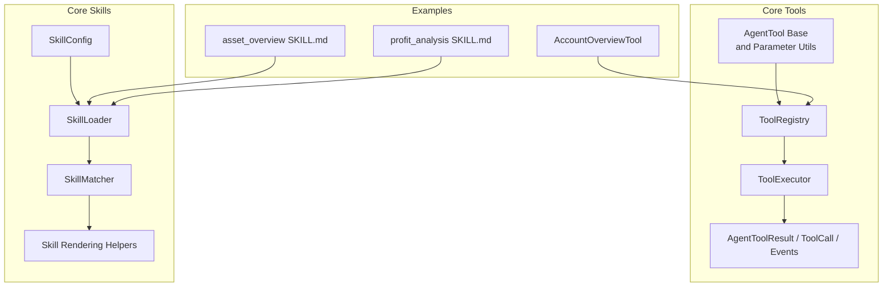
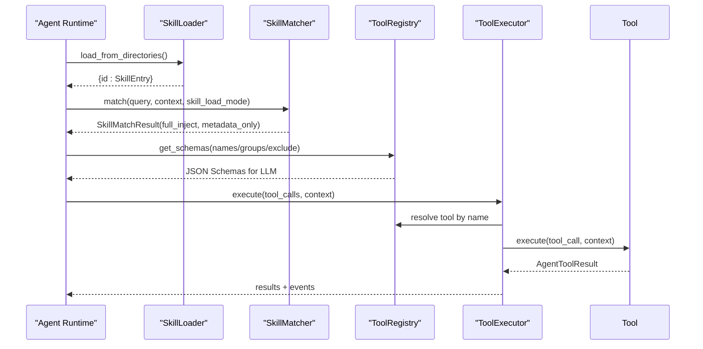
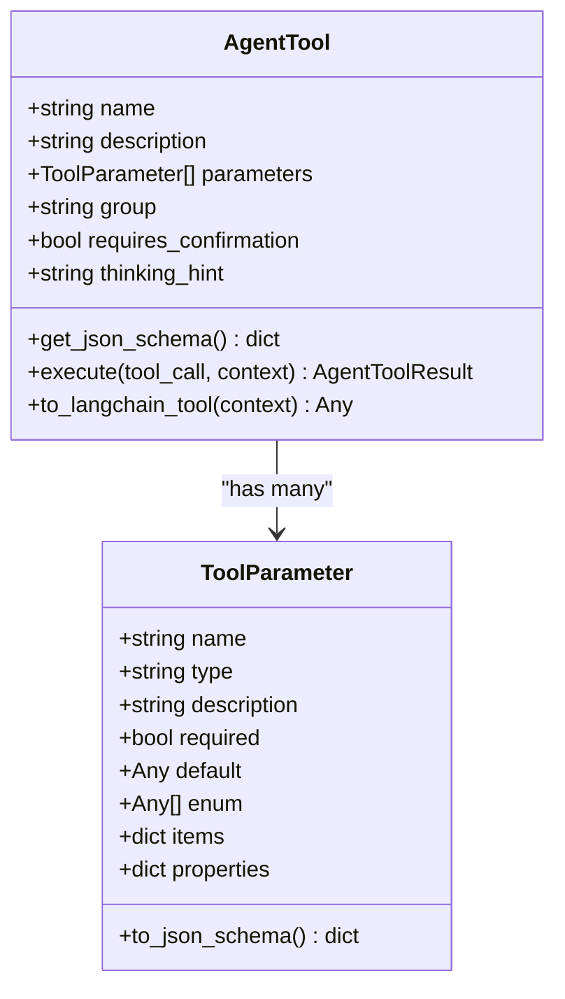
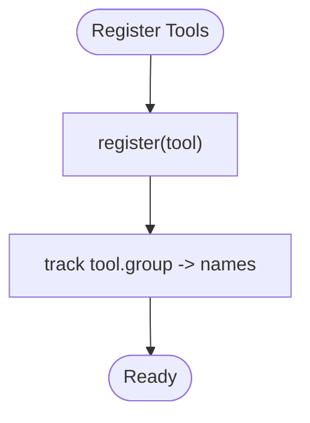
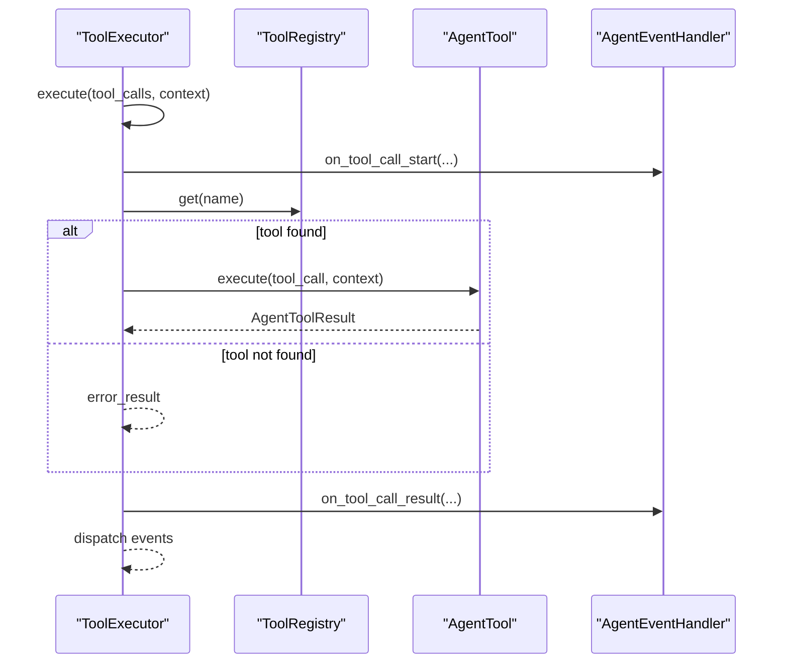
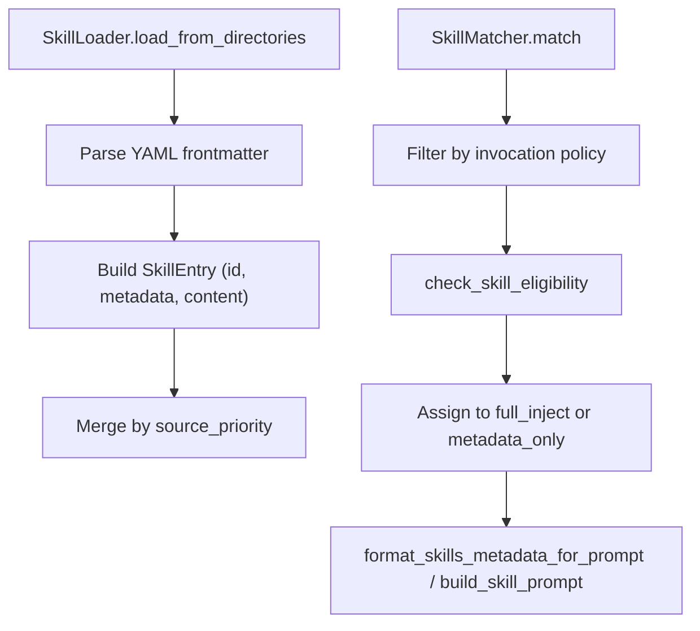
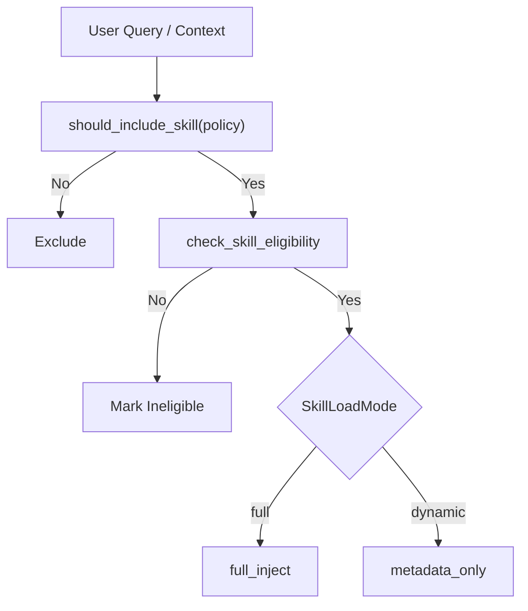
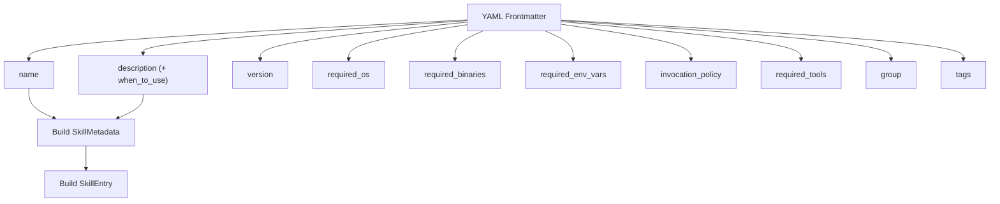
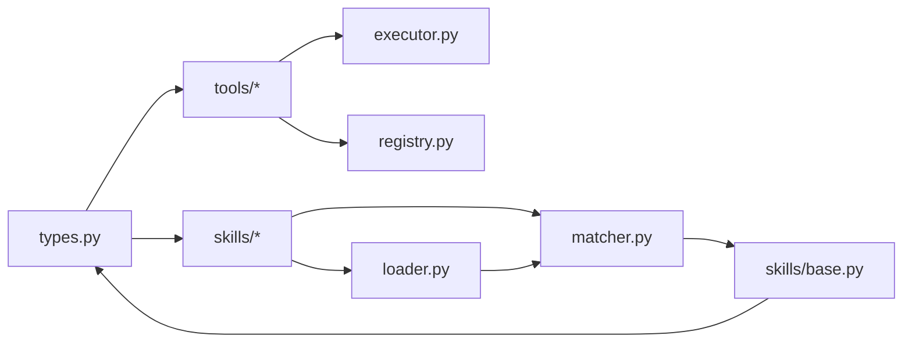

# Tools and Skills

<cite>
**Referenced Files in This Document**
- [base.py](file://src/ark_agentic/core/tools/base.py)
- [registry.py](file://src/ark_agentic/core/tools/registry.py)
- [executor.py](file://src/ark_agentic/core/tools/executor.py)
- [types.py](file://src/ark_agentic/core/types.py)
- [base.py](file://src/ark_agentic/core/skills/base.py)
- [loader.py](file://src/ark_agentic/core/skills/loader.py)
- [matcher.py](file://src/ark_agentic/core/skills/matcher.py)
- [__init__.py](file://src/ark_agentic/core/skills/__init__.py)
- [account_overview.py](file://src/ark_agentic/agents/securities/tools/agent/account_overview.py)
- [SKILL.md](file://src/ark_agentic/agents/securities/skills/asset_overview/SKILL.md)
- [SKILL.md](file://src/ark_agentic/agents/securities/skills/profit_analysis/SKILL.md)
- [tool.py](file://src/ark_agentic/core/subtask/tool.py)
</cite>

## Table of Contents
1. [Introduction](#introduction)
2. [Project Structure](#project-structure)
3. [Core Components](#core-components)
4. [Architecture Overview](#architecture-overview)
5. [Detailed Component Analysis](#detailed-component-analysis)
6. [Dependency Analysis](#dependency-analysis)
7. [Performance Considerations](#performance-considerations)
8. [Troubleshooting Guide](#troubleshooting-guide)
9. [Conclusion](#conclusion)
10. [Appendices](#appendices)

## Introduction
This document explains the tools and skills system used by agents to discover, validate, and execute capabilities safely and efficiently. It covers:
- The AgentTool base class and parameter utilities
- Tool registration and discovery via ToolRegistry
- Tool execution lifecycle and event distribution
- Skill system architecture: loading, matching, eligibility checks, and rendering
- Skill configuration format and load modes (full vs dynamic)
- Practical guidance for building tools and skills, validating parameters, formatting results, and handling errors
- Examples of creating custom tools and skills, registering them, and integrating them into agent workflows

## Project Structure
The tools and skills subsystem is organized around core abstractions and specialized loaders/matchers:
- Tools: base class, registry, executor, and shared types
- Skills: configuration, loader, matcher, and rendering helpers
- Example implementations: a real tool and two skills for the securities domain

**Diagram sources**
- [base.py:46-286](file://src/ark_agentic/core/tools/base.py#L46-L286)
- [registry.py:14-178](file://src/ark_agentic/core/tools/registry.py#L14-L178)
- [executor.py:29-123](file://src/ark_agentic/core/tools/executor.py#L29-L123)
- [types.py:44-187](file://src/ark_agentic/core/types.py#L44-L187)
- [base.py:19-325](file://src/ark_agentic/core/skills/base.py#L19-L325)
- [loader.py:25-177](file://src/ark_agentic/core/skills/loader.py#L25-L177)
- [matcher.py:55-152](file://src/ark_agentic/core/skills/matcher.py#L55-L152)
- [account_overview.py:57-108](file://src/ark_agentic/agents/securities/tools/agent/account_overview.py#L57-L108)
- [SKILL.md:1-186](file://src/ark_agentic/agents/securities/skills/asset_overview/SKILL.md#L1-L186)
- [SKILL.md:1-58](file://src/ark_agentic/agents/securities/skills/profit_analysis/SKILL.md#L1-L58)

**Section sources**
- [base.py:1-286](file://src/ark_agentic/core/tools/base.py#L1-L286)
- [registry.py:1-178](file://src/ark_agentic/core/tools/registry.py#L1-L178)
- [executor.py:1-123](file://src/ark_agentic/core/tools/executor.py#L1-L123)
- [types.py:1-413](file://src/ark_agentic/core/types.py#L1-L413)
- [base.py:1-325](file://src/ark_agentic/core/skills/base.py#L1-L325)
- [loader.py:1-177](file://src/ark_agentic/core/skills/loader.py#L1-L177)
- [matcher.py:1-152](file://src/ark_agentic/core/skills/matcher.py#L1-L152)
- [__init__.py:1-17](file://src/ark_agentic/core/skills/__init__.py#L1-L17)

## Core Components
- AgentTool: Abstract base for all tools. Provides schema generation, parameter helpers, and optional LangChain adapter.
- ToolRegistry: Central registry for tools with grouping, filtering, and schema export.
- ToolExecutor: Executes tools asynchronously with timeouts, limits, and event dispatch.
- AgentToolResult, ToolCall, and Tool Events: Standardized result and event types for tool outputs and UI integration.
- SkillConfig, SkillLoader, SkillMatcher, and rendering helpers: Define skill configuration, load from filesystem, match against context, and render prompts.

**Section sources**
- [base.py:46-286](file://src/ark_agentic/core/tools/base.py#L46-L286)
- [registry.py:14-178](file://src/ark_agentic/core/tools/registry.py#L14-L178)
- [executor.py:29-123](file://src/ark_agentic/core/tools/executor.py#L29-L123)
- [types.py:44-187](file://src/ark_agentic/core/types.py#L44-L187)
- [base.py:19-325](file://src/ark_agentic/core/skills/base.py#L19-L325)
- [loader.py:25-177](file://src/ark_agentic/core/skills/loader.py#L25-L177)
- [matcher.py:55-152](file://src/ark_agentic/core/skills/matcher.py#L55-L152)

## Architecture Overview
The system separates concerns across tools and skills:
- Tools encapsulate atomic actions and expose a uniform interface for discovery and execution.
- Skills encapsulate end-to-end workflows with explicit tooling requirements and rendering instructions.
- The loader and matcher coordinate skill availability and injection strategy based on configuration and context.

**Diagram sources**
- [loader.py:35-107](file://src/ark_agentic/core/skills/loader.py#L35-L107)
- [matcher.py:64-126](file://src/ark_agentic/core/skills/matcher.py#L64-L126)
- [registry.py:94-128](file://src/ark_agentic/core/tools/registry.py#L94-L128)
- [executor.py:43-96](file://src/ark_agentic/core/tools/executor.py#L43-L96)

## Detailed Component Analysis

### AgentTool Base Class and Parameter Utilities
- Defines the AgentTool interface with name, description, parameters, group, and optional confirmation hint.
- Provides get_json_schema for OpenAI-style function calling and optional LangChain adapter.
- Includes robust parameter extraction helpers for strings, integers, floats, booleans, lists, and dicts with defaults and required variants.

**Diagram sources**
- [base.py:46-160](file://src/ark_agentic/core/tools/base.py#L46-L160)

**Section sources**
- [base.py:46-286](file://src/ark_agentic/core/tools/base.py#L46-L286)

### Tool Registration Patterns
- ToolRegistry stores tools by name and supports grouping and filtering.
- get_schemas builds function schemas for LLM invocation, optionally filtered by names, groups, or exclusions.
- filter applies allow/deny lists and group-based allow/deny to produce a working set of tools.

**Diagram sources**
- [registry.py:24-40](file://src/ark_agentic/core/tools/registry.py#L24-L40)

**Section sources**
- [registry.py:14-178](file://src/ark_agentic/core/tools/registry.py#L14-L178)

### Tool Execution Lifecycle
- ToolExecutor executes a batch of ToolCall entries concurrently with per-turn limits and a global timeout.
- It logs lifecycle events, dispatches ToolEvents to an AgentEventHandler, and converts results to standardized AgentToolResult.
- Error handling includes missing tools, timeouts, and exceptions.

**Diagram sources**
- [executor.py:43-96](file://src/ark_agentic/core/tools/executor.py#L43-L96)
- [types.py:44-187](file://src/ark_agentic/core/types.py#L44-L187)

**Section sources**
- [executor.py:29-123](file://src/ark_agentic/core/tools/executor.py#L29-L123)
- [types.py:85-187](file://src/ark_agentic/core/types.py#L85-L187)

### Skill System Architecture
- SkillConfig defines directories, agent-scoped IDs, eligibility checks, invocation policies, and budgeting thresholds for prompt size and count.
- SkillLoader reads SKILL.md files from configured directories, parses YAML frontmatter, merges “when_to_use” into description, and constructs SkillEntry with source priority and enable flag.
- SkillMatcher filters skills by invocation policy and eligibility, then assigns them to full_inject or metadata_only based on load mode.
- Rendering helpers format skills into XML (flat or grouped) and apply budgeting to stay within token limits.

**Diagram sources**
- [loader.py:35-107](file://src/ark_agentic/core/skills/loader.py#L35-L107)
- [base.py:51-138](file://src/ark_agentic/core/skills/base.py#L51-L138)
- [matcher.py:64-126](file://src/ark_agentic/core/skills/matcher.py#L64-L126)
- [base.py:245-325](file://src/ark_agentic/core/skills/base.py#L245-L325)

**Section sources**
- [base.py:19-325](file://src/ark_agentic/core/skills/base.py#L19-L325)
- [loader.py:25-177](file://src/ark_agentic/core/skills/loader.py#L25-L177)
- [matcher.py:55-152](file://src/ark_agentic/core/skills/matcher.py#L55-L152)
- [__init__.py:1-17](file://src/ark_agentic/core/skills/__init__.py#L1-L17)

### Skill Loading Modes and Matching Algorithms
- full: Injects complete skill content into the system prompt.
- dynamic: Injects only metadata and requires the agent to call read_skill to fetch the full content.
- Matching filters by policy (auto/manual/always), eligibility (OS/binaries/env/context), and load mode to decide injection strategy.

**Diagram sources**
- [base.py:104-138](file://src/ark_agentic/core/skills/base.py#L104-L138)
- [matcher.py:64-126](file://src/ark_agentic/core/skills/matcher.py#L64-L126)

**Section sources**
- [base.py:294-299](file://src/ark_agentic/core/skills/base.py#L294-L299)
- [matcher.py:64-126](file://src/ark_agentic/core/skills/matcher.py#L64-L126)

### Skill Configuration Format
Skills are defined in SKILL.md with a YAML frontmatter block:
- name, description, version, required_os, required_binaries, required_env_vars, invocation_policy, required_tools, group, tags, when_to_use
- The loader merges when_to_use into description and constructs SkillMetadata and SkillEntry.

**Diagram sources**
- [loader.py:109-154](file://src/ark_agentic/core/skills/loader.py#L109-L154)

**Section sources**
- [loader.py:109-154](file://src/ark_agentic/core/skills/loader.py#L109-L154)

### Practical Examples

#### Creating a Custom Tool
- Extend AgentTool and define name, description, parameters, and execute.
- Use parameter helpers to read validated inputs from tool_call.arguments and context.
- Return AgentToolResult variants (JSON, TEXT, A2UI, IMAGE, ERROR) and attach ToolEvents if needed.

Example reference paths:
- [AccountOverviewTool:57-108](file://src/ark_agentic/agents/securities/tools/agent/account_overview.py#L57-L108)
- [AgentTool base and helpers:46-286](file://src/ark_agentic/core/tools/base.py#L46-L286)
- [AgentToolResult constructors:100-187](file://src/ark_agentic/core/types.py#L100-L187)

Registration and discovery:
- Register the tool with ToolRegistry and retrieve JSON schemas for LLM invocation.
- Reference: [ToolRegistry.register/get_schemas/filter:24-168](file://src/ark_agentic/core/tools/registry.py#L24-L168)

Execution:
- Invoke via ToolExecutor with context and handle events.
- Reference: [ToolExecutor.execute/_execute_single:43-96](file://src/ark_agentic/core/tools/executor.py#L43-L96)

#### Creating a Custom Skill
- Author SKILL.md with a YAML frontmatter and steps describing intent, tool mapping, execution flow, output strategy, and error handling.
- Place the folder under a configured skill directory so SkillLoader can discover it.
- Reference examples:
  - [asset_overview SKILL.md:1-186](file://src/ark_agentic/agents/securities/skills/asset_overview/SKILL.md#L1-L186)
  - [profit_analysis SKILL.md:1-58](file://src/ark_agentic/agents/securities/skills/profit_analysis/SKILL.md#L1-L58)

Loading and matching:
- Configure SkillConfig.skill_directories and agent_id.
- Load skills with SkillLoader and match with SkillMatcher.
- Reference: [SkillLoader.load_from_directories:35-61](file://src/ark_agentic/core/skills/loader.py#L35-L61), [SkillMatcher.match:64-126](file://src/ark_agentic/core/skills/matcher.py#L64-L126)

Integration into agent workflows:
- Use render_skill_section to inject either full or metadata-only prompts depending on load mode.
- Reference: [render_skill_section/build_skill_prompt/format_skills_metadata_for_prompt:285-325](file://src/ark_agentic/core/skills/base.py#L285-L325)

#### Using a Subtask Tool for Parallel Workflows
- SpawnSubtasksTool runs multiple independent tasks in isolated sessions and aggregates results.
- Useful when a single user utterance contains multiple independent intents.
- Reference: [SpawnSubtasksTool:61-318](file://src/ark_agentic/core/subtask/tool.py#L61-L318)

**Section sources**
- [account_overview.py:57-108](file://src/ark_agentic/agents/securities/tools/agent/account_overview.py#L57-L108)
- [base.py:46-286](file://src/ark_agentic/core/tools/base.py#L46-L286)
- [types.py:100-187](file://src/ark_agentic/core/types.py#L100-L187)
- [registry.py:24-168](file://src/ark_agentic/core/tools/registry.py#L24-L168)
- [executor.py:43-96](file://src/ark_agentic/core/tools/executor.py#L43-L96)
- [SKILL.md:1-186](file://src/ark_agentic/agents/securities/skills/asset_overview/SKILL.md#L1-L186)
- [SKILL.md:1-58](file://src/ark_agentic/agents/securities/skills/profit_analysis/SKILL.md#L1-L58)
- [loader.py:35-61](file://src/ark_agentic/core/skills/loader.py#L35-L61)
- [matcher.py:64-126](file://src/ark_agentic/core/skills/matcher.py#L64-L126)
- [base.py:285-325](file://src/ark_agentic/core/skills/base.py#L285-L325)
- [tool.py:61-318](file://src/ark_agentic/core/subtask/tool.py#L61-L318)

## Dependency Analysis
- Tools depend on shared types for ToolCall and AgentToolResult.
- ToolExecutor depends on ToolRegistry and AgentEventHandler for event distribution.
- Skills depend on SkillLoader and SkillMatcher; rendering helpers depend on SkillConfig.
- Example tools and skills demonstrate real-world usage patterns.

**Diagram sources**
- [types.py:44-187](file://src/ark_agentic/core/types.py#L44-L187)
- [executor.py:29-123](file://src/ark_agentic/core/tools/executor.py#L29-L123)
- [registry.py:14-178](file://src/ark_agentic/core/tools/registry.py#L14-L178)
- [loader.py:25-177](file://src/ark_agentic/core/skills/loader.py#L25-L177)
- [matcher.py:55-152](file://src/ark_agentic/core/skills/matcher.py#L55-L152)
- [base.py:19-325](file://src/ark_agentic/core/skills/base.py#L19-L325)

**Section sources**
- [types.py:44-187](file://src/ark_agentic/core/types.py#L44-L187)
- [executor.py:29-123](file://src/ark_agentic/core/tools/executor.py#L29-L123)
- [registry.py:14-178](file://src/ark_agentic/core/tools/registry.py#L14-L178)
- [loader.py:25-177](file://src/ark_agentic/core/skills/loader.py#L25-L177)
- [matcher.py:55-152](file://src/ark_agentic/core/skills/matcher.py#L55-L152)
- [base.py:19-325](file://src/ark_agentic/core/skills/base.py#L19-L325)

## Performance Considerations
- Tool concurrency and limits: ToolExecutor caps concurrent calls per turn to avoid overload.
- Timeout control: Per-tool execution timeout prevents stalls.
- Skill budgeting: Skill rendering applies both count and character limits with binary-search prefix trimming to keep prompts within bounds.
- Rendering strategy: Use dynamic mode for large skill sets to reduce token overhead; switch to full mode when precise instruction injection is required.

[No sources needed since this section provides general guidance]

## Troubleshooting Guide
Common issues and resolutions:
- Tool not found: Ensure the tool is registered and the name matches ToolCall.name.
- Execution timeout: Reduce tool complexity or increase timeout; consider offloading heavy work to adapters.
- Missing required parameters: Use parameter helpers to validate and supply defaults; raise explicit errors for truly required fields.
- Skill eligibility failures: Verify required_os, required_binaries, required_env_vars, and required_tools in context.
- Too many skills: Adjust SkillConfig thresholds or switch to dynamic load mode.

**Section sources**
- [executor.py:77-96](file://src/ark_agentic/core/tools/executor.py#L77-L96)
- [base.py:51-101](file://src/ark_agentic/core/skills/base.py#L51-L101)
- [base.py:210-242](file://src/ark_agentic/core/skills/base.py#L210-L242)

## Conclusion
The tools and skills system provides a robust, extensible framework for agent capabilities:
- Tools offer a unified interface, safe parameter handling, and standardized results/events.
- Skills encapsulate complex workflows with explicit requirements and rendering strategies.
- The loader/matcher/rendering pipeline ensures skills are available only when eligible and injected appropriately based on load mode and budget constraints.

[No sources needed since this section summarizes without analyzing specific files]

## Appendices

### Best Practices for Tool Development
- Define clear, concise descriptions and parameter schemas.
- Use parameter helpers to enforce validation and defaults.
- Return structured AgentToolResult types and attach ToolEvents for UI updates.
- Keep execute idempotent and safe; avoid side effects outside the intended scope.
- Optionally provide a LangChain adapter for integration scenarios.

**Section sources**
- [base.py:166-286](file://src/ark_agentic/core/tools/base.py#L166-L286)
- [types.py:85-187](file://src/ark_agentic/core/types.py#L85-L187)

### Best Practices for Skill Development
- Use SKILL.md frontmatter to declare required tools, OS/binaries/env, and invocation policy.
- Keep descriptions actionable and include “when to use” guidance.
- Define clear execution steps, tool mapping, output strategy, and error handling.
- Group related skills and use tags for discoverability.

**Section sources**
- [loader.py:131-154](file://src/ark_agentic/core/skills/loader.py#L131-L154)
- [SKILL.md:1-186](file://src/ark_agentic/agents/securities/skills/asset_overview/SKILL.md#L1-L186)
- [SKILL.md:1-58](file://src/ark_agentic/agents/securities/skills/profit_analysis/SKILL.md#L1-L58)

### Optimizing Skill Performance
- Prefer dynamic load mode for large catalogs to minimize prompt size.
- Tune SkillConfig thresholds (max_skills_in_prompt, max_skills_prompt_chars) to balance coverage and cost.
- Use grouping and tags to help agents quickly narrow applicable skills.
- Keep skill content concise and avoid redundant headings; the system strips leading H1 automatically.

**Section sources**
- [base.py:210-242](file://src/ark_agentic/core/skills/base.py#L210-L242)
- [base.py:285-325](file://src/ark_agentic/core/skills/base.py#L285-L325)