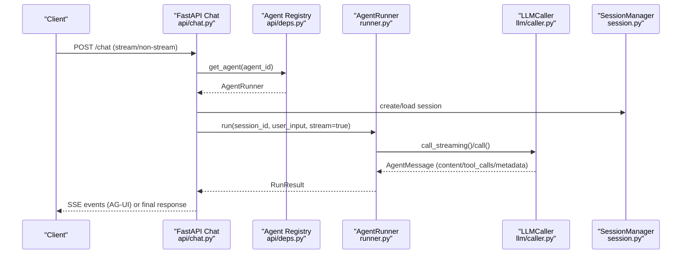
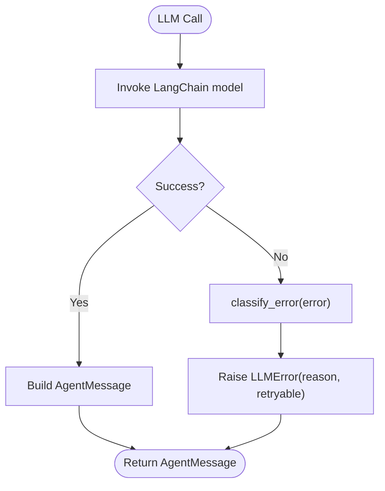
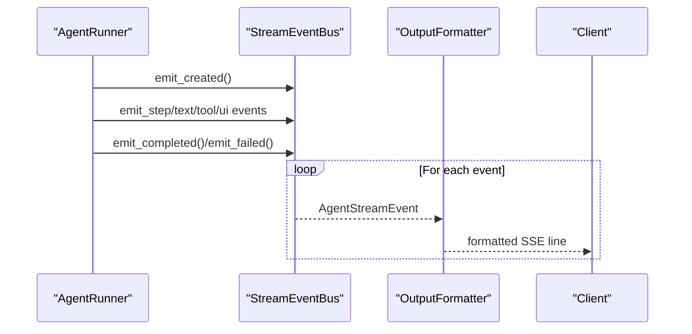
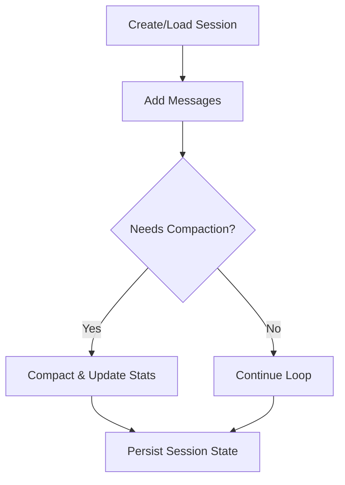
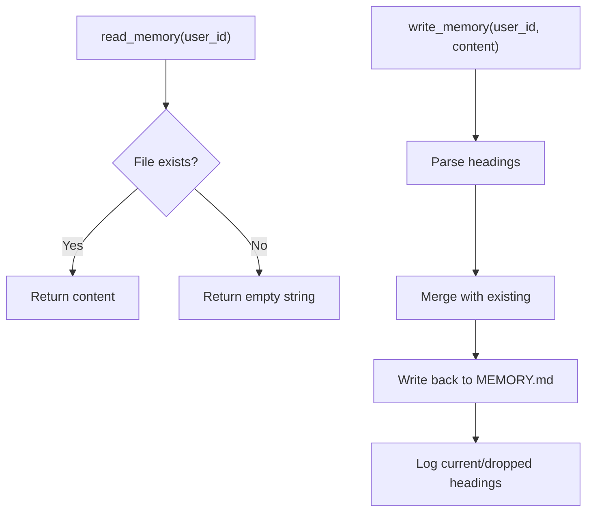
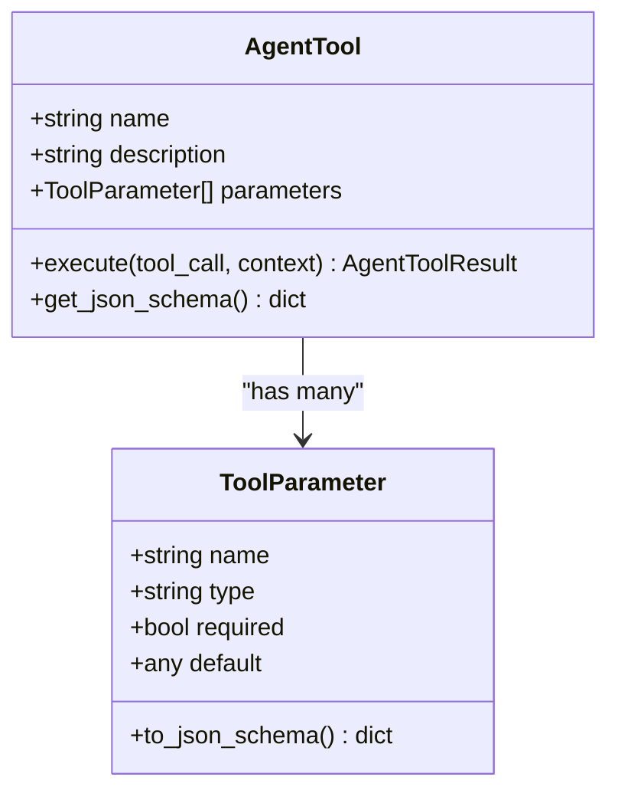
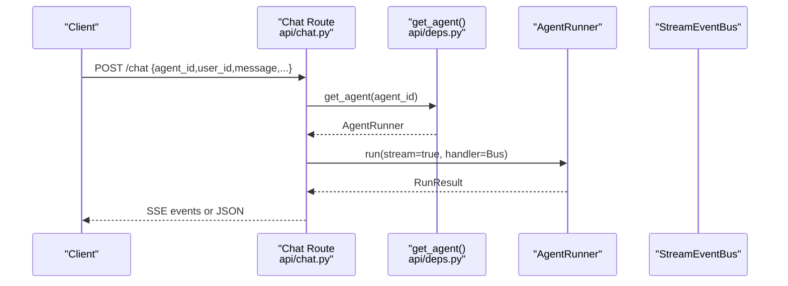
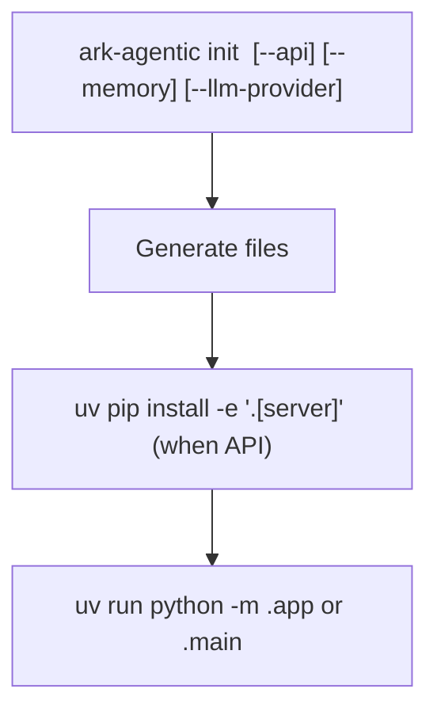
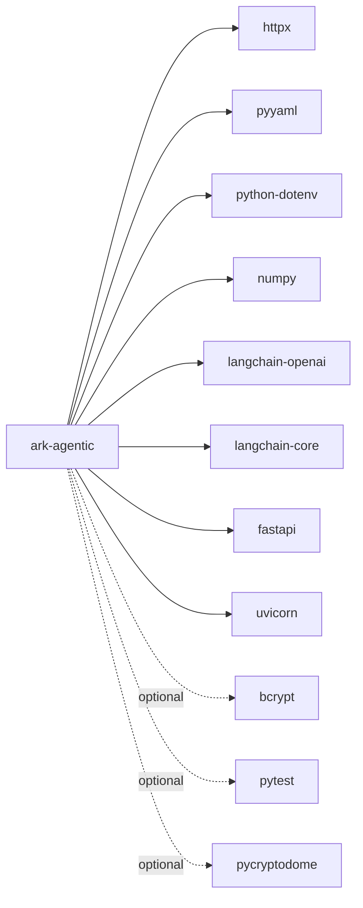

# Troubleshooting and FAQ

<cite>
**Referenced Files in This Document**
- [README.md](file://README.md)
- [pyproject.toml](file://pyproject.toml)
- [src/ark_agentic/core/llm/errors.py](file://src/ark_agentic/core/llm/errors.py)
- [src/ark_agentic/core/stream/events.py](file://src/ark_agentic/core/stream/events.py)
- [src/ark_agentic/core/session.py](file://src/ark_agentic/core/session.py)
- [src/ark_agentic/core/memory/manager.py](file://src/ark_agentic/core/memory/manager.py)
- [src/ark_agentic/core/llm/caller.py](file://src/ark_agentic/core/llm/caller.py)
- [src/ark_agentic/core/tools/base.py](file://src/ark_agentic/core/tools/base.py)
- [src/ark_agentic/api/chat.py](file://src/ark_agentic/api/chat.py)
- [src/ark_agentic/api/deps.py](file://src/ark_agentic/api/deps.py)
- [src/ark_agentic/cli/main.py](file://src/ark_agentic/cli/main.py)
- [src/ark_agentic/core/utils/env.py](file://src/ark_agentic/core/utils/env.py)
- [src/ark_agentic/core/runner.py](file://src/ark_agentic/core/runner.py)
</cite>

## Table of Contents
1. [Introduction](#introduction)
2. [Project Structure](#project-structure)
3. [Core Components](#core-components)
4. [Architecture Overview](#architecture-overview)
5. [Detailed Component Analysis](#detailed-component-analysis)
6. [Dependency Analysis](#dependency-analysis)
7. [Performance Considerations](#performance-considerations)
8. [Troubleshooting Guide](#troubleshooting-guide)
9. [Conclusion](#conclusion)
10. [Appendices](#appendices)

## Introduction
This document provides comprehensive troubleshooting guidance and FAQs for the Ark Agentic project. It focuses on installation and environment setup, configuration pitfalls, runtime operation issues, LLM provider connectivity, tool execution failures, memory system problems, streaming diagnostics, session corruption, performance bottlenecks, and platform compatibility. It also documents error codes, log analysis techniques, and escalation procedures, with practical solutions grounded in the repository’s code and configuration.

## Project Structure
The project is organized around a modular agent framework with clear separation of concerns:
- Core runtime (AgentRunner, SessionManager, MemoryManager)
- LLM integration (LLMCaller, provider-specific modules)
- Streaming pipeline (StreamEventBus, AG-UI events, output formatters)
- API layer (FastAPI routes, dependencies)
- CLI scaffolding (project initialization, agent addition)
- Environment utilities (agents root resolution, path handling)

```mermaid
graph TB
subgraph "Core"
R["AgentRunner<br/>runner.py"]
S["SessionManager<br/>session.py"]
M["MemoryManager<br/>memory/manager.py"]
L["LLMCaller<br/>llm/caller.py"]
E["LLM Errors<br/>llm/errors.py"]
ST["Stream Events<br/>stream/events.py"]
end
subgraph "API"
C["Chat Route<br/>api/chat.py"]
D["Dependencies<br/>api/deps.py"]
end
subgraph "CLI"
CLI["ark-agentic CLI<br/>cli/main.py"]
ENV["Env Utils<br/>core/utils/env.py"]
end
R --> L
R --> S
R --> M
R --> ST
C --> R
C --> D
CLI --> ENV
```

**Diagram sources**
- [src/ark_agentic/core/runner.py](file://src/ark_agentic/core/runner.py)
- [src/ark_agentic/core/session.py](file://src/ark_agentic/core/session.py)
- [src/ark_agentic/core/memory/manager.py](file://src/ark_agentic/core/memory/manager.py)
- [src/ark_agentic/core/llm/caller.py](file://src/ark_agentic/core/llm/caller.py)
- [src/ark_agentic/core/llm/errors.py](file://src/ark_agentic/core/llm/errors.py)
- [src/ark_agentic/core/stream/events.py](file://src/ark_agentic/core/stream/events.py)
- [src/ark_agentic/api/chat.py](file://src/ark_agentic/api/chat.py)
- [src/ark_agentic/api/deps.py](file://src/ark_agentic/api/deps.py)
- [src/ark_agentic/cli/main.py](file://src/ark_agentic/cli/main.py)
- [src/ark_agentic/core/utils/env.py](file://src/ark_agentic/core/utils/env.py)

**Section sources**
- [README.md](file://README.md)
- [pyproject.toml](file://pyproject.toml)

## Core Components
- AgentRunner orchestrates ReAct loops, integrates LLM calls, tool execution, streaming, and session/memory management.
- SessionManager handles session creation, loading, persistence, compression, and state synchronization.
- MemoryManager provides lightweight file-based memory storage and upsert semantics.
- LLMCaller encapsulates non-streaming and streaming LLM invocations with structured error classification.
- Stream events define AG-UI protocol events and are emitted via StreamEventBus to clients.
- API chat endpoint supports both streaming and non-streaming responses, with request validation and session handling.
- CLI scaffolds projects and agents, generating appropriate environment samples and dependencies.

**Section sources**
- [src/ark_agentic/core/runner.py](file://src/ark_agentic/core/runner.py)
- [src/ark_agentic/core/session.py](file://src/ark_agentic/core/session.py)
- [src/ark_agentic/core/memory/manager.py](file://src/ark_agentic/core/memory/manager.py)
- [src/ark_agentic/core/llm/caller.py](file://src/ark_agentic/core/llm/caller.py)
- [src/ark_agentic/core/stream/events.py](file://src/ark_agentic/core/stream/events.py)
- [src/ark_agentic/api/chat.py](file://src/ark_agentic/api/chat.py)
- [src/ark_agentic/cli/main.py](file://src/ark_agentic/cli/main.py)

## Architecture Overview
The runtime architecture ties together the agent loop, LLM invocation, tool execution, streaming, and persistence. The API layer exposes a streaming chat endpoint that delegates to AgentRunner and emits standardized AG-UI events.



**Diagram sources**
- [src/ark_agentic/api/chat.py](file://src/ark_agentic/api/chat.py)
- [src/ark_agentic/api/deps.py](file://src/ark_agentic/api/deps.py)
- [src/ark_agentic/core/runner.py](file://src/ark_agentic/core/runner.py)
- [src/ark_agentic/core/llm/caller.py](file://src/ark_agentic/core/llm/caller.py)
- [src/ark_agentic/core/session.py](file://src/ark_agentic/core/session.py)

## Detailed Component Analysis

### LLM Provider Connectivity and Errors
- LLMCaller wraps LangChain chat model invocations and converts exceptions into structured LLMError with reasons such as auth, quota, rate_limit, timeout, context_overflow, content_filter, server_error, network, and unknown.
- classify_error inspects error text and HTTP-like indicators to categorize failures.
- LLMErrorReason and LLMError provide a unified classification for diagnostics and potential retries.



**Diagram sources**
- [src/ark_agentic/core/llm/caller.py](file://src/ark_agentic/core/llm/caller.py)
- [src/ark_agentic/core/llm/errors.py](file://src/ark_agentic/core/llm/errors.py)

**Section sources**
- [src/ark_agentic/core/llm/errors.py](file://src/ark_agentic/core/llm/errors.py)
- [src/ark_agentic/core/llm/caller.py](file://src/ark_agentic/core/llm/caller.py)

### Streaming Pipeline and AG-UI Events
- StreamEventBus emits AG-UI events (run_started, text_message_content/end, tool_call_start/args/result, state_delta, etc.) during AgentRunner execution.
- OutputFormatter adapts these events to SSE/protocol variants (agui/internal/enterprise/alone).
- Thinking tag parsing can route content to distinct callbacks when enabled.



**Diagram sources**
- [src/ark_agentic/core/stream/events.py](file://src/ark_agentic/core/stream/events.py)
- [src/ark_agentic/api/chat.py](file://src/ark_agentic/api/chat.py)

**Section sources**
- [src/ark_agentic/core/stream/events.py](file://src/ark_agentic/core/stream/events.py)
- [src/ark_agentic/api/chat.py](file://src/ark_agentic/api/chat.py)

### Session Management and Persistence
- SessionManager creates, loads, lists, deletes, and persists sessions; it tracks token usage and compaction stats.
- It supports injecting external history and synchronizing pending messages to disk.
- Auto-compaction reduces context size when thresholds are exceeded.



**Diagram sources**
- [src/ark_agentic/core/session.py](file://src/ark_agentic/core/session.py)

**Section sources**
- [src/ark_agentic/core/session.py](file://src/ark_agentic/core/session.py)

### Memory System (File-Based)
- MemoryManager writes/reads MEMORY.md per user with heading-level upsert semantics.
- Orphaned index directories are detected and warned about.



**Diagram sources**
- [src/ark_agentic/core/memory/manager.py](file://src/ark_agentic/core/memory/manager.py)

**Section sources**
- [src/ark_agentic/core/memory/manager.py](file://src/ark_agentic/core/memory/manager.py)

### Tool Execution and Validation
- AgentTool defines a base interface with JSON schema generation and parameter helpers.
- Tool execution is performed by ToolExecutor with timeouts and concurrency controls.
- Tool results can carry structured data, text, images, A2UI components, or errors.



**Diagram sources**
- [src/ark_agentic/core/tools/base.py](file://src/ark_agentic/core/tools/base.py)

**Section sources**
- [src/ark_agentic/core/tools/base.py](file://src/ark_agentic/core/tools/base.py)

### API Chat Endpoint and Request Handling
- Validates presence of user_id, resolves message/session ids, builds input_context, and delegates to AgentRunner.
- Supports streaming via SSE and non-streaming responses.
- Emits run_started/run_finished/run_error events and formats them according to requested protocol.



**Diagram sources**
- [src/ark_agentic/api/chat.py](file://src/ark_agentic/api/chat.py)
- [src/ark_agentic/api/deps.py](file://src/ark_agentic/api/deps.py)

**Section sources**
- [src/ark_agentic/api/chat.py](file://src/ark_agentic/api/chat.py)
- [src/ark_agentic/api/deps.py](file://src/ark_agentic/api/deps.py)

### CLI Initialization and Project Setup
- CLI scaffolds a new project with optional API and memory features, generates pyproject.toml, .env-sample, and basic agent structure.
- Supports selecting LLM provider (openai, pa-sx, pa-jt) and renders appropriate environment placeholders.



**Diagram sources**
- [src/ark_agentic/cli/main.py](file://src/ark_agentic/cli/main.py)

**Section sources**
- [src/ark_agentic/cli/main.py](file://src/ark_agentic/cli/main.py)

## Dependency Analysis
- Core dependencies include FastAPI, Uvicorn, LangChain OpenAI/Core, and optional extras for development and PA-JT signing.
- Optional groups:
  - server: adds bcrypt, FastAPI, Uvicorn[standard]
  - dev: adds testing and linting tools
  - pa-jt: adds pycryptodome for RSA signing (PA-JT)
  - all: dev + pa-jt



**Diagram sources**
- [pyproject.toml](file://pyproject.toml)

**Section sources**
- [pyproject.toml](file://pyproject.toml)

## Performance Considerations
- Parallel tool execution: LLM responses with multiple tool calls trigger concurrent execution to reduce latency.
- AG-UI streaming: fine-grained event emission enables responsive client rendering.
- Zero DB memory: file-based MEMORY.md avoids database overhead.
- Context compression: automatic summarization keeps token budgets stable.
- Output validation: post-loop grounding reduces hallucinations and rework.

[No sources needed since this section provides general guidance]

## Troubleshooting Guide

### Installation and Environment Setup
Common issues and resolutions:
- Missing optional dependencies
  - PA-JT models require pycryptodome for RSA signing. Install with the pa-jt extra.
  - Development/testing tools are included under dev extra.
  - Server stack (FastAPI/Uvicorn) is available via server extra.
  - Resolution: uv add 'ark-agentic[pa-jt]' or uv add 'ark-agentic[dev]' or uv add 'ark-agentic[server]'.

- Python version requirement
  - Requires Python >= 3.10. Ensure your environment matches the project’s minimum.

- Project scaffolding
  - Use the CLI to initialize a new project with desired LLM provider and optional API/memory features.
  - Verify generated .env-sample and pyproject.toml reflect your provider settings.

**Section sources**
- [pyproject.toml](file://pyproject.toml)
- [src/ark_agentic/cli/main.py](file://src/ark_agentic/cli/main.py)
- [README.md](file://README.md)

### Configuration Pitfalls
- LLM provider selection and environment variables
  - OPENAI-compatible providers: set LLM_PROVIDER=openai, MODEL_NAME, API_KEY, optionally LLM_BASE_URL.
  - PA-SX: set LLM_PROVIDER=pa, MODEL_NAME=PA-SX-80B, API_KEY, LLM_BASE_URL.
  - PA-JT: set LLM_PROVIDER=pa, MODEL_NAME=PA-JT-80B, LLM_BASE_URL, and required signature variables (see .env-sample).
  - Temperature defaults to DEFAULT_TEMPERATURE; adjust via environment or run options.

- Storage directories
  - SESSIONS_DIR and MEMORY_DIR control persistence locations. Ensure directories exist and are writable.

- Feature flags
  - ENABLE_STUDIO: toggles Studio UI/API.
  - ENABLE_THINKING_TAGS: enables <think>/<final> parsing for streaming.
  - LOG_LEVEL: tune verbosity.

- Agent root resolution
  - AGENTS_ROOT can override discovery of agents/ directory. Ensure correct path and avoid traversal.

**Section sources**
- [README.md](file://README.md)
- [src/ark_agentic/core/utils/env.py](file://src/ark_agentic/core/utils/env.py)

### LLM Provider Connectivity Problems
Symptoms:
- Authentication failures (401), invalid API keys, or unauthorized responses.
- Quota/billing errors (402) indicating insufficient balance or exceeded limits.
- Rate limit errors (429) causing throttling.
- Timeouts or connection errors.
- Context length/token limit exceeded.
- Content filter or safety policy violations.
- Server-side errors (5xx) or network/host unreachable.

Diagnostics:
- Capture LLMError reason and status code from structured exceptions.
- Review logs for classify_error categorization and retryable flags.
- Enable thinking tags for clearer streaming segmentation if applicable.

Resolutions:
- Verify API credentials and permissions.
- Adjust run options (temperature, max_tokens) to fit provider constraints.
- Implement backoff/retry for retryable errors (rate_limit, timeout, server_error, network).
- Reduce context window or enable auto-compaction to avoid context overflow.
- For content filter errors, sanitize prompts or adjust safety settings upstream.

**Section sources**
- [src/ark_agentic/core/llm/errors.py](file://src/ark_agentic/core/llm/errors.py)
- [src/ark_agentic/core/llm/caller.py](file://src/ark_agentic/core/llm/caller.py)

### Tool Execution Failures
Symptoms:
- Tool parameter validation errors (missing required fields).
- Tool execution timeouts.
- Tool returns unexpected result types or malformed data.

Diagnostics:
- Inspect ToolParameter definitions and JSON schema generation.
- Use parameter helpers (read_*_param/_required) to validate inputs robustly.
- Check ToolExecutor timeout and concurrency settings.

Resolutions:
- Fix tool signatures and parameter requirements.
- Increase tool_timeout in RunnerConfig if legitimate workloads require more time.
- Normalize tool result payloads to supported types (JSON, TEXT, IMAGE, A2UI, ERROR).

**Section sources**
- [src/ark_agentic/core/tools/base.py](file://src/ark_agentic/core/tools/base.py)
- [src/ark_agentic/core/runner.py](file://src/ark_agentic/core/runner.py)

### Memory System Issues
Symptoms:
- Memory file not found or empty.
- Heading upsert not taking effect.
- Orphaned index warnings.

Diagnostics:
- Confirm MEMORY.md path per user_id and that write_memory was invoked.
- Check heading-level upsert behavior: empty-body headings drop entries.

Resolutions:
- Ensure MEMORY_DIR is configured and writable.
- Use write_memory with properly formatted headings.
- Remove orphaned .memory directories if present.

**Section sources**
- [src/ark_agentic/core/memory/manager.py](file://src/ark_agentic/core/memory/manager.py)

### Streaming Problems
Symptoms:
- Incomplete or missing AG-UI events.
- No final completion message.
- Lost events during high throughput.

Diagnostics:
- Verify StreamEventBus emits run_started, intermediate text/tool events, and run_completed/run_error.
- Confirm OutputFormatter is constructed with the requested protocol.
- Check SSE event stream loop and queue draining.

Resolutions:
- Ensure handler is passed to AgentRunner.run(stream=True).
- Validate protocol selection and headers.
- Monitor queue.empty() and done_event signaling in the streaming generator.

**Section sources**
- [src/ark_agentic/api/chat.py](file://src/ark_agentic/api/chat.py)
- [src/ark_agentic/core/stream/events.py](file://src/ark_agentic/core/stream/events.py)

### Session Corruption and Persistence
Symptoms:
- Session not found after agent switch.
- Inconsistent message ordering or missing state.
- Token usage mismatch.

Diagnostics:
- Investigate session creation/loading paths and disk-backed transcript/store entries.
- Check auto-compaction triggers and pre-compaction callbacks.
- Validate pending message synchronization.

Resolutions:
- Recreate session when switching agents; ensure user_id alignment.
- Force sync_pending_messages before persistence.
- Review compaction statistics and disable auto-compaction temporarily for debugging.

**Section sources**
- [src/ark_agentic/core/session.py](file://src/ark_agentic/core/session.py)

### Performance Bottlenecks
Symptoms:
- Slow LLM responses, long tool execution, or delayed streaming.

Diagnostics:
- Monitor token usage and turns in RunResult.
- Profile tool execution and LLM call durations.
- Evaluate context size and compaction frequency.

Resolutions:
- Enable parallel tool execution and optimize tool designs.
- Reduce context window or increase summarization aggressiveness.
- Tune run options (max_turns, max_tool_calls_per_turn, tool_timeout).

**Section sources**
- [src/ark_agentic/core/runner.py](file://src/ark_agentic/core/runner.py)

### Platform Compatibility and Dependency Conflicts
- Python version: ensure >= 3.10.
- Optional extras: install pa-jt for PA-JT models; install dev for testing; install server for API stack.
- Virtual environments: use uv to manage isolated environments and avoid conflicts.

**Section sources**
- [pyproject.toml](file://pyproject.toml)
- [README.md](file://README.md)

### Error Codes and Classification
- LLMErrorReason categories:
  - auth, quota, rate_limit, timeout, context_overflow, content_filter, server_error, network, unknown.
- Retryable flags indicate whether the failure can be retried (rate_limit, timeout, server_error, network).

**Section sources**
- [src/ark_agentic/core/llm/errors.py](file://src/ark_agentic/core/llm/errors.py)

### Log Analysis Techniques
- Enable INFO/DEBUG logs and correlate:
  - Session lifecycle events (create/load/delete).
  - LLM stream start and completion metrics.
  - Tool execution start/args/end/results.
  - Memory upsert/drop headings.
- Use structured fields (provider, model, status, finish_reason, usage) for quick filtering.

**Section sources**
- [src/ark_agentic/core/llm/caller.py](file://src/ark_agentic/core/llm/caller.py)
- [src/ark_agentic/core/session.py](file://src/ark_agentic/core/session.py)
- [src/ark_agentic/core/memory/manager.py](file://src/ark_agentic/core/memory/manager.py)

### Escalation Procedures
- Collect:
  - Full logs with timestamps.
  - RunResult (turns, tool_calls, usage).
  - LLMError reason and status code.
  - Session stats and compaction history.
- Reproduce with minimal input and disable optional features (e.g., memory, thinking tags) to isolate issues.
- Provide environment details (Python version, extras installed, provider settings).

**Section sources**
- [src/ark_agentic/core/runner.py](file://src/ark_agentic/core/runner.py)
- [src/ark_agentic/core/llm/errors.py](file://src/ark_agentic/core/llm/errors.py)
- [src/ark_agentic/core/session.py](file://src/ark_agentic/core/session.py)

## Conclusion
This guide consolidates actionable troubleshooting steps for installation, configuration, LLM connectivity, tool execution, memory, streaming, sessions, and performance. By leveraging structured error classification, AG-UI event tracing, and session/memory diagnostics, most issues can be quickly identified and resolved. For persistent problems, collect logs and run statistics to escalate effectively.

[No sources needed since this section summarizes without analyzing specific files]

## Appendices

### Frequently Asked Questions (FAQ)

- How do I select a different LLM provider?
  - Use the CLI to initialize with --llm-provider openai, pa-sx, or pa-jt. The generated .env-sample shows required variables per provider.

- Why am I getting authentication errors?
  - Verify API_KEY and provider-specific variables. For PA-JT, ensure signature-related variables are set.

- How do I enable streaming in the API?
  - Set stream=true in the /chat request and consume SSE events. Choose protocol (agui/internal/enterprise/alone) as needed.

- What does “context overflow” mean?
  - Your context exceeds the model’s token limit. Reduce history or enable auto-compaction.

- How do I fix rate limit errors?
  - Implement exponential backoff and retry for retryable errors. Consider lowering request frequency or increasing timeouts.

- Why is my memory not persisting?
  - Ensure MEMORY_DIR is writable and that write_memory is invoked with proper headings. Check for orphaned index directories.

- How do I debug tool parameter issues?
  - Use read_*_param_required helpers and validate ToolParameter JSON schema. Confirm tool signatures match expectations.

- How do I handle session not found after switching agents?
  - The system may recreate a session. Ensure user_id alignment and verify session persistence paths.

- What are the recommended extras to install?
  - pa-jt for PA-JT models, dev for testing/linting, server for API stack.

**Section sources**
- [src/ark_agentic/cli/main.py](file://src/ark_agentic/cli/main.py)
- [README.md](file://README.md)
- [src/ark_agentic/core/llm/errors.py](file://src/ark_agentic/core/llm/errors.py)
- [src/ark_agentic/api/chat.py](file://src/ark_agentic/api/chat.py)
- [src/ark_agentic/core/memory/manager.py](file://src/ark_agentic/core/memory/manager.py)
- [src/ark_agentic/core/tools/base.py](file://src/ark_agentic/core/tools/base.py)
- [src/ark_agentic/core/session.py](file://src/ark_agentic/core/session.py)
- [pyproject.toml](file://pyproject.toml)