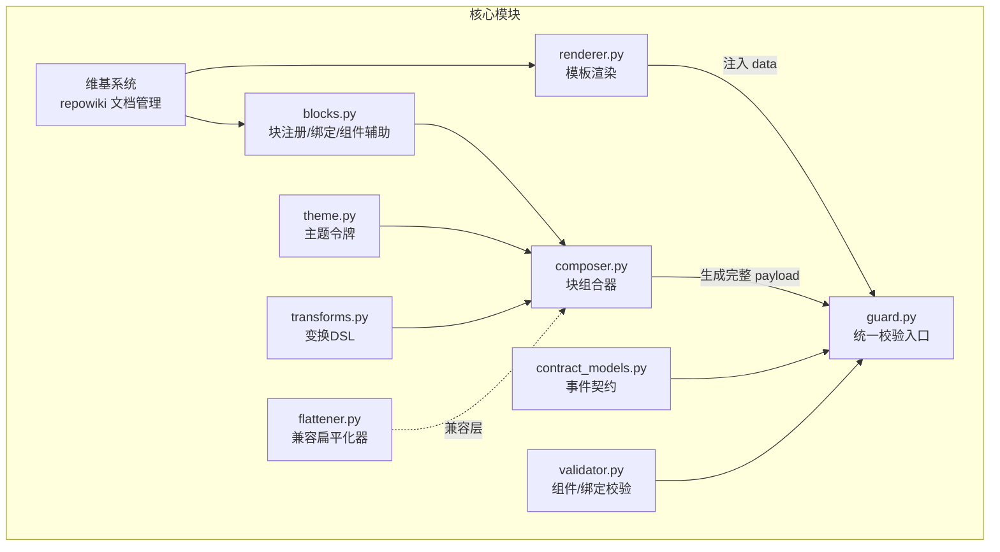
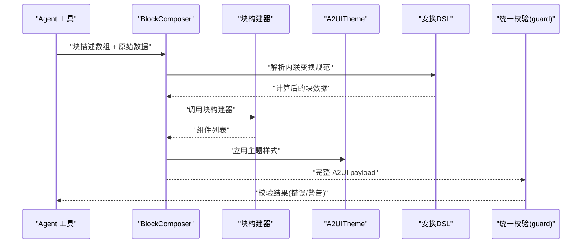
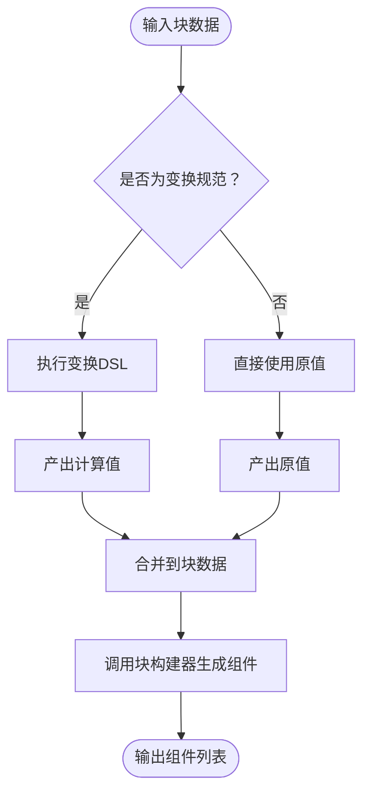
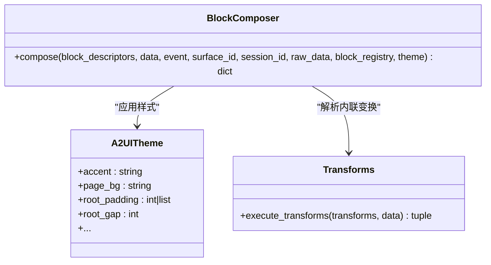
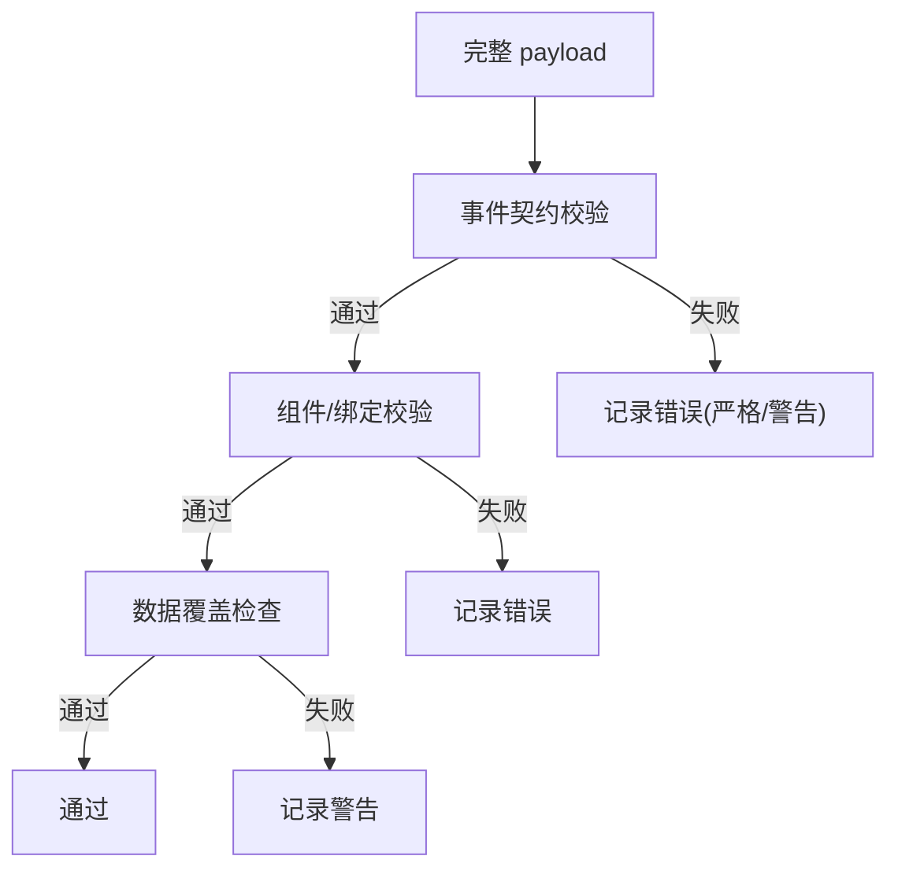
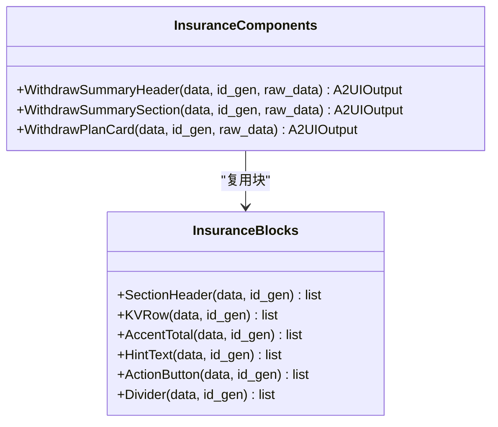
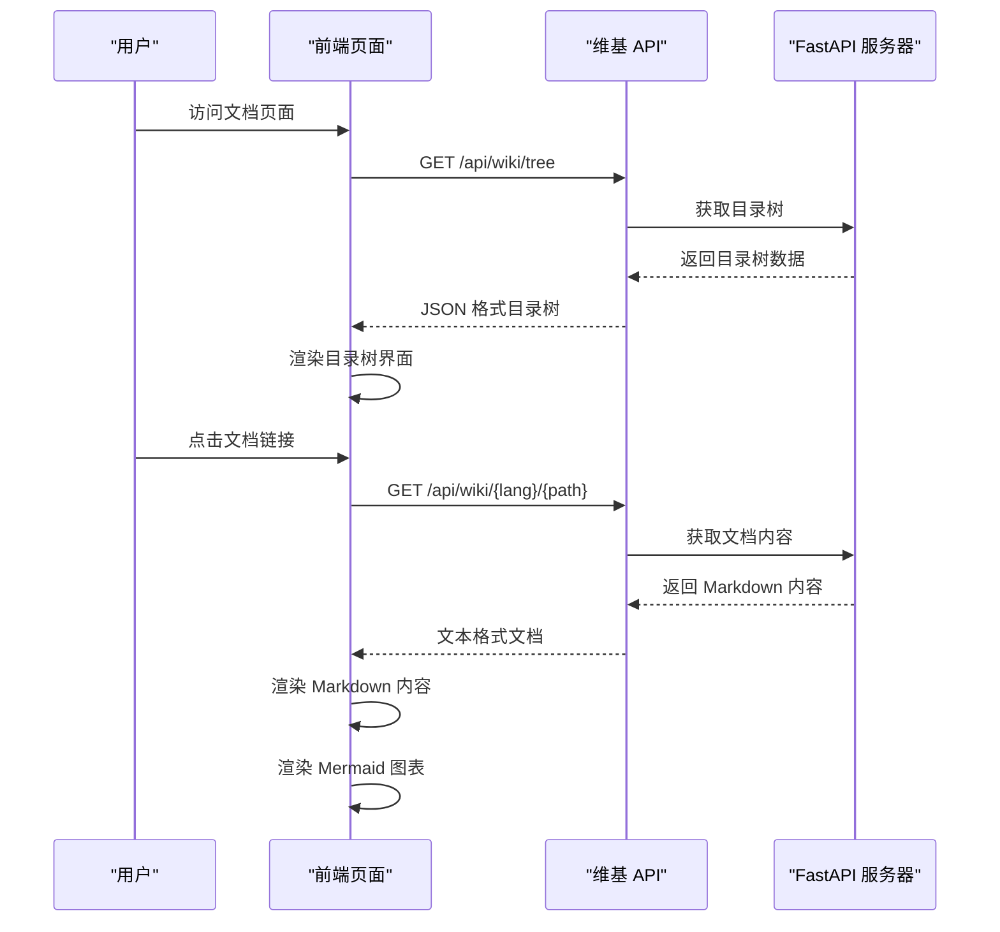
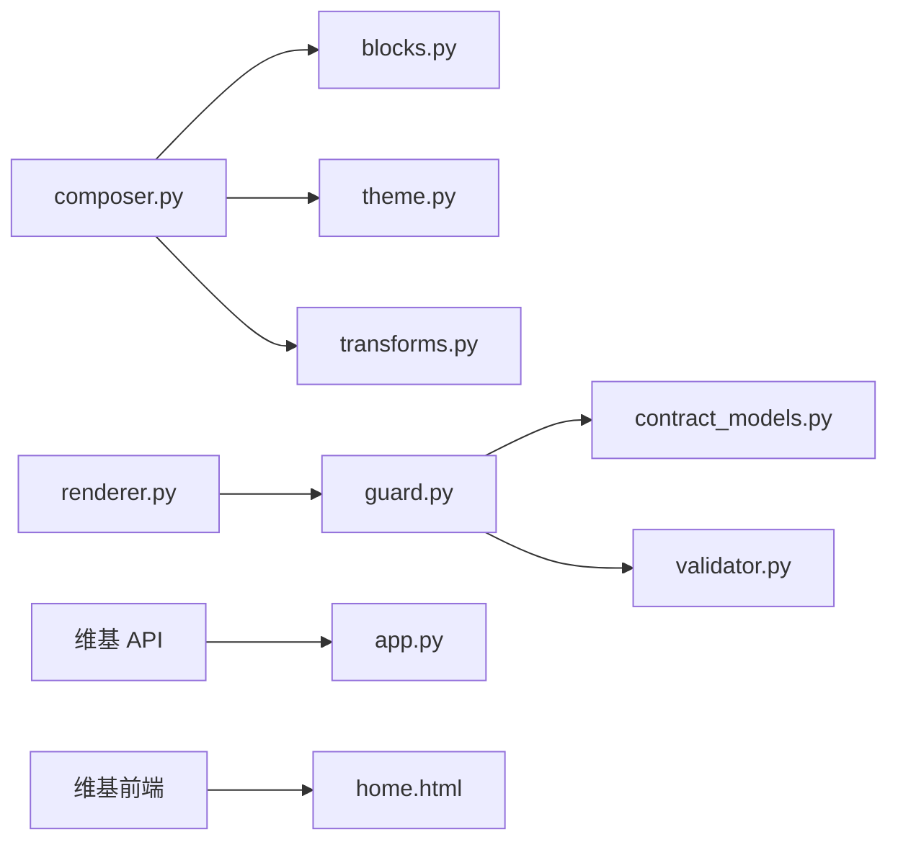

# A2UI 渲染系统

<cite>
**本文档引用的文件**
- [a2ui/__init__.py](file://src/ark_agentic/core/a2ui/__init__.py)
- [blocks.py](file://src/ark_agentic/core/a2ui/blocks.py)
- [composer.py](file://src/ark_agentic/core/a2ui/composer.py)
- [renderer.py](file://src/ark_agentic/core/a2ui/renderer.py)
- [theme.py](file://src/ark_agentic/core/a2ui/theme.py)
- [contract_models.py](file://src/ark_agentic/core/a2ui/contract_models.py)
- [validator.py](file://src/ark_agentic/core/a2ui/validator.py)
- [guard.py](file://src/ark_agentic/core/a2ui/guard.py)
- [transforms.py](file://src/ark_agentic/core/a2ui/transforms.py)
- [flattener.py](file://src/ark_agentic/core/a2ui/flattener.py)
- [a2ui-modes-overview.md](file://docs/a2ui/a2ui-modes-overview.md)
- [a2ui-standard.md](file://docs/a2ui/a2ui-standard.md)
- [blocks.py（保险代理）](file://src/ark_agentic/agents/insurance/a2ui/blocks.py)
- [components.py（保险代理）](file://src/ark_agentic/agents/insurance/a2ui/components.py)
- [withdraw_a2ui_utils.py](file://src/ark_agentic/agents/insurance/a2ui/withdraw_a2ui_utils.py)
- [app.py](file://src/ark_agentic/app.py)
- [home.html](file://src/ark_agentic/static/home.html)
</cite>

## 更新摘要
**所做更改**
- 新增维基系统集成章节，介绍 repowiki 目录结构和文档管理系统
- 更新项目结构章节，包含维基系统的目录组织
- 新增维基系统 API 接口说明，涵盖树形结构和页面获取功能
- 添加维基系统前端集成，包括目录树渲染和页面加载机制
- 更新文档架构，反映完整的中英文文档系统

## 目录
1. [简介](#简介)
2. [项目结构](#项目结构)
3. [核心组件](#核心组件)
4. [架构总览](#架构总览)
5. [详细组件分析](#详细组件分析)
6. [维基系统集成](#维基系统集成)
7. [依赖分析](#依赖分析)
8. [性能考虑](#性能考虑)
9. [故障排查指南](#故障排查指南)
10. [结论](#结论)
11. [附录](#附录)

## 简介
本文件系统性阐述 A2UI 渲染系统的设计与实现，涵盖双模式架构（preset 与 dynamic）、块描述符系统、组件组合器、主题系统、数据绑定与动态渲染、以及最佳实践与集成指南。A2UI 以"事件驱动"的协议承载 UI 组件树与数据，通过严格的契约校验与统一的校验层保证输出质量。

**更新** 新增维基系统集成，提供完整的中英文文档管理和 API 接口支持。

## 项目结构
A2UI 核心位于 src/ark_agentic/core/a2ui，围绕以下模块协同工作：
- 渲染器与模板：renderer.py
- 块基础设施与注册表：blocks.py
- 组件组合器：composer.py
- 主题系统：theme.py
- 事件契约与组件校验：contract_models.py、validator.py
- 统一校验入口：guard.py
- 变换 DSL：transforms.py
- 兼容性扁平化器：flattener.py
- **维基系统：repowiki 目录结构和 API 接口**



**图表来源**
- [renderer.py:15-53](file://src/ark_agentic/core/a2ui/renderer.py#L15-L53)
- [blocks.py:96-149](file://src/ark_agentic/core/a2ui/blocks.py#L96-L149)
- [composer.py:57-123](file://src/ark_agentic/core/a2ui/composer.py#L57-L123)
- [theme.py:12-39](file://src/ark_agentic/core/a2ui/theme.py#L12-L39)
- [contract_models.py:7-123](file://src/ark_agentic/core/a2ui/contract_models.py#L7-L123)
- [validator.py:8-227](file://src/ark_agentic/core/a2ui/validator.py#L8-L227)
- [guard.py:83-125](file://src/ark_agentic/core/a2ui/guard.py#L83-L125)
- [transforms.py:366-396](file://src/ark_agentic/core/a2ui/transforms.py#L366-L396)
- [flattener.py:106-273](file://src/ark_agentic/core/a2ui/flattener.py#L106-L273)

**章节来源**
- [a2ui/__init__.py:1-39](file://src/ark_agentic/core/a2ui/__init__.py#L1-L39)
- [a2ui-modes-overview.md:1-140](file://docs/a2ui/a2ui-modes-overview.md#L1-L140)

## 核心组件
- 渲染器（render_from_template）：从模板目录按 card_type 读取 template.json，注入 surfaceId，并用传入 data 合并覆盖模板 data，返回完整 A2UI 负载。
- 块注册与绑定（blocks.py）：维护块构建器注册表，提供 A2UIOutput 结构，支持 $field 简写到标准绑定格式的解析，以及组件辅助函数。
- 组件组合器（BlockComposer）：将块描述符数组展开为完整 A2UI payload，支持在块数据中内联变换规范，按 theme 应用页面与卡片样式。
- 主题系统（A2UITheme）：集中管理视觉令牌（颜色、形状、密度、根间距等），作为统一风格来源。
- 事件契约与组件校验（contract_models.py、validator.py）：前者约束事件类型与顶层字段，后者校验组件类型、属性、引用与绑定互斥。
- 统一校验入口（guard.py）：串联事件契约、组件校验与数据覆盖检查，提供严格/警告策略。
- 变换 DSL（transforms.py）：提供 get/sum/count/concat/select/switch/literal 等操作，支持路径解析、数组过滤与映射、格式化输出。
- 兼容扁平化器（flattener.py）：旧版树扁平化与简写兼容，已标记为废弃，保留向后兼容。
- **维基系统（repowiki）**：提供完整的中英文文档管理系统，支持目录树结构和页面内容获取。

**章节来源**
- [renderer.py:15-53](file://src/ark_agentic/core/a2ui/renderer.py#L15-L53)
- [blocks.py:46-149](file://src/ark_agentic/core/a2ui/blocks.py#L46-L149)
- [composer.py:57-123](file://src/ark_agentic/core/a2ui/composer.py#L57-L123)
- [theme.py:12-39](file://src/ark_agentic/core/a2ui/theme.py#L12-L39)
- [contract_models.py:7-123](file://src/ark_agentic/core/a2ui/contract_models.py#L7-L123)
- [validator.py:8-227](file://src/ark_agentic/core/a2ui/validator.py#L8-L227)
- [guard.py:83-125](file://src/ark_agentic/core/a2ui/guard.py#L83-L125)
- [transforms.py:17-396](file://src/ark_agentic/core/a2ui/transforms.py#L17-L396)
- [flattener.py:106-273](file://src/ark_agentic/core/a2ui/flattener.py#L106-L273)

## 架构总览
A2UI 双模式架构将"预设模板"与"动态块组合"统一到同一协议与校验体系之下。动态模式下，LLM 直接输出块描述数组，BlockComposer 与 transforms 将其展开为完整 payload；预设模式下，通过模板渲染器注入 data 并返回 payload。两者均经由统一的 guard 校验层。



**图表来源**
- [composer.py:60-123](file://src/ark_agentic/core/a2ui/composer.py#L60-L123)
- [transforms.py:186-316](file://src/ark_agentic/core/a2ui/transforms.py#L186-L316)
- [blocks.py:96-149](file://src/ark_agentic/core/a2ui/blocks.py#L96-L149)
- [guard.py:83-125](file://src/ark_agentic/core/a2ui/guard.py#L83-L125)

**章节来源**
- [a2ui-modes-overview.md:19-95](file://docs/a2ui/a2ui-modes-overview.md#L19-L95)

## 详细组件分析

### 块描述符系统与绑定
- 块注册表：通过装饰器注册块构建器，支持为特定块类型声明必需字段，缺失时抛出 BlockDataError。
- 绑定解析：$field 简写自动扩展为标准绑定格式；支持 path 与 literalString 二选一的绑定互斥规则。
- 组件辅助：提供 _comp/_text 等轻量封装，减少样板代码。



**图表来源**
- [composer.py:45-55](file://src/ark_agentic/core/a2ui/composer.py#L45-L55)
- [transforms.py:186-316](file://src/ark_agentic/core/a2ui/transforms.py#L186-L316)
- [blocks.py:65-81](file://src/ark_agentic/core/a2ui/blocks.py#L65-L81)

**章节来源**
- [blocks.py:96-149](file://src/ark_agentic/core/a2ui/blocks.py#L96-L149)
- [composer.py:29-55](file://src/ark_agentic/core/a2ui/composer.py#L29-L55)

### 组件组合器（BlockComposer）
- 输入：块描述数组、原始数据、可选主题、会话/表面标识。
- 处理：解析内联变换、查找块构建器、生成组件树、包装为 Column 根节点、注入主题样式。
- 输出：完整 A2UI payload（包含 event、version、surfaceId、rootComponentId、components、data 等）。



**图表来源**
- [composer.py:57-123](file://src/ark_agentic/core/a2ui/composer.py#L57-L123)
- [theme.py:12-39](file://src/ark_agentic/core/a2ui/theme.py#L12-L39)
- [transforms.py:366-396](file://src/ark_agentic/core/a2ui/transforms.py#L366-L396)

**章节来源**
- [composer.py:57-123](file://src/ark_agentic/core/a2ui/composer.py#L57-L123)

### 主题系统（A2UITheme）
- 设计令牌：强调色、标题/正文/提示/注释色、卡片/页面背景、分隔线色、圆角、卡片宽度与内边距、根间距与间隙等。
- 使用方式：BlockComposer 在生成 Column 根节点时直接读取主题令牌，确保全局一致性。

**章节来源**
- [theme.py:12-39](file://src/ark_agentic/core/a2ui/theme.py#L12-L39)
- [composer.py:96-110](file://src/ark_agentic/core/a2ui/composer.py#L96-L110)

### 事件契约与组件校验
- 事件契约：限定事件类型与允许字段集合，beginRendering/surfaceUpdate/dataModelUpdate/deleteSurface 各自约束。
- 组件校验：校验组件类型、属性、引用完整性、绑定互斥等。
- 数据覆盖检查：检测 path 绑定是否引用了 payload.data 中缺失的键位。



**图表来源**
- [contract_models.py:97-123](file://src/ark_agentic/core/a2ui/contract_models.py#L97-L123)
- [validator.py:88-227](file://src/ark_agentic/core/a2ui/validator.py#L88-L227)
- [guard.py:83-125](file://src/ark_agentic/core/a2ui/guard.py#L83-L125)

**章节来源**
- [contract_models.py:7-123](file://src/ark_agentic/core/a2ui/contract_models.py#L7-L123)
- [validator.py:8-227](file://src/ark_agentic/core/a2ui/validator.py#L8-L227)
- [guard.py:39-81](file://src/ark_agentic/core/a2ui/guard.py#L39-L81)

### 变换 DSL（transforms）
- 支持操作：get、sum、count、concat、select、switch、literal。
- 路径解析：支持点号路径、数组索引与通配访问，提供越界与类型错误。
- 条件过滤：where 表达式支持比较运算与逻辑组合。
- 映射与格式化：select.map 支持逐项映射与格式化输出。
- 错误处理：TransformError 携带操作符与字段上下文，便于 LLM 重试。

**章节来源**
- [transforms.py:17-396](file://src/ark_agentic/core/a2ui/transforms.py#L17-L396)

### 模板渲染（preset 模式）
- 从模板目录按 card_type 读取 template.json，注入 surfaceId，合并 data，返回完整 payload。
- 适用于"预设卡片"场景（如证券 Agent 的 display_card）。

**章节来源**
- [renderer.py:15-53](file://src/ark_agentic/core/a2ui/renderer.py#L15-L53)

### 保险代理的块与组件示例
- 块（blocks.py）：SectionHeader、KVRow、AccentTotal、HintText、ActionButton、Divider 等，均由工厂函数绑定主题并注册。
- 组件（components.py）：WithdrawSummaryHeader、WithdrawSummarySection、WithdrawPlanCard 等业务卡片，负责业务逻辑与 A2UIOutput 输出。
- 工具（withdraw_a2ui_utils.py）：渠道与分配算法、格式化、按钮文案映射等。



**图表来源**
- [blocks.py:25-145](file://src/ark_agentic/agents/insurance/a2ui/blocks.py#L25-L145)
- [components.py:69-470](file://src/ark_agentic/agents/insurance/a2ui/components.py#L69-L470)

**章节来源**
- [blocks.py:25-145](file://src/ark_agentic/agents/insurance/a2ui/blocks.py#L25-L145)
- [components.py:69-470](file://src/ark_agentic/agents/insurance/a2ui/components.py#L69-L470)
- [withdraw_a2ui_utils.py:55-123](file://src/ark_agentic/agents/insurance/a2ui/withdraw_a2ui_utils.py#L55-L123)

## 维基系统集成

### repowiki 目录结构
维基系统采用完整的中英文双语文档结构，位于项目根目录的 repowiki 文件夹中：

```
repowiki/
├── zh/                    # 中文文档
│   ├── content/          # 中文内容目录
│   └── meta/             # 中文元数据
└── en/                    # 英文文档
    ├── content/          # 英文内容目录
    └── meta/             # 英文元数据
```

### 维基系统 API 接口
维基系统提供完整的 RESTful API 接口，支持文档树形结构和页面内容获取：

#### 目录树获取接口
- **端点**：`GET /api/wiki/tree`
- **功能**：返回 repowiki 两种语言的目录树结构
- **排序规则**：按 repowiki-metadata.json 的 wiki_items 顺序排列
- **响应格式**：JSON 对象，包含 zh 和 en 两个语言的目录树

#### 文档页面获取接口
- **端点**：`GET /api/wiki/{lang}/{path:path}`
- **参数**：
  - `lang`：语言代码（zh 或 en）
  - `path`：文档路径（支持嵌套目录）
- **功能**：返回指定 wiki 页面的 Markdown 内容
- **安全检查**：防止路径穿越攻击
- **响应格式**：纯文本（text/markdown）

### 前端集成实现
维基系统与前端页面深度集成，通过 home.html 实现完整的文档浏览体验：

#### 目录树渲染
- 支持中英文双语切换
- 递归渲染目录结构
- 点击事件绑定文档加载
- 响应式布局适配

#### 文档内容展示
- Markdown 渲染支持（marked.js）
- Mermaid 图表渲染
- 面包屑导航
- 语法高亮
- 滚动定位



**图表来源**
- [app.py:198-264](file://src/ark_agentic/app.py#L198-L264)
- [home.html:1200-1352](file://src/ark_agentic/static/home.html#L1200-L1352)

**章节来源**
- [app.py:172-264](file://src/ark_agentic/app.py#L172-L264)
- [home.html:1200-1352](file://src/ark_agentic/static/home.html#L1200-L1352)

## 依赖分析
- 模块耦合：composer 依赖 blocks 与 theme；transforms 与 composer 协作解析内联变换；guard 统一串联契约与组件校验。
- 外部依赖：无第三方 UI 框架，完全基于协议与校验层。
- 循环依赖：未发现循环导入。
- **维基系统依赖**：app.py 依赖 repowiki 目录结构，home.html 依赖维基 API 接口。



**图表来源**
- [composer.py:20-22](file://src/ark_agentic/core/a2ui/composer.py#L20-L22)
- [guard.py:15-16](file://src/ark_agentic/core/a2ui/guard.py#L15-L16)
- [renderer.py:38-50](file://src/ark_agentic/core/a2ui/renderer.py#L38-L50)
- [app.py:172-173](file://src/ark_agentic/app.py#L172-L173)

**章节来源**
- [composer.py:20-22](file://src/ark_agentic/core/a2ui/composer.py#L20-L22)
- [guard.py:15-16](file://src/ark_agentic/core/a2ui/guard.py#L15-L16)
- [renderer.py:38-50](file://src/ark_agentic/core/a2ui/renderer.py#L38-L50)

## 性能考虑
- 变换计算：内联变换在 compose 阶段执行，避免运行时重复计算；注意避免深层嵌套与大规模数组遍历。
- 校验成本：guard 校验在输出前进行，建议在开发阶段启用严格模式，生产环境可按需调整为警告模式。
- 组件数量：大量组件会增加序列化与前端渲染压力，建议通过分页或懒加载优化。
- **维基系统性能**：目录树构建使用缓存机制，Markdown 渲染采用异步加载，Mermaid 图表按需渲染。

## 故障排查指南
- 事件契约错误：检查 event 类型与允许字段，确保 beginRendering/surfaceUpdate/dataModelUpdate/deleteSurface 的必要字段齐全。
- 组件/绑定错误：核对组件类型、属性、引用完整性与绑定互斥规则。
- 数据覆盖警告：检查 path 绑定是否引用了 payload.data 中缺失的键位，尤其是 List 子项的 item.* 路径。
- 块数据缺失：确认块构建器声明的必需字段是否齐全，否则会触发 BlockDataError。
- **维基系统故障**：检查 repowiki 目录结构完整性，确认 meta/repowiki-metadata.json 文件存在且格式正确，验证文档路径安全性。

**章节来源**
- [contract_models.py:97-123](file://src/ark_agentic/core/a2ui/contract_models.py#L97-L123)
- [validator.py:88-227](file://src/ark_agentic/core/a2ui/validator.py#L88-L227)
- [guard.py:39-81](file://src/ark_agentic/core/a2ui/guard.py#L39-L81)
- [blocks.py:102-117](file://src/ark_agentic/core/a2ui/blocks.py#L102-L117)

## 结论
A2UI 渲染系统以协议为中心，通过块注册与组合器实现动态编排，结合主题系统与严格校验层确保一致性与可靠性。双模式架构既满足预设卡片的快速交付，也支持动态块的灵活组合，适合复杂业务场景下的 UI 生成与迭代。**新增的维基系统提供了完整的中英文文档管理能力，通过 RESTful API 和前端集成实现了便捷的文档浏览和维护体验。**

## 附录

### A2UI 模式概览与最佳实践
- 动态模式（render_a2ui）：块描述数组 + 内联变换，适合保险等复杂业务；建议为每个块类型定义 schema，明确 data 字段与变换规则。
- 预设模式（display_card）：模板 + data 合并，适合证券等标准化卡片；建议将模板与提取器解耦，便于维护。
- 组件输出：A2UIOutput 统一承载 components、template_data、llm_digest、state_delta，便于下游工具自动填充与对话上下文。

**章节来源**
- [a2ui-modes-overview.md:19-95](file://docs/a2ui/a2ui-modes-overview.md#L19-L95)

### A2UI 协议与组件参考
- 协议字段：event、version、surfaceId、rootComponentId、components、catalogId、style、data、hideVoteRecorder、exposureData。
- 组件类型：Row、Column、Card、List、Table、Popup、Text、RichText、Image、Icon、Tag、Circle、Divider、Line、Button。
- 绑定规则：文本/图片/图标/标签/按钮等组件的绑定字段必须为二选一（path 或 literalString）。

**章节来源**
- [a2ui-standard.md:1-804](file://docs/a2ui/a2ui-standard.md#L1-L804)

### 维基系统配置与维护
- **目录结构**：遵循 repowiki/{zh,en}/content 和 repowiki/{zh,en}/meta 的标准结构
- **元数据管理**：通过 repowiki-metadata.json 控制文档排序和分类
- **内容维护**：支持 Markdown 格式，自动渲染 Mermaid 图表
- **多语言支持**：中英文双语文档同步维护，独立的目录树和内容管理

**章节来源**
- [app.py:198-264](file://src/ark_agentic/app.py#L198-L264)
- [home.html:1200-1352](file://src/ark_agentic/static/home.html#L1200-L1352)