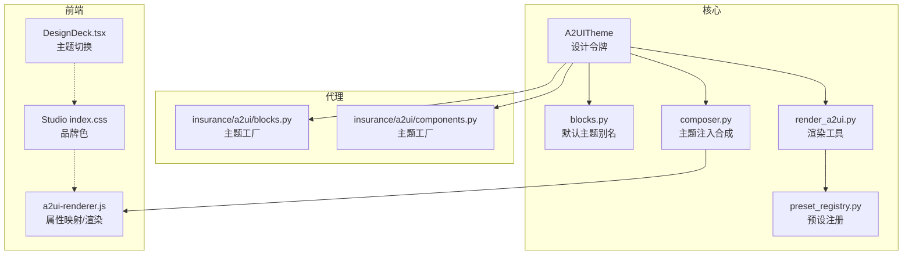
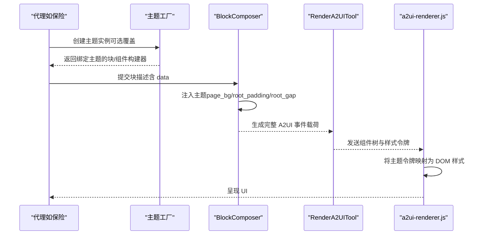
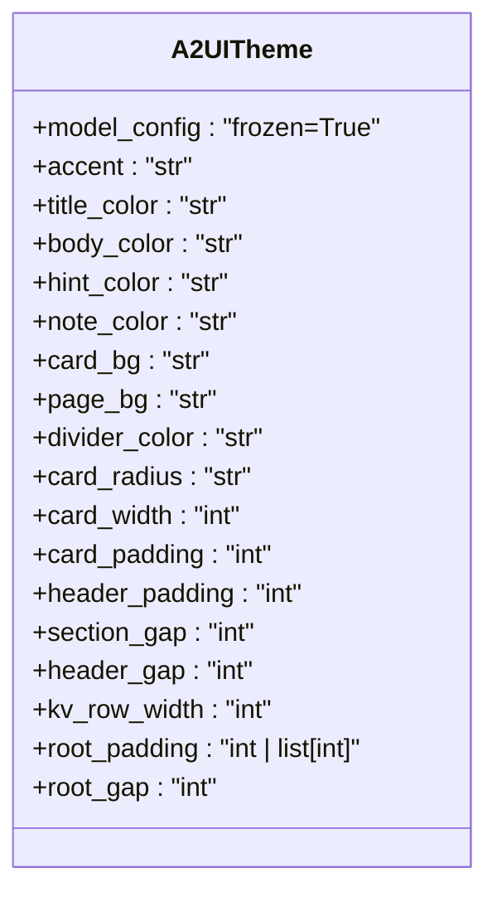
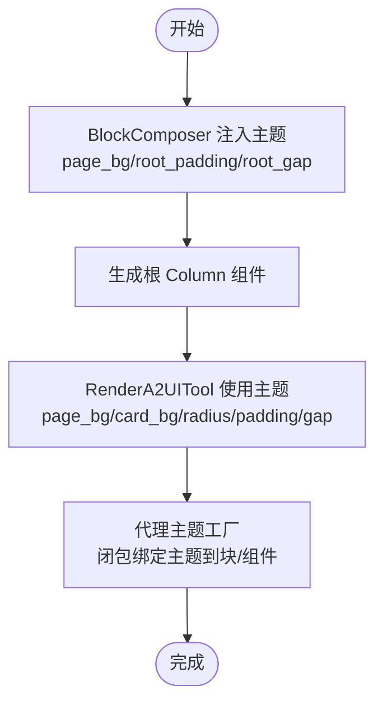
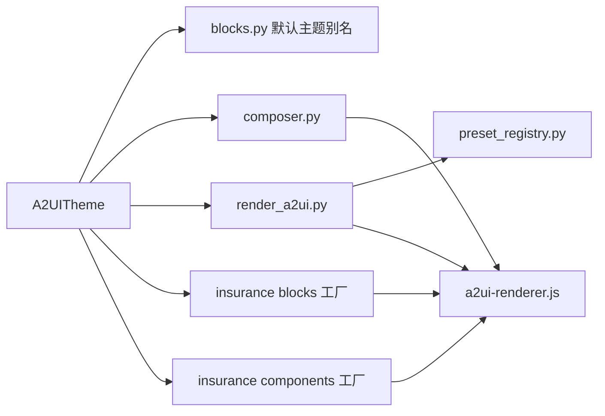

# 主题系统与样式定制

<cite>
**本文档引用的文件**
- [theme.py](file://src/ark_agentic/core/a2ui/theme.py)
- [blocks.py](file://src/ark_agentic/core/a2ui/blocks.py)
- [composer.py](file://src/ark_agentic/core/a2ui/composer.py)
- [render_a2ui.py](file://src/ark_agentic/core/tools/render_a2ui.py)
- [a2ui-renderer.js](file://src/ark_agentic/static/a2ui-renderer.js)
- [blocks.py（保险代理）](file://src/ark_agentic/agents/insurance/a2ui/blocks.py)
- [components.py（保险代理）](file://src/ark_agentic/agents/insurance/a2ui/components.py)
- [preset_registry.py](file://src/ark_agentic/core/a2ui/preset_registry.py)
- [test_a2ui_theme.py](file://tests/unit/core/test_a2ui_theme.py)
- [index.css（Studio）](file://src/ark_agentic/studio/frontend/src/index.css)
- [DesignDeck.tsx](file://docs/architect-viewer/src/DesignDeck.tsx)
</cite>

## 目录
1. [简介](#简介)
2. [项目结构](#项目结构)
3. [核心组件](#核心组件)
4. [架构总览](#架构总览)
5. [详细组件分析](#详细组件分析)
6. [依赖关系分析](#依赖关系分析)
7. [性能考量](#性能考量)
8. [故障排查指南](#故障排查指南)
9. [结论](#结论)
10. [附录](#附录)

## 简介
本文件系统性阐述 A2UI 主题系统与样式定制的技术实现，围绕 A2UITheme 设计令牌模型展开，覆盖颜色系统、形状与密度规范、根表面间距、主题继承与覆盖策略、样式在前端渲染中的应用路径，以及与块构建器、合成器、渲染工具的集成方式。同时提供主题配置示例、自定义主题开发指南、品牌化定制方案、调试技巧与跨浏览器兼容性建议。

## 项目结构
A2UI 主题系统位于核心模块中，并在前端静态渲染器中被消费。关键文件分布如下：
- 核心主题定义：src/ark_agentic/core/a2ui/theme.py
- 主题别名与默认实例：src/ark_agentic/core/a2ui/blocks.py
- 主题注入与渲染：src/ark_agentic/core/a2ui/composer.py、src/ark_agentic/core/tools/render_a2ui.py
- 前端渲染器：src/ark_agentic/static/a2ui-renderer.js
- 代理侧主题工厂与组件：src/ark_agentic/agents/insurance/a2ui/blocks.py、src/ark_agentic/agents/insurance/a2ui/components.py
- 预设注册表：src/ark_agentic/core/a2ui/preset_registry.py
- 测试与验证：tests/unit/core/test_a2ui_theme.py
- Studio 品牌色与设计系统：src/ark_agentic/studio/frontend/src/index.css
- 架构 Viewer 主题切换：docs/architect-viewer/src/DesignDeck.tsx

图表来源
- [theme.py:12-39](file://src/ark_agentic/core/a2ui/theme.py#L12-L39)
- [blocks.py:27-37](file://src/ark_agentic/core/a2ui/blocks.py#L27-L37)
- [composer.py:69-108](file://src/ark_agentic/core/a2ui/composer.py#L69-L108)
- [render_a2ui.py:204-207](file://src/ark_agentic/core/tools/render_a2ui.py#L204-L207)
- [blocks.py（保险代理）:25-27](file://src/ark_agentic/agents/insurance/a2ui/blocks.py#L25-L27)
- [components.py（保险代理）:69-71](file://src/ark_agentic/agents/insurance/a2ui/components.py#L69-L71)
- [a2ui-renderer.js:5-139](file://src/ark_agentic/static/a2ui-renderer.js#L5-L139)
- [index.css（Studio）:6-48](file://src/ark_agentic/studio/frontend/src/index.css#L6-L48)
- [DesignDeck.tsx:37-54](file://docs/architect-viewer/src/DesignDeck.tsx#L37-L54)

章节来源
- [theme.py:12-39](file://src/ark_agentic/core/a2ui/theme.py#L12-L39)
- [blocks.py:27-37](file://src/ark_agentic/core/a2ui/blocks.py#L27-L37)
- [composer.py:69-108](file://src/ark_agentic/core/a2ui/composer.py#L69-L108)
- [render_a2ui.py:204-207](file://src/ark_agentic/core/tools/render_a2ui.py#L204-L207)
- [blocks.py（保险代理）:25-27](file://src/ark_agentic/agents/insurance/a2ui/blocks.py#L25-L27)
- [components.py（保险代理）:69-71](file://src/ark_agentic/agents/insurance/a2ui/components.py#L69-L71)
- [a2ui-renderer.js:5-139](file://src/ark_agentic/static/a2ui-renderer.js#L5-L139)
- [index.css（Studio）:6-48](file://src/ark_agentic/studio/frontend/src/index.css#L6-L48)
- [DesignDeck.tsx:37-54](file://docs/architect-viewer/src/DesignDeck.tsx#L37-L54)

## 核心组件
- A2UITheme：不可变设计令牌集合，定义颜色、形状与密度、根表面间距等视觉属性。
- 默认主题别名：从默认主题实例导出常量，保持向后兼容。
- 主题注入：BlockComposer 与 RenderA2UITool 在合成与渲染时注入主题。
- 代理主题工厂：保险代理提供 create_insurance_blocks/create_insurance_components 工厂，闭包绑定主题。
- 前端渲染器：a2ui-renderer.js 将主题令牌映射为 DOM 样式属性。

章节来源
- [theme.py:12-39](file://src/ark_agentic/core/a2ui/theme.py#L12-L39)
- [blocks.py:27-37](file://src/ark_agentic/core/a2ui/blocks.py#L27-L37)
- [composer.py:69-108](file://src/ark_agentic/core/a2ui/composer.py#L69-L108)
- [render_a2ui.py:204-207](file://src/ark_agentic/core/tools/render_a2ui.py#L204-L207)
- [blocks.py（保险代理）:25-27](file://src/ark_agentic/agents/insurance/a2ui/blocks.py#L25-L27)
- [components.py（保险代理）:69-71](file://src/ark_agentic/agents/insurance/a2ui/components.py#L69-L71)
- [a2ui-renderer.js:5-139](file://src/ark_agentic/static/a2ui-renderer.js#L5-L139)

## 架构总览
A2UI 主题系统采用“令牌驱动”的设计：Python 端定义 A2UITheme，前端渲染器读取并映射为样式。主题通过合成器与渲染工具注入到根容器与卡片组件中，代理侧通过工厂函数将主题闭包绑定到具体块构建器与组件构建器。

图表来源
- [blocks.py（保险代理）:25-27](file://src/ark_agentic/agents/insurance/a2ui/blocks.py#L25-L27)
- [composer.py:69-108](file://src/ark_agentic/core/a2ui/composer.py#L69-L108)
- [render_a2ui.py:431-451](file://src/ark_agentic/core/tools/render_a2ui.py#L431-L451)
- [a2ui-renderer.js:105-139](file://src/ark_agentic/static/a2ui-renderer.js#L105-L139)

## 详细组件分析

### A2UITheme 设计令牌模型
- 不可变性：使用冻结配置，确保主题一致性与线程安全。
- 颜色系统：强调色、标题/正文/提示/注释文本色、卡片背景、页面背景、分隔线颜色。
- 形状与密度：卡片圆角、卡片宽度、卡片内边距、头部内边距、分节间距、头部间距、键值行宽度。
- 根表面间距：根容器内边距支持数字或四向数组，根容器间距。

图表来源
- [theme.py:12-39](file://src/ark_agentic/core/a2ui/theme.py#L12-L39)

章节来源
- [theme.py:12-39](file://src/ark_agentic/core/a2ui/theme.py#L12-L39)

### 主题继承与覆盖策略
- 部分覆盖：仅指定需要变更的字段，未指定字段沿用默认值。
- 完整覆盖：通过构造函数一次性设置多个字段，形成新的主题实例。
- 列表型间距：root_padding 支持四向数组，前端渲染器会按顺序映射为 CSS 上右下左。
- 向后兼容：模块级常量 ACCENT/PAGE_BG/CARD_BG 等由默认主题实例导出，便于现有代码迁移。

章节来源
- [blocks.py:27-37](file://src/ark_agentic/core/a2ui/blocks.py#L27-L37)
- [test_a2ui_theme.py:47-72](file://tests/unit/core/test_a2ui_theme.py#L47-L72)
- [a2ui-renderer.js:141-151](file://src/ark_agentic/static/a2ui-renderer.js#L141-L151)

### 主题注入与样式应用
- 合成阶段：BlockComposer 在生成根 Column 时读取主题的 page_bg、root_padding、root_gap，并将其写入组件属性。
- 渲染阶段：RenderA2UITool 在 blocks 模式下同样使用主题的 page_bg、card_bg、card_radius、card_padding、header_gap 等，用于生成 Card 与 Column。
- 代理工厂：保险代理的 create_insurance_blocks/create_insurance_components 工厂将主题闭包绑定到块/组件构建器，确保构建结果使用指定主题。

图表来源
- [composer.py:69-108](file://src/ark_agentic/core/a2ui/composer.py#L69-L108)
- [render_a2ui.py:431-541](file://src/ark_agentic/core/tools/render_a2ui.py#L431-L541)
- [blocks.py（保险代理）:25-27](file://src/ark_agentic/agents/insurance/a2ui/blocks.py#L25-L27)
- [components.py（保险代理）:69-71](file://src/ark_agentic/agents/insurance/a2ui/components.py#L69-L71)

章节来源
- [composer.py:69-108](file://src/ark_agentic/core/a2ui/composer.py#L69-L108)
- [render_a2ui.py:431-541](file://src/ark_agentic/core/tools/render_a2ui.py#L431-L541)
- [blocks.py（保险代理）:25-27](file://src/ark_agentic/agents/insurance/a2ui/blocks.py#L25-L27)
- [components.py（保险代理）:69-71](file://src/ark_agentic/agents/insurance/a2ui/components.py#L69-L71)

### 前端渲染器与样式映射
- 边框半径映射：small/middle/big 映射为固定像素值。
- 通用属性应用：width/height/minWidth/minHeight/padding/margin/backgroundColor/borderRadius/position/zIndex/flex/flexWrap/boxSizing/border/boxShadow/hide。
- 数组内边距：支持四向数组，前端按上右下左映射。
- 隐藏逻辑：基于布尔解析决定 display:none。

章节来源
- [a2ui-renderer.js:5-139](file://src/ark_agentic/static/a2ui-renderer.js#L5-L139)
- [a2ui-renderer.js:141-151](file://src/ark_agentic/static/a2ui-renderer.js#L141-L151)
- [a2ui-renderer.js:1685-1714](file://src/ark_agentic/static/a2ui-renderer.js#L1685-L1714)

### 预设模式与主题
- 预设注册表：PresetRegistry 保存提取器，预设模式直接返回提取器产出的前端就绪载荷。
- 主题参与：预设模式不直接组装组件树，但可通过提取器内部使用主题令牌生成前端数据。

章节来源
- [preset_registry.py:25-46](file://src/ark_agentic/core/a2ui/preset_registry.py#L25-L46)
- [render_a2ui.py:601-631](file://src/ark_agentic/core/tools/render_a2ui.py#L601-L631)

### 响应式设计与可访问性考虑
- 响应式：前端渲染器支持百分比宽度与数值像素混合，适配不同容器尺寸。
- 可访问性：文本颜色与强调色遵循对比度原则；隐藏逻辑避免屏幕阅读器误读；按钮与链接样式提供可见焦点与悬停反馈（前端样式常量中定义）。

章节来源
- [a2ui-renderer.js:105-139](file://src/ark_agentic/static/a2ui-renderer.js#L105-L139)
- [a2ui-renderer.js:26-32](file://src/ark_agentic/static/a2ui-renderer.js#L26-L32)

## 依赖关系分析
- A2UITheme 被 blocks.py（默认主题别名）、composer.py（合成）、render_a2ui.py（渲染）、代理 blocks/components 工厂广泛依赖。
- 前端渲染器 a2ui-renderer.js 依赖主题令牌进行样式映射。
- 预设注册表与渲染工具配合，形成预设模式下的主题数据流。

图表来源
- [theme.py:12-39](file://src/ark_agentic/core/a2ui/theme.py#L12-L39)
- [blocks.py:27-37](file://src/ark_agentic/core/a2ui/blocks.py#L27-L37)
- [composer.py:69-108](file://src/ark_agentic/core/a2ui/composer.py#L69-L108)
- [render_a2ui.py:204-207](file://src/ark_agentic/core/tools/render_a2ui.py#L204-L207)
- [blocks.py（保险代理）:25-27](file://src/ark_agentic/agents/insurance/a2ui/blocks.py#L25-L27)
- [components.py（保险代理）:69-71](file://src/ark_agentic/agents/insurance/a2ui/components.py#L69-L71)
- [preset_registry.py:25-46](file://src/ark_agentic/core/a2ui/preset_registry.py#L25-L46)
- [a2ui-renderer.js:105-139](file://src/ark_agentic/static/a2ui-renderer.js#L105-L139)

章节来源
- [theme.py:12-39](file://src/ark_agentic/core/a2ui/theme.py#L12-L39)
- [blocks.py:27-37](file://src/ark_agentic/core/a2ui/blocks.py#L27-L37)
- [composer.py:69-108](file://src/ark_agentic/core/a2ui/composer.py#L69-L108)
- [render_a2ui.py:204-207](file://src/ark_agentic/core/tools/render_a2ui.py#L204-L207)
- [blocks.py（保险代理）:25-27](file://src/ark_agentic/agents/insurance/a2ui/blocks.py#L25-L27)
- [components.py（保险代理）:69-71](file://src/ark_agentic/agents/insurance/a2ui/components.py#L69-L71)
- [preset_registry.py:25-46](file://src/ark_agentic/core/a2ui/preset_registry.py#L25-L46)
- [a2ui-renderer.js:105-139](file://src/ark_agentic/static/a2ui-renderer.js#L105-L139)

## 性能考量
- 主题不可变：冻结模型避免运行期修改带来的副作用，提升并发安全性。
- 闭包绑定：代理工厂将主题绑定到构建器，减少重复查询与上下文传递。
- 前端映射：常量映射表（如边框半径）减少条件判断开销。
- 最大嵌套限制：渲染工具对 Card 嵌套深度有限制，防止递归过深导致栈溢出。

章节来源
- [theme.py:15-15](file://src/ark_agentic/core/a2ui/theme.py#L15-L15)
- [blocks.py（保险代理）:25-27](file://src/ark_agentic/agents/insurance/a2ui/blocks.py#L25-L27)
- [render_a2ui.py:503-505](file://src/ark_agentic/core/tools/render_a2ui.py#L503-L505)

## 故障排查指南
- 主题覆盖无效：确认是否通过构造函数传入主题实例，而非直接赋值字段（冻结模型不允许）。
- 根容器间距异常：检查 root_padding 是否为四向数组，前端会按上右下左映射。
- 颜色不生效：核对块/组件构建器是否使用了主题令牌，或是否被局部属性覆盖。
- 预设模式报错：检查预设类型是否存在、card_args JSON 是否合法、提取器是否抛出异常。
- 合约校验失败：开启严格校验模式时，若违反 A2UI 合约，工具会返回错误与警告。

章节来源
- [test_a2ui_theme.py:74-81](file://tests/unit/core/test_a2ui_theme.py#L74-L81)
- [a2ui-renderer.js:141-151](file://src/ark_agentic/static/a2ui-renderer.js#L141-L151)
- [render_a2ui.py:348-356](file://src/ark_agentic/core/tools/render_a2ui.py#L348-L356)
- [render_a2ui.py:545-597](file://src/ark_agentic/core/tools/render_a2ui.py#L545-L597)
- [render_a2ui.py:635-662](file://src/ark_agentic/core/tools/render_a2ui.py#L635-L662)

## 结论
A2UI 主题系统通过 A2UITheme 将品牌与设计令牌集中管理，并在 Python 合成与前端渲染两个层面无缝衔接。借助冻结模型、闭包绑定与常量映射，系统实现了高一致性、强扩展性与良好性能。通过测试覆盖与工具链保障，主题定制与品牌化落地具备可操作性与可维护性。

## 附录

### 主题配置示例
- 基础覆盖：仅覆盖强调色与根间距，其他字段沿用默认。
- 完整暗色主题：覆盖页面背景、卡片背景、文本颜色与分隔线颜色。
- 根容器四向内边距：使用数组形式定义上/右/下/左间距。

章节来源
- [test_a2ui_theme.py:47-72](file://tests/unit/core/test_a2ui_theme.py#L47-L72)
- [test_a2ui_theme.py:60-72](file://tests/unit/core/test_a2ui_theme.py#L60-L72)
- [a2ui-renderer.js:141-151](file://src/ark_agentic/static/a2ui-renderer.js#L141-L151)

### 自定义主题开发指南
- 定义主题：通过构造函数传入所需字段，得到新的 A2UITheme 实例。
- 注入到合成器：在调用 BlockComposer 时传入主题实例。
- 注入到渲染工具：在 RenderA2UITool 初始化时传入 BlocksConfig.theme。
- 代理工厂：使用 create_insurance_blocks/create_insurance_components 工厂闭包绑定主题。
- 前端验证：通过测试断言确认颜色、间距、圆角等属性正确应用。

章节来源
- [composer.py:69-71](file://src/ark_agentic/core/a2ui/composer.py#L69-L71)
- [render_a2ui.py:204-207](file://src/ark_agentic/core/tools/render_a2ui.py#L204-L207)
- [blocks.py（保险代理）:25-27](file://src/ark_agentic/agents/insurance/a2ui/blocks.py#L25-L27)
- [components.py（保险代理）:69-71](file://src/ark_agentic/agents/insurance/a2ui/components.py#L69-L71)
- [test_a2ui_theme.py:272-358](file://tests/unit/core/test_a2ui_theme.py#L272-L358)

### 品牌化定制方案
- Studio 品牌色：通过 CSS 变量定义主色、表面色、边框色、阴影等，与 A2UI 主题形成协同。
- 架构 Viewer 主题切换：通过 URL 参数与状态管理切换主题，便于设计评审与对比。

章节来源
- [index.css（Studio）:6-48](file://src/ark_agentic/studio/frontend/src/index.css#L6-L48)
- [DesignDeck.tsx:37-54](file://docs/architect-viewer/src/DesignDeck.tsx#L37-L54)

### 调试技巧
- 断言颜色与间距：在测试中验证 Divider/Line/Text 等组件的颜色与尺寸。
- 校验默认回退：确认默认主题工厂输出与历史常量一致。
- 预设模式排错：检查类型、参数 JSON 与提取器异常。

章节来源
- [test_a2ui_theme.py:315-340](file://tests/unit/core/test_a2ui_theme.py#L315-L340)
- [test_a2ui_theme.py:341-343](file://tests/unit/core/test_a2ui_theme.py#L341-L343)
- [render_a2ui.py:347-377](file://src/ark_agentic/core/tools/render_a2ui.py#L347-L377)

### 跨浏览器兼容性处理
- 样式映射：统一使用 CSS 属性映射，避免使用非标准前缀。
- 数组内边距：前端明确按上右下左顺序映射，保证多浏览器一致性。
- 隐藏逻辑：使用 display:none 控制可见性，避免使用不可访问的属性。

章节来源
- [a2ui-renderer.js:141-151](file://src/ark_agentic/static/a2ui-renderer.js#L141-L151)
- [a2ui-renderer.js:134-139](file://src/ark_agentic/static/a2ui-renderer.js#L134-L139)