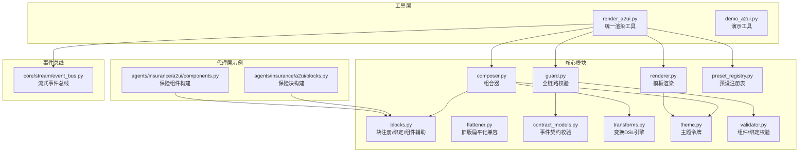
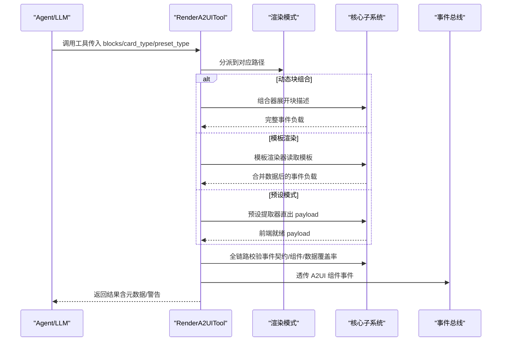
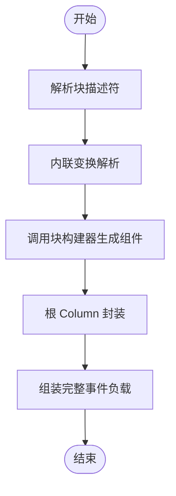
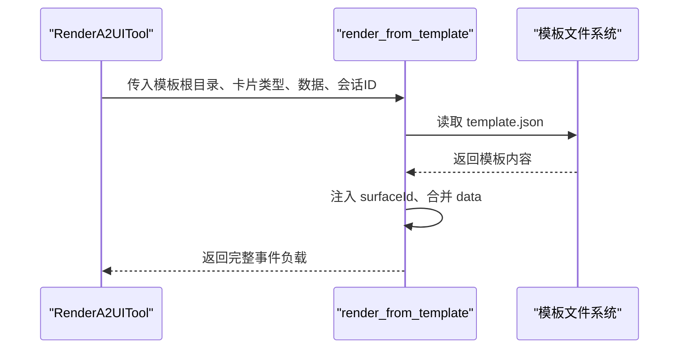
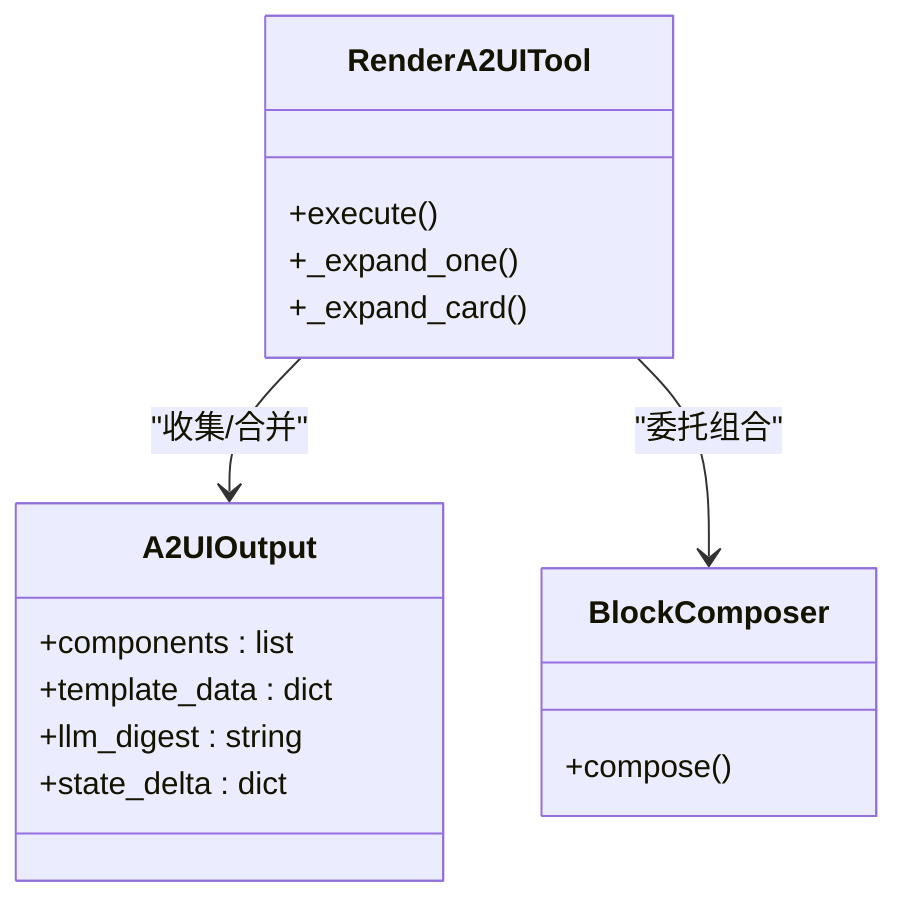
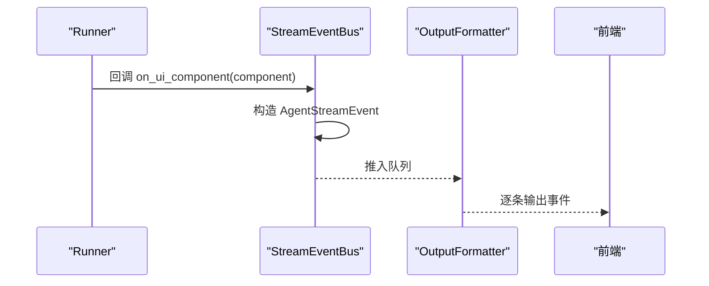
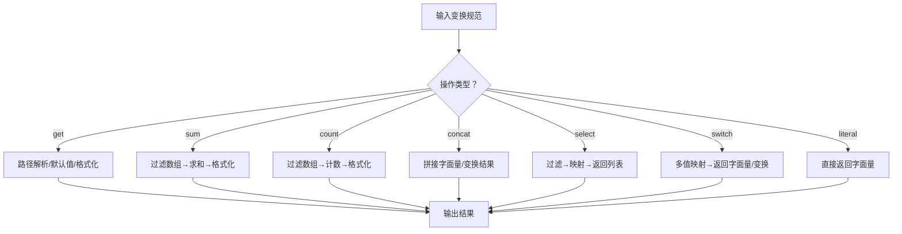
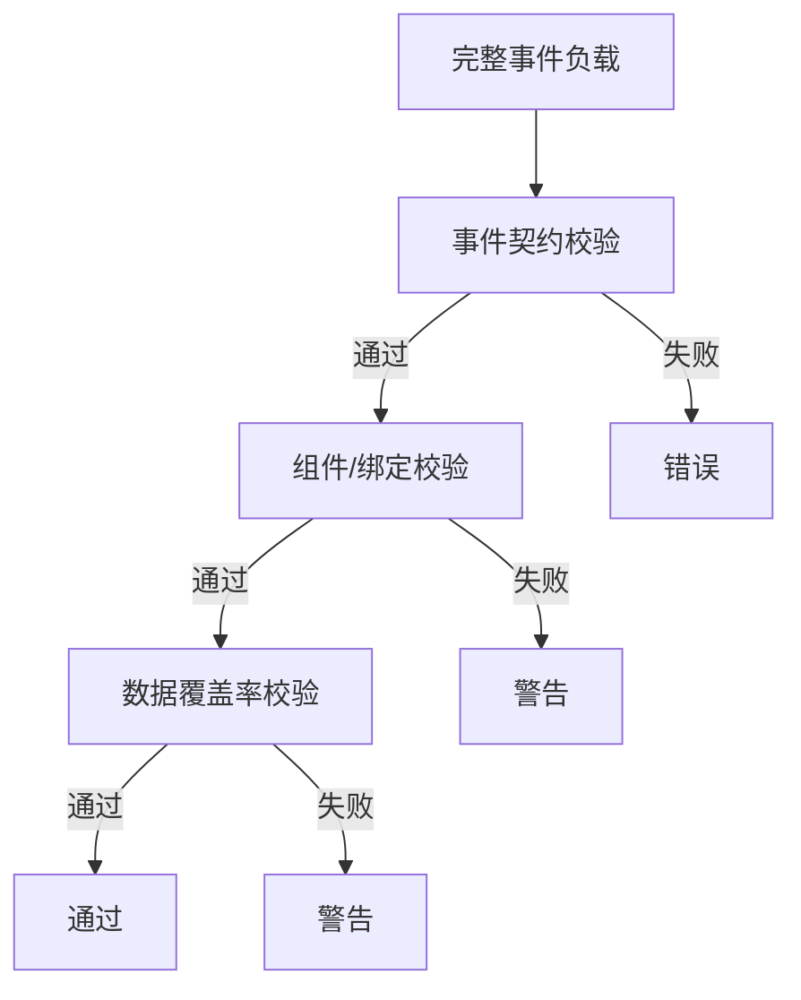
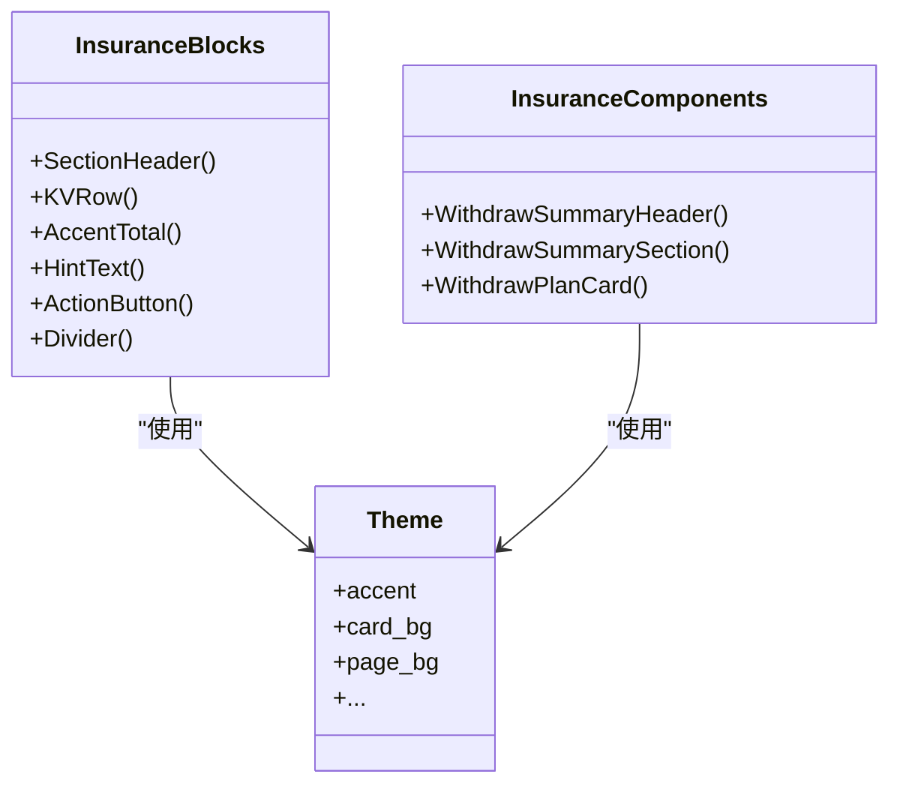
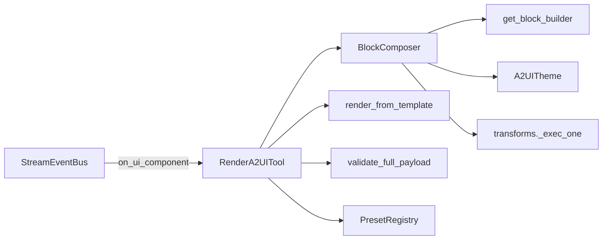

# 卡片渲染与组合器

<cite>
**本文引用的文件**
- [composer.py](file://src/ark_agentic/core/a2ui/composer.py)
- [blocks.py](file://src/ark_agentic/core/a2ui/blocks.py)
- [renderer.py](file://src/ark_agentic/core/a2ui/renderer.py)
- [flattener.py](file://src/ark_agentic/core/a2ui/flattener.py)
- [contract_models.py](file://src/ark_agentic/core/a2ui/contract_models.py)
- [transforms.py](file://src/ark_agentic/core/a2ui/transforms.py)
- [theme.py](file://src/ark_agentic/core/a2ui/theme.py)
- [guard.py](file://src/ark_agentic/core/a2ui/guard.py)
- [preset_registry.py](file://src/ark_agentic/core/a2ui/preset_registry.py)
- [event_bus.py](file://src/ark_agentic/core/stream/event_bus.py)
- [render_a2ui.py](file://src/ark_agentic/core/tools/render_a2ui.py)
- [demo_a2ui.py](file://src/ark_agentic/core/tools/demo_a2ui.py)
- [blocks.py（保险代理）](file://src/ark_agentic/agents/insurance/a2ui/blocks.py)
- [components.py（保险代理）](file://src/ark_agentic/agents/insurance/a2ui/components.py)
- [validator.py](file://src/ark_agentic/core/a2ui/validator.py)
</cite>

## 目录
1. [简介](#简介)
2. [项目结构](#项目结构)
3. [核心组件](#核心组件)
4. [架构总览](#架构总览)
5. [详细组件分析](#详细组件分析)
6. [依赖分析](#依赖分析)
7. [性能考虑](#性能考虑)
8. [故障排查指南](#故障排查指南)
9. [结论](#结论)
10. [附录](#附录)

## 简介
本文件面向 A2UI 卡片渲染与组合器的实现与使用，聚焦以下主题：
- BlockComposer 的组件组合机制与卡片扁平化处理
- 渲染流程控制与事件总线集成
- 渲染器工作原理、组件树构建、状态管理与动态更新机制
- 具体渲染示例、组合器使用模式与性能优化策略
- 卡片设计实践指南与常见问题解决方案

## 项目结构
A2UI 子系统位于 core/a2ui 与 core/tools 下，围绕“块（Block）/组件（Component）”的动态组合、模板渲染与预设模式提供统一的渲染工具，并通过事件总线与运行时管线对接。

**图表来源**
- [composer.py:57-123](file://src/ark_agentic/core/a2ui/composer.py#L57-L123)
- [blocks.py:96-149](file://src/ark_agentic/core/a2ui/blocks.py#L96-L149)
- [renderer.py:15-53](file://src/ark_agentic/core/a2ui/renderer.py#L15-L53)
- [contract_models.py:7-47](file://src/ark_agentic/core/a2ui/contract_models.py#L7-L47)
- [transforms.py:186-316](file://src/ark_agentic/core/a2ui/transforms.py#L186-L316)
- [theme.py:12-39](file://src/ark_agentic/core/a2ui/theme.py#L12-L39)
- [guard.py:83-125](file://src/ark_agentic/core/a2ui/guard.py#L83-L125)
- [validator.py:88-227](file://src/ark_agentic/core/a2ui/validator.py#L88-L227)
- [preset_registry.py:25-53](file://src/ark_agentic/core/a2ui/preset_registry.py#L25-L53)
- [render_a2ui.py:178-685](file://src/ark_agentic/core/tools/render_a2ui.py#L178-L685)
- [demo_a2ui.py:17-74](file://src/ark_agentic/core/tools/demo_a2ui.py#L17-L74)
- [blocks.py（保险代理）:25-145](file://src/ark_agentic/agents/insurance/a2ui/blocks.py#L25-L145)
- [components.py（保险代理）:69-470](file://src/ark_agentic/agents/insurance/a2ui/components.py#L69-L470)
- [event_bus.py:67-248](file://src/ark_agentic/core/stream/event_bus.py#L67-L248)

**章节来源**
- [composer.py:1-123](file://src/ark_agentic/core/a2ui/composer.py#L1-L123)
- [blocks.py:1-149](file://src/ark_agentic/core/a2ui/blocks.py#L1-L149)
- [renderer.py:1-53](file://src/ark_agentic/core/a2ui/renderer.py#L1-L53)
- [flattener.py:1-273](file://src/ark_agentic/core/a2ui/flattener.py#L1-L273)
- [contract_models.py:1-123](file://src/ark_agentic/core/a2ui/contract_models.py#L1-L123)
- [transforms.py:1-396](file://src/ark_agentic/core/a2ui/transforms.py#L1-L396)
- [theme.py:1-39](file://src/ark_agentic/core/a2ui/theme.py#L1-L39)
- [guard.py:1-125](file://src/ark_agentic/core/a2ui/guard.py#L1-L125)
- [validator.py:1-227](file://src/ark_agentic/core/a2ui/validator.py#L1-L227)
- [preset_registry.py:1-53](file://src/ark_agentic/core/a2ui/preset_registry.py#L1-L53)
- [render_a2ui.py:1-685](file://src/ark_agentic/core/tools/render_a2ui.py#L1-L685)
- [demo_a2ui.py:1-74](file://src/ark_agentic/core/tools/demo_a2ui.py#L1-L74)
- [blocks.py（保险代理）:1-145](file://src/ark_agentic/agents/insurance/a2ui/blocks.py#L1-L145)
- [components.py（保险代理）:1-538](file://src/ark_agentic/agents/insurance/a2ui/components.py#L1-L538)
- [event_bus.py:1-248](file://src/ark_agentic/core/stream/event_bus.py#L1-L248)

## 核心组件
- 组合器（BlockComposer）：将块描述符展开为标准 A2UI 事件负载，内置内联变换解析与主题注入。
- 块基础设施（blocks.py）：块注册表、绑定解析、组件辅助函数与输出容器。
- 渲染器（renderer.py）：基于模板目录与模板 JSON 的卡片渲染。
- 变换 DSL（transforms.py）：声明式数据变换引擎，支持 get/sum/count/concat/select/switch/literal。
- 主题（theme.py）：品牌视觉令牌的单一真实来源。
- 全链路校验（guard.py + validator.py + contract_models.py）：事件契约、组件/绑定与数据覆盖率校验。
- 预设注册表（preset_registry.py）：按卡片类型直出前端就绪 payload 的预设模式。
- 统一渲染工具（render_a2ui.py）：三通道统一入口（blocks/template/preset），并进行严格校验与元数据附加。
- 事件总线（event_bus.py）：将运行时回调转化为流式事件，支持 A2UI 组件事件透传。

**章节来源**
- [composer.py:57-123](file://src/ark_agentic/core/a2ui/composer.py#L57-L123)
- [blocks.py:96-149](file://src/ark_agentic/core/a2ui/blocks.py#L96-L149)
- [renderer.py:15-53](file://src/ark_agentic/core/a2ui/renderer.py#L15-L53)
- [transforms.py:186-316](file://src/ark_agentic/core/a2ui/transforms.py#L186-L316)
- [theme.py:12-39](file://src/ark_agentic/core/a2ui/theme.py#L12-L39)
- [guard.py:83-125](file://src/ark_agentic/core/a2ui/guard.py#L83-L125)
- [validator.py:88-227](file://src/ark_agentic/core/a2ui/validator.py#L88-L227)
- [preset_registry.py:25-53](file://src/ark_agentic/core/a2ui/preset_registry.py#L25-L53)
- [render_a2ui.py:178-685](file://src/ark_agentic/core/tools/render_a2ui.py#L178-L685)
- [event_bus.py:67-248](file://src/ark_agentic/core/stream/event_bus.py#L67-L248)

## 架构总览
A2UI 渲染采用“工具层统一入口 + 核心渲染子系统”的分层设计，支持三种渲染路径：
- 动态块组合（blocks）：LLM 提供块描述，组合器展开为完整事件负载。
- 模板渲染（card_type）：加载模板 JSON，合并数据，输出完整事件负载。
- 预设模式（preset_type）：直接返回前端就绪 payload，不走组件树装配。

**图表来源**
- [render_a2ui.py:328-363](file://src/ark_agentic/core/tools/render_a2ui.py#L328-L363)
- [composer.py:60-123](file://src/ark_agentic/core/a2ui/composer.py#L60-L123)
- [renderer.py:15-53](file://src/ark_agentic/core/a2ui/renderer.py#L15-L53)
- [guard.py:83-125](file://src/ark_agentic/core/a2ui/guard.py#L83-L125)
- [event_bus.py:202-207](file://src/ark_agentic/core/stream/event_bus.py#L202-L207)

## 详细组件分析

### 组合器（BlockComposer）与卡片扁平化
- 组合流程
  - 输入：块描述符数组、原始数据、可选主题/会话/表面 ID。
  - 内联变换解析：对块 data 中的变换规范进行求值，支持 get/sum/count/concat/select/switch/literal。
  - 构建组件：通过块注册表或默认查找器定位构建器，生成组件列表。
  - 根节点封装：将所有组件以 Column 作为根容器，注入主题样式。
  - 输出：标准 A2UI 事件负载（包含事件类型、版本、surfaceId、rootComponentId、data、components）。
- 卡片扁平化
  - 旧版扁平化（flattener.py）现已标记为弃用，仅保留向后兼容能力；新版推荐使用组合器直接生成标准格式。
  - 新版通过“块→组件→根 Column”的方式实现扁平化，避免额外转换层，提升性能与一致性。

**图表来源**
- [composer.py:60-123](file://src/ark_agentic/core/a2ui/composer.py#L60-L123)
- [flattener.py:106-142](file://src/ark_agentic/core/a2ui/flattener.py#L106-L142)

**章节来源**
- [composer.py:57-123](file://src/ark_agentic/core/a2ui/composer.py#L57-L123)
- [flattener.py:1-273](file://src/ark_agentic/core/a2ui/flattener.py#L1-L273)

### 渲染器（模板渲染）
- 工作原理
  - 从模板根目录按 card_type 定位 template.json，读取并解析为事件负载。
  - 注入 surfaceId（结合 session_id 与随机片段），合并 data 字段（后者优先覆盖模板中的 data）。
  - 返回完整 A2UI 事件负载。
- 使用场景
  - 适用于静态模板驱动的卡片，快速产出标准化 UI。

**图表来源**
- [renderer.py:15-53](file://src/ark_agentic/core/a2ui/renderer.py#L15-L53)
- [render_a2ui.py:545-597](file://src/ark_agentic/core/tools/render_a2ui.py#L545-L597)

**章节来源**
- [renderer.py:1-53](file://src/ark_agentic/core/a2ui/renderer.py#L1-L53)
- [render_a2ui.py:545-597](file://src/ark_agentic/core/tools/render_a2ui.py#L545-L597)

### 组件树构建与状态管理
- 组件树构建
  - 统一渲染工具在 blocks 模式下，递归展开块描述，支持 Card 嵌套与深度限制。
  - 每个块构建器返回 A2UIOutput，包含 components 列表、llm_digest 与 state_delta。
  - 根节点 Column 由工具层统一生成，注入主题参数。
- 状态管理与动态更新
  - A2UIOutput.state_delta 会在工具层合并后写入结果元数据，供下游工具自动填充。
  - 支持 surfaceUpdate 事件类型，基于 surfaceId 进行增量更新。

**图表来源**
- [blocks.py:46-60](file://src/ark_agentic/core/a2ui/blocks.py#L46-L60)
- [render_a2ui.py:460-542](file://src/ark_agentic/core/tools/render_a2ui.py#L460-L542)
- [composer.py:60-123](file://src/ark_agentic/core/a2ui/composer.py#L60-L123)

**章节来源**
- [blocks.py:46-60](file://src/ark_agentic/core/a2ui/blocks.py#L46-L60)
- [render_a2ui.py:460-542](file://src/ark_agentic/core/tools/render_a2ui.py#L460-L542)

### 事件总线集成
- 事件总线职责
  - 将运行时回调（如 step_started/finished、text_message_*、tool_call_*、on_ui_component）转化为标准 AgentStreamEvent。
  - 自动配对 start/finish 事件，终结事件自动关闭活跃状态。
- A2UI 组件透传
  - on_ui_component 回调被转换为 content_kind="a2ui" 的文本消息内容，便于前端统一消费。

**图表来源**
- [event_bus.py:202-207](file://src/ark_agentic/core/stream/event_bus.py#L202-L207)
- [demo_a2ui.py:41-74](file://src/ark_agentic/core/tools/demo_a2ui.py#L41-L74)

**章节来源**
- [event_bus.py:67-248](file://src/ark_agentic/core/stream/event_bus.py#L67-L248)
- [demo_a2ui.py:17-74](file://src/ark_agentic/core/tools/demo_a2ui.py#L17-L74)

### 变换 DSL 引擎
- 支持操作
  - get：路径取值，支持默认值与格式化。
  - sum：对数组字段求和，支持 where 过滤与格式化。
  - count：统计数组条数，支持 where 过滤与格式化。
  - concat：拼接字符串，支持字面量与嵌套变换。
  - select：选择数组项，支持 where 过滤与 map 映射。
  - switch：多值映射，支持 cases/default。
  - literal：字面量包装。
- 路径解析与容错
  - 支持嵌套路径与数组索引/通配访问，异常时记录警告并回退。

**图表来源**
- [transforms.py:186-316](file://src/ark_agentic/core/a2ui/transforms.py#L186-L316)

**章节来源**
- [transforms.py:1-396](file://src/ark_agentic/core/a2ui/transforms.py#L1-L396)

### 全链路校验与契约
- 事件契约
  - beginRendering/surfaceUpdate/dataModelUpdate/deleteSurface 的字段白名单与必填校验。
- 组件/绑定校验
  - 组件类型合法性、props 结构、引用完整性、绑定字段 XOR 约束。
- 数据覆盖率
  - 检测绑定 path 是否在 payload.data 中存在（排除 item.*）。

**图表来源**
- [contract_models.py:97-123](file://src/ark_agentic/core/a2ui/contract_models.py#L97-L123)
- [validator.py:88-227](file://src/ark_agentic/core/a2ui/validator.py#L88-L227)
- [guard.py:83-125](file://src/ark_agentic/core/a2ui/guard.py#L83-L125)

**章节来源**
- [contract_models.py:1-123](file://src/ark_agentic/core/a2ui/contract_models.py#L1-L123)
- [validator.py:1-227](file://src/ark_agentic/core/a2ui/validator.py#L1-L227)
- [guard.py:1-125](file://src/ark_agentic/core/a2ui/guard.py#L1-L125)

### 代理层示例（保险）
- 块构建（blocks.py）
  - 提供 SectionHeader/KVRow/AccentTotal/HintText/ActionButton/Divider 等基础块。
  - 通过闭包工厂注入主题，保证风格一致性。
- 组件构建（components.py）
  - 提供 WithdrawSummaryHeader/WithdrawSummarySection/WithdrawPlanCard 等业务卡片。
  - 返回 A2UIOutput，包含组件、摘要与状态增量，便于下游自动填充。

**图表来源**
- [blocks.py（保险代理）:25-145](file://src/ark_agentic/agents/insurance/a2ui/blocks.py#L25-L145)
- [components.py（保险代理）:69-470](file://src/ark_agentic/agents/insurance/a2ui/components.py#L69-L470)
- [theme.py:12-39](file://src/ark_agentic/core/a2ui/theme.py#L12-L39)

**章节来源**
- [blocks.py（保险代理）:1-145](file://src/ark_agentic/agents/insurance/a2ui/blocks.py#L1-L145)
- [components.py（保险代理）:1-538](file://src/ark_agentic/agents/insurance/a2ui/components.py#L1-L538)

## 依赖分析
- 组合器依赖
  - blocks.get_block_builder：块构建器查找。
  - theme.A2UITheme：主题注入。
  - transforms._exec_one：内联变换执行。
- 统一渲染工具依赖
  - blocks.A2UIOutput：输出容器。
  - composer.BlockComposer：动态组合。
  - renderer.render_from_template：模板渲染。
  - preset_registry.PresetRegistry：预设提取器。
  - guard.validate_full_payload：全链路校验。
- 事件总线依赖
  - 通过 on_ui_component 将组件事件透传为流式事件。

**图表来源**
- [composer.py:20-22](file://src/ark_agentic/core/a2ui/composer.py#L20-L22)
- [render_a2ui.py:25-30](file://src/ark_agentic/core/tools/render_a2ui.py#L25-L30)
- [event_bus.py:202-207](file://src/ark_agentic/core/stream/event_bus.py#L202-L207)

**章节来源**
- [composer.py:1-123](file://src/ark_agentic/core/a2ui/composer.py#L1-L123)
- [render_a2ui.py:1-685](file://src/ark_agentic/core/tools/render_a2ui.py#L1-L685)
- [event_bus.py:1-248](file://src/ark_agentic/core/stream/event_bus.py#L1-L248)

## 性能考虑
- 减少不必要的转换
  - 新版组合器直接生成标准格式，避免旧版扁平化（flattener）的额外开销。
- 变换执行优化
  - 变换 DSL 在求值时尽量避免深层嵌套与重复访问，合理使用 where 过滤减少遍历。
- 组件树深度控制
  - 统一渲染工具对 Card 嵌套设置上限，防止过深导致栈溢出与渲染延迟。
- 校验策略
  - 生产环境建议启用严格校验（A2UI_STRICT_VALIDATION=enforce），提前发现潜在问题，避免前端渲染失败。

[本节为通用指导，无需特定文件来源]

## 故障排查指南
- 常见错误与定位
  - 事件契约错误：检查 event、version、surfaceId、components/data 等字段是否满足要求。
  - 组件/绑定错误：确认组件类型合法、props 结构正确、绑定字段 XOR 成立、引用 ID 存在。
  - 数据覆盖率警告：检查绑定 path 是否存在于 payload.data，排除 item.* 场景。
- 日志与告警
  - 变换失败会记录警告并回退，关注 TRANSFORM_WARN/ERROR 类日志。
  - 全链路校验会输出错误与警告列表，便于快速定位。
- 快速修复建议
  - 对照组件 schema 修正 blocks 参数。
  - 确认模板文件存在且为合法 JSON。
  - 使用预设模式时，确保提取器返回的 template_data 符合前端预期。

**章节来源**
- [contract_models.py:97-123](file://src/ark_agentic/core/a2ui/contract_models.py#L97-L123)
- [validator.py:88-227](file://src/ark_agentic/core/a2ui/validator.py#L88-L227)
- [guard.py:83-125](file://src/ark_agentic/core/a2ui/guard.py#L83-L125)
- [transforms.py:366-396](file://src/ark_agentic/core/a2ui/transforms.py#L366-L396)

## 结论
A2UI 卡片渲染与组合器通过“块/组件动态组合 + 模板渲染 + 预设模式”的多通道设计，实现了灵活、可扩展且可校验的 UI 生成体系。配合主题系统、变换 DSL 与全链路校验，既能满足复杂业务场景，又能保证一致性与稳定性。事件总线进一步打通了运行时与前端的交互路径，使 A2UI 组件能够无缝融入流式对话体验。

[本节为总结性内容，无需特定文件来源]

## 附录

### 渲染示例与使用模式
- 动态块组合
  - LLM 提供块描述数组（含 type 与 data），统一渲染工具调用组合器展开，返回完整事件负载。
- 模板渲染
  - 指定 card_type，工具读取模板并合并数据，输出完整事件负载。
- 预设模式
  - 指定 preset_type，直接返回前端就绪 payload，适合快速直出场景。

**章节来源**
- [render_a2ui.py:328-363](file://src/ark_agentic/core/tools/render_a2ui.py#L328-L363)
- [renderer.py:15-53](file://src/ark_agentic/core/a2ui/renderer.py#L15-L53)

### 卡片设计实践指南
- 设计令牌
  - 使用主题（A2UITheme）统一颜色、间距与圆角，确保跨卡片风格一致。
- 组件选择
  - 优先使用语义化组件（Row/Column/Card/List/Table/Button 等），避免过度嵌套。
- 绑定与数据
  - 使用绑定（path/literalString）而非硬编码文本，提升可维护性。
- 变换策略
  - 将复杂计算前置到变换层，减少前端负担；合理使用 where 过滤与格式化。
- 校验先行
  - 开发阶段启用严格校验，尽早暴露问题；生产环境根据需要调整严格度。

**章节来源**
- [theme.py:12-39](file://src/ark_agentic/core/a2ui/theme.py#L12-L39)
- [validator.py:88-227](file://src/ark_agentic/core/a2ui/validator.py#L88-L227)
- [transforms.py:186-316](file://src/ark_agentic/core/a2ui/transforms.py#L186-L316)
- [guard.py:83-125](file://src/ark_agentic/core/a2ui/guard.py#L83-L125)