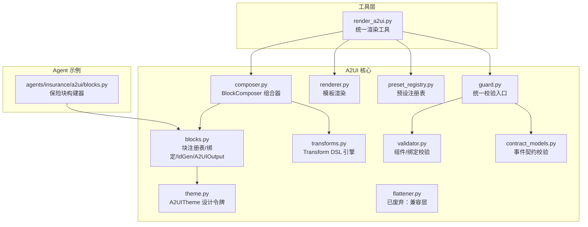
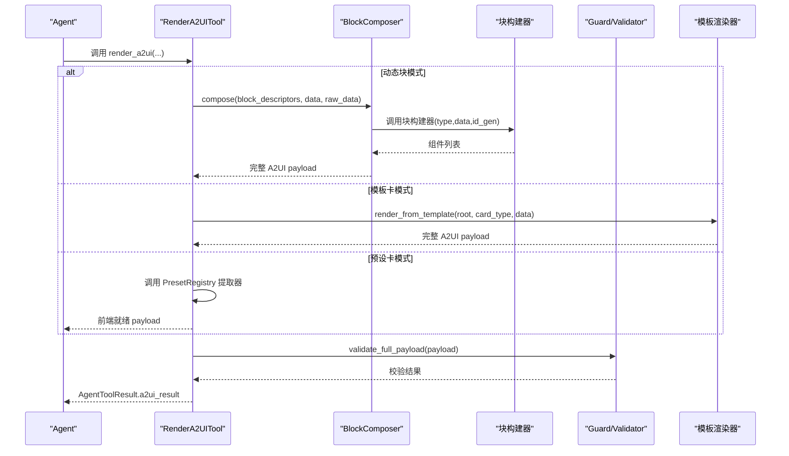
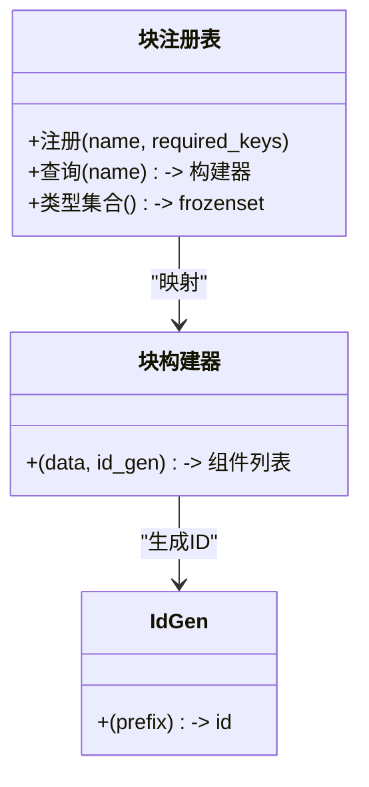
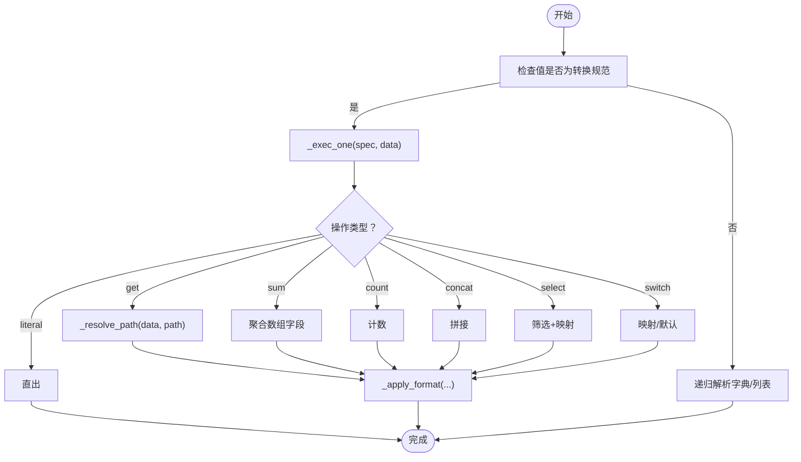
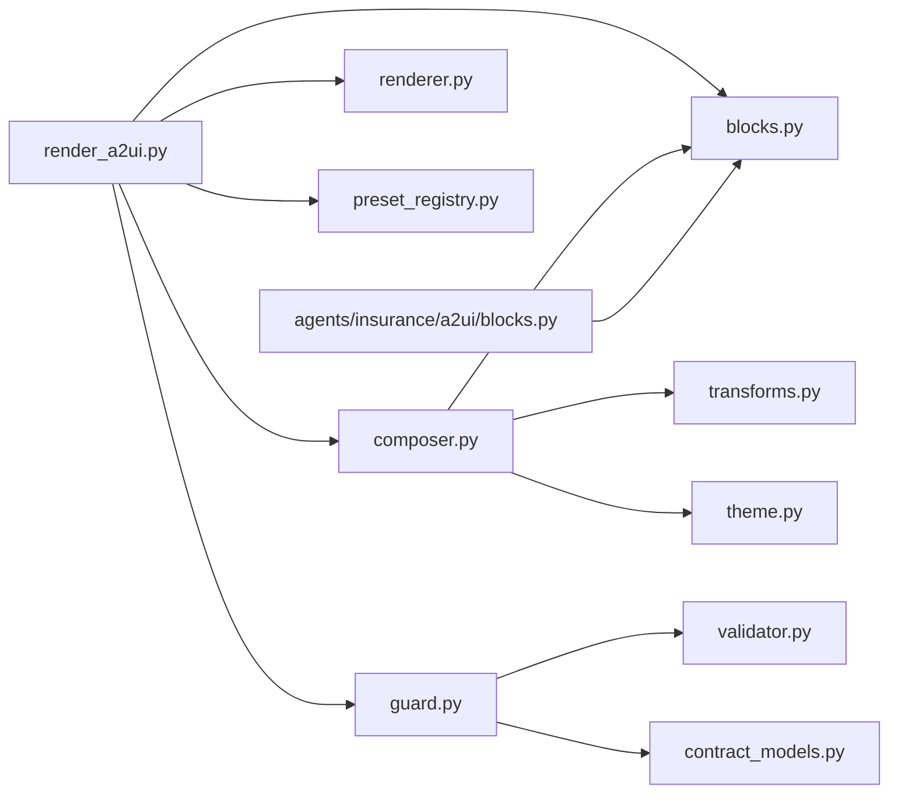

# 组件架构与块描述符

<cite>
**本文引用的文件**
- [blocks.py](file://src/ark_agentic/core/a2ui/blocks.py)
- [composer.py](file://src/ark_agentic/core/a2ui/composer.py)
- [renderer.py](file://src/ark_agentic/core/a2ui/renderer.py)
- [preset_registry.py](file://src/ark_agentic/core/a2ui/preset_registry.py)
- [validator.py](file://src/ark_agentic/core/a2ui/validator.py)
- [guard.py](file://src/ark_agentic/core/a2ui/guard.py)
- [theme.py](file://src/ark_agentic/core/a2ui/theme.py)
- [transforms.py](file://src/ark_agentic/core/a2ui/transforms.py)
- [flattener.py](file://src/ark_agentic/core/a2ui/flattener.py)
- [render_a2ui.py](file://src/ark_agentic/core/tools/render_a2ui.py)
- [contract_models.py](file://src/ark_agentic/core/a2ui/contract_models.py)
- [blocks.py（保险）](file://src/ark_agentic/agents/insurance/a2ui/blocks.py)
- [a2ui-modes-overview.md](file://docs/a2ui/a2ui-modes-overview.md)
- [a2ui-standard.md](file://docs/a2ui/a2ui-standard.md)
</cite>

## 目录
1. [简介](#简介)
2. [项目结构](#项目结构)
3. [核心组件](#核心组件)
4. [架构总览](#架构总览)
5. [详细组件分析](#详细组件分析)
6. [依赖关系分析](#依赖关系分析)
7. [性能考量](#性能考量)
8. [故障排查指南](#故障排查指南)
9. [结论](#结论)
10. [附录](#附录)

## 简介
本文件面向 A2UI 组件架构与块描述符，系统化阐述以下主题：
- 块注册表系统与块构建器模式
- 数据绑定机制与转换操作（Transform DSL）
- A2UIOutput 输出结构与 IdGen 标识符生成器
- 组件辅助函数的设计与实现
- 块类型注册、必需键验证、错误处理与向后兼容性
- 块构建器开发指南与最佳实践

目标读者既包括需要快速上手的工程师，也包括希望深入理解系统设计的架构师。

## 项目结构
A2UI 核心位于 src/ark_agentic/core/a2ui 下，围绕“块注册表 + 组合器 + 转换引擎 + 校验层”组织。渲染工具 render_a2ui.py 作为统一入口，串联三类渲染路径：动态块（blocks）、模板卡（card_type）、预设卡（preset_type）。文档 docs/a2ui 提供协议与模式概览。

图表来源
- [blocks.py:1-149](file://src/ark_agentic/core/a2ui/blocks.py#L1-L149)
- [composer.py:1-123](file://src/ark_agentic/core/a2ui/composer.py#L1-L123)
- [renderer.py:1-53](file://src/ark_agentic/core/a2ui/renderer.py#L1-L53)
- [preset_registry.py:1-53](file://src/ark_agentic/core/a2ui/preset_registry.py#L1-L53)
- [validator.py:1-227](file://src/ark_agentic/core/a2ui/validator.py#L1-L227)
- [guard.py:1-125](file://src/ark_agentic/core/a2ui/guard.py#L1-L125)
- [theme.py:1-39](file://src/ark_agentic/core/a2ui/theme.py#L1-L39)
- [transforms.py:1-396](file://src/ark_agentic/core/a2ui/transforms.py#L1-L396)
- [flattener.py:1-273](file://src/ark_agentic/core/a2ui/flattener.py#L1-L273)
- [render_a2ui.py:1-685](file://src/ark_agentic/core/tools/render_a2ui.py#L1-L685)
- [contract_models.py:1-123](file://src/ark_agentic/core/a2ui/contract_models.py#L1-L123)
- [blocks.py（保险）:1-145](file://src/ark_agentic/agents/insurance/a2ui/blocks.py#L1-L145)

章节来源
- [a2ui-modes-overview.md:1-140](file://docs/a2ui/a2ui-modes-overview.md#L1-L140)
- [a2ui-standard.md:1-804](file://docs/a2ui/a2ui-standard.md#L1-L804)

## 核心组件
- 块注册表与构建器：集中管理块类型到构建函数的映射，支持必需键校验与错误抛出。
- 组合器 BlockComposer：将块描述符解析为完整 A2UI 事件负载，内置内联转换解析。
- Transform DSL：声明式数据变换引擎，支持 get/sum/count/concat/select/switch/literal 等操作。
- 校验层：事件契约、组件/绑定合法性、数据覆盖率三道防线。
- 输出结构 A2UIOutput：承载组件树、模板数据、LLM 摘要与状态增量。
- IdGen 标识符生成器：统一的组件 ID 生成策略。
- 组件辅助函数：_comp/_text 等，降低样板代码。
- 模板渲染器：按 card_type 读取模板并注入 data。
- 预设注册表：按 card_type 返回前端就绪的轻量负载。

章节来源
- [blocks.py:46-149](file://src/ark_agentic/core/a2ui/blocks.py#L46-L149)
- [composer.py:57-123](file://src/ark_agentic/core/a2ui/composer.py#L57-L123)
- [transforms.py:175-396](file://src/ark_agentic/core/a2ui/transforms.py#L175-L396)
- [validator.py:88-227](file://src/ark_agentic/core/a2ui/validator.py#L88-L227)
- [guard.py:39-125](file://src/ark_agentic/core/a2ui/guard.py#L39-L125)
- [renderer.py:15-53](file://src/ark_agentic/core/a2ui/renderer.py#L15-L53)
- [preset_registry.py:25-53](file://src/ark_agentic/core/a2ui/preset_registry.py#L25-L53)
- [theme.py:12-39](file://src/ark_agentic/core/a2ui/theme.py#L12-L39)

## 架构总览
A2UI 采用“动态块 + 模板卡 + 预设卡”的双模式架构，统一通过 render_a2ui 工具调度。动态块模式下，LLM 直接输出块描述数组，BlockComposer 解析内联转换并调用块构建器生成组件树；模板卡模式下，按 card_type 加载模板并注入 data；预设卡模式下，提取器直接产出前端就绪 payload。

图表来源
- [render_a2ui.py:328-662](file://src/ark_agentic/core/tools/render_a2ui.py#L328-L662)
- [composer.py:60-122](file://src/ark_agentic/core/a2ui/composer.py#L60-L122)
- [renderer.py:15-53](file://src/ark_agentic/core/a2ui/renderer.py#L15-L53)
- [guard.py:83-125](file://src/ark_agentic/core/a2ui/guard.py#L83-L125)

## 详细组件分析

### 块注册表系统与块构建器模式
- 注册机制：通过装饰器注册块类型，支持为特定类型声明必需键，缺失时抛出 BlockDataError。
- 查询与类型集合：提供 get_block_builder 与 get_block_types，便于工具参数 schema 生成与运行时查找。
- 构建器签名：(data: dict, id_gen: IdGen) -> list[dict[str, Any]]，返回组件列表，首个组件 ID 作为根节点。
- 代理层块：保险 Agent 在 agents/insurance/a2ui/blocks.py 中提供 SectionHeader/KVRow 等构建器，并通过 create_insurance_blocks 绑定主题。

图表来源
- [blocks.py:102-132](file://src/ark_agentic/core/a2ui/blocks.py#L102-L132)
- [blocks.py（保险）:25-145](file://src/ark_agentic/agents/insurance/a2ui/blocks.py#L25-L145)

章节来源
- [blocks.py:96-132](file://src/ark_agentic/core/a2ui/blocks.py#L96-L132)
- [blocks.py（保险）:25-145](file://src/ark_agentic/agents/insurance/a2ui/blocks.py#L25-L145)

### 数据绑定机制与转换操作
- 绑定解析：resolve_binding 将 $field 短横线语法扩展为标准绑定格式，支持 path/literalString。
- 内联转换：BlockComposer 在组装前解析块 data 中的转换规范，优先执行 _exec_one。
- 转换 DSL：支持 get/sum/count/concat/select/switch/literal，路径解析支持数组索引与通配，条件过滤支持 where 表达式。
- 格式化：货币、百分比、整数等格式化器，支持默认值与异常容错。

图表来源
- [composer.py:29-54](file://src/ark_agentic/core/a2ui/composer.py#L29-L54)
- [transforms.py:186-396](file://src/ark_agentic/core/a2ui/transforms.py#L186-L396)

章节来源
- [blocks.py:65-90](file://src/ark_agentic/core/a2ui/blocks.py#L65-L90)
- [composer.py:45-54](file://src/ark_agentic/core/a2ui/composer.py#L45-L54)
- [transforms.py:186-396](file://src/ark_agentic/core/a2ui/transforms.py#L186-L396)

### A2UIOutput 输出结构与 IdGen 标识符生成器
- A2UIOutput：components/template_data/llm_digest/state_delta，承载组件树、模板数据、LLM 摘要与状态增量。
- IdGen：统一的组件 ID 生成器，确保全局唯一且有序，支持前缀与计数器。
- 组件辅助函数：_comp/_text 等，封装组件对象结构，减少重复代码。

章节来源
- [blocks.py:46-149](file://src/ark_agentic/core/a2ui/blocks.py#L46-L149)

### 组件辅助函数的设计与实现
- _comp：标准化组件包装，统一字段结构。
- _text：将文本值解析为绑定格式，支持样式透传。
- _resolve_action：对 action.args 进行绑定解析，保证交互参数正确。

章节来源
- [blocks.py:138-149](file://src/ark_agentic/core/a2ui/blocks.py#L138-L149)

### 模板渲染与预设注册表
- 模板渲染：render_from_template 读取 template.json，注入 surfaceId 并合并 data。
- 预设注册表：PresetRegistry 以 card_type 为键注册提取器，返回前端就绪 payload。

章节来源
- [renderer.py:15-53](file://src/ark_agentic/core/a2ui/renderer.py#L15-L53)
- [preset_registry.py:25-53](file://src/ark_agentic/core/a2ui/preset_registry.py#L25-L53)

### 统一校验层（事件契约 + 组件/绑定 + 数据覆盖率）
- 事件契约：contract_models.validate_event_payload，校验事件类型、允许字段与必需字段。
- 组件/绑定：validator.validate_payload，校验组件类型、props 结构、引用完整性与绑定 XOR。
- 数据覆盖率：guard.validate_data_coverage，检测 path 绑定是否缺失。

章节来源
- [contract_models.py:97-123](file://src/ark_agentic/core/a2ui/contract_models.py#L97-L123)
- [validator.py:88-227](file://src/ark_agentic/core/a2ui/validator.py#L88-L227)
- [guard.py:39-125](file://src/ark_agentic/core/a2ui/guard.py#L39-L125)

### 向后兼容性设计
- 设计令牌别名：保留 ACCENT/TITLE_COLOR 等常量，指向 A2UITheme 默认实例，避免破坏既有导入。
- 兼容层：flattener.py 保留旧版树扁平化与简写解析逻辑，标注为已废弃，仅用于兼容。

章节来源
- [blocks.py:24-38](file://src/ark_agentic/core/a2ui/blocks.py#L24-L38)
- [flattener.py:1-20](file://src/ark_agentic/core/a2ui/flattener.py#L1-L20)

### 块构建器开发指南与最佳实践
- 类型注册：使用装饰器注册块类型，必要时声明 required_keys，确保数据完整性。
- 绑定规范：优先使用 resolve_binding 或 _text 等辅助函数，避免硬编码字符串。
- 转换内联：在块 data 中直接书写转换规范，BlockComposer 会自动解析。
- 主题一致：通过 A2UITheme 获取设计令牌，避免硬编码颜色与尺寸。
- ID 规范：使用 id_gen 生成稳定 ID，避免冲突。
- 错误处理：利用 BlockDataError 与 GuardResult，明确报错信息与修复建议。

章节来源
- [blocks.py:102-132](file://src/ark_agentic/core/a2ui/blocks.py#L102-L132)
- [composer.py:45-54](file://src/ark_agentic/core/a2ui/composer.py#L45-L54)
- [theme.py:12-39](file://src/ark_agentic/core/a2ui/theme.py#L12-L39)
- [a2ui-modes-overview.md:30-94](file://docs/a2ui/a2ui-modes-overview.md#L30-L94)

## 依赖关系分析
- render_a2ui.py 作为统一入口，依赖 BlockComposer、renderer、PresetRegistry、guard、blocks 等模块。
- BlockComposer 依赖 blocks（注册表/绑定）、transforms（转换引擎）与 theme（设计令牌）。
- 校验层 guard 依赖 contract_models（事件契约）与 validator（组件/绑定）。
- 保险 Agent 的块构建器依赖 blocks 的 _comp/_text 与 theme。

图表来源
- [render_a2ui.py:34-312](file://src/ark_agentic/core/tools/render_a2ui.py#L34-L312)
- [composer.py:20-22](file://src/ark_agentic/core/a2ui/composer.py#L20-L22)
- [guard.py:15-16](file://src/ark_agentic/core/a2ui/guard.py#L15-L16)
- [blocks.py（保险）:16-22](file://src/ark_agentic/agents/insurance/a2ui/blocks.py#L16-L22)

章节来源
- [render_a2ui.py:34-312](file://src/ark_agentic/core/tools/render_a2ui.py#L34-L312)
- [composer.py:20-22](file://src/ark_agentic/core/a2ui/composer.py#L20-L22)
- [guard.py:15-16](file://src/ark_agentic/core/a2ui/guard.py#L15-L16)

## 性能考量
- 转换执行：Transform DSL 为纯 Python 计算，复杂度与数据规模线性相关；建议在块 data 中尽量使用简单路径与必要过滤。
- 组合器批处理：BlockComposer 顺序遍历块描述符，组件 ID 生成使用计数器，整体 O(n)。
- 校验层：validator 与 guard 为 O(m)（m 为组件数量），建议在严格模式下尽早发现错误，减少前端重试成本。
- 模板渲染：模板文件读取与 JSON 解析为 I/O 密集，建议缓存模板目录与预热常用 card_type。

## 故障排查指南
- 事件契约错误：检查 event、允许字段与必需字段，参考 contract_models 的错误消息。
- 组件/绑定错误：核对组件类型、props 结构、引用完整性与绑定 XOR，参考 validator 的错误码。
- 数据覆盖率警告：确认 payload.data 中是否存在 path 绑定引用的键，特别是 item.* 由 List 组件在渲染时解析。
- 块类型未知：确认块类型已在注册表中注册，或在 BlocksConfig 中声明。
- 模板渲染失败：确认模板文件存在、JSON 可解析、card_type 正确。

章节来源
- [contract_models.py:97-123](file://src/ark_agentic/core/a2ui/contract_models.py#L97-L123)
- [validator.py:88-227](file://src/ark_agentic/core/a2ui/validator.py#L88-L227)
- [guard.py:83-125](file://src/ark_agentic/core/a2ui/guard.py#L83-L125)
- [renderer.py:38-52](file://src/ark_agentic/core/a2ui/renderer.py#L38-L52)

## 结论
A2UI 通过“块注册表 + 组合器 + 转换引擎 + 校验层”的清晰分层，实现了从 LLM 到前端组件树的高效、安全、可扩展的渲染管线。动态块与模板卡双模式满足不同 Agent 的需求，统一的校验与错误处理保障了协议一致性与用户体验。遵循本文的最佳实践，可快速构建高质量的块构建器并稳定集成到 Agent 工作流中。

## 附录
- 协议与组件参考：见 docs/a2ui/a2ui-standard.md
- 架构与模式概览：见 docs/a2ui/a2ui-modes-overview.md