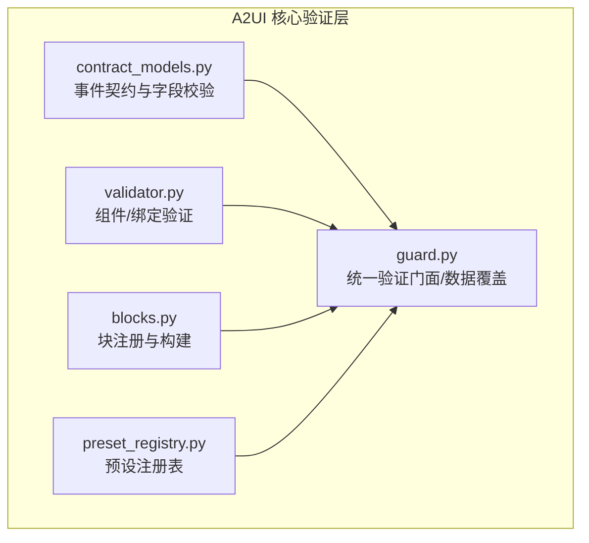
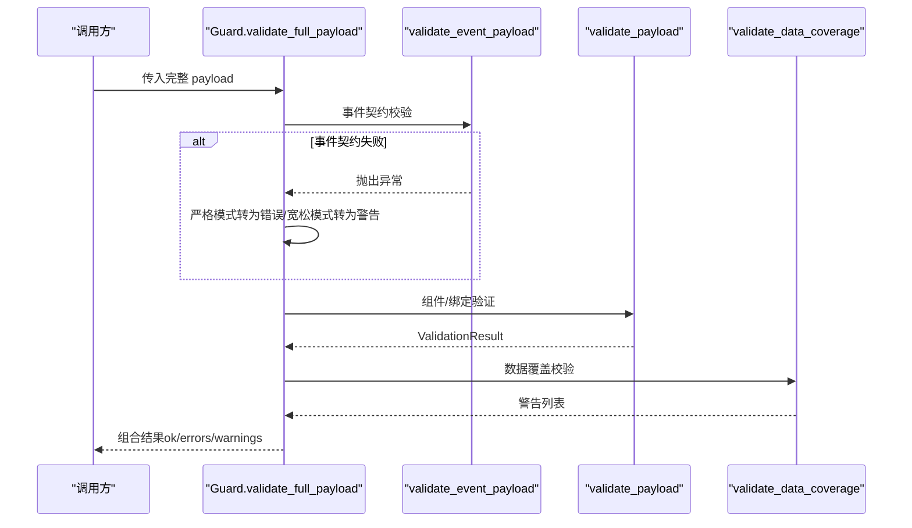
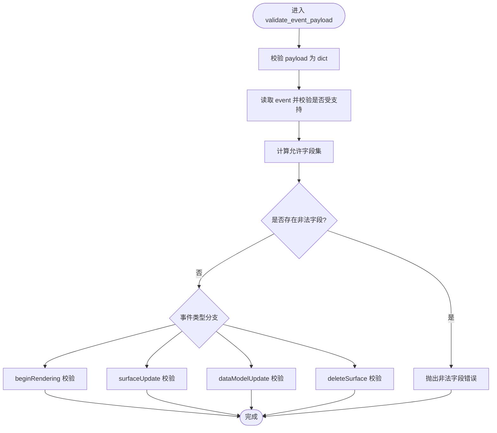
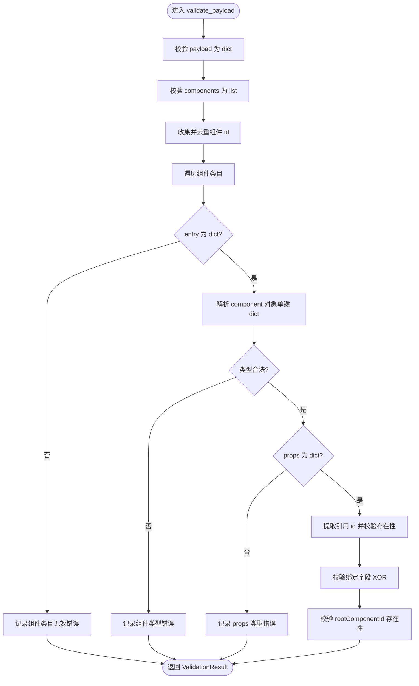
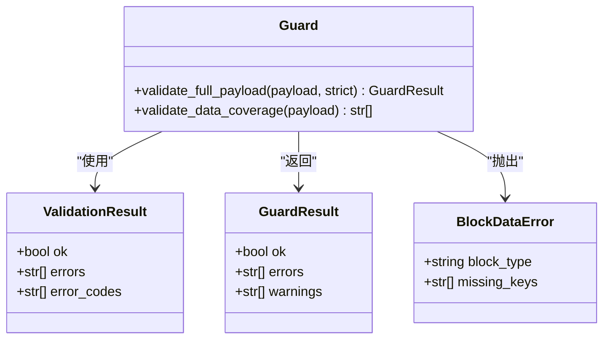
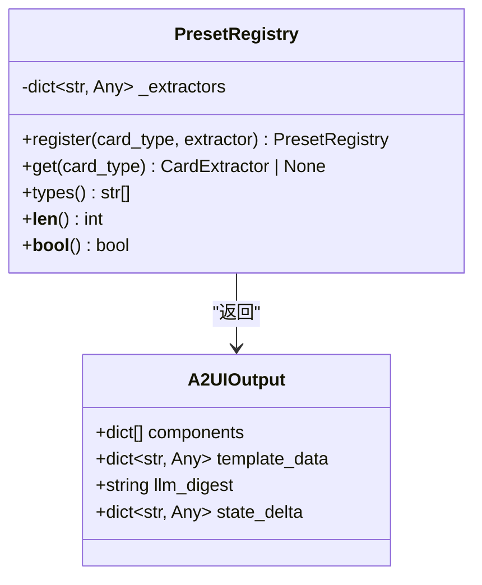
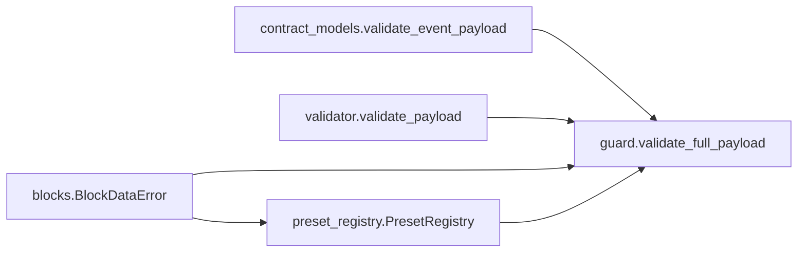

# 验证与契约模型

<cite>
**本文引用的文件**
- [contract_models.py](file://src/ark_agentic/core/a2ui/contract_models.py)
- [validator.py](file://src/ark_agentic/core/a2ui/validator.py)
- [guard.py](file://src/ark_agentic/core/a2ui/guard.py)
- [preset_registry.py](file://src/ark_agentic/core/a2ui/preset_registry.py)
- [blocks.py](file://src/ark_agentic/core/a2ui/blocks.py)
- [__init__.py](file://src/ark_agentic/core/a2ui/__init__.py)
- [test_a2ui_contract_models.py](file://tests/unit/core/test_a2ui_contract_models.py)
- [test_a2ui_contract_validator.py](file://tests/unit/core/test_a2ui_contract_validator.py)
- [test_a2ui_guard.py](file://tests/unit/core/test_a2ui_guard.py)
- [a2ui-withdraw-ui-schema.json](file://docs/a2ui/a2ui-withdraw-ui-schema.json)
- [a2ui-withdraw-plan-ui-sample.json](file://docs/a2ui/a2ui-withdraw-plan-ui-sample.json)
</cite>

## 目录
1. [引言](#引言)
2. [项目结构](#项目结构)
3. [核心组件](#核心组件)
4. [架构总览](#架构总览)
5. [详细组件分析](#详细组件分析)
6. [依赖分析](#依赖分析)
7. [性能考虑](#性能考虑)
8. [故障排查指南](#故障排查指南)
9. [结论](#结论)
10. [附录](#附录)

## 引言
本技术文档聚焦 A2UI 验证与契约模型，系统阐述事件级契约设计、组件与绑定级验证、数据覆盖校验、错误处理策略与调试支持。文档还解释预设注册表的工作原理、契约验证流程、运行时检查与扩展指南，并提供常见验证场景与性能优化建议。

## 项目结构
A2UI 验证与契约模型位于核心模块 src/ark_agentic/core/a2ui 下，关键文件包括：
- 事件契约与字段约束：contract_models.py
- 组件与绑定验证：validator.py
- 统一验证门面与数据覆盖：guard.py
- 预设注册表：preset_registry.py
- 块构建与注册表：blocks.py
- 导出入口：__init__.py

图表来源
- [contract_models.py:1-123](file://src/ark_agentic/core/a2ui/contract_models.py#L1-L123)
- [validator.py:1-227](file://src/ark_agentic/core/a2ui/validator.py#L1-L227)
- [guard.py:1-125](file://src/ark_agentic/core/a2ui/guard.py#L1-L125)
- [preset_registry.py:1-53](file://src/ark_agentic/core/a2ui/preset_registry.py#L1-L53)
- [blocks.py:1-149](file://src/ark_agentic/core/a2ui/blocks.py#L1-L149)

章节来源
- [__init__.py:1-39](file://src/ark_agentic/core/a2ui/__init__.py#L1-L39)

## 核心组件
- 事件契约模型（contract_models.validate_event_payload）
  - 定义受支持事件集合与每类事件允许字段集
  - 校验事件类型、顶层字段合法性与必需字段
- 组件与绑定验证（validator.validate_payload）
  - 校验组件树结构、组件类型、props 类型与引用完整性
  - 校验绑定字段的 XOR 规则（path 或 literalString 二选一）
- 统一验证门面（guard.validate_full_payload）
  - 组合事件契约、组件/绑定验证与数据覆盖校验
  - 支持严格/宽松模式，分别以错误或警告呈现事件契约违规
- 预设注册表（PresetRegistry）
  - 按卡牌类型注册提取器，生成前端直出的模板数据
- 块注册与构建（blocks）
  - 块构建器注册、必需键检查、绑定解析与组件构造辅助

章节来源
- [contract_models.py:1-123](file://src/ark_agentic/core/a2ui/contract_models.py#L1-L123)
- [validator.py:1-227](file://src/ark_agentic/core/a2ui/validator.py#L1-L227)
- [guard.py:1-125](file://src/ark_agentic/core/a2ui/guard.py#L1-L125)
- [preset_registry.py:1-53](file://src/ark_agentic/core/a2ui/preset_registry.py#L1-L53)
- [blocks.py:1-149](file://src/ark_agentic/core/a2ui/blocks.py#L1-L149)

## 架构总览
A2UI 验证体系采用“三层叠加”策略：
- L1：事件契约（字段白名单、必需字段、互斥规则）
- L2：组件/绑定（类型、结构、引用、绑定 XOR）
- L3：数据覆盖（path 引用必须在 data 中存在）

图表来源
- [guard.py:83-125](file://src/ark_agentic/core/a2ui/guard.py#L83-L125)
- [contract_models.py:97-123](file://src/ark_agentic/core/a2ui/contract_models.py#L97-L123)
- [validator.py:88-227](file://src/ark_agentic/core/a2ui/validator.py#L88-L227)

## 详细组件分析

### 事件契约模型（contract_models）
- 支持事件集合与允许字段集
- 针对 beginRendering/surfaceUpdate/dataModelUpdate/deleteSurface 的字段与互斥规则进行严格校验
- 顶层 payload 必须为 dict，事件类型必须在受支持集合内

图表来源
- [contract_models.py:97-123](file://src/ark_agentic/core/a2ui/contract_models.py#L97-L123)

章节来源
- [contract_models.py:1-123](file://src/ark_agentic/core/a2ui/contract_models.py#L1-L123)
- [test_a2ui_contract_models.py:1-141](file://tests/unit/core/test_a2ui_contract_models.py#L1-L141)

### 组件与绑定验证（validator）
- payload 必须为 dict，components 必须为 list
- 组件 id 去重校验
- 组件对象必须为单键 dict，类型必须在支持集合内
- props 必须为 dict；引用字段（children/child/emptyChild）必须指向已存在的组件 id
- 绑定字段（如 text/image/url 等）必须为 dict，且其中 path 与 literalString 二选一

图表来源
- [validator.py:88-227](file://src/ark_agentic/core/a2ui/validator.py#L88-L227)

章节来源
- [validator.py:1-227](file://src/ark_agentic/core/a2ui/validator.py#L1-L227)
- [test_a2ui_contract_validator.py:1-200](file://tests/unit/core/test_a2ui_contract_validator.py#L1-L200)

### 统一验证门面（guard）
- validate_full_payload 将三层校验组合：
  - 事件契约（可配置严格/宽松）
  - 组件/绑定验证（错误码与消息）
  - 数据覆盖（缺失路径生成警告）
- BlockDataError 用于块构建器的必需键缺失场景

图表来源
- [guard.py:32-125](file://src/ark_agentic/core/a2ui/guard.py#L32-L125)
- [validator.py:41-46](file://src/ark_agentic/core/a2ui/validator.py#L41-L46)

章节来源
- [guard.py:1-125](file://src/ark_agentic/core/a2ui/guard.py#L1-L125)
- [test_a2ui_guard.py:1-152](file://tests/unit/core/test_a2ui_guard.py#L1-L152)

### 预设注册表（PresetRegistry）
- 每个代理维护独立的卡牌类型到提取器映射
- 提取器签名：(context: dict, card_args: dict | None) -> A2UIOutput
- A2UIOutput.template_data 直接作为前端渲染数据

图表来源
- [preset_registry.py:25-53](file://src/ark_agentic/core/a2ui/preset_registry.py#L25-L53)
- [blocks.py:46-60](file://src/ark_agentic/core/a2ui/blocks.py#L46-L60)

章节来源
- [preset_registry.py:1-53](file://src/ark_agentic/core/a2ui/preset_registry.py#L1-L53)
- [blocks.py:1-149](file://src/ark_agentic/core/a2ui/blocks.py#L1-L149)

### 块注册与构建（blocks）
- 块注册装饰器：_register(name, required_keys=None)
- 必需键缺失时抛出 BlockDataError
- 绑定解析 resolve_binding 支持 $field 简写与字面量回退
- 组件构造辅助函数减少样板代码

章节来源
- [blocks.py:1-149](file://src/ark_agentic/core/a2ui/blocks.py#L1-L149)

## 依赖分析
- contract_models 与 validator 为独立验证模块，彼此无直接依赖
- guard 组合 contract_models 与 validator，并引入 blocks 的 BlockDataError
- preset_registry 依赖 blocks 的 A2UIOutput 类型
- __init__.py 汇总导出验证与渲染能力

图表来源
- [guard.py:15-16](file://src/ark_agentic/core/a2ui/guard.py#L15-L16)
- [blocks.py:96-98](file://src/ark_agentic/core/a2ui/blocks.py#L96-L98)
- [preset_registry.py:17-20](file://src/ark_agentic/core/a2ui/preset_registry.py#L17-L20)

章节来源
- [__init__.py:1-39](file://src/ark_agentic/core/a2ui/__init__.py#L1-L39)

## 性能考虑
- 事件契约与组件验证均为线性扫描，复杂度 O(N)（N 为组件数量）
- 绑定 XOR 与引用校验在遍历过程中完成，避免额外二次扫描
- 数据覆盖校验仅针对 path 绑定，忽略 literalString 与 item.* 路径，降低不必要开销
- 建议：
  - 在高并发场景下，尽量复用已解析的组件 id 集合
  - 对大型 payload，优先在上游进行必要的裁剪与脱敏
  - 将严格模式用于生产环境，宽松模式用于开发调试

## 故障排查指南
- 事件契约错误
  - 现象：事件类型不受支持、非法字段、必需字段缺失
  - 处理：根据错误消息定位字段，修正事件类型或补齐必需字段
- 组件/绑定错误
  - 现象：组件类型非法、props 非法、引用缺失、绑定 XOR 失败
  - 处理：核对组件对象为单键 dict、props 为 dict；确保引用 id 存在；绑定字段二选一
- 数据覆盖警告
  - 现象：path 引用未在 data 中找到
  - 处理：补齐 data 或改为 literalString；忽略 item.* 路径（由渲染期处理）
- 块构建错误
  - 现象：BlockDataError（必需键缺失）
  - 处理：补齐块构建所需数据键

章节来源
- [guard.py:39-81](file://src/ark_agentic/core/a2ui/guard.py#L39-L81)
- [validator.py:177-225](file://src/ark_agentic/core/a2ui/validator.py#L177-L225)
- [test_a2ui_guard.py:43-152](file://tests/unit/core/test_a2ui_guard.py#L43-L152)

## 结论
A2UI 验证与契约模型通过三层校验确保事件有效、组件正确、数据完备。统一门面提供灵活的严格/宽松策略与丰富的错误码，配合预设注册表与块基础设施，形成可扩展、可调试、可演进的 UI 生成与验证体系。

## 附录

### 验证示例与规范
- 示例参考
  - 事件契约与字段约束示例：[a2ui-withdraw-plan-ui-sample.json:1-785](file://docs/a2ui/a2ui-withdraw-plan-ui-sample.json#L1-L785)
  - 数据结构约束 Schema：[a2ui-withdraw-ui-schema.json:1-145](file://docs/a2ui/a2ui-withdraw-ui-schema.json#L1-L145)
- 常见验证场景
  - beginRendering：要求 surfaceId、rootComponentId，且 components 与 catalogId 二选一
  - surfaceUpdate：要求 surfaceId 与 components（为列表）
  - dataModelUpdate：要求 surfaceId 与 data（为 dict）
  - deleteSurface：仅允许指定字段
  - 组件/绑定：类型合法、props 为 dict、引用存在、绑定 XOR 成立

章节来源
- [contract_models.py:14-47](file://src/ark_agentic/core/a2ui/contract_models.py#L14-L47)
- [validator.py:28-38](file://src/ark_agentic/core/a2ui/validator.py#L28-L38)
- [test_a2ui_contract_models.py:6-141](file://tests/unit/core/test_a2ui_contract_models.py#L6-L141)
- [test_a2ui_contract_validator.py:65-200](file://tests/unit/core/test_a2ui_contract_validator.py#L65-L200)

### 验证器扩展指南
- 扩展组件类型
  - 在支持集合中新增类型，并在绑定字段映射中添加对应绑定字段
  - 在组件对象校验中确保 props 结构符合预期
- 扩展绑定字段
  - 在绑定字段映射中增加新字段集合，并在 XOR 校验中纳入
- 扩展事件契约
  - 在支持事件集合与允许字段集中加入新事件与字段
  - 为新事件编写专用校验函数并在主入口分支中调用
- 扩展数据覆盖规则
  - 在数据覆盖校验中增加对特殊路径的处理逻辑（如 item.* 由渲染期处理）

章节来源
- [validator.py:8-38](file://src/ark_agentic/core/a2ui/validator.py#L8-L38)
- [contract_models.py:7-47](file://src/ark_agentic/core/a2ui/contract_models.py#L7-L47)