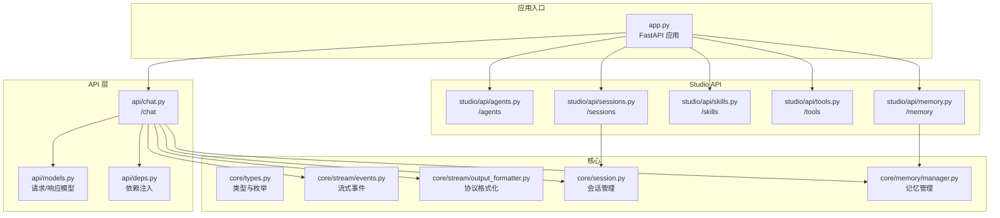
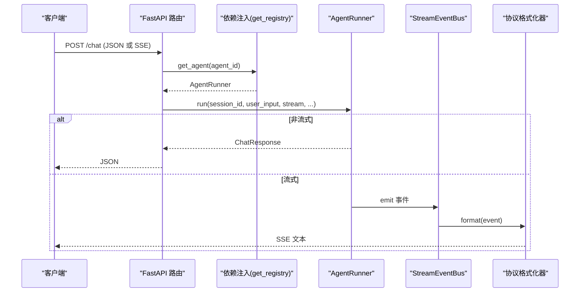
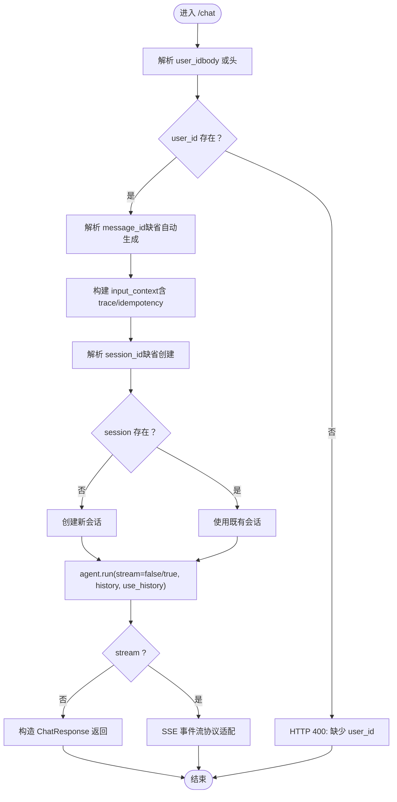
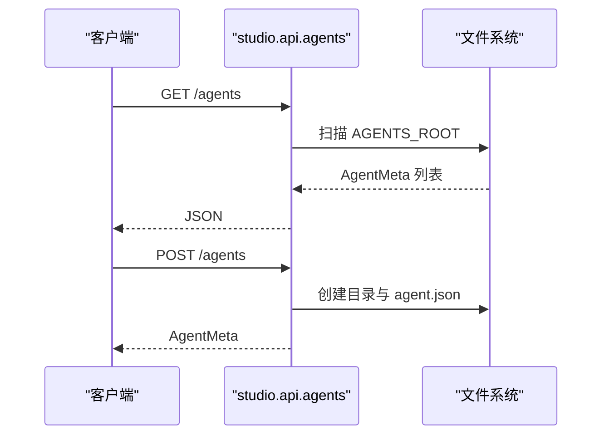
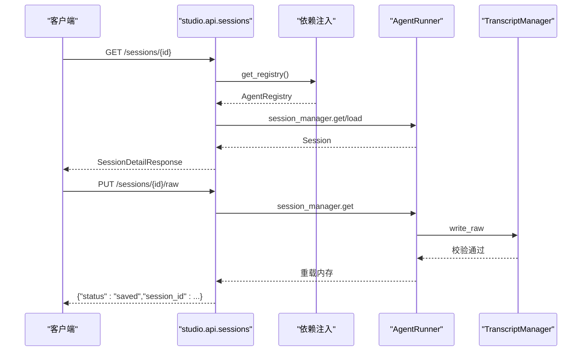
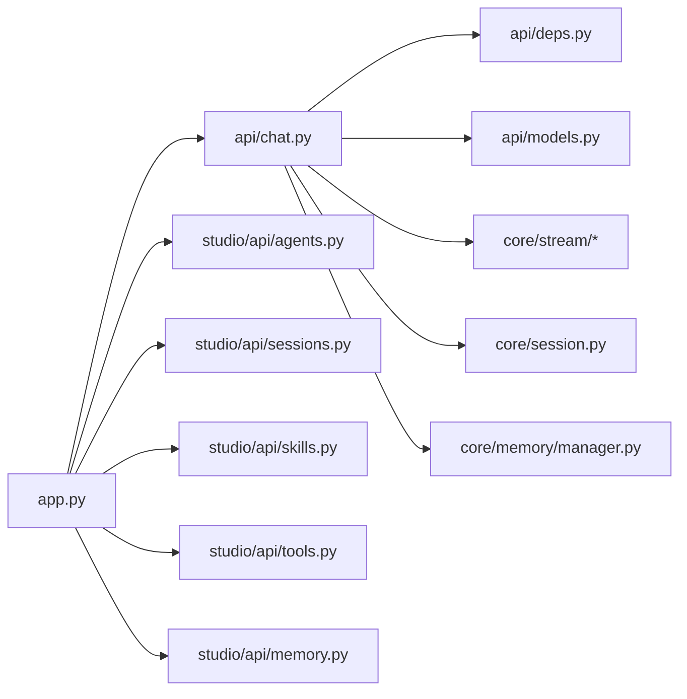

# API 参考

<cite>
**本文引用的文件**
- [src/ark_agentic/app.py](file://src/ark_agentic/app.py)
- [src/ark_agentic/api/chat.py](file://src/ark_agentic/api/chat.py)
- [src/ark_agentic/api/models.py](file://src/ark_agentic/api/models.py)
- [src/ark_agentic/api/deps.py](file://src/ark_agentic/api/deps.py)
- [src/ark_agentic/studio/api/agents.py](file://src/ark_agentic/studio/api/agents.py)
- [src/ark_agentic/studio/api/sessions.py](file://src/ark_agentic/studio/api/sessions.py)
- [src/ark_agentic/studio/api/skills.py](file://src/ark_agentic/studio/api/skills.py)
- [src/ark_agentic/studio/api/tools.py](file://src/ark_agentic/studio/api/tools.py)
- [src/ark_agentic/studio/api/memory.py](file://src/ark_agentic/studio/api/memory.py)
- [src/ark_agentic/core/types.py](file://src/ark_agentic/core/types.py)
- [src/ark_agentic/core/stream/events.py](file://src/ark_agentic/core/stream/events.py)
- [src/ark_agentic/core/stream/output_formatter.py](file://src/ark_agentic/core/stream/output_formatter.py)
- [src/ark_agentic/core/session.py](file://src/ark_agentic/core/session.py)
- [src/ark_agentic/core/memory/manager.py](file://src/ark_agentic/core/memory/manager.py)
- [postman/ark-agentic-api.postman_collection.json](file://postman/ark-agentic-api.postman_collection.json)
- [README.md](file://README.md)
</cite>

## 目录
1. [简介](#简介)
2. [项目结构](#项目结构)
3. [核心组件](#核心组件)
4. [架构总览](#架构总览)
5. [详细组件分析](#详细组件分析)
6. [依赖分析](#依赖分析)
7. [性能考虑](#性能考虑)
8. [故障排查指南](#故障排查指南)
9. [版本管理与兼容性](#版本管理与兼容性)
10. [结论](#结论)
11. [附录](#附录)

## 简介
本文件为 Ark-Agentic API 的完整参考，覆盖以下能力：
- Chat API：支持非流式与 SSE 流式输出，多协议（internal/agui/enterprise/alone）事件格式
- Studio API：Agent/技能/工具/会话/内存管理的 CRUD 与运维接口
- 内存管理 API：面向用户与全局的记忆文件列举、读取与编辑
- 协议与 SDK：SSE 事件格式、前端集成要点、Postman 集合示例
- 版本管理与迁移：版本号、向后兼容策略与迁移建议

## 项目结构
- FastAPI 应用入口负责注册路由与可选 Studio 模块
- Chat API 路由位于 api/chat.py，数据模型位于 api/models.py
- Studio API 路由位于 studio/api/ 下，分别处理 Agent、技能、工具、会话、内存
- 核心类型与流式事件位于 core/types.py 与 core/stream/*

图表来源
- [src/ark_agentic/app.py:137-165](file://src/ark_agentic/app.py#L137-L165)
- [src/ark_agentic/api/chat.py:24-177](file://src/ark_agentic/api/chat.py#L24-L177)
- [src/ark_agentic/api/models.py:27-104](file://src/ark_agentic/api/models.py#L27-L104)
- [src/ark_agentic/studio/api/agents.py:22-131](file://src/ark_agentic/studio/api/agents.py#L22-L131)
- [src/ark_agentic/studio/api/sessions.py:22-200](file://src/ark_agentic/studio/api/sessions.py#L22-L200)
- [src/ark_agentic/studio/api/skills.py:21-113](file://src/ark_agentic/studio/api/skills.py#L21-L113)
- [src/ark_agentic/studio/api/tools.py:21-66](file://src/ark_agentic/studio/api/tools.py#L21-L66)
- [src/ark_agentic/studio/api/memory.py:21-160](file://src/ark_agentic/studio/api/memory.py#L21-L160)
- [src/ark_agentic/core/types.py:18-200](file://src/ark_agentic/core/types.py#L18-L200)
- [src/ark_agentic/core/stream/events.py](file://src/ark_agentic/core/stream/events.py)
- [src/ark_agentic/core/stream/output_formatter.py](file://src/ark_agentic/core/stream/output_formatter.py)
- [src/ark_agentic/core/session.py](file://src/ark_agentic/core/session.py)
- [src/ark_agentic/core/memory/manager.py](file://src/ark_agentic/core/memory/manager.py)

章节来源
- [src/ark_agentic/app.py:137-165](file://src/ark_agentic/app.py#L137-L165)
- [README.md:91-153](file://README.md#L91-L153)

## 核心组件
- Chat API：统一入口 /chat，支持非流式与 SSE 流式，协议可选
- Studio API：Agent CRUD、技能/工具管理、会话列表/详情/原始读写、内存文件管理
- 数据模型：ChatRequest/ChatResponse、SSEEvent、HistoryMessage 等
- 依赖注入：get_registry/get_agent，统一从注册表获取 AgentRunner
- 流式协议：支持 internal/agui/enterprise/alone 四种协议，事件类型丰富

章节来源
- [src/ark_agentic/api/chat.py:27-177](file://src/ark_agentic/api/chat.py#L27-L177)
- [src/ark_agentic/api/models.py:27-104](file://src/ark_agentic/api/models.py#L27-L104)
- [src/ark_agentic/api/deps.py](file://src/ark_agentic/api/deps.py)
- [src/ark_agentic/core/stream/output_formatter.py](file://src/ark_agentic/core/stream/output_formatter.py)

## 架构总览
- 应用启动时注册 Agent（insurance/securities），并按需挂载 Studio
- Chat 请求经依赖注入获取 AgentRunner，支持会话管理与历史合并
- 流式输出通过事件总线与格式化器适配不同协议
- Studio API 通过文件系统扫描与 AST 解析实现“无运行时导入”的安全元数据管理

图表来源
- [src/ark_agentic/api/chat.py:27-177](file://src/ark_agentic/api/chat.py#L27-L177)
- [src/ark_agentic/api/deps.py](file://src/ark_agentic/api/deps.py)
- [src/ark_agentic/core/stream/events.py](file://src/ark_agentic/core/stream/events.py)
- [src/ark_agentic/core/stream/output_formatter.py](file://src/ark_agentic/core/stream/output_formatter.py)

## 详细组件分析

### Chat API
- 端点：POST /chat
- 支持：非流式一次性响应；SSE 流式输出（多种协议）
- 关键行为：
  - 用户标识优先取 body.user_id，否则取 x-ark-user-id 头
  - 消息/会话/幂等键：支持 x-ark-message-id、x-ark-session-id、idempotency_key
  - 历史合并：history 支持数组或 JSON 字符串，use_history 控制是否合并
  - 协议：protocol=internal/agui/enterprise/alone，默认 internal
  - 会话管理：未提供 session_id 时自动创建；跨 Agent 切换时重建会话
- 响应：
  - 非流式：ChatResponse（session_id/message_id/response/tool_calls/usage/turns）
  - 流式：SSE 事件流，事件类型参考 SSEEvent

图表来源
- [src/ark_agentic/api/chat.py:27-177](file://src/ark_agentic/api/chat.py#L27-L177)
- [src/ark_agentic/api/models.py:27-104](file://src/ark_agentic/api/models.py#L27-L104)
- [src/ark_agentic/core/session.py](file://src/ark_agentic/core/session.py)

章节来源
- [src/ark_agentic/api/chat.py:27-177](file://src/ark_agentic/api/chat.py#L27-L177)
- [src/ark_agentic/api/models.py:27-104](file://src/ark_agentic/api/models.py#L27-L104)
- [README.md:91-153](file://README.md#L91-L153)

### Studio API

#### Agent 管理（/agents）
- GET /agents：扫描 agents/ 目录，返回 AgentMeta 列表
- GET /agents/{agent_id}：读取 agent.json 或返回最小元数据
- POST /agents：创建 Agent 目录与 agent.json（含 skills/tools 子目录）

图表来源
- [src/ark_agentic/studio/api/agents.py:76-131](file://src/ark_agentic/studio/api/agents.py#L76-L131)

章节来源
- [src/ark_agentic/studio/api/agents.py:76-131](file://src/ark_agentic/studio/api/agents.py#L76-L131)

#### 技能管理（/skills）
- GET /agents/{agent_id}/skills：列出技能（解析 SKILL.md YAML frontmatter）
- POST /agents/{agent_id}/skills：创建技能（校验名称唯一）
- PUT /agents/{agent_id}/skills/{skill_id}：更新技能
- DELETE /agents/{agent_id}/skills/{skill_id}：删除技能

章节来源
- [src/ark_agentic/studio/api/skills.py:57-113](file://src/ark_agentic/studio/api/skills.py#L57-L113)

#### 工具管理（/tools）
- GET /agents/{agent_id}/tools：通过 AST 解析工具定义，返回 ToolMeta 列表
- POST /agents/{agent_id}/tools：生成工具脚手架（Python 源码模板）

章节来源
- [src/ark_agentic/studio/api/tools.py:41-66](file://src/ark_agentic/studio/api/tools.py#L41-L66)

#### 会话管理（/sessions）
- GET /agents/{agent_id}/sessions：列出会话（可按 user_id 过滤）
- GET /agents/{agent_id}/sessions/{session_id}：会话详情与消息历史
- GET /agents/{agent_id}/sessions/{session_id}/raw：读取原始 JSONL
- PUT /agents/{agent_id}/sessions/{session_id}/raw：写回并校验 JSONL

图表来源
- [src/ark_agentic/studio/api/sessions.py:84-200](file://src/ark_agentic/studio/api/sessions.py#L84-L200)
- [src/ark_agentic/api/deps.py](file://src/ark_agentic/api/deps.py)

章节来源
- [src/ark_agentic/studio/api/sessions.py:84-200](file://src/ark_agentic/studio/api/sessions.py#L84-L200)

#### 内存管理（/agents/{agent_id}/memory）
- GET /agents/{agent_id}/memory/files：列举可发现的记忆文件（全局 MEMORY.md 与用户目录下 *.md）
- GET /agents/{agent_id}/memory/content：读取指定文件内容（文本）
- PUT /agents/{agent_id}/memory/content：写入指定文件内容（UTF-8）

章节来源
- [src/ark_agentic/studio/api/memory.py:105-160](file://src/ark_agentic/studio/api/memory.py#L105-L160)

### 数据模型与类型

#### Chat 请求/响应
- ChatRequest：agent_id、message、session_id、stream、run_options、protocol、source_bu_type、app_type、user_id、message_id、context、idempotency_key、history、use_history
- ChatResponse：session_id、message_id、response、tool_calls、turns、usage
- HistoryMessage：role（user/assistant）、content
- SSEEvent：type、seq、run_id、session_id、content/delta/output_index/template/message/usage/turns/tool_calls/error_message

章节来源
- [src/ark_agentic/api/models.py:27-104](file://src/ark_agentic/api/models.py#L27-L104)
- [src/ark_agentic/core/types.py:18-200](file://src/ark_agentic/core/types.py#L18-L200)

### 协议与事件格式
- 协议类型：internal、agui、enterprise、alone
- AG-UI 原生事件类型（示例）：run_started、run_finished、run_error、step_started、step_finished、text_message_start、text_message_content、text_message_end、tool_call_start、tool_call_args、tool_call_end、tool_call_result、state_snapshot、state_delta、messages_snapshot、thinking_message_start、thinking_message_content、thinking_message_end、custom、raw
- 企业 AGUIEnvelope：顶层包含 protocol、event、id、source_bu_type、app_type，data 中包含 message_id、conversation_id、ui_protocol、ui_data

章节来源
- [README.md:111-153](file://README.md#L111-L153)
- [src/ark_agentic/core/stream/output_formatter.py](file://src/ark_agentic/core/stream/output_formatter.py)

### SDK 与集成示例
- Postman 集合包含 Health、Chat（非流式/流式）、会话管理等示例
- 建议：
  - 非流式：直接发送 JSON，接收 ChatResponse
  - SSE 流式：设置 Accept: text/event-stream，按协议解析事件
  - 会话复用：通过 x-ark-session-id 或 body.session_id
  - 幂等请求：使用 idempotency_key 防止重复

章节来源
- [postman/ark-agentic-api.postman_collection.json:21-364](file://postman/ark-agentic-api.postman_collection.json#L21-L364)
- [README.md:91-153](file://README.md#L91-L153)

## 依赖分析
- app.py 作为装配器，注册 Chat 与 Studio 路由，按环境变量决定是否启用 Studio
- Chat 路由依赖依赖注入模块获取 AgentRunner，再委托核心会话与记忆模块
- Studio API 通过文件系统与 AST 解析实现“静态安全”的工具/技能管理

图表来源
- [src/ark_agentic/app.py:137-165](file://src/ark_agentic/app.py#L137-L165)
- [src/ark_agentic/api/chat.py:27-177](file://src/ark_agentic/api/chat.py#L27-L177)
- [src/ark_agentic/studio/api/agents.py:76-131](file://src/ark_agentic/studio/api/agents.py#L76-L131)
- [src/ark_agentic/studio/api/sessions.py:84-200](file://src/ark_agentic/studio/api/sessions.py#L84-L200)
- [src/ark_agentic/studio/api/skills.py:57-113](file://src/ark_agentic/studio/api/skills.py#L57-L113)
- [src/ark_agentic/studio/api/tools.py:41-66](file://src/ark_agentic/studio/api/tools.py#L41-L66)
- [src/ark_agentic/studio/api/memory.py:105-160](file://src/ark_agentic/studio/api/memory.py#L105-L160)

## 性能考虑
- 并行工具调用：当 LLM 返回多个工具调用时，框架使用并行执行以缩短总延迟
- AG-UI 流式协议：事件驱动，细粒度推送，降低前端等待时间
- 多协议适配：单一内部实现，输出层适配四种协议，便于前端按需选择
- 零数据库记忆：纯文件 MEMORY.md，启动即用，减少外部依赖
- 会话压缩：自动摘要历史消息，保持上下文窗口稳定
- 输出验证：自动检测数值幻觉，提升输出可靠性

章节来源
- [README.md:787-795](file://README.md#L787-L795)

## 故障排查指南
- 常见错误与定位
  - HTTP 400：缺少 user_id（body 或头）
  - HTTP 404：Agent 不存在、会话不存在、文件不存在
  - HTTP 409：Agent 已存在、工具已存在
  - HTTP 400（JSONL 写入）：Raw JSONL 校验失败，返回行号等细节
- LLM 错误分类：认证、配额、速率限制、超时、上下文溢出、内容过滤、服务器错误、网络、未知
- 建议排查步骤
  - 确认 headers（x-ark-*）与 body 字段齐全
  - 检查协议与前端解析是否匹配
  - 使用 /sessions/{id}/raw 获取原始 JSONL，定位消息顺序与格式问题
  - 若出现 LLM 错误，依据 LLMErrorReason 分类处理（重试/降级/提示）

章节来源
- [src/ark_agentic/studio/api/sessions.py:169-200](file://src/ark_agentic/studio/api/sessions.py#L169-L200)
- [src/ark_agentic/core/llm/errors.py:17-159](file://src/ark_agentic/core/llm/errors.py#L17-L159)
- [src/ark_agentic/api/chat.py:42-43](file://src/ark_agentic/api/chat.py#L42-L43)

## 版本管理与兼容性
- 版本号：应用元数据中声明版本号
- 向后兼容性
  - 协议：protocol=internal 保持旧版 response.* 事件，确保现有前端兼容
  - 字段：ChatRequest/history 支持 JSON 字符串自动校验与转换
  - 会话：跨 Agent 切换时自动重建会话，保证状态隔离
- 迁移建议
  - 从 internal 协议迁移到 agui/enterprise：调整前端事件解析器，适配新事件类型
  - 从历史字段字符串迁移到数组：确保前端统一为数组格式
  - 会话管理：建议统一通过 x-ark-session-id 头传递，避免混淆

章节来源
- [src/ark_agentic/app.py:137-142](file://src/ark_agentic/app.py#L137-L142)
- [src/ark_agentic/api/models.py:45-58](file://src/ark_agentic/api/models.py#L45-L58)
- [src/ark_agentic/api/chat.py:60-80](file://src/ark_agentic/api/chat.py#L60-L80)
- [README.md:111-153](file://README.md#L111-L153)

## 结论
Ark-Agentic 提供统一的 Chat 与 Studio API，具备完善的会话与记忆能力、丰富的流式协议支持与安全的元数据管理。通过 Postman 集合与清晰的模型定义，可快速集成到各类前端与后端系统中。遵循本文档的协议与最佳实践，可在保证向后兼容的前提下逐步迁移至更先进的 AG-UI 协议。

## 附录

### API 端点一览
- Chat
  - POST /chat：非流式或 SSE 流式
- Studio
  - Agent：GET /agents、GET /agents/{agent_id}、POST /agents
  - 技能：GET /agents/{agent_id}/skills、POST /agents/{agent_id}/skills、PUT /agents/{agent_id}/skills/{skill_id}、DELETE /agents/{agent_id}/skills/{skill_id}
  - 工具：GET /agents/{agent_id}/tools、POST /agents/{agent_id}/tools
  - 会话：GET /agents/{agent_id}/sessions、GET /agents/{agent_id}/sessions/{session_id}、GET /agents/{agent_id}/sessions/{session_id}/raw、PUT /agents/{agent_id}/sessions/{session_id}/raw
  - 内存：GET /agents/{agent_id}/memory/files、GET /agents/{agent_id}/memory/content、PUT /agents/{agent_id}/memory/content

章节来源
- [src/ark_agentic/api/chat.py:27-177](file://src/ark_agentic/api/chat.py#L27-L177)
- [src/ark_agentic/studio/api/agents.py:76-131](file://src/ark_agentic/studio/api/agents.py#L76-L131)
- [src/ark_agentic/studio/api/skills.py:57-113](file://src/ark_agentic/studio/api/skills.py#L57-L113)
- [src/ark_agentic/studio/api/tools.py:41-66](file://src/ark_agentic/studio/api/tools.py#L41-L66)
- [src/ark_agentic/studio/api/sessions.py:84-200](file://src/ark_agentic/studio/api/sessions.py#L84-L200)
- [src/ark_agentic/studio/api/memory.py:105-160](file://src/ark_agentic/studio/api/memory.py#L105-L160)