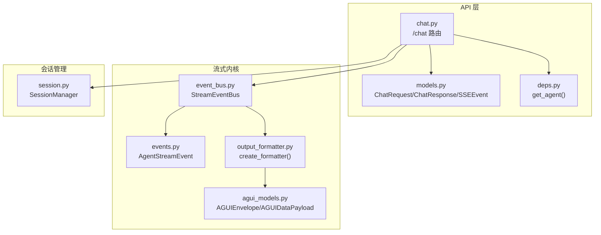
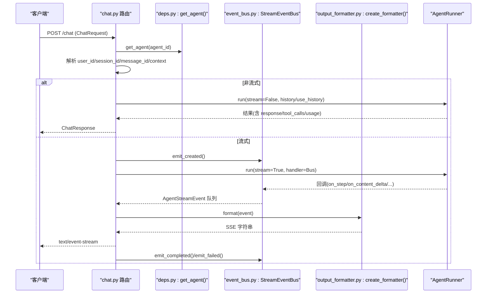
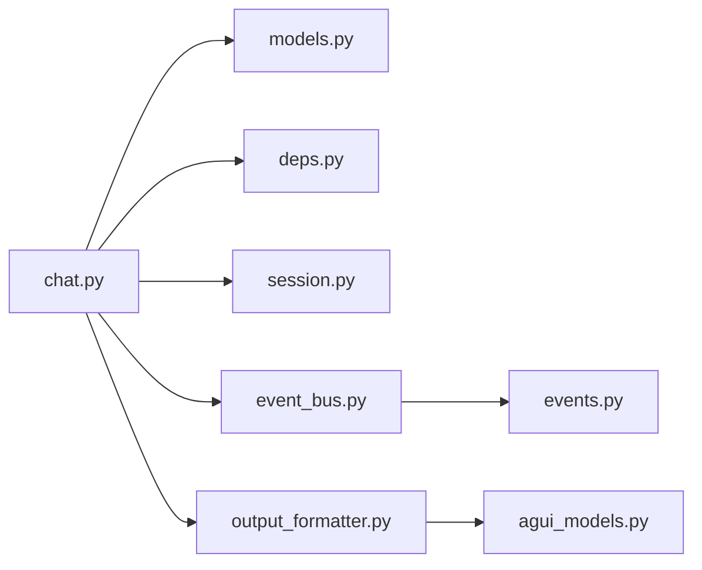

# Chat API

<cite>
**本文引用的文件**
- [chat.py](file://src/ark_agentic/api/chat.py)
- [models.py](file://src/ark_agentic/api/models.py)
- [deps.py](file://src/ark_agentic/api/deps.py)
- [events.py](file://src/ark_agentic/core/stream/events.py)
- [event_bus.py](file://src/ark_agentic/core/stream/event_bus.py)
- [output_formatter.py](file://src/ark_agentic/core/stream/output_formatter.py)
- [agui_models.py](file://src/ark_agentic/core/stream/agui_models.py)
- [session.py](file://src/ark_agentic/core/session.py)
- [ark-agentic-api.postman_collection.json](file://postman/ark-agentic-api.postman_collection.json)
</cite>

## 目录
1. [简介](#简介)
2. [项目结构](#项目结构)
3. [核心组件](#核心组件)
4. [架构总览](#架构总览)
5. [详细组件分析](#详细组件分析)
6. [依赖关系分析](#依赖关系分析)
7. [性能考量](#性能考量)
8. [故障排查指南](#故障排查指南)
9. [结论](#结论)
10. [附录](#附录)

## 简介
本文件面向 Chat API 的 /chat 端点，提供从请求参数、响应格式、头部参数、幂等键机制、会话管理到不同流式协议（internal、agui、enterprise）的完整说明，并配套 Postman 示例与实际代码示例路径，帮助开发者快速集成与调试。

## 项目结构
- API 路由与模型位于 src/ark_agentic/api 下，包含 /chat 路由、请求/响应模型与依赖注入。
- 流式事件与格式化器位于 src/ark_agentic/core/stream 下，负责将 Agent 的运行事件转换为 SSE 事件。
- 会话管理位于 src/ark_agentic/core/session.py，提供会话创建、加载、持久化与历史注入能力。
- Postman 集合位于 postman/ark-agentic-api.postman_collection.json，包含非流式与三种流式协议的示例。

**图表来源**
- [chat.py:27-177](file://src/ark_agentic/api/chat.py#L27-L177)
- [models.py:27-104](file://src/ark_agentic/api/models.py#L27-L104)
- [deps.py:31-37](file://src/ark_agentic/api/deps.py#L31-L37)
- [events.py:67-116](file://src/ark_agentic/core/stream/events.py#L67-L116)
- [event_bus.py:67-248](file://src/ark_agentic/core/stream/event_bus.py#L67-L248)
- [output_formatter.py:427-444](file://src/ark_agentic/core/stream/output_formatter.py#L427-L444)
- [agui_models.py:16-51](file://src/ark_agentic/core/stream/agui_models.py#L16-L51)
- [session.py:24-482](file://src/ark_agentic/core/session.py#L24-L482)

**章节来源**
- [chat.py:27-177](file://src/ark_agentic/api/chat.py#L27-L177)
- [models.py:27-104](file://src/ark_agentic/api/models.py#L27-L104)
- [deps.py:31-37](file://src/ark_agentic/api/deps.py#L31-L37)
- [events.py:67-116](file://src/ark_agentic/core/stream/events.py#L67-L116)
- [event_bus.py:67-248](file://src/ark_agentic/core/stream/event_bus.py#L67-L248)
- [output_formatter.py:427-444](file://src/ark_agentic/core/stream/output_formatter.py#L427-L444)
- [agui_models.py:16-51](file://src/ark_agentic/core/stream/agui_models.py#L16-L51)
- [session.py:24-482](file://src/ark_agentic/core/session.py#L24-L482)

## 核心组件
- /chat 路由：接收 ChatRequest，解析用户与会话上下文，支持非流式与 SSE 流式两种模式。
- 事件总线：将 Agent 的回调事件标准化为 AgentStreamEvent，并自动配对 step/text/thinking 的 start/finish。
- 输出格式化器：将 AgentStreamEvent 适配为不同传输协议（internal/agui/enterprise/alone）。
- 会话管理：创建/加载/持久化会话，支持外部历史注入与上下文压缩。
- 依赖注入：通过 get_agent() 获取 AgentRunner，确保 agent_id 有效。

**章节来源**
- [chat.py:27-177](file://src/ark_agentic/api/chat.py#L27-L177)
- [events.py:67-116](file://src/ark_agentic/core/stream/events.py#L67-L116)
- [event_bus.py:67-248](file://src/ark_agentic/core/stream/event_bus.py#L67-L248)
- [output_formatter.py:427-444](file://src/ark_agentic/core/stream/output_formatter.py#L427-L444)
- [session.py:24-482](file://src/ark_agentic/core/session.py#L24-L482)
- [deps.py:31-37](file://src/ark_agentic/api/deps.py#L31-L37)

## 架构总览
下面的时序图展示了 /chat 的关键流程：请求进入路由后，解析上下文与会话，选择运行模式（非流式或流式），并通过事件总线与格式化器输出事件。

**图表来源**
- [chat.py:27-177](file://src/ark_agentic/api/chat.py#L27-L177)
- [deps.py:31-37](file://src/ark_agentic/api/deps.py#L31-L37)
- [event_bus.py:67-248](file://src/ark_agentic/core/stream/event_bus.py#L67-L248)
- [output_formatter.py:427-444](file://src/ark_agentic/core/stream/output_formatter.py#L427-L444)

## 详细组件分析

### 请求参数规范
- 必填与可选字段
  - agent_id: 字符串，Agent 标识（如 insurance/securities）
  - message: 字符串，用户输入
  - session_id: 字符串，可选；为空则自动创建会话
  - stream: 布尔，是否启用 SSE 流式输出
  - run_options: 运行选项（覆盖模型、采样等），可选
  - protocol: 字符串，流式协议（internal/agui/enterprise/alone），默认 internal
  - source_bu_type/app_type: 企业协议专用，用于 enterprise 模式
  - user_id: 字符串，可来自 body 或 x-ark-user-id 头部，至少提供其一
  - message_id: 字符串，可选；为空则自动生成 UUID
  - context: 字典，业务上下文，将被注入到 input_context
  - idempotency_key: 字符串，可选；用于幂等请求去重
  - history: 外部历史消息数组或 JSON 字符串，可选
  - use_history: 布尔，是否启用外部历史合并，默认 True

- 头部参数
  - x-ark-user-id: 用户标识（与 body.user_id 二选一）
  - x-ark-session-id: 会话标识（与 body.session_id 二选一）
  - x-ark-message-id: 消息标识（与 body.message_id 二选一）
  - x-ark-trace-id: 调用链追踪标识（可选）

- 幂等键机制
  - 当提供 idempotency_key 时，服务端会在 input_context 中注入 temp:idempotency_key，用于防重处理（具体实现由 AgentRunner 内部策略决定）。

- 会话管理
  - 若未提供 session_id，则根据 user_id 创建新会话；若提供则尝试获取或加载会话，不存在时自动创建。
  - 支持外部历史注入（history/use_history），并可与会话历史合并。

**章节来源**
- [models.py:27-60](file://src/ark_agentic/api/models.py#L27-L60)
- [chat.py:30-80](file://src/ark_agentic/api/chat.py#L30-L80)
- [session.py:40-227](file://src/ark_agentic/core/session.py#L40-L227)

### 响应格式
- 非流式响应（ChatResponse）
  - 字段：session_id、message_id、response、tool_calls、turns、usage
  - usage 包含 prompt_tokens 与 completion_tokens

- 流式响应（SSE）
  - Accept: text/event-stream
  - 不同协议的事件类型与数据结构详见“流式协议与事件格式”小节

**章节来源**
- [models.py:61-104](file://src/ark_agentic/api/models.py#L61-L104)
- [chat.py:88-113](file://src/ark_agentic/api/chat.py#L88-L113)

### 流式协议与事件格式

#### 协议选择
- protocol: internal（向后兼容，response.* 事件）
- protocol: agui（裸 AG-UI 事件，JSON 原生）
- protocol: enterprise（企业 AGUIEnvelope 包装，带 BU/App 信息）
- protocol: alone（旧版 ALONE 协议，sa_* 事件）

**章节来源**
- [output_formatter.py:427-444](file://src/ark_agentic/core/stream/output_formatter.py#L427-L444)

#### AG-UI 原生事件模型
- 事件类型（部分）：run_started/run_finished/run_error、step_started/step_finished、text_message_start/content/end、tool_call_start/args/end/result、state_snapshot/delta、messages_snapshot、thinking_message_start/content/end、custom/raw
- 事件模型包含通用字段（type、seq、run_id、session_id）以及按事件类型选择性填充的字段（如 message_id、delta、tool_name/tool_args/tool_result、custom_type/custom_data、message/usage/turns/tool_calls、error_message 等）

**章节来源**
- [events.py:30-116](file://src/ark_agentic/core/stream/events.py#L30-L116)

#### Legacy Internal（response.*）
- 事件映射（节选）
  - run_started → response.created
  - step_started → response.step
  - step_finished → response.step.done
  - text_message_content(content_kind!=a2ui) → response.content.delta
  - tool_call_start → response.tool_call.start
  - tool_call_result → response.tool_call.result
  - custom → response.ui.component
  - run_finished → response.completed
  - run_error → response.failed
- 字段重映射：如 response.created 的 content、response.content.delta 的 delta/turn、response.completed 的 message/usage/turns/tool_calls 等

**章节来源**
- [output_formatter.py:69-150](file://src/ark_agentic/core/stream/output_formatter.py#L69-L150)

#### Bare AG-UI（agui）
- 直接输出 AgentStreamEvent 的 JSON，事件名为事件类型本身（如 text_message_content、tool_call_start 等）
- 适合前端直接消费 AG-UI 原生事件

**章节来源**
- [output_formatter.py:59-65](file://src/ark_agentic/core/stream/output_formatter.py#L59-L65)

#### Enterprise AGUIEnvelope（enterprise）
- 顶层结构：protocol=AGUI、id、event、source_bu_type、app_type、data
- data 字段：包含 message_id、conversation_id、ui_protocol（text/json/A2UI）、ui_data、turn 等
- 特殊处理：run_started 时自动插入 reasoning_start；thinking_message_content/step_started 时生成 reasoning_message_content；run_finished 时自动插入 reasoning_end
- 适用场景：企业前端统一消费，具备 BU/App 语义

**章节来源**
- [agui_models.py:16-51](file://src/ark_agentic/core/stream/agui_models.py#L16-L51)
- [output_formatter.py:155-339](file://src/ark_agentic/core/stream/output_formatter.py#L155-L339)

#### ALONE 协议（alone）
- 事件映射（节选）：run_started→sa_ready、text_message_content→sa_stream_chunk、step_started→sa_stream_think、run_finished→sa_stream_complete+sa_done、run_error→sa_error
- 说明：sa_done 作为连接关闭信号

**章节来源**
- [output_formatter.py:341-415](file://src/ark_agentic/core/stream/output_formatter.py#L341-L415)

### 事件总线与生命周期
- 事件总线自动配对：
  - step_started ↔ step_finished
  - text_message_start ↔ text_message_end
  - thinking_message_start ↔ thinking_message_end
- 终止事件（run_finished/run_error）会自动关闭所有活跃状态
- 事件总线还负责：
  - on_content_delta → text_message_content
  - on_tool_call_start → tool_call_start + tool_call_args
  - on_tool_call_result → tool_call_end + tool_call_result
  - on_ui_component → text_message_content（content_kind=a2ui）
  - on_custom_event → custom

**章节来源**
- [event_bus.py:67-248](file://src/ark_agentic/core/stream/event_bus.py#L67-L248)

### 会话管理
- 创建会话：若未提供 session_id，基于 user_id 创建新会话并持久化
- 加载会话：优先内存，不存在则从磁盘加载；agent 切换时可重新创建
- 历史注入：支持将外部历史消息注入到会话中，按锚点定位插入
- 上下文压缩：当达到阈值时进行消息压缩与统计更新
- 状态同步：定期将会话状态（token 使用、技能、状态字典等）同步到存储

**章节来源**
- [session.py:40-227](file://src/ark_agentic/core/session.py#L40-L227)
- [session.py:289-334](file://src/ark_agentic/core/session.py#L289-L334)
- [session.py:383-431](file://src/ark_agentic/core/session.py#L383-L431)

### Postman 示例与实际代码示例
- 非流式（application/json）
  - 示例路径：[ark-agentic-api.postman_collection.json:38-61](file://postman/ark-agentic-api.postman_collection.json#L38-L61)
- 非流式（带头部 x-ark-user-id/x-ark-trace-id）
  - 示例路径：[ark-agentic-api.postman_collection.json:63-94](file://postman/ark-agentic-api.postman_collection.json#L63-L94)
- SSE 流式（internal）
  - 示例路径：[ark-agentic-api.postman_collection.json:96-124](file://postman/ark-agentic-api.postman_collection.json#L96-L124)
- SSE 流式（agui）
  - 示例路径：[ark-agentic-api.postman_collection.json:126-154](file://postman/ark-agentic-api.postman_collection.json#L126-L154)
- SSE 流式（enterprise）
  - 示例路径：[ark-agentic-api.postman_collection.json:156-184](file://postman/ark-agentic-api.postman_collection.json#L156-L184)
- 企业 AGUI A2UI 卡片演示
  - 示例路径：[ark-agentic-api.postman_collection.json:186-214](file://postman/ark-agentic-api.postman_collection.json#L186-L214)
- 幂等键
  - 示例路径：[ark-agentic-api.postman_collection.json:216-240](file://postman/ark-agentic-api.postman_collection.json#L216-L240)
- 通过头部传递 session_id
  - 示例路径：[ark-agentic-api.postman_collection.json:242-270](file://postman/ark-agentic-api.postman_collection.json#L242-L270)

**章节来源**
- [ark-agentic-api.postman_collection.json:38-270](file://postman/ark-agentic-api.postman_collection.json#L38-L270)

## 依赖关系分析

**图表来源**
- [chat.py:19-20](file://src/ark_agentic/api/chat.py#L19-L20)
- [models.py:20-21](file://src/ark_agentic/api/models.py#L20-L21)
- [deps.py:12-13](file://src/ark_agentic/api/deps.py#L12-L13)
- [session.py:18-19](file://src/ark_agentic/core/session.py#L18-L19)
- [event_bus.py:20](file://src/ark_agentic/core/stream/event_bus.py#L20)
- [events.py:27](file://src/ark_agentic/core/stream/events.py#L27)
- [output_formatter.py:20-21](file://src/ark_agentic/core/stream/output_formatter.py#L20-L21)
- [agui_models.py:13](file://src/ark_agentic/core/stream/agui_models.py#L13)

**章节来源**
- [chat.py:19-20](file://src/ark_agentic/api/chat.py#L19-L20)
- [models.py:20-21](file://src/ark_agentic/api/models.py#L20-L21)
- [deps.py:12-13](file://src/ark_agentic/api/deps.py#L12-L13)
- [session.py:18-19](file://src/ark_agentic/core/session.py#L18-L19)
- [event_bus.py:20](file://src/ark_agentic/core/stream/event_bus.py#L20)
- [events.py:27](file://src/ark_agentic/core/stream/events.py#L27)
- [output_formatter.py:20-21](file://src/ark_agentic/core/stream/output_formatter.py#L20-L21)
- [agui_models.py:13](file://src/ark_agentic/core/stream/agui_models.py#L13)

## 性能考量
- 流式事件队列采用 asyncio.Queue，避免阻塞主线程。
- 工具调用结果截断：超过长度限制的结果会被截断，减少 SSE 负载。
- 上下文压缩：在消息数量或 token 数达到阈值时自动压缩，降低历史成本。
- 会话状态异步同步：将磁盘写入与状态更新分离，提升吞吐。

**章节来源**
- [event_bus.py:187-200](file://src/ark_agentic/core/stream/event_bus.py#L187-L200)
- [session.py:383-431](file://src/ark_agentic/core/session.py#L383-L431)

## 故障排查指南
- 404 Agent 未找到
  - 现象：请求 agent_id 不存在
  - 处理：确认 agent_id 是否正确，或在启动时初始化注册表
  - 参考：[deps.py:31-37](file://src/ark_agentic/api/deps.py#L31-L37)
- 缺少 user_id
  - 现象：body.user_id 与 x-ark-user-id 均为空
  - 处理：任选其一提供
  - 参考：[chat.py:40-44](file://src/ark_agentic/api/chat.py#L40-L44)
- 会话异常
  - 现象：session_id 无效或 agent 切换导致会话丢失
  - 处理：检查 session_id 是否存在，必要时重新创建
  - 参考：[chat.py:60-80](file://src/ark_agentic/api/chat.py#L60-L80)、[session.py:184-227](file://src/ark_agentic/core/session.py#L184-L227)
- 流式事件缺失
  - 现象：SSE 未收到预期事件
  - 处理：确认 protocol 与 Accept 头；检查事件总线回调是否触发
  - 参考：[output_formatter.py:427-444](file://src/ark_agentic/core/stream/output_formatter.py#L427-L444)、[event_bus.py:146-215](file://src/ark_agentic/core/stream/event_bus.py#L146-L215)

**章节来源**
- [deps.py:31-37](file://src/ark_agentic/api/deps.py#L31-L37)
- [chat.py:40-44](file://src/ark_agentic/api/chat.py#L40-L44)
- [chat.py:60-80](file://src/ark_agentic/api/chat.py#L60-L80)
- [session.py:184-227](file://src/ark_agentic/core/session.py#L184-L227)
- [output_formatter.py:427-444](file://src/ark_agentic/core/stream/output_formatter.py#L427-L444)
- [event_bus.py:146-215](file://src/ark_agentic/core/stream/event_bus.py#L146-L215)

## 结论
/Chat 端点提供了统一的非流式与 SSE 流式交互方式，结合多协议输出格式与完善的会话管理，能够满足从简单问答到复杂推理与 A2UI 卡片展示的多样化需求。通过 Postman 示例与本文档的参数与事件说明，可快速完成集成与调试。

## 附录

### /chat 端点参数与行为速查
- 方法与路径：POST /chat
- 非流式：返回 ChatResponse
- 流式：返回 text/event-stream，按 protocol 输出不同事件
- 头部：x-ark-user-id、x-ark-session-id、x-ark-message-id、x-ark-trace-id
- 幂等键：idempotency_key 注入 input_context
- 会话：未提供 session_id 时自动创建

**章节来源**
- [chat.py:27-177](file://src/ark_agentic/api/chat.py#L27-L177)
- [models.py:27-60](file://src/ark_agentic/api/models.py#L27-L60)