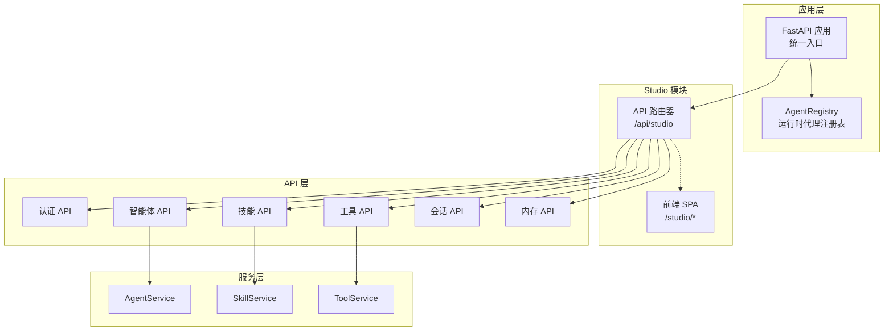
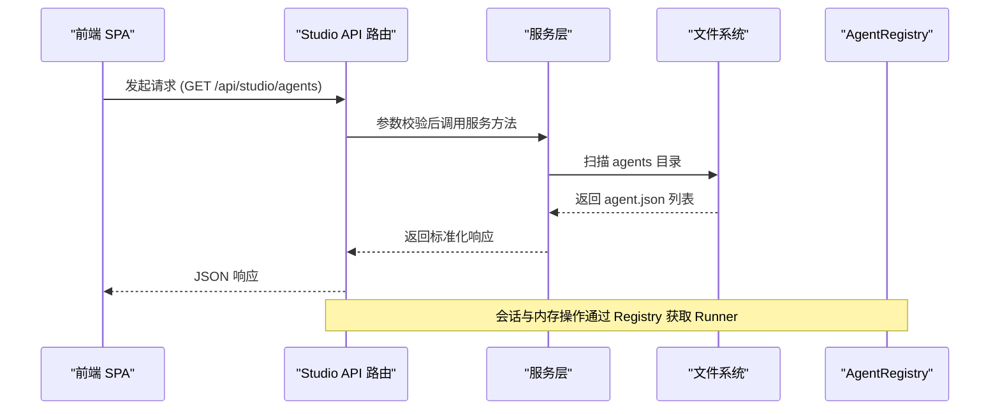
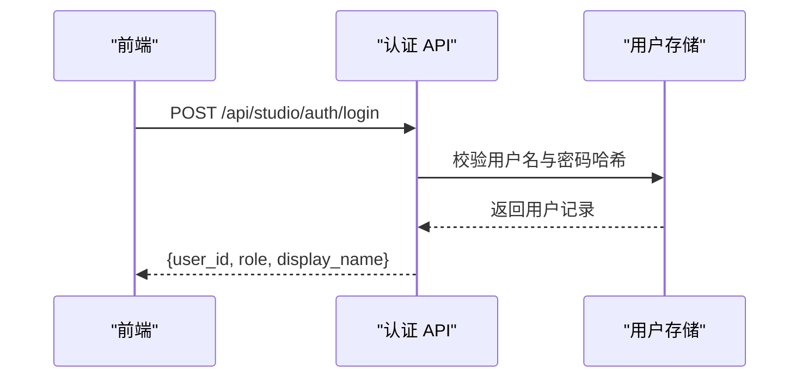
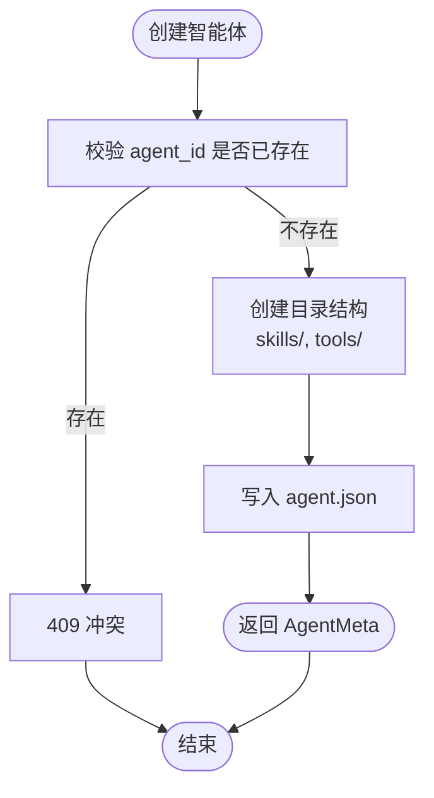
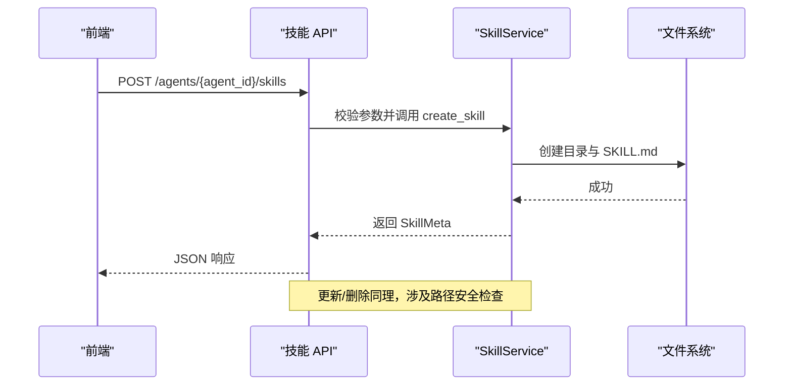
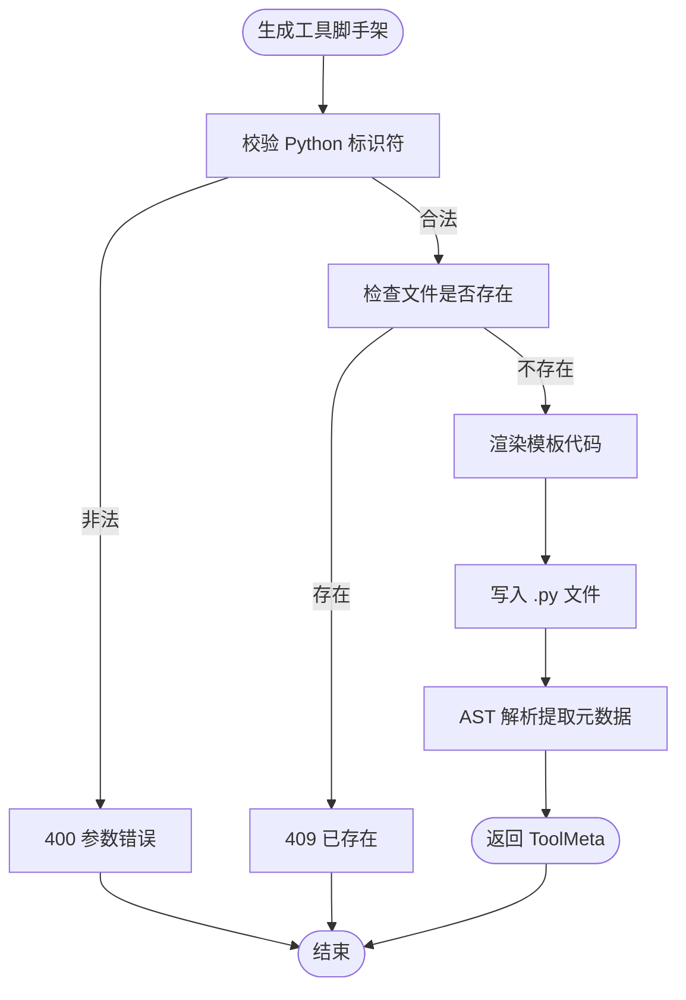
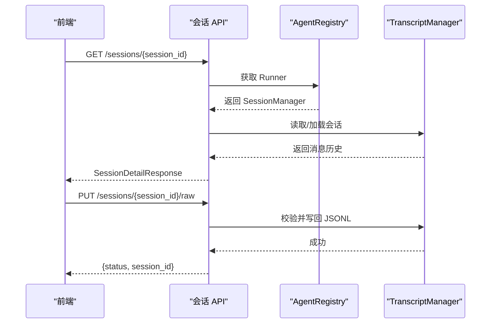
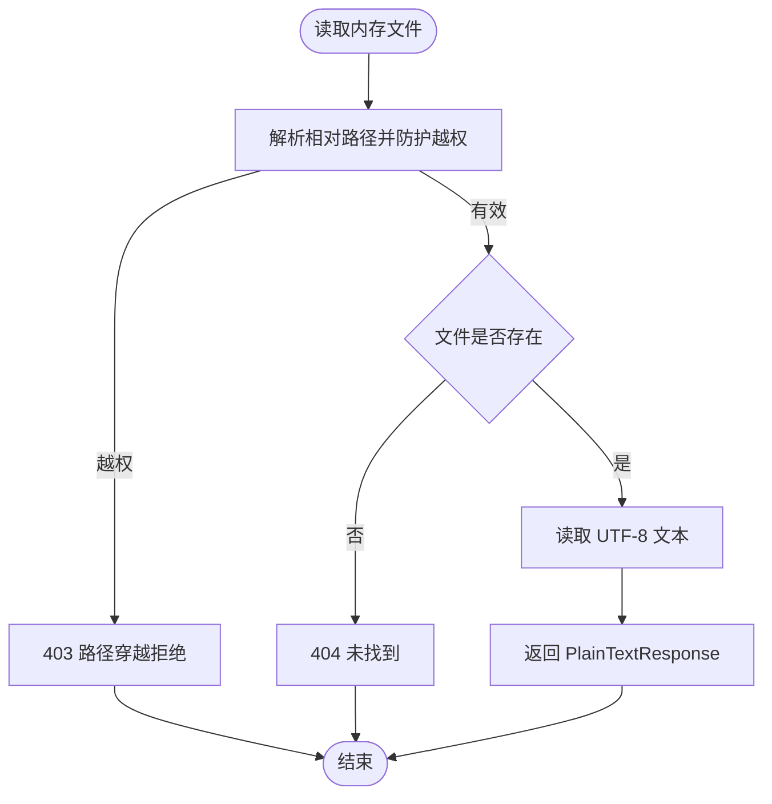
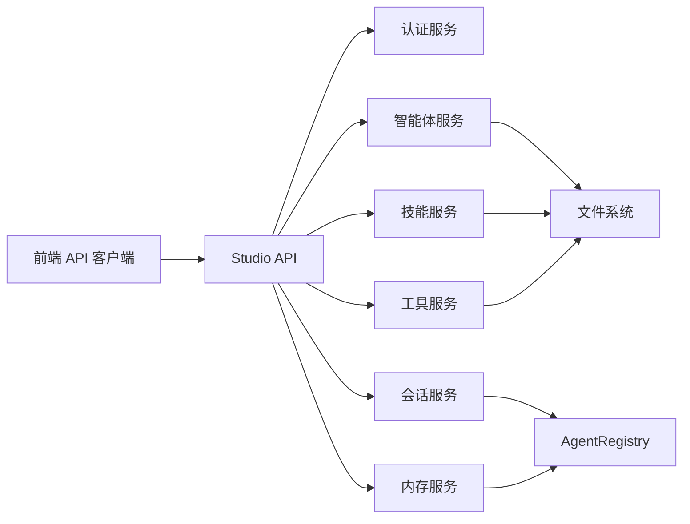

# Studio 开发工具 API

<cite>
**本文档引用的文件**
- [src/ark_agentic/studio/__init__.py](file://src/ark_agentic/studio/__init__.py)
- [src/ark_agentic/app.py](file://src/ark_agentic/app.py)
- [src/ark_agentic/studio/api/agents.py](file://src/ark_agentic/studio/api/agents.py)
- [src/ark_agentic/studio/api/skills.py](file://src/ark_agentic/studio/api/skills.py)
- [src/ark_agentic/studio/api/tools.py](file://src/ark_agentic/studio/api/tools.py)
- [src/ark_agentic/studio/api/memory.py](file://src/ark_agentic/studio/api/memory.py)
- [src/ark_agentic/studio/api/sessions.py](file://src/ark_agentic/studio/api/sessions.py)
- [src/ark_agentic/studio/api/auth.py](file://src/ark_agentic/studio/api/auth.py)
- [src/ark_agentic/studio/services/agent_service.py](file://src/ark_agentic/studio/services/agent_service.py)
- [src/ark_agentic/studio/services/skill_service.py](file://src/ark_agentic/studio/services/skill_service.py)
- [src/ark_agentic/studio/services/tool_service.py](file://src/ark_agentic/studio/services/tool_service.py)
- [src/ark_agentic/studio/frontend/src/api.ts](file://src/ark_agentic/studio/frontend/src/api.ts)
- [src/ark_agentic/studio/frontend/src/auth.tsx](file://src/ark_agentic/studio/frontend/src/auth.tsx)
- [postman/ark-agentic-api.postman_collection.json](file://postman/ark-agentic-api.postman_collection.json)
</cite>

## 目录
1. [简介](#简介)
2. [项目结构](#项目结构)
3. [核心组件](#核心组件)
4. [架构总览](#架构总览)
5. [详细组件分析](#详细组件分析)
6. [依赖关系分析](#依赖关系分析)
7. [性能考虑](#性能考虑)
8. [故障排除指南](#故障排除指南)
9. [结论](#结论)
10. [附录](#附录)

## 简介
本文件为 Ark-Agentic Studio 开发工具 API 的权威技术文档，覆盖智能体管理、技能编辑、工具开发、内存管理、会话查看与编辑等 Studio 相关的全部 API 接口。文档面向开发者与集成工程师，提供端点功能说明、请求参数、响应格式、使用场景以及最佳实践，并包含 Studio 集成示例与工作流规范。

## 项目结构
Studio 作为可选模块，通过环境变量启用，挂载于统一的 FastAPI 应用之上，提供 REST API 与前端 SPA。其核心由以下层次构成：
- API 层：薄 HTTP 层，负责参数校验与错误处理，委托给服务层
- 服务层：纯业务逻辑，独立于 FastAPI，可被 HTTP 端点与内部工具复用
- 前端层：React SPA，通过 /api/studio 前缀调用后端接口
- 集成层：应用启动时按需挂载 Studio 路由与静态资源

**图表来源**
- [src/ark_agentic/app.py:137-165](file://src/ark_agentic/app.py#L137-L165)
- [src/ark_agentic/studio/__init__.py:27-43](file://src/ark_agentic/studio/__init__.py#L27-L43)

**章节来源**
- [src/ark_agentic/studio/__init__.py:27-102](file://src/ark_agentic/studio/__init__.py#L27-L102)
- [src/ark_agentic/app.py:137-165](file://src/ark_agentic/app.py#L137-L165)

## 核心组件
- 认证 API：提供轻量级用户凭证验证，支持默认用户与环境变量注入
- 智能体 API：提供智能体列表、详情、创建等 CRUD 操作
- 技能 API：提供技能列表、创建、更新、删除等操作
- 工具 API：提供工具脚手架生成与列表解析
- 会话 API：提供会话列表、详情、原始 JSONL 查看与编辑
- 内存 API：提供内存文件发现、内容读取与编辑

**章节来源**
- [src/ark_agentic/studio/api/auth.py:94-115](file://src/ark_agentic/studio/api/auth.py#L94-L115)
- [src/ark_agentic/studio/api/agents.py:76-131](file://src/ark_agentic/studio/api/agents.py#L76-L131)
- [src/ark_agentic/studio/api/skills.py:57-113](file://src/ark_agentic/studio/api/skills.py#L57-L113)
- [src/ark_agentic/studio/api/tools.py:41-66](file://src/ark_agentic/studio/api/tools.py#L41-L66)
- [src/ark_agentic/studio/api/sessions.py:84-200](file://src/ark_agentic/studio/api/sessions.py#L84-L200)
- [src/ark_agentic/studio/api/memory.py:105-160](file://src/ark_agentic/studio/api/memory.py#L105-L160)

## 架构总览
Studio API 采用“薄 HTTP 层 + 纯服务层”的分层设计，HTTP 层只做参数校验与错误转换，业务逻辑集中在服务层，便于单元测试与跨组件复用。前端通过统一的 /api/studio 前缀访问各端点，同时提供 SPA 支持。

**图表来源**
- [src/ark_agentic/studio/api/agents.py:76-90](file://src/ark_agentic/studio/api/agents.py#L76-L90)
- [src/ark_agentic/studio/api/sessions.py:84-114](file://src/ark_agentic/studio/api/sessions.py#L84-L114)
- [src/ark_agentic/studio/api/memory.py:105-122](file://src/ark_agentic/studio/api/memory.py#L105-L122)

## 详细组件分析

### 认证 API
- 端点：POST /api/studio/auth/login
- 功能：基于用户名密码进行轻量级认证，返回用户标识与角色
- 请求体：
  - username: 字符串，必填
  - password: 字符串，必填
- 响应体：
  - user_id: 用户标识
  - role: 角色（editor/viewer）
  - display_name: 显示名称
- 使用场景：Studio 登录、前端本地存储用户信息
- 错误码：401 无效凭据

**图表来源**
- [src/ark_agentic/studio/api/auth.py:94-115](file://src/ark_agentic/studio/api/auth.py#L94-L115)

**章节来源**
- [src/ark_agentic/studio/api/auth.py:94-115](file://src/ark_agentic/studio/api/auth.py#L94-L115)

### 智能体 API
- 端点：GET /api/studio/agents
  - 功能：扫描 agents/ 目录，返回智能体元数据列表
  - 响应体：agents: AgentMeta[]
- 端点：GET /api/studio/agents/{agent_id}
  - 功能：获取指定智能体元数据
  - 响应体：AgentMeta
- 端点：POST /api/studio/agents
  - 功能：创建新智能体（目录 + agent.json）
  - 请求体：AgentCreateRequest
  - 响应体：AgentMeta
  - 状态码：201
- 数据模型：
  - AgentMeta：id, name, description, status, created_at, updated_at
  - AgentCreateRequest：id, name, description

**图表来源**
- [src/ark_agentic/studio/api/agents.py:106-131](file://src/ark_agentic/studio/api/agents.py#L106-L131)

**章节来源**
- [src/ark_agentic/studio/api/agents.py:76-131](file://src/ark_agentic/studio/api/agents.py#L76-L131)

### 技能 API
- 端点：GET /api/studio/agents/{agent_id}/skills
  - 功能：列出智能体下所有技能
  - 响应体：skills: SkillMeta[]
- 端点：POST /api/studio/agents/{agent_id}/skills
  - 功能：创建新技能（目录 + SKILL.md）
  - 请求体：SkillCreateRequest
  - 响应体：SkillMeta
- 端点：PUT /api/studio/agents/{agent_id}/skills/{skill_id}
  - 功能：更新技能（可仅更新 frontmatter 或完整内容）
  - 请求体：SkillUpdateRequest
  - 响应体：SkillMeta
- 端点：DELETE /api/studio/agents/{agent_id}/skills/{skill_id}
  - 功能：删除技能目录
  - 响应体：{status, skill_id}
- 数据模型：
  - SkillMeta：id, name, description, file_path, content, version, invocation_policy, group, tags
  - SkillCreateRequest/SkillUpdateRequest：name, description, content

**图表来源**
- [src/ark_agentic/studio/api/skills.py:68-98](file://src/ark_agentic/studio/api/skills.py#L68-L98)
- [src/ark_agentic/studio/services/skill_service.py:60-101](file://src/ark_agentic/studio/services/skill_service.py#L60-L101)

**章节来源**
- [src/ark_agentic/studio/api/skills.py:57-113](file://src/ark_agentic/studio/api/skills.py#L57-L113)
- [src/ark_agentic/studio/services/skill_service.py:42-183](file://src/ark_agentic/studio/services/skill_service.py#L42-L183)

### 工具 API
- 端点：GET /api/studio/agents/{agent_id}/tools
  - 功能：列出智能体下所有工具（通过 AST 解析 Python 文件）
  - 响应体：tools: ToolMeta[]
- 端点：POST /api/studio/agents/{agent_id}/tools
  - 功能：生成 AgentTool 脚手架
  - 请求体：ToolScaffoldRequest
  - 响应体：ToolMeta
- 数据模型：
  - ToolMeta：name, description, group, file_path, parameters
  - ToolScaffoldRequest：name, description, parameters[{name, description, type, required}]

**图表来源**
- [src/ark_agentic/studio/api/tools.py:52-66](file://src/ark_agentic/studio/api/tools.py#L52-L66)
- [src/ark_agentic/studio/services/tool_service.py:59-98](file://src/ark_agentic/studio/services/tool_service.py#L59-L98)

**章节来源**
- [src/ark_agentic/studio/api/tools.py:41-66](file://src/ark_agentic/studio/api/tools.py#L41-L66)
- [src/ark_agentic/studio/services/tool_service.py:40-177](file://src/ark_agentic/studio/services/tool_service.py#L40-L177)

### 会话 API
- 端点：GET /api/studio/agents/{agent_id}/sessions
  - 功能：列出指定智能体的会话（基于磁盘 JSONL）
  - 查询参数：user_id（可选）
  - 响应体：sessions: SessionItem[]
- 端点：GET /api/studio/agents/{agent_id}/sessions/{session_id}
  - 功能：获取会话详情与消息历史
  - 查询参数：user_id（必填）
  - 响应体：SessionDetailResponse
- 端点：GET /api/studio/agents/{agent_id}/sessions/{session_id}/raw
  - 功能：返回会话原始 JSONL 文本
  - 响应：text/plain
- 端点：PUT /api/studio/agents/{agent_id}/sessions/{session_id}/raw
  - 功能：校验并写回会话 JSONL，随后重载内存
  - 请求体：text/plain
  - 响应体：{status, session_id}

**图表来源**
- [src/ark_agentic/studio/api/sessions.py:117-143](file://src/ark_agentic/studio/api/sessions.py#L117-L143)
- [src/ark_agentic/studio/api/sessions.py:169-199](file://src/ark_agentic/studio/api/sessions.py#L169-L199)

**章节来源**
- [src/ark_agentic/studio/api/sessions.py:84-200](file://src/ark_agentic/studio/api/sessions.py#L84-L200)

### 内存 API
- 端点：GET /api/studio/agents/{agent_id}/memory/files
  - 功能：发现并返回可浏览的内存文件（按用户分组）
  - 响应体：files: MemoryFileItem[]
- 端点：GET /api/studio/agents/{agent_id}/memory/content
  - 功能：读取内存文件原始内容
  - 查询参数：file_path（相对工作区路径）、user_id（空表示全局）
  - 响应：text/plain
- 端点：PUT /api/studio/agents/{agent_id}/memory/content
  - 功能：写入内存文件内容
  - 查询参数：file_path、user_id
  - 请求体：text/plain
  - 响应体：{status}

**图表来源**
- [src/ark_agentic/studio/api/memory.py:125-139](file://src/ark_agentic/studio/api/memory.py#L125-L139)
- [src/ark_agentic/studio/api/memory.py:142-159](file://src/ark_agentic/studio/api/memory.py#L142-L159)

**章节来源**
- [src/ark_agentic/studio/api/memory.py:105-160](file://src/ark_agentic/studio/api/memory.py#L105-L160)

## 依赖关系分析
- API 层依赖服务层与通用依赖（如 Registry、环境工具）
- 服务层独立于 FastAPI，便于单元测试与跨组件复用
- 前端通过统一的 /api/studio 前缀与后端交互，遵循 TypeScript 类型定义

**图表来源**
- [src/ark_agentic/studio/frontend/src/api.ts:194-289](file://src/ark_agentic/studio/frontend/src/api.ts#L194-L289)
- [src/ark_agentic/studio/api/sessions.py:84-114](file://src/ark_agentic/studio/api/sessions.py#L84-L114)
- [src/ark_agentic/studio/api/memory.py:105-122](file://src/ark_agentic/studio/api/memory.py#L105-L122)

**章节来源**
- [src/ark_agentic/studio/frontend/src/api.ts:194-289](file://src/ark_agentic/studio/frontend/src/api.ts#L194-L289)

## 性能考虑
- 文件系统扫描：技能与工具列表解析为 O(N) 操作，建议在小规模开发环境中使用
- 路径安全：内存与技能删除均进行路径解析与越权检查，避免高风险操作
- 会话持久化：JSONL 写回前进行校验，失败快速返回，减少无效 IO
- 前端缓存：前端 API 客户端可结合本地状态缓存常用数据，降低重复请求

## 故障排除指南
- 401 未授权登录：检查用户名与密码哈希是否正确，或确认 STUDIO_USERS 环境变量格式
- 404 智能体/技能/工具不存在：确认 agent_id 与目标路径是否正确
- 409 冲突：创建时若资源已存在（如智能体、工具文件），需先清理或更换名称
- 403 路径穿越：内存文件操作时传入的 file_path 不得越出工作区根目录
- 会话写回失败：JSONL 校验错误会返回包含行号的详细信息，修正后再提交

**章节来源**
- [src/ark_agentic/studio/api/auth.py:94-115](file://src/ark_agentic/studio/api/auth.py#L94-L115)
- [src/ark_agentic/studio/api/agents.py:111-112](file://src/ark_agentic/studio/api/agents.py#L111-L112)
- [src/ark_agentic/studio/api/memory.py:135-136](file://src/ark_agentic/studio/api/memory.py#L135-L136)
- [src/ark_agentic/studio/api/sessions.py:190-196](file://src/ark_agentic/studio/api/sessions.py#L190-L196)

## 结论
Studio 开发工具 API 提供了从智能体到技能、工具、会话与内存的全链路开发体验。通过清晰的分层设计与严格的参数校验，开发者可以高效地构建与维护智能体工作流。建议在生产环境中配合权限控制与审计日志，确保资源安全与可追溯性。

## 附录

### Studio 集成步骤
- 启用 Studio：设置环境变量 ENABLE_STUDIO=true
- 应用启动：统一应用在启动时调用 setup_studio_from_env，按需挂载路由与前端
- 认证：前端登录后将用户信息存储于本地，后续请求携带用户上下文

**章节来源**
- [src/ark_agentic/studio/__init__.py:86-102](file://src/ark_agentic/studio/__init__.py#L86-L102)
- [src/ark_agentic/app.py:164-164](file://src/ark_agentic/app.py#L164-L164)

### 前端集成要点
- API 基址：/api/studio
- 用户认证：登录后前端将用户信息保存至 localStorage，后续请求头可携带用户标识
- 会话与内存：通过查询参数 user_id 区分不同用户范围

**章节来源**
- [src/ark_agentic/studio/frontend/src/api.ts:3-5](file://src/ark_agentic/studio/frontend/src/api.ts#L3-L5)
- [src/ark_agentic/studio/frontend/src/auth.tsx:15-26](file://src/ark_agentic/studio/frontend/src/auth.tsx#L15-L26)

### Postman 集成示例
- 健康检查：GET /health
- 聊天接口：POST /chat（支持多种协议与流式输出）
- Studio API：GET/POST/PUT/DELETE /api/studio/*

**章节来源**
- [postman/ark-agentic-api.postman_collection.json:21-364](file://postman/ark-agentic-api.postman_collection.json#L21-L364)