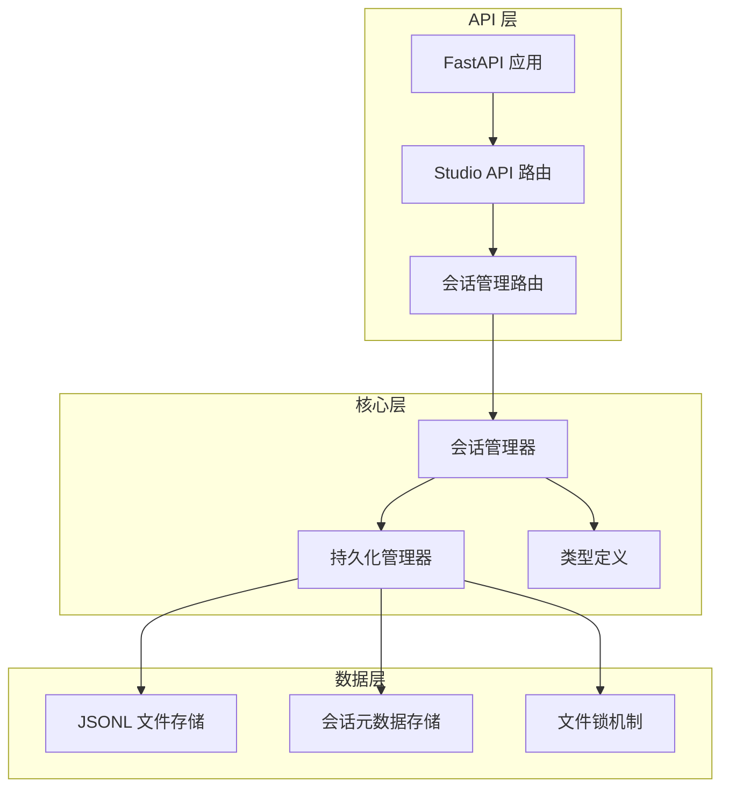
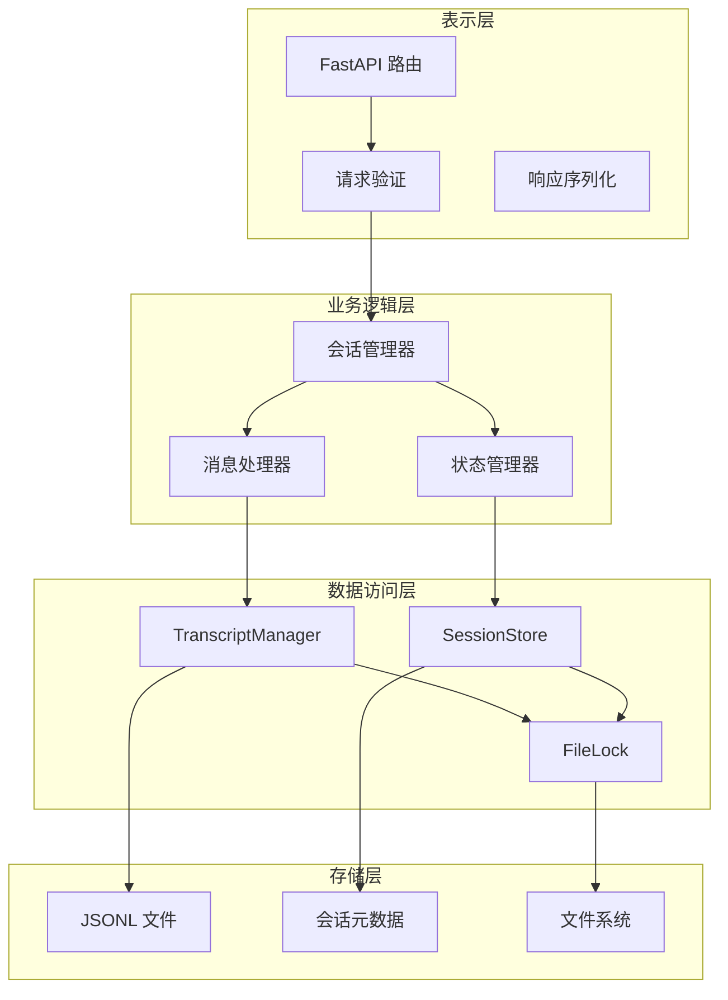
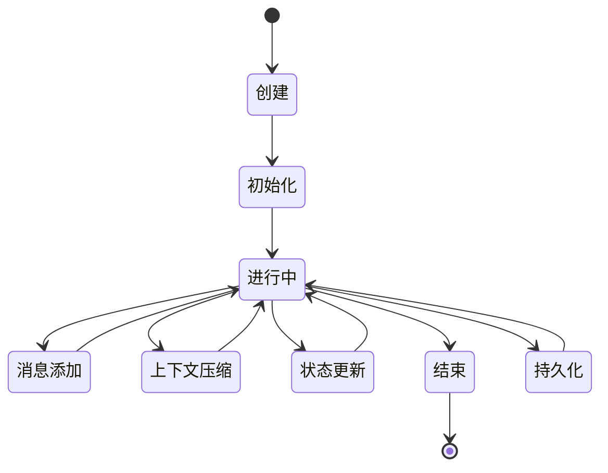
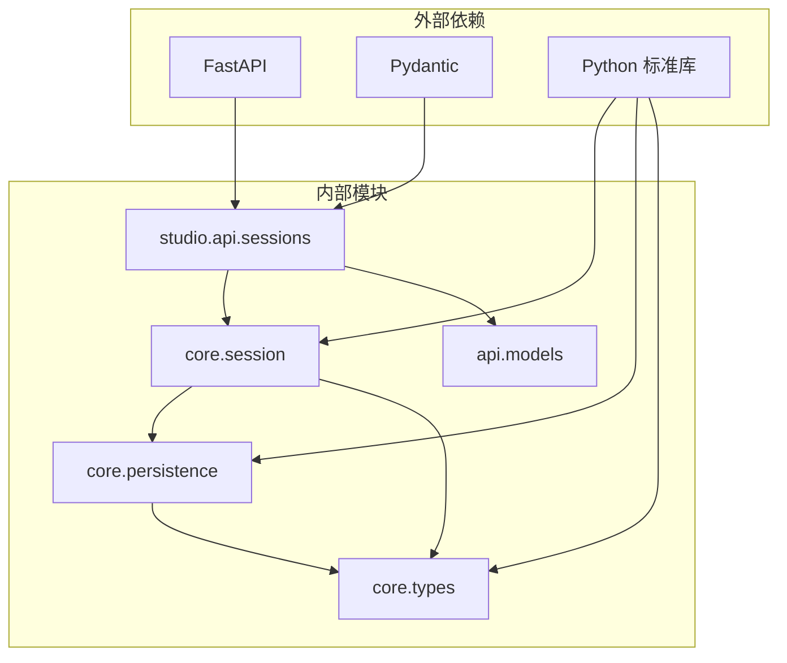

# 会话管理 API

<cite>
**本文档引用的文件**
- [sessions.py](file://src/ark_agentic/studio/api/sessions.py)
- [session.py](file://src/ark_agentic/core/session.py)
- [persistence.py](file://src/ark_agentic/core/persistence.py)
- [types.py](file://src/ark_agentic/core/types.py)
- [models.py](file://src/ark_agentic/api/models.py)
- [app.py](file://src/ark_agentic/app.py)
- [__init__.py](file://src/ark_agentic/studio/__init__.py)
- [test_session.py](file://tests/unit/core/test_session.py)
- [ark-agentic-api.postman_collection.json](file://postman/ark-agentic-api.postman_collection.json)
</cite>

## 目录
1. [简介](#简介)
2. [项目结构](#项目结构)
3. [核心组件](#核心组件)
4. [架构概览](#架构概览)
5. [详细组件分析](#详细组件分析)
6. [依赖关系分析](#依赖关系分析)
7. [性能考虑](#性能考虑)
8. [故障排除指南](#故障排除指南)
9. [结论](#结论)

## 简介

会话管理 API 是 Ark-Agentic 智能体系统的核心组件，负责管理用户与智能体之间的对话会话。该 API 提供了完整的会话生命周期管理，包括会话的创建、获取、列表、删除以及原始数据的读写功能。

会话管理 API 基于 JSONL（JSON Lines）格式进行数据持久化，支持多用户并发访问，并提供了强大的消息序列化和反序列化机制。系统还集成了上下文压缩、令牌统计、技能管理和状态管理等高级功能。

## 项目结构

会话管理 API 在项目中的组织结构如下：

**图表来源**
- [sessions.py:1-200](file://src/ark_agentic/studio/api/sessions.py#L1-L200)
- [session.py:24-482](file://src/ark_agentic/core/session.py#L24-L482)
- [persistence.py:392-787](file://src/ark_agentic/core/persistence.py#L392-L787)

**章节来源**
- [sessions.py:1-200](file://src/ark_agentic/studio/api/sessions.py#L1-L200)
- [session.py:1-482](file://src/ark_agentic/core/session.py#L1-L482)
- [persistence.py:1-787](file://src/ark_agentic/core/persistence.py#L1-L787)

## 核心组件

### 会话管理器 (SessionManager)

会话管理器是整个会话系统的核心，负责管理会话的完整生命周期：

- **会话创建**: 支持异步和同步两种创建方式
- **消息管理**: 添加、获取、清理消息历史
- **持久化**: 自动处理 JSONL 文件的读写
- **上下文压缩**: 智能压缩长对话历史
- **令牌统计**: 跟踪和统计模型使用情况
- **状态管理**: 维护会话的动态状态

### 持久化管理器 (TranscriptManager)

负责会话数据的持久化存储：

- **JSONL 格式**: 使用标准化的 JSON Lines 格式存储
- **文件锁**: 提供跨平台的文件锁定机制
- **数据校验**: 确保数据完整性和一致性
- **并发安全**: 支持多用户并发访问

### 数据模型

系统定义了完整的数据模型体系：

- **SessionEntry**: 会话实体定义
- **AgentMessage**: 智能体消息结构
- **TokenUsage**: 令牌使用统计
- **CompactionStats**: 上下文压缩统计

**章节来源**
- [session.py:24-482](file://src/ark_agentic/core/session.py#L24-L482)
- [persistence.py:392-787](file://src/ark_agentic/core/persistence.py#L392-L787)
- [types.py:350-422](file://src/ark_agentic/core/types.py#L350-L422)

## 架构概览

会话管理 API 采用分层架构设计，确保了良好的可维护性和扩展性：

**图表来源**
- [sessions.py:84-200](file://src/ark_agentic/studio/api/sessions.py#L84-L200)
- [session.py:24-482](file://src/ark_agentic/core/session.py#L24-L482)
- [persistence.py:392-787](file://src/ark_agentic/core/persistence.py#L392-L787)

## 详细组件分析

### API 路由设计

会话管理 API 提供了以下主要端点：

#### 1. 会话列表接口
- **路径**: `/api/studio/agents/{agent_id}/sessions`
- **方法**: GET
- **功能**: 列出指定 Agent 的所有会话
- **参数**: `user_id` (可选) - 按用户过滤

#### 2. 会话详情接口
- **路径**: `/api/studio/agents/{agent_id}/sessions/{session_id}`
- **方法**: GET
- **功能**: 获取指定会话的详细信息和消息历史

#### 3. 原始数据读取接口
- **路径**: `/api/studio/agents/{agent_id}/sessions/{session_id}/raw`
- **方法**: GET
- **功能**: 返回会话的原始 JSONL 文本

#### 4. 原始数据写入接口
- **路径**: `/api/studio/agents/{agent_id}/sessions/{session_id}/raw`
- **方法**: PUT
- **功能**: 校验并写回会话 JSONL 数据

**章节来源**
- [sessions.py:84-200](file://src/ark_agentic/studio/api/sessions.py#L84-L200)

### 会话生命周期管理

会话生命周期包括以下关键阶段：

**图表来源**
- [session.py:40-122](file://src/ark_agentic/core/session.py#L40-L122)
- [session.py:265-334](file://src/ark_agentic/core/session.py#L265-L334)

### 会话密钥机制

系统采用 UUID 作为会话标识符，确保唯一性和安全性：

- **生成方式**: 使用标准 UUID4 生成器
- **格式**: 36字符的 UUID 字符串
- **继承支持**: 支持父子会话的 ID 继承机制
- **验证**: 在 API 层进行严格的会话 ID 验证

### 会话元数据管理

会话元数据包含以下关键信息：

| 字段 | 类型 | 描述 | 默认值 |
|------|------|------|--------|
| session_id | String | 会话唯一标识符 | 自动生成 |
| user_id | String | 用户标识符 | 空字符串 |
| created_at | DateTime | 创建时间 | 当前时间 |
| updated_at | DateTime | 更新时间 | 当前时间 |
| model | String | 模型名称 | "Qwen3-80B-Instruct" |
| provider | String | 模型提供商 | "ark" |
| state | Dict | 会话状态 | 空字典 |

### 会话过期策略

系统采用基于时间戳的过期策略：

- **文件锁过期**: 默认 30秒过期时间
- **缓存失效**: 元数据存储缓存 TTL 45秒
- **会话清理**: 支持手动删除和自动清理机制

**章节来源**
- [persistence.py:42-44](file://src/ark_agentic/core/persistence.py#L42-L44)
- [persistence.py:264-387](file://src/ark_agentic/core/persistence.py#L264-L387)
- [persistence.py:688-787](file://src/ark_agentic/core/persistence.py#L688-L787)

## 依赖关系分析

会话管理 API 的依赖关系如下：

**图表来源**
- [sessions.py:13-18](file://src/ark_agentic/studio/api/sessions.py#L13-L18)
- [session.py:8-19](file://src/ark_agentic/core/session.py#L8-L19)
- [persistence.py:16-27](file://src/ark_agentic/core/persistence.py#L16-L27)

### 关键依赖关系

1. **FastAPI 依赖**: 提供 Web 框架和路由功能
2. **Pydantic 依赖**: 提供数据验证和序列化
3. **核心类型依赖**: 定义会话和消息的数据结构
4. **持久化依赖**: 实现文件系统操作和数据存储

**章节来源**
- [sessions.py:8-22](file://src/ark_agentic/studio/api/sessions.py#L8-L22)
- [session.py:1-22](file://src/ark_agentic/core/session.py#L1-L22)
- [persistence.py:1-29](file://src/ark_agentic/core/persistence.py#L1-L29)

## 性能考虑

### 并发处理

系统采用文件锁机制确保并发安全：

- **跨平台支持**: Windows 和 Unix 系统的不同实现
- **超时机制**: 默认 10秒超时，防止死锁
- **过期检测**: 自动清理过期的文件锁

### 内存管理

- **增量加载**: 仅在需要时加载会话数据
- **缓存机制**: 元数据存储使用 TTL 缓存
- **批量操作**: 支持批量消息添加和读取

### 存储优化

- **JSONL 格式**: 节省存储空间，便于流式处理
- **压缩支持**: 自动上下文压缩减少存储需求
- **索引机制**: 基于时间戳的消息索引

## 故障排除指南

### 常见问题及解决方案

#### 1. 会话不存在错误
**症状**: 返回 404 Not Found
**原因**: 会话 ID 不存在或用户权限不足
**解决**: 验证会话 ID 和用户 ID 的正确性

#### 2. 文件锁冲突
**症状**: 操作超时或文件锁定
**原因**: 其他进程占用会话文件
**解决**: 等待锁自动释放或重启服务

#### 3. JSONL 格式错误
**症状**: 写入失败，返回 400 Bad Request
**原因**: JSONL 文件格式不符合规范
**解决**: 检查文件格式和数据完整性

#### 4. 权限不足
**症状**: 访问被拒绝
**原因**: 用户没有访问特定会话的权限
**解决**: 检查用户认证和授权配置

**章节来源**
- [sessions.py:128-136](file://src/ark_agentic/studio/api/sessions.py#L128-L136)
- [persistence.py:598-635](file://src/ark_agentic/core/persistence.py#L598-L635)

## 结论

会话管理 API 提供了一个完整、可靠且高性能的会话管理系统。通过合理的架构设计和丰富的功能特性，该系统能够满足各种智能体应用场景的需求。

### 主要优势

1. **完整的生命周期管理**: 从创建到销毁的全流程支持
2. **强大的持久化能力**: 基于 JSONL 的可靠存储机制
3. **并发安全保障**: 跨平台的文件锁机制
4. **灵活的数据模型**: 支持丰富的会话状态和元数据
5. **优秀的性能表现**: 优化的内存管理和存储策略

### 未来发展方向

1. **会话迁移**: 支持跨用户和跨系统的会话迁移
2. **实时同步**: 增强多实例间的会话同步能力
3. **审计日志**: 完善的操作审计和合规记录
4. **备份恢复**: 自动化的数据备份和恢复机制

会话管理 API 为 Ark-Agentic 智能体系统奠定了坚实的基础，为用户提供了一致、可靠的对话体验。