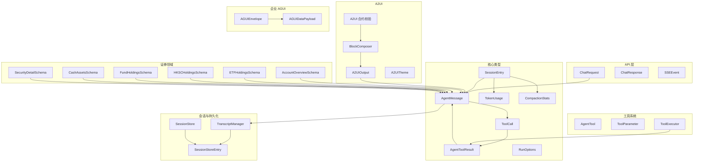
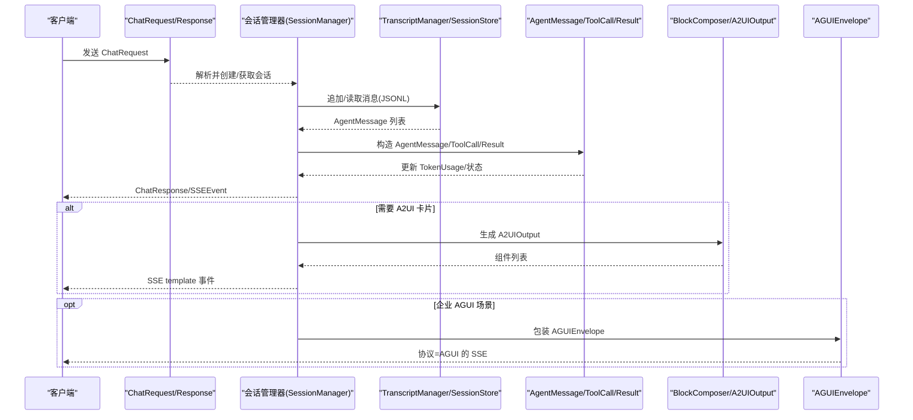
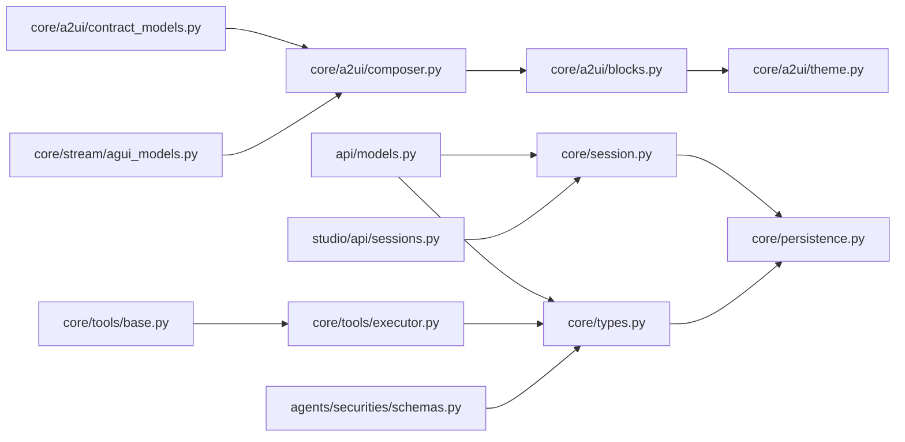

# 数据模型

<cite>
**本文档引用的文件**
- [src/ark_agentic/api/models.py](file://src/ark_agentic/api/models.py)
- [src/ark_agentic/core/types.py](file://src/ark_agentic/core/types.py)
- [src/ark_agentic/core/session.py](file://src/ark_agentic/core/session.py)
- [src/ark_agentic/core/persistence.py](file://src/ark_agentic/core/persistence.py)
- [src/ark_agentic/core/validation.py](file://src/ark_agentic/core/validation.py)
- [src/ark_agentic/core/a2ui/contract_models.py](file://src/ark_agentic/core/a2ui/contract_models.py)
- [src/ark_agentic/core/a2ui/composer.py](file://src/ark_agentic/core/a2ui/composer.py)
- [src/ark_agentic/core/a2ui/blocks.py](file://src/ark_agentic/core/a2ui/blocks.py)
- [src/ark_agentic/core/a2ui/theme.py](file://src/ark_agentic/core/a2ui/theme.py)
- [src/ark_agentic/core/stream/agui_models.py](file://src/ark_agentic/core/stream/agui_models.py)
- [src/ark_agentic/core/tools/base.py](file://src/ark_agentic/core/tools/base.py)
- [src/ark_agentic/core/tools/executor.py](file://src/ark_agentic/core/tools/executor.py)
- [src/ark_agentic/studio/api/sessions.py](file://src/ark_agentic/studio/api/sessions.py)
- [src/ark_agentic/agents/securities/schemas.py](file://src/ark_agentic/agents/securities/schemas.py)
</cite>

## 目录
1. [简介](#简介)
2. [项目结构](#项目结构)
3. [核心组件](#核心组件)
4. [架构总览](#架构总览)
5. [详细组件分析](#详细组件分析)
6. [依赖分析](#依赖分析)
7. [性能考虑](#性能考虑)
8. [故障排查指南](#故障排查指南)
9. [结论](#结论)
10. [附录](#附录)

## 简介
本文件为 Ark-Agentic 数据模型的完整参考文档，聚焦以下核心数据结构与关系：
- 智能体消息模型（AgentMessage）、工具调用参数（ToolCall）、工具执行结果（AgentToolResult）
- 会话数据模型（SessionEntry、TokenUsage、CompactionStats）及其持久化（TranscriptManager、SessionStore）
- A2UI 卡片与事件数据结构（A2UI 合约校验、BlockComposer、BlocksConfig、A2UIOutput）
- 企业级 AGUI 信封（AGUIEnvelope、AGUIDataPayload）
- 证券领域数据模型（AccountOverview、ETF/HKSC/Fund/Cash/Security 等）
- 输出验证与事实溯源（Citation、CitedResponse、CitationValidationResult）

文档提供字段定义、数据类型、验证规则、默认值与使用示例，并给出数据模型之间的关系图与序列化/反序列化流程。

## 项目结构
Ark-Agentic 的数据模型分布在多个模块中：
- API 层：ChatRequest/ChatResponse、SSEEvent
- 核心类型：AgentMessage、ToolCall、AgentToolResult、RunOptions、SessionEntry 等
- 会话与持久化：TranscriptManager、SessionStore、SessionStoreEntry
- A2UI：合约校验、块编排、主题与输出
- 工具系统：AgentTool、ToolParameter、ToolExecutor
- 企业 AGUI：AGUIEnvelope、AGUIDataPayload
- 证券领域：AccountOverview、ETF/HKSC/Fund/Cash/Security 等 Schema
- 输出验证：Citation、CitedResponse、CitationValidationResult

图表来源
- [src/ark_agentic/api/models.py:27-102](file://src/ark_agentic/api/models.py#L27-L102)
- [src/ark_agentic/core/types.py:70-422](file://src/ark_agentic/core/types.py#L70-L422)
- [src/ark_agentic/core/persistence.py:392-787](file://src/ark_agentic/core/persistence.py#L392-L787)
- [src/ark_agentic/core/a2ui/contract_models.py:1-123](file://src/ark_agentic/core/a2ui/contract_models.py#L1-L123)
- [src/ark_agentic/core/a2ui/composer.py:57-123](file://src/ark_agentic/core/a2ui/composer.py#L57-L123)
- [src/ark_agentic/core/a2ui/blocks.py:46-149](file://src/ark_agentic/core/a2ui/blocks.py#L46-L149)
- [src/ark_agentic/core/a2ui/theme.py:12-38](file://src/ark_agentic/core/a2ui/theme.py#L12-L38)
- [src/ark_agentic/core/tools/base.py:16-289](file://src/ark_agentic/core/tools/base.py#L16-L289)
- [src/ark_agentic/core/tools/executor.py:29-127](file://src/ark_agentic/core/tools/executor.py#L29-L127)
- [src/ark_agentic/core/stream/agui_models.py:16-51](file://src/ark_agentic/core/stream/agui_models.py#L16-L51)
- [src/ark_agentic/agents/securities/schemas.py:29-465](file://src/ark_agentic/agents/securities/schemas.py#L29-L465)

章节来源
- [src/ark_agentic/api/models.py:1-104](file://src/ark_agentic/api/models.py#L1-L104)
- [src/ark_agentic/core/types.py:1-422](file://src/ark_agentic/core/types.py#L1-L422)
- [src/ark_agentic/core/session.py:24-482](file://src/ark_agentic/core/session.py#L24-L482)
- [src/ark_agentic/core/persistence.py:1-787](file://src/ark_agentic/core/persistence.py#L1-L787)
- [src/ark_agentic/core/validation.py:1-605](file://src/ark_agentic/core/validation.py#L1-L605)
- [src/ark_agentic/core/a2ui/contract_models.py:1-123](file://src/ark_agentic/core/a2ui/contract_models.py#L1-L123)
- [src/ark_agentic/core/a2ui/composer.py:1-123](file://src/ark_agentic/core/a2ui/composer.py#L1-L123)
- [src/ark_agentic/core/a2ui/blocks.py:1-149](file://src/ark_agentic/core/a2ui/blocks.py#L1-L149)
- [src/ark_agentic/core/a2ui/theme.py:1-38](file://src/ark_agentic/core/a2ui/theme.py#L1-L38)
- [src/ark_agentic/core/stream/agui_models.py:1-51](file://src/ark_agentic/core/stream/agui_models.py#L1-L51)
- [src/ark_agentic/core/tools/base.py:1-289](file://src/ark_agentic/core/tools/base.py#L1-L289)
- [src/ark_agentic/core/tools/executor.py:1-127](file://src/ark_agentic/core/tools/executor.py#L1-L127)
- [src/ark_agentic/studio/api/sessions.py:25-200](file://src/ark_agentic/studio/api/sessions.py#L25-L200)
- [src/ark_agentic/agents/securities/schemas.py:1-465](file://src/ark_agentic/agents/securities/schemas.py#L1-L465)

## 核心组件
本节概述关键数据模型及职责：
- 智能体消息模型：封装角色、内容、工具调用/结果、思考过程与元数据
- 工具调用与结果：统一的工具调用请求与多类型结果（JSON/TEXT/A2UI/IMAGE/ERROR）
- 会话模型：会话条目、Token 统计、压缩统计、活跃技能与状态
- A2UI：事件契约校验、块编排、主题与输出容器
- 企业 AGUI：信封与数据载荷，对齐 A2UI 协议
- 工具系统：工具参数定义、JSON Schema、执行器与事件分发
- 证券领域：账户、持仓、现金、个股等标准化 Schema
- 输出验证：引用提取、事实来源归一化、评分与路由

章节来源
- [src/ark_agentic/core/types.py:70-422](file://src/ark_agentic/core/types.py#L70-L422)
- [src/ark_agentic/core/a2ui/contract_models.py:1-123](file://src/ark_agentic/core/a2ui/contract_models.py#L1-L123)
- [src/ark_agentic/core/a2ui/composer.py:57-123](file://src/ark_agentic/core/a2ui/composer.py#L57-L123)
- [src/ark_agentic/core/a2ui/blocks.py:46-149](file://src/ark_agentic/core/a2ui/blocks.py#L46-L149)
- [src/ark_agentic/core/a2ui/theme.py:12-38](file://src/ark_agentic/core/a2ui/theme.py#L12-L38)
- [src/ark_agentic/core/stream/agui_models.py:16-51](file://src/ark_agentic/core/stream/agui_models.py#L16-L51)
- [src/ark_agentic/core/tools/base.py:16-289](file://src/ark_agentic/core/tools/base.py#L16-L289)
- [src/ark_agentic/core/tools/executor.py:29-127](file://src/ark_agentic/core/tools/executor.py#L29-L127)
- [src/ark_agentic/agents/securities/schemas.py:29-465](file://src/ark_agentic/agents/securities/schemas.py#L29-L465)

## 架构总览
下图展示数据模型在系统中的交互关系与流转：

图表来源
- [src/ark_agentic/api/models.py:27-102](file://src/ark_agentic/api/models.py#L27-L102)
- [src/ark_agentic/core/session.py:24-482](file://src/ark_agentic/core/session.py#L24-L482)
- [src/ark_agentic/core/persistence.py:392-787](file://src/ark_agentic/core/persistence.py#L392-L787)
- [src/ark_agentic/core/types.py:70-422](file://src/ark_agentic/core/types.py#L70-L422)
- [src/ark_agentic/core/a2ui/composer.py:57-123](file://src/ark_agentic/core/a2ui/composer.py#L57-L123)
- [src/ark_agentic/core/stream/agui_models.py:39-51](file://src/ark_agentic/core/stream/agui_models.py#L39-L51)

## 详细组件分析

### 智能体消息模型（AgentMessage）
- 字段
  - role: 枚举（system/user/assistant/tool）
  - content: 文本内容（可空）
  - tool_calls: 工具调用数组（可空）
  - tool_results: 工具结果数组（可空）
  - thinking: 思考过程（可空）
  - timestamp: 时间戳（默认当前）
  - metadata: 元数据字典（默认空）
- 默认值与约束
  - role 必填；content/tool_calls/tool_results/thinking 可空
  - timestamp 默认当前时间
- 使用示例
  - 构造系统消息、用户消息、助手消息（可带 tool_calls）、工具消息（携带 tool_results）
- 序列化/反序列化
  - JSONL 序列化：serialize_message → 反序列化：deserialize_message
  - 工具调用/结果：serialize_tool_call/deserialize_tool_call、serialize_tool_result/deserialize_tool_result

章节来源
- [src/ark_agentic/core/types.py:198-238](file://src/ark_agentic/core/types.py#L198-L238)
- [src/ark_agentic/core/persistence.py:107-259](file://src/ark_agentic/core/persistence.py#L107-L259)

### 工具调用与结果（ToolCall、AgentToolResult）
- ToolCall
  - id: 唯一标识（自动生成）
  - name: 工具名
  - arguments: 参数字典
- AgentToolResult
  - tool_call_id: 关联的工具调用 id
  - result_type: 枚举（json/text/image/a2ui/error）
  - content: 结果内容（字符串/字典/列表/数值）
  - is_error: 是否错误
  - metadata: 元数据
  - loop_action: 控制 ReAct 循环（continue/stop）
  - events: 自定义事件（UIComponent/Custom/Step）
  - llm_digest: LLM 摘要（可空）
- 工具参数定义（ToolParameter）
  - name/type/description/required/default/enum/items/properties
  - to_json_schema：生成 OpenAI function schema
- 工具执行器（ToolExecutor）
  - 并行执行工具调用，超时与异常兜底
  - 统一分发 ToolEvent 到事件处理器

章节来源
- [src/ark_agentic/core/types.py:70-196](file://src/ark_agentic/core/types.py#L70-L196)
- [src/ark_agentic/core/tools/base.py:16-101](file://src/ark_agentic/core/tools/base.py#L16-L101)
- [src/ark_agentic/core/tools/executor.py:29-127](file://src/ark_agentic/core/tools/executor.py#L29-L127)

### 会话数据模型（SessionEntry、TokenUsage、CompactionStats）
- SessionEntry
  - session_id/user_id/model/provider
  - messages: AgentMessage 列表
  - token_usage: TokenUsage
  - compaction_stats: CompactionStats
  - active_skills: 活跃技能列表
  - state: 会话状态字典
  - 工具方法：add_message/update_token_usage/get_state/update_state/strip_temp_state
- TokenUsage
  - prompt_tokens/completion_tokens/cache_read_tokens/cache_creation_tokens
  - total_tokens 属性
- CompactionStats
  - original_messages/compacted_messages/original_tokens/compacted_tokens/last_compaction_at
- 会话管理器（SessionManager）
  - 生命周期：创建/加载/删除/列表
  - 消息管理：追加/批量追加/注入外部历史/清空/限制条数
  - Token 统计与估算
  - 上下文压缩：needs_compaction/compact_session/auto_compact_if_needed
  - 技能管理：set_active_skills/get_active_skills
  - 状态管理：update_state/get_state
  - 统计查询：get_session_stats

章节来源
- [src/ark_agentic/core/types.py:325-422](file://src/ark_agentic/core/types.py#L325-L422)
- [src/ark_agentic/core/session.py:24-482](file://src/ark_agentic/core/session.py#L24-L482)

### 会话持久化（TranscriptManager、SessionStore、SessionStoreEntry）
- JSONL 转录
  - SessionHeader：type/version/id/timestamp/cwd
  - MessageEntry：type/message/timestamp
  - ensure_header/append_message/append_messages/load_messages/read_raw/write_raw
- 会话元数据存储
  - SessionStoreEntry：sessionId/updatedAt/sessionFile/model/provider/input/output/total/compactionCount/activeSkills/state
  - SessionStore：load/save/update/get/delete/list_keys（含缓存与文件锁）
- 序列化/反序列化
  - serialize_message/deserialize_message
  - serialize_tool_call/deserialize_tool_call
  - serialize_tool_result/deserialize_tool_result

章节来源
- [src/ark_agentic/core/persistence.py:50-787](file://src/ark_agentic/core/persistence.py#L50-L787)

### A2UI 卡片与事件数据结构
- A2UI 合约校验（validate_event_payload）
  - 支持事件：beginRendering/surfaceUpdate/dataModelUpdate/deleteSurface
  - 字段白名单与必填校验
- BlockComposer
  - 输入：block 描述数组、原始数据、主题、会话 id、surfaceId
  - 输出：标准 A2UI payload（event/version/surfaceId/rootComponentId/style/data/components）
  - 内联 transform 规范解析（get/sum/count/concat/select/switch/literal）
- A2UIOutput
  - components/template_data/llm_digest/state_delta
- 主题（A2UITheme）
  - 颜色、形状、密度、根间距等设计令牌
- 组件与块注册
  - get_block_builder/get_block_types/_register
  - 绑定解析与动作参数解析

章节来源
- [src/ark_agentic/core/a2ui/contract_models.py:1-123](file://src/ark_agentic/core/a2ui/contract_models.py#L1-L123)
- [src/ark_agentic/core/a2ui/composer.py:57-123](file://src/ark_agentic/core/a2ui/composer.py#L57-L123)
- [src/ark_agentic/core/a2ui/blocks.py:46-149](file://src/ark_agentic/core/a2ui/blocks.py#L46-L149)
- [src/ark_agentic/core/a2ui/theme.py:12-38](file://src/ark_agentic/core/a2ui/theme.py#L12-L38)

### 企业 AGUI 信封（AGUIEnvelope、AGUIDataPayload）
- AGUIDataPayload
  - code/type/msg/request_id/trace_id/message_id/conversation_id/timestamp/ui_protocol/ui_data/turn/by/to/cost/server/extra
- AGUIEnvelope
  - protocol/id/event/source_bu_type/app_type/data

章节来源
- [src/ark_agentic/core/stream/agui_models.py:16-51](file://src/ark_agentic/core/stream/agui_models.py#L16-L51)

### API 请求/响应与 SSE 事件
- ChatRequest
  - agent_id/message/session_id/stream/run_options/protocol/source_bu_type/app_type/user_id/message_id/context/idempotency_key/history/use_history
  - history 支持数组或 JSON 字符串，自动校验并转为列表
- ChatResponse
  - session_id/message_id/response/tool_calls/turns/usage
- SSEEvent
  - type/seq/run_id/session_id/content/delta/output_index/template/message/usage/turns/tool_calls/error_message

章节来源
- [src/ark_agentic/api/models.py:27-102](file://src/ark_agentic/api/models.py#L27-L102)

### 证券领域数据模型
- AccountOverviewSchema
  - 标题、账户类型、总资产、仓位、稳健仓位、各类资产信息（mktAssetsInfo/fundMktAssetsInfo/cashGainAssetsInfo/rzrqAssetsInfo）
- ETFHoldingsSchema
  - 汇总统计与持仓列表（ETFHoldingItemSchema）
- HKSCHoldingsSchema
  - 汇总统计、预冻结列表与持仓列表（HKSCHoldingItemSchema/HKSCPreFrozenItemSchema）
- FundHoldingsSchema
  - 基金持仓项与汇总（FundHoldingItemSchema/HoldingsSummarySchema）
- CashAssetsSchema
  - 现金余额、可用资金、可取资金、结算日期、今日收益等
- SecurityDetailSchema
  - 证券代码/名称/类型/市场、持仓信息（SecurityHoldingSchema）、行情信息（SecurityMarketInfoSchema）

章节来源
- [src/ark_agentic/agents/securities/schemas.py:29-465](file://src/ark_agentic/agents/securities/schemas.py#L29-L465)

### 输出验证与事实溯源（Citation、CitedResponse、CitationValidationResult）
- 数据结构
  - Citation：value/type/source
  - CitedResponse：answer/citations
  - CitationError：type/value/source
  - ExtractedClaim：value/type/normalized_values/sources
  - CitationValidationResult：score/errors/passed/route
- 核心流程
  - parse_cited_response：解析结构化回答
  - validate_answer_grounding：提取 claim → 构建事实来源 → 匹配 → 计算分数与路由
  - extract_claims_from_answer：去重与优先级处理
  - create_citation_validation_hook：框架级钩子，每轮注入校验与必要时重试

章节来源
- [src/ark_agentic/core/validation.py:77-605](file://src/ark_agentic/core/validation.py#L77-L605)

### Studio 会话 API 数据模型
- SessionItem：session_id/user_id/message_count/state/created_at/updated_at/first_message
- MessageItem：role/content/tool_calls/tool_results/thinking/metadata
- SessionDetailResponse：session_id/message_count/state/messages
- 工具：_message_to_item、list_agent_sessions/get_session_detail/get_session_raw/put_session_raw

章节来源
- [src/ark_agentic/studio/api/sessions.py:25-200](file://src/ark_agentic/studio/api/sessions.py#L25-L200)

## 依赖分析
- 模块耦合
  - API 层依赖核心类型与会话管理器
  - 会话管理器依赖持久化模块与类型定义
  - A2UI 编排依赖块注册与主题
  - 工具系统依赖类型与事件总线
  - 企业 AGUI 依赖 A2UI 输出
  - 证券 Schema 与工具/服务解耦
- 可能的循环依赖
  - 当前模块间为单向依赖，未发现循环导入
- 外部依赖
  - Pydantic 用于数据校验与序列化
  - asyncio 用于异步执行与锁管理

图表来源
- [src/ark_agentic/api/models.py:1-104](file://src/ark_agentic/api/models.py#L1-L104)
- [src/ark_agentic/core/types.py:1-422](file://src/ark_agentic/core/types.py#L1-L422)
- [src/ark_agentic/core/session.py:1-482](file://src/ark_agentic/core/session.py#L1-L482)
- [src/ark_agentic/core/persistence.py:1-787](file://src/ark_agentic/core/persistence.py#L1-L787)
- [src/ark_agentic/core/a2ui/contract_models.py:1-123](file://src/ark_agentic/core/a2ui/contract_models.py#L1-L123)
- [src/ark_agentic/core/a2ui/composer.py:1-123](file://src/ark_agentic/core/a2ui/composer.py#L1-L123)
- [src/ark_agentic/core/a2ui/blocks.py:1-149](file://src/ark_agentic/core/a2ui/blocks.py#L1-L149)
- [src/ark_agentic/core/a2ui/theme.py:1-38](file://src/ark_agentic/core/a2ui/theme.py#L1-L38)
- [src/ark_agentic/core/tools/base.py:1-289](file://src/ark_agentic/core/tools/base.py#L1-L289)
- [src/ark_agentic/core/tools/executor.py:1-127](file://src/ark_agentic/core/tools/executor.py#L1-L127)
- [src/ark_agentic/core/stream/agui_models.py:1-51](file://src/ark_agentic/core/stream/agui_models.py#L1-L51)
- [src/ark_agentic/agents/securities/schemas.py:1-465](file://src/ark_agentic/agents/securities/schemas.py#L1-L465)
- [src/ark_agentic/studio/api/sessions.py:1-200](file://src/ark_agentic/studio/api/sessions.py#L1-L200)

## 性能考虑
- 会话压缩
  - ContextCompactor 评估消息数量与 token，按需压缩减少上下文长度
  - 压缩统计记录原始/压缩后的消息与 token 数量
- Token 统计
  - TokenUsage 累计 prompt/completion/cache 使用，便于成本控制与上限预警
- 工具执行
  - ToolExecutor 并行执行工具调用，设置超时与最大调用次数，避免阻塞
- 文件锁与并发
  - TranscriptManager/SessionStore 使用跨平台文件锁，保障 JSONL 写入一致性

[本节为通用指导，不直接分析具体文件]

## 故障排查指南
- A2UI 合约校验失败
  - 检查事件类型、字段白名单与必填字段
  - beginRendering/surfaceUpdate/dataModelUpdate/deleteSurface 的约束条件
- JSONL 校验失败
  - 首行必须为 session，后续行必须为 message，且 message 为对象
  - 写回 raw 时抛出 RawJsonlValidationError，包含行号
- 工具执行异常
  - 超时：检查工具耗时与超时配置
  - 未找到工具：确认工具名与注册表
  - 结果解析：确保 content 为可序列化类型，错误时 is_error=true
- 输出验证失败
  - 未 grounding 的 claim 会被计入扣分，建议检查工具输出与上下文归一化

章节来源
- [src/ark_agentic/core/a2ui/contract_models.py:97-123](file://src/ark_agentic/core/a2ui/contract_models.py#L97-L123)
- [src/ark_agentic/core/persistence.py:31-37](file://src/ark_agentic/core/persistence.py#L31-L37)
- [src/ark_agentic/core/persistence.py:598-635](file://src/ark_agentic/core/persistence.py#L598-L635)
- [src/ark_agentic/core/tools/executor.py:77-100](file://src/ark_agentic/core/tools/executor.py#L77-L100)
- [src/ark_agentic/core/validation.py:213-292](file://src/ark_agentic/core/validation.py#L213-L292)

## 结论
Ark-Agentic 的数据模型围绕“消息—工具—会话—渲染—验证”的闭环设计，既保证了灵活性（动态 A2UI 块与企业 AGUI 信封），又确保了稳定性（严格的合约校验、序列化/反序列化与持久化）。通过清晰的类型定义与分层校验，开发者可在不同场景下快速集成与扩展。

[本节为总结性内容，不直接分析具体文件]

## 附录

### 字段定义与默认值速查
- ChatRequest
  - agent_id: "insurance"/"securities"
  - message: 必填
  - session_id: 可空（为空则创建新会话）
  - stream: False
  - run_options: 可空
  - protocol: "internal"/"agui"/"enterprise"/"alone"
  - user_id/message_id: 可空
  - context/idempotency_key: 可空
  - history: 可为数组或 JSON 字符串，自动校验
  - use_history: True
- ChatResponse
  - session_id/message_id/response/tool_calls/turns/usage
- SSEEvent
  - type: "response.*"
  - seq/run_id/session_id/content/delta/output_index/template/message/usage/turns/tool_calls/error_message
- AgentMessage
  - role: 枚举；content/tool_calls/tool_results/thinking 可空；timestamp 默认当前
- ToolCall
  - id 自动生成；name/arguments
- AgentToolResult
  - result_type: json/text/image/a2ui/error；is_error=false；loop_action=continue
- SessionEntry
  - model="Qwen3-80B-Instruct"；provider="ark"；state={}；active_skills=[]
- TokenUsage/CompactionStats
  - 各字段默认 0（或 None）
- A2UIOutput
  - components/template_data/llm_digest/state_delta（后者可空）
- AGUIDataPayload
  - code="200"；ui_protocol="text"/"json"/"A2UI"；timestamp 当前时间
- AGUIEnvelope
  - protocol="AGUI"；event/source_bu_type/app_type/data

章节来源
- [src/ark_agentic/api/models.py:27-102](file://src/ark_agentic/api/models.py#L27-L102)
- [src/ark_agentic/core/types.py:70-422](file://src/ark_agentic/core/types.py#L70-L422)
- [src/ark_agentic/core/stream/agui_models.py:16-51](file://src/ark_agentic/core/stream/agui_models.py#L16-L51)

### 序列化/反序列化示例（步骤说明）
- 智能体消息
  - 序列化：serialize_message → 写入 JSONL（MessageEntry）
  - 反序列化：从 JSONL 读取 → deserialize_message → AgentMessage
- 工具调用/结果
  - 序列化：serialize_tool_call/serialize_tool_result
  - 反序列化：deserialize_tool_call/deserialize_tool_result
- 会话持久化
  - TranscriptManager.ensure_header/append_message/load_messages/read_raw/write_raw
  - SessionStore.load/save/update/get/delete/list_keys
- A2UI 输出
  - BlockComposer.compose → 生成标准 A2UI payload
  - A2UI 合约校验 validate_event_payload
- 企业 AGUI
  - AGUIEnvelope/AGUIDataPayload 构造与传输

章节来源
- [src/ark_agentic/core/persistence.py:107-259](file://src/ark_agentic/core/persistence.py#L107-L259)
- [src/ark_agentic/core/a2ui/composer.py:60-123](file://src/ark_agentic/core/a2ui/composer.py#L60-L123)
- [src/ark_agentic/core/a2ui/contract_models.py:97-123](file://src/ark_agentic/core/a2ui/contract_models.py#L97-L123)
- [src/ark_agentic/core/stream/agui_models.py:39-51](file://src/ark_agentic/core/stream/agui_models.py#L39-L51)