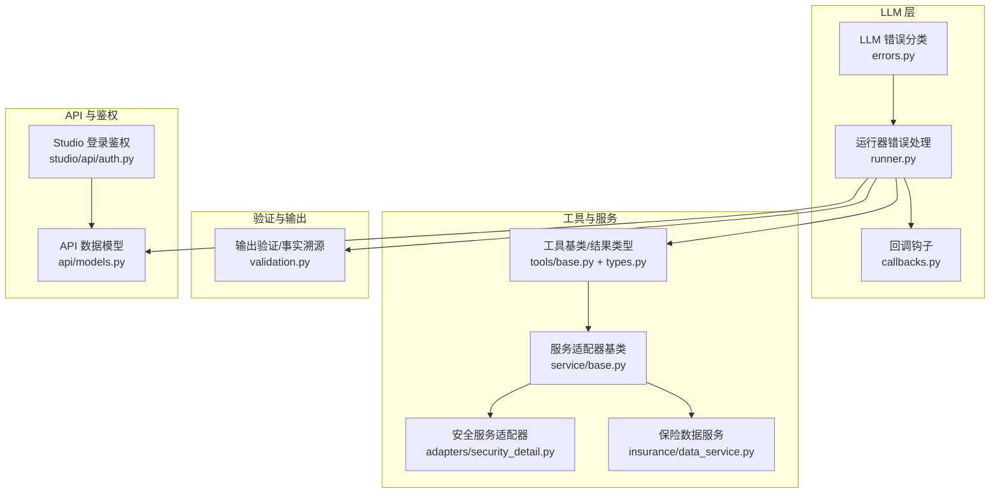
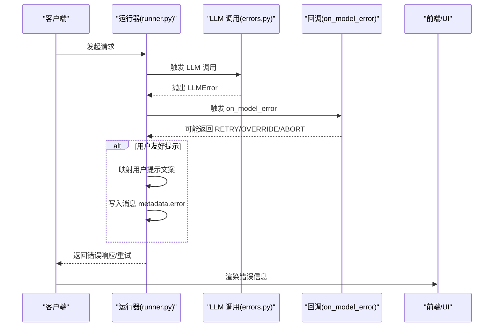
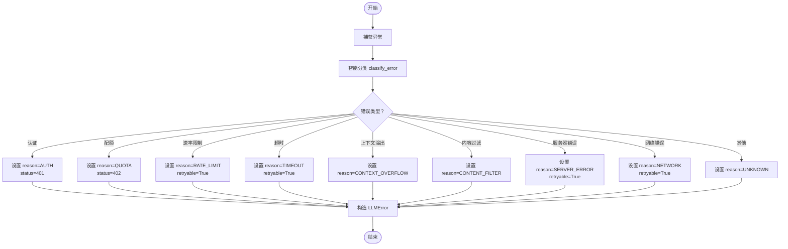
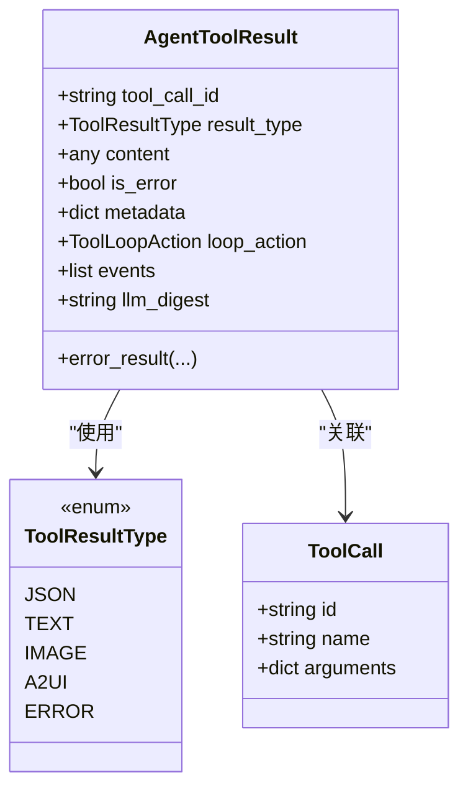
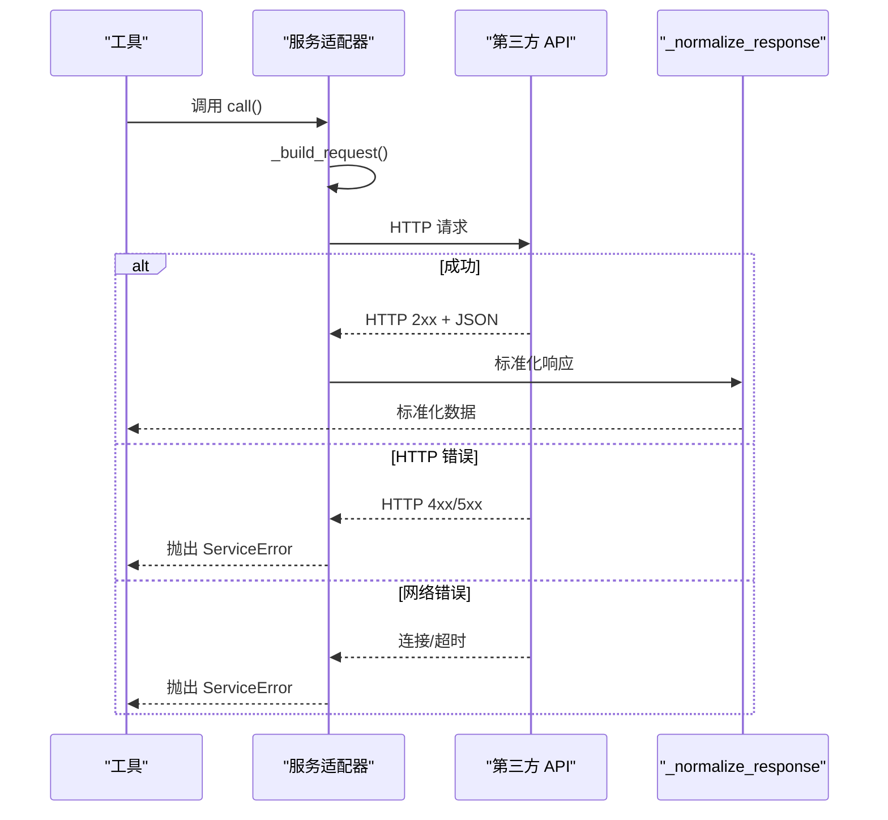
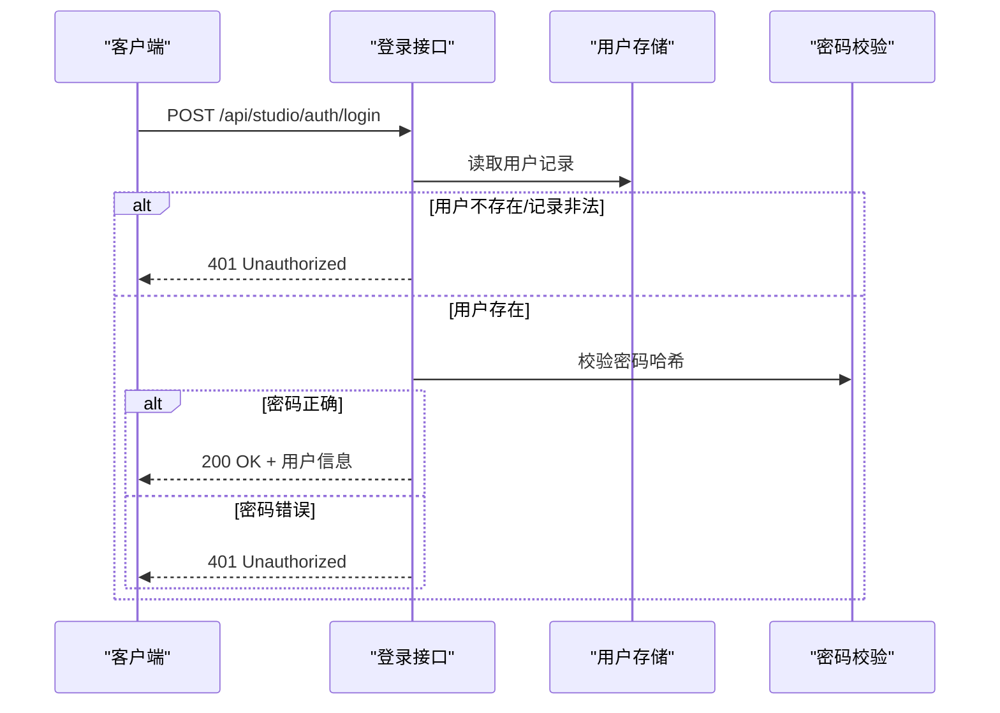
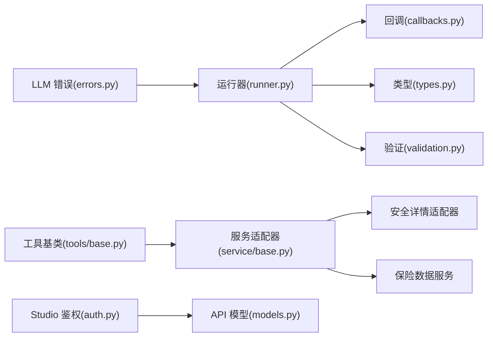

# 错误代码和状态码

<cite>
**本文档引用的文件**
- [src/ark_agentic/core/llm/errors.py](file://src/ark_agentic/core/llm/errors.py)
- [src/ark_agentic/core/runner.py](file://src/ark_agentic/core/runner.py)
- [src/ark_agentic/core/callbacks.py](file://src/ark_agentic/core/callbacks.py)
- [src/ark_agentic/core/validation.py](file://src/ark_agentic/core/validation.py)
- [src/ark_agentic/core/types.py](file://src/ark_agentic/core/types.py)
- [src/ark_agentic/core/tokens.py](file://src/ark_agentic/core/tokens.py)
- [src/ark_agentic/api/models.py](file://src/ark_agentic/api/models.py)
- [src/ark_agentic/studio/api/auth.py](file://src/ark_agentic/studio/api/auth.py)
- [src/ark_agentic/agents/securities/tools/service/base.py](file://src/ark_agentic/agents/securities/tools/service/base.py)
- [src/ark_agentic/agents/securities/tools/service/adapters/security_detail.py](file://src/ark_agentic/agents/securities/tools/service/adapters/security_detail.py)
- [src/ark_agentic/agents/insurance/tools/data_service.py](file://src/ark_agentic/agents/insurance/tools/data_service.py)
- [src/ark_agentic/core/tools/base.py](file://src/ark_agentic/core/tools/base.py)
- [src/ark_agentic/core/guard.py](file://src/ark_agentic/core/guard.py)
- [tests/unit/studio/test_auth_login.py](file://tests/unit/studio/test_auth_login.py)
- [tests/unit/core/test_retry.py](file://tests/unit/core/test_retry.py)
</cite>

## 目录
1. [简介](#简介)
2. [项目结构](#项目结构)
3. [核心组件](#核心组件)
4. [架构总览](#架构总览)
5. [详细组件分析](#详细组件分析)
6. [依赖分析](#依赖分析)
7. [性能考量](#性能考量)
8. [故障排查指南](#故障排查指南)
9. [结论](#结论)
10. [附录](#附录)

## 简介
本文件为 Ark Agentic Space 项目的错误代码与状态码参考文档，覆盖 LLM 调用错误、工具执行错误、验证错误、权限错误、以及前端/后端交互错误等场景。文档提供：
- 错误类型与分类
- HTTP 状态码映射与含义
- 错误消息格式与结构
- 处理建议与排查步骤
- 常见问题与调试技巧

## 项目结构
围绕错误处理的关键模块包括：
- LLM 错误分类与统一异常：core/llm/errors.py
- 运行器错误处理与用户友好提示：core/runner.py
- 回调钩子与错误路径：core/callbacks.py
- 输出验证与事实溯源错误：core/validation.py
- 工具基类与工具结果错误类型：core/tools/base.py、core/types.py
- 服务适配器与第三方 API 错误：agents/securities/tools/service/base.py、agents/securities/tools/service/adapters/security_detail.py、agents/insurance/tools/data_service.py
- Studio 登录鉴权错误：studio/api/auth.py
- API 数据模型与事件：api/models.py



**图表来源**
- [src/ark_agentic/core/llm/errors.py:1-160](file://src/ark_agentic/core/llm/errors.py#L1-L160)
- [src/ark_agentic/core/runner.py:592-840](file://src/ark_agentic/core/runner.py#L592-L840)
- [src/ark_agentic/core/callbacks.py:1-198](file://src/ark_agentic/core/callbacks.py#L1-L198)
- [src/ark_agentic/core/tools/base.py:1-289](file://src/ark_agentic/core/tools/base.py#L1-L289)
- [src/ark_agentic/core/types.py:1-422](file://src/ark_agentic/core/types.py#L1-L422)
- [src/ark_agentic/agents/securities/tools/service/base.py:1-212](file://src/ark_agentic/agents/securities/tools/service/base.py#L1-L212)
- [src/ark_agentic/agents/securities/tools/service/adapters/security_detail.py:46-67](file://src/ark_agentic/agents/securities/tools/service/adapters/security_detail.py#L46-L67)
- [src/ark_agentic/agents/insurance/tools/data_service.py:187-228](file://src/ark_agentic/agents/insurance/tools/data_service.py#L187-L228)
- [src/ark_agentic/core/validation.py:1-605](file://src/ark_agentic/core/validation.py#L1-L605)
- [src/ark_agentic/api/models.py:1-104](file://src/ark_agentic/api/models.py#L1-L104)
- [src/ark_agentic/studio/api/auth.py:88-114](file://src/ark_agentic/studio/api/auth.py#L88-L114)

**章节来源**
- [src/ark_agentic/core/llm/errors.py:1-160](file://src/ark_agentic/core/llm/errors.py#L1-L160)
- [src/ark_agentic/core/runner.py:592-840](file://src/ark_agentic/core/runner.py#L592-L840)
- [src/ark_agentic/core/callbacks.py:1-198](file://src/ark_agentic/core/callbacks.py#L1-L198)
- [src/ark_agentic/core/validation.py:1-605](file://src/ark_agentic/core/validation.py#L1-L605)
- [src/ark_agentic/core/tools/base.py:1-289](file://src/ark_agentic/core/tools/base.py#L1-L289)
- [src/ark_agentic/core/types.py:1-422](file://src/ark_agentic/core/types.py#L1-L422)
- [src/ark_agentic/agents/securities/tools/service/base.py:1-212](file://src/ark_agentic/agents/securities/tools/service/base.py#L1-L212)
- [src/ark_agentic/agents/securities/tools/service/adapters/security_detail.py:46-67](file://src/ark_agentic/agents/securities/tools/service/adapters/security_detail.py#L46-L67)
- [src/ark_agentic/agents/insurance/tools/data_service.py:187-228](file://src/ark_agentic/agents/insurance/tools/data_service.py#L187-L228)
- [src/ark_agentic/api/models.py:1-104](file://src/ark_agentic/api/models.py#L1-L104)
- [src/ark_agentic/studio/api/auth.py:88-114](file://src/ark_agentic/studio/api/auth.py#L88-L114)

## 核心组件
- LLM 错误分类与统一异常
  - 错误原因枚举：认证、配额/账单、速率限制、超时、上下文溢出、内容过滤、服务器错误、网络错误、未知
  - 统一异常结构：包含消息、原因、提供商、模型、状态码、是否可重试、原始异常
  - 智能分类函数：基于关键字匹配与状态码识别
- 运行器错误处理
  - 将 LLM 错误映射为用户可理解的提示文案
  - 将错误元数据写入会话消息的 metadata，便于前端展示
- 回调钩子
  - on_model_error 独立错误路径，与成功路径互斥
  - 支持错误重试、覆盖、中止等动作
- 工具与服务错误
  - 工具结果类型包含 ERROR，便于工具侧直接返回错误
  - 服务适配器捕获 HTTP 错误并抛出统一 ServiceError
- 输出验证错误
  - 引用溯源失败、未引用、未接地等错误类型
  - 基于评分阈值进行路由（safe/warn/retry）

**章节来源**
- [src/ark_agentic/core/llm/errors.py:17-159](file://src/ark_agentic/core/llm/errors.py#L17-L159)
- [src/ark_agentic/core/runner.py:592-840](file://src/ark_agentic/core/runner.py#L592-L840)
- [src/ark_agentic/core/callbacks.py:134-139](file://src/ark_agentic/core/callbacks.py#L134-L139)
- [src/ark_agentic/core/tools/base.py:86-196](file://src/ark_agentic/core/tools/base.py#L86-L196)
- [src/ark_agentic/core/types.py:26-100](file://src/ark_agentic/core/types.py#L26-L100)
- [src/ark_agentic/agents/securities/tools/service/base.py:32-104](file://src/ark_agentic/agents/securities/tools/service/base.py#L32-L104)
- [src/ark_agentic/core/validation.py:95-121](file://src/ark_agentic/core/validation.py#L95-L121)

## 架构总览
以下序列图展示了 LLM 错误从产生到呈现给用户的完整流程。



**图表来源**
- [src/ark_agentic/core/runner.py:592-840](file://src/ark_agentic/core/runner.py#L592-L840)
- [src/ark_agentic/core/llm/errors.py:55-159](file://src/ark_agentic/core/llm/errors.py#L55-L159)
- [src/ark_agentic/core/callbacks.py:134-139](file://src/ark_agentic/core/callbacks.py#L134-L139)

## 详细组件分析

### LLM 错误分类与处理
- 错误原因与状态码映射
  - 认证错误：401 Unauthorized
  - 配额/账单错误：402 Payment Required
  - 速率限制：429 Too Many Requests
  - 超时：无固定状态码，标记 retryable=True
  - 上下文溢出：无固定状态码，标记 retryable=False
  - 内容过滤：无固定状态码，标记 retryable=False
  - 服务器错误：500/502/503/504，标记 retryable=True
  - 网络错误：无固定状态码，标记 retryable=True
  - 未知：无固定状态码，标记 retryable=False
- 用户友好提示
  - 运行器根据 LLMErrorReason 生成本地化提示
  - 将错误原因、消息、是否可重试写入消息 metadata，便于前端展示
- 重试机制
  - with_retry 与 with_retry_iterator 支持指数退避与最大重试次数
  - 非可重试错误立即抛出 LLMError



**图表来源**
- [src/ark_agentic/core/llm/errors.py:55-159](file://src/ark_agentic/core/llm/errors.py#L55-L159)

**章节来源**
- [src/ark_agentic/core/llm/errors.py:17-159](file://src/ark_agentic/core/llm/errors.py#L17-L159)
- [src/ark_agentic/core/runner.py:592-840](file://src/ark_agentic/core/runner.py#L592-L840)
- [tests/unit/core/test_retry.py:45-262](file://tests/unit/core/test_retry.py#L45-L262)

### 工具执行错误
- 工具结果类型
  - JSON/TEXT/IMAGE/A2UI/ERROR，错误通过 ToolResultType.ERROR 表示
  - AgentToolResult.error_result 提供便捷构造
- 工具参数读取与校验
  - 提供字符串/整数/浮点/布尔/列表/字典参数读取与必填校验
  - 缺失必填参数抛出 ValueError，便于上层捕获并转化为错误响应



**图表来源**
- [src/ark_agentic/core/tools/base.py:86-196](file://src/ark_agentic/core/tools/base.py#L86-L196)
- [src/ark_agentic/core/types.py:26-100](file://src/ark_agentic/core/types.py#L26-L100)

**章节来源**
- [src/ark_agentic/core/tools/base.py:169-289](file://src/ark_agentic/core/tools/base.py#L169-L289)
- [src/ark_agentic/core/types.py:85-196](file://src/ark_agentic/core/types.py#L85-L196)

### 服务适配器与第三方 API 错误
- 服务适配器基类
  - 统一发起 GET/POST 请求，记录日志
  - 捕获 HTTPStatusError 与 RequestError，抛出 ServiceError
  - 标准化响应：_normalize_response 子类实现
- 安全服务适配器
  - 使用 pydantic 验证响应结构，失败抛出 ServiceError
- 保险数据服务
  - 特殊响应结构解析，空 access_token 抛出 DataServiceError



**图表来源**
- [src/ark_agentic/agents/securities/tools/service/base.py:55-104](file://src/ark_agentic/agents/securities/tools/service/base.py#L55-L104)
- [src/ark_agentic/agents/securities/tools/service/adapters/security_detail.py:46-67](file://src/ark_agentic/agents/securities/tools/service/adapters/security_detail.py#L46-L67)
- [src/ark_agentic/agents/insurance/tools/data_service.py:197-228](file://src/ark_agentic/agents/insurance/tools/data_service.py#L197-L228)

**章节来源**
- [src/ark_agentic/agents/securities/tools/service/base.py:32-132](file://src/ark_agentic/agents/securities/tools/service/base.py#L32-L132)
- [src/ark_agentic/agents/securities/tools/service/adapters/security_detail.py:46-67](file://src/ark_agentic/agents/securities/tools/service/adapters/security_detail.py#L46-L67)
- [src/ark_agentic/agents/insurance/tools/data_service.py:187-228](file://src/ark_agentic/agents/insurance/tools/data_service.py#L187-L228)

### 输出验证与事实溯源错误
- 引用溯源错误类型
  - UNGROUNDED：未找到支撑来源
  - UNCITED：未引用但存在 claim
  - CITE_NOT_FOUND：引用不存在
- 评分与路由
  - 基于实体/日期/数字权重计算得分
  - safe ≥ 80，warn ∈ [60,80)，retry < 60
  - before_loop_end 钩子在 retry 时注入反馈消息，允许模型自我修正

```mermaid
flowchart TD
A["提取 answer 中的 claim"] --> B["构建事实来源 corpus"]
B --> C{"每个 claim 是否有来源支撑？"}
C --> |是| D["计入权重，累计未接地权重"]
C --> |否| E["记录 UNGROUNDED 错误"]
D --> F["计算得分 = 100×(1 - Σ未接地权重/总权重)"]
E --> F
F --> G{"得分路由"}
G --> |≥80| H["safe"]
G --> |[60,80)| I["warn"]
G --> |<60| J["retry<br/>注入反馈消息"]
```

**图表来源**
- [src/ark_agentic/core/validation.py:213-292](file://src/ark_agentic/core/validation.py#L213-L292)
- [src/ark_agentic/core/validation.py:522-604](file://src/ark_agentic/core/validation.py#L522-L604)

**章节来源**
- [src/ark_agentic/core/validation.py:95-121](file://src/ark_agentic/core/validation.py#L95-L121)
- [src/ark_agentic/core/validation.py:213-292](file://src/ark_agentic/core/validation.py#L213-L292)
- [src/ark_agentic/core/validation.py:522-604](file://src/ark_agentic/core/validation.py#L522-L604)

### Studio 登录鉴权错误
- 用户名或密码错误：返回 401 Unauthorized
- 用户记录格式非法：返回 401 Unauthorized
- 密码哈希格式错误：返回 401 Unauthorized
- 用户配置无效：回退到默认行为（测试用例验证）



**图表来源**
- [src/ark_agentic/studio/api/auth.py:94-114](file://src/ark_agentic/studio/api/auth.py#L94-L114)
- [tests/unit/studio/test_auth_login.py:42-132](file://tests/unit/studio/test_auth_login.py#L42-L132)

**章节来源**
- [src/ark_agentic/studio/api/auth.py:88-114](file://src/ark_agentic/studio/api/auth.py#L88-L114)
- [tests/unit/studio/test_auth_login.py:42-132](file://tests/unit/studio/test_auth_login.py#L42-L132)

### API 数据模型与事件
- ChatRequest/ChatResponse：会话、消息、流式输出、运行选项等
- SSEEvent：事件类型与错误字段，包含 error_message

**章节来源**
- [src/ark_agentic/api/models.py:27-104](file://src/ark_agentic/api/models.py#L27-L104)

## 依赖分析
- LLM 错误分类与运行器耦合：运行器依赖 LLMErrorReason 生成用户提示与写入 metadata
- 回调钩子与运行器：on_model_error 独立于成功路径，互斥触发
- 工具与服务：工具结果类型与服务适配器共同构成工具执行错误的统一表达
- 输出验证：与运行器会话消息强耦合，通过 before_loop_end 钩子介入



**图表来源**
- [src/ark_agentic/core/llm/errors.py:17-159](file://src/ark_agentic/core/llm/errors.py#L17-L159)
- [src/ark_agentic/core/runner.py:592-840](file://src/ark_agentic/core/runner.py#L592-L840)
- [src/ark_agentic/core/callbacks.py:134-139](file://src/ark_agentic/core/callbacks.py#L134-L139)
- [src/ark_agentic/core/tools/base.py:86-196](file://src/ark_agentic/core/tools/base.py#L86-L196)
- [src/ark_agentic/core/types.py:26-100](file://src/ark_agentic/core/types.py#L26-L100)
- [src/ark_agentic/agents/securities/tools/service/base.py:32-132](file://src/ark_agentic/agents/securities/tools/service/base.py#L32-L132)
- [src/ark_agentic/agents/securities/tools/service/adapters/security_detail.py:46-67](file://src/ark_agentic/agents/securities/tools/service/adapters/security_detail.py#L46-L67)
- [src/ark_agentic/agents/insurance/tools/data_service.py:187-228](file://src/ark_agentic/agents/insurance/tools/data_service.py#L187-L228)
- [src/ark_agentic/core/validation.py:522-604](file://src/ark_agentic/core/validation.py#L522-L604)
- [src/ark_agentic/studio/api/auth.py:94-114](file://src/ark_agentic/studio/api/auth.py#L94-L114)
- [src/ark_agentic/api/models.py:27-104](file://src/ark_agentic/api/models.py#L27-L104)

**章节来源**
- [src/ark_agentic/core/runner.py:592-840](file://src/ark_agentic/core/runner.py#L592-L840)
- [src/ark_agentic/core/callbacks.py:134-139](file://src/ark_agentic/core/callbacks.py#L134-L139)
- [src/ark_agentic/core/validation.py:522-604](file://src/ark_agentic/core/validation.py#L522-L604)

## 性能考量
- LLM 错误重试采用指数退避，避免雪崩效应
- 速率限制与服务器错误标记 retryable，有助于自动恢复
- 输出验证评分与路由减少无效重试，提升吞吐
- 工具参数读取提供默认值与类型转换，降低异常开销

## 故障排查指南
- LLM 调用错误
  - 检查错误原因与状态码：认证、配额、速率限制、超时、上下文溢出、内容过滤、服务器、网络、未知
  - 查看运行器生成的用户提示与消息 metadata.error
  - 使用 with_retry 与 with_retry_iterator 验证重试策略是否生效
- 工具执行错误
  - 检查工具参数读取是否缺失必填字段
  - 查看工具结果类型是否为 ERROR，错误消息是否包含上下文
- 服务适配器错误
  - 关注 HTTPStatusError 与 RequestError 日志
  - 检查 _normalize_response 是否抛出异常
  - 核对认证头/体与超时配置
- 输出验证错误
  - 关注 before_loop_end 钩子注入的反馈消息
  - 检查 claim 提取与事实来源归一化是否正确
- 鉴权错误
  - 登录 401：检查用户名/密码、用户记录格式、密码哈希
  - 用户配置无效：确认环境变量与默认行为

**章节来源**
- [src/ark_agentic/core/runner.py:592-840](file://src/ark_agentic/core/runner.py#L592-L840)
- [src/ark_agentic/core/llm/errors.py:55-159](file://src/ark_agentic/core/llm/errors.py#L55-L159)
- [tests/unit/core/test_retry.py:45-262](file://tests/unit/core/test_retry.py#L45-L262)
- [src/ark_agentic/agents/securities/tools/service/base.py:79-101](file://src/ark_agentic/agents/securities/tools/service/base.py#L79-L101)
- [src/ark_agentic/core/validation.py:578-604](file://src/ark_agentic/core/validation.py#L578-L604)
- [src/ark_agentic/studio/api/auth.py:94-114](file://src/ark_agentic/studio/api/auth.py#L94-L114)

## 结论
本参考文档梳理了 Ark Agentic Space 的错误体系：从 LLM 调用到工具执行、服务适配器、输出验证与鉴权，形成闭环的错误分类、处理与呈现机制。建议在生产环境中：
- 明确错误分类与状态码映射
- 配置合理的重试策略与退避参数
- 通过回调钩子与验证路由实现自动化修复
- 在前端渲染时优先展示用户友好提示与 metadata.error

## 附录

### 错误类型与状态码映射表
- 认证错误：401 Unauthorized
- 配额/账单错误：402 Payment Required
- 速率限制：429 Too Many Requests
- 超时：无固定状态码（retryable=True）
- 上下文溢出：无固定状态码（retryable=False）
- 内容过滤：无固定状态码（retryable=False）
- 服务器错误：500/502/503/504（retryable=True）
- 网络错误：无固定状态码（retryable=True）
- 未知：无固定状态码（retryable=False）

**章节来源**
- [src/ark_agentic/core/llm/errors.py:59-159](file://src/ark_agentic/core/llm/errors.py#L59-L159)

### 错误消息格式
- LLMError：包含 message、reason、provider、model、status_code、retryable、original_error
- 运行器错误响应：消息 content 为用户提示，metadata.error 包含 reason、message、retryable
- SSE 事件：error_message 字段承载错误信息

**章节来源**
- [src/ark_agentic/core/llm/errors.py:31-52](file://src/ark_agentic/core/llm/errors.py#L31-L52)
- [src/ark_agentic/core/runner.py:831-840](file://src/ark_agentic/core/runner.py#L831-L840)
- [src/ark_agentic/api/models.py:96-102](file://src/ark_agentic/api/models.py#L96-L102)

### 处理建议与最佳实践
- LLM 层：优先使用智能分类与重试；对非 retryable 错误立即上报
- 工具层：参数读取提供默认值与类型转换；错误统一为 ERROR 类型
- 服务层：严格区分 HTTP 与网络错误；标准化响应与异常抛出
- 验证层：利用 before_loop_end 注入反馈，提高模型自我纠正能力
- 鉴权层：确保用户记录格式与密码哈希一致性

**章节来源**
- [src/ark_agentic/core/llm/errors.py:55-159](file://src/ark_agentic/core/llm/errors.py#L55-L159)
- [src/ark_agentic/core/tools/base.py:169-289](file://src/ark_agentic/core/tools/base.py#L169-L289)
- [src/ark_agentic/agents/securities/tools/service/base.py:79-101](file://src/ark_agentic/agents/securities/tools/service/base.py#L79-L101)
- [src/ark_agentic/core/validation.py:578-604](file://src/ark_agentic/core/validation.py#L578-L604)
- [src/ark_agentic/studio/api/auth.py:94-114](file://src/ark_agentic/studio/api/auth.py#L94-L114)