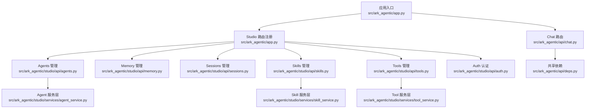
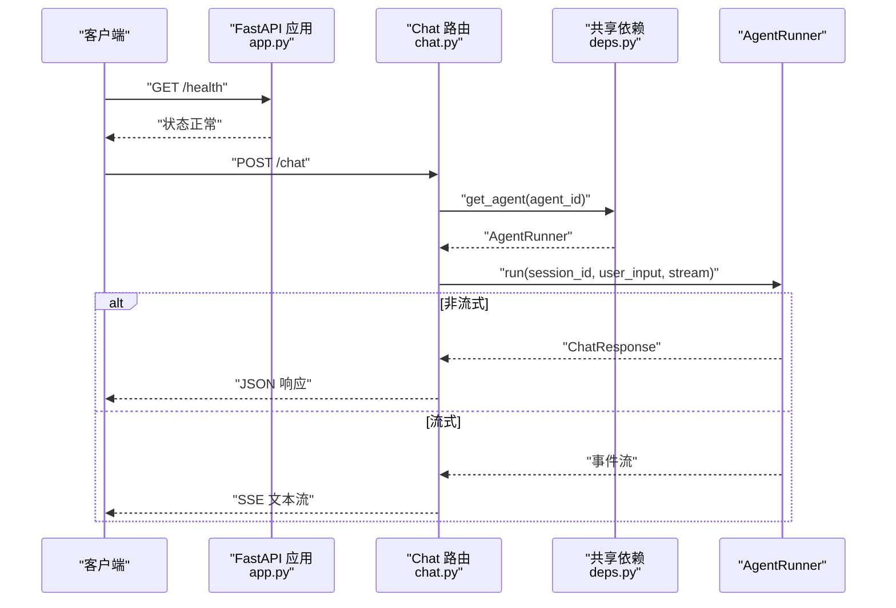
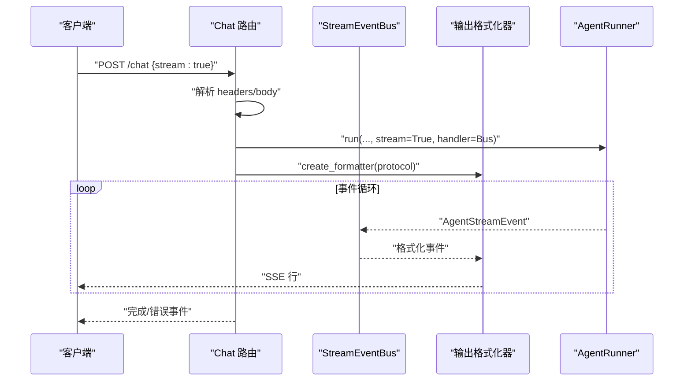
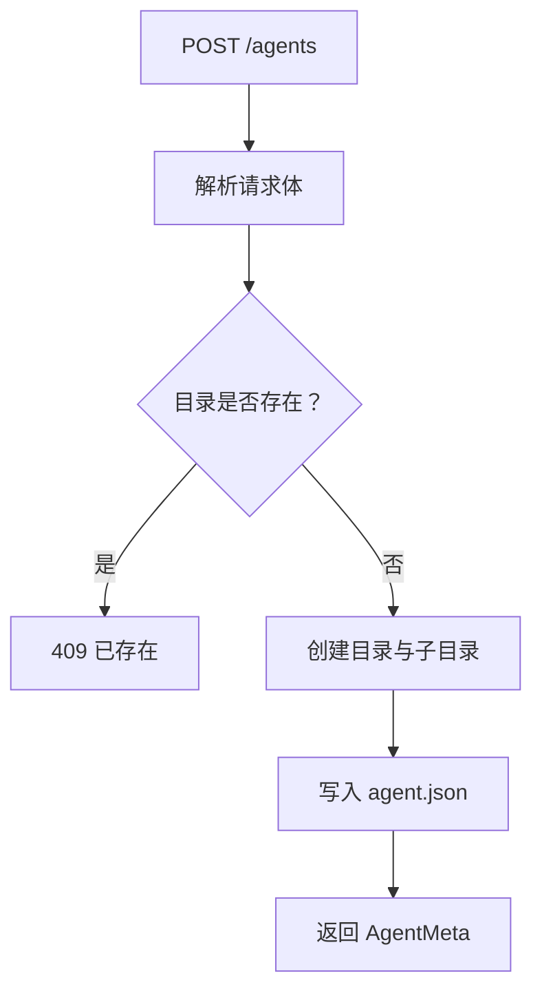
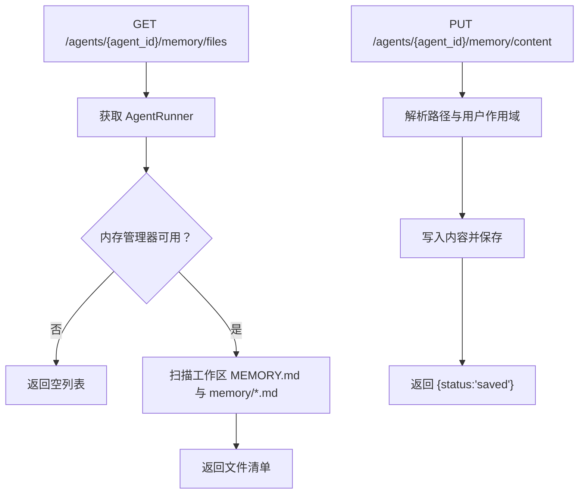
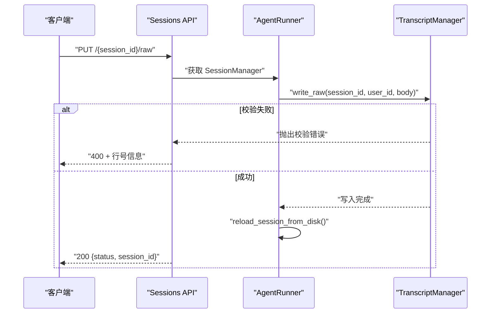
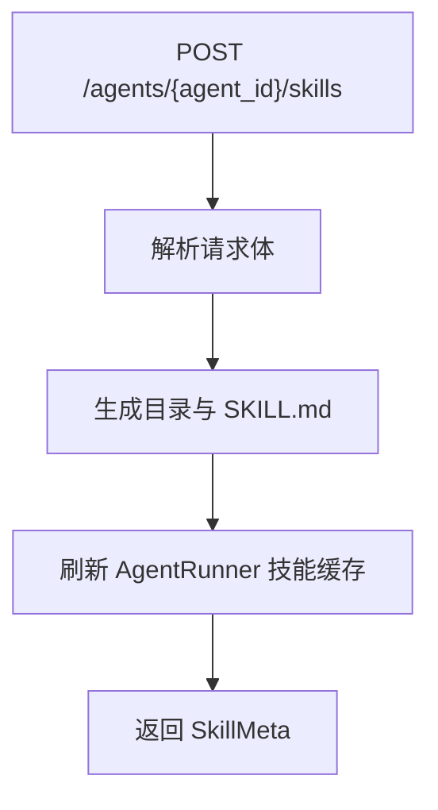
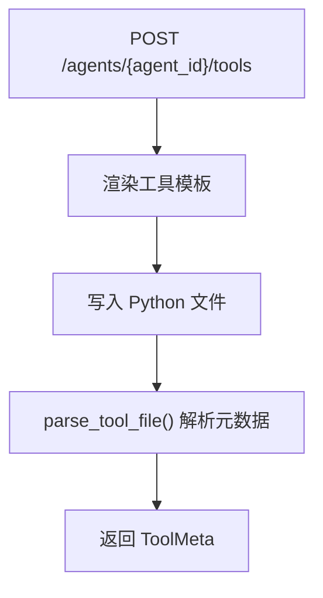
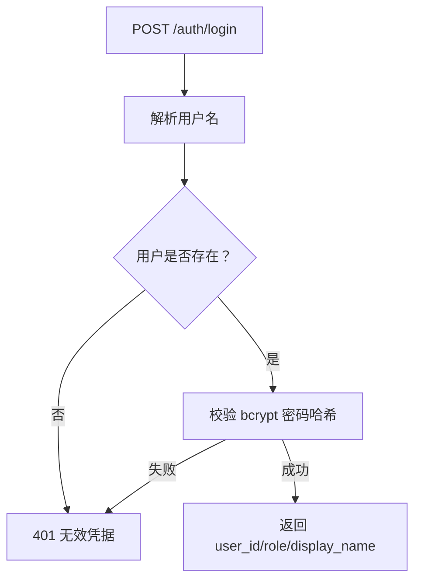
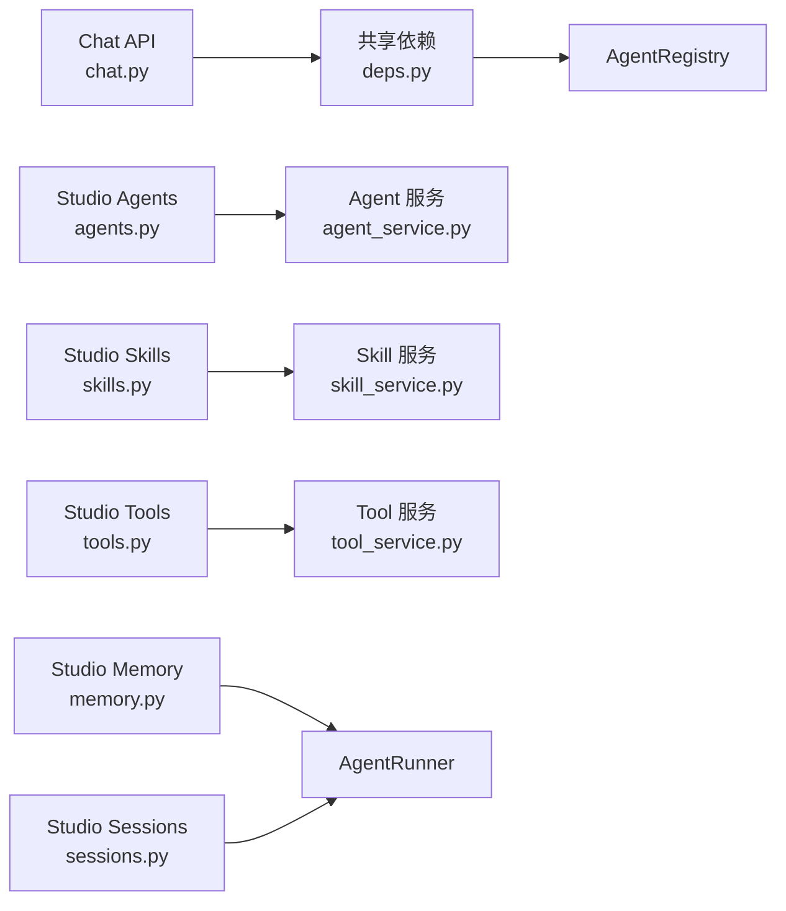

# API 接口文档

<cite>
**本文档引用的文件**
- [src/ark_agentic/app.py](file://src/ark_agentic/app.py)
- [src/ark_agentic/api/chat.py](file://src/ark_agentic/api/chat.py)
- [src/ark_agentic/api/models.py](file://src/ark_agentic/api/models.py)
- [src/ark_agentic/api/deps.py](file://src/ark_agentic/api/deps.py)
- [src/ark_agentic/studio/api/agents.py](file://src/ark_agentic/studio/api/agents.py)
- [src/ark_agentic/studio/api/memory.py](file://src/ark_agentic/studio/api/memory.py)
- [src/ark_agentic/studio/api/sessions.py](file://src/ark_agentic/studio/api/sessions.py)
- [src/ark_agentic/studio/api/skills.py](file://src/ark_agentic/studio/api/skills.py)
- [src/ark_agentic/studio/api/tools.py](file://src/ark_agentic/studio/api/tools.py)
- [src/ark_agentic/studio/api/auth.py](file://src/ark_agentic/studio/api/auth.py)
- [src/ark_agentic/studio/services/agent_service.py](file://src/ark_agentic/studio/services/agent_service.py)
- [src/ark_agentic/studio/services/skill_service.py](file://src/ark_agentic/studio/services/skill_service.py)
- [src/ark_agentic/studio/services/tool_service.py](file://src/ark_agentic/studio/services/tool_service.py)
- [postman/ark-agentic-api.postman_collection.json](file://postman/ark-agentic-api.postman_collection.json)
- [README.md](file://README.md)
</cite>

## 目录
1. [简介](#简介)
2. [项目结构](#项目结构)
3. [核心组件](#核心组件)
4. [架构总览](#架构总览)
5. [详细组件分析](#详细组件分析)
6. [依赖分析](#依赖分析)
7. [性能考量](#性能考量)
8. [故障排查指南](#故障排查指南)
9. [结论](#结论)
10. [附录](#附录)

## 简介
Ark-Agentic API 提供统一的 Agent 服务接口，支持：
- Chat API：支持流式与非流式响应，多协议 SSE 输出（internal/agui/enterprise/alone）
- Studio API：智能体管理、技能与工具管理、会话与内存管理
- 认证：Studio 登录认证（本地用户表，bcrypt 密码哈希）

本文件涵盖 HTTP 方法、URL 模式、请求/响应模式、认证方法、流式响应机制、错误处理策略、安全考虑、速率限制与版本信息，并提供常见用例、客户端实现指南与性能优化建议。

## 项目结构
应用采用 FastAPI 统一入口，按功能模块组织：
- API 路由：chat、deps、models
- Studio 管理：agents、memory、sessions、skills、tools、auth
- 核心能力：会话管理、记忆系统、流式协议、工具与技能系统

**图表来源**
- [src/ark_agentic/app.py:137-164](file://src/ark_agentic/app.py#L137-L164)
- [src/ark_agentic/api/chat.py:24-24](file://src/ark_agentic/api/chat.py#L24-L24)
- [src/ark_agentic/studio/api/agents.py:22-22](file://src/ark_agentic/studio/api/agents.py#L22-L22)
- [src/ark_agentic/studio/api/memory.py:21-21](file://src/ark_agentic/studio/api/memory.py#L21-L21)
- [src/ark_agentic/studio/api/sessions.py:22-22](file://src/ark_agentic/studio/api/sessions.py#L22-L22)
- [src/ark_agentic/studio/api/skills.py:21-21](file://src/ark_agentic/studio/api/skills.py#L21-L21)
- [src/ark_agentic/studio/api/tools.py:21-21](file://src/ark_agentic/studio/api/tools.py#L21-L21)
- [src/ark_agentic/studio/api/auth.py:26-26](file://src/ark_agentic/studio/api/auth.py#L26-L26)
- [src/ark_agentic/api/deps.py:15-37](file://src/ark_agentic/api/deps.py#L15-L37)
- [src/ark_agentic/studio/services/agent_service.py:58-198](file://src/ark_agentic/studio/services/agent_service.py#L58-L198)
- [src/ark_agentic/studio/services/skill_service.py:40-289](file://src/ark_agentic/studio/services/skill_service.py#L40-L289)
- [src/ark_agentic/studio/services/tool_service.py:38-235](file://src/ark_agentic/studio/services/tool_service.py#L38-L235)

**章节来源**
- [src/ark_agentic/app.py:137-216](file://src/ark_agentic/app.py#L137-L216)

## 核心组件
- Chat API：统一的对话接口，支持 SSE 流式输出与多种协议
- Studio API：面向管理端的智能体、技能、工具、会话与内存管理
- 认证：Studio 登录认证，基于 bcrypt 的密码哈希
- 共享依赖：AgentRegistry 注入与获取，供 Chat 与 Studio 共享

**章节来源**
- [src/ark_agentic/api/chat.py:27-177](file://src/ark_agentic/api/chat.py#L27-L177)
- [src/ark_agentic/api/models.py:27-104](file://src/ark_agentic/api/models.py#L27-L104)
- [src/ark_agentic/api/deps.py:19-37](file://src/ark_agentic/api/deps.py#L19-L37)
- [src/ark_agentic/studio/api/agents.py:76-131](file://src/ark_agentic/studio/api/agents.py#L76-L131)
- [src/ark_agentic/studio/api/memory.py:105-160](file://src/ark_agentic/studio/api/memory.py#L105-L160)
- [src/ark_agentic/studio/api/sessions.py:84-200](file://src/ark_agentic/studio/api/sessions.py#L84-L200)
- [src/ark_agentic/studio/api/skills.py:57-113](file://src/ark_agentic/studio/api/skills.py#L57-L113)
- [src/ark_agentic/studio/api/tools.py:41-66](file://src/ark_agentic/studio/api/tools.py#L41-L66)
- [src/ark_agentic/studio/api/auth.py:94-115](file://src/ark_agentic/studio/api/auth.py#L94-L115)

## 架构总览
统一入口负责：
- 初始化日志、追踪与可观测性
- 注册 Agent 与 warmup
- 挂载 Chat 路由与 Studio 路由
- 提供健康检查与静态页面

**图表来源**
- [src/ark_agentic/app.py:213-216](file://src/ark_agentic/app.py#L213-L216)
- [src/ark_agentic/api/chat.py:27-177](file://src/ark_agentic/api/chat.py#L27-L177)
- [src/ark_agentic/api/deps.py:25-37](file://src/ark_agentic/api/deps.py#L25-L37)

## 详细组件分析

### Chat API
- HTTP 方法与 URL
  - POST /chat
- 请求头
  - x-ark-session-id：会话 ID
  - x-ark-user-id：用户 ID
  - x-ark-message-id：消息 ID
  - x-ark-trace-id：追踪 ID
- 请求体字段
  - agent_id：智能体标识（默认 insurance）
  - message：用户消息
  - session_id：会话 ID（为空则自动创建）
  - stream：是否启用 SSE 流式输出
  - protocol：流式协议（internal/agui/enterprise/alone）
  - source_bu_type/app_type：企业模式附加字段
  - user_id/message_id/context/idempotency_key：上下文与幂等控制
  - history/use_history：外部历史与合并策略
  - run_options：运行选项（模型、温度等）
- 响应
  - 非流式：ChatResponse（session_id、message_id、response、tool_calls、turns、usage）
  - 流式：SSE 文本流，事件类型遵循所选协议
- 会话与幂等
  - 若未提供 user_id，优先从请求体获取，否则从头获取
  - 若未提供 session_id，自动创建或加载
  - idempotency_key 用于防重
- 错误处理
  - 缺少 user_id：400
  - Agent 不存在：404
  - Agent 运行异常：emit failed 事件

**图表来源**
- [src/ark_agentic/api/chat.py:27-177](file://src/ark_agentic/api/chat.py#L27-L177)
- [src/ark_agentic/api/models.py:61-104](file://src/ark_agentic/api/models.py#L61-L104)

**章节来源**
- [src/ark_agentic/api/chat.py:27-177](file://src/ark_agentic/api/chat.py#L27-L177)
- [src/ark_agentic/api/models.py:27-104](file://src/ark_agentic/api/models.py#L27-L104)
- [postman/ark-agentic-api.postman_collection.json:38-240](file://postman/ark-agentic-api.postman_collection.json#L38-L240)

### Studio API

#### 智能体管理（Agents）
- GET /agents：扫描 agents 目录，返回 Agent 列表
- GET /agents/{agent_id}：获取单个 Agent 元数据
- POST /agents：创建新 Agent（目录 + agent.json）

**图表来源**
- [src/ark_agentic/studio/api/agents.py:106-131](file://src/ark_agentic/studio/api/agents.py#L106-L131)

**章节来源**
- [src/ark_agentic/studio/api/agents.py:76-131](file://src/ark_agentic/studio/api/agents.py#L76-L131)
- [src/ark_agentic/studio/services/agent_service.py:60-138](file://src/ark_agentic/studio/services/agent_service.py#L60-L138)

#### 内存管理（Memory）
- GET /agents/{agent_id}/memory/files：列出可发现的记忆文件（按用户分组）
- GET /agents/{agent_id}/memory/content：读取内存文件内容（纯文本）
- PUT /agents/{agent_id}/memory/content：写入内存文件内容

**图表来源**
- [src/ark_agentic/studio/api/memory.py:105-160](file://src/ark_agentic/studio/api/memory.py#L105-L160)

**章节来源**
- [src/ark_agentic/studio/api/memory.py:105-160](file://src/ark_agentic/studio/api/memory.py#L105-L160)

#### 会话管理（Sessions）
- GET /agents/{agent_id}/sessions：列出会话（可按 user_id 过滤）
- GET /agents/{agent_id}/sessions/{session_id}：获取会话详情与消息历史
- GET /agents/{agent_id}/sessions/{session_id}/raw：读取原始 JSONL
- PUT /agents/{agent_id}/sessions/{session_id}/raw：校验并写回 JSONL，写回后重载内存

**图表来源**
- [src/ark_agentic/studio/api/sessions.py:169-200](file://src/ark_agentic/studio/api/sessions.py#L169-L200)

**章节来源**
- [src/ark_agentic/studio/api/sessions.py:84-200](file://src/ark_agentic/studio/api/sessions.py#L84-L200)

#### 技能管理（Skills）
- GET /agents/{agent_id}/skills：列出技能（解析 SKILL.md）
- POST /agents/{agent_id}/skills：创建技能（目录 + SKILL.md）
- PUT /agents/{agent_id}/skills/{skill_id}：更新技能
- DELETE /agents/{agent_id}/skills/{skill_id}：删除技能

**图表来源**
- [src/ark_agentic/studio/api/skills.py:68-84](file://src/ark_agentic/studio/api/skills.py#L68-L84)

**章节来源**
- [src/ark_agentic/studio/api/skills.py:57-113](file://src/ark_agentic/studio/api/skills.py#L57-L113)
- [src/ark_agentic/studio/services/skill_service.py:60-154](file://src/ark_agentic/studio/services/skill_service.py#L60-L154)

#### 工具管理（Tools）
- GET /agents/{agent_id}/tools：列出工具（AST 解析）
- POST /agents/{agent_id}/tools：生成工具脚手架（Python 文件）

**图表来源**
- [src/ark_agentic/studio/api/tools.py:52-66](file://src/ark_agentic/studio/api/tools.py#L52-L66)

**章节来源**
- [src/ark_agentic/studio/api/tools.py:41-66](file://src/ark_agentic/studio/api/tools.py#L41-L66)
- [src/ark_agentic/studio/services/tool_service.py:59-99](file://src/ark_agentic/studio/services/tool_service.py#L59-L99)

#### 认证（Auth）
- POST /auth/login：用户名/密码登录，返回用户信息（不含会话）
- 用户凭据存储于环境变量 STUDIO_USERS（JSON 对象），密码使用 bcrypt 哈希

**图表来源**
- [src/ark_agentic/studio/api/auth.py:94-115](file://src/ark_agentic/studio/api/auth.py#L94-L115)

**章节来源**
- [src/ark_agentic/studio/api/auth.py:94-115](file://src/ark_agentic/studio/api/auth.py#L94-L115)

## 依赖分析
- Chat API 依赖共享依赖模块获取 AgentRunner
- Studio 各模块依赖服务层进行业务逻辑处理
- 服务层不依赖 FastAPI，便于复用与测试

**图表来源**
- [src/ark_agentic/api/deps.py:19-37](file://src/ark_agentic/api/deps.py#L19-L37)
- [src/ark_agentic/studio/api/agents.py:18-18](file://src/ark_agentic/studio/api/agents.py#L18-L18)
- [src/ark_agentic/studio/services/agent_service.py:58-198](file://src/ark_agentic/studio/services/agent_service.py#L58-L198)
- [src/ark_agentic/studio/api/skills.py:16-17](file://src/ark_agentic/studio/api/skills.py#L16-L17)
- [src/ark_agentic/studio/services/skill_service.py:1-289](file://src/ark_agentic/studio/services/skill_service.py#L1-L289)
- [src/ark_agentic/studio/api/tools.py:15-17](file://src/ark_agentic/studio/api/tools.py#L15-L17)
- [src/ark_agentic/studio/services/tool_service.py:1-235](file://src/ark_agentic/studio/services/tool_service.py#L1-L235)

**章节来源**
- [src/ark_agentic/api/deps.py:19-37](file://src/ark_agentic/api/deps.py#L19-L37)
- [src/ark_agentic/studio/api/agents.py:18-18](file://src/ark_agentic/studio/api/agents.py#L18-L18)
- [src/ark_agentic/studio/services/agent_service.py:58-198](file://src/ark_agentic/studio/services/agent_service.py#L58-L198)
- [src/ark_agentic/studio/api/skills.py:16-17](file://src/ark_agentic/studio/api/skills.py#L16-L17)
- [src/ark_agentic/studio/services/skill_service.py:1-289](file://src/ark_agentic/studio/services/skill_service.py#L1-L289)
- [src/ark_agentic/studio/api/tools.py:15-17](file://src/ark_agentic/studio/api/tools.py#L15-L17)
- [src/ark_agentic/studio/services/tool_service.py:1-235](file://src/ark_agentic/studio/services/tool_service.py#L1-L235)

## 性能考量
- 并行工具调用：当 LLM 返回多个工具调用时，使用并行执行以减少总延迟
- AG-UI 流式协议：事件驱动架构，支持细粒度流式推送（20 种事件类型）
- 多协议适配：单一内部实现，输出层适配四种协议格式
- 零数据库记忆：纯文件 MEMORY.md，启动即用，避免数据库连接开销
- 会话压缩：自动总结历史消息，保持上下文窗口稳定
- 输出验证：自动检测数值幻觉，提升输出可靠性

**章节来源**
- [README.md:787-795](file://README.md#L787-L795)

## 故障排查指南
- Chat API
  - 缺少 user_id：检查请求体或请求头 x-ark-user-id
  - Agent 不存在：确认 agent_id 是否正确
  - 流式输出异常：检查协议与 Accept 头
- Studio API
  - 内存路径越界：确保 file_path 相对工作区且无路径穿越
  - 会话 JSONL 校验失败：检查 JSONL 格式与行号
  - 技能/工具操作失败：确认 Agent 目录存在与权限
- 认证
  - 401 无效凭据：确认用户名存在且密码哈希匹配

**章节来源**
- [src/ark_agentic/api/chat.py:40-44](file://src/ark_agentic/api/chat.py#L40-L44)
- [src/ark_agentic/studio/api/memory.py:83-88](file://src/ark_agentic/studio/api/memory.py#L83-L88)
- [src/ark_agentic/studio/api/sessions.py:190-197](file://src/ark_agentic/studio/api/sessions.py#L190-L197)
- [src/ark_agentic/studio/api/auth.py:94-109](file://src/ark_agentic/studio/api/auth.py#L94-L109)

## 结论
Ark-Agentic API 提供了统一、可扩展的 Agent 服务接口，具备完善的流式输出、多协议适配、会话与记忆管理能力。Studio API 为智能体的日常维护提供了友好的管理界面。通过合理的错误处理、安全设计与性能优化，能够满足生产环境的需求。

## 附录

### HTTP 方法与 URL 模式
- Chat
  - POST /chat
- Studio
  - Agents：GET /agents, GET /agents/{agent_id}, POST /agents
  - Memory：GET /agents/{agent_id}/memory/files, GET /agents/{agent_id}/memory/content, PUT /agents/{agent_id}/memory/content
  - Sessions：GET /agents/{agent_id}/sessions, GET /agents/{agent_id}/sessions/{session_id}, GET /agents/{agent_id}/sessions/{session_id}/raw, PUT /agents/{agent_id}/sessions/{session_id}/raw
  - Skills：GET /agents/{agent_id}/skills, POST /agents/{agent_id}/skills, PUT /agents/{agent_id}/skills/{skill_id}, DELETE /agents/{agent_id}/skills/{skill_id}
  - Tools：GET /agents/{agent_id}/tools, POST /agents/{agent_id}/tools
  - Auth：POST /auth/login

**章节来源**
- [src/ark_agentic/api/chat.py:27-27](file://src/ark_agentic/api/chat.py#L27-L27)
- [src/ark_agentic/studio/api/agents.py:76-131](file://src/ark_agentic/studio/api/agents.py#L76-L131)
- [src/ark_agentic/studio/api/memory.py:105-160](file://src/ark_agentic/studio/api/memory.py#L105-L160)
- [src/ark_agentic/studio/api/sessions.py:84-200](file://src/ark_agentic/studio/api/sessions.py#L84-L200)
- [src/ark_agentic/studio/api/skills.py:57-113](file://src/ark_agentic/studio/api/skills.py#L57-L113)
- [src/ark_agentic/studio/api/tools.py:41-66](file://src/ark_agentic/studio/api/tools.py#L41-L66)
- [src/ark_agentic/studio/api/auth.py:94-115](file://src/ark_agentic/studio/api/auth.py#L94-L115)

### 请求/响应模式与数据模型
- ChatRequest/ChatResponse：见 [src/ark_agentic/api/models.py:27-104](file://src/ark_agentic/api/models.py#L27-L104)
- Studio 数据模型：AgentMeta、SkillMeta、ToolMeta、SessionItem、MessageItem 等
- SSE 事件模型：见 [src/ark_agentic/api/models.py:73-102](file://src/ark_agentic/api/models.py#L73-L102)

**章节来源**
- [src/ark_agentic/api/models.py:27-104](file://src/ark_agentic/api/models.py#L27-L104)

### 认证方法
- Chat API：无强制认证，可通过请求头传递用户与会话上下文
- Studio API：/auth/login 登录，返回用户信息（角色、显示名等）

**章节来源**
- [src/ark_agentic/studio/api/auth.py:94-115](file://src/ark_agentic/studio/api/auth.py#L94-L115)

### 流式响应机制
- 协议类型：internal、agui、enterprise、alone
- 事件类型：run_started/run_finished/run_error、step_started/step_finished、text_message_*、tool_call_*、state_*、messages_*、thinking_message_*、custom/raw 等
- SSE 事件格式：见 [README.md:111-146](file://README.md#L111-L146)

**章节来源**
- [src/ark_agentic/api/chat.py:115-177](file://src/ark_agentic/api/chat.py#L115-L177)
- [README.md:111-146](file://README.md#L111-L146)

### 安全考虑
- 路径遍历防护：内存文件写入前进行路径校验
- 会话 JSONL 写回：严格校验格式，失败返回行号
- 认证：bcrypt 密码哈希，支持环境变量配置用户表

**章节来源**
- [src/ark_agentic/studio/api/memory.py:83-88](file://src/ark_agentic/studio/api/memory.py#L83-L88)
- [src/ark_agentic/studio/api/sessions.py:190-197](file://src/ark_agentic/studio/api/sessions.py#L190-L197)
- [src/ark_agentic/studio/api/auth.py:68-81](file://src/ark_agentic/studio/api/auth.py#L68-L81)

### 速率限制与版本
- 速率限制：未内置速率限制策略，建议在网关或反向代理层实施
- 版本：应用版本号在统一入口定义，当前为 0.1.0

**章节来源**
- [src/ark_agentic/app.py:137-142](file://src/ark_agentic/app.py#L137-L142)

### 常见用例与客户端实现指南
- Chat 非流式：设置 stream=false，接收 ChatResponse
- Chat 流式：设置 stream=true 与协议（protocol），使用 SSE 客户端订阅
- 会话续用：通过 x-ark-session-id 或 session_id 继续对话
- 幂等请求：使用 idempotency_key 防止重复提交
- Studio 管理：先 /auth/login 获取用户信息，再调用相应管理接口

**章节来源**
- [postman/ark-agentic-api.postman_collection.json:38-240](file://postman/ark-agentic-api.postman_collection.json#L38-L240)
- [README.md:91-154](file://README.md#L91-L154)

### 性能优化技巧
- 合理使用 run_options 调整模型与温度
- 利用 use_history 与 history 合并外部上下文，减少重复输入
- 并行工具调用：确保工具执行幂等，避免副作用
- 会话压缩：合理配置上下文窗口与摘要策略
- 输出验证：在 before_loop_end 钩子中进行引用校验，减少无效重试

**章节来源**
- [README.md:787-795](file://README.md#L787-L795)