# API 接口文档

<cite>
**本文档引用的文件**
- [src/ark_agentic/app.py](file://src/ark_agentic/app.py)
- [src/ark_agentic/plugins/api/plugin.py](file://src/ark_agentic/plugins/api/plugin.py)
- [src/ark_agentic/plugins/api/chat.py](file://src/ark_agentic/plugins/api/chat.py)
- [src/ark_agentic/plugins/api/models.py](file://src/ark_agentic/plugins/api/models.py)
- [src/ark_agentic/plugins/api/deps.py](file://src/ark_agentic/plugins/api/deps.py)
- [src/ark_agentic/plugins/studio/plugin.py](file://src/ark_agentic/plugins/studio/plugin.py)
- [src/ark_agentic/plugins/studio/setup_studio.py](file://src/ark_agentic/plugins/studio/setup_studio.py)
- [src/ark_agentic/plugins/studio/api/agents.py](file://src/ark_agentic/plugins/studio/api/agents.py)
- [src/ark_agentic/plugins/studio/api/memory.py](file://src/ark_agentic/plugins/studio/api/memory.py)
- [src/ark_agentic/plugins/studio/api/sessions.py](file://src/ark_agentic/plugins/studio/api/sessions.py)
- [src/ark_agentic/plugins/studio/api/skills.py](file://src/ark_agentic/plugins/studio/api/skills.py)
- [src/ark_agentic/plugins/studio/api/tools.py](file://src/ark_agentic/plugins/studio/api/tools.py)
- [src/ark_agentic/plugins/studio/api/auth.py](file://src/ark_agentic/plugins/studio/api/auth.py)
- [src/ark_agentic/plugins/studio/services/agent_service.py](file://src/ark_agentic/plugins/studio/services/agent_service.py)
- [src/ark_agentic/plugins/studio/services/skill_service.py](file://src/ark_agentic/plugins/studio/services/skill_service.py)
- [src/ark_agentic/plugins/studio/services/tool_service.py](file://src/ark_agentic/plugins/studio/services/tool_service.py)
- [src/ark_agentic/core/protocol/plugin.py](file://src/ark_agentic/core/protocol/plugin.py)
- [src/ark_agentic/core/protocol/bootstrap.py](file://src/ark_agentic/core/protocol/bootstrap.py)
- [src/ark_agentic/core/protocol/app_context.py](file://src/ark_agentic/core/protocol/app_context.py)
- [src/ark_agentic/core/protocol/lifecycle.py](file://src/ark_agentic/core/protocol/lifecycle.py)
- [src/ark_agentic/core/utils/env.py](file://src/ark_agentic/core/utils/env.py)
- [src/ark_agentic/static/home.html](file://src/ark_agentic/static/home.html)
- [src/ark_agentic/core/types.py](file://src/ark_agentic/core/types.py)
- [src/ark_agentic/core/persistence.py](file://src/ark_agentic/core/persistence.py)
- [src/ark_agentic/plugins/studio/frontend/src/pages/AgentWorkspacePage.tsx](file://src/ark_agentic/plugins/studio/frontend/src/pages/AgentWorkspacePage.tsx)
- [tests/unit/core/test_format_tool_result_for_history.py](file://tests/unit/core/test_format_tool_result_for_history.py)
- [postman/ark-agentic-api.postman_collection.json](file://postman/ark-agentic-api.postman_collection.json)
- [README.md](file://README.md)
</cite>

## 更新摘要
**变更内容**
- API 接口重构：API 服务从 services/ 移动到 plugins/，采用新的插件架构支持
- 新增插件系统：引入 APIPlugin、StudioPlugin、JobsPlugin、NotificationsPlugin 四大核心插件
- 生命周期管理：采用 Bootstrap + Plugin 协议的统一生命周期管理
- 环境变量控制：通过 ENABLE_API、ENABLE_STUDIO、ENABLE_JOB_MANAGER、ENABLE_NOTIFICATIONS 控制插件启停
- 路由注册：插件各自管理自己的路由，支持条件性启用

## 目录
1. [简介](#简介)
2. [项目结构](#项目结构)
3. [核心组件](#核心组件)
4. [架构总览](#架构总览)
5. [详细组件分析](#详细组件分析)
6. [插件系统](#插件系统)
7. [维基系统](#维基系统)
8. [依赖分析](#依赖分析)
9. [性能考量](#性能考量)
10. [故障排查指南](#故障排查指南)
11. [结论](#结论)
12. [附录](#附录)

## 简介
Ark-Agentic API 提供统一的 Agent 服务接口，采用全新的插件架构设计，支持：
- Chat API：支持流式与非流式响应，多协议 SSE 输出（internal/agui/enterprise/alone）
- Studio API：智能体管理、技能与工具管理、会话与内存管理
- 插件架构：基于 Bootstrap + Plugin 协议的可插拔架构
- 认证：Studio 登录认证（本地用户表，bcrypt 密码哈希）
- 维基系统：完整的中英文文档系统，支持动态加载和渲染
- 工具结果元数据：增强的工具结果序列化支持，包含 result_type 和 llm_digest 字段

本文件涵盖 HTTP 方法、URL 模式、请求/响应模式、认证方法、流式响应机制、错误处理策略、安全考虑、速率限制与版本信息，并提供常见用例、客户端实现指南与性能优化建议。

## 项目结构
应用采用插件架构统一入口，按功能模块组织：
- 插件系统：APIPlugin、StudioPlugin、JobsPlugin、NotificationsPlugin
- API 路由：chat、deps、models（位于 plugins/api/）
- Studio 管理：agents、memory、sessions、skills、tools、auth（位于 plugins/studio/）
- 维基系统：wiki tree、wiki page、readme content
- 核心能力：会话管理、记忆系统、流式协议、工具与技能系统
- 工具结果元数据：增强的工具结果序列化与反序列化支持

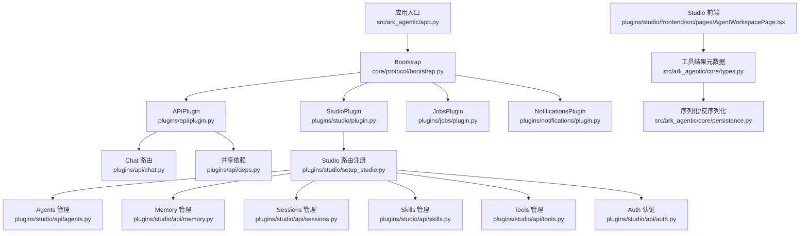

**图表来源**
- [src/ark_agentic/app.py:50-56](file://src/ark_agentic/app.py#L50-L56)
- [src/ark_agentic/plugins/api/plugin.py:27-87](file://src/ark_agentic/plugins/api/plugin.py#L27-L87)
- [src/ark_agentic/plugins/studio/plugin.py:16-32](file://src/ark_agentic/plugins/studio/plugin.py#L16-L32)
- [src/ark_agentic/plugins/jobs/plugin.py:34-99](file://src/ark_agentic/plugins/jobs/plugin.py#L34-L99)
- [src/ark_agentic/plugins/notifications/plugin.py:12-41](file://src/ark_agentic/plugins/notifications/plugin.py#L12-L41)
- [src/ark_agentic/plugins/api/chat.py:24-24](file://src/ark_agentic/plugins/api/chat.py#L24-L24)
- [src/ark_agentic/plugins/studio/api/agents.py:22-22](file://src/ark_agentic/plugins/studio/api/agents.py#L22-L22)
- [src/ark_agentic/plugins/studio/api/memory.py:21-21](file://src/ark_agentic/plugins/studio/api/memory.py#L21-L21)
- [src/ark_agentic/plugins/studio/api/sessions.py:22-22](file://src/ark_agentic/plugins/studio/api/sessions.py#L22-L22)
- [src/ark_agentic/plugins/studio/api/skills.py:21-21](file://src/ark_agentic/plugins/studio/api/skills.py#L21-L21)
- [src/ark_agentic/plugins/studio/api/tools.py:21-21](file://src/ark_agentic/plugins/studio/api/tools.py#L21-L21)
- [src/ark_agentic/plugins/studio/api/auth.py:26-26](file://src/ark_agentic/plugins/studio/api/auth.py#L26-L26)
- [src/ark_agentic/plugins/api/deps.py:15-37](file://src/ark_agentic/plugins/api/deps.py#L15-L37)
- [src/ark_agentic/plugins/studio/services/agent_service.py:58-198](file://src/ark_agentic/plugins/studio/services/agent_service.py#L58-L198)
- [src/ark_agentic/plugins/studio/services/skill_service.py:40-289](file://src/ark_agentic/plugins/studio/services/skill_service.py#L40-L289)
- [src/ark_agentic/plugins/studio/services/tool_service.py:38-235](file://src/ark_agentic/plugins/studio/services/tool_service.py#L38-L235)
- [src/ark_agentic/core/types.py:86-101](file://src/ark_agentic/core/types.py#L86-L101)
- [src/ark_agentic/core/persistence.py:140-186](file://src/ark_agentic/core/persistence.py#L140-L186)
- [src/ark_agentic/plugins/studio/frontend/src/pages/AgentWorkspacePage.tsx:181-182](file://src/ark_agentic/plugins/studio/frontend/src/pages/AgentWorkspacePage.tsx#L181-L182)

**章节来源**
- [src/ark_agentic/app.py:50-56](file://src/ark_agentic/app.py#L50-L56)

## 核心组件
- Chat API：统一的对话接口，支持 SSE 流式输出与多种协议
- Studio API：面向管理端的智能体、技能、工具、会话与内存管理
- 插件系统：基于 Bootstrap + Plugin 协议的可插拔架构，支持条件性启用
- 维基系统：动态文档加载与渲染，支持中英文双语
- 认证：Studio 登录认证，基于 bcrypt 的密码哈希
- 共享依赖：AgentRegistry 注入与获取，供 Chat 与 Studio 共享
- 工具结果元数据：增强的工具结果序列化支持，包含 result_type 和 llm_digest 字段

**章节来源**
- [src/ark_agentic/plugins/api/chat.py:27-177](file://src/ark_agentic/plugins/api/chat.py#L27-L177)
- [src/ark_agentic/plugins/api/models.py:27-104](file://src/ark_agentic/plugins/api/models.py#L27-L104)
- [src/ark_agentic/plugins/api/deps.py:19-37](file://src/ark_agentic/plugins/api/deps.py#L19-L37)
- [src/ark_agentic/plugins/studio/api/agents.py:76-131](file://src/ark_agentic/plugins/studio/api/agents.py#L76-L131)
- [src/ark_agentic/plugins/studio/api/memory.py:105-160](file://src/ark_agentic/plugins/studio/api/memory.py#L105-L160)
- [src/ark_agentic/plugins/studio/api/sessions.py:84-200](file://src/ark_agentic/plugins/studio/api/sessions.py#L84-L200)
- [src/ark_agentic/plugins/studio/api/skills.py:57-113](file://src/ark_agentic/plugins/studio/api/skills.py#L57-L113)
- [src/ark_agentic/plugins/studio/api/tools.py:41-66](file://src/ark_agentic/plugins/studio/api/tools.py#L41-L66)
- [src/ark_agentic/plugins/studio/api/auth.py:94-115](file://src/ark_agentic/plugins/studio/api/auth.py#L94-L115)
- [src/ark_agentic/core/types.py:86-101](file://src/ark_agentic/core/types.py#L86-L101)
- [src/ark_agentic/core/persistence.py:140-186](file://src/ark_agentic/core/persistence.py#L140-L186)

## 架构总览
统一入口负责：
- 初始化日志、追踪与可观测性
- 注册四大插件：APIPlugin、StudioPlugin、JobsPlugin、NotificationsPlugin
- 通过 Bootstrap 驱动插件生命周期（init → start → stop）
- 提供健康检查与静态页面
- 挂载维基系统 API
- 支持工具结果元数据的序列化与反序列化

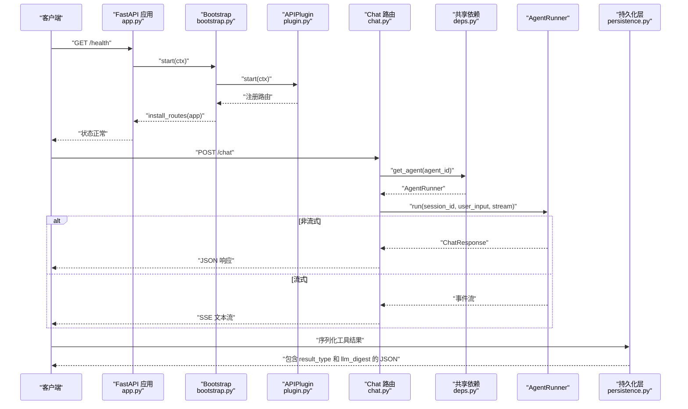

**图表来源**
- [src/ark_agentic/app.py:60-69](file://src/ark_agentic/app.py#L60-L69)
- [src/ark_agentic/plugins/api/plugin.py:35-87](file://src/ark_agentic/plugins/api/plugin.py#L35-L87)
- [src/ark_agentic/plugins/api/chat.py:27-177](file://src/ark_agentic/plugins/api/chat.py#L27-L177)
- [src/ark_agentic/plugins/api/deps.py:25-37](file://src/ark_agentic/plugins/api/deps.py#L25-L37)
- [src/ark_agentic/core/persistence.py:140-186](file://src/ark_agentic/core/persistence.py#L140-L186)

## 详细组件分析

### Chat API
- HTTP 方法与 URL
  - POST /chat
- 请求头
  - x-ark-session-id：会话 ID
  - x-ark-user-id：用户 ID
  - x-ark-message-id：消息 ID
  - x-ark-trace-id：追踪 ID
- 请求体字段
  - agent_id：智能体标识（默认 insurance）
  - message：用户消息
  - session_id：会话 ID（为空则自动创建）
  - stream：是否启用 SSE 流式输出
  - protocol：流式协议（internal/agui/enterprise/alone）
  - source_bu_type/app_type：企业模式附加字段
  - user_id/message_id/context/idempotency_key：上下文与幂等控制
  - history/use_history：外部历史与合并策略
  - run_options：运行选项（模型、温度等）
- 响应
  - 非流式：ChatResponse（session_id、message_id、response、tool_calls、turns、usage）
  - 流式：SSE 文本流，事件类型遵循所选协议
- 会话与幂等
  - 若未提供 user_id，优先从请求体获取，否则从头获取
  - 若未提供 session_id，自动创建或加载
  - idempotency_key 用于防重
- 错误处理
  - 缺少 user_id：400
  - Agent 不存在：404
  - Agent 运行异常：emit failed 事件

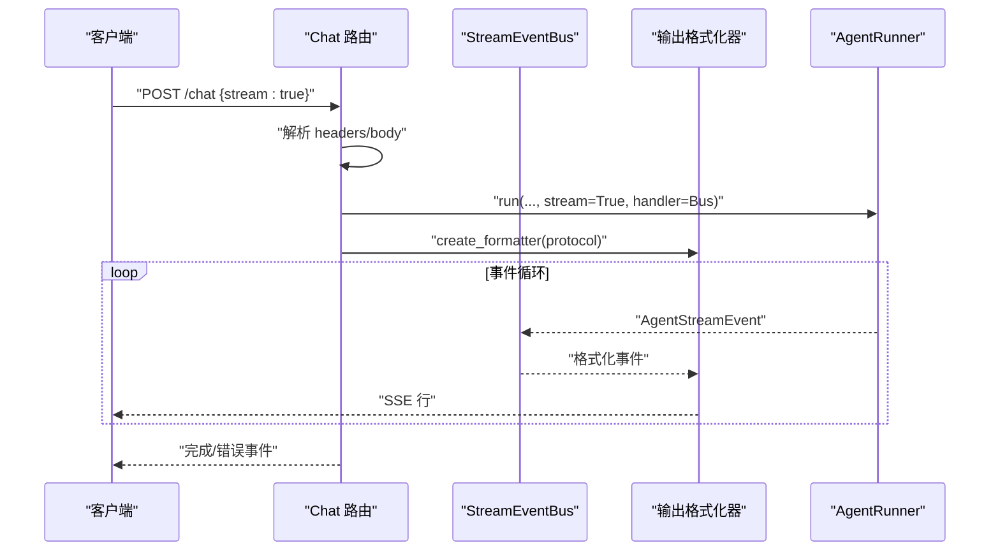

**图表来源**
- [src/ark_agentic/plugins/api/chat.py:27-177](file://src/ark_agentic/plugins/api/chat.py#L27-L177)
- [src/ark_agentic/plugins/api/models.py:61-104](file://src/ark_agentic/plugins/api/models.py#L61-L104)

**章节来源**
- [src/ark_agentic/plugins/api/chat.py:27-177](file://src/ark_agentic/plugins/api/chat.py#L27-L177)
- [src/ark_agentic/plugins/api/models.py:27-104](file://src/ark_agentic/plugins/api/models.py#L27-L104)
- [postman/ark-agentic-api.postman_collection.json:38-240](file://postman/ark-agentic-api.postman_collection.json#L38-L240)

### Studio API

#### 智能体管理（Agents）
- GET /api/studio/agents：扫描 agents 目录，返回 Agent 列表
- GET /api/studio/agents/{agent_id}：获取单个 Agent 元数据
- POST /api/studio/agents：创建新 Agent（目录 + agent.json）

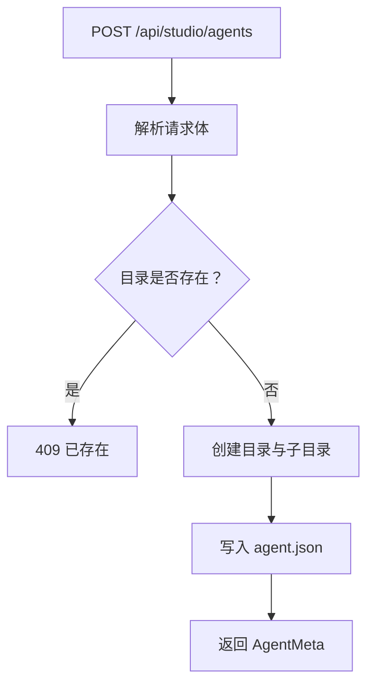

**图表来源**
- [src/ark_agentic/plugins/studio/api/agents.py:106-131](file://src/ark_agentic/plugins/studio/api/agents.py#L106-L131)

**章节来源**
- [src/ark_agentic/plugins/studio/api/agents.py:76-131](file://src/ark_agentic/plugins/studio/api/agents.py#L76-L131)
- [src/ark_agentic/plugins/studio/services/agent_service.py:60-138](file://src/ark_agentic/plugins/studio/services/agent_service.py#L60-L138)

#### 内存管理（Memory）
- GET /api/studio/agents/{agent_id}/memory/files：列出可发现的记忆文件（按用户分组）
- GET /api/studio/agents/{agent_id}/memory/content：读取内存文件内容（纯文本）
- PUT /api/studio/agents/{agent_id}/memory/content：写入内存文件内容

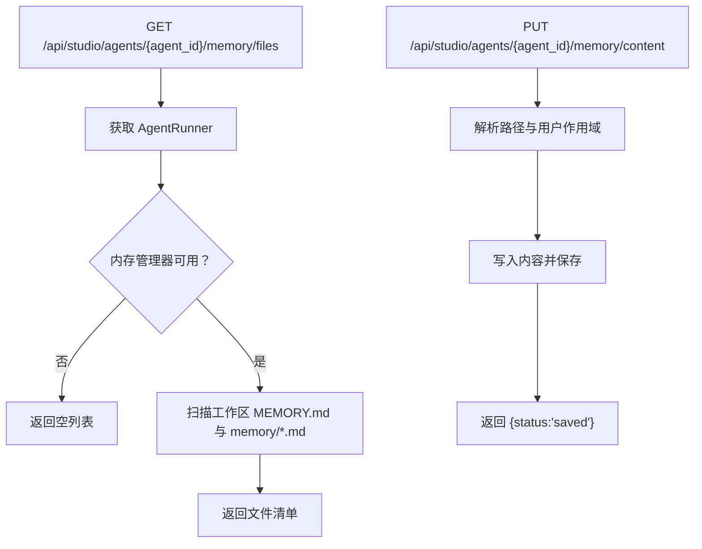

**图表来源**
- [src/ark_agentic/plugins/studio/api/memory.py:105-160](file://src/ark_agentic/plugins/studio/api/memory.py#L105-L160)

**章节来源**
- [src/ark_agentic/plugins/studio/api/memory.py:105-160](file://src/ark_agentic/plugins/studio/api/memory.py#L105-L160)

#### 会话管理（Sessions）
- GET /api/studio/agents/{agent_id}/sessions：列出会话（可按 user_id 过滤）
- GET /api/studio/agents/{agent_id}/sessions/{session_id}：获取会话详情与消息历史
- GET /api/studio/agents/{agent_id}/sessions/{session_id}/raw：读取原始 JSONL
- PUT /api/studio/agents/{agent_id}/sessions/{session_id}/raw：校验并写回 JSONL，写回后重载内存

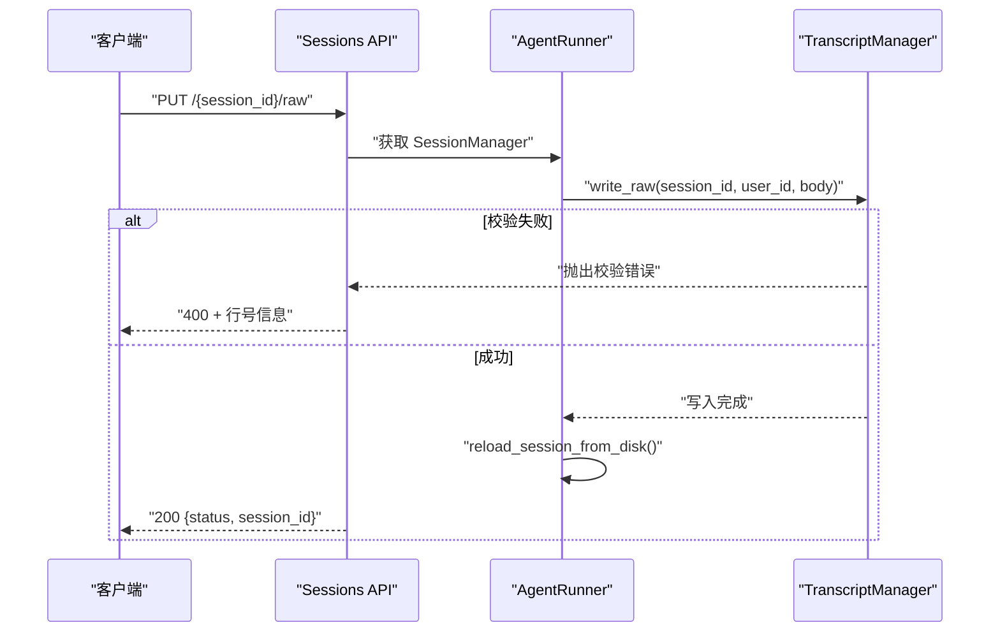

**图表来源**
- [src/ark_agentic/plugins/studio/api/sessions.py:169-200](file://src/ark_agentic/plugins/studio/api/sessions.py#L169-L200)

**章节来源**
- [src/ark_agentic/plugins/studio/api/sessions.py:84-200](file://src/ark_agentic/plugins/studio/api/sessions.py#L84-L200)

#### 技能管理（Skills）
- GET /api/studio/agents/{agent_id}/skills：列出技能（解析 SKILL.md）
- POST /api/studio/agents/{agent_id}/skills：创建技能（目录 + SKILL.md）
- PUT /api/studio/agents/{agent_id}/skills/{skill_id}：更新技能
- DELETE /api/studio/agents/{agent_id}/skills/{skill_id}：删除技能

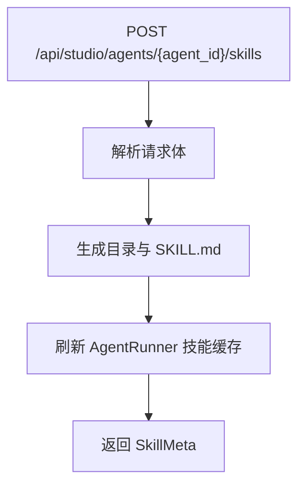

**图表来源**
- [src/ark_agentic/plugins/studio/api/skills.py:68-84](file://src/ark_agentic/plugins/studio/api/skills.py#L68-L84)

**章节来源**
- [src/ark_agentic/plugins/studio/api/skills.py:57-113](file://src/ark_agentic/plugins/studio/api/skills.py#L57-L113)
- [src/ark_agentic/plugins/studio/services/skill_service.py:60-154](file://src/ark_agentic/plugins/studio/services/skill_service.py#L60-L154)

#### 工具管理（Tools）
- GET /api/studio/agents/{agent_id}/tools：列出工具（AST 解析）
- POST /api/studio/agents/{agent_id}/tools：生成工具脚手架（Python 文件）

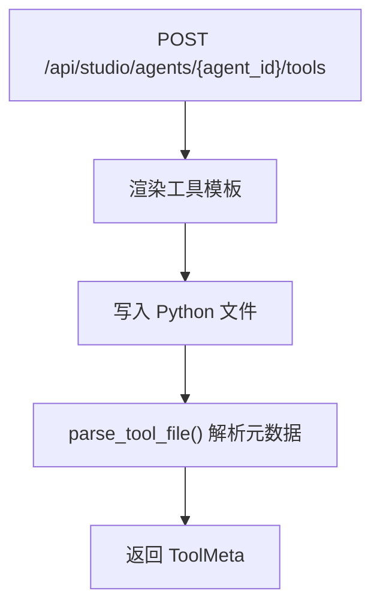

**图表来源**
- [src/ark_agentic/plugins/studio/api/tools.py:52-66](file://src/ark_agentic/plugins/studio/api/tools.py#L52-L66)

**章节来源**
- [src/ark_agentic/plugins/studio/api/tools.py:41-66](file://src/ark_agentic/plugins/studio/api/tools.py#L41-L66)
- [src/ark_agentic/plugins/studio/services/tool_service.py:59-99](file://src/ark_agentic/plugins/studio/services/tool_service.py#L59-L99)

#### 认证（Auth）
- POST /api/studio/auth/login：用户名/密码登录，返回用户信息（不含会话）
- 用户凭据存储于环境变量 STUDIO_USERS（JSON 对象），密码使用 bcrypt 哈希

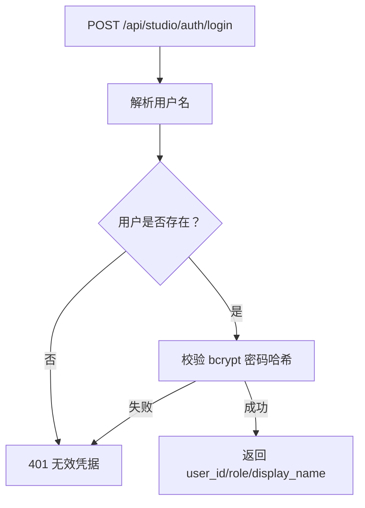

**图表来源**
- [src/ark_agentic/plugins/studio/api/auth.py:94-115](file://src/ark_agentic/plugins/studio/api/auth.py#L94-L115)

**章节来源**
- [src/ark_agentic/plugins/studio/api/auth.py:94-115](file://src/ark_agentic/plugins/studio/api/auth.py#L94-L115)

### 工具结果元数据

#### 数据模型与序列化
工具结果现在支持两个重要的元数据字段：

- **result_type**：工具结果类型枚举（json/text/image/a2ui/error）
- **llm_digest**：LLM 摘要字符串，用于业务工具的简短摘要

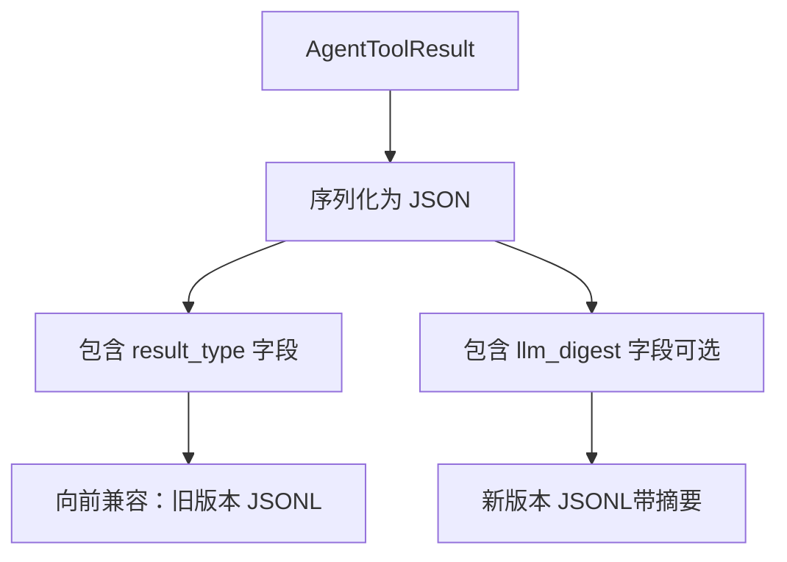

**图表来源**
- [src/ark_agentic/core/types.py:86-101](file://src/ark_agentic/core/types.py#L86-L101)
- [src/ark_agentic/core/persistence.py:140-147](file://src/ark_agentic/core/persistence.py#L140-L147)

#### 序列化与反序列化机制
- **序列化**：将 AgentToolResult 转换为字典，包含 result_type 和 llm_digest
- **反序列化**：从字典恢复 AgentToolResult，支持向后兼容性
- **向后兼容**：旧版本 JSONL 缺少 result_type 字段时自动推断

**章节来源**
- [src/ark_agentic/core/types.py:86-101](file://src/ark_agentic/core/types.py#L86-L101)
- [src/ark_agentic/core/persistence.py:140-186](file://src/ark_agentic/core/persistence.py#L140-L186)
- [tests/unit/core/test_format_tool_result_for_history.py:29-38](file://tests/unit/core/test_format_tool_result_for_history.py#L29-L38)

#### Studio 前端展示支持
Studio 前端已更新以支持新的工具结果元数据：

- 显示 llm_digest 摘要信息
- 正确处理 result_type 字段
- 支持不同类型的工具结果展示

**章节来源**
- [src/ark_agentic/plugins/studio/frontend/src/pages/AgentWorkspacePage.tsx:181-182](file://src/ark_agentic/plugins/studio/frontend/src/pages/AgentWorkspacePage.tsx#L181-L182)
- [src/ark_agentic/plugins/studio/frontend/src/pages/AgentWorkspacePage.tsx:314-319](file://src/ark_agentic/plugins/studio/frontend/src/pages/AgentWorkspacePage.tsx#L314-L319)

## 插件系统

### 插件架构概述
Ark-Agentic 采用全新的插件架构，基于 Bootstrap + Plugin 协议设计：

- **Bootstrap**：统一的生命周期管理器，负责插件的初始化、启动和停止
- **Plugin 协议**：定义插件的标准接口，包括 is_enabled、init、start、stop、install_routes
- **环境变量控制**：通过 ENABLE_API、ENABLE_STUDIO、ENABLE_JOB_MANAGER、ENABLE_NOTIFICATIONS 控制插件启停
- **条件性启用**：插件根据环境变量动态决定是否启用

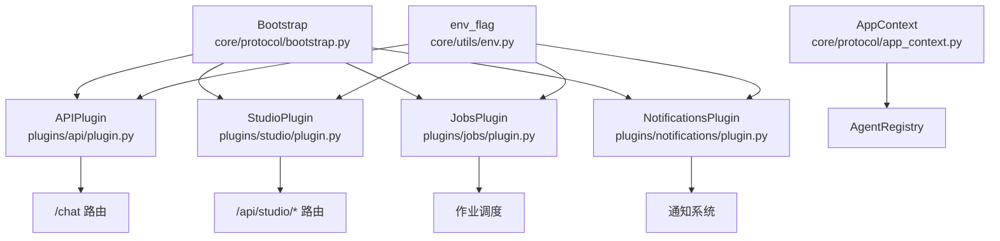

**图表来源**
- [src/ark_agentic/core/protocol/bootstrap.py:14-29](file://src/ark_agentic/core/protocol/bootstrap.py#L14-L29)
- [src/ark_agentic/plugins/api/plugin.py:30-33](file://src/ark_agentic/plugins/api/plugin.py#L30-L33)
- [src/ark_agentic/plugins/studio/plugin.py:19-20](file://src/ark_agentic/plugins/studio/plugin.py#L19-L20)
- [src/ark_agentic/plugins/jobs/plugin.py:42-43](file://src/ark_agentic/plugins/jobs/plugin.py#L42-L43)
- [src/ark_agentic/plugins/notifications/plugin.py:17-24](file://src/ark_agentic/plugins/notifications/plugin.py#L17-L24)

**章节来源**
- [src/ark_agentic/core/protocol/bootstrap.py:14-29](file://src/ark_agentic/core/protocol/bootstrap.py#L14-L29)
- [src/ark_agentic/core/protocol/plugin.py:20-34](file://src/ark_agentic/core/protocol/plugin.py#L20-L34)
- [src/ark_agentic/core/protocol/lifecycle.py:23-39](file://src/ark_agentic/core/protocol/lifecycle.py#L23-L39)

### APIPlugin
APIPlugin 是内置的 HTTP 传输插件，提供聊天 API 的基础功能：

- **作用范围**：仅负责聊天传输，不包含应用级状态
- **路由注册**：自动注册 /chat、/health、/ 路由
- **中间件**：CORS 支持和 Windows Update 探针过滤
- **条件启用**：默认启用，可通过 ENABLE_API=false 禁用

**章节来源**
- [src/ark_agentic/plugins/api/plugin.py:1-14](file://src/ark_agentic/plugins/api/plugin.py#L1-L14)
- [src/ark_agentic/plugins/api/plugin.py:30-87](file://src/ark_agentic/plugins/api/plugin.py#L30-L87)

### StudioPlugin
StudioPlugin 是可选的管理控制台插件：

- **作用范围**：提供完整的 Studio 管理界面和 API
- **条件启用**：通过 ENABLE_STUDIO=true 启用
- **Schema 初始化**：独立的 SQLite 引擎和认证表
- **前端集成**：支持 React 前端静态资源

**章节来源**
- [src/ark_agentic/plugins/studio/plugin.py:1-6](file://src/ark_agentic/plugins/studio/plugin.py#L1-L6)
- [src/ark_agentic/plugins/studio/plugin.py:19-32](file://src/ark_agentic/plugins/studio/plugin.py#L19-L32)

### JobsPlugin
JobsPlugin 是内置的主动作业管理插件：

- **作用范围**：作业调度和扫描功能
- **依赖要求**：需要 NotificationsPlugin 先启用
- **环境变量**：JOB_MAX_CONCURRENT、JOB_BATCH_SIZE、JOB_SHARD_INDEX、JOB_TOTAL_SHARDS
- **功能特性**：用户分片扫描、作业管理器

**章节来源**
- [src/ark_agentic/plugins/jobs/plugin.py:1-6](file://src/ark_agentic/plugins/jobs/plugin.py#L1-L6)
- [src/ark_agentic/plugins/jobs/plugin.py:51-99](file://src/ark_agentic/plugins/jobs/plugin.py#L51-L99)

### NotificationsPlugin
NotificationsPlugin 是内置的通知功能插件：

- **作用范围**：通知 REST + SSE + 仓库缓存
- **兼容性**：与 JobsPlugin 向后兼容
- **条件启用**：ENABLE_NOTIFICATIONS 或 ENABLE_JOB_MANAGER 任一为真
- **Schema 初始化**：独立的 SQLite 引擎

**章节来源**
- [src/ark_agentic/plugins/notifications/plugin.py:1-3](file://src/ark_agentic/plugins/notifications/plugin.py#L1-L3)
- [src/ark_agentic/plugins/notifications/plugin.py:17-41](file://src/ark_agentic/plugins/notifications/plugin.py#L17-L41)

## 维基系统

### 维基树形目录 API
- GET /api/wiki/tree：返回 repowiki 两种语言的目录树
- 功能特性
  - 支持中英文双语目录树
  - 按 repowiki-metadata.json 的 wiki_items 顺序排列
  - 安全的目录遍历保护
  - 支持嵌套目录结构

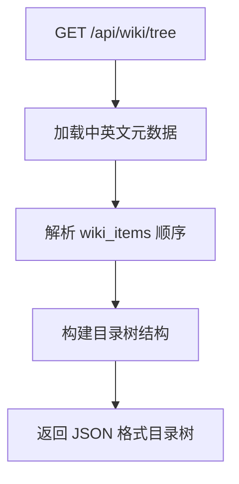

**图表来源**
- [src/ark_agentic/app.py:198-246](file://src/ark_agentic/app.py#L198-L246)

**章节来源**
- [src/ark_agentic/app.py:198-246](file://src/ark_agentic/app.py#L198-L246)

### 维基页面 API
- GET /api/wiki/{lang}/{path:path}：返回指定 wiki 页面的 Markdown 内容
- 参数说明
  - lang：语言代码（zh/en）
  - path：页面路径（相对 content 目录）
- 安全特性
  - 防止路径穿越攻击
  - 仅允许 .md 文件访问
  - 严格的文件存在性检查

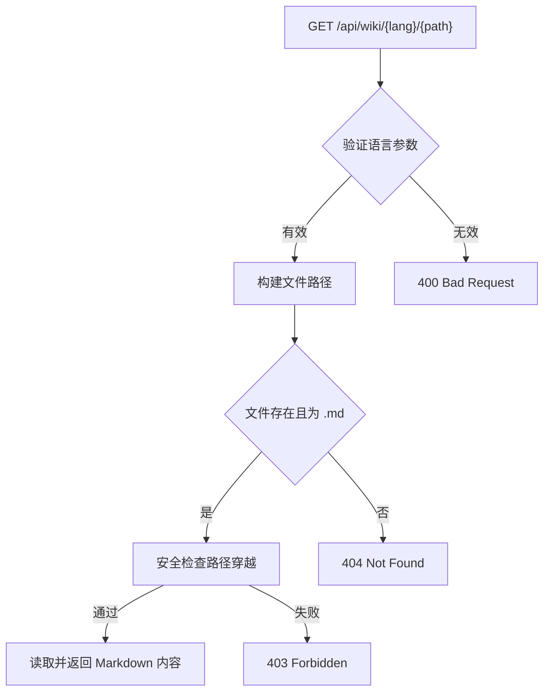

**图表来源**
- [src/ark_agentic/app.py:249-263](file://src/ark_agentic/app.py#L249-L263)

**章节来源**
- [src/ark_agentic/app.py:249-263](file://src/ark_agentic/app.py#L249-L263)

### README 内容加载 API
- GET /api/readme：返回项目根 README.md 纯文本
- 用途：供 landing 页 Docs Tab 客户端渲染
- 响应格式：text/markdown; charset=utf-8

**章节来源**
- [src/ark_agentic/app.py:186-195](file://src/ark_agentic/app.py#L186-L195)

### 健康检查 API
- GET /health：返回服务健康状态
- 响应：{"status": "ok"}

**章节来源**
- [src/ark_agentic/plugins/api/plugin.py:66-68](file://src/ark_agentic/plugins/api/plugin.py#L66-L68)

### 前端 Wiki 加载与渲染
- 客户端 JavaScript 实现
  - Wiki 树形目录加载：`loadWikiTree()`
  - Wiki 页面加载：`loadWikiPage(path, lang)`
  - 目录树渲染：`renderWikiTree(lang)`
  - Mermaid 图表支持
  - 响应式面包屑导航

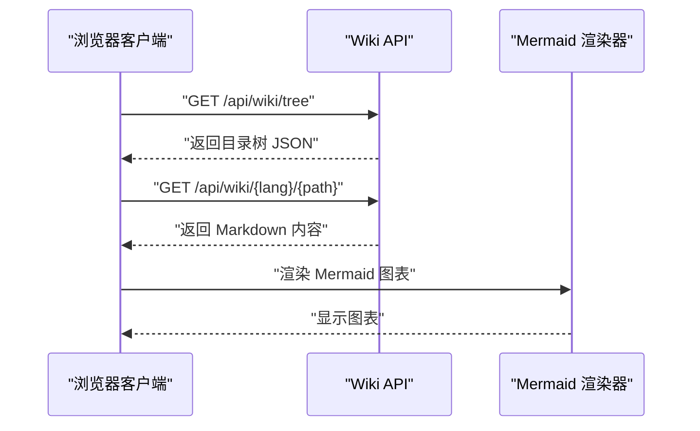

**图表来源**
- [src/ark_agentic/static/home.html:1202-1299](file://src/ark_agentic/static/home.html#L1202-L1299)

**章节来源**
- [src/ark_agentic/static/home.html:1202-1352](file://src/ark_agentic/static/home.html#L1202-L1352)

## 依赖分析
- Chat API 依赖插件系统的共享依赖模块获取 AgentRunner
- Studio 各模块依赖插件的服务层进行业务逻辑处理
- 维基系统依赖 repowiki 目录结构和元数据文件
- 服务层不依赖 FastAPI，便于复用与测试
- 工具结果元数据依赖核心类型定义和持久化层
- 插件系统通过 Bootstrap 统一管理生命周期

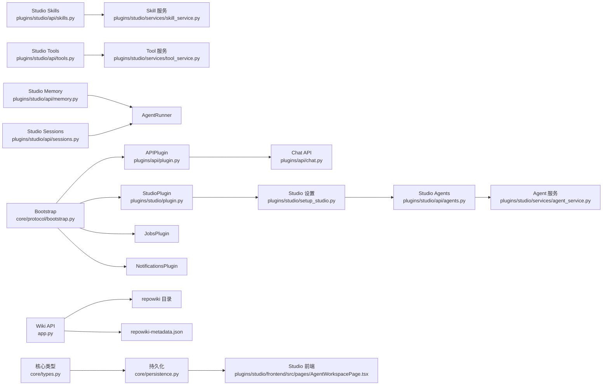

**图表来源**
- [src/ark_agentic/plugins/api/plugin.py:35-87](file://src/ark_agentic/plugins/api/plugin.py#L35-L87)
- [src/ark_agentic/plugins/studio/plugin.py:26-32](file://src/ark_agentic/plugins/studio/plugin.py#L26-L32)
- [src/ark_agentic/plugins/studio/api/agents.py:18-18](file://src/ark_agentic/plugins/studio/api/agents.py#L18-L18)
- [src/ark_agentic/plugins/studio/services/agent_service.py:58-198](file://src/ark_agentic/plugins/studio/services/agent_service.py#L58-L198)
- [src/ark_agentic/plugins/studio/api/skills.py:16-17](file://src/ark_agentic/plugins/studio/api/skills.py#L16-L17)
- [src/ark_agentic/plugins/studio/services/skill_service.py:1-289](file://src/ark_agentic/plugins/studio/services/skill_service.py#L1-L289)
- [src/ark_agentic/plugins/studio/api/tools.py:15-17](file://src/ark_agentic/plugins/studio/api/tools.py#L15-L17)
- [src/ark_agentic/plugins/studio/services/tool_service.py:1-235](file://src/ark_agentic/plugins/studio/services/tool_service.py#L1-L235)
- [src/ark_agentic/app.py:173](file://src/ark_agentic/app.py#L173)
- [src/ark_agentic/core/types.py:86-101](file://src/ark_agentic/core/types.py#L86-L101)
- [src/ark_agentic/core/persistence.py:140-186](file://src/ark_agentic/core/persistence.py#L140-L186)
- [src/ark_agentic/plugins/studio/frontend/src/pages/AgentWorkspacePage.tsx:181-182](file://src/ark_agentic/plugins/studio/frontend/src/pages/AgentWorkspacePage.tsx#L181-L182)
- [src/ark_agentic/core/protocol/bootstrap.py:14-29](file://src/ark_agentic/core/protocol/bootstrap.py#L14-L29)

**章节来源**
- [src/ark_agentic/plugins/api/plugin.py:35-87](file://src/ark_agentic/plugins/api/plugin.py#L35-L87)
- [src/ark_agentic/plugins/studio/plugin.py:26-32](file://src/ark_agentic/plugins/studio/plugin.py#L26-L32)
- [src/ark_agentic/plugins/studio/api/agents.py:18-18](file://src/ark_agentic/plugins/studio/api/agents.py#L18-L18)
- [src/ark_agentic/plugins/studio/services/agent_service.py:58-198](file://src/ark_agentic/plugins/studio/services/agent_service.py#L58-L198)
- [src/ark_agentic/plugins/studio/api/skills.py:16-17](file://src/ark_agentic/plugins/studio/api/skills.py#L16-L17)
- [src/ark_agentic/plugins/studio/services/skill_service.py:1-289](file://src/ark_agentic/plugins/studio/services/skill_service.py#L1-L289)
- [src/ark_agentic/plugins/studio/api/tools.py:15-17](file://src/ark_agentic/plugins/studio/api/tools.py#L15-L17)
- [src/ark_agentic/plugins/studio/services/tool_service.py:1-235](file://src/ark_agentic/plugins/studio/services/tool_service.py#L1-L235)
- [src/ark_agentic/app.py:173](file://src/ark_agentic/app.py#L173)
- [src/ark_agentic/core/types.py:86-101](file://src/ark_agentic/core/types.py#L86-L101)
- [src/ark_agentic/core/persistence.py:140-186](file://src/ark_agentic/core/persistence.py#L140-L186)
- [src/ark_agentic/plugins/studio/frontend/src/pages/AgentWorkspacePage.tsx:181-182](file://src/ark_agentic/plugins/studio/frontend/src/pages/AgentWorkspacePage.tsx#L181-L182)
- [src/ark_agentic/core/protocol/bootstrap.py:14-29](file://src/ark_agentic/core/protocol/bootstrap.py#L14-L29)

## 性能考量
- 并行工具调用：当 LLM 返回多个工具调用时，使用并行执行以减少总延迟
- AG-UI 流式协议：事件驱动架构，支持细粒度流式推送（20 种事件类型）
- 多协议适配：单一内部实现，输出层适配四种协议格式
- 零数据库记忆：纯文件 MEMORY.md，启动即用，避免数据库连接开销
- 会话压缩：自动总结历史消息，保持上下文窗口稳定
- 输出验证：自动检测数值幻觉，提升输出可靠性
- 维基系统缓存：Wiki 树形目录按需加载，支持浏览器缓存
- Mermaid 图表懒加载：仅在需要时渲染图表，提升页面加载性能
- 工具结果元数据优化：高效的序列化/反序列化机制，支持向后兼容
- 插件系统优化：按需加载插件，减少内存占用和启动时间

**章节来源**
- [README.md:787-795](file://README.md#L787-L795)

## 故障排查指南
- Chat API
  - 缺少 user_id：检查请求体或请求头 x-ark-user-id
  - Agent 不存在：确认 agent_id 是否正确
  - 流式输出异常：检查协议与 Accept 头
  - APIPlugin 未启用：检查 ENABLE_API 环境变量
- Studio API
  - 内存路径越界：确保 file_path 相对工作区且无路径穿越
  - 会话 JSONL 校验失败：检查 JSONL 格式与行号
  - 技能/工具操作失败：确认 Agent 目录存在与权限
  - StudioPlugin 未启用：检查 ENABLE_STUDIO 环境变量
- 维基系统
  - Wiki 树形目录加载失败：检查 repowiki 目录结构和元数据文件
  - Wiki 页面加载失败：确认文件路径、语言参数和文件存在性
  - README 加载失败：检查 README.md 文件是否存在
- 认证
  - 401 无效凭据：确认用户名存在且密码哈希匹配
- 工具结果元数据
  - 序列化失败：检查 AgentToolResult 字段完整性
  - 反序列化兼容性问题：确认 JSONL 格式符合向后兼容规则
  - Studio 前端显示异常：检查 llm_digest 格式和 result_type 值
- 插件系统
  - 插件未加载：检查对应 ENABLE_XXX 环境变量
  - JobsPlugin 依赖错误：确认 NotificationsPlugin 已启用
  - 生命周期异常：检查插件的 is_enabled、init、start、stop 方法

**章节来源**
- [src/ark_agentic/plugins/api/chat.py:40-44](file://src/ark_agentic/plugins/api/chat.py#L40-L44)
- [src/ark_agentic/plugins/studio/api/memory.py:83-88](file://src/ark_agentic/plugins/studio/api/memory.py#L83-L88)
- [src/ark_agentic/plugins/studio/api/sessions.py:190-197](file://src/ark_agentic/plugins/studio/api/sessions.py#L190-L197)
- [src/ark_agentic/plugins/studio/api/auth.py:94-109](file://src/ark_agentic/plugins/studio/api/auth.py#L94-L109)
- [src/ark_agentic/app.py:198-263](file://src/ark_agentic/app.py#L198-L263)
- [src/ark_agentic/core/persistence.py:150-186](file://src/ark_agentic/core/persistence.py#L150-L186)
- [src/ark_agentic/plugins/studio/frontend/src/pages/AgentWorkspacePage.tsx:181-182](file://src/ark_agentic/plugins/studio/frontend/src/pages/AgentWorkspacePage.tsx#L181-L182)
- [src/ark_agentic/plugins/jobs/plugin.py:52-56](file://src/ark_agentic/plugins/jobs/plugin.py#L52-L56)

## 结论
Ark-Agentic API 采用全新的插件架构设计，提供了统一、可扩展的 Agent 服务接口。新的插件系统通过 Bootstrap + Plugin 协议实现了灵活的组件管理，支持按需启用和禁用功能模块。

主要改进包括：
- **插件架构**：四大核心插件（API、Studio、Jobs、Notifications）支持条件性启用
- **生命周期管理**：统一的 init → start → stop 生命周期管理
- **环境变量控制**：通过 ENABLE_XXX 环境变量精确控制功能启停
- **路由隔离**：插件各自管理自己的路由，避免冲突
- **向后兼容**：保持原有 API 接口不变，仅调整内部实现

通过合理的错误处理、安全设计与性能优化，新的插件架构能够更好地满足生产环境的需求，同时为未来的功能扩展提供了良好的基础。

## 附录

### HTTP 方法与 URL 模式
- Chat
  - POST /chat
- Studio
  - Agents：GET /api/studio/agents, GET /api/studio/agents/{agent_id}, POST /api/studio/agents
  - Memory：GET /api/studio/agents/{agent_id}/memory/files, GET /api/studio/agents/{agent_id}/memory/content, PUT /api/studio/agents/{agent_id}/memory/content
  - Sessions：GET /api/studio/agents/{agent_id}/sessions, GET /api/studio/agents/{agent_id}/sessions/{session_id}, GET /api/studio/agents/{agent_id}/sessions/{session_id}/raw, PUT /api/studio/agents/{agent_id}/sessions/{session_id}/raw
  - Skills：GET /api/studio/agents/{agent_id}/skills, POST /api/studio/agents/{agent_id}/skills, PUT /api/studio/agents/{agent_id}/skills/{skill_id}, DELETE /api/studio/agents/{agent_id}/skills/{skill_id}
  - Tools：GET /api/studio/agents/{agent_id}/tools, POST /api/studio/agents/{agent_id}/tools
  - Auth：POST /api/studio/auth/login
- 维基系统
  - Wiki Tree：GET /api/wiki/tree
  - Wiki Page：GET /api/wiki/{lang}/{path}
  - README：GET /api/readme
  - Health：GET /health

**章节来源**
- [src/ark_agentic/plugins/api/chat.py:27-27](file://src/ark_agentic/plugins/api/chat.py#L27-L27)
- [src/ark_agentic/plugins/studio/api/agents.py:76-131](file://src/ark_agentic/plugins/studio/api/agents.py#L76-L131)
- [src/ark_agentic/plugins/studio/api/memory.py:105-160](file://src/ark_agentic/plugins/studio/api/memory.py#L105-L160)
- [src/ark_agentic/plugins/studio/api/sessions.py:84-200](file://src/ark_agentic/plugins/studio/api/sessions.py#L84-L200)
- [src/ark_agentic/plugins/studio/api/skills.py:57-113](file://src/ark_agentic/plugins/studio/api/skills.py#L57-L113)
- [src/ark_agentic/plugins/studio/api/tools.py:41-66](file://src/ark_agentic/plugins/studio/api/tools.py#L41-L66)
- [src/ark_agentic/plugins/studio/api/auth.py:94-115](file://src/ark_agentic/plugins/studio/api/auth.py#L94-L115)
- [src/ark_agentic/app.py:198-263](file://src/ark_agentic/app.py#L198-L263)
- [src/ark_agentic/plugins/api/plugin.py:66-68](file://src/ark_agentic/plugins/api/plugin.py#L66-L68)

### 请求/响应模式与数据模型
- ChatRequest/ChatResponse：见 [src/ark_agentic/plugins/api/models.py:27-104](file://src/ark_agentic/plugins/api/models.py#L27-L104)
- Studio 数据模型：AgentMeta、SkillMeta、ToolMeta、SessionItem、MessageItem 等
- SSE 事件模型：见 [src/ark_agentic/plugins/api/models.py:73-102](file://src/ark_agentic/plugins/api/models.py#L73-L102)
- Wiki 目录树数据模型：包含 type、name、path、children 字段
- Wiki 页面数据模型：Markdown 文本内容
- 工具结果元数据：AgentToolResult 包含 result_type 和 llm_digest 字段

**章节来源**
- [src/ark_agentic/plugins/api/models.py:27-104](file://src/ark_agentic/plugins/api/models.py#L27-L104)
- [src/ark_agentic/core/types.py:86-101](file://src/ark_agentic/core/types.py#L86-L101)

### 认证方法
- Chat API：无强制认证，可通过请求头传递用户与会话上下文
- Studio API：/api/studio/auth/login 登录，返回用户信息（角色、显示名等）
- 维基系统：无需认证，公开访问

**章节来源**
- [src/ark_agentic/plugins/studio/api/auth.py:94-115](file://src/ark_agentic/plugins/studio/api/auth.py#L94-L115)

### 流式响应机制
- 协议类型：internal、agui、enterprise、alone
- 事件类型：run_started/run_finished/run_error、step_started/step_finished、text_message_*、tool_call_*、state_*、messages_*、thinking_message_*、custom/raw 等
- SSE 事件格式：见 [README.md:111-146](file://README.md#L111-L146)

**章节来源**
- [src/ark_agentic/plugins/api/chat.py:115-177](file://src/ark_agentic/plugins/api/chat.py#L115-L177)
- [README.md:111-146](file://README.md#L111-L146)

### 安全考虑
- 路径遍历防护：内存文件写入前进行路径校验
- 会话 JSONL 写回：严格校验格式，失败返回行号
- 认证：bcrypt 密码哈希，支持环境变量配置用户表
- Wiki 系统安全：严格的路径穿越检查，仅允许 .md 文件访问
- README 加载：安全的文件路径解析
- 工具结果元数据安全：序列化时的安全检查和向后兼容性保证
- 插件系统安全：环境变量控制插件启停，防止未授权功能启用

**章节来源**
- [src/ark_agentic/plugins/studio/api/memory.py:83-88](file://src/ark_agentic/plugins/studio/api/memory.py#L83-L88)
- [src/ark_agentic/plugins/studio/api/sessions.py:190-197](file://src/ark_agentic/plugins/studio/api/sessions.py#L190-L197)
- [src/ark_agentic/plugins/studio/api/auth.py:68-81](file://src/ark_agentic/plugins/studio/api/auth.py#L68-L81)
- [src/ark_agentic/app.py:258-262](file://src/ark_agentic/app.py#L258-L262)
- [src/ark_agentic/core/persistence.py:140-186](file://src/ark_agentic/core/persistence.py#L140-L186)

### 速率限制与版本
- 速率限制：未内置速率限制策略，建议在网关或反向代理层实施
- 版本：应用版本号在统一入口定义，当前为 0.1.0
- 维基系统：版本随 repowiki 目录结构变化而更新
- 工具结果元数据：版本随核心类型定义更新而演进
- 插件系统：版本随插件实现更新而演进

**章节来源**
- [src/ark_agentic/app.py:74](file://src/ark_agentic/app.py#L74)

### 常见用例与客户端实现指南
- Chat 非流式：设置 stream=false，接收 ChatResponse
- Chat 流式：设置 stream=true 与协议（protocol），使用 SSE 客户端订阅
- 会话续用：通过 x-ark-session-id 或 session_id 继续对话
- 幂等请求：使用 idempotency_key 防止重复提交
- Studio 管理：先 /api/studio/auth/login 获取用户信息，再调用相应管理接口
- 维基系统：通过 /api/wiki/tree 获取目录树，通过 /api/wiki/{lang}/{path} 获取页面内容
- README 加载：通过 /api/readme 获取项目文档
- 工具结果处理：客户端应正确处理 result_type 和 llm_digest 字段
- 插件启用：通过设置对应的 ENABLE_XXX 环境变量控制功能启停

**章节来源**
- [postman/ark-agentic-api.postman_collection.json:38-240](file://postman/ark-agentic-api.postman_collection.json#L38-L240)
- [README.md:91-154](file://README.md#L91-L154)

### 性能优化技巧
- 合理使用 run_options 调整模型与温度
- 利用 use_history 与 history 合并外部上下文，减少重复输入
- 并行工具调用：确保工具执行幂等，避免副作用
- 会话压缩：合理配置上下文窗口与摘要策略
- 输出验证：在 before_loop_end 钩子中进行引用校验，减少无效重试
- 维基系统优化：利用浏览器缓存，延迟加载大文件
- Mermaid 图表优化：仅在可见区域渲染图表
- 工具结果元数据优化：利用高效的序列化/反序列化机制，减少内存占用
- 插件系统优化：按需启用插件，减少启动时间和内存占用

**章节来源**
- [README.md:787-795](file://README.md#L787-L795)

### 插件系统配置

#### 环境变量配置
- **ENABLE_API**：控制 APIPlugin 启用（默认 true）
- **ENABLE_STUDIO**：控制 StudioPlugin 启用（默认 false）
- **ENABLE_JOB_MANAGER**：控制 JobsPlugin 启用（默认 false）
- **ENABLE_NOTIFICATIONS**：控制 NotificationsPlugin 启用（默认 false）

#### 插件启动顺序
1. Portal（框架内部）
2. APIPlugin
3. NotificationsPlugin
4. JobsPlugin
5. StudioPlugin

**章节来源**
- [src/ark_agentic/plugins/api/plugin.py:30-33](file://src/ark_agentic/plugins/api/plugin.py#L30-L33)
- [src/ark_agentic/plugins/studio/plugin.py:19-20](file://src/ark_agentic/plugins/studio/plugin.py#L19-L20)
- [src/ark_agentic/plugins/jobs/plugin.py:42-43](file://src/ark_agentic/plugins/jobs/plugin.py#L42-L43)
- [src/ark_agentic/plugins/notifications/plugin.py:17-24](file://src/ark_agentic/plugins/notifications/plugin.py#L17-L24)
- [src/ark_agentic/app.py:50-56](file://src/ark_agentic/app.py#L50-L56)

### 主页文档更新

#### 安装方式更新
**更新** 主页文档反映了安装方式的更新，从传统的 `pip install` 改为推荐的 `uv tool install` 方式：

- **推荐方式**：`uv tool install ark-agentic`
- **传统方式**：`pip install ark-agentic`

#### 模型配置示例更新
**更新** README 中的模型配置示例更加清晰，包含完整的环境变量配置：

```bash
LLM_PROVIDER=openai
MODEL_NAME=gpt-4o
API_KEY=sk-xxx
# LLM_BASE_URL=https://api.openai.com/v1
# LLM_BASE_URL_IS_FULL_URL=false
# 完整请求 URL 示例:
# LLM_BASE_URL=https://service-host/chat/dialog
# LLM_BASE_URL_IS_FULL_URL=true
```

**章节来源**
- [README.md:58-107](file://README.md#L58-L107)