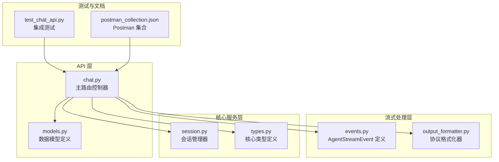
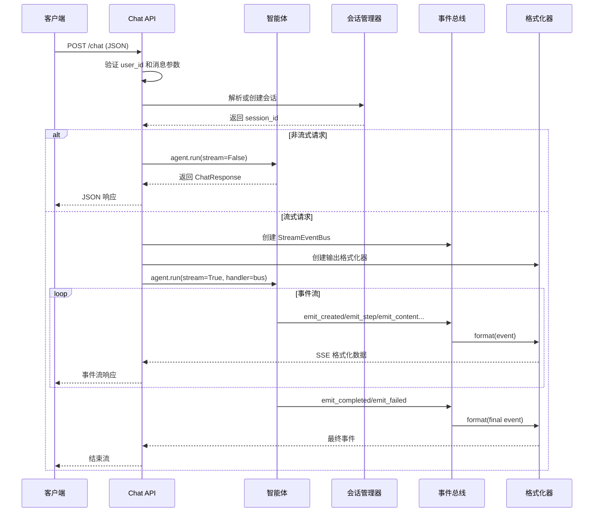
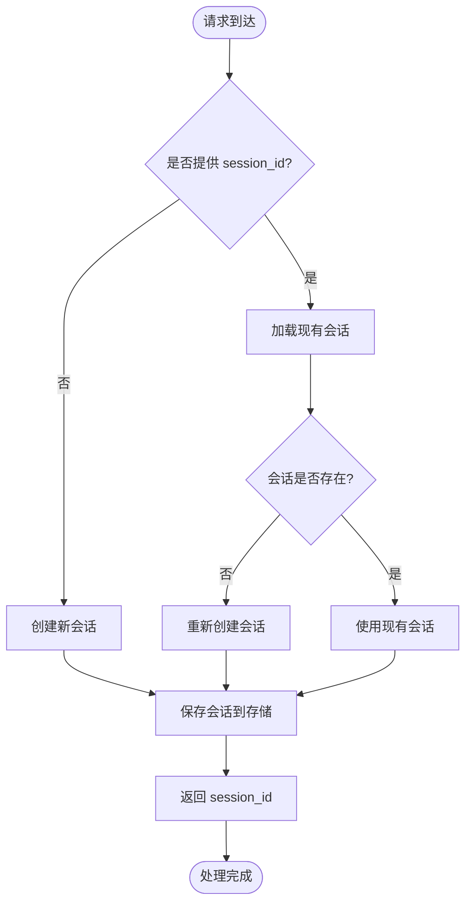
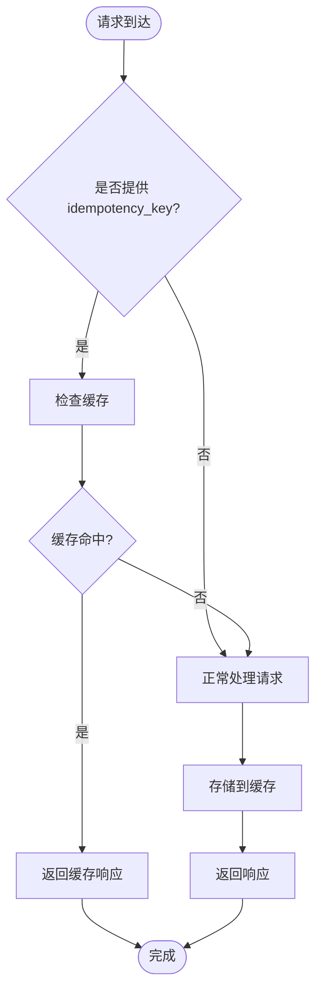
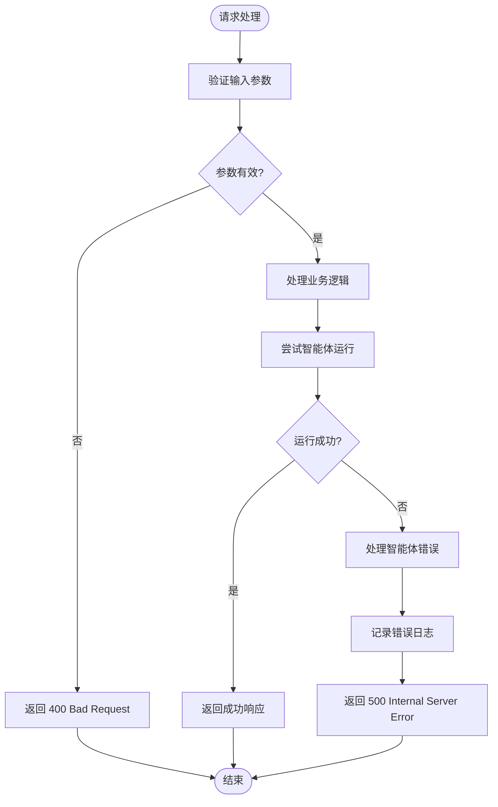
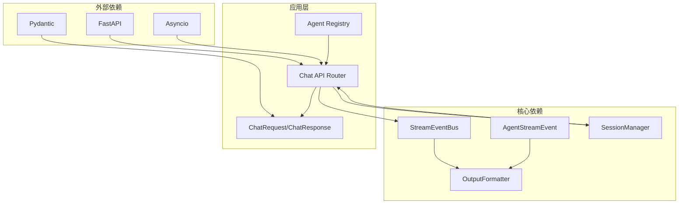

# Chat API

<cite>
**本文档引用的文件**
- [chat.py](file://src/ark_agentic/api/chat.py)
- [models.py](file://src/ark_agentic/api/models.py)
- [events.py](file://src/ark_agentic/core/stream/events.py)
- [output_formatter.py](file://src/ark_agentic/core/stream/output_formatter.py)
- [session.py](file://src/ark_agentic/core/session.py)
- [types.py](file://src/ark_agentic/core/types.py)
- [test_chat_api.py](file://tests/integration/test_chat_api.py)
- [ark-agentic-api.postman_collection.json](file://postman/ark-agentic-api.postman_collection.json)
</cite>

## 目录
1. [简介](#简介)
2. [项目结构](#项目结构)
3. [核心组件](#核心组件)
4. [架构概览](#架构概览)
5. [详细组件分析](#详细组件分析)
6. [依赖关系分析](#依赖关系分析)
7. [性能考虑](#性能考虑)
8. [故障排除指南](#故障排除指南)
9. [结论](#结论)
10. [附录](#附录)

## 简介

Chat API 是 Ark-Agentic 智能体平台的核心接口，提供基于 FastAPI 的 RESTful 服务，支持非流式和流式两种响应模式。该 API 专为保险和证券领域的智能客户服务而设计，支持多协议流式输出、会话管理和幂等性处理。

## 项目结构

Chat API 的实现采用模块化架构，主要分布在以下关键文件中：



**图表来源**
- [chat.py:1-177](file://src/ark_agentic/api/chat.py#L1-L177)
- [models.py:1-104](file://src/ark_agentic/api/models.py#L1-L104)
- [events.py:1-116](file://src/ark_agentic/core/stream/events.py#L1-L116)

**章节来源**
- [chat.py:1-177](file://src/ark_agentic/api/chat.py#L1-L177)
- [models.py:1-104](file://src/ark_agentic/api/models.py#L1-L104)

## 核心组件

### HTTP 端点定义

Chat API 提供单一的 `/chat` 端点，支持 POST 方法：

- **端点**: `/chat`
- **方法**: `POST`
- **媒体类型**: `application/json`
- **流式支持**: 是

### 请求模型 (ChatRequest)

ChatRequest 定义了完整的请求参数结构：

| 参数名 | 类型 | 必填 | 默认值 | 描述 |
|--------|------|------|--------|------|
| `agent_id` | `str` | 否 | `"insurance"` | 智能体标识 (insurance/securities) |
| `message` | `str` | 是 | - | 用户消息内容 |
| `session_id` | `str \| None` | 否 | `None` | 会话 ID，为空则创建新会话 |
| `stream` | `bool` | 否 | `False` | 是否启用 SSE 流式输出 |
| `run_options` | `RunOptions \| None` | 否 | `None` | 运行选项（模型、温度等覆盖） |
| `protocol` | `str` | 否 | `"internal"` | 流式输出协议 (agui/internal/enterprise/alone) |
| `source_bu_type` | `str` | 否 | `""` | BU 来源（enterprise 模式使用） |
| `app_type` | `str` | 否 | `""` | App 类型（enterprise 模式使用） |
| `user_id` | `str \| None` | 否 | `None` | 用户 ID（body 或 header 至少提供一个） |
| `message_id` | `str \| None` | 否 | `None` | 消息 ID，为空则自动生成 UUID |
| `context` | `dict[str, Any] \| None` | 否 | `None` | 业务上下文数据 |
| `idempotency_key` | `str \| None` | 否 | `None` | 幂等键，防止重复请求 |
| `history` | `list[HistoryMessage] \| None` | 否 | `None` | 外部系统聊天历史（最近 N 轮） |
| `use_history` | `bool` | 否 | `True` | 是否启用外部历史合并 |

### 响应模型 (ChatResponse)

ChatResponse 定义了非流式响应的数据结构：

| 字段名 | 类型 | 描述 |
|--------|------|------|
| `session_id` | `str` | 会话 ID |
| `message_id` | `str` | 消息 ID |
| `response` | `str` | 最终响应内容 |
| `tool_calls` | `list[dict[str, Any]]` | 工具调用列表 |
| `turns` | `int` | ReAct 循环次数 |
| `usage` | `dict[str, int] \| None` | Token 使用统计 |

**章节来源**
- [models.py:27-69](file://src/ark_agentic/api/models.py#L27-L69)

## 架构概览

Chat API 采用分层架构设计，实现了清晰的关注点分离：



**图表来源**
- [chat.py:27-177](file://src/ark_agentic/api/chat.py#L27-L177)
- [events.py:67-116](file://src/ark_agentic/core/stream/events.py#L67-L116)
- [output_formatter.py:427-444](file://src/ark_agentic/core/stream/output_formatter.py#L427-L444)

## 详细组件分析

### 会话管理机制

会话管理是 Chat API 的核心功能之一，支持自动创建和恢复会话：



**图表来源**
- [chat.py:60-80](file://src/ark_agentic/api/chat.py#L60-L80)
- [session.py:40-67](file://src/ark_agentic/core/session.py#L40-L67)

### 流式响应机制

Chat API 支持多种流式输出协议，每种协议都有特定的事件类型和数据格式：

#### 支持的协议类型

| 协议名称 | 用途 | 事件类型 | 输出格式 |
|----------|------|----------|----------|
| `agui` | 原生 AG-UI 事件 | 17种核心事件 | AgentStreamEvent JSON |
| `internal` | 向后兼容 | response.* 事件 | 兼容旧版前端 |
| `enterprise` | 企业集成 | AGUIEnvelope | 企业标准格式 |
| `alone` | ALONE 协议 | sa_* 事件 | ALONE 前端格式 |

#### SSE 事件格式

SSE (Server-Sent Events) 格式遵循标准的事件-数据对格式：

```
event: response.created
data: {"type":"response.created","seq":1,"run_id":"...","session_id":"...","content":"..."}

event: response.content.delta
data: {"type":"response.content.delta","seq":2,"run_id":"...","session_id":"...","delta":"...","turn":1}

event: response.completed
data: {"type":"response.completed","seq":3,"run_id":"...","session_id":"...","message":"...","usage":{"prompt_tokens":...,"completion_tokens":...},"turns":1,"tool_calls":[]}
```

**章节来源**
- [chat.py:115-177](file://src/ark_agentic/api/chat.py#L115-L177)
- [output_formatter.py:67-150](file://src/ark_agentic/core/stream/output_formatter.py#L67-L150)

### 幂等性处理

Chat API 支持幂等性处理，防止重复请求：



**图表来源**
- [chat.py:56-58](file://src/ark_agentic/api/chat.py#L56-L58)

**章节来源**
- [chat.py:56-58](file://src/ark_agentic/api/chat.py#L56-L58)

### 错误处理策略

Chat API 实现了多层次的错误处理机制：



**图表来源**
- [chat.py:42-43](file://src/ark_agentic/api/chat.py#L42-L43)
- [chat.py:153-155](file://src/ark_agentic/api/chat.py#L153-L155)

**章节来源**
- [chat.py:42-43](file://src/ark_agentic/api/chat.py#L42-L43)
- [chat.py:153-155](file://src/ark_agentic/api/chat.py#L153-L155)

## 依赖关系分析

Chat API 的依赖关系体现了清晰的分层架构：



**图表来源**
- [chat.py:12-24](file://src/ark_agentic/api/chat.py#L12-L24)
- [models.py:12-14](file://src/ark_agentic/api/models.py#L12-L14)

**章节来源**
- [chat.py:12-24](file://src/ark_agentic/api/chat.py#L12-L24)
- [models.py:12-14](file://src/ark_agentic/api/models.py#L12-L14)

## 性能考虑

### 流式处理优化

1. **异步队列处理**: 使用 asyncio.Queue 实现事件缓冲
2. **超时控制**: 100ms 超时避免阻塞等待
3. **内存管理**: 及时清理已完成的任务和事件
4. **连接池**: 复用数据库和外部服务连接

### 会话管理优化

1. **内存缓存**: 会话状态优先存储在内存中
2. **批量持久化**: 待处理消息批量写入磁盘
3. **自动压缩**: 基于令牌数阈值自动压缩历史
4. **延迟加载**: 会话从磁盘按需加载

### 错误恢复机制

1. **重试策略**: 智能体调用失败自动重试
2. **降级处理**: 网络异常时提供基础功能
3. **健康检查**: 定期检查下游服务可用性
4. **资源监控**: 实时监控内存和 CPU 使用率

## 故障排除指南

### 常见问题及解决方案

#### 1. 用户 ID 缺失错误

**症状**: 返回 400 状态码，错误信息包含 "user_id is required"

**原因**: 请求既没有在 body 中提供 user_id，也没有在 header 中提供 x-ark-user-id

**解决方案**:
- 在请求体中添加 user_id 字段
- 或者在请求头中添加 x-ark-user-id

#### 2. 会话加载失败

**症状**: 会话 ID 无效或不存在

**原因**: 提供的 session_id 不存在或已过期

**解决方案**:
- 清除客户端的过期会话 ID
- 重新发起请求时不携带 session_id
- 检查会话存储服务的可用性

#### 3. 流式连接中断

**症状**: SSE 连接意外断开

**原因**: 服务器超时或网络问题

**解决方案**:
- 检查客户端的连接超时设置
- 确保网络连接稳定
- 实现客户端自动重连机制

**章节来源**
- [test_chat_api.py:69-106](file://tests/integration/test_chat_api.py#L69-L106)
- [test_chat_api.py:108-161](file://tests/integration/test_chat_api.py#L108-L161)

## 结论

Chat API 提供了一个功能完整、架构清晰的智能体对话接口。其主要特点包括：

1. **多协议支持**: 支持四种不同的流式输出协议，满足不同前端需求
2. **会话管理**: 完善的会话生命周期管理，支持自动创建和恢复
3. **幂等性处理**: 内置幂等性机制，防止重复请求
4. **错误处理**: 多层次的错误处理和恢复机制
5. **性能优化**: 异步处理和内存优化，确保高并发场景下的稳定性

该 API 为 Ark-Agentic 平台提供了强大的智能客户服务能力，支持保险和证券等垂直领域的复杂业务场景。

## 附录

### 完整请求示例

#### 非流式请求
```json
{
  "agent_id": "insurance",
  "message": "我想取点钱",
  "stream": false,
  "user_id": "test-user-001",
  "context": {
    "channel": "mobile_app",
    "customer_tier": "vip"
  }
}
```

#### 流式请求 (Enterprise 协议)
```json
{
  "agent_id": "insurance",
  "message": "企业 AGUI 流式测试",
  "stream": true,
  "protocol": "enterprise",
  "source_bu_type": "shouxian",
  "app_type": "hcz",
  "user_id": "test-user-001",
  "context": {
    "channel": "web",
    "bu": "shouxian",
    "app": "hcz"
  }
}
```

### 响应格式示例

#### 非流式响应
```json
{
  "session_id": "session-123",
  "message_id": "msg-456",
  "response": "您好，我需要更多信息来帮助您办理取款业务。",
  "tool_calls": [],
  "turns": 1,
  "usage": {
    "prompt_tokens": 150,
    "completion_tokens": 80
  }
}
```

#### 流式事件响应
```json
event: response.created
data: {"type":"response.created","seq":1,"run_id":"run-789","session_id":"session-123","content":"收到您的消息，正在处理中…"}

event: response.content.delta
data: {"type":"response.content.delta","seq":2,"run_id":"run-789","session_id":"session-123","delta":"您好","turn":1}

event: response.completed
data: {"type":"response.completed","seq":3,"run_id":"run-789","session_id":"session-123","message":"您好，我需要更多信息来帮助您办理取款业务。","usage":{"prompt_tokens":150,"completion_tokens":80},"turns":1,"tool_calls":[]}
```

### 客户端处理建议

#### JavaScript 客户端
```javascript
// SSE 连接示例
const eventSource = new EventSource('/chat', {
  method: 'POST',
  headers: {
    'Content-Type': 'application/json',
    'Accept': 'text/event-stream'
  },
  body: JSON.stringify({
    agent_id: 'insurance',
    message: '你好',
    stream: true,
    protocol: 'internal'
  })
});

eventSource.onmessage = function(event) {
  const data = JSON.parse(event.data);
  console.log('收到事件:', data.type);
};
```

#### Python 客户端
```python
import requests
import json

def handle_sse_stream(url, payload):
    response = requests.post(
        url,
        json=payload,
        stream=True,
        headers={'Accept': 'text/event-stream'}
    )
    
    for line in response.iter_lines():
        if line.startswith(b'data:'):
            data = json.loads(line.decode('utf-8')[5:].strip())
            print(f"事件类型: {data['type']}")
```