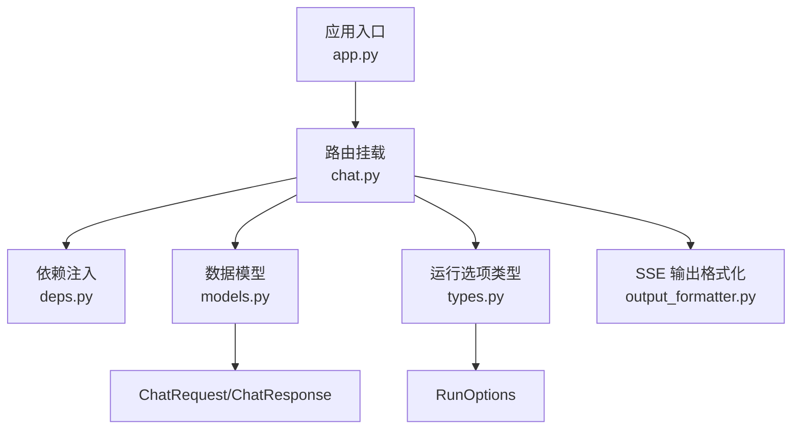
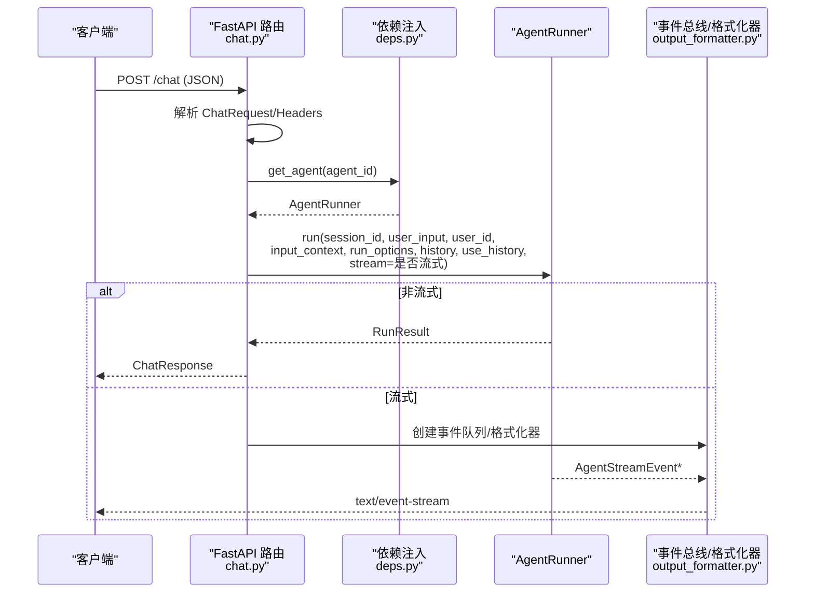
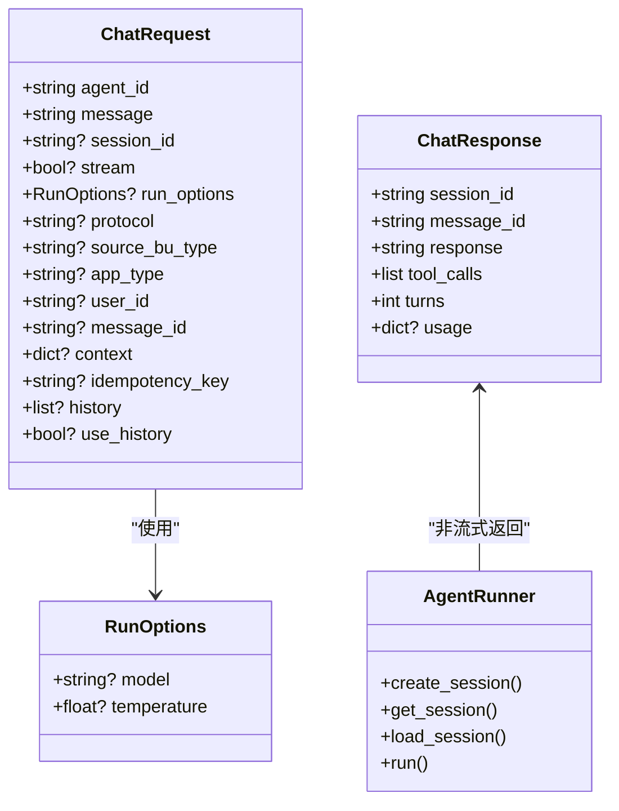
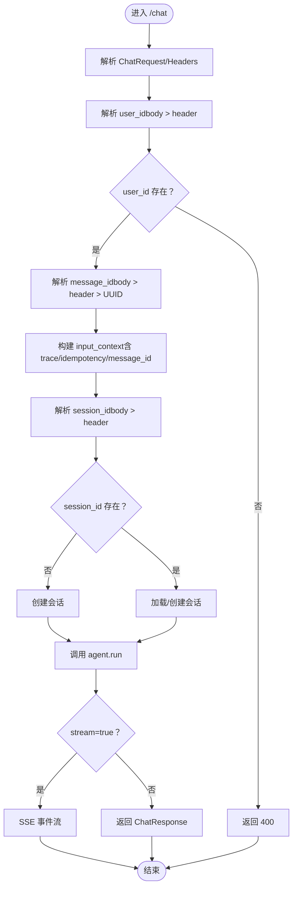

# Chat 端点

<cite>
**本文引用的文件**
- [chat.py](file://src/ark_agentic/api/chat.py)
- [models.py](file://src/ark_agentic/api/models.py)
- [types.py](file://src/ark_agentic/core/types.py)
- [output_formatter.py](file://src/ark_agentic/core/stream/output_formatter.py)
- [deps.py](file://src/ark_agentic/api/deps.py)
- [app.py](file://src/ark_agentic/app.py)
- [test_chat_api.py](file://tests/integration/test_chat_api.py)
- [ark-agentic-api.postman_collection.json](file://postman/ark-agentic-api.postman_collection.json)
</cite>

## 目录
1. [简介](#简介)
2. [项目结构](#项目结构)
3. [核心组件](#核心组件)
4. [架构总览](#架构总览)
5. [详细组件分析](#详细组件分析)
6. [依赖关系分析](#依赖关系分析)
7. [性能考量](#性能考量)
8. [故障排查指南](#故障排查指南)
9. [结论](#结论)
10. [附录](#附录)

## 简介
本文件为 /chat 端点的完整接口文档，面向使用方与集成开发者，详细说明：
- HTTP 方法与路由：POST /chat
- 请求参数与响应格式
- ChatRequest 模型各字段的语义、类型、是否必填与默认值
- 成功与错误响应示例
- 流式与非流式两种交互模式
- 协议选择与 SSE 事件映射

## 项目结构
与 /chat 端点直接相关的模块与职责如下：
- 路由与端点：src/ark_agentic/api/chat.py
- 数据模型：src/ark_agentic/api/models.py
- 运行时类型与运行选项：src/ark_agentic/core/types.py
- 输出格式化与 SSE 协议映射：src/ark_agentic/core/stream/output_formatter.py
- 依赖注入与 Agent 获取：src/ark_agentic/api/deps.py
- 应用入口与路由挂载：src/ark_agentic/app.py
- 集成测试与契约验证：tests/integration/test_chat_api.py
- Postman 集合示例：postman/ark-agentic-api.postman_collection.json

图表来源
- [app.py:162](file://src/ark_agentic/app.py#L162)
- [chat.py:27](file://src/ark_agentic/api/chat.py#L27)
- [deps.py:31](file://src/ark_agentic/api/deps.py#L31)
- [models.py:27](file://src/ark_agentic/api/models.py#L27)
- [types.py:310](file://src/ark_agentic/core/types.py#L310)
- [output_formatter.py:427](file://src/ark_agentic/core/stream/output_formatter.py#L427)

章节来源
- [app.py:162](file://src/ark_agentic/app.py#L162)
- [chat.py:27](file://src/ark_agentic/api/chat.py#L27)

## 核心组件
- ChatRequest：请求体模型，定义所有入参字段及校验规则
- ChatResponse：非流式响应模型
- RunOptions：单次运行覆盖项（模型、温度）
- HistoryMessage：外部历史消息条目（user/assistant）

章节来源
- [models.py:27](file://src/ark_agentic/api/models.py#L27)
- [models.py:61](file://src/ark_agentic/api/models.py#L61)
- [types.py:310](file://src/ark_agentic/core/types.py#L310)
- [models.py:20](file://src/ark_agentic/api/models.py#L20)

## 架构总览
POST /chat 的典型调用链路如下：
- FastAPI 路由接收请求，解析 ChatRequest
- 从头部或请求体解析 user_id、message_id、session_id
- 解析 input_context（含 trace_id、idempotency_key 等）
- 解析 run_options 与 history（支持 JSON 字符串）
- 非流式：直接调用 agent.run 并返回 ChatResponse
- 流式：创建事件总线与格式化器，异步发射 SSE 事件

图表来源
- [chat.py:27](file://src/ark_agentic/api/chat.py#L27)
- [chat.py:88](file://src/ark_agentic/api/chat.py#L88)
- [chat.py:115](file://src/ark_agentic/api/chat.py#L115)
- [deps.py:31](file://src/ark_agentic/api/deps.py#L31)
- [output_formatter.py:427](file://src/ark_agentic/core/stream/output_formatter.py#L427)

## 详细组件分析

### HTTP 接口定义
- 方法：POST
- 路径：/chat
- 响应模型：ChatResponse（非流式）；SSE 流（流式）

章节来源
- [chat.py:27](file://src/ark_agentic/api/chat.py#L27)

### 请求头（Headers）
- x-ark-session-id：可选，用于显式提供 session_id
- x-ark-user-id：可选，用于显式提供 user_id
- x-ark-message-id：可选，用于显式提供 message_id
- x-ark-trace-id：可选，用于追踪
- Accept：text/event-stream（流式场景）

章节来源
- [chat.py:30](file://src/ark_agentic/api/chat.py#L30)
- [chat.py:31](file://src/ark_agentic/api/chat.py#L31)
- [chat.py:32](file://src/ark_agentic/api/chat.py#L32)
- [chat.py:33](file://src/ark_agentic/api/chat.py#L33)

### 请求体（ChatRequest 字段）
- agent_id
  - 类型：字符串
  - 必填：是
  - 默认值：insurance
  - 说明：Agent 标识，常见值包括 insurance、securities
- user_id
  - 类型：字符串
  - 必填：否（但 body 与 header 至少提供其一）
  - 默认值：无
  - 解析优先级：body > header
- message
  - 类型：字符串
  - 必填：是
  - 默认值：无
  - 说明：用户输入消息
- session_id
  - 类型：字符串
  - 必填：否
  - 默认值：无
  - 解析优先级：body > header
  - 未提供时：自动创建会话
- message_id
  - 类型：字符串
  - 必填：否
  - 默认值：无
  - 解析优先级：body > header > 自动生成 UUID
- context
  - 类型：字典
  - 必填：否
  - 默认值：空
  - 说明：业务上下文，内部会自动补全 user:id、trace_id、idempotency_key、message_id 等键
- history
  - 类型：数组或 JSON 字符串
  - 必填：否
  - 默认值：空
  - 校验：若为字符串，必须为 JSON 数组；否则抛错
  - 说明：外部历史消息（user/assistant），用于增强上下文
- use_history
  - 类型：布尔
  - 必填：否
  - 默认值：True
  - 说明：是否启用外部历史合并
- run_options
  - 类型：RunOptions
  - 必填：否
  - 默认值：空
  - 说明：覆盖模型与采样温度等
- stream
  - 类型：布尔
  - 必填：否
  - 默认值：False
  - 说明：是否启用 SSE 流式输出
- protocol
  - 类型：字符串
  - 必填：否
  - 默认值：internal
  - 说明：SSE 协议（agui/internal/enterprise/alone）
- source_bu_type
  - 类型：字符串
  - 必填：否
  - 默认值：空
  - 说明：企业模式使用
- app_type
  - 类型：字符串
  - 必填：否
  - 默认值：空
  - 说明：企业模式使用
- idempotency_key
  - 类型：字符串
  - 必填：否
  - 默认值：空
  - 说明：幂等键，防止重复请求

章节来源
- [models.py:27](file://src/ark_agentic/api/models.py#L27)
- [models.py:45](file://src/ark_agentic/api/models.py#L45)
- [types.py:310](file://src/ark_agentic/core/types.py#L310)

### 响应体（ChatResponse）
- session_id：字符串
- message_id：字符串
- response：字符串（最终回复内容）
- tool_calls：数组（工具调用列表，每项包含 name 与 arguments）
- turns：整数（对话轮次）
- usage：对象（可选，包含 prompt_tokens、completion_tokens）

章节来源
- [models.py:61](file://src/ark_agentic/api/models.py#L61)

### 流式输出（SSE）
- Content-Type：text/event-stream
- 事件类型（protocol=internal）：
  - response.created
  - response.step
  - response.step.done
  - response.content.delta
  - response.completed
  - response.failed
- 其他协议映射：
  - agui：裸 AG-UI 事件（AgentStreamEvent JSON）
  - enterprise：企业 AGUI 信封（AGUIEnvelope 包装）
  - alone：旧版 ALONE 协议（sa_* 事件）

章节来源
- [chat.py:115](file://src/ark_agentic/api/chat.py#L115)
- [output_formatter.py:427](file://src/ark_agentic/core/stream/output_formatter.py#L427)

### 错误处理
- user_id 缺失：返回 400，提示 user_id 必填
- Agent 不存在：返回 404
- history JSON 校验失败：返回 422（字段校验错误）
- Agent 运行异常：流式返回 response.failed 或 enterprise 的 run_error

章节来源
- [chat.py:42](file://src/ark_agentic/api/chat.py#L42)
- [deps.py:36](file://src/ark_agentic/api/deps.py#L36)
- [models.py:45](file://src/ark_agentic/api/models.py#L45)

### 示例

#### 非流式请求（application/json）
- 请求头：Content-Type: application/json
- 请求体（示例字段）：
  - agent_id: "insurance"
  - message: "查询我的保单信息"
  - user_id: "U001"
  - context: {"source": "postman_test"}
- 响应体（示例字段）：
  - session_id: "会话ID"
  - message_id: "消息ID"
  - response: "最终回复内容"
  - tool_calls: []
  - turns: 1
  - usage: {"prompt_tokens": 0, "completion_tokens": 0}

章节来源
- [ark-agentic-api.postman_collection.json:80](file://postman/ark-agentic-api.postman_collection.json#L80)
- [ark-agentic-api.postman_collection.json:82](file://postman/ark-agentic-api.postman_collection.json#L82)

#### 流式请求（text/event-stream）
- 请求头：Content-Type: application/json, Accept: text/event-stream
- 请求体（示例字段）：
  - agent_id: "insurance"
  - message: "我想取点钱"
  - stream: true
  - protocol: "internal"
  - user_id: "U001"
  - context: {"channel": "web"}
- 响应事件（示例）：
  - event: response.created
  - event: response.step
  - event: response.content.delta
  - event: response.completed

章节来源
- [ark-agentic-api.postman_collection.json:109](file://postman/ark-agentic-api.postman_collection.json#L109)
- [ark-agentic-api.postman_collection.json:111](file://postman/ark-agentic-api.postman_collection.json#L111)
- [ark-agentic-api.postman_collection.json:122](file://postman/ark-agentic-api.postman_collection.json#L122)

#### 错误响应（user_id 缺失）
- 状态码：400
- 响应体（示例字段）：
  - detail: "user_id is required (body or x-ark-user-id header)"

章节来源
- [test_chat_api.py:72](file://tests/integration/test_chat_api.py#L72)
- [test_chat_api.py:78](file://tests/integration/test_chat_api.py#L78)

## 依赖关系分析
- 路由层依赖：
  - 依赖 deps.get_agent 获取 AgentRunner
  - 依赖 models.ChatRequest/ChatResponse
  - 依赖 types.RunOptions
  - 依赖 stream.output_formatter.create_formatter
- AgentRunner：
  - 负责会话管理（创建/加载）、运行（同步/异步）、工具调用与消息历史
- 输出格式化器：
  - 根据 protocol 选择不同格式化器，将 AgentStreamEvent 转换为 SSE 字符串

图表来源
- [models.py:27](file://src/ark_agentic/api/models.py#L27)
- [models.py:61](file://src/ark_agentic/api/models.py#L61)
- [types.py:310](file://src/ark_agentic/core/types.py#L310)
- [chat.py:88](file://src/ark_agentic/api/chat.py#L88)

章节来源
- [chat.py:27](file://src/ark_agentic/api/chat.py#L27)
- [deps.py:31](file://src/ark_agentic/api/deps.py#L31)
- [models.py:27](file://src/ark_agentic/api/models.py#L27)
- [types.py:310](file://src/ark_agentic/core/types.py#L310)

## 性能考量
- 流式输出采用异步队列与事件总线，避免阻塞主线程
- 历史合并与上下文注入在进入 Agent 前完成，减少重复计算
- SSE 协议选择影响事件数量与负载，建议根据前端能力选择合适协议
- 幂等键可用于去重，降低重复请求带来的资源浪费

## 故障排查指南
- user_id 缺失导致 400：检查请求体或请求头 x-ark-user-id
- Agent 不存在导致 404：确认 agent_id 是否正确且已注册
- history JSON 校验失败：确保 history 为数组或合法 JSON 字符串
- 流式连接提前断开：检查客户端 SSE 解析与连接维持逻辑
- 协议不匹配：确认前端与后端协议一致（protocol）

章节来源
- [chat.py:42](file://src/ark_agentic/api/chat.py#L42)
- [deps.py:36](file://src/ark_agentic/api/deps.py#L36)
- [models.py:45](file://src/ark_agentic/api/models.py#L45)

## 结论
POST /chat 端点提供了灵活的对话交互能力，既支持一次性非流式响应，也支持多事件流式输出。通过 ChatRequest 的丰富字段与 RunOptions 的运行时覆盖，能够满足多样化的业务需求。配合 SSE 协议映射，可适配多种前端渲染方案。

## 附录

### 字段解析流程（简化）

图表来源
- [chat.py:40](file://src/ark_agentic/api/chat.py#L40)
- [chat.py:46](file://src/ark_agentic/api/chat.py#L46)
- [chat.py:54](file://src/ark_agentic/api/chat.py#L54)
- [chat.py:61](file://src/ark_agentic/api/chat.py#L61)
- [chat.py:88](file://src/ark_agentic/api/chat.py#L88)
- [chat.py:115](file://src/ark_agentic/api/chat.py#L115)