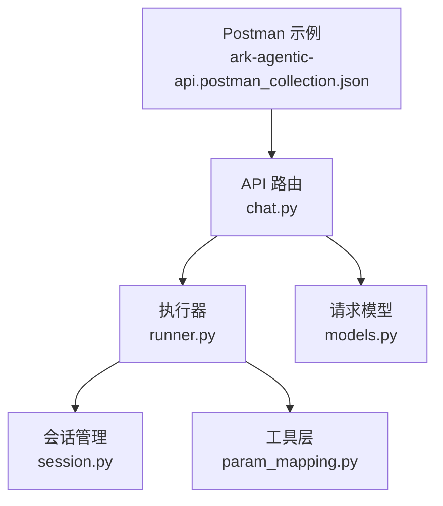
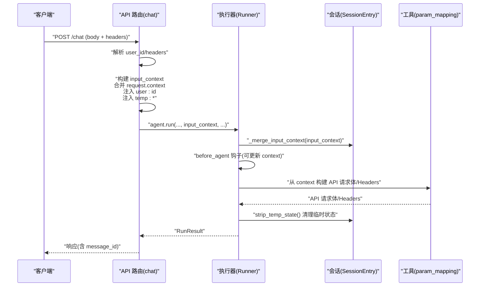
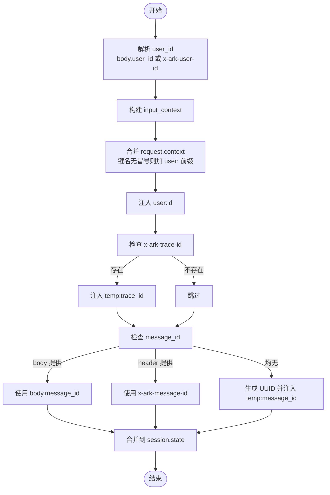
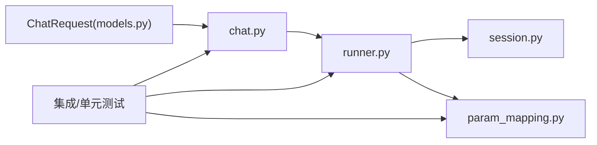

# 上下文注入

<cite>
**本文引用的文件**
- [chat.py](file://src/ark_agentic/api/chat.py)
- [models.py](file://src/ark_agentic/api/models.py)
- [runner.py](file://src/ark_agentic/core/runner.py)
- [session.py](file://src/ark_agentic/core/session.py)
- [param_mapping.py](file://src/ark_agentic/agents/securities/tools/service\param_mapping.py)
- [test_context_injection.py](file://tests/integration/test_context_injection.py)
- [test_chat_api.py](file://tests/integration/test_chat_api.py)
- [ark-agentic-api.postman_collection.json](file://postman/ark-agentic-api.postman_collection.json)
</cite>

## 目录
1. [简介](#简介)
2. [项目结构](#项目结构)
3. [核心组件](#核心组件)
4. [架构总览](#架构总览)
5. [详细组件分析](#详细组件分析)
6. [依赖分析](#依赖分析)
7. [性能考量](#性能考量)
8. [故障排查指南](#故障排查指南)
9. [结论](#结论)
10. [附录](#附录)

## 简介
本文件聚焦“上下文注入”机制，围绕以下目标展开：
- input_context 的构建流程：从请求中的 context 合并用户自定义上下文，并自动注入 user:id；同时处理头部信息 x-ark-user-id、x-ark-trace-id、x-ark-message-id 的优先级与用途。
- 临时上下文字段 temp:trace_id、temp:idempotency_key、temp:message_id 的作用与生命周期。
- 上下文键名命名约定：user: 前缀的使用规则与兼容裸键策略。
- 最佳实践与安全注意事项。
- 调试与监控上下文数据的方法。

## 项目结构
与上下文注入直接相关的模块分布如下：
- API 层：负责接收请求、解析头部、构造 input_context 并驱动执行。
- Runner 层：负责将 input_context 合并到会话状态、触发钩子、执行工具链路。
- 会话层：维护 session.state，提供临时状态清理与持久化。
- 工具层：提供从 context 构建 API 请求体与 headers 的能力，支持 user: 前缀优先策略。

图表来源
- [chat.py:27-177](file://src/ark_agentic/api/chat.py#L27-L177)
- [runner.py:312-590](file://src/ark_agentic/core/runner.py#L312-L590)
- [session.py:24-200](file://src/ark_agentic/core/session.py#L24-L200)
- [param_mapping.py:1-479](file://src/ark_agentic/agents/securities/tools/service\param_mapping.py#L1-L479)
- [models.py:27-60](file://src/ark_agentic/api/models.py#L27-L60)
- [ark-agentic-api.postman_collection.json:62-94](file://postman/ark-agentic-api.postman_collection.json#L62-L94)

章节来源
- [chat.py:27-177](file://src/ark_agentic/api/chat.py#L27-L177)
- [runner.py:312-590](file://src/ark_agentic/core/runner.py#L312-L590)
- [session.py:24-200](file://src/ark_agentic/core/session.py#L24-L200)
- [param_mapping.py:1-479](file://src/ark_agentic/agents/securities/tools/service\param_mapping.py#L1-L479)
- [models.py:27-60](file://src/ark_agentic/api/models.py#L27-L60)
- [ark-agentic-api.postman_collection.json:62-94](file://postman/ark-agentic-api.postman_collection.json#L62-L94)

## 核心组件
- API 路由 chat：解析请求与头部，构建 input_context，选择/创建会话，调用 Runner 执行。
- Runner：将 input_context 合并到 session.state，触发钩子，执行工具链路，最终清理临时状态。
- 会话 SessionEntry：提供 state 更新、临时状态清理、持久化。
- 工具层 param_mapping：从 context 构建 API 请求体与 headers，支持 user: 前缀优先策略。
- 请求模型 ChatRequest：定义请求字段，包括 context、idempotency_key、message_id 等。

章节来源
- [chat.py:27-177](file://src/ark_agentic/api/chat.py#L27-L177)
- [runner.py:584-590](file://src/ark_agentic/core/runner.py#L584-L590)
- [session.py:410-421](file://src/ark_agentic/core/session.py#L410-L421)
- [param_mapping.py:13-35](file://src/ark_agentic/agents/securities/tools/service\param_mapping.py#L13-L35)
- [models.py:27-60](file://src/ark_agentic/api/models.py#L27-L60)

## 架构总览
下面的序列图展示了从请求到执行器的上下文注入与使用流程。

图表来源
- [chat.py:27-177](file://src/ark_agentic/api/chat.py#L27-L177)
- [runner.py:406-590](file://src/ark_agentic/core/runner.py#L406-L590)
- [param_mapping.py:38-118](file://src/ark_agentic/agents/securities/tools/service\param_mapping.py#L38-L118)

## 详细组件分析

### input_context 的构建与合并
- 来源与合并策略
  - request.context：逐项遍历，若键名不含冒号，则自动加前缀 "user:" 再注入；若已含冒号则保持原样。
  - user:id：强制注入，优先使用 body.user_id，否则回退到 x-ark-user-id。
  - 临时字段：
    - temp:trace_id：当 x-ark-trace-id 存在时注入。
    - temp:idempotency_key：当 request.idempotency_key 存在时注入。
    - temp:message_id：当请求未提供 message_id 时，优先使用 x-ark-message-id，否则自动生成 UUID，并注入 temp:message_id。
- 合并到会话
  - Runner._merge_input_context 将 input_context 的键值全部写入 session.state，覆盖既有值。
  - 运行结束后，Runner._finalize_run 调用 session.strip_temp_state 移除以 temp: 开头的键，避免污染长期状态。

图表来源
- [chat.py:48-58](file://src/ark_agentic/api/chat.py#L48-L58)
- [runner.py:584-590](file://src/ark_agentic/core/runner.py#L584-L590)

章节来源
- [chat.py:48-58](file://src/ark_agentic/api/chat.py#L48-L58)
- [runner.py:584-590](file://src/ark_agentic/core/runner.py#L584-L590)

### 头部信息处理与优先级
- x-ark-user-id：用于提供 user_id，优先级高于 body.user_id。
- x-ark-trace-id：用于注入 temp:trace_id，便于跨服务追踪。
- x-ark-message-id：用于提供 message_id，优先级高于 body.message_id；若两者都不存在，则自动生成 UUID 并注入 temp:message_id。
- x-ark-session-id：用于提供 session_id；若缺失则创建新会话并写入 session.state["user:id"]。

章节来源
- [chat.py:30-33](file://src/ark_agentic/api/chat.py#L30-L33)
- [chat.py:40-61](file://src/ark_agentic/api/chat.py#L40-L61)
- [test_chat_api.py:108-161](file://tests/integration/test_chat_api.py#L108-L161)
- [ark-agentic-api.postman_collection.json:71-78](file://postman/ark-agentic-api.postman_collection.json#L71-L78)

### 临时上下文字段的作用
- temp:trace_id：来自 x-ark-trace-id，用于关联跨服务调用链路，便于日志与可观测性。
- temp:idempotency_key：来自 request.idempotency_key，用于幂等性控制，避免重复执行。
- temp:message_id：来自 x-ark-message-id 或自动生成的 UUID，用于响应与事件标识。
- 生命周期：在 Runner._finalize_run 中通过 session.strip_temp_state 清理，确保不会持久化到会话状态。

章节来源
- [chat.py:54-58](file://src/ark_agentic/api/chat.py#L54-L58)
- [runner.py:489-491](file://src/ark_agentic/core/runner.py#L489-L491)
- [runner.py:515](file://src/ark_agentic/core/runner.py#L515)

### 上下文键名命名约定与兼容策略
- user: 前缀：推荐使用 user: 前缀的键名，例如 user:id、user:token_id、user:account_type。
- 兼容裸键：当 user: 前缀不存在时，工具层会回退到裸键（如 token_id）读取。
- 优先级：user: 前缀优先于裸键；context 预处理阶段会将 validatedata 解析为 user: 前缀字段，且不会覆盖已存在的显式字段。
- 示例验证：单元测试覆盖了 user: 前缀优先、裸键回退、以及 validatedata 字段注入场景。

章节来源
- [chat.py:50-53](file://src/ark_agentic/api/chat.py#L50-L53)
- [param_mapping.py:13-35](file://src/ark_agentic/agents/securities/tools/service\param_mapping.py#L13-L35)
- [param_mapping.py:210-235](file://src/ark_agentic/agents/securities/tools/service\param_mapping.py#L210-L235)
- [test_context_injection.py:65-84](file://tests/integration/test_context_injection.py#L65-L84)

### 从上下文构建 API 请求体与 Headers
- build_api_request：根据配置从 context 构建 API 请求体，支持静态值、上下文取值、转换函数；仅在非 None 值时设置。
- build_api_headers：从 context 构建 API Headers，同样支持 user: 前缀优先策略。
- validatedata 支持：提供 build_validatedata 与 build_api_headers_with_validatedata，用于签名与认证场景。

章节来源
- [param_mapping.py:38-118](file://src/ark_agentic/agents/securities/tools/service\param_mapping.py#L38-L118)
- [param_mapping.py:238-302](file://src/ark_agentic/agents/securities/tools/service\param_mapping.py#L238-L302)

### 会话状态与临时状态清理
- session.state：保存上下文键值，覆盖语义；工具与钩子可读取。
- strip_temp_state：在运行结束时移除以 temp: 开头的键，避免污染长期状态。
- 临时键 temp:user_input：在准备阶段写入，便于工具访问当前用户输入。

章节来源
- [runner.py:584-590](file://src/ark_agentic/core/runner.py#L584-L590)
- [runner.py:489-491](file://src/ark_agentic/core/runner.py#L489-L491)
- [runner.py:515](file://src/ark_agentic/core/runner.py#L515)
- [session.py:410-421](file://src/ark_agentic/core/session.py#L410-L421)

## 依赖分析
- API 路由依赖请求模型 ChatRequest，解析 user_id、message_id、context、idempotency_key 等字段。
- Runner 依赖 SessionManager，负责创建/加载会话、合并上下文、清理临时状态。
- 工具层 param_mapping 依赖 context 前缀策略，保证 user: 前缀优先。
- 测试覆盖了头部优先级、上下文注入、validatedata 字段注入等关键行为。

图表来源
- [models.py:27-60](file://src/ark_agentic/api/models.py#L27-L60)
- [chat.py:27-177](file://src/ark_agentic/api/chat.py#L27-L177)
- [runner.py:312-590](file://src/ark_agentic/core/runner.py#L312-L590)
- [session.py:24-200](file://src/ark_agentic/core/session.py#L24-L200)
- [param_mapping.py:1-479](file://src/ark_agentic/agents/securities/tools/service\param_mapping.py#L1-L479)

章节来源
- [models.py:27-60](file://src/ark_agentic/api/models.py#L27-L60)
- [chat.py:27-177](file://src/ark_agentic/api/chat.py#L27-L177)
- [runner.py:312-590](file://src/ark_agentic/core/runner.py#L312-L590)
- [session.py:24-200](file://src/ark_agentic/core/session.py#L24-L200)
- [param_mapping.py:1-479](file://src/ark_agentic/agents/securities/tools/service\param_mapping.py#L1-L479)

## 性能考量
- 上下文合并为纯字典操作，复杂度 O(n)，n 为 input_context 键数量。
- 临时状态清理为一次过滤操作，复杂度 O(m)，m 为 session.state 键数量。
- 工具层从 context 构建请求体/Headers 为线性扫描，复杂度 O(k)，k 为配置项数量。
- 建议：
  - 控制 input_context 键数量，避免冗余字段。
  - 使用 user: 前缀统一键名，减少回退查找成本。
  - 对于大量工具调用，注意幂等键与去重策略，避免重复计算。

[本节为通用建议，无需特定文件来源]

## 故障排查指南
- 缺少 user_id
  - 现象：请求被拒绝，返回错误提示要求提供 user_id。
  - 排查：确认 body.user_id 或 x-ark-user-id 至少提供其一。
  - 参考
    - [chat.py:40-43](file://src/ark_agentic/api/chat.py#L40-L43)
    - [test_chat_api.py:102-106](file://tests/integration/test_chat_api.py#L102-L106)
- message_id 优先级异常
  - 现象：响应中的 message_id 与预期不符。
  - 排查：确认 body.message_id 与 x-ark-message-id 的优先级关系；若两者都存在，body 优先。
  - 参考
    - [chat.py:45-46](file://src/ark_agentic/api/chat.py#L45-L46)
    - [test_chat_api.py:148-160](file://tests/integration/test_chat_api.py#L148-L160)
- 临时状态未清理
  - 现象：会话状态中残留 temp:* 键。
  - 排查：确认 Runner._finalize_run 是否被调用；检查 strip_temp_state 是否执行。
  - 参考
    - [runner.py:515](file://src/ark_agentic/core/runner.py#L515)
    - [session.py:419-421](file://src/ark_agentic/core/session.py#L419-L421)
- user: 前缀未生效
  - 现象：工具读取到裸键而非 user: 前缀键。
  - 排查：确认 input_context 中是否同时存在 user:xxx 与 xxx；前者优先。
  - 参考
    - [param_mapping.py:13-35](file://src/ark_agentic/agents/securities/tools/service\param_mapping.py#L13-L35)
    - [test_context_injection.py:65-84](file://tests/integration/test_context_injection.py#L65-L84)

章节来源
- [chat.py:40-43](file://src/ark_agentic/api/chat.py#L40-L43)
- [chat.py:45-46](file://src/ark_agentic/api/chat.py#L45-L46)
- [runner.py:515](file://src/ark_agentic/core/runner.py#L515)
- [session.py:419-421](file://src/ark_agentic/core/session.py#L419-L421)
- [param_mapping.py:13-35](file://src/ark_agentic/agents/securities/tools/service\param_mapping.py#L13-L35)
- [test_chat_api.py:102-106](file://tests/integration/test_chat_api.py#L102-L106)
- [test_chat_api.py:148-160](file://tests/integration/test_chat_api.py#L148-L160)
- [test_context_injection.py:65-84](file://tests/integration/test_context_injection.py#L65-L84)

## 结论
- input_context 的构建遵循“先合并 request.context（键名无冒号自动加 user: 前缀），再注入 user:id，最后注入临时字段”的顺序。
- 头部优先级明确：x-ark-user-id > body.user_id；x-ark-message-id > body.message_id；x-ark-trace-id 仅注入 temp:trace_id。
- user: 前缀策略确保工具层读取的一致性，且不会覆盖已存在的显式字段。
- 临时状态在运行结束后自动清理，避免污染会话状态。
- 建议在生产环境严格使用 user: 前缀、合理设置幂等键与 trace_id，配合可观测性工具进行调试与监控。

[本节为总结，无需特定文件来源]

## 附录

### 最佳实践与安全注意事项
- 键名规范
  - 优先使用 user: 前缀，避免裸键冲突。
  - 对于工具层需要的字段，统一使用 user:xxx 形式。
- 临时状态
  - 仅使用 temp:* 作为运行期临时键，不要期望其持久化。
- 幂等性
  - 使用 idempotency_key 防止重复请求；服务端应基于该键去重。
- 安全
  - 不要在上下文中传递敏感信息；如需传递，务必加密或走受控通道。
  - 严格校验 validatedata 字段，避免伪造或缺失导致的认证失败。

[本节为通用建议，无需特定文件来源]

### 调试与监控上下文数据的方法
- 日志与追踪
  - 使用 x-ark-trace-id 关联跨服务调用链，便于定位问题。
  - 在 Runner._prepare_session 中会将 temp:trace_id 写入 run_metadata，可用于可观测性上报。
- 本地调试
  - 使用 Postman 发送请求，设置 x-ark-* 头部，观察响应中的 message_id 与会话状态。
  - 参考 Postman 集合中的示例请求。
- 单元/集成测试
  - 通过测试用例验证 user: 前缀优先、message_id 优先级、validatedata 字段注入等行为。

章节来源
- [chat.py:54-58](file://src/ark_agentic/api/chat.py#L54-L58)
- [runner.py:332-340](file://src/ark_agentic/core/runner.py#L332-L340)
- [ark-agentic-api.postman_collection.json:62-94](file://postman/ark-agentic-api.postman_collection.json#L62-L94)
- [test_chat_api.py:108-161](file://tests/integration/test_chat_api.py#L108-L161)
- [test_context_injection.py:15-95](file://tests/integration/test_context_injection.py#L15-L95)