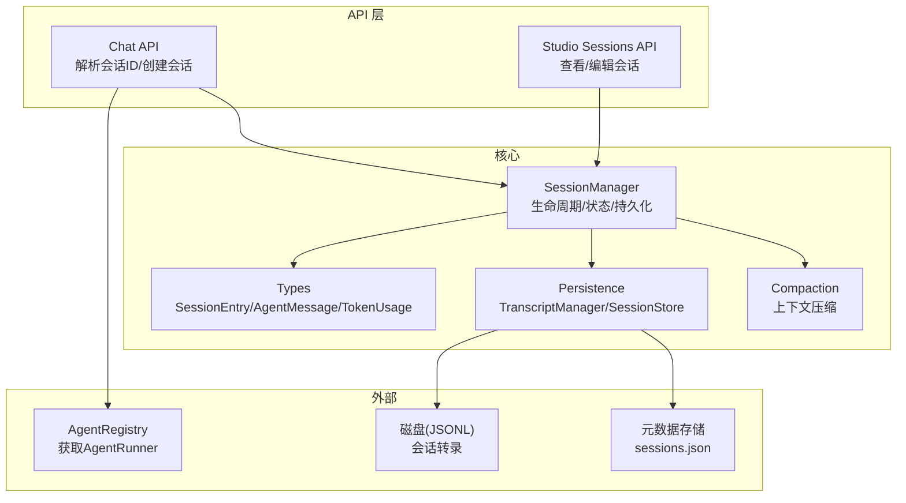
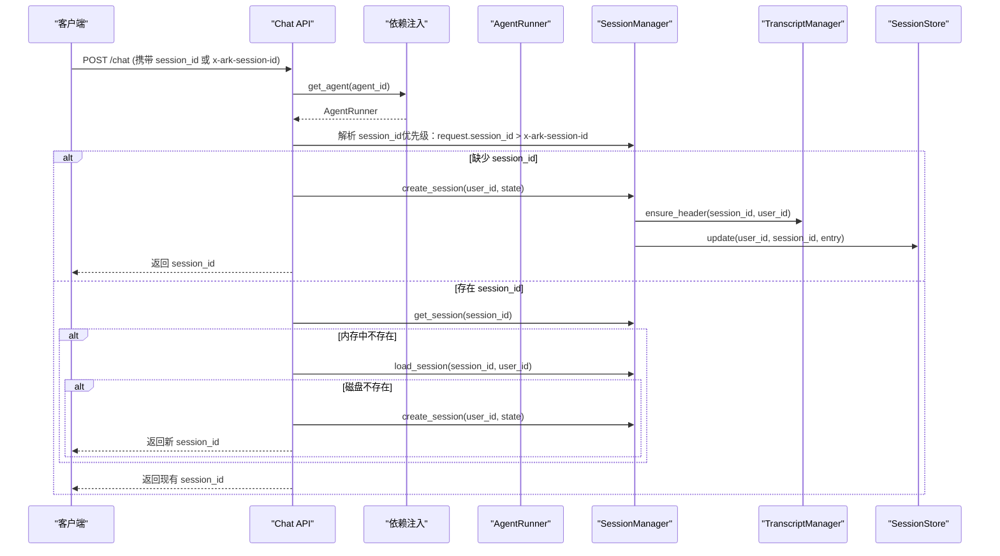
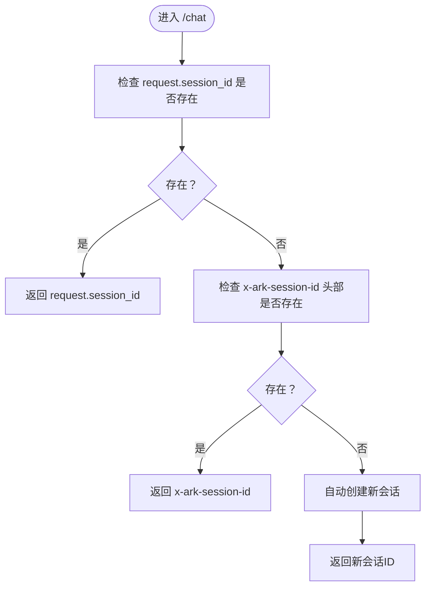
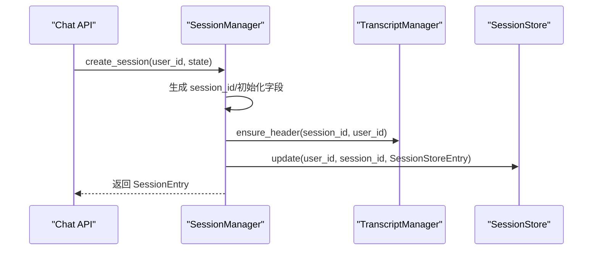
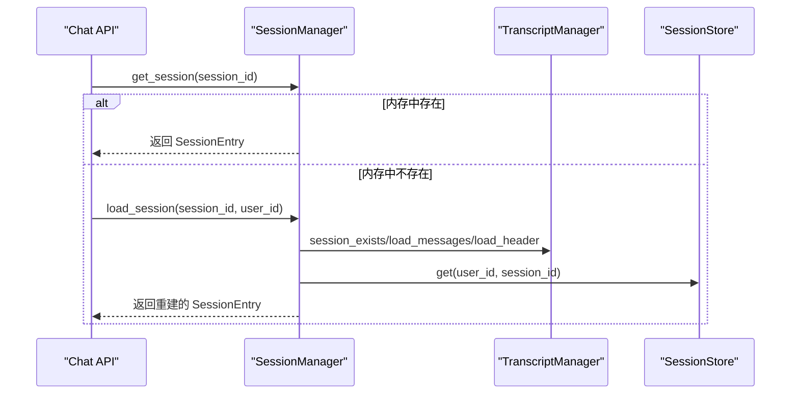
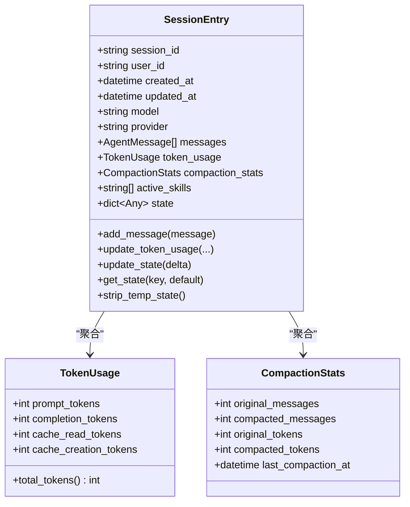
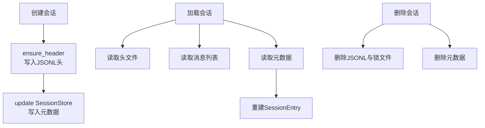
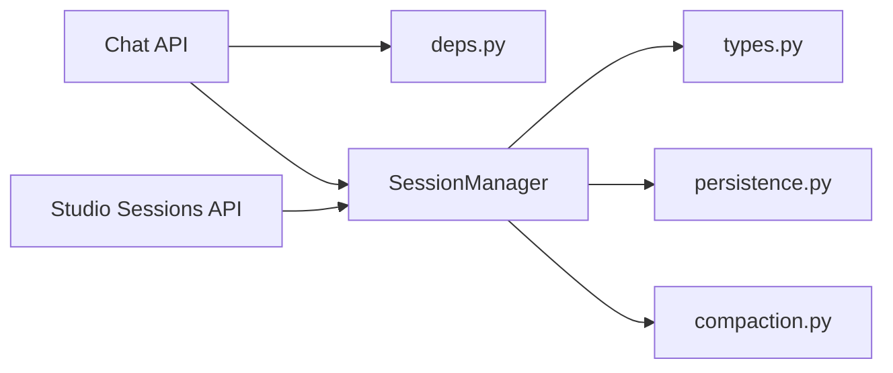

# 会话管理

<cite>
**本文引用的文件**
- [session.py](file://src/ark_agentic/core/session.py)
- [chat.py](file://src/ark_agentic/api/chat.py)
- [sessions.py](file://src/ark_agentic/studio/api/sessions.py)
- [models.py](file://src/ark_agentic/api/models.py)
- [types.py](file://src/ark_agentic/core/types.py)
- [persistence.py](file://src/ark_agentic/core/persistence.py)
- [deps.py](file://src/ark_agentic/api/deps.py)
- [compaction.py](file://src/ark_agentic/core/compaction.py)
- [test_session.py](file://tests/unit/core/test_session.py)
- [test_studio_sessions_memory.py](file://tests/integration/test_studio_sessions_memory.py)
</cite>

## 目录
1. [简介](#简介)
2. [项目结构](#项目结构)
3. [核心组件](#核心组件)
4. [架构概览](#架构概览)
5. [详细组件分析](#详细组件分析)
6. [依赖分析](#依赖分析)
7. [性能考虑](#性能考虑)
8. [故障排查指南](#故障排查指南)
9. [结论](#结论)
10. [附录](#附录)

## 简介
本文件系统性阐述会话管理系统的实现与使用，重点覆盖：
- 会话 ID 解析优先级：request.session_id > x-ark-session-id 头部 > 自动生成
- 会话创建流程：缺失时自动创建新会话并初始化用户状态
- 会话加载机制：会话不存在时尝试从磁盘加载，支持代理切换场景
- 会话状态管理、生命周期与持久化策略
- 会话 ID 生成规则与会话状态数据结构
- 会话过期处理与清理机制

## 项目结构
会话管理相关代码主要分布在以下模块：
- API 层：负责会话 ID 解析与会话创建/加载
- 核心会话管理器：负责会话生命周期、状态与持久化
- 持久化层：负责 JSONL 转录与元数据存储
- 类型定义：会话条目、消息、Token 使用统计等
- Studio API：会话查看与编辑（仅读写磁盘 JSONL）

图表来源
- [chat.py:27-177](file://src/ark_agentic/api/chat.py#L27-L177)
- [sessions.py:84-200](file://src/ark_agentic/studio/api/sessions.py#L84-L200)
- [session.py:24-482](file://src/ark_agentic/core/session.py#L24-L482)
- [persistence.py:392-787](file://src/ark_agentic/core/persistence.py#L392-L787)
- [types.py:350-422](file://src/ark_agentic/core/types.py#L350-L422)
- [compaction.py:421-518](file://src/ark_agentic/core/compaction.py#L421-L518)

章节来源
- [chat.py:27-177](file://src/ark_agentic/api/chat.py#L27-L177)
- [sessions.py:84-200](file://src/ark_agentic/studio/api/sessions.py#L84-L200)
- [session.py:24-482](file://src/ark_agentic/core/session.py#L24-L482)
- [persistence.py:392-787](file://src/ark_agentic/core/persistence.py#L392-L787)
- [types.py:350-422](file://src/ark_agentic/core/types.py#L350-L422)
- [compaction.py:421-518](file://src/ark_agentic/core/compaction.py#L421-L518)

## 核心组件
- 会话管理器（SessionManager）
  - 负责会话创建、加载、删除、消息管理、状态更新、上下文压缩、持久化同步
  - 提供同步/异步两种接口，满足不同场景
- 会话条目（SessionEntry）
  - 会话标识、用户标识、模型配置、消息历史、Token 使用统计、压缩统计、活跃技能、会话状态
- 持久化组件
  - TranscriptManager：JSONL 转录文件管理（头/消息/锁/校验）
  - SessionStore：用户维度的会话元数据存储（sessions.json）
- 类型与工具
  - AgentMessage、ToolCall、ToolResult、TokenUsage、CompactionStats
  - 上下文压缩器（ContextCompactor）、摘要生成器（SimpleSummarizer/LLMSummarizer）

章节来源
- [session.py:24-482](file://src/ark_agentic/core/session.py#L24-L482)
- [types.py:350-422](file://src/ark_agentic/core/types.py#L350-L422)
- [persistence.py:392-787](file://src/ark_agentic/core/persistence.py#L392-L787)
- [compaction.py:421-518](file://src/ark_agentic/core/compaction.py#L421-L518)

## 架构概览
会话管理采用“API -> 会话管理器 -> 持久化”的分层设计。API 层负责输入解析与路由，会话管理器负责业务逻辑与状态维护，持久化层负责磁盘与元数据存储。

图表来源
- [chat.py:27-177](file://src/ark_agentic/api/chat.py#L27-L177)
- [deps.py:25-37](file://src/ark_agentic/api/deps.py#L25-L37)
- [session.py:40-227](file://src/ark_agentic/core/session.py#L40-L227)
- [persistence.py:428-597](file://src/ark_agentic/core/persistence.py#L428-L597)

## 详细组件分析

### 会话 ID 解析优先级
- 优先级顺序：request.session_id > x-ark-session-id 头部 > 自动生成
- 若两者均为空，则自动创建新会话并返回其 ID
- 该逻辑确保客户端可显式传入会话 ID，也可通过头部传递，若都未提供则自动创建

图表来源
- [chat.py:60-80](file://src/ark_agentic/api/chat.py#L60-L80)

章节来源
- [chat.py:60-80](file://src/ark_agentic/api/chat.py#L60-L80)

### 会话创建流程
- 当缺少会话 ID 时，API 层调用 SessionManager.create_session(user_id, state)
- 创建流程包括：
  - 生成唯一 session_id（UUID）
  - 初始化 user_id、模型与提供方、状态（state）
  - 确保会话头文件存在（TranscriptManager.ensure_header）
  - 写入会话元数据（SessionStore.update）
  - 记录日志并返回 SessionEntry

图表来源
- [session.py:40-67](file://src/ark_agentic/core/session.py#L40-L67)
- [persistence.py:428-443](file://src/ark_agentic/core/persistence.py#L428-L443)
- [persistence.py:750-766](file://src/ark_agentic/core/persistence.py#L750-L766)

章节来源
- [session.py:40-67](file://src/ark_agentic/core/session.py#L40-L67)
- [persistence.py:428-443](file://src/ark_agentic/core/persistence.py#L428-L443)
- [persistence.py:750-766](file://src/ark_agentic/core/persistence.py#L750-L766)

### 会话加载机制
- 若 request.session_id 存在但内存中不存在，尝试从磁盘加载
- 若磁盘也不存在，记录警告并创建新会话（常见于代理切换场景）
- 加载流程包括：读取消息、头文件、元数据，重建 SessionEntry 并缓存到内存

图表来源
- [chat.py:67-79](file://src/ark_agentic/api/chat.py#L67-L79)
- [session.py:184-227](file://src/ark_agentic/core/session.py#L184-L227)
- [persistence.py:488-597](file://src/ark_agentic/core/persistence.py#L488-L597)

章节来源
- [chat.py:67-79](file://src/ark_agentic/api/chat.py#L67-L79)
- [session.py:184-227](file://src/ark_agentic/core/session.py#L184-L227)
- [persistence.py:488-597](file://src/ark_agentic/core/persistence.py#L488-L597)

### 会话状态管理
- 状态字段：state（ADK-style session scratchpad）
- 更新方式：update_state/delta 合并，自动更新 updated_at
- 临时状态：strip_temp_state 可移除以 temp: 开头的临时键
- 活跃技能：active_skills 字段，支持设置/获取
- Token 使用：prompt_tokens/completion_tokens/cache_* 统计

图表来源
- [types.py:350-422](file://src/ark_agentic/core/types.py#L350-L422)

章节来源
- [types.py:350-422](file://src/ark_agentic/core/types.py#L350-L422)

### 会话生命周期与持久化策略
- 生命周期
  - 创建：create_session（异步落盘）/ create_session_sync（仅内存）
  - 加载：load_session（从磁盘重建）
  - 删除：delete_session（内存+磁盘）/ delete_session_sync（仅内存）
  - 列表：list_sessions（内存）/ list_sessions_from_disk（磁盘为准）
- 持久化策略
  - 转录文件：JSONL，包含头（SessionHeader）与消息（MessageEntry）
  - 元数据：每个用户目录下的 sessions.json，记录会话元信息与 Token 统计
  - 文件锁：跨平台文件锁，避免并发写冲突
  - 同步：sync_session_state 将内存状态写回元数据

图表来源
- [session.py:40-121](file://src/ark_agentic/core/session.py#L40-L121)
- [session.py:184-227](file://src/ark_agentic/core/session.py#L184-L227)
- [persistence.py:428-597](file://src/ark_agentic/core/persistence.py#L428-L597)
- [persistence.py:688-787](file://src/ark_agentic/core/persistence.py#L688-L787)

章节来源
- [session.py:40-121](file://src/ark_agentic/core/session.py#L40-L121)
- [session.py:184-227](file://src/ark_agentic/core/session.py#L184-L227)
- [persistence.py:428-597](file://src/ark_agentic/core/persistence.py#L428-L597)
- [persistence.py:688-787](file://src/ark_agentic/core/persistence.py#L688-L787)

### 会话 ID 生成规则
- 自动生成：SessionEntry.create 使用 UUID 生成唯一 session_id
- 自定义 ID：create_session_sync 支持传入自定义 session_id（如子任务格式 parent:sub:hex）
- 用户 ID：可设置 user_id，常用于子任务继承父会话用户

章节来源
- [types.py:382-391](file://src/ark_agentic/core/types.py#L382-L391)
- [session.py:69-92](file://src/ark_agentic/core/session.py#L69-L92)

### 会话过期处理与清理机制
- 过期处理：代码库未发现显式“会话过期”逻辑
- 清理机制：
  - 删除会话：delete_session（内存+磁盘）
  - 文件锁：FileLock 跨平台锁，支持过期检测与清理
  - 元数据缓存：SessionStore 内置 TTL 缓存，避免频繁读取

章节来源
- [session.py:103-121](file://src/ark_agentic/core/session.py#L103-L121)
- [persistence.py:264-387](file://src/ark_agentic/core/persistence.py#L264-L387)
- [persistence.py:688-701](file://src/ark_agentic/core/persistence.py#L688-L701)

### Studio 会话查看与编辑
- 列表：以磁盘为准，支持按 user_id 过滤
- 详情：读取内存或磁盘重建，返回消息与状态
- Raw 读写：直接读取/写回 JSONL，写回前进行严格校验

章节来源
- [sessions.py:84-200](file://src/ark_agentic/studio/api/sessions.py#L84-L200)
- [persistence.py:592-635](file://src/ark_agentic/core/persistence.py#L592-L635)

## 依赖分析
- API 依赖
  - Chat API 依赖 AgentRegistry（通过 deps.py）获取 AgentRunner
  - Chat API 依赖 SessionManager 进行会话解析与创建/加载
- 核心依赖
  - SessionManager 依赖 TranscriptManager 与 SessionStore 进行持久化
  - SessionManager 依赖 Compaction 进行上下文压缩
- 类型依赖
  - SessionEntry 依赖 AgentMessage、TokenUsage、CompactionStats

图表来源
- [chat.py:19-21](file://src/ark_agentic/api/chat.py#L19-L21)
- [deps.py:25-37](file://src/ark_agentic/api/deps.py#L25-L37)
- [session.py:24-36](file://src/ark_agentic/core/session.py#L24-L36)
- [types.py:350-422](file://src/ark_agentic/core/types.py#L350-L422)
- [persistence.py:392-418](file://src/ark_agentic/core/persistence.py#L392-L418)
- [compaction.py:421-432](file://src/ark_agentic/core/compaction.py#L421-L432)
- [sessions.py:17-19](file://src/ark_agentic/studio/api/sessions.py#L17-L19)

章节来源
- [chat.py:19-21](file://src/ark_agentic/api/chat.py#L19-L21)
- [deps.py:25-37](file://src/ark_agentic/api/deps.py#L25-L37)
- [session.py:24-36](file://src/ark_agentic/core/session.py#L24-L36)
- [types.py:350-422](file://src/ark_agentic/core/types.py#L350-L422)
- [persistence.py:392-418](file://src/ark_agentic/core/persistence.py#L392-L418)
- [compaction.py:421-432](file://src/ark_agentic/core/compaction.py#L421-L432)
- [sessions.py:17-19](file://src/ark_agentic/studio/api/sessions.py#L17-L19)

## 性能考虑
- 上下文压缩
  - 使用 ContextCompactor 估算 token 并按阈值触发压缩
  - 支持自适应分块与摘要生成，降低历史消息占用
- Token 估算
  - 提供简化估算函数，生产建议使用更精确的 tokenizer
- 文件锁与并发
  - FileLock 支持跨平台锁，避免并发写冲突
- 元数据缓存
  - SessionStore 内置 TTL 缓存，减少频繁读取

章节来源
- [compaction.py:442-457](file://src/ark_agentic/core/compaction.py#L442-L457)
- [compaction.py:458-518](file://src/ark_agentic/core/compaction.py#L458-L518)
- [persistence.py:264-387](file://src/ark_agentic/core/persistence.py#L264-L387)
- [persistence.py:688-701](file://src/ark_agentic/core/persistence.py#L688-L701)

## 故障排查指南
- 会话未找到
  - 检查 request.session_id 与 x-ark-session-id 是否正确传递
  - 确认会话是否存在于磁盘（Studio API 可验证）
- 代理切换导致会话丢失
  - API 层会在磁盘不存在时自动创建新会话，注意区分“新会话”与“旧会话”
- JSONL 校验错误
  - Studio API 的 Raw 写入会进行严格校验，错误包含行号信息
- 并发写冲突
  - 检查文件锁是否被长时间占用，确认锁文件是否过期

章节来源
- [chat.py:72-79](file://src/ark_agentic/api/chat.py#L72-L79)
- [sessions.py:190-198](file://src/ark_agentic/studio/api/sessions.py#L190-L198)
- [persistence.py:598-635](file://src/ark_agentic/core/persistence.py#L598-L635)
- [persistence.py:287-357](file://src/ark_agentic/core/persistence.py#L287-L357)

## 结论
本会话管理系统通过清晰的分层设计与完善的持久化机制，提供了可靠的会话 ID 解析、创建、加载与状态管理能力。API 层遵循明确的优先级策略，核心会话管理器承担生命周期与状态职责，持久化层保证数据一致性与可靠性。结合上下文压缩与元数据缓存，系统在性能与可用性之间取得平衡。

## 附录
- 关键实现路径
  - 会话 ID 解析与创建：[chat.py:60-80](file://src/ark_agentic/api/chat.py#L60-L80)
  - 会话加载与代理切换：[chat.py:67-79](file://src/ark_agentic/api/chat.py#L67-L79)
  - 会话管理器接口：[session.py:40-227](file://src/ark_agentic/core/session.py#L40-L227)
  - 持久化与文件锁：[persistence.py:428-597](file://src/ark_agentic/core/persistence.py#L428-L597)
  - 类型定义：[types.py:350-422](file://src/ark_agentic/core/types.py#L350-L422)
  - Studio 会话 API：[sessions.py:84-200](file://src/ark_agentic/studio/api/sessions.py#L84-L200)
- 测试参考
  - 会话管理单元测试：[test_session.py:1-266](file://tests/unit/core/test_session.py#L1-L266)
  - Studio 会话与内存 API 集成测试：[test_studio_sessions_memory.py:1-330](file://tests/integration/test_studio_sessions_memory.py#L1-L330)