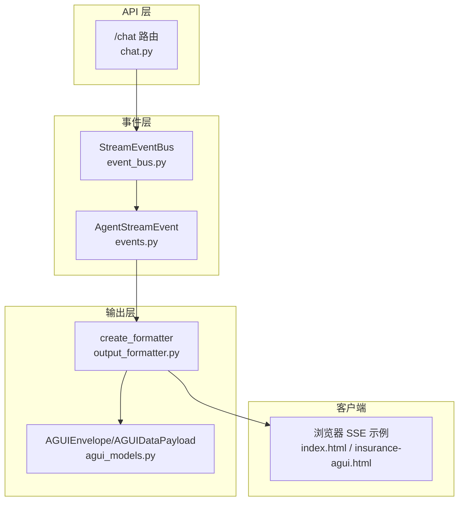
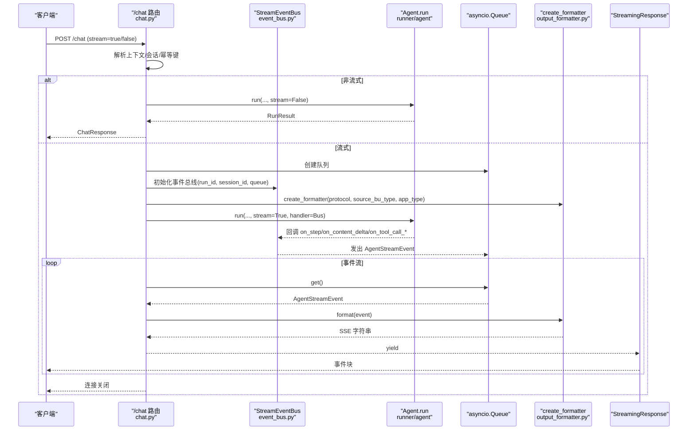
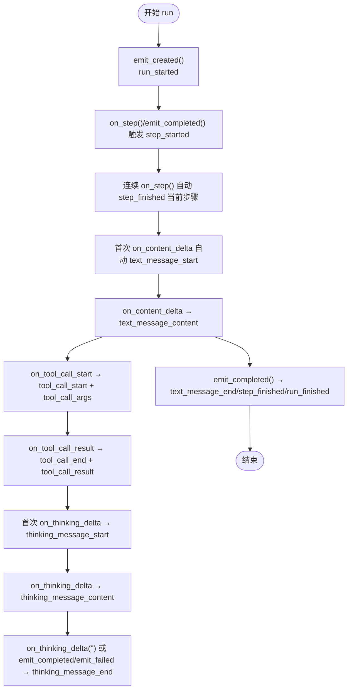
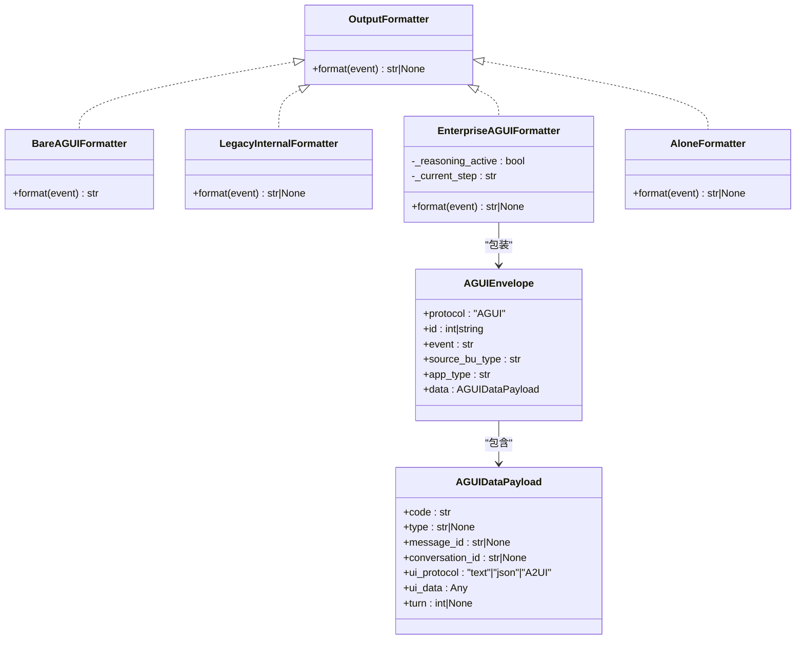
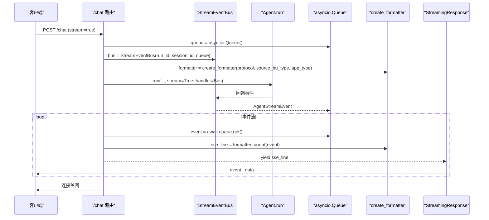
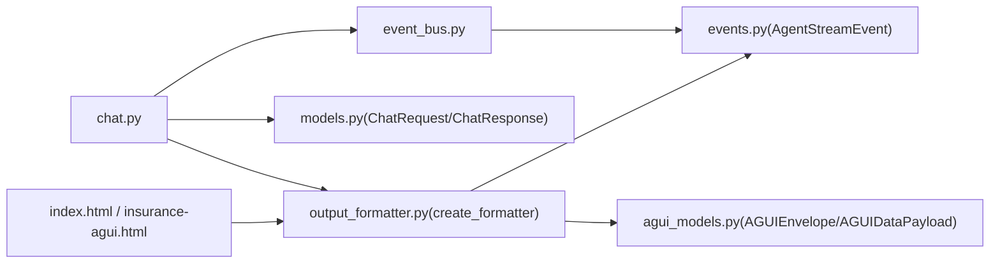

# 流式响应机制

<cite>
**本文引用的文件**
- [chat.py](file://src/ark_agentic/api/chat.py)
- [event_bus.py](file://src/ark_agentic/core/stream/event_bus.py)
- [events.py](file://src/ark_agentic/core/stream/events.py)
- [output_formatter.py](file://src/ark_agentic/core/stream/output_formatter.py)
- [agui_models.py](file://src/ark_agentic/core/stream/agui_models.py)
- [models.py](file://src/ark_agentic/api/models.py)
- [index.html](file://src/ark_agentic/static/index.html)
- [insurance-agui.html](file://src/ark_agentic/static/insurance-agui.html)
- [test_chat_api.py](file://tests/integration/test_chat_api.py)
- [test_event_bus.py](file://tests/unit/core/test_event_bus.py)
- [test_output_formatter.py](file://tests/unit/core/test_output_formatter.py)
</cite>

## 目录
1. [简介](#简介)
2. [项目结构](#项目结构)
3. [核心组件](#核心组件)
4. [架构总览](#架构总览)
5. [详细组件分析](#详细组件分析)
6. [依赖关系分析](#依赖关系分析)
7. [性能考虑](#性能考虑)
8. [故障排查指南](#故障排查指南)
9. [结论](#结论)
10. [附录](#附录)

## 简介
本文件面向“流式响应机制”，聚焦于 /chat 端点的 SSE（Server-Sent Events）实现，系统性阐述：
- StreamEventBus 的事件类型与生命周期管理
- 事件数据结构与格式
- 输出格式器 create_formatter 的工作机制与多协议适配
- 客户端连接示例、事件监听代码与错误处理策略
- 性能优化建议与最佳实践

## 项目结构
围绕流式响应的关键模块分布如下：
- API 层：/chat 路由，负责接收请求、构建上下文、启动异步任务、将事件序列化为 SSE
- 事件总线：将 Runner 回调转化为 AG-UI 原生事件并入队
- 事件模型：统一的 AgentStreamEvent 结构，承载所有事件字段
- 输出格式化器：将 AG-UI 事件适配到不同传输协议（agui/internal/enterprise/alone）
- 企业信封模型：AGUIEnvelope/AGUIDataPayload，用于企业协议包装
- 客户端示例：静态 HTML 页面演示如何消费 SSE 事件
- 测试：覆盖事件总线生命周期、格式化器映射、API 行为契约

图表来源
- [chat.py:27-177](file://src/ark_agentic/api/chat.py#L27-L177)
- [event_bus.py:67-248](file://src/ark_agentic/core/stream/event_bus.py#L67-L248)
- [events.py:67-116](file://src/ark_agentic/core/stream/events.py#L67-L116)
- [output_formatter.py:427-444](file://src/ark_agentic/core/stream/output_formatter.py#L427-L444)
- [agui_models.py:16-51](file://src/ark_agentic/core/stream/agui_models.py#L16-L51)
- [index.html:1295-1363](file://src/ark_agentic/static/index.html#L1295-L1363)
- [insurance-agui.html:1120-1157](file://src/ark_agentic/static/insurance-agui.html#L1120-L1157)

章节来源
- [chat.py:27-177](file://src/ark_agentic/api/chat.py#L27-L177)
- [event_bus.py:67-248](file://src/ark_agentic/core/stream/event_bus.py#L67-L248)
- [events.py:67-116](file://src/ark_agentic/core/stream/events.py#L67-L116)
- [output_formatter.py:427-444](file://src/ark_agentic/core/stream/output_formatter.py#L427-L444)
- [agui_models.py:16-51](file://src/ark_agentic/core/stream/agui_models.py#L16-L51)
- [index.html:1295-1363](file://src/ark_agentic/static/index.html#L1295-L1363)
- [insurance-agui.html:1120-1157](file://src/ark_agentic/static/insurance-agui.html#L1120-L1157)

## 核心组件
- /chat 路由：接收 ChatRequest，解析上下文与会话，按是否 stream 决定同步或异步路径；异步路径通过 asyncio.Queue 与 OutputFormatter 生成 SSE
- StreamEventBus：将 Runner 回调映射为 AG-UI 原生事件，自动配对 step/text/thinking 的 start/finish，提供 emit_created/emit_completed/emit_failed 生命周期事件
- AgentStreamEvent：统一事件模型，包含 type、seq、run_id、session_id 以及各类事件专属字段
- OutputFormatter：工厂创建不同协议格式化器（agui/internal/enterprise/alone），将事件序列化为 SSE 字符串
- AGUIEnvelope/AGUIDataPayload：企业协议包装，承载 ui_protocol/ui_data 等字段

章节来源
- [chat.py:27-177](file://src/ark_agentic/api/chat.py#L27-L177)
- [event_bus.py:67-248](file://src/ark_agentic/core/stream/event_bus.py#L67-L248)
- [events.py:67-116](file://src/ark_agentic/core/stream/events.py#L67-L116)
- [output_formatter.py:427-444](file://src/ark_agentic/core/stream/output_formatter.py#L427-L444)
- [agui_models.py:16-51](file://src/ark_agentic/core/stream/agui_models.py#L16-L51)

## 架构总览
下面的时序图展示了 /chat 端点的 SSE 流程：客户端发起请求，服务端创建异步任务与事件队列，Runner 回调经 StreamEventBus 转换为 AG-UI 事件，再由 OutputFormatter 适配为指定协议的 SSE，最终通过 StreamingResponse 推送至客户端。

图表来源
- [chat.py:27-177](file://src/ark_agentic/api/chat.py#L27-L177)
- [event_bus.py:67-248](file://src/ark_agentic/core/stream/event_bus.py#L67-L248)
- [output_formatter.py:427-444](file://src/ark_agentic/core/stream/output_formatter.py#L427-L444)

## 详细组件分析

### StreamEventBus 事件类型与生命周期
- 事件类型（节选）：run_started、run_finished、run_error、step_started、step_finished、text_message_start、text_message_content、text_message_end、tool_call_start、tool_call_args、tool_call_end、tool_call_result、thinking_message_start、thinking_message_content、thinking_message_end、state_snapshot、state_delta、messages_snapshot、custom、raw
- 生命周期管理：
  - 自动配对 step_started/step_finished
  - 自动配对 text_message_start/text_message_end
  - 自动配对 thinking_message_start/thinking_message_end
  - emit_completed/emit_failed 会关闭所有活跃状态
- 事件来源：
  - Runner 回调 on_step/on_content_delta/on_tool_call_start/on_tool_call_result/on_thinking_delta/on_ui_component/on_custom_event
  - 应用层直接调用 emit_created/emit_completed/emit_failed

图表来源
- [event_bus.py:146-248](file://src/ark_agentic/core/stream/event_bus.py#L146-L248)

章节来源
- [event_bus.py:67-248](file://src/ark_agentic/core/stream/event_bus.py#L67-L248)
- [events.py:30-61](file://src/ark_agentic/core/stream/events.py#L30-L61)

### 事件数据结构与格式
- AgentStreamEvent 字段概览（节选）：
  - type、seq、run_id、session_id
  - run_started：run_content
  - step_started/finished：step_name
  - text_message_*：message_id、delta、turn、content_kind（text/a2ui）
  - tool_call_*：tool_call_id、tool_name、tool_args、tool_result
  - custom：custom_type、custom_data
  - run_finished：message、usage、turns、tool_calls
  - run_error：error_message
- 事件模型定义与字段约束见 events.py

章节来源
- [events.py:67-116](file://src/ark_agentic/core/stream/events.py#L67-L116)

### 输出格式器 create_formatter 机制
- 协议类型：
  - agui：裸 AG-UI 事件（原生输出）
  - internal：旧版 response.* 事件（向后兼容）
  - enterprise：企业 AGUI 信封（AGUIEnvelope 包装），并自动管理 reasoning_start/reasoning_message_content/reasoning_end
  - alone：旧版 ALONE 协议（sa_* 事件）
- 工厂函数 create_formatter(protocol, source_bu_type="", app_type="")：
  - protocol=enterprise 时注入 source_bu_type/app_type
  - 默认 fallback 到 internal
- enterprise 特性：
  - 将 thinking_message_start/content/end 映射为 reasoning_start/message_content/end
  - run_started 自动追加 reasoning_start；run_finished/文本到达时自动追加 reasoning_end
  - run_finished 对 message 进行 JSON 检测，决定 ui_protocol=json 或 text
  - 跳过某些事件（如 step_finished/tool_call_*），仅输出 reasoning 通道

图表来源
- [output_formatter.py:48-444](file://src/ark_agentic/core/stream/output_formatter.py#L48-L444)
- [agui_models.py:16-51](file://src/ark_agentic/core/stream/agui_models.py#L16-L51)

章节来源
- [output_formatter.py:427-444](file://src/ark_agentic/core/stream/output_formatter.py#L427-L444)
- [agui_models.py:16-51](file://src/ark_agentic/core/stream/agui_models.py#L16-L51)

### /chat 端点与 SSE 流程
- 请求模型 ChatRequest：
  - agent_id、message、session_id、stream、run_options、protocol、source_bu_type、app_type、user_id、message_id、context、idempotency_key、history、use_history
- 流程要点：
  - 非流式：直接调用 agent.run(stream=False)，返回 ChatResponse
  - 流式：创建 asyncio.Queue 与 StreamEventBus，创建 OutputFormatter，启动异步任务执行 agent.run(stream=True, handler=Bus)，事件循环中从队列取出事件，格式化为 SSE，yield 给 StreamingResponse
  - 错误处理：异常捕获后 bus.emit_failed，finally 设置 done_event，确保连接安全关闭

图表来源
- [chat.py:27-177](file://src/ark_agentic/api/chat.py#L27-L177)
- [output_formatter.py:427-444](file://src/ark_agentic/core/stream/output_formatter.py#L427-L444)

章节来源
- [chat.py:27-177](file://src/ark_agentic/api/chat.py#L27-L177)
- [models.py:27-69](file://src/ark_agentic/api/models.py#L27-L69)

### 客户端连接示例与事件监听
- index.html 与 insurance-agui.html 展示了如何：
  - 建立 SSE 连接（fetch + ReadableStream）
  - 解析 event/data 行，拼接缓冲区
  - 识别事件类型（event:），解析 JSON（data:）
  - 根据事件类型更新 UI（显示思考卡片、答案气泡、A2UI 组件等）
- 注意事项：
  - 事件类型映射：run_started→response.created、step_started→response.step、text_message_content→response.content.delta 等（legacy 兼容）
  - enterprise 协议下，thinking 事件会被包装为 reasoning_* 事件，需要前端适配

章节来源
- [index.html:1295-1363](file://src/ark_agentic/static/index.html#L1295-L1363)
- [insurance-agui.html:1120-1157](file://src/ark_agentic/static/insurance-agui.html#L1120-L1157)

### 错误处理策略
- 服务端：
  - run_agent 异常捕获后 bus.emit_failed，随后 done_event.set，event_stream 循环退出
  - 队列为空且 done_event 设置后，停止 yield
- 客户端：
  - 监听连接断开（request.is_disconnected）或解析错误（JSON 解析失败）时进行降级处理
  - enterprise 协议下，run_error 事件映射为 reasoning_end + run_error（若 reasoning 活跃）

章节来源
- [chat.py:153-175](file://src/ark_agentic/api/chat.py#L153-L175)
- [output_formatter.py:329-338](file://src/ark_agentic/core/stream/output_formatter.py#L329-L338)

## 依赖关系分析
- /chat 依赖：
  - StreamEventBus（事件总线）
  - AgentStreamEvent（事件模型）
  - create_formatter（输出格式化器）
- StreamEventBus 依赖：
  - AgentStreamEvent（事件模型）
- create_formatter 依赖：
  - AGUIEnvelope/AGUIDataPayload（企业协议包装）
  - AgentStreamEvent（输入事件）
- 客户端依赖：
  - index.html/insurance-agui.html（SSE 解析与 UI 更新）

图表来源
- [chat.py:27-177](file://src/ark_agentic/api/chat.py#L27-L177)
- [event_bus.py:67-248](file://src/ark_agentic/core/stream/event_bus.py#L67-L248)
- [events.py:67-116](file://src/ark_agentic/core/stream/events.py#L67-L116)
- [output_formatter.py:427-444](file://src/ark_agentic/core/stream/output_formatter.py#L427-L444)
- [agui_models.py:16-51](file://src/ark_agentic/core/stream/agui_models.py#L16-L51)
- [models.py:27-69](file://src/ark_agentic/api/models.py#L27-L69)
- [index.html:1295-1363](file://src/ark_agentic/static/index.html#L1295-L1363)
- [insurance-agui.html:1120-1157](file://src/ark_agentic/static/insurance-agui.html#L1120-L1157)

章节来源
- [chat.py:27-177](file://src/ark_agentic/api/chat.py#L27-L177)
- [event_bus.py:67-248](file://src/ark_agentic/core/stream/event_bus.py#L67-L248)
- [events.py:67-116](file://src/ark_agentic/core/stream/events.py#L67-L116)
- [output_formatter.py:427-444](file://src/ark_agentic/core/stream/output_formatter.py#L427-L444)
- [agui_models.py:16-51](file://src/ark_agentic/core/stream/agui_models.py#L16-L51)
- [models.py:27-69](file://src/ark_agentic/api/models.py#L27-L69)
- [index.html:1295-1363](file://src/ark_agentic/static/index.html#L1295-L1363)
- [insurance-agui.html:1120-1157](file://src/ark_agentic/static/insurance-agui.html#L1120-L1157)

## 性能考虑
- 队列与并发：
  - 使用 asyncio.Queue 与 asyncio.Event 控制事件流与完成信号，避免阻塞
  - 事件循环中使用超时等待（wait_for），降低空闲等待成本
- 事件压缩与截断：
  - tool_call_result 对长结果进行截断，减少传输体积
- 协议选择：
  - enterprise 协议在 reasoning 通道中复用结构化 JSON，减少冗余字段
  - internal 协议映射更精简，适合旧前端兼容
- 前端渲染：
  - SSE 解析采用缓冲区拼接与事件类型映射，避免频繁 DOM 更新
- 建议：
  - 控制事件频率，避免过于细粒度的 delta 导致 UI 抖动
  - 对大对象（如 tool_result）进行分页或摘要传输
  - 在高并发场景下限制同时在线连接数，避免内存压力

[本节为通用性能建议，无需特定文件引用]

## 故障排查指南
- 常见问题与定位：
  - user_id 缺失：/chat 路由要求 user_id（body 或 header 至少提供其一），否则返回 400
  - message_id 未回写：检查请求体与头部优先级，确保响应中 message_id 正确
  - 会话 ID 解析：x-ark-session-id 优先；不存在时自动创建或加载
  - enterprise 协议下 reasoning 未关闭：确认 run_finished 是否触发 reasoning_end
  - ALONE 协议下 sa_done 未出现：确认 run_finished 是否映射为 sa_stream_complete + sa_done
- 单元测试参考：
  - 事件总线生命周期与自动配对行为
  - 各协议格式化器映射正确性
  - API 行为契约（user_id/message_id/session_id 解析）

章节来源
- [test_chat_api.py:69-177](file://tests/integration/test_chat_api.py#L69-L177)
- [test_event_bus.py:24-253](file://tests/unit/core/test_event_bus.py#L24-L253)
- [test_output_formatter.py:36-518](file://tests/unit/core/test_output_formatter.py#L36-L518)

## 结论
本流式响应机制通过 StreamEventBus 将 Runner 回调标准化为 AG-UI 原生事件，再由 create_formatter 适配到多种传输协议，实现了与前端的稳定交互。企业协议（enterprise）通过 reasoning 通道提供统一的思考可视化体验；旧协议（internal/alone）保障兼容性；SSE 流式推送具备良好的实时性与可扩展性。配合完善的测试与客户端示例，便于快速集成与调试。

[本节为总结性内容，无需特定文件引用]

## 附录

### 事件类型与字段对照表（节选）
- run_started：run_content
- step_started/finished：step_name
- text_message_start/content/end：message_id、delta、turn、content_kind
- tool_call_start/args/end/result：tool_call_id、tool_name、tool_args、tool_result
- custom：custom_type、custom_data
- run_finished：message、usage、turns、tool_calls
- run_error：error_message

章节来源
- [events.py:67-116](file://src/ark_agentic/core/stream/events.py#L67-L116)

### 协议映射参考（节选）
- enterprise：thinking_message_* → reasoning_start/message_content/end；run_finished 对 message 进行 JSON 检测
- internal：run_started→response.created、step_started→response.step、text_message_content→response.content.delta、run_finished→response.completed、run_error→response.failed
- alone：run_started→sa_ready、text_message_content→sa_stream_chunk、step_started→sa_stream_think、run_finished→sa_stream_complete+sa_done、run_error→sa_error

章节来源
- [output_formatter.py:69-150](file://src/ark_agentic/core/stream/output_formatter.py#L69-L150)
- [output_formatter.py:343-415](file://src/ark_agentic/core/stream/output_formatter.py#L343-L415)
- [output_formatter.py:155-338](file://src/ark_agentic/core/stream/output_formatter.py#L155-L338)