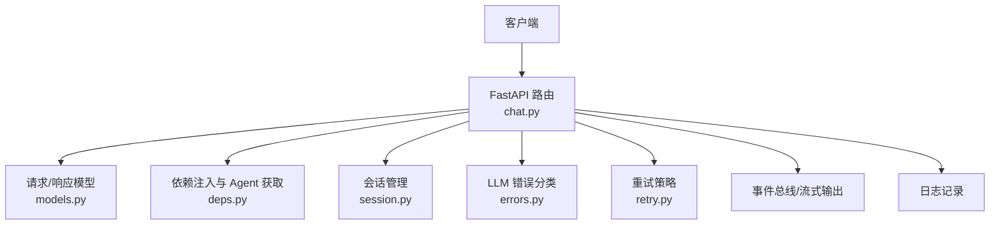
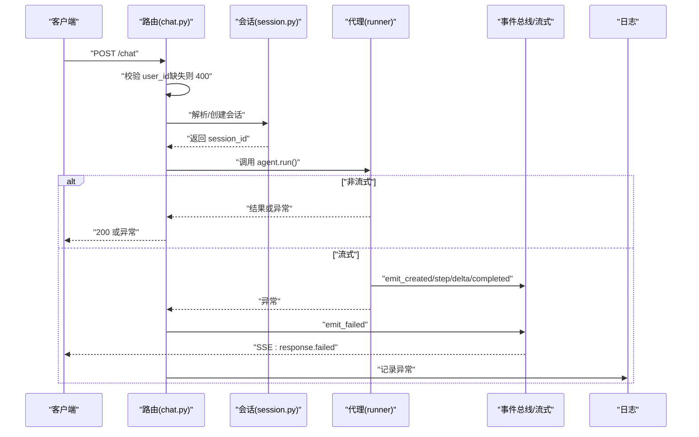
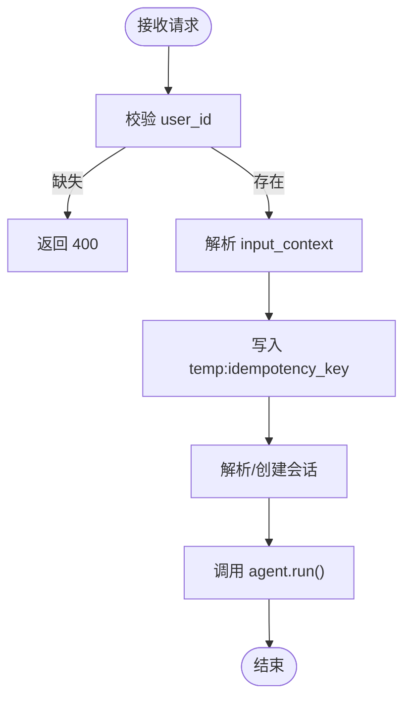
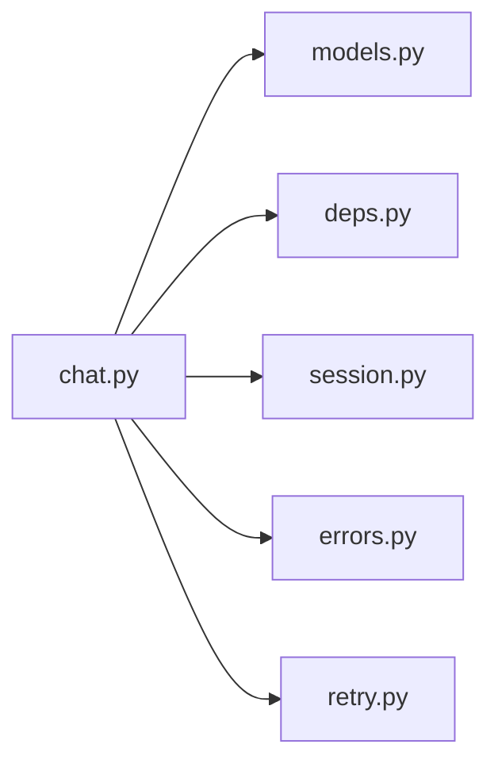

# 错误处理

<cite>
**本文引用的文件列表**
- [chat.py](file://src/ark_agentic/api/chat.py)
- [models.py](file://src/ark_agentic/api/models.py)
- [deps.py](file://src/ark_agentic/api/deps.py)
- [errors.py](file://src/ark_agentic/core/llm/errors.py)
- [retry.py](file://src/ark_agentic/core/llm/retry.py)
- [session.py](file://src/ark_agentic/core/session.py)
- [test_chat_api.py](file://tests/integration/test_chat_api.py)
</cite>

## 目录
1. [简介](#简介)
2. [项目结构](#项目结构)
3. [核心组件](#核心组件)
4. [架构总览](#架构总览)
5. [详细组件分析](#详细组件分析)
6. [依赖关系分析](#依赖关系分析)
7. [性能考量](#性能考量)
8. [故障排查指南](#故障排查指南)
9. [结论](#结论)
10. [附录](#附录)

## 简介
本文件聚焦 Chat API 的错误处理机制，涵盖：
- HTTP 错误状态码与对应场景：400（user_id 缺失）、404（Agent 不存在）、会话不存在时的处理流程、以及代理运行异常导致的 5xx 场景。
- 错误响应格式：统一的错误载荷字段（如错误代码、错误消息、详细描述等）。
- 幂等性处理：idempotency_key 的作用与重复请求的处理思路。
- 异常捕获与日志记录策略：端到端的异常捕获、日志记录与事件总线的失败事件发射。
- 客户端错误处理最佳实践与重试建议：基于 LLM 错误分类与指数退避重试策略。
- 常见错误排查步骤与解决方案：从请求头、会话解析、代理运行到日志定位。

## 项目结构
围绕 Chat API 的错误处理，关键文件与职责如下：
- API 路由与请求模型：负责输入校验、会话解析、幂等键透传、流式与非流式的错误捕获与事件发射。
- 依赖注入与 Agent 注册：负责 404 场景（Agent 不存在）。
- LLM 错误分类与重试：负责将底层异常归类为可重试或不可重试，并提供指数退避重试策略。
- 会话管理：负责会话创建、加载、缺失时的兜底与日志记录。
- 测试用例：验证 user_id 缺失返回 400、会话解析行为、以及幂等键透传。

图表来源
- [chat.py:27-176](file://src/ark_agentic/api/chat.py#L27-L176)
- [models.py:27-103](file://src/ark_agentic/api/models.py#L27-L103)
- [deps.py:31-36](file://src/ark_agentic/api/deps.py#L31-L36)
- [session.py:40-227](file://src/ark_agentic/core/session.py#L40-L227)
- [errors.py:55-159](file://src/ark_agentic/core/llm/errors.py#L55-L159)
- [retry.py:45-161](file://src/ark_agentic/core/llm/retry.py#L45-L161)

章节来源
- [chat.py:27-176](file://src/ark_agentic/api/chat.py#L27-L176)
- [models.py:27-103](file://src/ark_agentic/api/models.py#L27-L103)
- [deps.py:31-36](file://src/ark_agentic/api/deps.py#L31-L36)
- [session.py:40-227](file://src/ark_agentic/core/session.py#L40-L227)
- [errors.py:55-159](file://src/ark_agentic/core/llm/errors.py#L55-L159)
- [retry.py:45-161](file://src/ark_agentic/core/llm/retry.py#L45-L161)

## 核心组件
- Chat 路由与错误入口
  - user_id 缺失：直接抛出 400。
  - 会话解析：缺失时自动创建；若通过 header 提供 session_id 且不存在，则加载失败后兜底创建。
  - 代理运行异常：捕获异常并通过事件总线发射失败事件，同时记录异常日志。
- 请求/响应模型
  - ChatRequest 包含 idempotency_key 字段，用于幂等控制。
  - ChatResponse 定义标准响应结构。
- 依赖注入与 Agent 获取
  - Agent 不存在时返回 404。
- LLM 错误分类与重试
  - 将底层异常归类为可重试或不可重试，提供指数退避重试策略。
- 会话管理
  - 创建/加载/同步会话状态，缺失时兜底创建并记录日志。

章节来源
- [chat.py:42-43](file://src/ark_agentic/api/chat.py#L42-L43)
- [chat.py:67-79](file://src/ark_agentic/api/chat.py#L67-L79)
- [chat.py:153-157](file://src/ark_agentic/api/chat.py#L153-L157)
- [models.py:27-44](file://src/ark_agentic/api/models.py#L27-L44)
- [models.py:61-69](file://src/ark_agentic/api/models.py#L61-L69)
- [deps.py:31-36](file://src/ark_agentic/api/deps.py#L31-L36)
- [errors.py:55-159](file://src/ark_agentic/core/llm/errors.py#L55-L159)
- [retry.py:45-161](file://src/ark_agentic/core/llm/retry.py#L45-L161)
- [session.py:40-67](file://src/ark_agentic/core/session.py#L40-L67)

## 架构总览
Chat API 的错误处理贯穿请求解析、会话解析、代理执行与流式输出四个阶段，形成“输入校验—会话解析—代理执行—事件发射”的闭环。

图表来源
- [chat.py:27-176](file://src/ark_agentic/api/chat.py#L27-L176)
- [session.py:40-227](file://src/ark_agentic/core/session.py#L40-L227)

## 详细组件分析

### HTTP 错误状态码与场景
- 400 错误：当请求体与请求头均未提供 user_id 时，直接返回 400，并包含错误详情。
- 404 错误：当根据 agent_id 获取 Agent 失败时，返回 404。
- 会话不存在：当通过 session_id 解析会话失败时，记录警告并兜底创建新会话，不直接返回 404。
- 500/5xx 错误：当代理运行过程中发生异常时，捕获异常并通过事件总线发射失败事件，客户端收到 SSE 失败事件；服务端记录异常日志。

章节来源
- [chat.py:42-43](file://src/ark_agentic/api/chat.py#L42-L43)
- [deps.py:31-36](file://src/ark_agentic/api/deps.py#L31-L36)
- [chat.py:67-79](file://src/ark_agentic/api/chat.py#L67-L79)
- [chat.py:153-157](file://src/ark_agentic/api/chat.py#L153-L157)

### 错误响应格式
- 非流式响应：成功时返回 ChatResponse；失败时由 FastAPI 捕获异常并返回 JSON 错误载荷（包含 detail 等字段）。
- 流式响应：通过事件总线发射失败事件，客户端收到 SSE 事件类型为 response.failed，其中包含错误消息等字段。
- 错误载荷字段建议（基于现有实现与模型）：
  - 错误代码：由 HTTP 状态码体现（400/404/5xx）。
  - 错误消息：detail 或 error_message。
  - 详细描述：可在 detail 中包含具体原因（例如 user_id 缺失）。
  - SSE 失败事件：包含 error_message 字段，便于前端展示。

章节来源
- [chat.py:153-157](file://src/ark_agentic/api/chat.py#L153-L157)
- [models.py:101](file://src/ark_agentic/api/models.py#L101)

### 幂等性处理：idempotency_key
- 作用：客户端通过 idempotency_key 防止重复请求产生重复副作用。
- 透传机制：路由层将 idempotency_key 写入 input_context 的临时键，供后续处理使用。
- 重复请求处理：当前路由层未显式去重逻辑，建议在上游（如网关或业务层）基于 idempotency_key 去重；路由层确保幂等键透传至后续处理链路。

图表来源
- [chat.py:42-57](file://src/ark_agentic/api/chat.py#L42-L57)

章节来源
- [chat.py:56-57](file://src/ark_agentic/api/chat.py#L56-L57)
- [models.py:40](file://src/ark_agentic/api/models.py#L40)

### 异常捕获与日志记录策略
- 路由层：捕获代理运行异常，记录异常日志，并通过事件总线发射失败事件。
- 会话层：缺失会话时记录警告并兜底创建，确保服务可用性。
- LLM 层：将底层异常分类为可重试或不可重试，提供指数退避重试策略，避免对不可重试错误进行无意义重试。

章节来源
- [chat.py:153-157](file://src/ark_agentic/api/chat.py#L153-L157)
- [session.py:72-79](file://src/ark_agentic/core/session.py#L72-L79)
- [errors.py:55-159](file://src/ark_agentic/core/llm/errors.py#L55-L159)
- [retry.py:45-161](file://src/ark_agentic/core/llm/retry.py#L45-L161)

### 客户端错误处理最佳实践与重试建议
- 对于可重试错误（如超时、限流、网络、服务器错误），采用指数退避+抖动策略，最大重试次数与延迟上限可配置。
- 对于不可重试错误（认证、配额、上下文溢出、内容过滤），直接失败并提示用户修正。
- 流式场景：仅在“开流前”重试，一旦产出首个 chunk 即视为成功，避免重复输出。
- SSE 失败事件：客户端监听 response.failed 事件，读取 error_message 字段并提示用户。

章节来源
- [retry.py:45-161](file://src/ark_agentic/core/llm/retry.py#L45-L161)
- [errors.py:55-159](file://src/ark_agentic/core/llm/errors.py#L55-L159)
- [chat.py:153-157](file://src/ark_agentic/api/chat.py#L153-L157)

## 依赖关系分析
- 路由依赖模型与依赖注入，会话管理贯穿请求生命周期，LLM 错误分类与重试为代理执行提供稳健性保障。
- 依赖耦合清晰：路由层不直接依赖具体 LLM 实现，而是通过错误分类与重试策略抽象。

图表来源
- [chat.py:19-20](file://src/ark_agentic/api/chat.py#L19-L20)
- [models.py:12](file://src/ark_agentic/api/models.py#L12)
- [deps.py:12](file://src/ark_agentic/api/deps.py#L12)
- [session.py:16](file://src/ark_agentic/core/session.py#L16)
- [errors.py:14](file://src/ark_agentic/core/llm/errors.py#L14)
- [retry.py:16](file://src/ark_agentic/core/llm/retry.py#L16)

章节来源
- [chat.py:19-20](file://src/ark_agentic/api/chat.py#L19-L20)
- [models.py:12](file://src/ark_agentic/api/models.py#L12)
- [deps.py:12](file://src/ark_agentic/api/deps.py#L12)
- [session.py:16](file://src/ark_agentic/core/session.py#L16)
- [errors.py:14](file://src/ark_agentic/core/llm/errors.py#L14)
- [retry.py:16](file://src/ark_agentic/core/llm/retry.py#L16)

## 性能考量
- 流式输出：通过事件总线与 SSE 输出，避免一次性聚合大量响应，降低内存峰值。
- 重试策略：指数退避+抖动减少雪崩效应，合理设置最大重试次数与延迟上限。
- 会话持久化：会话状态同步与磁盘操作在后台进行，不影响主请求路径。

## 故障排查指南
- user_id 缺失（400）
  - 现象：请求返回 400，detail 中包含 user_id 相关提示。
  - 排查：确认请求体或请求头 x-ark-user-id 是否提供；优先级为 body > header。
  - 参考测试：[test_chat_api.py:72-105](file://tests/integration/test_chat_api.py#L72-L105)
- Agent 不存在（404）
  - 现象：返回 404，detail 包含 Agent not found。
  - 排查：确认 agent_id 是否正确；检查依赖注入是否初始化。
  - 参考实现：[deps.py:31-36](file://src/ark_agentic/api/deps.py#L31-L36)
- 会话不存在（兜底创建）
  - 现象：会话不存在时记录警告并创建新会话，不返回 404。
  - 排查：确认 session_id 是否正确；检查会话存储与加载逻辑。
  - 参考实现：[chat.py:67-79](file://src/ark_agentic/api/chat.py#L67-L79)，[session.py:184-227](file://src/ark_agentic/core/session.py#L184-L227)
- 代理运行异常（5xx/SSE 失败）
  - 现象：流式响应中收到 response.failed 事件；服务端日志记录异常。
  - 排查：查看日志中的异常堆栈；确认 LLM 服务可用性与网络连通性。
  - 参考实现：[chat.py:153-157](file://src/ark_agentic/api/chat.py#L153-L157)
- 幂等性问题
  - 现象：重复请求导致副作用。
  - 排查：在上游（网关/业务层）基于 idempotency_key 去重；确认路由层已透传该键。
  - 参考实现：[chat.py:56-57](file://src/ark_agentic/api/chat.py#L56-L57)，[models.py:40](file://src/ark_agentic/api/models.py#L40)

章节来源
- [test_chat_api.py:72-105](file://tests/integration/test_chat_api.py#L72-L105)
- [deps.py:31-36](file://src/ark_agentic/api/deps.py#L31-L36)
- [chat.py:67-79](file://src/ark_agentic/api/chat.py#L67-L79)
- [session.py:184-227](file://src/ark_agentic/core/session.py#L184-L227)
- [chat.py:153-157](file://src/ark_agentic/api/chat.py#L153-L157)
- [chat.py:56-57](file://src/ark_agentic/api/chat.py#L56-L57)
- [models.py:40](file://src/ark_agentic/api/models.py#L40)

## 结论
本项目在 Chat API 的错误处理上实现了清晰的分层设计：路由层负责输入校验与异常捕获，会话层负责兜底与日志，LLM 错误分类与重试策略提供了稳健的代理执行能力。结合幂等键透传与 SSE 失败事件，客户端可获得一致的错误体验与可控的重试策略。建议在上游增加幂等去重与更细粒度的错误载荷字段，进一步提升可观测性与用户体验。

## 附录
- 关键实现参考路径
  - 路由与错误入口：[chat.py:27-176](file://src/ark_agentic/api/chat.py#L27-L176)
  - 请求/响应模型：[models.py:27-103](file://src/ark_agentic/api/models.py#L27-L103)
  - 依赖注入与 Agent 获取：[deps.py:31-36](file://src/ark_agentic/api/deps.py#L31-L36)
  - 会话管理：[session.py:40-227](file://src/ark_agentic/core/session.py#L40-L227)
  - LLM 错误分类与重试：[errors.py:55-159](file://src/ark_agentic/core/llm/errors.py#L55-L159)，[retry.py:45-161](file://src/ark_agentic/core/llm/retry.py#L45-L161)
  - 测试用例：[test_chat_api.py:72-176](file://tests/integration/test_chat_api.py#L72-L176)