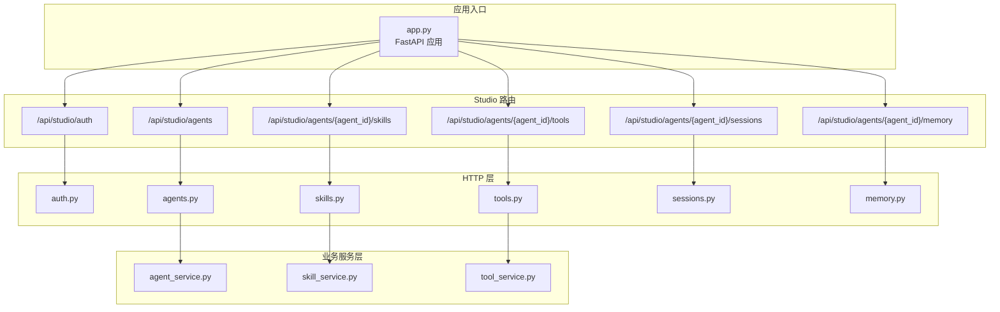
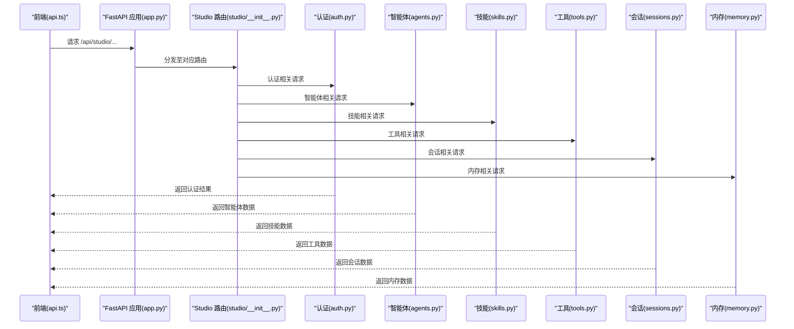
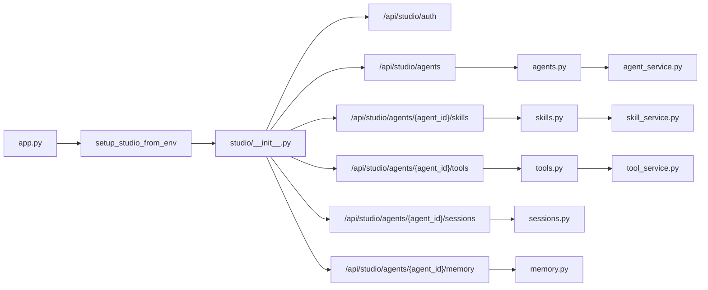
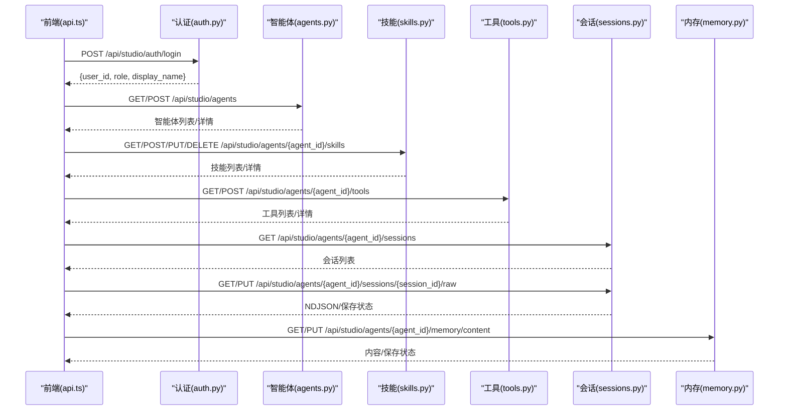

# Studio API

<cite>
**本文引用的文件**
- [app.py](file://src/ark_agentic/app.py)
- [__init__.py](file://src/ark_agentic/studio/__init__.py)
- [agents.py](file://src/ark_agentic/studio/api/agents.py)
- [skills.py](file://src/ark_agentic/studio/api/skills.py)
- [tools.py](file://src/ark_agentic/studio/api/tools.py)
- [memory.py](file://src/ark_agentic/studio/api/memory.py)
- [sessions.py](file://src/ark_agentic/studio/api/sessions.py)
- [auth.py](file://src/ark_agentic/studio/api/auth.py)
- [agent_service.py](file://src/ark_agentic/studio/services/agent_service.py)
- [skill_service.py](file://src/ark_agentic/studio/services/skill_service.py)
- [tool_service.py](file://src/ark_agentic/studio/services/tool_service.py)
- [api.ts](file://src/ark_agentic/studio/frontend/src/api.ts)
- [ark-agentic-api.postman_collection.json](file://postman/ark-agentic-api.postman_collection.json)
</cite>

## 目录
1. [简介](#简介)
2. [项目结构](#项目结构)
3. [核心组件](#核心组件)
4. [架构总览](#架构总览)
5. [详细组件分析](#详细组件分析)
6. [依赖分析](#依赖分析)
7. [性能考虑](#性能考虑)
8. [故障排查指南](#故障排查指南)
9. [结论](#结论)
10. [附录](#附录)

## 简介
本文件为 Studio 开发工具 API 的完整技术文档，覆盖智能体管理、技能编辑、工具开发、内存管理和会话管理五大模块。文档面向前后端开发者与产品/运营人员，提供端点清单、请求/响应模型、错误处理策略以及 Studio 前后端交互模式与数据流转说明。所有接口均基于 FastAPI 路由实现，并通过统一应用入口进行挂载与暴露。

## 项目结构
Studio API 采用“薄 HTTP 层 + 业务服务层”的分层设计：
- HTTP 层：位于 studio/api，负责参数校验、路由定义与异常转换
- 业务服务层：位于 studio/services，封装具体业务逻辑（文件系统操作、解析与生成）
- 应用入口：app.py 负责注册路由、中间件与条件挂载 Studio
- 前端：React SPA，通过 api.ts 发起请求，统一前缀 /api/studio

图表来源
- [app.py:164](file://src/ark_agentic/app.py#L164)
- [__init__.py:38-43](file://src/ark_agentic/studio/__init__.py#L38-L43)
- [agents.py:22](file://src/ark_agentic/studio/api/agents.py#L22)
- [skills.py:21](file://src/ark_agentic/studio/api/skills.py#L21)
- [tools.py:21](file://src/ark_agentic/studio/api/tools.py#L21)
- [sessions.py:22](file://src/ark_agentic/studio/api/sessions.py#L22)
- [memory.py:21](file://src/ark_agentic/studio/api/memory.py#L21)

章节来源
- [app.py:164](file://src/ark_agentic/app.py#L164)
- [__init__.py:38-43](file://src/ark_agentic/studio/__init__.py#L38-L43)

## 核心组件
- 认证模块：提供本地用户登录验证，返回基础用户信息
- 智能体模块：提供智能体的增删改查与列表展示
- 技能模块：提供技能的增删改查与列表展示
- 工具模块：提供工具脚手架生成与列表展示
- 会话模块：提供会话列表、详情与原始 JSONL 的读写
- 内存模块：提供内存文件发现、内容读取与写入

章节来源
- [auth.py:26](file://src/ark_agentic/studio/api/auth.py#L26)
- [agents.py:22](file://src/ark_agentic/studio/api/agents.py#L22)
- [skills.py:21](file://src/ark_agentic/studio/api/skills.py#L21)
- [tools.py:21](file://src/ark_agentic/studio/api/tools.py#L21)
- [sessions.py:22](file://src/ark_agentic/studio/api/sessions.py#L22)
- [memory.py:21](file://src/ark_agentic/studio/api/memory.py#L21)

## 架构总览
- 路由前缀：所有 Studio 接口统一前缀 /api/studio
- 认证：前端登录后将用户信息保存在本地存储，后续请求通过 HTTP 头部携带用户标识
- 数据持久化：智能体、技能、工具等以文件系统为唯一数据源；会话与内存通过运行时内存管理器与磁盘文件协同

图表来源
- [app.py:164](file://src/ark_agentic/app.py#L164)
- [__init__.py:38-43](file://src/ark_agentic/studio/__init__.py#L38-L43)
- [auth.py:94](file://src/ark_agentic/studio/api/auth.py#L94)
- [agents.py:76](file://src/ark_agentic/studio/api/agents.py#L76)
- [skills.py:57](file://src/ark_agentic/studio/api/skills.py#L57)
- [tools.py:41](file://src/ark_agentic/studio/api/tools.py#L41)
- [sessions.py:84](file://src/ark_agentic/studio/api/sessions.py#L84)
- [memory.py:105](file://src/ark_agentic/studio/api/memory.py#L105)

## 详细组件分析

### 认证模块
- 端点
  - POST /api/studio/auth/login
- 请求参数
  - username: 字符串，必填
  - password: 字符串，必填
- 响应
  - user_id: 字符串
  - role: 字符串
  - display_name: 字符串
- 错误
  - 401 未授权：用户名或密码错误
- 说明
  - 用户凭据来源于环境变量 STUDIO_USERS 的 JSON 映射，密码使用 bcrypt 哈希存储
  - 登录成功后，前端将用户对象保存在本地存储，用于后续请求头注入

章节来源
- [auth.py:94](file://src/ark_agentic/studio/api/auth.py#L94)
- [auth.py:68](file://src/ark_agentic/studio/api/auth.py#L68)
- [auth.py:83](file://src/ark_agentic/studio/api/auth.py#L83)

### 智能体管理
- 端点
  - GET /api/studio/agents
  - GET /api/studio/agents/{agent_id}
  - POST /api/studio/agents
- 请求参数
  - GET /api/studio/agents：无
  - GET /api/studio/agents/{agent_id}：路径参数 agent_id
  - POST /api/studio/agents：JSON
    - id: 字符串，必填，英文标识，用作目录名
    - name: 字符串，必填，显示名称
    - description: 字符串，可选
- 响应
  - GET /api/studio/agents：返回数组 agents，元素为智能体元数据
  - GET /api/studio/agents/{agent_id}：返回智能体元数据
  - POST /api/studio/agents：返回创建的智能体元数据
- 错误
  - 404 未找到：智能体不存在
  - 409 冲突：智能体已存在
- 数据模型
  - AgentMeta：id、name、description、status、created_at、updated_at
  - AgentCreateRequest：id、name、description

章节来源
- [agents.py:76](file://src/ark_agentic/studio/api/agents.py#L76)
- [agents.py:93](file://src/ark_agentic/studio/api/agents.py#L93)
- [agents.py:106](file://src/ark_agentic/studio/api/agents.py#L106)
- [agents.py:27](file://src/ark_agentic/studio/api/agents.py#L27)
- [agents.py:37](file://src/ark_agentic/studio/api/agents.py#L37)

### 技能编辑
- 端点
  - GET /api/studio/agents/{agent_id}/skills
  - POST /api/studio/agents/{agent_id}/skills
  - PUT /api/studio/agents/{agent_id}/skills/{skill_id}
  - DELETE /api/studio/agents/{agent_id}/skills/{skill_id}
- 请求参数
  - GET /api/studio/agents/{agent_id}/skills：路径参数 agent_id
  - POST /api/studio/agents/{agent_id}/skills：JSON
    - name: 字符串，必填
    - description: 字符串，可选
    - content: 字符串，可选（Markdown 指令正文）
  - PUT /api/studio/agents/{agent_id}/skills/{skill_id}：JSON
    - name: 字符串，可选
    - description: 字符串，可选
    - content: 字符串，可选
  - DELETE /api/studio/agents/{agent_id}/skills/{skill_id}：路径参数 agent_id、skill_id
- 响应
  - GET：返回数组 skills，元素为技能元数据
  - POST/PUT：返回技能元数据
  - DELETE：返回 { status: "deleted", skill_id: string }
- 错误
  - 404：智能体或技能不存在
  - 409：技能已存在
  - 400：参数非法
- 数据模型
  - SkillMeta：id、name、description、file_path、content、version、invocation_policy、group、tags
  - SkillCreateRequest/SkillUpdateRequest：同上字段

章节来源
- [skills.py:57](file://src/ark_agentic/studio/api/skills.py#L57)
- [skills.py:68](file://src/ark_agentic/studio/api/skills.py#L68)
- [skills.py:86](file://src/ark_agentic/studio/api/skills.py#L86)
- [skills.py:101](file://src/ark_agentic/studio/api/skills.py#L101)
- [skills.py:26](file://src/ark_agentic/studio/api/skills.py#L26)
- [skills.py:32](file://src/ark_agentic/studio/api/skills.py#L32)

### 工具开发
- 端点
  - GET /api/studio/agents/{agent_id}/tools
  - POST /api/studio/agents/{agent_id}/tools
- 请求参数
  - GET /api/studio/agents/{agent_id}/tools：路径参数 agent_id
  - POST /api/studio/agents/{agent_id}/tools：JSON
    - name: 字符串，必填，Python 标识符
    - description: 字符串，可选
    - parameters: 数组，元素为 { name, description, type, required }
- 响应
  - GET：返回数组 tools，元素为工具元数据
  - POST：返回工具元数据
- 错误
  - 404：智能体不存在
  - 409：工具已存在
  - 400：参数非法
- 数据模型
  - ToolMeta：name、description、group、file_path、parameters
  - ToolScaffoldRequest：同上字段

章节来源
- [tools.py:41](file://src/ark_agentic/studio/api/tools.py#L41)
- [tools.py:52](file://src/ark_agentic/studio/api/tools.py#L52)
- [tools.py:26](file://src/ark_agentic/studio/api/tools.py#L26)

### 内存管理
- 端点
  - GET /api/studio/agents/{agent_id}/memory/files
  - GET /api/studio/agents/{agent_id}/memory/content
  - PUT /api/studio/agents/{agent_id}/memory/content
- 请求参数
  - GET /api/studio/agents/{agent_id}/memory/files：路径参数 agent_id
  - GET /api/studio/agents/{agent_id}/memory/content：查询参数
    - file_path: 字符串，相对工作区路径
    - user_id: 字符串，用户标识；空表示全局文件
  - PUT /api/studio/agents/{agent_id}/memory/content：查询参数 + 请求体
    - file_path: 字符串，相对工作区路径
    - user_id: 字符串，用户标识；空表示全局文件
    - 请求体：纯文本内容
- 响应
  - GET /memory/files：返回数组 files，元素为 MemoryFileItem
  - GET /memory/content：返回纯文本
  - PUT /memory/content：返回 { status: "saved" }
- 错误
  - 404：智能体不存在、文件不存在、内存未启用
  - 403：路径穿越保护拒绝
- 数据模型
  - MemoryFileItem：user_id、file_path、file_type、size_bytes、modified_at

章节来源
- [memory.py:105](file://src/ark_agentic/studio/api/memory.py#L105)
- [memory.py:125](file://src/ark_agentic/studio/api/memory.py#L125)
- [memory.py:142](file://src/ark_agentic/studio/api/memory.py#L142)
- [memory.py:26](file://src/ark_agentic/studio/api/memory.py#L26)

### 会话管理
- 端点
  - GET /api/studio/agents/{agent_id}/sessions
  - GET /api/studio/agents/{agent_id}/sessions/{session_id}
  - GET /api/studio/agents/{agent_id}/sessions/{session_id}/raw
  - PUT /api/studio/agents/{agent_id}/sessions/{session_id}/raw
- 请求参数
  - GET /api/studio/agents/{agent_id}/sessions：查询参数
    - user_id: 字符串，可选，按用户过滤
  - GET /api/studio/agents/{agent_id}/sessions/{session_id}：查询参数
    - user_id: 字符串，必填
  - GET /api/studio/agents/{agent_id}/sessions/{session_id}/raw：查询参数
    - user_id: 字符串，必填
  - PUT /api/studio/agents/{agent_id}/sessions/{session_id}/raw：查询参数 + 请求体
    - user_id: 字符串，必填
    - 请求体：NDJSON 文本
- 响应
  - GET /sessions：返回数组 sessions，元素为 SessionItem
  - GET /sessions/{id}：返回 SessionDetail
  - GET /sessions/{id}/raw：返回 NDJSON 文本
  - PUT /sessions/{id}/raw：返回 { status: "saved", session_id: string }
- 错误
  - 404：智能体不存在、会话不存在、持久化未启用
  - 400：NDJSON 校验失败（包含行号信息）
- 数据模型
  - SessionItem：session_id、user_id、message_count、state、created_at、updated_at、first_message
  - MessageItem：role、content、tool_calls、tool_results、thinking、metadata
  - SessionDetail：session_id、message_count、state、messages

章节来源
- [sessions.py:84](file://src/ark_agentic/studio/api/sessions.py#L84)
- [sessions.py:117](file://src/ark_agentic/studio/api/sessions.py#L117)
- [sessions.py:146](file://src/ark_agentic/studio/api/sessions.py#L146)
- [sessions.py:169](file://src/ark_agentic/studio/api/sessions.py#L169)
- [sessions.py:27](file://src/ark_agentic/studio/api/sessions.py#L27)
- [sessions.py:50](file://src/ark_agentic/studio/api/sessions.py#L50)

## 依赖分析
- 路由注册
  - app.py 在启动时调用 setup_studio_from_env，条件挂载 Studio 路由
  - studio/__init__.py 将各模块路由统一挂载到 /api/studio 前缀
- 业务服务
  - HTTP 层仅做参数校验与异常转换，实际业务逻辑委托给 services 层
  - services 层不依赖 FastAPI，便于复用与测试
- 前后端交互
  - 前端 api.ts 统一前缀 /api/studio，遵循各模块端点规范
  - 认证成功后，前端在请求头中携带用户标识

图表来源
- [app.py:164](file://src/ark_agentic/app.py#L164)
- [__init__.py:38-43](file://src/ark_agentic/studio/__init__.py#L38-L43)
- [agents.py:22](file://src/ark_agentic/studio/api/agents.py#L22)
- [skills.py:21](file://src/ark_agentic/studio/api/skills.py#L21)
- [tools.py:21](file://src/ark_agentic/studio/api/tools.py#L21)
- [sessions.py:22](file://src/ark_agentic/studio/api/sessions.py#L22)
- [memory.py:21](file://src/ark_agentic/studio/api/memory.py#L21)

章节来源
- [app.py:164](file://src/ark_agentic/app.py#L164)
- [__init__.py:38-43](file://src/ark_agentic/studio/__init__.py#L38-L43)

## 性能考虑
- 文件系统 IO
  - 智能体、技能、工具均以文件系统为数据源，建议合理组织目录结构，避免过多层级
  - 内存与会话读写为磁盘 IO，建议批量写入与缓存热点文件
- 路由与中间件
  - CORS 已启用，允许跨域访问；生产环境建议限制允许来源
- 前端请求
  - 建议对频繁请求进行节流与去抖，减少不必要的刷新
  - 使用本地存储缓存认证用户信息，降低重复登录成本

## 故障排查指南
- 认证失败
  - 检查 STUDIO_USERS 环境变量格式是否为 JSON 对象
  - 确认密码哈希是否正确
- 智能体/技能/工具不存在
  - 确认 agent_id 是否正确
  - 检查 agents 根目录是否存在对应智能体目录
- 内存/会话不可用
  - 确认智能体已启用内存管理
  - 检查 file_path 是否为相对工作区路径且未越权
- 会话写入失败
  - 确认 NDJSON 格式正确，必要时查看行号定位问题
- Studio 未挂载
  - 确认 ENABLE_STUDIO=true，且 app.py 中已调用 setup_studio_from_env

章节来源
- [auth.py:68](file://src/ark_agentic/studio/api/auth.py#L68)
- [auth.py:94](file://src/ark_agentic/studio/api/auth.py#L94)
- [memory.py:83](file://src/ark_agentic/studio/api/memory.py#L83)
- [sessions.py:169](file://src/ark_agentic/studio/api/sessions.py#L169)
- [app.py:164](file://src/ark_agentic/app.py#L164)

## 结论
Studio API 提供了围绕智能体、技能、工具、内存与会话的完整管理能力，采用文件系统作为数据源，结合轻量认证与统一路由前缀，便于前后端协作与扩展。通过清晰的分层设计与明确的错误处理策略，能够稳定支撑开发与运维场景。

## 附录

### 前后端交互模式与数据流转
- 登录流程
  - 前端提交用户名与密码至 /api/studio/auth/login
  - 后端校验凭据并返回用户信息
  - 前端将用户信息保存在本地存储，后续请求通过头部携带用户标识
- 智能体 CRUD
  - 前端调用 /api/studio/agents 或 /api/studio/agents/{agent_id}
  - 后端读写文件系统中的 agent.json 与目录结构
- 技能 CRUD
  - 前端调用 /api/studio/agents/{agent_id}/skills
  - 后端解析 SKILL.md 并生成元数据
- 工具脚手架
  - 前端调用 /api/studio/agents/{agent_id}/tools
  - 后端通过 AST 解析工具文件并生成元数据
- 会话与内存
  - 前端调用 /api/studio/agents/{agent_id}/sessions 与 /api/studio/agents/{agent_id}/memory
  - 后端通过运行时内存管理器与磁盘文件协同

图表来源
- [api.ts:194](file://src/ark_agentic/studio/frontend/src/api.ts#L194)
- [auth.py:94](file://src/ark_agentic/studio/api/auth.py#L94)
- [agents.py:76](file://src/ark_agentic/studio/api/agents.py#L76)
- [skills.py:57](file://src/ark_agentic/studio/api/skills.py#L57)
- [tools.py:41](file://src/ark_agentic/studio/api/tools.py#L41)
- [sessions.py:84](file://src/ark_agentic/studio/api/sessions.py#L84)
- [memory.py:125](file://src/ark_agentic/studio/api/memory.py#L125)

### Postman 集合参考
- 健康检查：GET /health
- 聊天接口：POST /chat（用于流式/非流式对话，参考集合中的示例）
- Studio 接口：GET/POST/PUT/DELETE /api/studio/...

章节来源
- [ark-agentic-api.postman_collection.json:23](file://postman/ark-agentic-api.postman_collection.json#L23)
- [ark-agentic-api.postman_collection.json:38](file://postman/ark-agentic-api.postman_collection.json#L38)