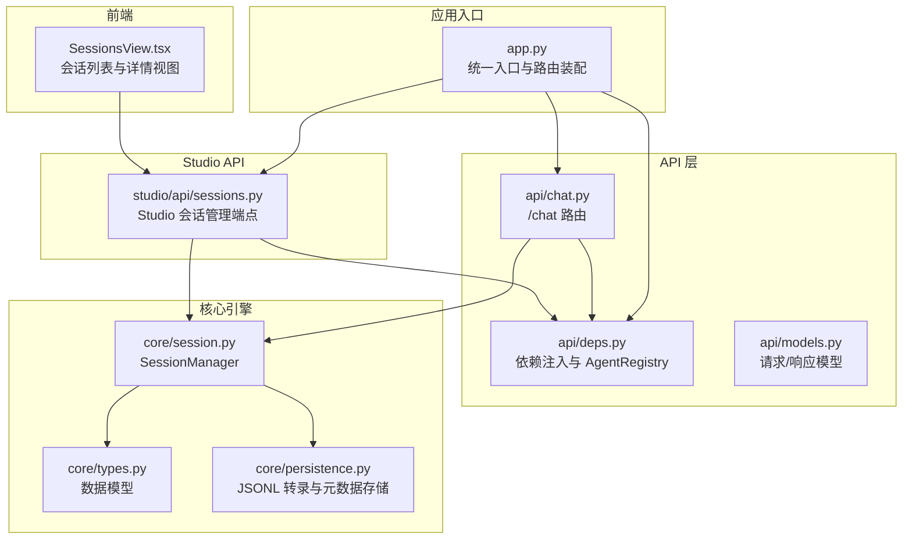
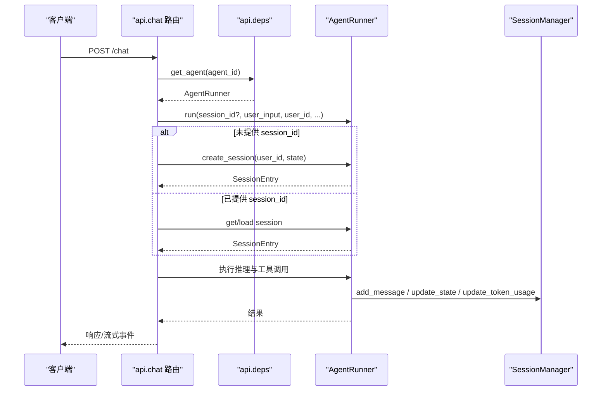
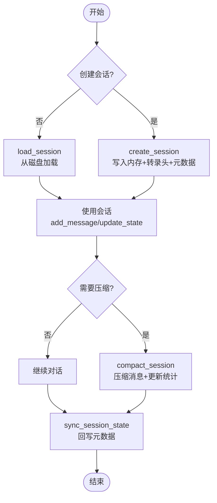
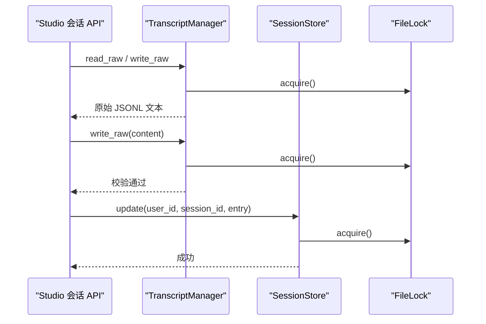
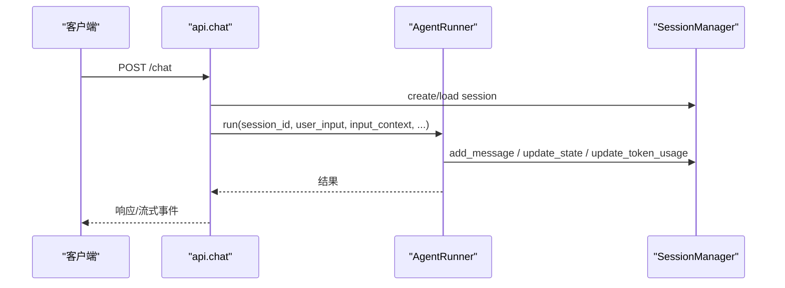
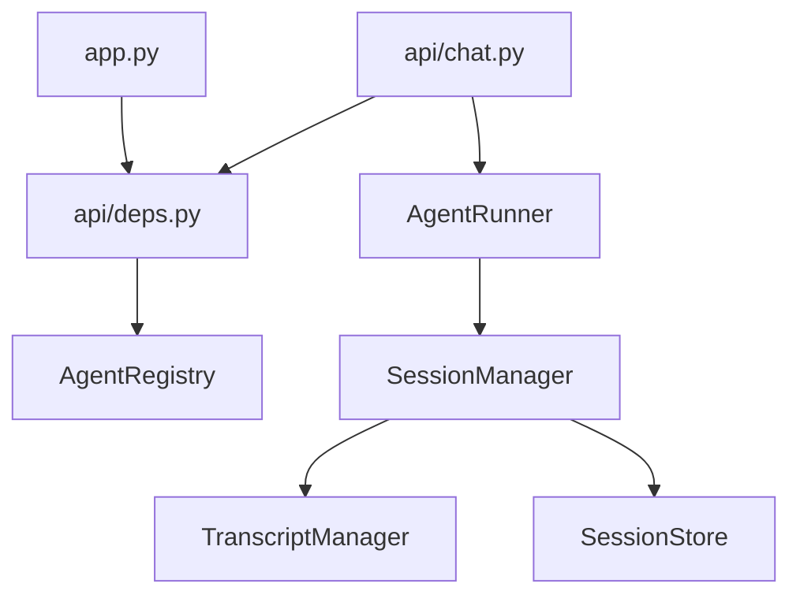

# 会话管理 API

<cite>
**本文档引用的文件**
- [session.py](file://src/ark_agentic/core/session.py)
- [persistence.py](file://src/ark_agentic/core/persistence.py)
- [types.py](file://src/ark_agentic/core/types.py)
- [chat.py](file://src/ark_agentic/api/chat.py)
- [models.py](file://src/ark_agentic/api/models.py)
- [sessions.py](file://src/ark_agentic/studio/api/sessions.py)
- [SessionsView.tsx](file://src/ark_agentic/studio/frontend/src/pages/SessionsView.tsx)
- [deps.py](file://src/ark_agentic/api/deps.py)
- [app.py](file://src/ark_agentic/app.py)
- [architecture.md](file://docs/ark-agentic-studio/architecture.md)
- [implementation_plan.md](file://docs/ark-agentic-studio/implementation_plan.md)
</cite>

## 目录
1. [简介](#简介)
2. [项目结构](#项目结构)
3. [核心组件](#核心组件)
4. [架构总览](#架构总览)
5. [详细组件分析](#详细组件分析)
6. [依赖分析](#依赖分析)
7. [性能考虑](#性能考虑)
8. [故障排查指南](#故障排查指南)
9. [结论](#结论)
10. [附录](#附录)

## 简介
本文件面向会话管理 API 的使用者与维护者，系统性梳理会话的创建、查询、更新与销毁流程，明确会话数据模型、状态管理、持久化机制与上下文压缩策略。文档同时覆盖会话历史记录、权限控制、生命周期管理、备份与安全审计方法，并阐述会话与智能体执行的关系及隐私保护措施。

## 项目结构
围绕会话管理的关键模块分布如下：
- 核心领域模型与管理器：core/session.py、core/persistence.py、core/types.py
- 业务 API 路由：api/chat.py、api/models.py、api/deps.py
- Studio 会话管理 API：studio/api/sessions.py
- 前端会话视图：studio/frontend/src/pages/SessionsView.tsx
- 应用入口与装配：app.py
- 文档参考：docs/ark-agentic-studio/architecture.md、docs/ark-agentic-studio/implementation_plan.md

图表来源
- [app.py:137-164](file://src/ark_agentic/app.py#L137-L164)
- [deps.py:19-37](file://src/ark_agentic/api/deps.py#L19-L37)
- [chat.py:27-177](file://src/ark_agentic/api/chat.py#L27-L177)
- [sessions.py:84-200](file://src/ark_agentic/studio/api/sessions.py#L84-L200)
- [session.py:24-482](file://src/ark_agentic/core/session.py#L24-L482)
- [persistence.py:392-787](file://src/ark_agentic/core/persistence.py#L392-L787)
- [types.py:18-422](file://src/ark_agentic/core/types.py#L18-L422)
- [SessionsView.tsx:55-304](file://src/ark_agentic/studio/frontend/src/pages/SessionsView.tsx#L55-L304)

章节来源
- [app.py:137-164](file://src/ark_agentic/app.py#L137-L164)
- [architecture.md:62-157](file://docs/ark-agentic-studio/architecture.md#L62-L157)

## 核心组件
- 会话管理器 SessionManager：负责会话生命周期、消息管理、Token 统计、上下文压缩与状态同步。
- 会话数据模型 SessionEntry：承载 session_id、user_id、消息历史、Token 使用、压缩统计、活跃技能与状态字典。
- 持久化层：TranscriptManager（JSONL 转录）、SessionStore（元数据索引）与文件锁保障并发安全。
- API 层：/chat 路由根据请求创建或复用会话；Studio 会话 API 提供会话列表、详情与原始 JSONL 读写。
- 前端：SessionsView.tsx 展示会话列表、会话详情与原始 JSONL 编辑。

章节来源
- [session.py:24-482](file://src/ark_agentic/core/session.py#L24-L482)
- [types.py:350-422](file://src/ark_agentic/core/types.py#L350-L422)
- [persistence.py:392-787](file://src/ark_agentic/core/persistence.py#L392-L787)
- [chat.py:27-177](file://src/ark_agentic/api/chat.py#L27-L177)
- [sessions.py:84-200](file://src/ark_agentic/studio/api/sessions.py#L84-L200)
- [SessionsView.tsx:55-304](file://src/ark_agentic/studio/frontend/src/pages/SessionsView.tsx#L55-L304)

## 架构总览
会话管理贯穿业务 API 与 Studio 管理界面，采用依赖倒置原则，通过 api.deps 注入 AgentRegistry，实现对 SessionManager 的统一访问。会话数据以 JSONL 形式持久化，配合元数据存储与文件锁确保一致性与并发安全。

图表来源
- [chat.py:27-177](file://src/ark_agentic/api/chat.py#L27-L177)
- [deps.py:25-37](file://src/ark_agentic/api/deps.py#L25-L37)
- [session.py:265-376](file://src/ark_agentic/core/session.py#L265-L376)

章节来源
- [architecture.md:122-157](file://docs/ark-agentic-studio/architecture.md#L122-L157)

## 详细组件分析

### 会话数据模型与状态管理
- 数据模型
  - SessionEntry：包含 session_id、user_id、创建/更新时间、模型与提供商、消息列表、Token 使用、压缩统计、活跃技能与状态字典。
  - AgentMessage：消息角色（system/user/assistant/tool）、内容、工具调用与结果、思考过程、时间戳与元数据。
  - TokenUsage/CompactionStats：Token 统计与压缩统计。
- 状态管理
  - update_state/get_state：合并与读取会话状态；strip_temp_state：清理临时键。
  - active_skills：记录当前会话使用的技能快照。

```mermaid
classDiagram
class SessionEntry {
+string session_id
+string user_id
+datetime created_at
+datetime updated_at
+string model
+string provider
+AgentMessage[] messages
+TokenUsage token_usage
+CompactionStats compaction_stats
+string[] active_skills
+dict state
+add_message(message)
+update_token_usage(...)
+update_state(delta)
+get_state(key, default)
+strip_temp_state()
}
class AgentMessage {
+MessageRole role
+string content
+ToolCall[] tool_calls
+AgentToolResult[] tool_results
+string thinking
+datetime timestamp
+dict metadata
}
class TokenUsage {
+int prompt_tokens
+int completion_tokens
+int cache_read_tokens
+int cache_creation_tokens
+total_tokens()
}
class CompactionStats {
+int original_messages
+int compacted_messages
+int original_tokens
+int compacted_tokens
+datetime last_compaction_at
}
SessionEntry --> AgentMessage : "包含"
SessionEntry --> TokenUsage : "统计"
SessionEntry --> CompactionStats : "压缩统计"
```

图表来源
- [types.py:18-422](file://src/ark_agentic/core/types.py#L18-L422)

章节来源
- [types.py:18-422](file://src/ark_agentic/core/types.py#L18-L422)

### 会话生命周期管理
- 创建
  - create_session：生成新会话，写入内存与转录头，更新元数据索引。
  - create_session_sync：仅写入内存，适合子任务场景。
- 查询
  - get_session/get_session_required：内存查询；load_session：从磁盘加载；list_sessions/list_sessions_from_disk：内存/磁盘枚举。
- 更新
  - add_message/add_messages：追加消息；inject_messages：锚点插入外部历史；clear_messages：清空消息（可保留 system）。
  - update_state/get_state：更新与读取会话状态；update_token_usage：累计 Token 使用。
- 销毁
  - delete_session/delete_session_sync：删除内存与转录文件；reload_session_from_disk：从磁盘重载。

图表来源
- [session.py:40-122](file://src/ark_agentic/core/session.py#L40-L122)
- [session.py:265-431](file://src/ark_agentic/core/session.py#L265-L431)

章节来源
- [session.py:40-122](file://src/ark_agentic/core/session.py#L40-L122)
- [session.py:184-227](file://src/ark_agentic/core/session.py#L184-L227)
- [session.py:265-431](file://src/ark_agentic/core/session.py#L265-L431)

### 会话历史记录与持久化
- JSONL 转录
  - TranscriptManager：确保会话头、追加消息、批量写入、加载消息与头、列出会话、删除会话、读写原始 JSONL。
  - 序列化/反序列化：消息、工具调用、工具结果、时间戳与元数据。
- 元数据存储
  - SessionStore：每个用户维护 sessions.json，记录会话的模型、提供商、Token 使用、压缩次数、活跃技能与状态。
  - 文件锁：FileLock 跨平台文件锁，保障并发写入安全。
- 原始 JSONL 读写
  - Studio 会话 API 提供 /raw 读取与写回，写回时进行格式校验，失败抛出 RawJsonlValidationError。

图表来源
- [sessions.py:146-200](file://src/ark_agentic/studio/api/sessions.py#L146-L200)
- [persistence.py:592-635](file://src/ark_agentic/core/persistence.py#L592-L635)
- [persistence.py:750-783](file://src/ark_agentic/core/persistence.py#L750-L783)
- [persistence.py:264-387](file://src/ark_agentic/core/persistence.py#L264-L387)

章节来源
- [persistence.py:392-787](file://src/ark_agentic/core/persistence.py#L392-L787)
- [sessions.py:146-200](file://src/ark_agentic/studio/api/sessions.py#L146-L200)

### 会话与智能体执行的关系
- /chat 路由根据请求参数决定是否创建新会话或复用已有会话；随后调用 AgentRunner.run 执行推理与工具调用。
- 会话状态（state）可用于跨轮次上下文传递，工具执行结果可通过状态增量写回，形成“会话即上下文”的设计。

图表来源
- [chat.py:27-177](file://src/ark_agentic/api/chat.py#L27-L177)
- [session.py:265-376](file://src/ark_agentic/core/session.py#L265-L376)

章节来源
- [chat.py:27-177](file://src/ark_agentic/api/chat.py#L27-L177)

### 会话权限控制与安全审计
- 权限控制
  - Studio 会话 API 要求提供 user_id 参数，确保对特定会话的访问权限。
  - /raw 写回端点在写入前进行格式校验，失败返回错误信息并包含行号。
- 安全审计
  - 文件锁与原子写入减少并发冲突与损坏风险。
  - 原始 JSONL 可读可写，便于审计与恢复。

章节来源
- [sessions.py:117-199](file://src/ark_agentic/studio/api/sessions.py#L117-L199)
- [persistence.py:592-635](file://src/ark_agentic/core/persistence.py#L592-L635)

### 会话超时机制
- 代码库未实现显式的会话超时策略。建议在业务侧通过外部定时任务或缓存 TTL 实现会话清理与归档。

[本节为通用指导，不直接分析具体文件]

## 依赖分析
- 依赖倒置：app.py 注入 AgentRegistry 至 api.deps，各路由通过 get_agent 获取运行时对象，避免模块级全局状态。
- 组件耦合：SessionManager 依赖 TranscriptManager 与 SessionStore，API 层通过 deps 获取 Runner，降低耦合度。
- 并发与一致性：文件锁与缓存策略提升并发安全性与性能。

图表来源
- [app.py:137-164](file://src/ark_agentic/app.py#L137-L164)
- [deps.py:19-37](file://src/ark_agentic/api/deps.py#L19-L37)
- [chat.py:27-177](file://src/ark_agentic/api/chat.py#L27-L177)
- [session.py:24-482](file://src/ark_agentic/core/session.py#L24-L482)
- [persistence.py:392-787](file://src/ark_agentic/core/persistence.py#L392-L787)

章节来源
- [architecture.md:62-119](file://docs/ark-agentic-studio/architecture.md#L62-L119)

## 性能考虑
- 上下文压缩：当需要压缩时自动执行，减少 Token 使用与内存占用。
- 缓存策略：SessionStore 对用户会话索引进行缓存，降低频繁读取开销。
- 文件锁与批量写入：减少并发写入冲突，提高吞吐。

[本节为通用指导，不直接分析具体文件]

## 故障排查指南
- 会话不存在
  - /chat 路由在未找到会话时会创建新会话；若出现异常，检查 user_id 与 session_id 参数。
- JSONL 校验失败
  - /raw 写回失败时返回包含行号的错误信息，定位首行类型、消息对象完整性等问题。
- 并发写入冲突
  - 文件锁超时或失败时，检查锁文件是否存在与过期时间；必要时清理过期锁。

章节来源
- [chat.py:60-80](file://src/ark_agentic/api/chat.py#L60-L80)
- [sessions.py:190-197](file://src/ark_agentic/studio/api/sessions.py#L190-L197)
- [persistence.py:287-387](file://src/ark_agentic/core/persistence.py#L287-L387)

## 结论
会话管理 API 通过清晰的数据模型与严格的持久化策略，实现了会话的可靠生命周期管理。结合 Studio 的可视化界面，用户可以高效地查看、编辑与审计会话历史。建议在业务层面补充会话超时与归档策略，并持续优化上下文压缩与缓存机制以提升整体性能。

[本节为总结性内容，不直接分析具体文件]

## 附录

### API 端点概览（Studio 会话管理）
- 列出会话
  - 方法：GET
  - 路径：/api/studio/agents/{agent_id}/sessions
  - 查询参数：user_id（可选）
- 会话详情
  - 方法：GET
  - 路径：/api/studio/agents/{agent_id}/sessions/{session_id}?user_id=...
- 原始 JSONL 读取
  - 方法：GET
  - 路径：/api/studio/agents/{agent_id}/sessions/{session_id}/raw
- 原始 JSONL 写回
  - 方法：PUT
  - 路径：/api/studio/agents/{agent_id}/sessions/{session_id}/raw
  - 请求体：纯文本（UTF-8），NDJSON 格式

章节来源
- [sessions.py:84-200](file://src/ark_agentic/studio/api/sessions.py#L84-L200)

### 前端交互要点
- SessionsView.tsx 支持按用户分组展示会话列表，切换“对话”与“原始 JSONL”视图，编辑保存后自动重载内存会话。

章节来源
- [SessionsView.tsx:55-304](file://src/ark_agentic/studio/frontend/src/pages/SessionsView.tsx#L55-L304)