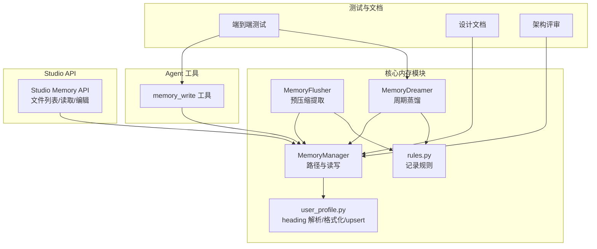
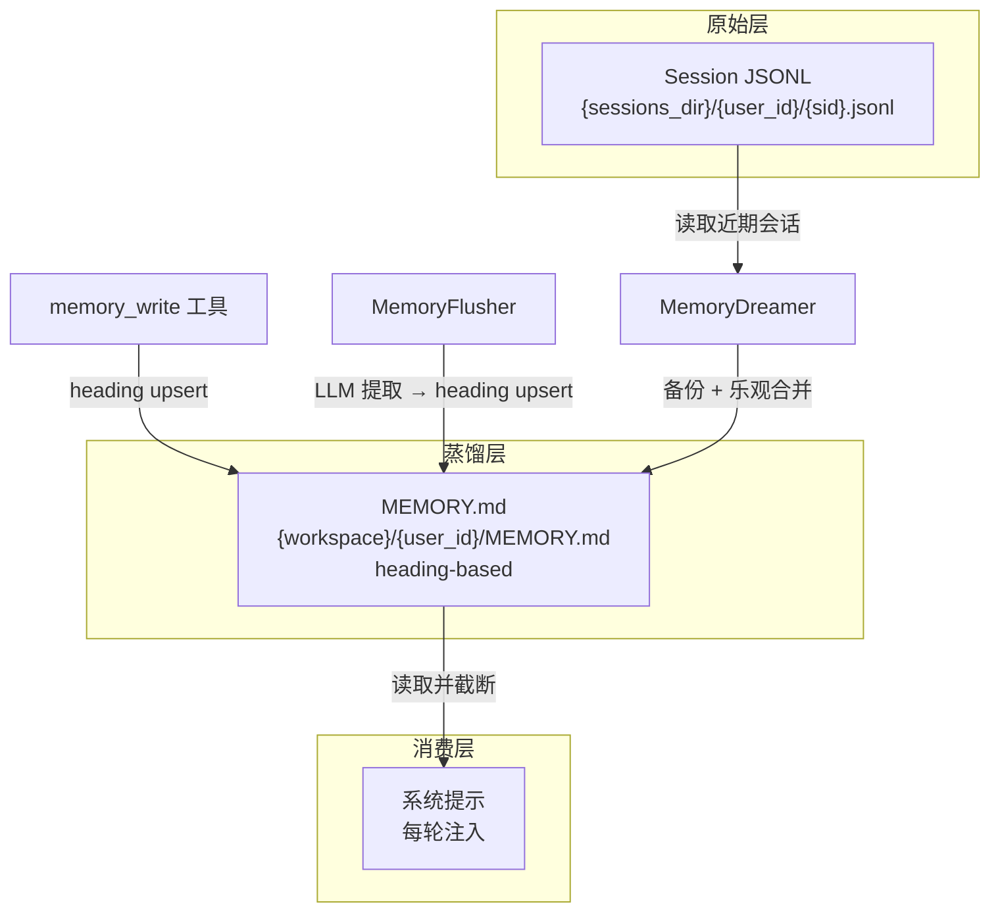
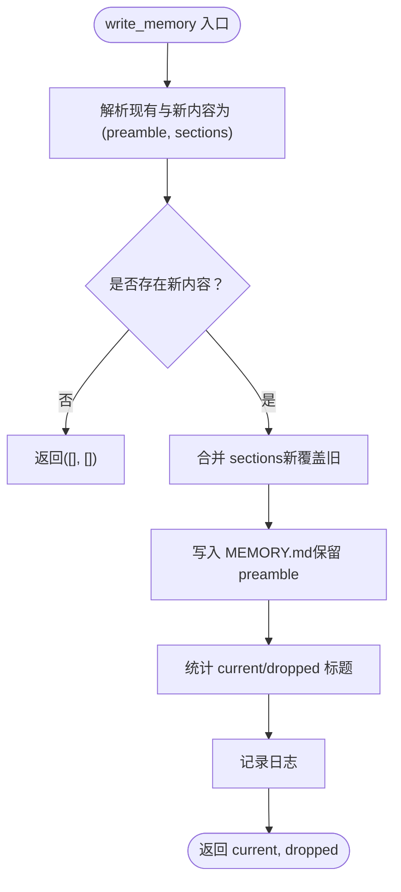
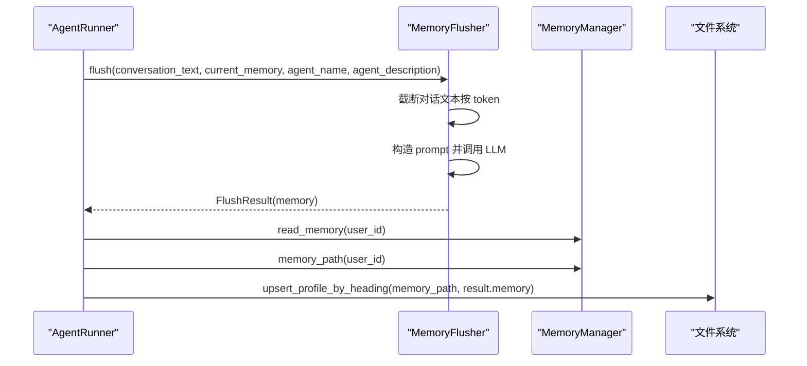
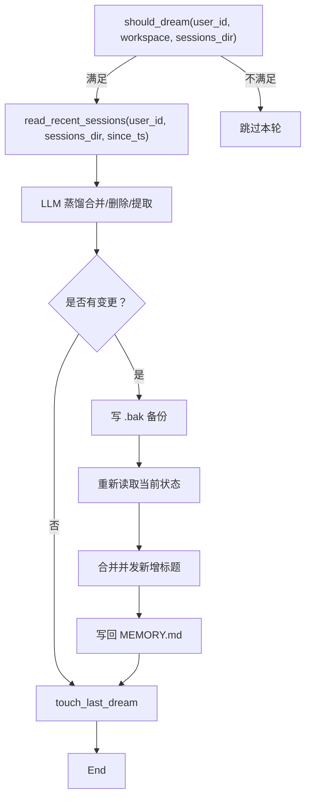
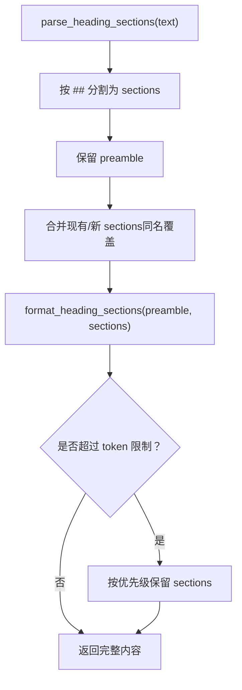
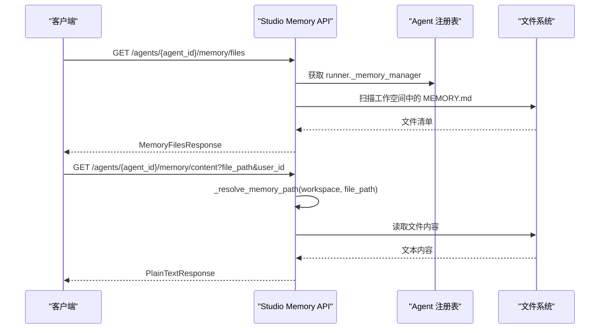
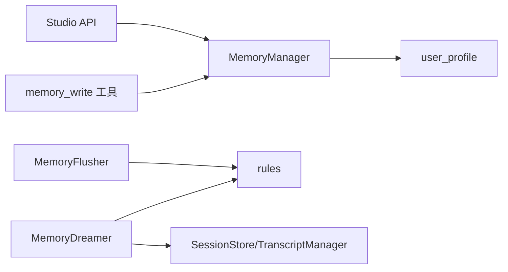

# 内存管理 API

<cite>
**本文档引用的文件**
- [manager.py](file://src/ark_agentic/core/memory/manager.py)
- [user_profile.py](file://src/ark_agentic/core/memory/user_profile.py)
- [extractor.py](file://src/ark_agentic/core/memory/extractor.py)
- [dream.py](file://src/ark_agentic/core/memory/dream.py)
- [rules.py](file://src/ark_agentic/core/memory/rules.py)
- [memory.py（工具）](file://src/ark_agentic/core/tools/memory.py)
- [memory.py（Studio API）](file://src/ark_agentic/studio/api/memory.py)
- [memory.md](file://docs/core/memory.md)
- [memory_architecture_review.md](file://docs/core/memory_architecture_review.md)
- [test_memory_e2e.py](file://tests/e2e/test_memory_e2e.py)
- [models.py](file://src/ark_agentic/api/models.py)
- [types.py](file://src/ark_agentic/core/types.py)
</cite>

## 目录
1. [简介](#简介)
2. [项目结构](#项目结构)
3. [核心组件](#核心组件)
4. [架构总览](#架构总览)
5. [详细组件分析](#详细组件分析)
6. [依赖关系分析](#依赖关系分析)
7. [性能考量](#性能考量)
8. [故障排查指南](#故障排查指南)
9. [结论](#结论)
10. [附录](#附录)

## 简介
本文件面向“内存管理 API”的使用者与维护者，系统化梳理基于文件存储与 LLM 蒸馏的记忆生命周期：从会话原始数据到长期记忆文件，再到系统提示注入与后台周期蒸馏。文档覆盖以下主题：
- 查询、检索、清理与管理接口
- 内存数据模型与存储格式
- 内存访问权限控制与路径解析
- 会话记忆管理与长期记忆存储
- 记忆数据导出与 Studio API
- 内存查询优化与使用监控
- 内存与智能体交互的数据流与隐私保护机制

## 项目结构
围绕“内存”功能的核心模块分布如下：
- 核心内存管理：manager.py、user_profile.py、extractor.py、dream.py、rules.py
- Agent 工具：core/tools/memory.py（提供 memory_write）
- Studio API：studio/api/memory.py（文件列表、内容读取、内容编辑）
- 文档与评审：docs/core/memory.md、docs/core/memory_architecture_review.md
- 测试：tests/e2e/test_memory_e2e.py
- API 数据模型：src/ark_agentic/api/models.py、src/ark_agentic/core/types.py

图表来源
- [manager.py:24-92](file://src/ark_agentic/core/memory/manager.py#L24-L92)
- [user_profile.py:26-138](file://src/ark_agentic/core/memory/user_profile.py#L26-L138)
- [extractor.py:98-187](file://src/ark_agentic/core/memory/extractor.py#L98-L187)
- [dream.py:190-323](file://src/ark_agentic/core/memory/dream.py#L190-L323)
- [rules.py:7-32](file://src/ark_agentic/core/memory/rules.py#L7-L32)
- [memory.py（工具）:39-114](file://src/ark_agentic/core/tools/memory.py#L39-L114)
- [memory.py（Studio API）:105-160](file://src/ark_agentic/studio/api/memory.py#L105-L160)
- [memory.md:24-41](file://docs/core/memory.md#L24-L41)
- [memory_architecture_review.md:170-196](file://docs/core/memory_architecture_review.md#L170-L196)

章节来源
- [memory.md:9-41](file://docs/core/memory.md#L9-L41)
- [memory_architecture_review.md:10-20](file://docs/core/memory_architecture_review.md#L10-L20)

## 核心组件
- MemoryManager：负责按 user_id 定位 MEMORY.md 路径，并提供 read/write 接口；支持 heading-level upsert。
- MemoryFlusher：在上下文压缩前，从完整对话中提取需要持久化的记忆，写入 MEMORY.md。
- MemoryDreamer：周期性读取近期会话与当前记忆，经 LLM 蒸馏后进行乐观合并写回。
- user_profile：提供 heading-based markdown 的解析、格式化与 upsert 语义，保证 preamble 不被覆盖。
- rules：统一“该记/不该记”的规则与 heading 优先级。
- memory_write 工具：Agent 主动写入/更新记忆，使用 heading upsert。
- Studio Memory API：列出文件、读取内容、编辑内容，含路径遍历防护。

章节来源
- [manager.py:24-92](file://src/ark_agentic/core/memory/manager.py#L24-L92)
- [user_profile.py:26-138](file://src/ark_agentic/core/memory/user_profile.py#L26-L138)
- [extractor.py:98-187](file://src/ark_agentic/core/memory/extractor.py#L98-L187)
- [dream.py:190-323](file://src/ark_agentic/core/memory/dream.py#L190-L323)
- [rules.py:7-32](file://src/ark_agentic/core/memory/rules.py#L7-L32)
- [memory.py（工具）:39-114](file://src/ark_agentic/core/tools/memory.py#L39-L114)
- [memory.py（Studio API）:105-160](file://src/ark_agentic/studio/api/memory.py#L105-L160)

## 架构总览
内存系统遵循“原始会话 → 长期记忆 → 系统提示注入”的生命周期，采用纯文件存储与 LLM 蒸馏，避免数据库与向量库依赖。

图表来源
- [memory.md:24-41](file://docs/core/memory.md#L24-L41)
- [dream.py:190-323](file://src/ark_agentic/core/memory/dream.py#L190-L323)
- [extractor.py:98-187](file://src/ark_agentic/core/memory/extractor.py#L98-L187)
- [manager.py:41-69](file://src/ark_agentic/core/memory/manager.py#L41-L69)

## 详细组件分析

### MemoryManager（路径与读写）
- 职责
  - 按 user_id 计算 MEMORY.md 路径
  - 提供 read_memory / write_memory
  - heading-level upsert：同名标题覆盖，空内容删除，保留 preamble
- 关键行为
  - write_memory 返回当前存在的标题与被删除的标题，便于审计
  - 不存在 content 中不包含二级标题时，返回空结果
- 并发与一致性
  - 乐观合并：在 Dream 应用阶段，重新读取当前状态，保留并发写入的新标题

图表来源
- [manager.py:45-69](file://src/ark_agentic/core/memory/manager.py#L45-L69)
- [user_profile.py:66-94](file://src/ark_agentic/core/memory/user_profile.py#L66-L94)

章节来源
- [manager.py:24-92](file://src/ark_agentic/core/memory/manager.py#L24-L92)
- [user_profile.py:26-94](file://src/ark_agentic/core/memory/user_profile.py#L26-L94)

### MemoryFlusher（预压缩提取）
- 触发时机：上下文压缩前，基于完整对话历史提取需要长期保存的信息
- 输入：当前 MEMORY.md + 对话文本（截断至最大 token）
- 输出：heading-based markdown，通过 upsert 写入 MEMORY.md
- 错误处理：非 JSON 输出或空内容时静默跳过

图表来源
- [extractor.py:108-187](file://src/ark_agentic/core/memory/extractor.py#L108-L187)
- [manager.py:41-43](file://src/ark_agentic/core/memory/manager.py#L41-L43)
- [user_profile.py:66-94](file://src/ark_agentic/core/memory/user_profile.py#L66-L94)

章节来源
- [extractor.py:98-187](file://src/ark_agentic/core/memory/extractor.py#L98-L187)

### MemoryDreamer（周期蒸馏）
- 触发条件：距离上次蒸馏≥24小时，且自上次以来新增≥3 个会话
- 读取范围：从 sessions_dir 读取近期会话（user+assistant，过滤 tool 噪声），限制 token 预算
- 蒸馏策略：合并相似标题、删除过时信息、保留有效偏好、提取新信息
- 应用策略：备份原文件，乐观合并期间并发新增的标题，写回最终内容并更新时间戳

图表来源
- [dream.py:147-323](file://src/ark_agentic/core/memory/dream.py#L147-L323)

章节来源
- [dream.py:190-323](file://src/ark_agentic/core/memory/dream.py#L190-L323)

### user_profile（heading-based upsert）
- 解析：将 heading-based markdown 分割为 preamble 与 sections
- 格式化：按 preamble + sections 顺序输出，空内容标题被过滤
- upsert：同名标题覆盖，新标题追加，preamble 优先保留
- 截断：按优先级保留完整 section，避免截断半句

图表来源
- [user_profile.py:26-138](file://src/ark_agentic/core/memory/user_profile.py#L26-L138)

章节来源
- [user_profile.py:26-138](file://src/ark_agentic/core/memory/user_profile.py#L26-L138)

### 记录规则与优先级（rules）
- 记录类别：身份信息、沟通风格偏好、持久业务偏好、风险偏好、用户明确要求记住的内容
- 不记录类别：单次操作决策、临时计算/公开信息、寒暄闲聊、当前记忆中未变化的内容
- 优先级：身份信息 > 沟通风格 > 业务偏好 > 风险偏好

章节来源
- [rules.py:7-32](file://src/ark_agentic/core/memory/rules.py#L7-L32)

### Agent 工具：memory_write
- 功能：Agent 主动写入/更新长期记忆，使用 heading upsert
- 参数：content（heading-based markdown）
- 行为：校验 user_id，调用 MemoryManager.write_memory，返回当前/删除的标题集合
- 错误处理：空 content 或无 heading 时返回错误信息

章节来源
- [memory.py（工具）:39-114](file://src/ark_agentic/core/tools/memory.py#L39-L114)
- [manager.py:45-69](file://src/ark_agentic/core/memory/manager.py#L45-L69)

### Studio Memory API
- 文件列表：扫描工作空间下的 MEMORY.md（全局与用户子目录）
- 内容读取：GET /agents/{agent_id}/memory/content（相对路径 + user_id 作用域）
- 内容编辑：PUT /agents/{agent_id}/memory/content（路径遍历防护）
- 权限控制：路径解析严格限定在工作空间内，拒绝越权访问

图表来源
- [memory.py（Studio API）:105-160](file://src/ark_agentic/studio/api/memory.py#L105-L160)

章节来源
- [memory.py（Studio API）:105-160](file://src/ark_agentic/studio/api/memory.py#L105-L160)

## 依赖关系分析
- 组件耦合
  - MemoryManager 与 user_profile：write_memory 依赖 upsert 语义
  - MemoryFlusher 与 rules：提取时遵循统一记录规则
  - MemoryDreamer 与 SessionStore/TranscriptManager：读取近期会话
  - Studio API 与 MemoryManager：通过 runner 注入的 MemoryManager 提供文件读写
- 外部依赖
  - LLM 调用：MemoryFlusher 与 MemoryDreamer 通过工厂函数延迟获取 LLM 实例
  - 文件系统：纯文件存储，无数据库依赖

图表来源
- [manager.py:51-51](file://src/ark_agentic/core/memory/manager.py#L51-L51)
- [extractor.py:16-16](file://src/ark_agentic/core/memory/extractor.py#L16-L16)
- [dream.py:109-110](file://src/ark_agentic/core/memory/dream.py#L109-L110)
- [memory.py（Studio API）:91-100](file://src/ark_agentic/studio/api/memory.py#L91-L100)
- [memory.py（工具）:64-66](file://src/ark_agentic/core/tools/memory.py#L64-L66)

章节来源
- [manager.py:51-51](file://src/ark_agentic/core/memory/manager.py#L51-L51)
- [extractor.py:16-16](file://src/ark_agentic/core/memory/extractor.py#L16-L16)
- [dream.py:109-110](file://src/ark_agentic/core/memory/dream.py#L109-L110)
- [memory.py（Studio API）:91-100](file://src/ark_agentic/studio/api/memory.py#L91-L100)
- [memory.py（工具）:64-66](file://src/ark_agentic/core/tools/memory.py#L64-L66)

## 性能考量
- Token 预算与截断
  - MemoryFlusher 对对话文本进行 token 估算与截断，避免超限
  - user_profile.truncate_profile 按优先级保留完整 section，避免截断半句
- 并发与乐观合并
  - Dream 应用阶段重新读取当前状态，检测并发新增标题并合并，减少冲突
- I/O 优化
  - heading-level upsert 避免全量重写，仅更新受影响部分
- 监控与审计
  - write_memory 返回 current/dropped 标题，便于追踪变更
  - 日志记录写入与蒸馏过程，便于定位异常

章节来源
- [extractor.py:116-120](file://src/ark_agentic/core/memory/extractor.py#L116-L120)
- [user_profile.py:96-138](file://src/ark_agentic/core/memory/user_profile.py#L96-L138)
- [manager.py:66-69](file://src/ark_agentic/core/memory/manager.py#L66-L69)
- [dream.py:242-287](file://src/ark_agentic/core/memory/dream.py#L242-L287)

## 故障排查指南
- 写入无效
  - 确认 content 包含二级标题（## 标题），否则 upsert 会跳过
  - 检查返回的 current_headings 是否为空
- 内容未生效
  - 检查是否处于 AutoCompact 模式，必要时关闭以观察 system prompt 注入
  - 确认 MEMORY.md 路径正确（按 user_id 分区）
- 蒸馏未触发
  - 检查 .last_dream 时间戳与新增会话数量是否满足门限
  - 确认 sessions_dir 中存在近期会话
- Studio API 访问受限
  - 确认 file_path 在工作空间内，避免路径穿越
  - 确认 agent_id 对应的 runner 已启用 MemoryManager

章节来源
- [memory.py（工具）:73-108](file://src/ark_agentic/core/tools/memory.py#L73-L108)
- [test_memory_e2e.py:100-162](file://tests/e2e/test_memory_e2e.py#L100-L162)
- [test_memory_e2e.py:165-210](file://tests/e2e/test_memory_e2e.py#L165-L210)
- [test_memory_e2e.py:212-260](file://tests/e2e/test_memory_e2e.py#L212-L260)
- [memory.py（Studio API）:83-100](file://src/ark_agentic/studio/api/memory.py#L83-L100)

## 结论
本内存管理 API 以“heading-based markdown + LLM 蒸馏”为核心，实现了从会话到长期记忆的自动化闭环。其优势在于：
- 简洁可靠：纯文件存储，无外部依赖
- 可解释性强：记录规则与优先级清晰
- 并发友好：乐观合并与路径遍历防护
同时，文档也指出当前版本在多用户作用域、UPSERET 语义、召回多样性与时间衰减等方面的改进空间，为后续演进提供了方向。

## 附录

### 内存数据模型与存储格式
- 存储位置：{workspace}/{user_id}/MEMORY.md
- 格式：heading-based markdown（## 标题 + 内容）
- 语义：同名标题覆盖，空内容删除，preamble 永远保留
- 截断：按优先级保留完整 section，避免截断半句

章节来源
- [user_profile.py:26-138](file://src/ark_agentic/core/memory/user_profile.py#L26-L138)
- [memory.md:80-104](file://docs/core/memory.md#L80-L104)

### 记忆生命周期与数据流
- 写入（对话中）：memory_write → upsert_profile_by_heading → MEMORY.md
- 提取（压缩前）：MemoryFlusher → LLM 提取 → heading upsert → MEMORY.md
- 读取（每轮）：runner 注入 system prompt → 截断到 token 限制
- 蒸馏（后台）：读取近期会话 + 当前记忆 → LLM 合并/删除/提取 → 乐观合并写回 → 更新时间戳

章节来源
- [memory.md:59-79](file://docs/core/memory.md#L59-L79)
- [dream.py:190-323](file://src/ark_agentic/core/memory/dream.py#L190-L323)
- [extractor.py:98-187](file://src/ark_agentic/core/memory/extractor.py#L98-L187)
- [manager.py:41-69](file://src/ark_agentic/core/memory/manager.py#L41-L69)

### 记忆查询与检索接口
- Agent 工具
  - memory_write：写入/更新 heading-based 内容
- Studio API
  - 列表：GET /agents/{agent_id}/memory/files
  - 读取：GET /agents/{agent_id}/memory/content?file_path&user_id
  - 编辑：PUT /agents/{agent_id}/memory/content?file_path&user_id
- 权限控制
  - 路径解析严格限定在工作空间内，拒绝越权访问

章节来源
- [memory.py（工具）:39-114](file://src/ark_agentic/core/tools/memory.py#L39-L114)
- [memory.py（Studio API）:105-160](file://src/ark_agentic/studio/api/memory.py#L105-L160)

### 内存查询优化与使用监控
- 优化策略
  - heading-level upsert：减少全量写入
  - token 截断与优先级保留：控制系统提示长度
  - 乐观合并：降低并发冲突
- 监控指标
  - write_memory 返回 current/dropped 标题
  - 日志记录写入与蒸馏过程
  - token 估算与预算控制

章节来源
- [manager.py:66-69](file://src/ark_agentic/core/memory/manager.py#L66-L69)
- [user_profile.py:96-138](file://src/ark_agentic/core/memory/user_profile.py#L96-L138)
- [extractor.py:116-120](file://src/ark_agentic/core/memory/extractor.py#L116-L120)
- [dream.py:242-287](file://src/ark_agentic/core/memory/dream.py#L242-L287)

### 内存与智能体交互的数据流与隐私保护
- 数据流
  - MEMORY.md 全文注入 system prompt，Agent 无需额外检索工具
  - 记录规则与优先级确保“该记/不该记”的一致性
- 隐私保护
  - 路径遍历防护：拒绝越权访问
  - 多用户隔离：按 user_id 分区
  - 仅存储结构化 heading 信息，避免敏感数据泄露

章节来源
- [memory.md:113-121](file://docs/core/memory.md#L113-L121)
- [memory.py（Studio API）:83-100](file://src/ark_agentic/studio/api/memory.py#L83-L100)
- [manager.py:37-39](file://src/ark_agentic/core/memory/manager.py#L37-L39)