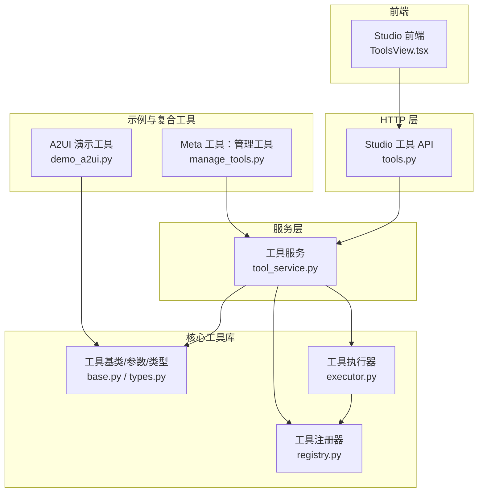
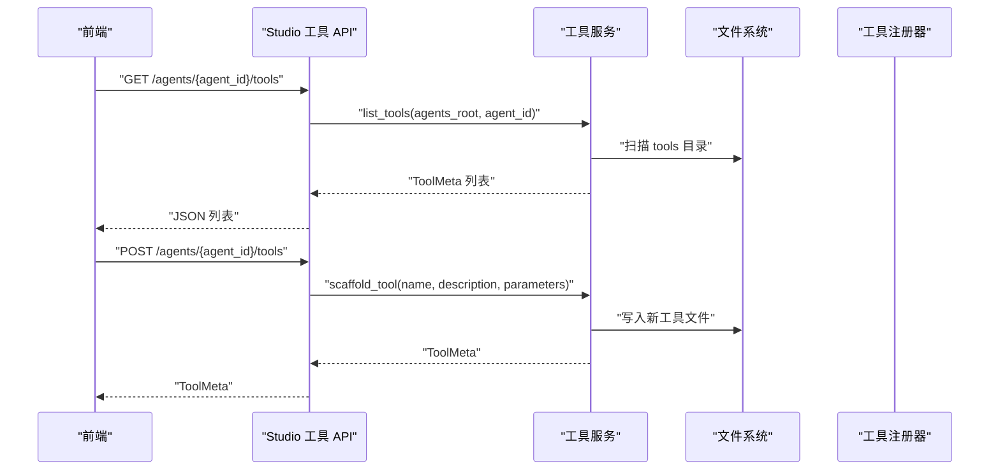
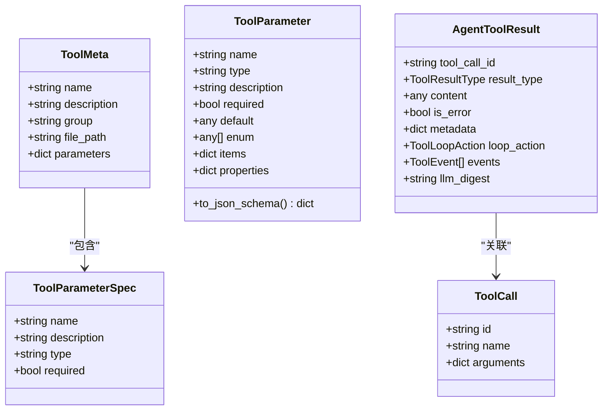
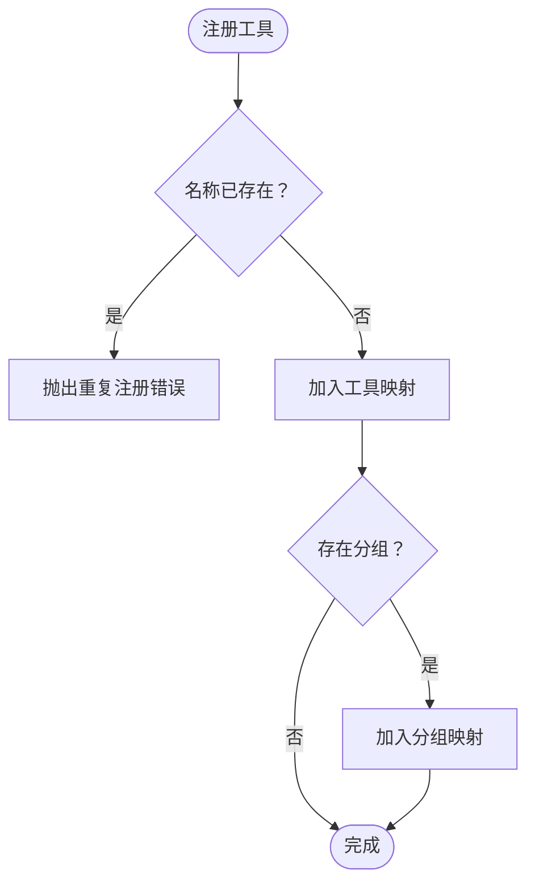
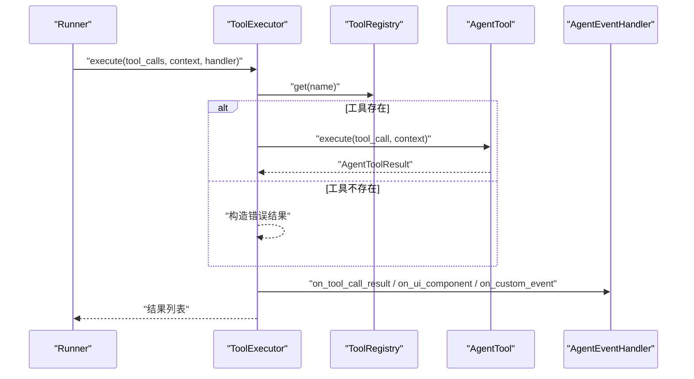
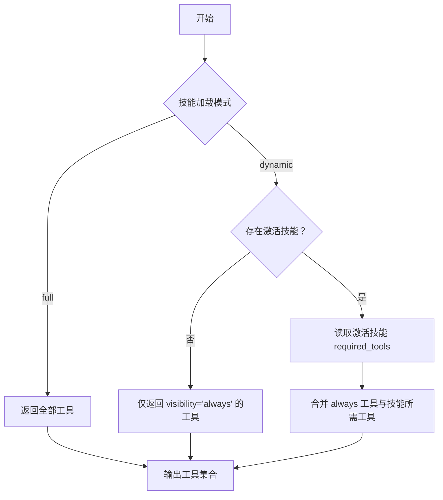
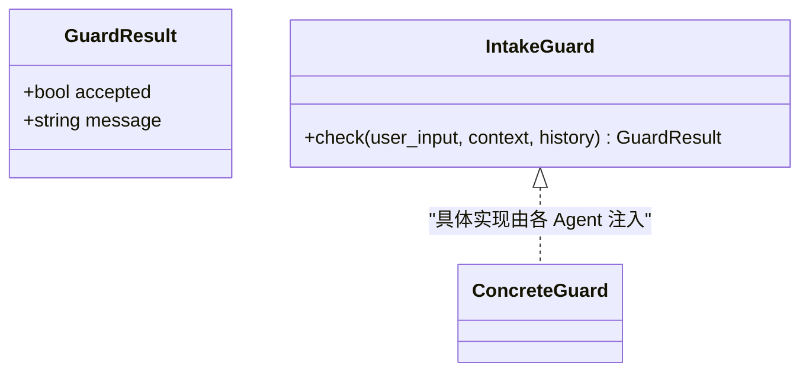
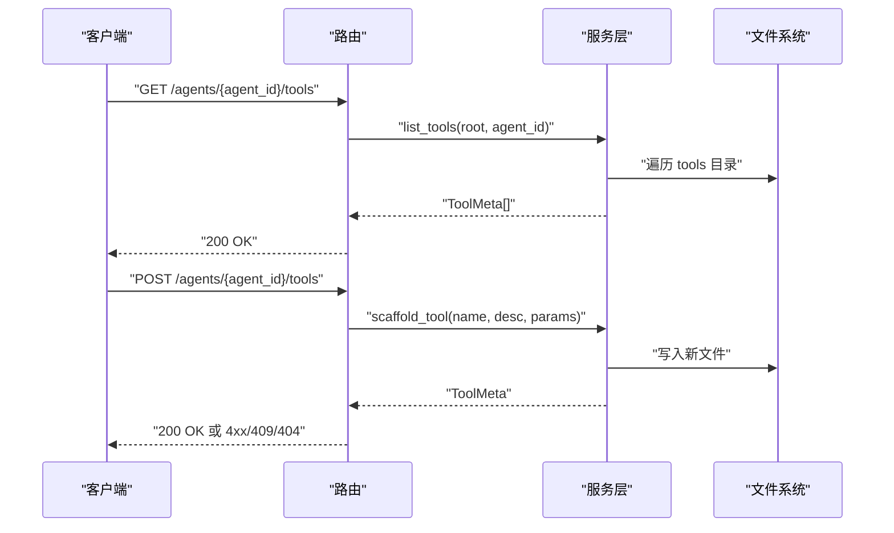
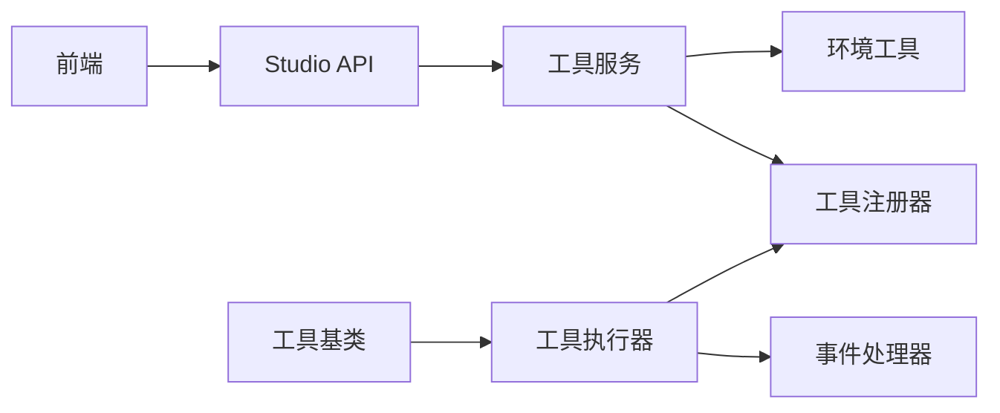

# 工具管理 API

<cite>
**本文引用的文件**
- [src/ark_agentic/studio/services/tool_service.py](file://src/ark_agentic/studio/services/tool_service.py)
- [src/ark_agentic/studio/api/tools.py](file://src/ark_agentic/studio/api/tools.py)
- [src/ark_agentic/core/tools/base.py](file://src/ark_agentic/core/tools/base.py)
- [src/ark_agentic/core/tools/registry.py](file://src/ark_agentic/core/tools/registry.py)
- [src/ark_agentic/core/tools/executor.py](file://src/ark_agentic/core/tools/executor.py)
- [src/ark_agentic/core/types.py](file://src/ark_agentic/core/types.py)
- [src/ark_agentic/studio/frontend/src/pages/ToolsView.tsx](file://src/ark_agentic/studio/frontend/src/pages/ToolsView.tsx)
- [src/ark_agentic/core/tools/demo_a2ui.py](file://src/ark_agentic/core/tools/demo_a2ui.py)
- [src/ark_agentic/agents/meta_builder/tools/manage_tools.py](file://src/ark_agentic/agents/meta_builder/tools/manage_tools.py)
- [tests/unit/core/test_tools.py](file://tests/unit/core/test_tools.py)
- [tests/integration/test_tool_service.py](file://tests/integration/test_tool_service.py)
- [src/ark_agentic/core/guard.py](file://src/ark_agentic/core/guard.py)
- [src/ark_agentic/core/runner.py](file://src/ark_agentic/core/runner.py)
</cite>

## 目录
1. [简介](#简介)
2. [项目结构](#项目结构)
3. [核心组件](#核心组件)
4. [架构总览](#架构总览)
5. [详细组件分析](#详细组件分析)
6. [依赖关系分析](#依赖关系分析)
7. [性能考量](#性能考量)
8. [故障排查指南](#故障排查指南)
9. [结论](#结论)
10. [附录](#附录)

## 简介
本文件面向工具管理 API 的使用者与维护者，系统性梳理工具的注册、配置、测试与管理流程，明确工具数据模型、配置格式、执行机制与安全策略。文档同时覆盖工具分类管理、工具依赖关系、工具与技能的协作关系、工具执行上下文以及开发规范、调试方法与性能优化建议。

## 项目结构
工具管理 API 的实现采用“薄 HTTP 层 + 纯业务服务层”的分层设计：
- HTTP 层：提供 REST 接口，负责参数校验与错误映射
- 服务层：提供工具清单、脚手架生成、元数据解析等纯业务逻辑
- 核心工具库：抽象工具基类、参数读取、注册器、执行器与类型定义
- 前端页面：Studio 工具管理界面，支持查看、新建工具脚手架
- 示例与复合工具：演示 A2UI 工具与 Meta-Agent 的工具管理工具

图表来源
- [src/ark_agentic/studio/api/tools.py:1-66](file://src/ark_agentic/studio/api/tools.py#L1-L66)
- [src/ark_agentic/studio/services/tool_service.py:1-235](file://src/ark_agentic/studio/services/tool_service.py#L1-L235)
- [src/ark_agentic/core/tools/base.py:1-289](file://src/ark_agentic/core/tools/base.py#L1-L289)
- [src/ark_agentic/core/tools/registry.py:1-178](file://src/ark_agentic/core/tools/registry.py#L1-L178)
- [src/ark_agentic/core/tools/executor.py:1-127](file://src/ark_agentic/core/tools/executor.py#L1-L127)
- [src/ark_agentic/core/tools/demo_a2ui.py:1-74](file://src/ark_agentic/core/tools/demo_a2ui.py#L1-L74)
- [src/ark_agentic/agents/meta_builder/tools/manage_tools.py:1-315](file://src/ark_agentic/agents/meta_builder/tools/manage_tools.py#L1-L315)

章节来源
- [src/ark_agentic/studio/api/tools.py:1-66](file://src/ark_agentic/studio/api/tools.py#L1-L66)
- [src/ark_agentic/studio/services/tool_service.py:1-235](file://src/ark_agentic/studio/services/tool_service.py#L1-L235)

## 核心组件
- 工具数据模型
  - ToolMeta：工具元数据，包含名称、描述、分组、文件路径与参数字典
  - ToolParameterSpec：脚手架参数规格
  - ToolParameter：工具参数定义，支持 JSON Schema 导出
  - AgentToolResult：工具执行结果，支持多种结果类型与事件
  - ToolCall：工具调用请求
- 工具基类与参数读取
  - AgentTool：抽象基类，强制子类定义 name 与 description，并提供 JSON Schema 生成与 LangChain 适配
  - 参数读取辅助函数：统一读取字符串、整数、浮点、布尔、列表、字典参数
- 工具注册器
  - ToolRegistry：注册、查询、分组、过滤与 JSON Schema 生成
- 工具执行器
  - ToolExecutor：顺序/并发执行工具调用、超时控制、错误兜底与事件分发
- 工具服务
  - list_tools：基于 AST 解析 Agent 下所有工具元数据
  - scaffold_tool：生成工具脚手架文件并返回 ToolMeta
  - parse_tool_file：解析单个工具文件的元数据
- Studio 工具 API
  - GET /agents/{agent_id}/tools：列出工具
  - POST /agents/{agent_id}/tools：生成工具脚手架
- 前端工具视图
  - 支持查看工具列表、选择工具、查看参数 Schema、新建工具脚手架

章节来源
- [src/ark_agentic/core/tools/base.py:16-289](file://src/ark_agentic/core/tools/base.py#L16-L289)
- [src/ark_agentic/core/tools/registry.py:14-178](file://src/ark_agentic/core/tools/registry.py#L14-L178)
- [src/ark_agentic/core/tools/executor.py:29-127](file://src/ark_agentic/core/tools/executor.py#L29-L127)
- [src/ark_agentic/studio/services/tool_service.py:21-235](file://src/ark_agentic/studio/services/tool_service.py#L21-L235)
- [src/ark_agentic/studio/api/tools.py:24-66](file://src/ark_agentic/studio/api/tools.py#L24-L66)
- [src/ark_agentic/studio/frontend/src/pages/ToolsView.tsx:1-171](file://src/ark_agentic/studio/frontend/src/pages/ToolsView.tsx#L1-L171)

## 架构总览
工具管理 API 的调用链路如下：

图表来源
- [src/ark_agentic/studio/api/tools.py:41-66](file://src/ark_agentic/studio/api/tools.py#L41-L66)
- [src/ark_agentic/studio/services/tool_service.py:40-99](file://src/ark_agentic/studio/services/tool_service.py#L40-L99)

## 详细组件分析

### 数据模型与配置格式
- ToolMeta
  - 字段：name、description、group、file_path、parameters
  - 用途：API 响应与前端展示
- ToolParameterSpec
  - 字段：name、description、type、required
  - 用途：脚手架参数规格输入
- ToolParameter
  - 字段：name、type、description、required、default、enum、items、properties
  - 方法：to_json_schema() 导出 JSON Schema
- AgentToolResult
  - 结果类型：JSON、TEXT、IMAGE、A2UI、ERROR
  - 事件：UIComponentToolEvent、CustomToolEvent、StepToolEvent
- ToolCall
  - 字段：id、name、arguments
  - 工具调用请求载体

图表来源
- [src/ark_agentic/studio/services/tool_service.py:23-36](file://src/ark_agentic/studio/services/tool_service.py#L23-L36)
- [src/ark_agentic/core/tools/base.py:16-44](file://src/ark_agentic/core/tools/base.py#L16-L44)
- [src/ark_agentic/core/types.py:84-196](file://src/ark_agentic/core/types.py#L84-L196)
- [src/ark_agentic/core/types.py:69-83](file://src/ark_agentic/core/types.py#L69-L83)

章节来源
- [src/ark_agentic/studio/services/tool_service.py:23-36](file://src/ark_agentic/studio/services/tool_service.py#L23-L36)
- [src/ark_agentic/core/tools/base.py:16-44](file://src/ark_agentic/core/tools/base.py#L16-L44)
- [src/ark_agentic/core/types.py:27-196](file://src/ark_agentic/core/types.py#L27-L196)

### 工具注册与分类管理
- 注册器 ToolRegistry
  - 注册/批量注册、查询、按组查询、列出名称与分组
  - 过滤策略：允许/拒绝工具与分组
  - JSON Schema 生成：支持按名称、分组或排除列表筛选
- 工具分组
  - 工具类可设置 group，注册器维护 group -> tool names 映射
  - 运行期可通过分组进行策略控制

图表来源
- [src/ark_agentic/core/tools/registry.py:24-40](file://src/ark_agentic/core/tools/registry.py#L24-L40)

章节来源
- [src/ark_agentic/core/tools/registry.py:14-178](file://src/ark_agentic/core/tools/registry.py#L14-L178)

### 工具执行机制与上下文
- ToolExecutor
  - 并发执行工具调用，限制每轮最大调用次数
  - 超时控制与异常兜底，统一分发事件到 AgentEventHandler
  - 将 A2UI 结果自动转换为 UIComponentToolEvent
- AgentTool
  - 强制实现 execute(tool_call, context)，支持执行上下文
  - 提供 JSON Schema 生成，便于 LLM 函数调用
  - 可选的 LangChain 适配方法 to_langchain_tool()

图表来源
- [src/ark_agentic/core/tools/executor.py:43-101](file://src/ark_agentic/core/tools/executor.py#L43-L101)
- [src/ark_agentic/core/tools/base.py:103-116](file://src/ark_agentic/core/tools/base.py#L103-L116)

章节来源
- [src/ark_agentic/core/tools/executor.py:29-127](file://src/ark_agentic/core/tools/executor.py#L29-L127)
- [src/ark_agentic/core/tools/base.py:46-163](file://src/ark_agentic/core/tools/base.py#L46-L163)

### 工具与技能的协作关系
- 工具可见性策略
  - visibility 控制：always 始终可见；auto 仅在对应技能被 read_skill 激活后可见
- 运行期过滤
  - Runner 根据技能加载模式与当前激活技能，动态暴露 required_tools
- 技能元数据
  - SkillMetadata.required_tools 定义工具依赖
  - SkillEntry.metadata 提供技能元信息

图表来源
- [src/ark_agentic/core/runner.py:1158-1188](file://src/ark_agentic/core/runner.py#L1158-L1188)
- [src/ark_agentic/core/types.py:243-292](file://src/ark_agentic/core/types.py#L243-L292)

章节来源
- [src/ark_agentic/core/runner.py:1158-1188](file://src/ark_agentic/core/runner.py#L1158-L1188)
- [src/ark_agentic/core/types.py:243-292](file://src/ark_agentic/core/types.py#L243-L292)

### 工具安全验证与准入控制
- 准入检查协议
  - IntakeGuard 协议定义 check(user_input, context, history) -> GuardResult
  - GuardResult.accepted 与 message 决定是否进入 ReAct 循环
- 工具层面的安全
  - requires_confirmation 标记工具需要二次确认
  - ManageToolsTool 对 create/update/delete 操作要求用户确认语句

图表来源
- [src/ark_agentic/core/guard.py:18-34](file://src/ark_agentic/core/guard.py#L18-L34)
- [src/ark_agentic/agents/meta_builder/tools/manage_tools.py:25-46](file://src/ark_agentic/agents/meta_builder/tools/manage_tools.py#L25-L46)

章节来源
- [src/ark_agentic/core/guard.py:18-34](file://src/ark_agentic/core/guard.py#L18-L34)
- [src/ark_agentic/agents/meta_builder/tools/manage_tools.py:185-315](file://src/ark_agentic/agents/meta_builder/tools/manage_tools.py#L185-L315)

### 工具管理 API 接口定义
- 列出工具
  - 方法：GET
  - 路径：/agents/{agent_id}/tools
  - 请求参数：agent_id
  - 响应：ToolListResponse(tools: ToolMeta[])
- 生成工具脚手架
  - 方法：POST
  - 路径：/agents/{agent_id}/tools
  - 请求体：ToolScaffoldRequest
    - name: 工具名（Python 标识符）
    - description: 描述
    - parameters: 参数列表（name、description、type、required）
  - 响应：ToolMeta

图表来源
- [src/ark_agentic/studio/api/tools.py:41-66](file://src/ark_agentic/studio/api/tools.py#L41-L66)
- [src/ark_agentic/studio/services/tool_service.py:40-99](file://src/ark_agentic/studio/services/tool_service.py#L40-L99)

章节来源
- [src/ark_agentic/studio/api/tools.py:24-66](file://src/ark_agentic/studio/api/tools.py#L24-L66)
- [src/ark_agentic/studio/services/tool_service.py:40-99](file://src/ark_agentic/studio/services/tool_service.py#L40-L99)

### 工具开发规范
- 工具基类
  - 必须定义 name 与 description
  - 实现异步 execute(tool_call, context) -> AgentToolResult
  - 可选设置 group、visibility、requires_confirmation、thinking_hint
- 参数定义
  - 使用 ToolParameter 定义参数类型、默认值、枚举与嵌套结构
  - 通过 ToolParameter.to_json_schema() 自动生成 JSON Schema
- 事件与 UI
  - A2UI 结果自动转换为 UIComponentToolEvent
  - 可发送自定义事件 CustomToolEvent 与步骤事件 StepToolEvent
- 脚手架生成
  - 使用 scaffold_tool 生成标准 AgentTool 模板
  - 模板包含基础导入、日志、类定义与占位 execute 实现

章节来源
- [src/ark_agentic/core/tools/base.py:46-163](file://src/ark_agentic/core/tools/base.py#L46-L163)
- [src/ark_agentic/studio/services/tool_service.py:181-235](file://src/ark_agentic/studio/services/tool_service.py#L181-L235)

### 工具调试方法
- 单元测试
  - 参数读取函数测试：字符串、整数、浮点、布尔、列表、字典
  - 工具基类与注册器行为测试
- 集成测试
  - 直接调用服务层：scaffold_tool、list_tools、parse_tool_file、render_tool_template
  - 验证文件路径、类名转换、AST 可解析性
- 前端调试
  - ToolsView.tsx：查看工具列表、参数 Schema、新建脚手架
  - 观察网络请求与响应，定位服务层异常

章节来源
- [tests/unit/core/test_tools.py:1-344](file://tests/unit/core/test_tools.py#L1-L344)
- [tests/integration/test_tool_service.py:1-168](file://tests/integration/test_tool_service.py#L1-L168)
- [src/ark_agentic/studio/frontend/src/pages/ToolsView.tsx:1-171](file://src/ark_agentic/studio/frontend/src/pages/ToolsView.tsx#L1-L171)

### 工具性能优化建议
- 并发与限流
  - ToolExecutor 默认限制每轮工具调用数量，避免过载
  - 合理设置超时时间，防止阻塞
- 结果类型与事件
  - A2UI 结果自动拆分为 UIComponentToolEvent，减少大对象传输
  - 自定义事件携带 ui_protocol，前端按需渲染
- 注册与过滤
  - 使用 ToolRegistry 的过滤策略减少 LLM 工具面
  - 动态模式下仅暴露必要工具，降低上下文复杂度

章节来源
- [src/ark_agentic/core/tools/executor.py:29-108](file://src/ark_agentic/core/tools/executor.py#L29-L108)
- [src/ark_agentic/core/tools/registry.py:130-169](file://src/ark_agentic/core/tools/registry.py#L130-L169)

## 依赖关系分析
- 组件耦合
  - HTTP 层仅依赖服务层，服务层不依赖框架，保持可复用性
  - 工具服务依赖环境工具 resolve_agent_dir 与 get_agents_root
  - 执行器依赖注册器与事件处理器，遵循依赖倒置原则
- 外部依赖
  - LangChain 适配为可选依赖，未安装时抛出 ImportError
  - 前端依赖 Studio API，通过 TypeScript 类型约束

图表来源
- [src/ark_agentic/studio/api/tools.py:1-66](file://src/ark_agentic/studio/api/tools.py#L1-L66)
- [src/ark_agentic/studio/services/tool_service.py:1-235](file://src/ark_agentic/studio/services/tool_service.py#L1-L235)
- [src/ark_agentic/core/tools/executor.py:1-127](file://src/ark_agentic/core/tools/executor.py#L1-L127)
- [src/ark_agentic/core/tools/base.py:1-289](file://src/ark_agentic/core/tools/base.py#L1-L289)

章节来源
- [src/ark_agentic/studio/api/tools.py:1-66](file://src/ark_agentic/studio/api/tools.py#L1-L66)
- [src/ark_agentic/studio/services/tool_service.py:1-235](file://src/ark_agentic/studio/services/tool_service.py#L1-L235)
- [src/ark_agentic/core/tools/executor.py:1-127](file://src/ark_agentic/core/tools/executor.py#L1-L127)

## 性能考量
- 工具发现与解析
  - list_tools 使用 rglob 递归扫描，注意目录层级与文件数量
  - parse_tool_file 仅 AST 解析，避免执行代码
- 执行阶段
  - 并发执行工具调用，但受每轮调用上限限制
  - 超时控制与异常捕获，避免长时间阻塞
- 前端交互
  - 参数 Schema 以 JSON 展示，避免复杂渲染
  - 新建脚手架后立即刷新列表，提升反馈速度

## 故障排查指南
- HTTP 层错误
  - 404：Agent 不存在
  - 409：工具文件已存在
  - 400：工具名非法或参数错误
- 服务层错误
  - Agent 目录不存在或不可访问
  - 工具文件解析失败（AST 异常）
- 执行器错误
  - 工具不存在：返回错误结果
  - 超时：记录超时日志并返回错误结果
  - 异常：记录错误日志并返回错误结果
- 前端问题
  - 列表为空：确认 Agent 是否存在 tools 目录
  - 新建失败：检查权限与命名合法性

章节来源
- [src/ark_agentic/studio/api/tools.py:41-66](file://src/ark_agentic/studio/api/tools.py#L41-L66)
- [src/ark_agentic/studio/services/tool_service.py:40-99](file://src/ark_agentic/studio/services/tool_service.py#L40-L99)
- [src/ark_agentic/core/tools/executor.py:63-101](file://src/ark_agentic/core/tools/executor.py#L63-L101)

## 结论
工具管理 API 通过清晰的分层设计与完善的工具生命周期管理，提供了从脚手架生成、元数据解析、注册与过滤到执行与事件分发的完整能力。结合工具与技能的协作关系、安全验证与上下文机制，能够支撑复杂场景下的工具编排与交付。建议在实际使用中遵循开发规范、重视调试与性能优化，并充分利用注册器与执行器提供的策略与事件能力。

## 附录
- 示例工具
  - DemoA2UITool：演示 A2UI 组件渲染
  - ManageToolsTool：Meta-Agent 复合工具，支持 list/read/create/update/delete
- 相关测试
  - 单元测试覆盖参数读取、工具基类与注册器行为
  - 集成测试覆盖服务层脚手架生成、解析与列表发现

章节来源
- [src/ark_agentic/core/tools/demo_a2ui.py:1-74](file://src/ark_agentic/core/tools/demo_a2ui.py#L1-L74)
- [src/ark_agentic/agents/meta_builder/tools/manage_tools.py:1-315](file://src/ark_agentic/agents/meta_builder/tools/manage_tools.py#L1-L315)
- [tests/unit/core/test_tools.py:1-344](file://tests/unit/core/test_tools.py#L1-L344)
- [tests/integration/test_tool_service.py:1-168](file://tests/integration/test_tool_service.py#L1-L168)