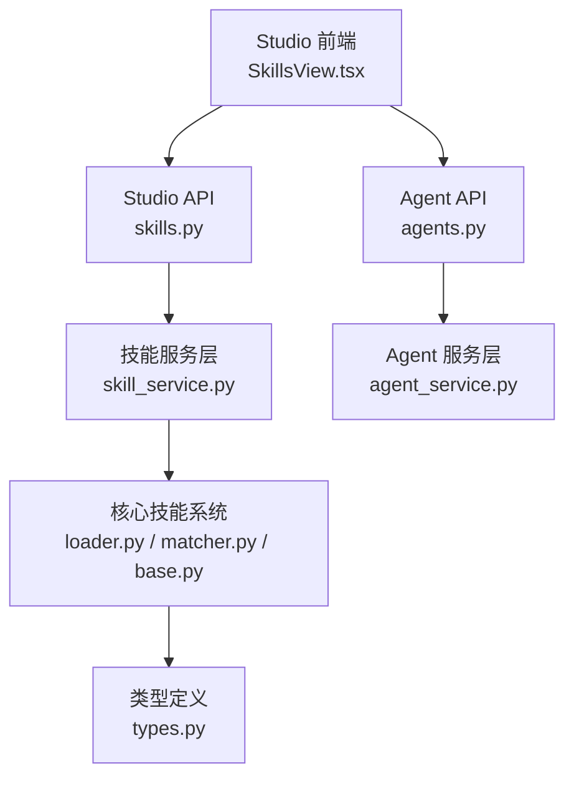
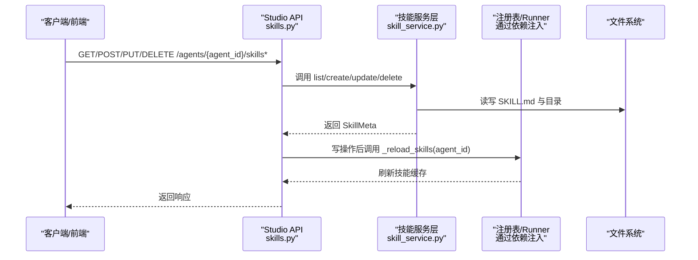
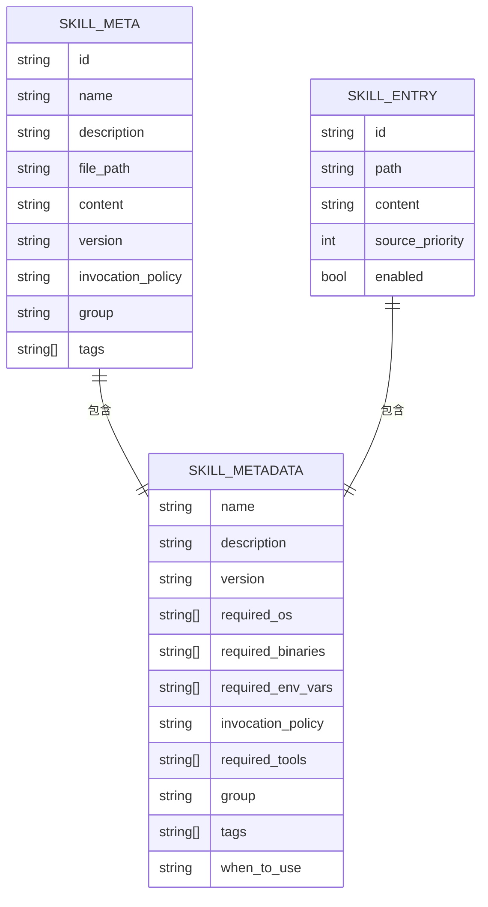
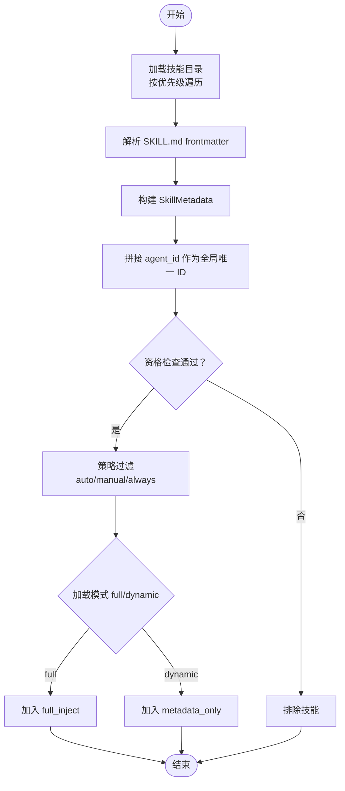
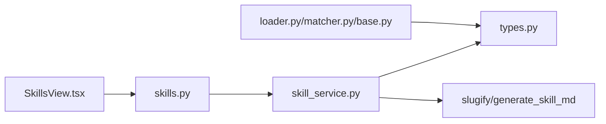

# 技能管理 API

<cite>
**本文引用的文件**
- [src/ark_agentic/studio/api/skills.py](file://src/ark_agentic/studio/api/skills.py)
- [src/ark_agentic/studio/services/skill_service.py](file://src/ark_agentic/studio/services/skill_service.py)
- [src/ark_agentic/core/skills/__init__.py](file://src/ark_agentic/core/skills/__init__.py)
- [src/ark_agentic/core/skills/base.py](file://src/ark_agentic/core/skills/base.py)
- [src/ark_agentic/core/skills/loader.py](file://src/ark_agentic/core/skills/loader.py)
- [src/ark_agentic/core/skills/matcher.py](file://src/ark_agentic/core/skills/matcher.py)
- [src/ark_agentic/core/types.py](file://src/ark_agentic/core/types.py)
- [src/ark_agentic/studio/frontend/src/pages/SkillsView.tsx](file://src/ark_agentic/studio/frontend/src/pages/SkillsView.tsx)
- [src/ark_agentic/studio/api/agents.py](file://src/ark_agentic/studio/api/agents.py)
- [src/ark_agentic/studio/services/agent_service.py](file://src/ark_agentic/studio/services/agent_service.py)
- [src/ark_agentic/agents/securities/skills/asset_overview/SKILL.md](file://src/ark_agentic/agents/securities/skills/asset_overview/SKILL.md)
- [src/ark_agentic/agents/securities/skills/profit_analysis/SKILL.md](file://src/ark_agentic/agents/securities/skills/profit_analysis/SKILL.md)
- [src/ark_agentic/agents/meta_builder/skills/meta-builder-guide/SKILL.md](file://src/ark_agentic/agents/meta_builder/skills/meta-builder-guide/SKILL.md)
- [postman/ark-agentic-api.postman_collection.json](file://postman/ark-agentic-api.postman_collection.json)
</cite>

## 目录
1. [简介](#简介)
2. [项目结构](#项目结构)
3. [核心组件](#核心组件)
4. [架构总览](#架构总览)
5. [详细组件分析](#详细组件分析)
6. [依赖分析](#依赖分析)
7. [性能考虑](#性能考虑)
8. [故障排查指南](#故障排查指南)
9. [结论](#结论)
10. [附录](#附录)

## 简介
本文件面向技能管理 API 的使用者与维护者，系统性梳理技能的创建、编辑、删除与查询接口，详述技能数据模型与配置文件格式（SKILL.md），并深入解析技能加载机制、技能分类与标签、依赖关系与版本控制、与智能体的关联关系以及技能执行机制。同时提供技能开发规范、测试方法与部署流程建议，帮助团队高效、一致地管理技能资产。

## 项目结构
技能管理 API 由三层组成：
- Studio 前端：提供技能的可视化管理界面（列表、新建、编辑、删除）。
- Studio API：薄 HTTP 层，负责参数校验与调用服务层。
- 服务层与核心技能系统：提供纯业务逻辑（CRUD、解析、生成 SKILL.md）与技能加载、匹配、资格检查、渲染等能力。

图表来源
- [src/ark_agentic/studio/frontend/src/pages/SkillsView.tsx:1-267](file://src/ark_agentic/studio/frontend/src/pages/SkillsView.tsx#L1-L267)
- [src/ark_agentic/studio/api/skills.py:1-113](file://src/ark_agentic/studio/api/skills.py#L1-L113)
- [src/ark_agentic/studio/services/skill_service.py:1-289](file://src/ark_agentic/studio/services/skill_service.py#L1-L289)
- [src/ark_agentic/core/skills/loader.py:1-177](file://src/ark_agentic/core/skills/loader.py#L1-L177)
- [src/ark_agentic/core/skills/matcher.py:1-152](file://src/ark_agentic/core/skills/matcher.py#L1-L152)
- [src/ark_agentic/core/skills/base.py:1-344](file://src/ark_agentic/core/skills/base.py#L1-L344)
- [src/ark_agentic/core/types.py:1-422](file://src/ark_agentic/core/types.py#L1-L422)
- [src/ark_agentic/studio/api/agents.py:1-131](file://src/ark_agentic/studio/api/agents.py#L1-L131)
- [src/ark_agentic/studio/services/agent_service.py:1-198](file://src/ark_agentic/studio/services/agent_service.py#L1-L198)

章节来源
- [src/ark_agentic/studio/api/skills.py:1-113](file://src/ark_agentic/studio/api/skills.py#L1-L113)
- [src/ark_agentic/studio/services/skill_service.py:1-289](file://src/ark_agentic/studio/services/skill_service.py#L1-L289)
- [src/ark_agentic/core/skills/__init__.py:1-17](file://src/ark_agentic/core/skills/__init__.py#L1-L17)

## 核心组件
- Studio 技能 API：提供列出、创建、更新、删除技能的端点，统一返回技能元数据。
- 技能服务层：封装 CRUD 与 SKILL.md 解析/生成逻辑，负责目录安全与命名规范化。
- 核心技能系统：加载多目录 SKILL.md，解析 YAML frontmatter，构建 SkillEntry，支持资格检查、策略过滤与动态/全文注入渲染。
- 类型系统：定义 SkillMetadata、SkillEntry、SkillConfig、SkillLoadMode 等核心类型。
- 前端界面：提供技能列表、新建/编辑/删除、元数据显示与确认对话框。

章节来源
- [src/ark_agentic/studio/api/skills.py:57-112](file://src/ark_agentic/studio/api/skills.py#L57-L112)
- [src/ark_agentic/studio/services/skill_service.py:42-182](file://src/ark_agentic/studio/services/skill_service.py#L42-L182)
- [src/ark_agentic/core/skills/loader.py:25-170](file://src/ark_agentic/core/skills/loader.py#L25-L170)
- [src/ark_agentic/core/skills/matcher.py:55-151](file://src/ark_agentic/core/skills/matcher.py#L55-L151)
- [src/ark_agentic/core/skills/base.py:19-344](file://src/ark_agentic/core/skills/base.py#L19-L344)
- [src/ark_agentic/core/types.py:243-308](file://src/ark_agentic/core/types.py#L243-L308)
- [src/ark_agentic/studio/frontend/src/pages/SkillsView.tsx:9-266](file://src/ark_agentic/studio/frontend/src/pages/SkillsView.tsx#L9-L266)

## 架构总览
技能管理 API 的调用链路如下：

图表来源
- [src/ark_agentic/studio/api/skills.py:57-112](file://src/ark_agentic/studio/api/skills.py#L57-L112)
- [src/ark_agentic/studio/services/skill_service.py:42-182](file://src/ark_agentic/studio/services/skill_service.py#L42-L182)

章节来源
- [src/ark_agentic/studio/api/skills.py:44-53](file://src/ark_agentic/studio/api/skills.py#L44-L53)
- [src/ark_agentic/studio/services/skill_service.py:156-182](file://src/ark_agentic/studio/services/skill_service.py#L156-L182)

## 详细组件分析

### 技能数据模型与配置文件格式（SKILL.md）
- 元数据字段：名称、描述、版本、调用策略、分组、标签、所需工具、所需系统/环境等。
- 正文内容：技能的业务规则、执行步骤、输出策略、错误处理等。
- 文件位置：每个技能为一个目录，包含 SKILL.md；也可为目录内首个 .md 文件。
- 生成与解析：服务层负责生成带 YAML frontmatter 的 SKILL.md，或从现有文件解析元数据与正文。

图表来源
- [src/ark_agentic/studio/services/skill_service.py:25-35](file://src/ark_agentic/studio/services/skill_service.py#L25-L35)
- [src/ark_agentic/core/types.py:243-298](file://src/ark_agentic/core/types.py#L243-L298)
- [src/ark_agentic/core/skills/loader.py:131-154](file://src/ark_agentic/core/skills/loader.py#L131-L154)

章节来源
- [src/ark_agentic/studio/services/skill_service.py:187-207](file://src/ark_agentic/studio/services/skill_service.py#L187-L207)
- [src/ark_agentic/studio/services/skill_service.py:225-278](file://src/ark_agentic/studio/services/skill_service.py#L225-L278)
- [src/ark_agentic/core/skills/loader.py:109-130](file://src/ark_agentic/core/skills/loader.py#L109-L130)
- [src/ark_agentic/core/skills/loader.py:131-154](file://src/ark_agentic/core/skills/loader.py#L131-L154)

### 技能加载机制与匹配
- 多目录加载：按优先级顺序扫描目录，相同 ID 的技能后者覆盖前者。
- frontmatter 解析：提取元数据并构建 SkillEntry，支持 when_to_use 合并进 description。
- 资格检查：基于 OS、二进制、环境变量、工具可用性进行过滤。
- 匹配策略：支持自动/手动/总是三种调用策略；动态模式仅注入元数据，full 模式注入全文。
- 渲染：动态模式下先注入元数据，再按需 read_skill；full 模式一次性注入全文。

图表来源
- [src/ark_agentic/core/skills/loader.py:35-84](file://src/ark_agentic/core/skills/loader.py#L35-L84)
- [src/ark_agentic/core/skills/base.py:51-101](file://src/ark_agentic/core/skills/base.py#L51-L101)
- [src/ark_agentic/core/skills/matcher.py:64-126](file://src/ark_agentic/core/skills/matcher.py#L64-L126)

章节来源
- [src/ark_agentic/core/skills/loader.py:25-170](file://src/ark_agentic/core/skills/loader.py#L25-L170)
- [src/ark_agentic/core/skills/matcher.py:55-151](file://src/ark_agentic/core/skills/matcher.py#L55-L151)
- [src/ark_agentic/core/skills/base.py:104-138](file://src/ark_agentic/core/skills/base.py#L104-L138)

### 技能分类管理、依赖关系与版本控制
- 分类与标签：通过 group 与 tags 字段进行分组与检索。
- 依赖关系：required_tools、required_os、required_binaries、required_env_vars 等字段声明技能运行所需的外部条件。
- 版本控制：version 字段用于语义化版本管理；frontmatter 中的 version 默认 1.0.0。
- 策略控制：invocation_policy 控制技能的调用策略（auto/manual/always）。

章节来源
- [src/ark_agentic/core/types.py:243-298](file://src/ark_agentic/core/types.py#L243-L298)
- [src/ark_agentic/core/skills/loader.py:141-154](file://src/ark_agentic/core/skills/loader.py#L141-L154)
- [src/ark_agentic/core/skills/base.py:20-49](file://src/ark_agentic/core/skills/base.py#L20-L49)

### 技能与智能体的关联关系与执行机制
- 智能体目录结构：每个 Agent 下包含 skills 与 tools 目录，技能位于 skills/{skill_slug}/SKILL.md。
- 全局唯一 ID：SkillLoader 会在 agent_id 前缀拼接技能 ID，形成全局唯一标识。
- 执行机制：动态模式下，LLM 先看到元数据列表，再通过 read_skill 按需加载正文；full 模式一次性注入全文。

章节来源
- [src/ark_agentic/studio/api/agents.py:106-130](file://src/ark_agentic/studio/api/agents.py#L106-L130)
- [src/ark_agentic/studio/services/agent_service.py:60-137](file://src/ark_agentic/studio/services/agent_service.py#L60-L137)
- [src/ark_agentic/core/skills/loader.py:97-107](file://src/ark_agentic/core/skills/loader.py#L97-L107)
- [src/ark_agentic/core/skills/base.py:282-344](file://src/ark_agentic/core/skills/base.py#L282-L344)

### 接口定义与使用示例

#### 列出技能
- 方法与路径：GET /agents/{agent_id}/skills
- 请求参数：agent_id（路径参数）
- 响应：SkillListResponse（包含 skills: SkillMeta[]）

章节来源
- [src/ark_agentic/studio/api/skills.py:57-65](file://src/ark_agentic/studio/api/skills.py#L57-L65)
- [src/ark_agentic/studio/services/skill_service.py:42-57](file://src/ark_agentic/studio/services/skill_service.py#L42-L57)

#### 创建技能
- 方法与路径：POST /agents/{agent_id}/skills
- 请求体：SkillCreateRequest（name, description, content）
- 响应：SkillMeta
- 行为：生成目录与 SKILL.md，刷新 Runner 缓存

章节来源
- [src/ark_agentic/studio/api/skills.py:68-83](file://src/ark_agentic/studio/api/skills.py#L68-L83)
- [src/ark_agentic/studio/services/skill_service.py:60-101](file://src/ark_agentic/studio/services/skill_service.py#L60-L101)
- [src/ark_agentic/studio/api/skills.py:44-53](file://src/ark_agentic/studio/api/skills.py#L44-L53)

#### 更新技能
- 方法与路径：PUT /agents/{agent_id}/skills/{skill_id}
- 请求体：SkillUpdateRequest（name?, description?, content?）
- 响应：SkillMeta
- 行为：合并更新字段，必要时重新生成 frontmatter，刷新 Runner 缓存

章节来源
- [src/ark_agentic/studio/api/skills.py:86-98](file://src/ark_agentic/studio/api/skills.py#L86-L98)
- [src/ark_agentic/studio/services/skill_service.py:104-153](file://src/ark_agentic/studio/services/skill_service.py#L104-L153)
- [src/ark_agentic/studio/api/skills.py:44-53](file://src/ark_agentic/studio/api/skills.py#L44-L53)

#### 删除技能
- 方法与路径：DELETE /agents/{agent_id}/skills/{skill_id}
- 响应：{"status": "deleted", "skill_id": string}
- 行为：安全检查（路径合规），删除目录，刷新 Runner 缓存

章节来源
- [src/ark_agentic/studio/api/skills.py:101-112](file://src/ark_agentic/studio/api/skills.py#L101-L112)
- [src/ark_agentic/studio/services/skill_service.py:156-182](file://src/ark_agentic/studio/services/skill_service.py#L156-L182)
- [src/ark_agentic/studio/api/skills.py:44-53](file://src/ark_agentic/studio/api/skills.py#L44-L53)

## 依赖分析
- Studio API 依赖服务层；服务层依赖核心类型与工具函数（slugify、generate_skill_md）。
- 核心技能系统依赖类型定义与正则解析 frontmatter。
- 前端依赖 API 与认证模块，调用技能 CRUD 接口。

图表来源
- [src/ark_agentic/studio/api/skills.py:14-17](file://src/ark_agentic/studio/api/skills.py#L14-L17)
- [src/ark_agentic/studio/services/skill_service.py:16-17](file://src/ark_agentic/studio/services/skill_service.py#L16-L17)
- [src/ark_agentic/core/skills/loader.py:16-17](file://src/ark_agentic/core/skills/loader.py#L16-L17)
- [src/ark_agentic/core/skills/matcher.py:16-22](file://src/ark_agentic/core/skills/matcher.py#L16-L22)
- [src/ark_agentic/core/skills/base.py:16-16](file://src/ark_agentic/core/skills/base.py#L16-L16)
- [src/ark_agentic/studio/frontend/src/pages/SkillsView.tsx:1-4](file://src/ark_agentic/studio/frontend/src/pages/SkillsView.tsx#L1-L4)

章节来源
- [src/ark_agentic/studio/api/skills.py:14-17](file://src/ark_agentic/studio/api/skills.py#L14-L17)
- [src/ark_agentic/studio/services/skill_service.py:16-17](file://src/ark_agentic/studio/services/skill_service.py#L16-L17)
- [src/ark_agentic/core/skills/loader.py:16-17](file://src/ark_agentic/core/skills/loader.py#L16-L17)
- [src/ark_agentic/core/skills/matcher.py:16-22](file://src/ark_agentic/core/skills/matcher.py#L16-L22)
- [src/ark_agentic/core/skills/base.py:16-16](file://src/ark_agentic/core/skills/base.py#L16-L16)
- [src/ark_agentic/studio/frontend/src/pages/SkillsView.tsx:1-4](file://src/ark_agentic/studio/frontend/src/pages/SkillsView.tsx#L1-L4)

## 性能考虑
- 元数据预算：按最大条数与字符数进行截断与二分搜索，避免 prompt 过长。
- 动态模式：仅注入元数据，减少 token 消耗；按需加载正文。
- 目录扫描：按优先级顺序扫描，遇到同名 ID 以更低优先级覆盖，避免重复加载。
- 缓存刷新：写操作后主动刷新 Runner 缓存，保证一致性与性能。

章节来源
- [src/ark_agentic/core/skills/base.py:207-262](file://src/ark_agentic/core/skills/base.py#L207-L262)
- [src/ark_agentic/core/skills/loader.py:35-84](file://src/ark_agentic/core/skills/loader.py#L35-L84)
- [src/ark_agentic/studio/api/skills.py:44-53](file://src/ark_agentic/studio/api/skills.py#L44-L53)

## 故障排查指南
- Agent 不存在：服务层在解析 agent 目录失败时抛出异常，API 层转换为 404。
- 技能不存在：更新/删除时若目录不存在，返回 404；创建时若同名技能已存在，返回 409。
- 路径安全：删除技能时进行路径安全检查，防止越权访问。
- 参数校验：前端与 API 层均进行基本校验（名称非空、合法目录名）。

章节来源
- [src/ark_agentic/studio/api/skills.py:76-82](file://src/ark_agentic/studio/api/skills.py#L76-L82)
- [src/ark_agentic/studio/api/skills.py:95-97](file://src/ark_agentic/studio/api/skills.py#L95-L97)
- [src/ark_agentic/studio/api/skills.py:107-111](file://src/ark_agentic/studio/api/skills.py#L107-L111)
- [src/ark_agentic/studio/services/skill_service.py:77-88](file://src/ark_agentic/studio/services/skill_service.py#L77-L88)
- [src/ark_agentic/studio/services/skill_service.py:176-179](file://src/ark_agentic/studio/services/skill_service.py#L176-L179)
- [src/ark_agentic/studio/frontend/src/pages/SkillsView.tsx:55-78](file://src/ark_agentic/studio/frontend/src/pages/SkillsView.tsx#L55-L78)

## 结论
技能管理 API 通过清晰的三层架构实现了对技能的全生命周期管理：从前端可视化到 API 层参数校验，再到服务层与核心技能系统的解析与加载。配合动态/全文两种注入模式、严格的资格检查与预算控制，既能满足复杂业务场景，又能保障性能与一致性。建议在团队内统一 SKILL.md 模板与字段约定，规范版本与标签管理，确保技能资产的可维护性与可扩展性。

## 附录

### 技能开发规范
- 使用统一模板：参考示例 SKILL.md，明确职责、触发词、工具映射、执行流程、输出策略与错误处理。
- frontmatter 字段：name、description、version、invocation_policy、group、tags、required_tools 等。
- 命名规范：目录名为 slug 化后的名称，避免特殊字符与大小写混用。
- 版本管理：遵循语义化版本，变更时更新 version 并在描述中说明改动。
- 依赖声明：准确列出 required_os、required_binaries、required_env_vars、required_tools。

章节来源
- [src/ark_agentic/agents/securities/skills/asset_overview/SKILL.md:1-186](file://src/ark_agentic/agents/securities/skills/asset_overview/SKILL.md#L1-L186)
- [src/ark_agentic/agents/securities/skills/profit_analysis/SKILL.md:1-58](file://src/ark_agentic/agents/securities/skills/profit_analysis/SKILL.md#L1-L58)
- [src/ark_agentic/agents/meta_builder/skills/meta-builder-guide/SKILL.md:1-56](file://src/ark_agentic/agents/meta_builder/skills/meta-builder-guide/SKILL.md#L1-L56)
- [src/ark_agentic/studio/services/skill_service.py:187-207](file://src/ark_agentic/studio/services/skill_service.py#L187-L207)
- [src/ark_agentic/core/skills/loader.py:141-154](file://src/ark_agentic/core/skills/loader.py#L141-L154)

### 技能测试方法
- 单元测试：针对 skill_service 的 CRUD 与 slugify/generate_skill_md 等函数进行断言。
- 集成测试：通过 Postman 集合验证端到端流程（创建、查询、更新、删除）。
- E2E 测试：结合前端 SkillsView 的交互流程，验证列表、新建、编辑、删除与确认对话框。

章节来源
- [postman/ark-agentic-api.postman_collection.json:1-364](file://postman/ark-agentic-api.postman_collection.json#L1-L364)
- [src/ark_agentic/studio/frontend/src/pages/SkillsView.tsx:55-89](file://src/ark_agentic/studio/frontend/src/pages/SkillsView.tsx#L55-L89)

### 技能部署流程
- 创建 Agent：通过 Agent API 创建目录与 agent.json，初始化 skills 与 tools 目录。
- 新增技能：通过 Studio API 创建技能目录与 SKILL.md，或使用 Meta-Agent 的 manage_skills 工具。
- 验证加载：启动 Runner 后，确认技能被正确加载与匹配；必要时手动触发 reload。
- 发布与回滚：通过版本号管理与标签组织技能；删除时注意备份与确认流程。

章节来源
- [src/ark_agentic/studio/api/agents.py:106-130](file://src/ark_agentic/studio/api/agents.py#L106-L130)
- [src/ark_agentic/studio/services/agent_service.py:60-137](file://src/ark_agentic/studio/services/agent_service.py#L60-L137)
- [src/ark_agentic/studio/api/skills.py:44-53](file://src/ark_agentic/studio/api/skills.py#L44-L53)