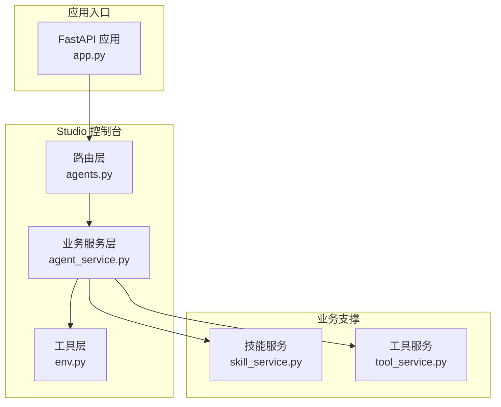
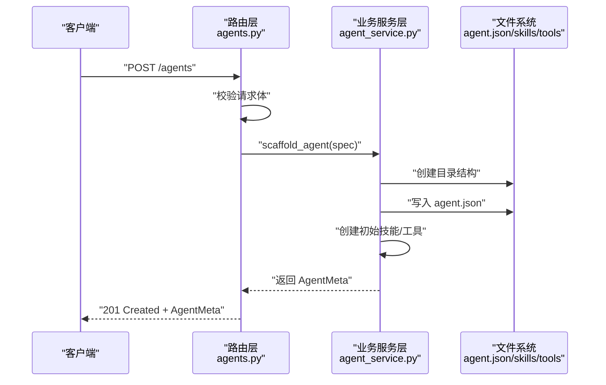
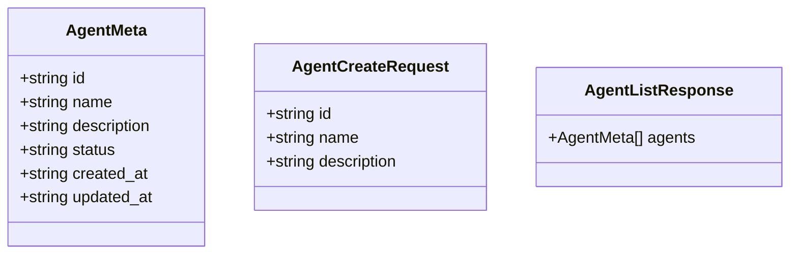
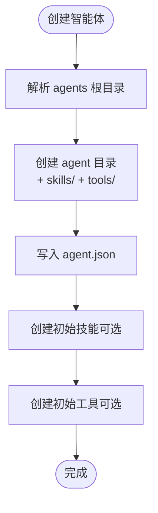
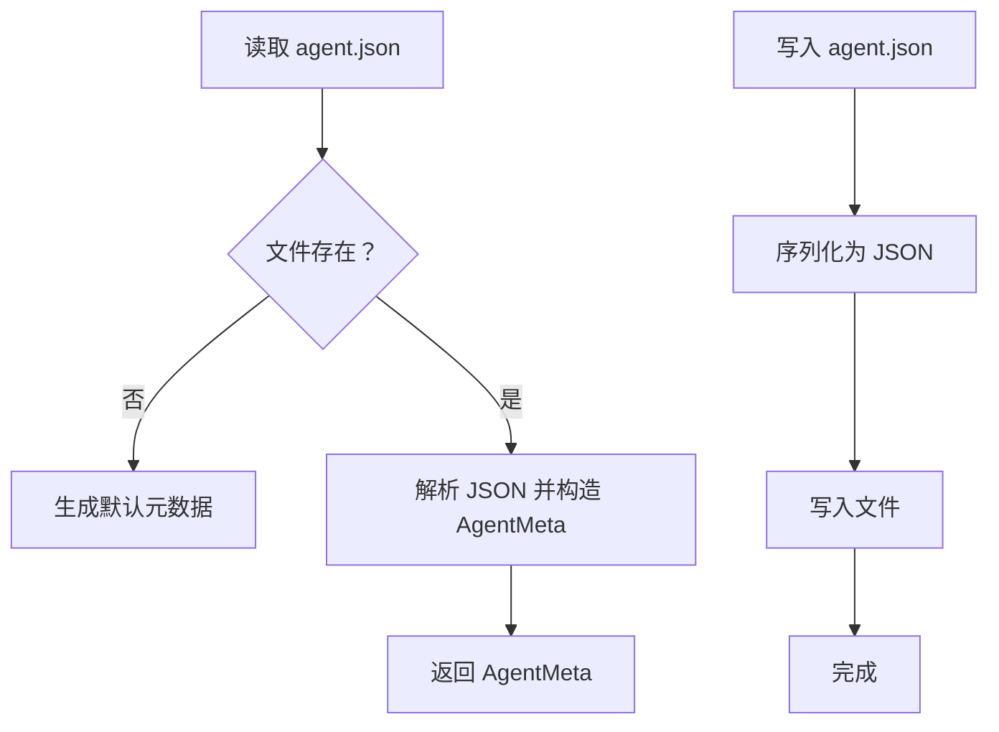
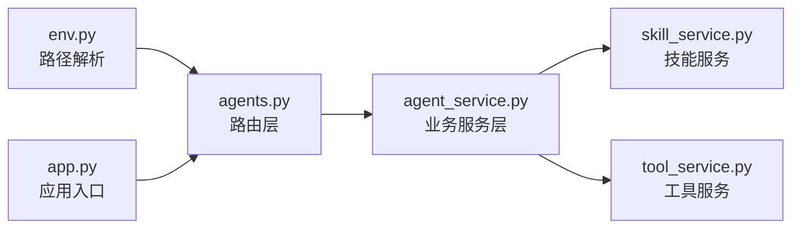

# 智能体管理 API

<cite>
**本文档引用的文件**
- [src/ark_agentic/studio/api/agents.py](file://src/ark_agentic/studio/api/agents.py)
- [src/ark_agentic/studio/services/agent_service.py](file://src/ark_agentic/studio/services/agent_service.py)
- [src/ark_agentic/core/utils/env.py](file://src/ark_agentic/core/utils/env.py)
- [src/ark_agentic/api/models.py](file://src/ark_agentic/api/models.py)
- [src/ark_agentic/agents/insurance/agent.json](file://src/ark_agentic/agents/insurance/agent.json)
- [src/ark_agentic/agents/meta_builder/agent.json](file://src/ark_agentic/agents/meta_builder/agent.json)
- [postman/ark-agentic-api.postman_collection.json](file://postman/ark-agentic-api.postman_collection.json)
- [src/ark_agentic/app.py](file://src/ark_agentic/app.py)
- [src/ark_agentic/studio/services/skill_service.py](file://src/ark_agentic/studio/services/skill_service.py)
- [src/ark_agentic/studio/services/tool_service.py](file://src/ark_agentic/studio/services/tool_service.py)
- [README.md](file://README.md)
</cite>

## 目录
1. [简介](#简介)
2. [项目结构](#项目结构)
3. [核心组件](#核心组件)
4. [架构总览](#架构总览)
5. [详细组件分析](#详细组件分析)
6. [依赖分析](#依赖分析)
7. [性能考虑](#性能考虑)
8. [故障排查指南](#故障排查指南)
9. [结论](#结论)
10. [附录](#附录)

## 简介
本文件面向“智能体管理 API”，聚焦于 Studio 控制台中的智能体 CRUD 能力，包括：
- 获取智能体列表
- 获取单个智能体详情
- 创建新智能体
- 智能体目录结构管理
- agent.json 文件操作
- 智能体状态管理
- 与业务层服务的协作关系

同时，文档提供最佳实践建议，帮助开发者高效、安全地进行智能体开发与配置。

## 项目结构
智能体管理 API 位于 Studio 控制台模块中，采用“路由层 + 业务服务层”的分层设计：
- 路由层：负责 HTTP 接口定义、参数校验、错误处理
- 业务服务层：负责具体业务逻辑（如脚手架生成、目录扫描、文件写入）
- 工具层：提供路径解析、环境变量读取等通用能力

图表来源
- [src/ark_agentic/studio/api/agents.py:1-131](file://src/ark_agentic/studio/api/agents.py#L1-L131)
- [src/ark_agentic/studio/services/agent_service.py:1-198](file://src/ark_agentic/studio/services/agent_service.py#L1-L198)
- [src/ark_agentic/core/utils/env.py:1-59](file://src/ark_agentic/core/utils/env.py#L1-L59)
- [src/ark_agentic/studio/services/skill_service.py:1-200](file://src/ark_agentic/studio/services/skill_service.py#L1-L200)
- [src/ark_agentic/studio/services/tool_service.py:1-200](file://src/ark_agentic/studio/services/tool_service.py#L1-L200)
- [src/ark_agentic/app.py:1-200](file://src/ark_agentic/app.py#L1-L200)

章节来源
- [src/ark_agentic/studio/api/agents.py:1-131](file://src/ark_agentic/studio/api/agents.py#L1-L131)
- [src/ark_agentic/studio/services/agent_service.py:1-198](file://src/ark_agentic/studio/services/agent_service.py#L1-L198)
- [src/ark_agentic/core/utils/env.py:1-59](file://src/ark_agentic/core/utils/env.py#L1-L59)
- [src/ark_agentic/app.py:1-200](file://src/ark_agentic/app.py#L1-L200)

## 核心组件
- AgentMeta 数据模型：描述智能体元数据，对应 agent.json 文件
- AgentCreateRequest 请求体模型：创建智能体时的请求参数
- AgentListResponse 响应模型：智能体列表响应
- 路由层 API：提供 GET /agents、GET /agents/{agent_id}、POST /agents
- 业务服务层：提供脚手架生成、列表扫描、删除等能力
- 工具层：提供 agents 根目录解析、agent 目录解析等

章节来源
- [src/ark_agentic/studio/api/agents.py:27-47](file://src/ark_agentic/studio/api/agents.py#L27-L47)
- [src/ark_agentic/studio/services/agent_service.py:30-56](file://src/ark_agentic/studio/services/agent_service.py#L30-L56)

## 架构总览
智能体管理 API 的调用链如下：
- 客户端发起 HTTP 请求至路由层
- 路由层解析参数、校验输入
- 路由层调用业务服务层执行具体逻辑
- 业务服务层读写文件系统（agent.json、skills、tools 目录）
- 业务服务层返回结构化数据给路由层
- 路由层封装响应并返回客户端

图表来源
- [src/ark_agentic/studio/api/agents.py:106-131](file://src/ark_agentic/studio/api/agents.py#L106-L131)
- [src/ark_agentic/studio/services/agent_service.py:60-138](file://src/ark_agentic/studio/services/agent_service.py#L60-L138)

章节来源
- [src/ark_agentic/studio/api/agents.py:76-131](file://src/ark_agentic/studio/api/agents.py#L76-L131)
- [src/ark_agentic/studio/services/agent_service.py:60-138](file://src/ark_agentic/studio/services/agent_service.py#L60-L138)

## 详细组件分析

### 数据模型与请求/响应
- AgentMeta：包含 id、name、description、status、created_at、updated_at
- AgentCreateRequest：包含 id、name、description
- AgentListResponse：包含 agents 列表（AgentMeta）

图表来源
- [src/ark_agentic/studio/api/agents.py:27-47](file://src/ark_agentic/studio/api/agents.py#L27-L47)

章节来源
- [src/ark_agentic/studio/api/agents.py:27-47](file://src/ark_agentic/studio/api/agents.py#L27-L47)

### 智能体目录结构管理
- 目录约定：每个智能体拥有独立目录，包含 agent.json、skills/、tools/
- agent.json：存放智能体元数据
- skills/：存放技能（Markdown 格式）
- tools/：存放工具（Python 文件）

图表来源
- [src/ark_agentic/studio/services/agent_service.py:60-138](file://src/ark_agentic/studio/services/agent_service.py#L60-L138)
- [src/ark_agentic/studio/services/skill_service.py:60-102](file://src/ark_agentic/studio/services/skill_service.py#L60-L102)
- [src/ark_agentic/studio/services/tool_service.py:59-99](file://src/ark_agentic/studio/services/tool_service.py#L59-L99)

章节来源
- [src/ark_agentic/studio/services/agent_service.py:60-138](file://src/ark_agentic/studio/services/agent_service.py#L60-L138)
- [src/ark_agentic/studio/services/skill_service.py:60-102](file://src/ark_agentic/studio/services/skill_service.py#L60-L102)
- [src/ark_agentic/studio/services/tool_service.py:59-99](file://src/ark_agentic/studio/services/tool_service.py#L59-L99)

### agent.json 文件操作
- 读取：从 agent 目录读取 agent.json，解析为 AgentMeta
- 写入：将 AgentMeta 写回 agent.json
- 兼容性：若目录存在但缺少 agent.json，仍可返回最小元数据

图表来源
- [src/ark_agentic/studio/api/agents.py:51-72](file://src/ark_agentic/studio/api/agents.py#L51-L72)
- [src/ark_agentic/studio/services/agent_service.py:186-198](file://src/ark_agentic/studio/services/agent_service.py#L186-L198)

章节来源
- [src/ark_agentic/studio/api/agents.py:51-72](file://src/ark_agentic/studio/api/agents.py#L51-L72)
- [src/ark_agentic/studio/services/agent_service.py:186-198](file://src/ark_agentic/studio/services/agent_service.py#L186-L198)

### 智能体状态管理
- status 字段：默认 active，可扩展为 pending、disabled 等
- created_at/updated_at：UTC ISO 时间字符串，便于排序与审计

章节来源
- [src/ark_agentic/studio/api/agents.py:27-37](file://src/ark_agentic/studio/api/agents.py#L27-L37)
- [src/ark_agentic/studio/services/agent_service.py:30-38](file://src/ark_agentic/studio/services/agent_service.py#L30-L38)

### API 端点定义
- 获取智能体列表
  - 方法：GET
  - URL：/agents
  - 响应：AgentListResponse
  - 行为：扫描 agents 根目录，过滤隐藏/特殊目录，读取 agent.json 或生成默认元数据
- 获取单个智能体详情
  - 方法：GET
  - URL：/agents/{agent_id}
  - 路径参数：agent_id
  - 响应：AgentMeta
  - 行为：解析 agent 目录，读取 agent.json 或生成默认元数据
- 创建新智能体
  - 方法：POST
  - URL：/agents
  - 请求体：AgentCreateRequest
  - 响应：AgentMeta（201）
  - 行为：创建目录结构、写入 agent.json、可选创建初始技能/工具

章节来源
- [src/ark_agentic/studio/api/agents.py:76-131](file://src/ark_agentic/studio/api/agents.py#L76-L131)

### Postman 集合参考
- 提供健康检查、聊天接口等测试用例，可作为集成测试参考
- 智能体管理 API 的端点与参数可结合该集合进行验证

章节来源
- [postman/ark-agentic-api.postman_collection.json:1-364](file://postman/ark-agentic-api.postman_collection.json#L1-L364)

## 依赖分析
- 路由层依赖工具层提供的路径解析能力
- 业务服务层依赖技能/工具服务进行脚手架生成
- 应用入口负责挂载路由与 Studio 控制台

图表来源
- [src/ark_agentic/core/utils/env.py:38-59](file://src/ark_agentic/core/utils/env.py#L38-L59)
- [src/ark_agentic/studio/api/agents.py:18-22](file://src/ark_agentic/studio/api/agents.py#L18-L22)
- [src/ark_agentic/studio/services/agent_service.py:20-24](file://src/ark_agentic/studio/services/agent_service.py#L20-L24)
- [src/ark_agentic/app.py:162-165](file://src/ark_agentic/app.py#L162-L165)

章节来源
- [src/ark_agentic/core/utils/env.py:1-59](file://src/ark_agentic/core/utils/env.py#L1-L59)
- [src/ark_agentic/studio/api/agents.py:1-22](file://src/ark_agentic/studio/api/agents.py#L1-L22)
- [src/ark_agentic/studio/services/agent_service.py:1-24](file://src/ark_agentic/studio/services/agent_service.py#L1-L24)
- [src/ark_agentic/app.py:162-165](file://src/ark_agentic/app.py#L162-L165)

## 性能考虑
- 目录扫描：对 agents 根目录进行迭代，建议合理组织目录数量与层级
- 文件读写：agent.json 小文件读写开销低，注意并发访问时的锁与异常处理
- 脚手架生成：创建初始技能/工具可能涉及磁盘 IO，建议异步化或批量处理
- 路径解析：使用工具层的安全解析函数，避免路径穿越与越界访问

## 故障排查指南
- 404 Agent not found：agent_id 不存在或目录解析失败
- 409 Agent already exists：创建时目标目录已存在
- 路径安全检查失败：删除操作时检测到路径越界
- agent.json 解析失败：JSON 格式错误或编码问题
- 删除 meta_builder：禁止删除内置 Meta-Agent

章节来源
- [src/ark_agentic/studio/api/agents.py:98-103](file://src/ark_agentic/studio/api/agents.py#L98-L103)
- [src/ark_agentic/studio/api/agents.py:111-112](file://src/ark_agentic/studio/api/agents.py#L111-L112)
- [src/ark_agentic/studio/services/agent_service.py:167-181](file://src/ark_agentic/studio/services/agent_service.py#L167-L181)
- [src/ark_agentic/studio/api/agents.py:60-62](file://src/ark_agentic/studio/api/agents.py#L60-L62)

## 结论
智能体管理 API 通过清晰的分层设计与严格的文件系统约定，提供了稳定的 CRUD 能力。配合技能/工具服务，可快速完成智能体的脚手架生成与后续扩展。建议在生产环境中关注路径安全、并发控制与可观测性，以确保系统的稳定性与可维护性。

## 附录

### 最佳实践
- 目录命名规范：使用小写下划线或短横线风格，与 agent_id 保持一致
- agent.json 维护：统一时间格式（UTC ISO），定期备份
- 脚手架策略：创建智能体时同步生成必要的初始技能/工具，减少二次配置成本
- 安全边界：严格限制删除操作（如 meta_builder），并对路径进行安全校验
- 可观测性：记录关键操作日志（创建、删除、更新），便于审计与排障

### 示例参考
- 示例 agent.json：保险智能体与 Meta-Agent 的元数据样例
- README：框架整体介绍与环境变量说明，有助于理解智能体生命周期与运行机制

章节来源
- [src/ark_agentic/agents/insurance/agent.json:1-8](file://src/ark_agentic/agents/insurance/agent.json#L1-L8)
- [src/ark_agentic/agents/meta_builder/agent.json:1-8](file://src/ark_agentic/agents/meta_builder/agent.json#L1-L8)
- [README.md:703-756](file://README.md#L703-L756)