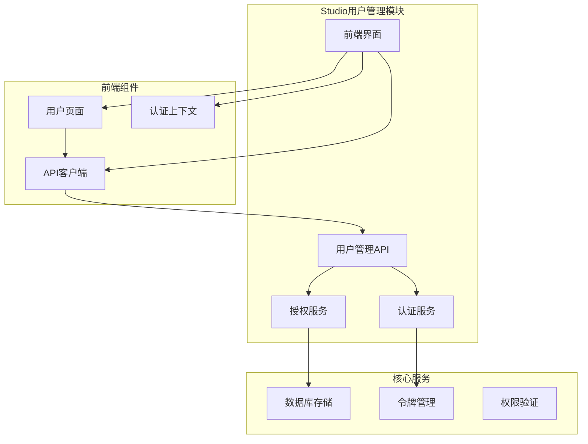
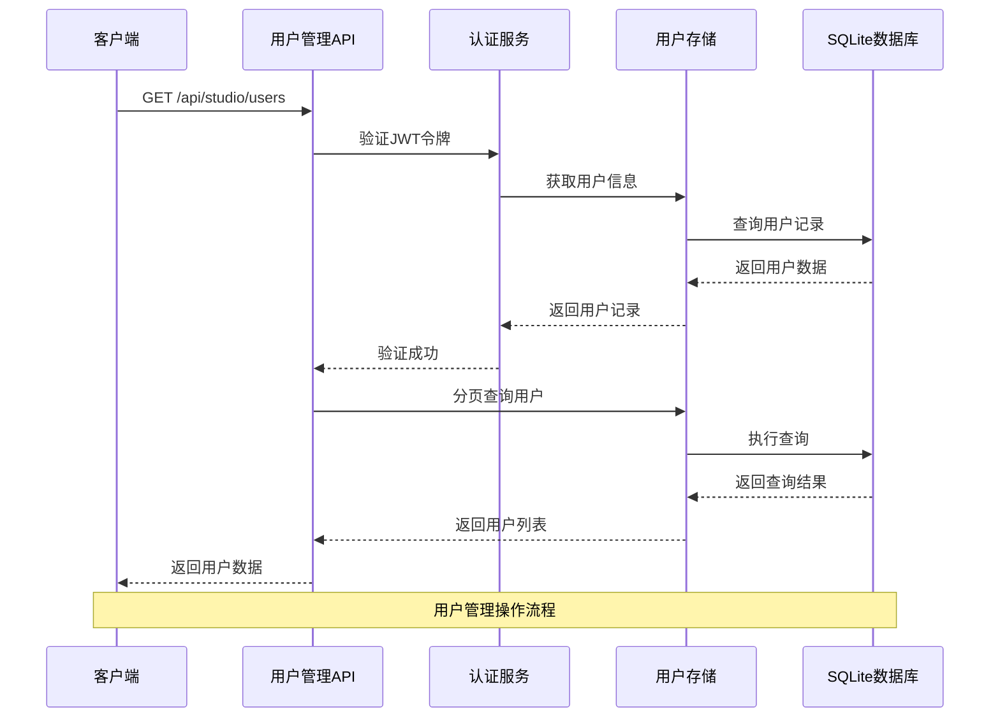
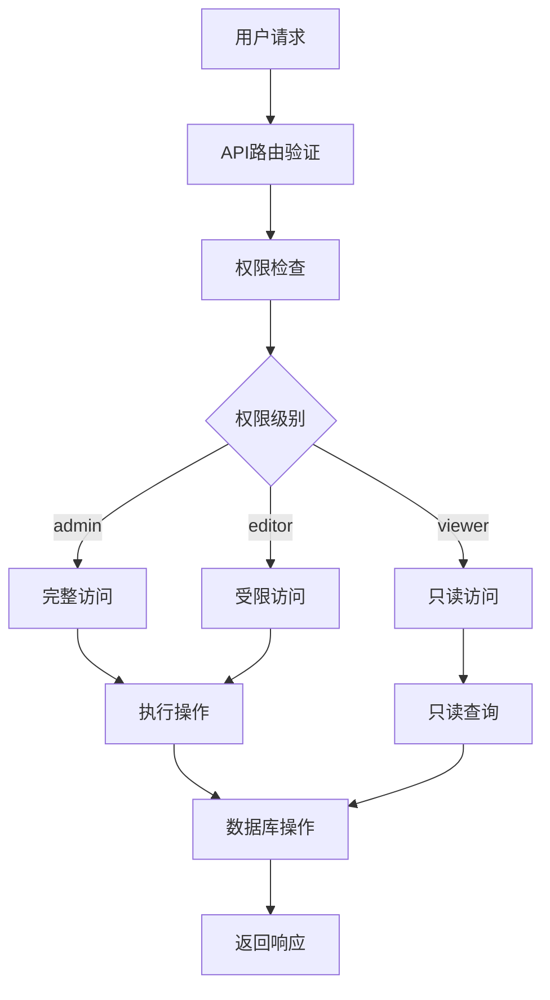
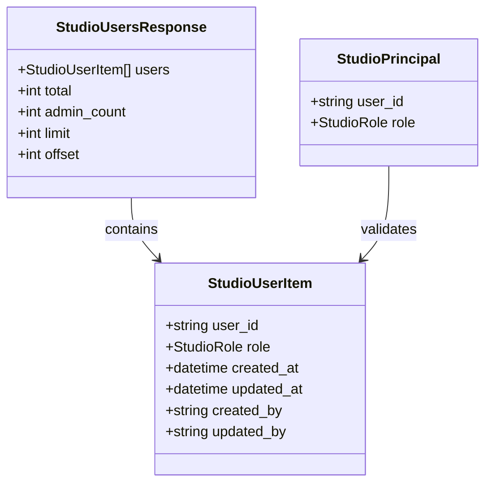
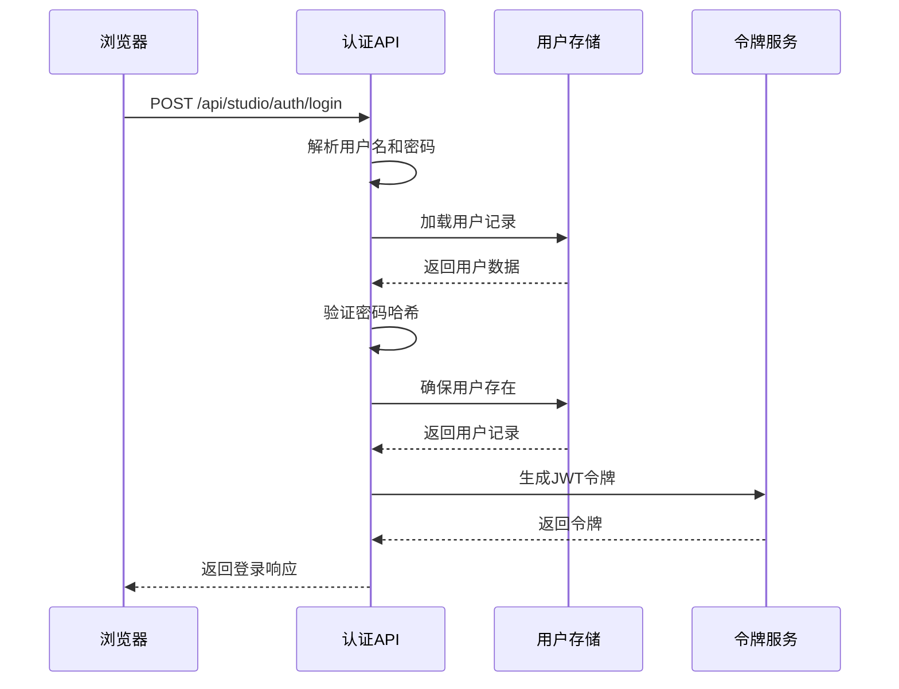
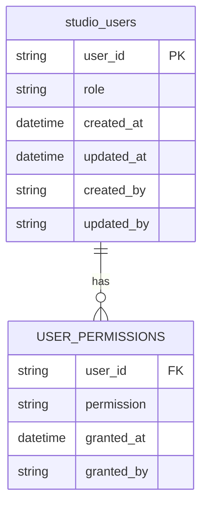
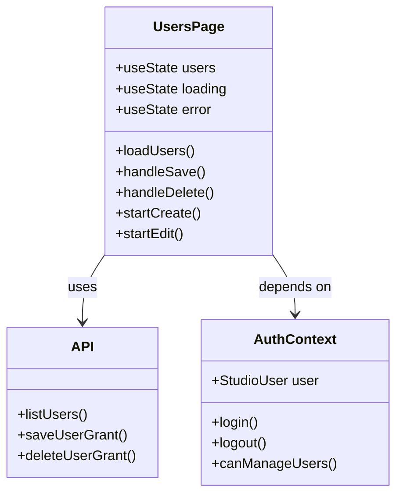
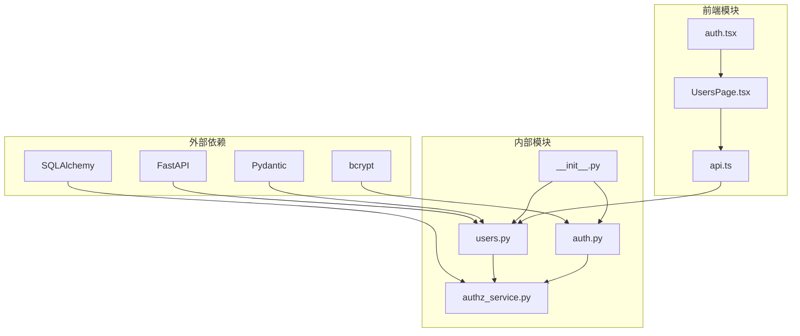

# 用户管理API

<cite>
**本文档引用的文件**
- [users.py](file://src/ark_agentic/studio/api/users.py)
- [auth.py](file://src/ark_agentic/studio/api/auth.py)
- [authz_service.py](file://src/ark_agentic/studio/services/authz_service.py)
- [UsersPage.tsx](file://src/ark_agentic/studio/frontend/src/pages/UsersPage.tsx)
- [api.ts](file://src/ark_agentic/studio/frontend/src/api.ts)
- [auth.tsx](file://src/ark_agentic/studio/frontend/src/auth.tsx)
- [__init__.py](file://src/ark_agentic/studio/__init__.py)
- [app.py](file://src/ark_agentic/app.py)
- [test_users_authz.py](file://tests/unit/studio/test_users_authz.py)
- [test_auth_login.py](file://tests/unit/studio/test_auth_login.py)
</cite>

## 目录
1. [简介](#简介)
2. [项目结构](#项目结构)
3. [核心组件](#核心组件)
4. [架构概览](#架构概览)
5. [详细组件分析](#详细组件分析)
6. [依赖关系分析](#依赖关系分析)
7. [性能考虑](#性能考虑)
8. [故障排除指南](#故障排除指南)
9. [结论](#结论)

## 简介

用户管理API是Ark-Agentic Studio平台的核心功能模块，负责管理系统用户的权限和角色分配。该API提供了完整的用户生命周期管理功能，包括用户认证、授权验证、角色管理和权限控制。

系统采用基于角色的访问控制（RBAC）模型，支持三种角色级别：admin（管理员）、editor（编辑者）和viewer（查看者）。每个用户都与特定的权限级别关联，确保系统安全性和数据保护。

## 项目结构

用户管理API位于Ark-Agentic项目的Studio模块中，采用清晰的分层架构设计：



**图表来源**
- [users.py:1-101](file://src/ark_agentic/studio/api/users.py#L1-L101)
- [auth.py:1-120](file://src/ark_agentic/studio/api/auth.py#L1-L120)
- [authz_service.py:1-419](file://src/ark_agentic/studio/services/authz_service.py#L1-L419)

**章节来源**
- [users.py:1-101](file://src/ark_agentic/studio/api/users.py#L1-L101)
- [auth.py:1-120](file://src/ark_agentic/studio/api/auth.py#L1-L120)
- [authz_service.py:1-419](file://src/ark_agentic/studio/services/authz_service.py#L1-L419)

## 核心组件

### 用户管理API路由

用户管理API提供三个主要端点：
- **GET /api/studio/users** - 列出用户并支持分页和过滤
- **POST /api/studio/users** - 创建或更新用户角色
- **DELETE /api/studio/users/{user_id}** - 删除用户角色授权

### 认证服务

认证服务处理用户登录和令牌验证：
- 支持bcrypt密码哈希验证
- 提供JWT令牌生成和验证
- 支持环境变量配置的用户数据库

### 授权服务

授权服务管理用户权限和角色：
- 基于SQLite的用户存储
- 角色级别的权限控制
- 最后管理员保护机制

**章节来源**
- [users.py:45-101](file://src/ark_agentic/studio/api/users.py#L45-L101)
- [auth.py:96-120](file://src/ark_agentic/studio/api/auth.py#L96-L120)
- [authz_service.py:119-290](file://src/ark_agentic/studio/services/authz_service.py#L119-L290)

## 架构概览

用户管理API采用分层架构，确保关注点分离和代码可维护性：



**图表来源**
- [users.py:45-65](file://src/ark_agentic/studio/api/users.py#L45-L65)
- [authz_service.py:398-418](file://src/ark_agentic/studio/services/authz_service.py#L398-L418)

### 数据流图



**图表来源**
- [authz_service.py:408-418](file://src/ark_agentic/studio/services/authz_service.py#L408-L418)
- [users.py:51-100](file://src/ark_agentic/studio/api/users.py#L51-L100)

## 详细组件分析

### 用户管理API实现

用户管理API采用FastAPI框架构建，提供类型安全的REST接口：

#### 用户列表端点



**图表来源**
- [users.py:23-38](file://src/ark_agentic/studio/api/users.py#L23-L38)
- [users.py:65-65](file://src/ark_agentic/studio/api/users.py#L65-L65)

#### 用户操作端点

用户操作端点提供完整的CRUD功能：

| 端点 | 方法 | 功能 | 权限要求 |
|------|------|------|----------|
| `/api/studio/users` | GET | 列出用户并支持分页和过滤 | admin |
| `/api/studio/users` | POST | 创建或更新用户角色 | admin |
| `/api/studio/users/{user_id}` | DELETE | 删除用户角色授权 | admin |

**章节来源**
- [users.py:45-101](file://src/ark_agentic/studio/api/users.py#L45-L101)

### 认证服务实现

认证服务提供轻量级的用户身份验证机制：

#### 登录流程



**图表来源**
- [auth.py:96-120](file://src/ark_agentic/studio/api/auth.py#L96-L120)
- [authz_service.py:341-358](file://src/ark_agentic/studio/services/authz_service.py#L341-L358)

#### 密码验证机制

系统使用bcrypt进行密码哈希验证，确保密码安全性：

- **密码哈希**: 使用bcrypt算法生成不可逆哈希
- **盐值生成**: 自动为每个密码生成唯一盐值
- **验证过程**: 将输入密码与存储的哈希进行比较

**章节来源**
- [auth.py:85-94](file://src/ark_agentic/studio/api/auth.py#L85-L94)
- [auth.py:54-67](file://src/ark_agentic/studio/api/auth.py#L54-L67)

### 授权服务实现

授权服务管理用户权限和角色分配：

#### 用户存储设计



**图表来源**
- [authz_service.py:35-44](file://src/ark_agentic/studio/services/authz_service.py#L35-L44)

#### 角色管理机制

系统支持三种角色级别，每种角色具有不同的权限范围：

| 角色 | 权限描述 | 可执行操作 |
|------|----------|------------|
| admin | 系统管理员 | 完整管理权限，包括用户管理 |
| editor | 编辑者 | 内容编辑和基本管理功能 |
| viewer | 查看者 | 只读访问权限 |

**章节来源**
- [authz_service.py:27-28](file://src/ark_agentic/studio/services/authz_service.py#L27-L28)
- [authz_service.py:119-290](file://src/ark_agentic/studio/services/authz_service.py#L119-L290)

### 前端用户管理界面

前端界面提供直观的用户管理体验：

#### 用户管理页面



**图表来源**
- [UsersPage.tsx:25-372](file://src/ark_agentic/studio/frontend/src/pages/UsersPage.tsx#L25-L372)
- [api.ts:239-259](file://src/ark_agentic/studio/frontend/src/api.ts#L239-L259)

#### 权限控制逻辑

前端实现基于角色的权限控制：

- **管理员权限**: 显示完整管理界面
- **编辑者权限**: 限制部分管理功能
- **查看者权限**: 禁止访问管理界面

**章节来源**
- [UsersPage.tsx:184-190](file://src/ark_agentic/studio/frontend/src/pages/UsersPage.tsx#L184-L190)
- [auth.tsx:75-77](file://src/ark_agentic/studio/frontend/src/auth.tsx#L75-L77)

## 依赖关系分析

用户管理API的依赖关系清晰明确，遵循单一职责原则：



**图表来源**
- [users.py:7-18](file://src/ark_agentic/studio/api/users.py#L7-L18)
- [auth.py:20-24](file://src/ark_agentic/studio/api/auth.py#L20-L24)
- [authz_service.py:20-23](file://src/ark_agentic/studio/services/authz_service.py#L20-L23)

### 关键依赖说明

| 依赖模块 | 用途 | 版本要求 |
|----------|------|----------|
| FastAPI | Web框架 | >= 0.100.0 |
| Pydantic | 数据验证 | >= 2.0.0 |
| SQLAlchemy | 数据库ORM | >= 2.0.0 |
| bcrypt | 密码哈希 | >= 4.0.0 |

**章节来源**
- [users.py:3-8](file://src/ark_agentic/studio/api/users.py#L3-L8)
- [auth.py:16-24](file://src/ark_agentic/studio/api/auth.py#L16-L24)
- [authz_service.py:20-23](file://src/ark_agentic/studio/services/authz_service.py#L20-L23)

## 性能考虑

用户管理API在设计时充分考虑了性能优化：

### 数据库优化

- **索引策略**: 在`user_id`和`role`字段上建立索引
- **连接池**: 使用SQLAlchemy连接池管理数据库连接
- **缓存机制**: LRU缓存用户存储实例

### API性能特性

- **分页支持**: 默认每页50条记录，最大200条
- **过滤优化**: 支持按用户名和角色过滤查询
- **并发处理**: 基于异步FastAPI框架的并发处理能力

### 安全性能

- **令牌过期**: JWT令牌默认有效期12小时
- **密码哈希**: bcrypt成本因子12，平衡安全性和性能
- **速率限制**: 建议在生产环境中实施API速率限制

## 故障排除指南

### 常见问题及解决方案

#### 认证失败

**问题**: 用户登录失败
**可能原因**:
- 错误的用户名或密码
- 用户账户不存在
- 密码哈希格式错误

**解决步骤**:
1. 验证用户名和密码
2. 检查用户是否存在于数据库
3. 确认密码哈希格式正确

#### 权限不足

**问题**: 访问受保护的API端点
**可能原因**:
- 缺少有效的JWT令牌
- 用户角色权限不足
- 令牌已过期

**解决步骤**:
1. 确保请求包含有效的Authorization头
2. 验证用户角色具有相应权限
3. 重新登录获取新的令牌

#### 数据库连接问题

**问题**: 用户数据无法访问
**可能原因**:
- SQLite数据库文件损坏
- 数据库连接字符串错误
- 权限不足访问数据库文件

**解决步骤**:
1. 检查数据库文件路径和权限
2. 验证数据库连接字符串
3. 重启应用服务

**章节来源**
- [test_users_authz.py:32-35](file://tests/unit/studio/test_users_authz.py#L32-L35)
- [test_auth_login.py:63-71](file://tests/unit/studio/test_auth_login.py#L63-L71)

### 调试工具

#### 开发环境调试

```python
# 启用详细日志
import logging
logging.basicConfig(level=logging.DEBUG)

# 测试用户管理API
from tests.unit.studio.test_users_authz import client
import pytest

# 运行特定测试
pytest.main(["-v", "tests/unit/studio/test_users_authz.py::test_admin_can_upsert_list_and_delete_user_grant"])
```

#### 生产环境监控

- **日志级别**: INFO级别记录关键操作
- **错误追踪**: HTTP异常自动记录
- **性能指标**: API响应时间监控

**章节来源**
- [app.py:16-23](file://src/ark_agentic/app.py#L16-L23)
- [authz_service.py:25-26](file://src/ark_agentic/studio/services/authz_service.py#L25-L26)

## 结论

用户管理API为Ark-Agentic Studio平台提供了完整、安全且高效的用户权限管理解决方案。系统采用现代化的技术栈和最佳实践，确保了高可用性和可扩展性。

### 主要优势

1. **安全性**: 基于bcrypt的密码哈希和JWT令牌验证
2. **易用性**: 清晰的API设计和直观的前端界面
3. **可扩展性**: 模块化架构支持功能扩展
4. **可靠性**: 完善的错误处理和测试覆盖

### 未来发展方向

- **多因素认证**: 集成TOTP或硬件令牌支持
- **审计日志**: 详细的用户操作审计跟踪
- **权限继承**: 支持基于组织的权限层次结构
- **API版本控制**: 渐进式API演进支持

用户管理API作为Ark-Agentic平台的重要组成部分，为整个系统的安全运行奠定了坚实基础。