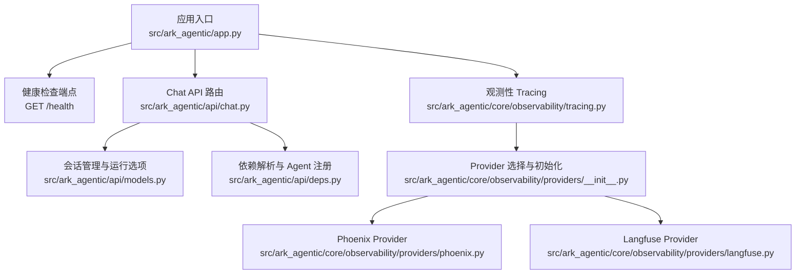
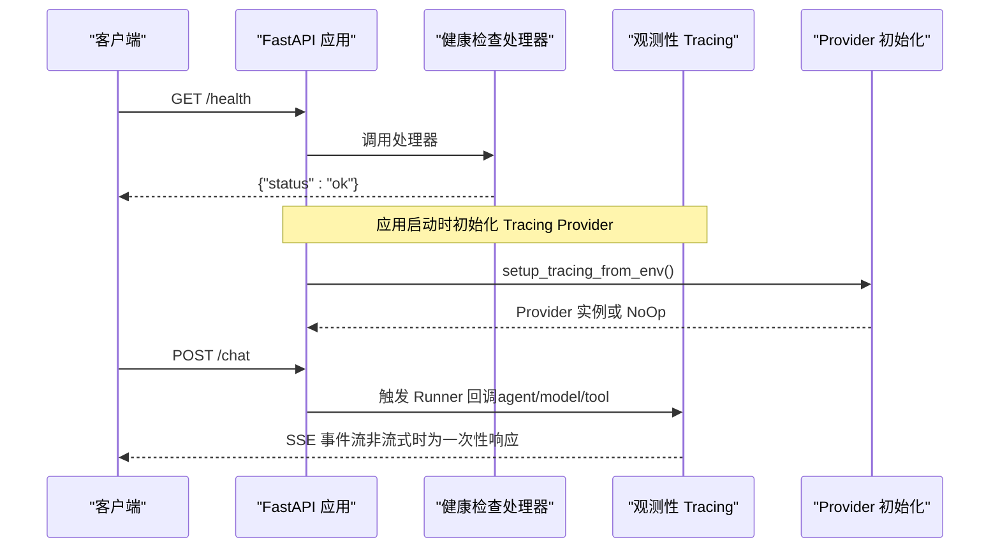
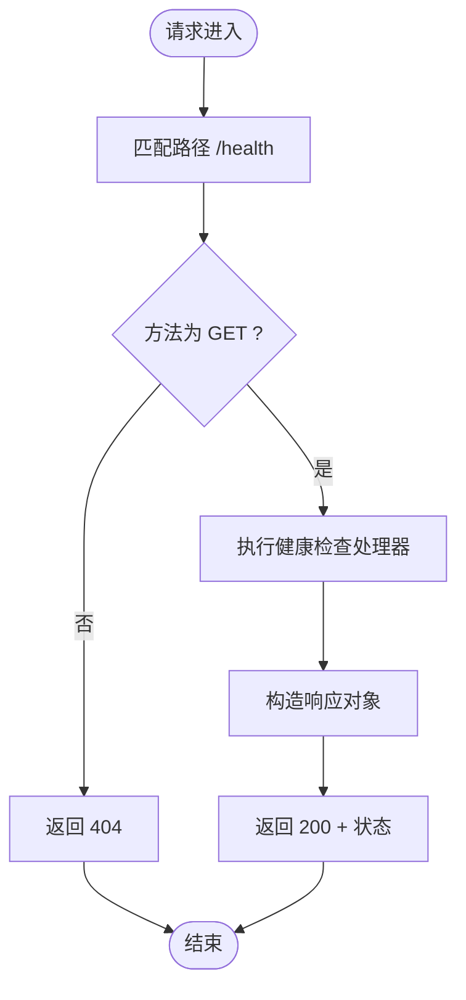
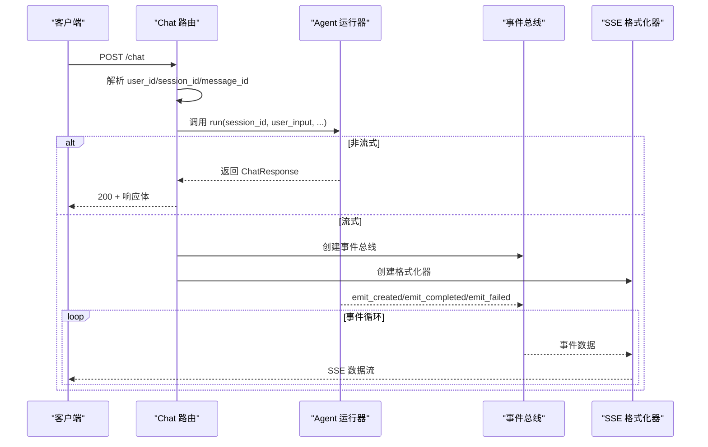
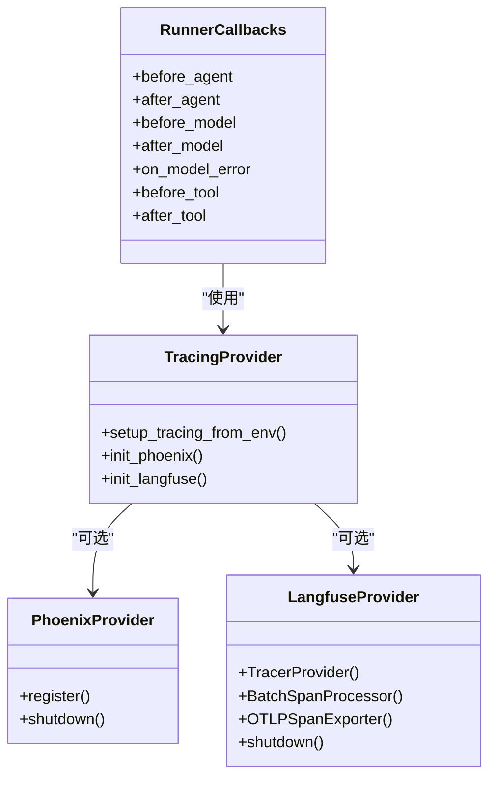
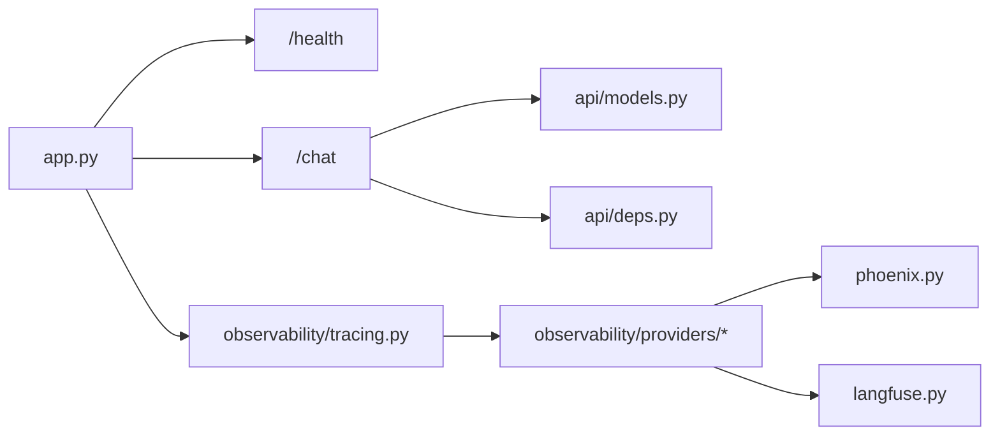

# 健康检查与监控

<cite>
**本文引用的文件**
- [src/ark_agentic/app.py](file://src/ark_agentic/app.py)
- [src/ark_agentic/api/chat.py](file://src/ark_agentic/api/chat.py)
- [src/ark_agentic/api/models.py](file://src/ark_agentic/api/models.py)
- [src/ark_agentic/api/deps.py](file://src/ark_agentic/api/deps.py)
- [src/ark_agentic/api/namespaces.py](file://src/ark_agentic/api/namespaces.py)
- [src/ark_agentic/core/observability/tracing.py](file://src/ark_agentic/core/observability/tracing.py)
- [src/ark_agentic/core/observability/providers/__init__.py](file://src/ark_agentic/core/observability/providers/__init__.py)
- [src/ark_agentic/core/observability/providers/phoenix.py](file://src/ark_agentic/core/observability/providers/phoenix.py)
- [src/ark_agentic/core/observability/providers/langfuse.py](file://src/ark_agentic/core/observability/providers/langfuse.py)
- [docs/securities/api.md](file://docs/securities/api.md)
- [postman/ark-agentic-api.postman_collection.json](file://postman/ark-agentic-api.postman_collection.json)
</cite>

## 目录
1. [简介](#简介)
2. [项目结构](#项目结构)
3. [核心组件](#核心组件)
4. [架构总览](#架构总览)
5. [详细组件分析](#详细组件分析)
6. [依赖关系分析](#依赖关系分析)
7. [性能考虑](#性能考虑)
8. [故障排查指南](#故障排查指南)
9. [结论](#结论)
10. [附录](#附录)

## 简介
本文件聚焦于健康检查与监控相关接口与能力，覆盖以下内容：
- /health 健康检查端点的使用方式与返回规范
- 观测性（Tracing）能力：OpenTelemetry 回调、Phoenix/Langfuse 提供者集成
- 性能监控指标：Token 使用量、调用耗时、工具调用统计
- 错误追踪与日志采集：异常属性注入、错误原因分类
- 与其他监控接口的关系：会话管理、通知推送（SSE）

## 项目结构
与健康检查和监控密切相关的模块分布如下：
- 应用入口与路由挂载：FastAPI 应用、/health 端点、静态页面与文档
- Chat API：会话管理、SSE 流式输出、运行参数与指标
- 观测性（Tracing）：Runner 生命周期回调、Provider 初始化与关闭
- Provider：Phoenix、Langfuse 环境驱动的初始化与导出

图表来源
- [src/ark_agentic/app.py:213-215](file://src/ark_agentic/app.py#L213-L215)
- [src/ark_agentic/api/chat.py:27-176](file://src/ark_agentic/api/chat.py#L27-L176)
- [src/ark_agentic/core/observability/tracing.py:227-481](file://src/ark_agentic/core/observability/tracing.py#L227-L481)
- [src/ark_agentic/core/observability/providers/__init__.py:19-36](file://src/ark_agentic/core/observability/providers/__init__.py#L19-L36)
- [src/ark_agentic/core/observability/providers/phoenix.py:36-77](file://src/ark_agentic/core/observability/providers/phoenix.py#L36-L77)
- [src/ark_agentic/core/observability/providers/langfuse.py:21-63](file://src/ark_agentic/core/observability/providers/langfuse.py#L21-L63)

章节来源
- [src/ark_agentic/app.py:137-249](file://src/ark_agentic/app.py#L137-L249)
- [src/ark_agentic/api/chat.py:1-177](file://src/ark_agentic/api/chat.py#L1-L177)
- [src/ark_agentic/core/observability/tracing.py:1-500](file://src/ark_agentic/core/observability/tracing.py#L1-L500)

## 核心组件
- 健康检查端点
  - 方法：GET
  - 路径：/health
  - 返回：固定 JSON 对象，包含状态字段
  - 用途：容器编排与负载均衡探活
- Chat API（与监控密切相关）
  - 支持流式与非流式响应
  - 自动会话创建与加载
  - 运行指标：prompt_tokens、completion_tokens、turns、tool_calls_count
  - SSE 输出：事件格式化与流式传输
- 观测性 Tracing
  - Runner 生命周期回调：agent/model/tool 阶段开始/结束、错误处理
  - 属性注入：用户ID、会话ID、模型名、工具参数、错误原因等
  - Provider 选择：Phoenix、Langfuse，或默认 NoOp
- Provider 集成
  - Phoenix：基于 Arize Phoenix 的 OTEL 注册
  - Langfuse：基于 OTLP HTTP 导出器的 Provider

章节来源
- [src/ark_agentic/app.py:213-215](file://src/ark_agentic/app.py#L213-L215)
- [src/ark_agentic/api/chat.py:27-176](file://src/ark_agentic/api/chat.py#L27-L176)
- [src/ark_agentic/core/observability/tracing.py:227-481](file://src/ark_agentic/core/observability/tracing.py#L227-L481)
- [src/ark_agentic/core/observability/providers/__init__.py:19-36](file://src/ark_agentic/core/observability/providers/__init__.py#L19-L36)
- [src/ark_agentic/core/observability/providers/phoenix.py:36-77](file://src/ark_agentic/core/observability/providers/phoenix.py#L36-L77)
- [src/ark_agentic/core/observability/providers/langfuse.py:21-63](file://src/ark_agentic/core/observability/providers/langfuse.py#L21-L63)

## 架构总览
下图展示健康检查与监控相关的关键交互路径。

图表来源
- [src/ark_agentic/app.py:213-215](file://src/ark_agentic/app.py#L213-L215)
- [src/ark_agentic/app.py:93-133](file://src/ark_agentic/app.py#L93-L133)
- [src/ark_agentic/core/observability/providers/__init__.py:19-36](file://src/ark_agentic/core/observability/providers/__init__.py#L19-L36)
- [src/ark_agentic/api/chat.py:27-176](file://src/ark_agentic/api/chat.py#L27-L176)
- [src/ark_agentic/core/observability/tracing.py:227-481](file://src/ark_agentic/core/observability/tracing.py#L227-L481)

## 详细组件分析

### 健康检查端点 /health
- 设计目标
  - 提供轻量级存活探针，便于容器编排系统进行健康检查
  - 返回固定结构，便于自动化脚本解析
- 行为特征
  - 无外部依赖，直接返回状态对象
  - 适合用于 readiness/liveness 探针
- 使用建议
  - 在 Kubernetes 中作为 livenessProbe/readinessProbe
  - 结合日志与告警策略，确保异常时能被及时发现

图表来源
- [src/ark_agentic/app.py:213-215](file://src/ark_agentic/app.py#L213-L215)

章节来源
- [src/ark_agentic/app.py:213-215](file://src/ark_agentic/app.py#L213-L215)
- [docs/securities/api.md:21-21](file://docs/securities/api.md#L21-L21)

### Chat API 与监控指标
- 会话管理
  - 支持从请求头或请求体解析 user_id、session_id、message_id
  - 自动创建/加载会话，保证跨 Agent 切换时的连续性
- 流式与非流式
  - 非流式：一次性返回 ChatResponse
  - 流式：SSE 事件流，事件格式化器负责序列化
- 监控指标
  - prompt_tokens、completion_tokens：提示与补全 Token 数
  - turns：对话轮次
  - tool_calls_count：工具调用次数
  - response_content_length：响应内容长度
  - finish_reason：模型完成原因
- 错误处理
  - 缺少 user_id 时返回 400
  - Agent 运行异常时记录日志并发送失败事件

图表来源
- [src/ark_agentic/api/chat.py:27-176](file://src/ark_agentic/api/chat.py#L27-L176)
- [src/ark_agentic/api/models.py:77-77](file://src/ark_agentic/api/models.py#L77-L77)
- [src/ark_agentic/api/deps.py:35-35](file://src/ark_agentic/api/deps.py#L35-L35)

章节来源
- [src/ark_agentic/api/chat.py:27-176](file://src/ark_agentic/api/chat.py#L27-L176)
- [src/ark_agentic/api/models.py:77-77](file://src/ark_agentic/api/models.py#L77-L77)
- [src/ark_agentic/api/deps.py:35-35](file://src/ark_agentic/api/deps.py#L35-L35)

### 观测性 Tracing 与错误追踪
- 回调生命周期
  - agent 阶段：开始/结束，注入用户ID、会话ID、Agent 名称、运行参数
  - model 阶段：开始/结束，注入消息数量、工具数量、Token 使用、完成原因
  - tool 阶段：开始/结束，注入工具名称、参数、结果类型、是否错误
  - 错误处理：on_model_error 回调，注入错误属性与原因
- 错误属性
  - error=true：标记错误
  - ark.error_type：异常类型
  - ark.error_message：异常消息
  - ark.error_reason：LLMError 原因枚举值
  - ark.error_model：涉及的模型名
- Provider 选择
  - Phoenix：通过环境变量 ENABLE_PHOENIX 或 PHOENIX_* 配置
  - Langfuse：通过 LANGFUSE_PUBLIC_KEY/SECRET_KEY 配置
  - 默认：OTel NoOp，零开销

图表来源
- [src/ark_agentic/core/observability/tracing.py:227-481](file://src/ark_agentic/core/observability/tracing.py#L227-L481)
- [src/ark_agentic/core/observability/providers/__init__.py:19-36](file://src/ark_agentic/core/observability/providers/__init__.py#L19-L36)
- [src/ark_agentic/core/observability/providers/phoenix.py:36-77](file://src/ark_agentic/core/observability/providers/phoenix.py#L36-L77)
- [src/ark_agentic/core/observability/providers/langfuse.py:21-63](file://src/ark_agentic/core/observability/providers/langfuse.py#L21-L63)

章节来源
- [src/ark_agentic/core/observability/tracing.py:148-222](file://src/ark_agentic/core/observability/tracing.py#L148-L222)
- [src/ark_agentic/core/observability/tracing.py:227-481](file://src/ark_agentic/core/observability/tracing.py#L227-L481)
- [src/ark_agentic/core/observability/providers/__init__.py:19-36](file://src/ark_agentic/core/observability/providers/__init__.py#L19-L36)
- [src/ark_agentic/core/observability/providers/phoenix.py:36-77](file://src/ark_agentic/core/observability/providers/phoenix.py#L36-L77)
- [src/ark_agentic/core/observability/providers/langfuse.py:21-63](file://src/ark_agentic/core/observability/providers/langfuse.py#L21-L63)

### 通知推送与监控关联
- 通知端点
  - GET /notifications/{agent_id}/{user_id}：拉取用户通知列表（可限制未读）
  - POST /notifications/{agent_id}/{user_id}/read：批量标记已读
  - GET /notifications/{agent_id}/{user_id}/stream：SSE 实时推送
- 与监控的关系
  - SSE 流式推送可用于实时上报任务状态、错误事件
  - 可结合 Tracing 属性记录通知分发链路与延迟

章节来源
- [src/ark_agentic/api/namespaces.py:39-61](file://src/ark_agentic/api/namespaces.py#L39-L61)

## 依赖关系分析
- 组件耦合
  - /health 与 Chat API 均由 FastAPI 应用统一挂载，低耦合
  - Chat API 依赖会话管理与运行选项定义
  - 观测性模块对 Provider 采用条件初始化，避免强依赖
- 外部依赖
  - Phoenix/Langfuse 依赖需按需安装
  - SSE 依赖事件总线与格式化器

图表来源
- [src/ark_agentic/app.py:162-164](file://src/ark_agentic/app.py#L162-L164)
- [src/ark_agentic/api/chat.py:19-20](file://src/ark_agentic/api/chat.py#L19-L20)
- [src/ark_agentic/core/observability/tracing.py:66-71](file://src/ark_agentic/core/observability/tracing.py#L66-L71)
- [src/ark_agentic/core/observability/providers/__init__.py:27-33](file://src/ark_agentic/core/observability/providers/__init__.py#L27-L33)

章节来源
- [src/ark_agentic/app.py:162-164](file://src/ark_agentic/app.py#L162-L164)
- [src/ark_agentic/api/chat.py:19-20](file://src/ark_agentic/api/chat.py#L19-L20)
- [src/ark_agentic/core/observability/tracing.py:66-71](file://src/ark_agentic/core/observability/tracing.py#L66-L71)
- [src/ark_agentic/core/observability/providers/__init__.py:27-33](file://src/ark_agentic/core/observability/providers/__init__.py#L27-L33)

## 性能考虑
- Tracing 开销
  - 默认 NoOp，不引入额外开销；启用 Provider 后按批导出
  - Phoenix/Langfuse 的批处理与自动注入可通过环境变量控制
- Chat 性能指标
  - prompt_tokens/completion_tokens：评估模型成本与效率
  - turns/tool_calls_count：衡量工具调用频率与对话复杂度
  - finish_reason：辅助识别截断或提前停止问题
- SSE 流式
  - 事件队列与超时控制避免阻塞，适合长时任务状态上报

## 故障排查指南
- /health 返回异常
  - 检查应用是否正常启动（日志级别、CORS、静态资源）
  - 确认探针路径与方法正确
- Chat 400 错误
  - 缺少 user_id（请求体或请求头 x-ark-user-id）
- Chat 运行异常
  - 查看运行回调中的错误属性（ark.error_type、ark.error_reason）
  - 检查 Provider 初始化日志（Phoenix/Langfuse 依赖缺失会打印警告）
- SSE 不可用
  - 确认客户端支持 SSE，检查网络代理与防火墙
  - 关注事件总线与格式化器的异常日志

章节来源
- [src/ark_agentic/app.py:213-215](file://src/ark_agentic/app.py#L213-L215)
- [src/ark_agentic/api/chat.py:42-43](file://src/ark_agentic/api/chat.py#L42-L43)
- [src/ark_agentic/core/observability/tracing.py:175-181](file://src/ark_agentic/core/observability/tracing.py#L175-L181)
- [src/ark_agentic/core/observability/providers/phoenix.py:51-55](file://src/ark_agentic/core/observability/providers/phoenix.py#L51-L55)

## 结论
- /health 提供了简单可靠的健康检查能力，适合作为探活端点
- Chat API 将性能指标与错误追踪内嵌于运行回调与响应结构中，便于监控与诊断
- 观测性模块通过 Provider 机制实现灵活扩展，支持 Phoenix 与 Langfuse
- 建议在生产环境中启用合适的 Provider，并结合 Token 指标与错误原因进行持续优化

## 附录
- API 端点清单（节选）
  - GET /health：健康检查
  - POST /chat：消息交互（支持流式）
  - GET /sessions、POST /sessions：会话管理
  - GET /notifications/{agent_id}/{user_id}：通知列表
  - POST /notifications/{agent_id}/{user_id}/read：标记已读
  - GET /notifications/{agent_id}/{user_id}/stream：SSE 实时推送
- Postman 集合
  - 可在 Postman 中导入集合文件进行接口测试与监控验证

章节来源
- [docs/securities/api.md:14-21](file://docs/securities/api.md#L14-L21)
- [postman/ark-agentic-api.postman_collection.json](file://postman/ark-agentic-api.postman_collection.json)